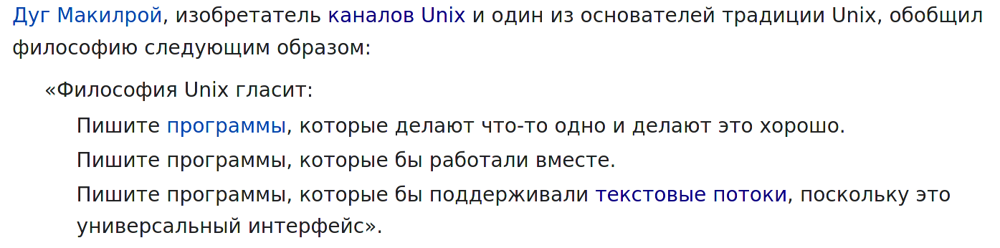
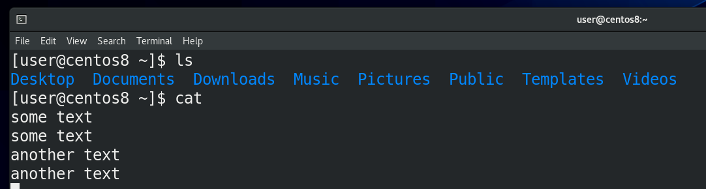
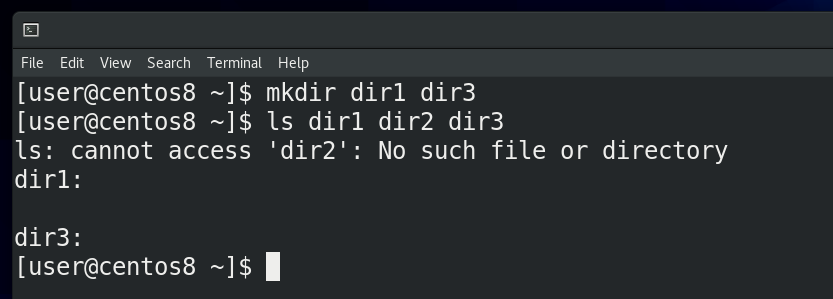
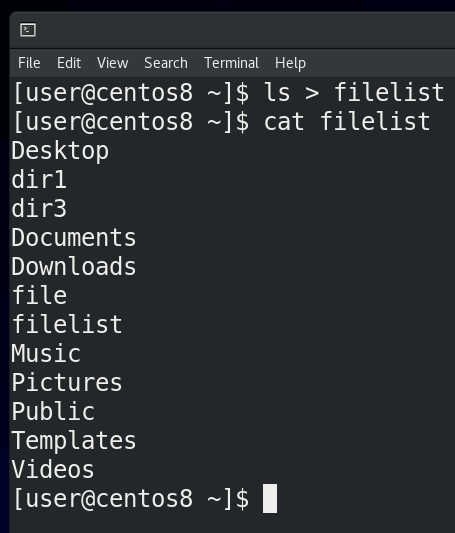
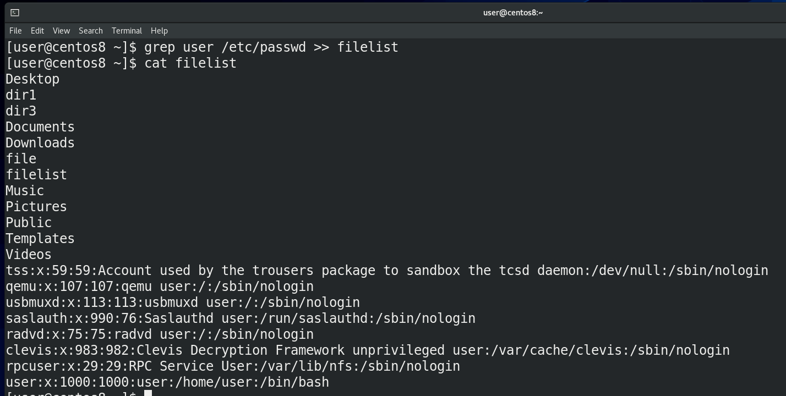
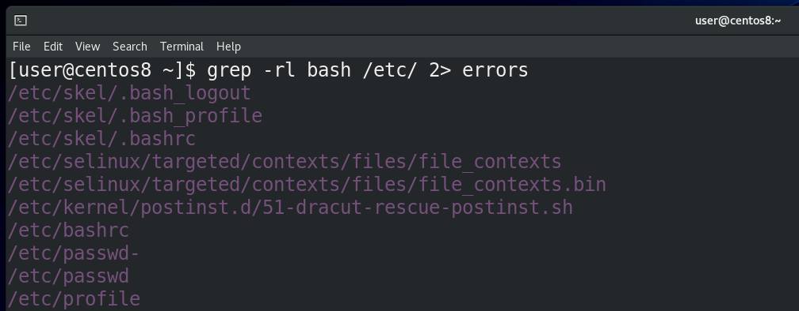
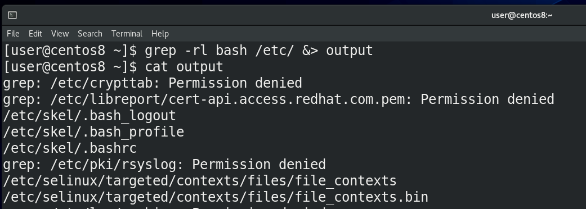
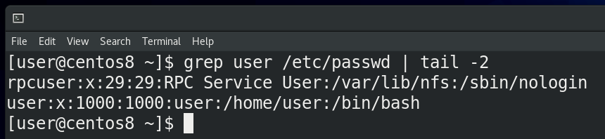
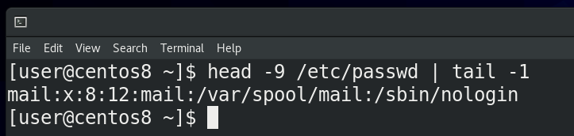
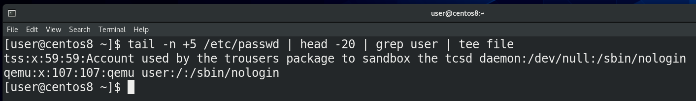

Если открыть в википедии страничку с названием “Философия Unix”, можно заметить 3 пункта:



Второй и третий пункты можно связать – если программы будут иметь возможность обмениваться текстом, то, теоретически, возможно сделать так, чтобы они работали вместе.

```
A + B = C
C – D = E
```

Представьте себе 2 программы – одна умеет только складывать два числа, а другая только отнимать. Если вам нужно решить уравнение, в котором сначала сложить два числа, а потом из суммы отнять третье число, то вам нужно было бы выполнить первую программу, посмотреть сумму, а потом выполнить вторую программу с полученным числом. Но было бы здорово, если первая программа смогла передать свой результат, то есть сумму, второй программе, без вашего участия. Для того, чтобы команды могли работать между собой, в UNIX-подобных системах есть так называемые стандартные потоки - стандартный ввод, стандартный вывод и стандартный вывод ошибок. Вообще, эти потоки существуют независимо от того, объединяете вы команды или нет, и мы с ними уже сталкивались.

Первый поток – это стандартный ввод - называется stdin, то есть то, откуда вводятся данные, например, c клавиатуры. Из того что мы делали - мы вводили какие-то данные с клавиатуры в эмулятор терминала.



Второй поток – стандартный вывод - называется stdout, то есть то, что выводит команда. Например, если мы пишем ls – мы видим на экране какую-то информацию – вот то что появляется на экране – это и есть стандартный вывод. man по cat говорит, что если запустить команду cat, не указав файл, то по умолчанию он будет копировать стандартный ввод в стандартный вывод. То есть, вы ввели какой-то текст – это stdin, а cat вывела этот текст – stdout.



Ну и третий поток – это стандартный вывод ошибки – stderr. Многие программы на Linux заточены под то, чтобы особо реагировать на ошибки, отделять их от стандартного вывода. Я создаю 2 директории – dir1 и dir3, и запускаю ls на 3 директории ls dir1 dir2 dir3. Как видите, команда ls для второй директории вывела сообщение об ошибке – что такой директории или файла нет, и вывела информацию о существующих директориях. Мы, как читатели, можем не обратить внимания на ошибку, но другие программы, например, тот же bash, видят stdout и stderr по разному.

```
(stdin) A + B = C (stdout)
(stdin) C – D = E (stdout)
```
Вернёмся к нашему уравнению. Теперь мы понимаем, что для отправки результата первой программы, то есть суммы (стандартного вывода), во вторую программу в качестве стандартного ввода, нам нужно скопировать stdout первой команды в stdin второй команды. А чтобы направлять потоки нам нужны каналы, ну или трубопровод. Возвращаясь на страницу философии Unix, мы увидим - человек, который говорил нам про 3 пункта философии – Макилрой – является изобретателем каналов Unix. Эти каналы, часто называемые конвейером,  позволяют управлять стандартными потоками. Мы можем делать это с помощью специальных символов.

Эти символы как направления. Символ стандартного ввода (stdin) – знак меньше (<).  Обычно под stdin мы подразумеваем то, что вводим с клавиатуры. Но вместо клавиатуры может быть, допустим, содержимое текстового файла. С пройденными командами получится не совсем наглядно. Поэтому я покажу на примере команды mail, которая отправляет письма. Я могу написать mail user < file. Если бы я не использовал перенаправление stdin (< file), после нажатия Enter я написал бы письмо вручную. А так - направил команде mail содержимое файла. Но направление стандартного ввода используется не так часто.



Для направления стандартного вывода используется знак больше (>). Мы можем направлять вывод команд не на экран, а в какой-нибудь файл. Допустим, давайте отправим вывод команды ls в файл – ls > filelist; cat filelist. Как вы заметили, на экране теперь ls ничего не показал, но то что он должен был показать, сохранилось в файле.



Когда мы используем знак больше - ls > filelist - cодержимое файла перезаписывается. Но я могу не перезаписывать файл, а добавлять в него текст. Для этого нужно два знака больше (>>). Для примера, добавим в существующий файл также содержимое команды grep user /etc/passwd >> filelist; cat filelist. Как видите, файл не перезаписался, просто внизу появился вывод команды grep. grep bash /etc/passwd > filelist – файл перезаписался, grep user /etc/passwd >> filelist – вывод grep добавился в тот же файл.



Для направления стандартного вывода ошибок используется знак - 2>. Помните, я показывал рекурсивный поиск с помощью grep? Тогда у нас была куча ошибок с доступом к файлам. Теперь мы можем сделать так – grep -rl bash /etc 2> errors. Все ошибки доступа  направились в файл errors (cat errors), а на экране только список нужных файлов, то есть stdout. Если сообщения об ошибках нас не интересуют, мы можем направить их не в файл, а в эдакую чёрную дыру - /dev/null. Мы о ней ещё поговорим. А пока пример с тем же grep - grep -rl bash /etc 2> /dev/null - или - ls dir1 dir2 dir3 2> /dev/null.  Также мы можем разные потоки направлять в разные места, допустим grep -rl bash /etc/ > filelist 2> error.



Как вы, возможно, заметили, если направить в файл stdout (ls dir1 dir2 dir3 > file), то в командной строке будет stderr. Если направить stderr (ls dir1 dir2 dir3 2> file), то мы увидим stdout. Если ничего не направлять, на экране мы увидим оба потока. А что делать, если мы хотим сохранить в файле и stdout, и stderr? Для этого есть символ амперсанд (&) – grep -rl bash etc &> output. Если посмотреть, то всё будет ровно так, как было бы в командной строке - cat output.

```
(stdin) A + B = C (stdout)
(stdin) C – D = E (stdout)
```

Возвращаясь к нашему уравнению, всё что мы делали выше – направляли потоки в файлы. А в уравнении нам нужно направить stdout в stdin. Для этого используется другой символ – прямая вертикальная линия - |. Её часто называют пайп, то есть труба.



Для примера возьмём команду grep user /etc/passwd, которая покажет пару строк, а затем, поставив вертикальную линию и написав tail -2, мы получим только последние две строчки из того, что показал бы grep. То есть, сначала мы получили стандартный вывод от команды grep и превратили его в стандартный ввод для команды tail.



Или, допустим, я хочу увидеть 9 строчку файла /etc/passwd – я вывожу первые 9 строчек с помощью head -9, а потом, с помощью tail -1 (head -9 | tail -1), показываю последнюю строчку от вывода предыдущей команды, то есть 9-ую.



Ещё один пример – я хочу вывести строчки с 5-ой до 25 и среди них найти слово user и сохранить это в файле – я пишу tail -n +5 /etc/passwd, то есть вывожу всё что ниже 5 строки. Дальше из полученного результата вырезаю первые 20 строк (head -20), а потом в полученном результате ищу слово user (grep user) и направляю в файл – tail -n +5 /etc/passwd | head -20 | grep user >  file. Если вы хотите, чтобы результат одновременно выводился в командную строку и записывался в файл, то можете использовать команду tee - tail -n +5 /etc/passwd | head -20 | grep user | tee file.

Как вы заметили, вывод можно направлять от одной команды к другой. И, ставя много таких пайпов, мы можем с помощью простых команд решать сложные задачи.  Конвейер вместе с функционалом интерпретатора даёт возможность нам решать такие задачи, для которых нет готовых программ.