

Как мы уже выяснили, программы хранятся в файловой системе на накопителе – т.е. жёстком диске или ssd.  Когда мы запускаем программу, она загружается в оперативную память, так как скорость чтения с жёсткого диска или даже ssd относительно низкая, а процессор работает на больших скоростях. Как правило, большие программы загружаются в оперативную память не полностью, а по мере необходимости. При этом, для каждой программы создаётся иллюзия, что она – единственная в оперативной памяти, то есть для неё создаётся так называемая “виртуальная память”.  Также программы при запуске загружают какие-то файлы, будь то файлы настроек или пользовательские файлы – как например, если мы запускаем nano file, то в память загружаются как сам /usr/bin/nano, его настройки - /etc/nanorc и ~/.nanorc, всякие библиотеки, необходимые для работы nano и сам файл, который мы открываем. Кроме этого также запускаемой программе передаются переменные окружения и ещё много всего. Ну и находясь в оперативке, эта программа делает какие-то вычисления с помощью центрального процессора, обрабатывает данные и сохраняет на диске. И совокупность всего этого называется процессом.

Иногда одной программе нужно бывает выполнить несколько операций параллельно. Представьте себе сложное математическое уравнение – есть всякие скобки, умножения и прочее. Такое уравнение можно разделить на составляющие и компьютер может разом выполнить все составляющие, а потом, используя результаты, получить простое уравнение и выполнить его. Или, допустим, веб сервер – к нему обращаются много клиентов, и каждого из них он должен обслужить и желательно параллельно. Для этого один процесс может разделяться на так называемые потоки – все они используют общую виртуальную память. У каждого процесса есть как минимум один поток.

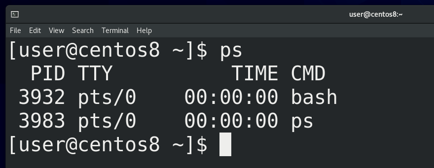

И так, выполняемая программа – это процесс. Начнём с того, что администратору важно видеть список процессов. Для этого есть несколько способов, начнём с утилиты ps. Если просто запустить ps, мы увидим список процессов, запущенных в этом терминале. Как вы заметили, вывелось 2 строчки – bash и ps. При том, что ps у нас выполнился за какие-то доли секунды, он у нас всё равно виден в выводе – потому что он делает эдакий скриншот процессов именно в момент выполнения, поэтому и видит сам себя.

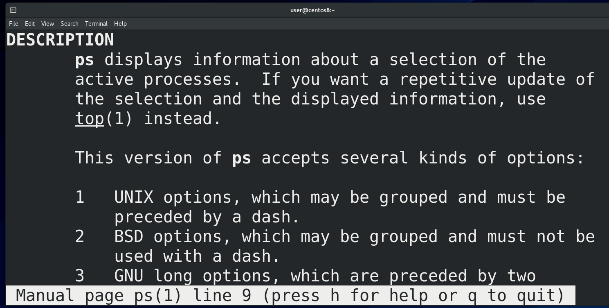

Вообще, ps работает с 3 видами ключей: юниксовыми – они обычно начинаются на один дефис (-), BSD-шные – вовсе без дефиса и GNU-шные – как правило это слова, поэтому, чтобы не счесть их за комбинацию букв, используется два дефиса. Если посмотреть документацию - man ps - можно заметить очень много дублирующихся ключей. Но документация по ps огромная, да и все ключи знать не нужно. Достаточно выучить какую-то одну комбинацию,  которая подойдёт в большинстве случаев - ps -ef, а если вам понадобится что-то конкретное, то всегда можно погуглить или найти в мане.

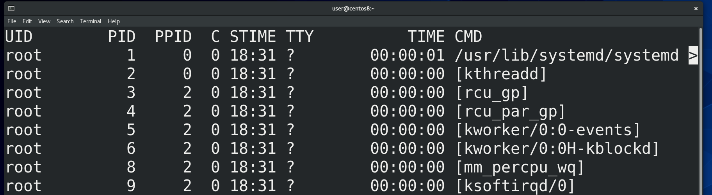

Как видите, вывод у ps довольно большой и не помещается на экране, поэтому урезается сбоку. Чтобы мы могли нормально прочесть, мы можем передать вывод ps команде less. Правда по умолчанию less переносит текст на новые строки, из-за чего сбиваются столбцы, поэтому less лучше использовать с ключом -S, который не переносит строки. В итоге – ps -ef | less -S.

Давайте разберём, что означают ключи и как читать вывод. Ключ -e выводит все процессы всех пользователей - ps -e. Да, процессы запускаются от имени пользователей. От этого зависит какие права будут у процесса. Допустим, если я запускаю программу nano от пользователя user, то программа сможет работать с моими файлами. А ключ f - ps -f - показывает чуть больше информации о процессе. Давайте пройдёмся по столбикам - ps -ef | less -S.

Первое – UID – user id - пользователь, который запустил процесс.  Большинство процессов в системе запущены от пользователя root – его также называют суперпользователем – это юзер, у которого есть все права на систему. По возможности, люди стараются не использовать рута везде. Если у программы будет какой-то баг или уязвимость и если она запущена от рута, то программа может сильно навредить системе. Поэтому для программ, которые не требуют особых прав, обычно создают сервисных пользователей. Как правило при установке программы она сама всё это настраивает. Ну и наконец у нас тут есть программы, запущенные от нашего пользователя. Как видите, я вроде ничего кроме эмулятора терминала не запускал, а в системе уже пару сотен процессов.

Второй столбик – PID – process id – идентификатор процесса. Он уникальный для каждого процесса, но совпадает для потоков одного процесса. Когда программа завершается, она освобождает номер и через какое-то время другая программа может использовать этот номер. С помощью этих номеров мы можем управлять процессами.

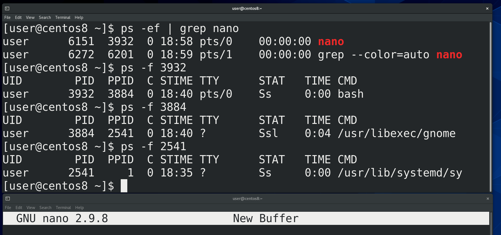

Третий столбик – PPID – parent process id – идентификатор родительского процесса.  Почти все процессы в системе были запущены каким-то другим процессом. Допустим, когда мы запускаем эмулятор терминала, а в нём nano – то родительским процессом для nano является bash, который запущен в этом эмуляторе терминала - ps -ef | grep nano. Родительским процессом для этого bash - ps -f ppid - является gnome - процесс рабочего окружения. Родительским процессом для него является systemd - первый процесс. О systemd мы ещё поговорим.

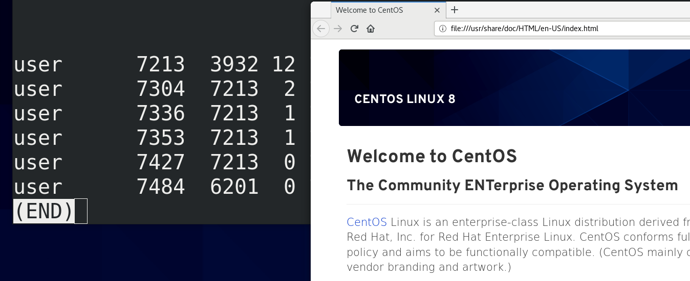

Четвёртый столбик – C – использование процессора данным процессом. Много где у нас нули, но давайте запустим какое-нибудь тяжёлое приложение, допустим, firefox, найдём этот процесс - ps -ef | grep firefox | less -S - и увидим, что для него это значение отличается от нуля.

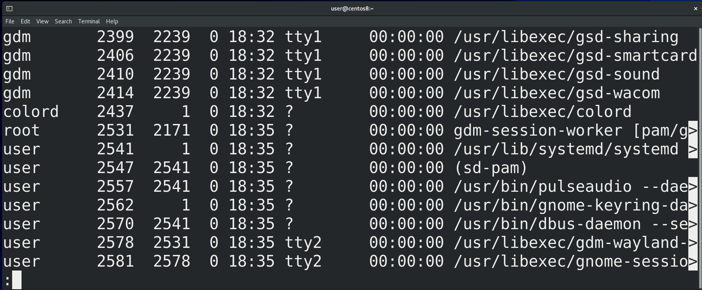

Дальше - TTY – от слова телетайп. На хабре есть неплохая [статья](https://habr.com/ru/post/460257/), объясняющая разницу между телетайпом, консолью, терминалом и т.п. А ps в этом столбике говорит, с каким терминалом ассоциируется данный процесс.  Обычно, процесс, запущенный системой и не требующий графики, вывода информации на экран, не связан ни с каким терминалом. Процессы, требующие графики, завязаны на каком-нибудь виртуальном терминале – о них мы говорили ранее. Можно заметить, что тут указано tty1 и tty2 – если нажать правый ctrl + f1 или ctrl+f2, можно увидеть, что именно здесь у нас запущен графический интерфейс. При переходе на ctrl+f3 и далее открывается виртуальный терминал. А для эмуляторов терминала здесь могут быть значения pts/0, pts/1, pts/2 и т.п.

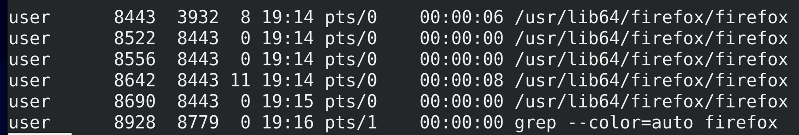

Ещё одно поле – TIME – это сколько времени процессор потратил на работу с данным процессом. Вы можете заметить, что здесь сплошные нули – потому что большинство этих процессов не требуют и секунды процессорного времени. Но если немного поработать с тем же браузером, то это время будет расти - ps -ef | grep firefox. Кстати, чтобы мне не приходилось постоянно запускать эту команду, я могу использовать команду watсh – watch “ps -ef | grep firefox”. Эта команда будет каждые 2 секунды запускать указанную команду. И так мы видим, что параметр TIME для нашего браузера постоянно увеличивается.

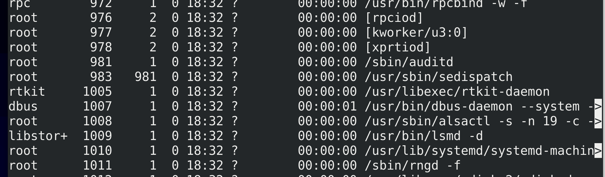

Ну и последнее – CMD – это команда, которая запустила процесс. Некоторые значения в квадратных скобках – для таких процессов ps не смог найти аргументов – обычно это процессы самого ядра.

Ладно, с выводом ps разобрались. Теперь мы знаем, где найти информацию о процессах. Но, помните, я говорил, что в Unix подобных системах придерживаются идеи “Всё есть файл”? И даже процессы у нас представлены в виде файлов. Но хранить информацию о процессах на жёстком диске нецелесообразно – какие-то процессы существуют доли секунд, какие-то появляются и удаляются сотнями – жёсткий диск не подходит для такого. А вот в оперативной памяти информацию о процессах можно спокойно хранить и представлять в виде файлов. Но раз уж речь идёт о файлах, то нам нужна файловая система. И вот ядро действительно создаёт так называемую виртуальную файловую систему, которая существует только в оперативной памяти.

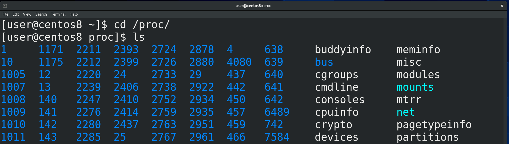

Вообще, этих виртуальных файловых систем несколько, они используются для разных задач,  мы о них поговорим в другой раз. Сейчас нас интересует файловая система procfs. Она примонтирована в директорию /proc - cd /proc. Если посмотреть содержимое этой директории -ls - мы увидим кучу директорий и файлов. Директории вам ничего не напоминают? Именно, это  номера процессов, т.е. pid-ы. Ядро операционной системы генерирует эту информацию налету, стоит нам посмотреть – мы увидим актуальную информацию.

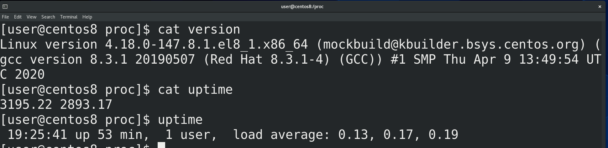

В этой директории кроме директорий процессов есть много других файлов – допустим, version - сat version – показывает нам информацию о версии ядра или uptime - cat uptime – информацию о том, сколько секунд включена система. Ну в секундах непонятно, поэтому легче использовать утилиту uptime. Кстати, постарайтесь самостоятельно найти, что означает второе значение в файле /proc/uptime и напишите в комментариях так, чтобы было понятно всем.

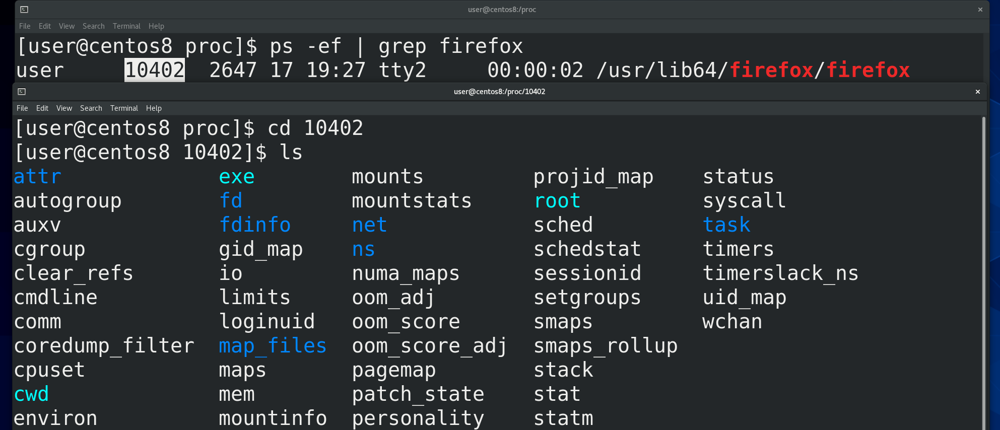

Ну и давайте посмотрим, что же такого в директориях процессов. Найдём pid процесса, допустим того-же firefox - ps -ef | grep firefox - и зайдём в эту директорию - сd pid; ls. Тут у нас тоже куча файлов, которые относятся к нашему процессу. Эти файлы нужны не столько для людей, сколько для программ.

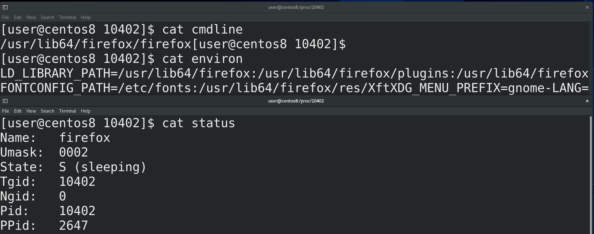

Какие-то из этих файлов и мы можем прочесть. Например, cmdline - cat cmdline. Тут отображена команда, которая запустила процесс. Или environ - cat environ - те переменные, которые передались процессу при запуске. Или status - cat status . Какие-то из этих строчек понятны, а какие-то без гугла не разберёшь. Знать всё это не нужно, но, со временем, углубляясь в теорию или сталкиваясь с какими-то проблемами, вы начнёте разбираться в этих файлах.
