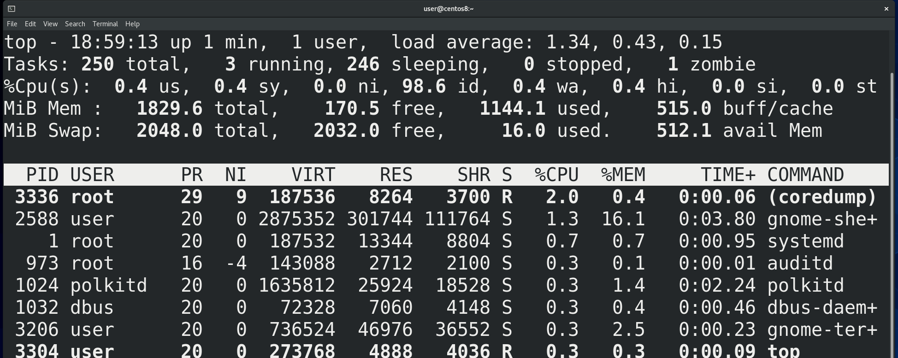
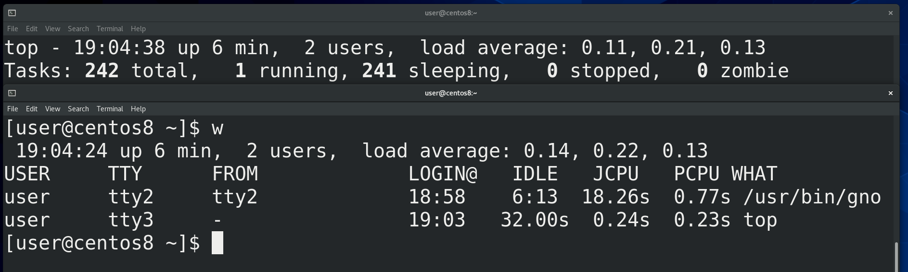
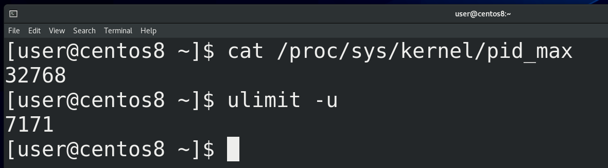
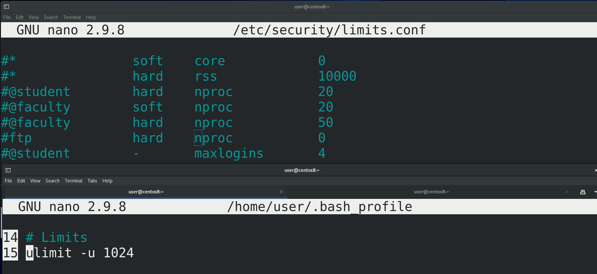
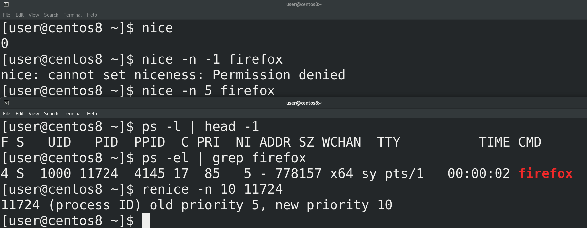
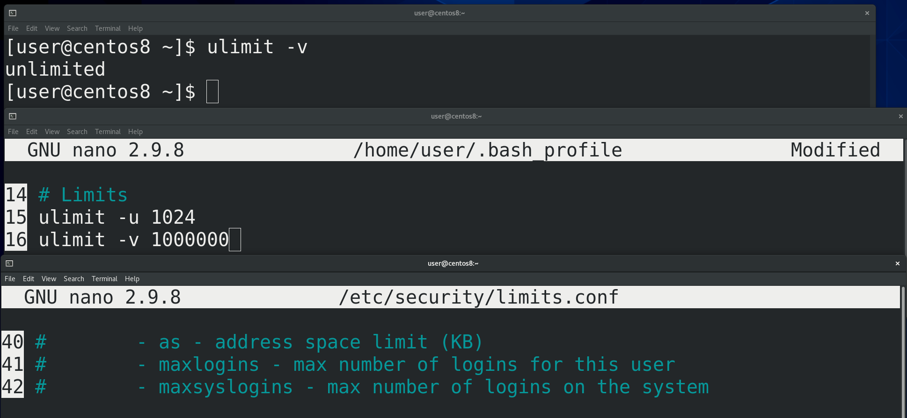
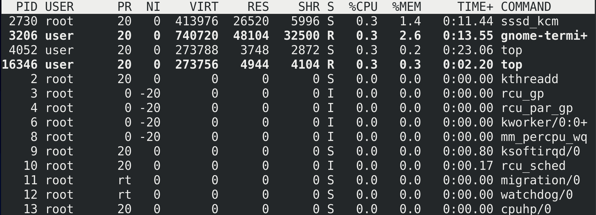
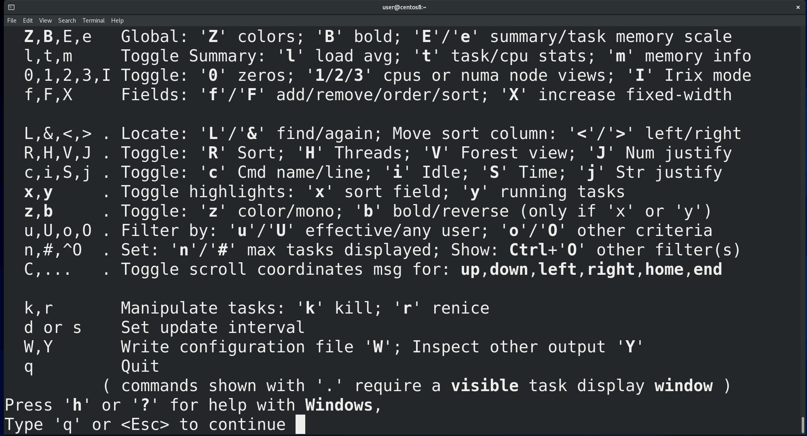
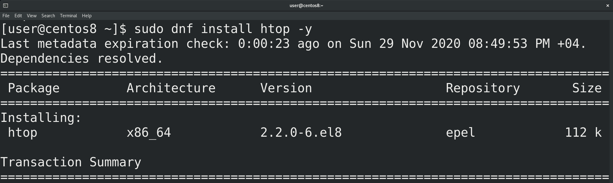
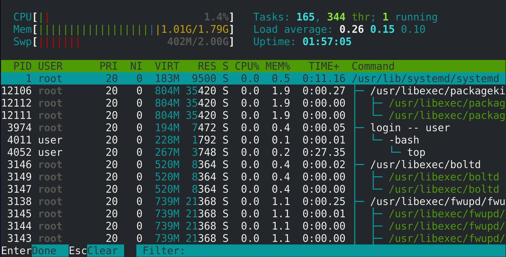



Обычно процессы появляются, делают свою работу и завершаются не требуя никакого внимания. Но бывают случаи, когда администратору все же следует вмешаться. Давайте разберём пару таких ситуаций. Самая популярная – зависание процесса или системы. Я думаю все сталкивались с такими ситуациями, когда какой-то процесс начинает использовать слишком много оперативной памяти или ресурсов процессора. Это приводит к тому, что каким-то другим процессам, той же оболочке, перестаёт хватать ресурсов и всё начинает зависать. Чтобы решить проблему, сначала нужно понять, какой процесс во всём виноват. Для этого нужно  увидеть список процессов, которые используют большую часть ресурсов. Это нам покажет утилита top.

Наверху отображается общая информация по системе. Давайте пройдёмся по каждому из значений. Первая строчка – вывод утилиты uptime:

1. Текущее время в системе

2. Сколько времени система включена

3. Хоть тут и написано user, подразумевается количество залогиненных сессий. Это могут быть как сессии одного пользователя, так и других.

Эмулятор терминала даёт нам оболочку без входа, т.е. в ней мы не логинимся, а вот виртуальный терминал – оболочку со входом. Давайте, для примера, я залогинюсь тем же пользователем в виртуальной терминале (ctrl+alt+f3). Теперь здесь отображается 2 пользователя. Кстати, информацию о залогиненных пользователях можно увидеть с помощью утилиты w.

4. Среднее значение загрузки системы за минуту, 5 минут и 15 минут. Есть свои нюансы подсчёта этого значения, рекомендую почитать [статью](https://ru.wikipedia.org/wiki/Load_Average) на википедии.

На второй строчке информация о количестве процессов:

1. Сколько всего запущенных процессов
2. Сколько процессов выполняется в данный момент
3. Сколько процессов просто спят, например, в ожидании каких-то данных
4. Сколько процессов остановлены. Вообще, процессы можно останавливать. В этот момент они всё ещё находятся в оперативке, но перестают посылать код на процессор – просто ничего не делают. Допустим, когда несколько программ пишут данные на диск, то у диска перестаёт хватать скорости. Вы можете временно остановить какие-то из программ, чтобы другие ускорили свою работу. Но нужно понимать, что это очень специфично, и разные программы могут по разному на такое реагировать. Допустим, если программа работает с сетью и её остановить, то скорее всего сетевое соединение прервётся. Как останавливать программы мы разберём чуть позже.

5. Сколько зомби процессов. Когда один процесс запускает другой, то он является для него родительским процессом, а запущенный – дочерним. Так вот,  когда дочерний процесс выполнит свою задачу, он умирает, держа в руках табличку со статусом завершения, мол, всё ок или не ок. То есть передаёт родительскому процессу статус выхода. Такой процесс называется зомби. При этом родительский процесс должен прочитать эту табличку, тем самым отпустить зомби процесс с миром. Зомби процессы не используют никаких ресурсов, просто пока родитель не прочтёт статус, они всё ещё числятся с таблице процессов. Но если родительская программа плохо написана, постоянно создаёт дочерние процессы, с которыми не прощается, то со временем таблица будет заполняться зомби процессами. А количество процессов в таблице ограничено. Для 32-битных систем максимально может быть примерно 32 тысячи записей, а для 64 битных – 4 миллиона. Но это значение можно поставить и поменьше. Увидеть текущий максимум можно взглянув на файл cat /proc/sys/kernel/pid_max. Обычно, для пользователей ставят своё ограничение на количество процессов – это можно увидеть с помощью команды ulimit -u. Ограничение у пользователей ставится, чтобы какой-то один пользователь не забил всю таблицу, либо не запустил слишком много процессов . Ведь когда таблица забита, например, теми же зомби процессами – то ничего сделать с системой не получится, потому что не получится создать новый процесс. Остаётся разве что по жёсткому перезагрузить систему.

Чтобы ограничить количество процессов у пользователя, нужно в домашней директории этого пользователя в файле ~/.bash_profile выставить значение, например, ulimit -u 1024. Но обычно этот файл может редактировать пользователь, и, если у вас много пользователей или вы не доверяете ему, то, как правило, ограничения устанавливаются в файле /etc/security/limits.conf, либо внутри директории /etc/security/limits.d/ создаётся файл, заканчивающийся на .conf. Пример есть в файле /etc/security/limits.conf. Нас интересует параметр nproc – number of processes – количество процессов. Это всё превентивные меры, которые защищают работу самой системы. Но если всё же у какого-то пользователя забилась таблица  процессов и он не может запускать новые, то нужно избавляться от родительского процесса. Мы это рассмотрим чуть позже.

На третьей строчке немного информации про использование процессора. Она отображается в процентах. По сути это процент времени, которое процессор потратил на те или иные задачи в промежуток времени обновления информации в top,  по умолчанию это 3 секунды. Немного запутано, но на первом примере, надеюсь, станет понятнее.

1. us – это user cpu time, т.е. время, потраченное на user space. Под user space подразумевается пользовательское пространство. И пусть вас не путает слово user, речь идёт о всех программах, кроме ядра. Для ядра есть пространство ядра – kernel space. Допустим, если взять веб сервер, то сама программа веб сервера, браузер, всякие утилиты – всё это user space. А ядро при этом отвечает за работу с сетью – это kernel space. Так вот, первый параметр – время, выделенное процессором на работу user space программ. Допустим, из 3 секунд полторы секунды процессор потратил на выполнение кода веб сервера – то тут значение будет 50%. Но нужно понимать, что процессор не уделяет все эти полторы секунды чисто одному процессу, какие-то доли секунд на один процесс, какие-то доли секунд на другой, и вот суммарно на user-space программы тратится сколько-то процентов времени.

2. sy – system cpu time – собственно, время, потраченное на kernel space.

3. ni – nice cpu time – время, потраченное на процессы с низким приоритетом. Процессов в системе много, каждый из них выполняет свою задачу – какая-то из них важная и нужна срочно, какая-то нет. Например, у меня рендерится видео и тут мне по работе присылают кучу документов в сжатом архиве. Мне нужно всё это разархивировать, поработать и заархивировать. Но оба этих процесса - рендеринг и архивация/сжатие - требуют много процессорного времени, поэтому мне придётся либо остановить рендеринг, либо долго ждать, пока разархивируется файл. Но, используя приоритеты, я могу сказать, что пусть рендеринг займёт чуть больше времени, мне срочно нужно выполнить новый процесс. Для выставления приоритетов используется утилита nice и числа от -20 до 19. nice в переводе – вежливый, поэтому чем больше число, тем “вежливее” программа. Т.е. программа с приоритетом 19 будет уступать процессорное время другим процессам. Таким образом, -20 это наивысший приоритет, а 19 это низший приоритет.

Приоритет по умолчанию – 0. Это можно увидеть просто выполнив команду nice. Причём, более высокий приоритет, например, -1, -2, обычный пользователь не может задать, а вот приоритет пониже можно. Например, чтобы запустить firefox с приоритетом 5, я пишу nice -n 5 firefox. Чтобы посмотреть текущий приоритет, я использую ps -el. Допустим, ps -el | grep firefox. Обратите внимание, что 5 указано в столбике NI – это niceness – вежливость. А слева от него написано PRI – приоритет – и он отличается от того, что мы указывали в утилите nice. Это потому, что в nice мы указываем желаемый приоритет программы, но во время работы ядро распределяет приоритеты по своей шкале. Поэтому параметр priority показывает текущий приоритет в ядре, а nice – заданный приоритет. Если же программа уже запущена, её вежливость можно изменить с помощью renice. Причём, всегда можно повысить вежливость, тем самым уменьшив приоритет, если, конечно, процесс запущен от вашего пользователя. Но для повышения приоритета нужны права суперпользователя. Пример утилиты renice - renice -n 10 pid. Обратите внимание, что здесь я использую идентификатор процесса.

4. id – от слова idle - время, проведённое в ожидании. Как вы видите, большую часть времени процессор  простаивает в ожидании программ.

5. wa – input output wait – время, потраченное процессором на ожидание чтения или записи на диск. Например, какая-то программа работает и в какой-то момент ей нужно записать данные на диск. Это занимает время, и, пока это происходит, процессор простаивает. На самом деле не совсем простаивает, он может и другими процессами заняться, но, в любом случае, для данного процесса он простаивает.

6.  hi – hardware interrupts – аппаратные прерывания. Когда какое-то оборудование, допустим, жёсткий диск или сетевая карта, пытаются сообщить процессору о каком-то событии, оно посылает процессору сигнал, называемый аппаратным прерыванием. Собственно этот параметр в top – время процессора, потраченное для аппаратных прерываний.

7. si – software interrupts – это уже программные прерывания.

8. st – steal time – это параметр, относящийся к виртуальным машинам – и говорит он о том, какое время реальный процессор был недоступен виртуальной машине, потому что был занят гипервизором или другими виртуальными машинами.

На четвёртой строчке у нас немного про оперативную память. Как видите, здесь написано MiB Mem – это мебибайты. Если вы раньше считали, что в одном килобайте 1024 байт, а в одном мегабайте – 1024 килобайт – это упрощение информатики. [На самом деле](https://ru.wikipedia.org/wiki/%D0%94%D0%B2%D0%BE%D0%B8%D1%87%D0%BD%D1%8B%D0%B5_%D0%BF%D1%80%D0%B8%D1%81%D1%82%D0%B0%D0%B2%D0%BA%D0%B8), в одном килобайте 1000 байт, а в одном мегабайте – 1000 килобайт. А вот 1024 относится к кибибайтам и мебибайтам. Но эти значения не сильно отличаются и можно догадаться, что 1800 с лишним мебибайт – это 2 гигабайта оперативки.

1. total – сколько всего оперативки

2. free – сколько оперативки свободно. Вас может смутить, что тут очень мало, но, не всё так просто и нужно смотреть третье значение

3. used – сколько оперативки используется. Казалось бы, математика простая – от общего числа отними используемое – и получится свободное – но тут не получается. Есть даже специальный [сайт](https://www.linuxatemyram.com/), который говорит – не паникуйте, всё норм. Нужно понимать, что оперативка создана, чтобы её использовали, поэтому Linux старается выжать из неё максимум. Если она свободна, линукс использует её для кэша диска – то есть хранит часто запрашиваемые файлы с жёсткого диска в оперативке, тем самым всё работает быстрее. Если же какой-то программе понадобится оперативка, то она запросто отожмёт это места у кэша.

4. buff/cache – память, используемое для кэша.

Таким образом, если хотите знать, сколько оперативки использует ваш Linux – смотрите значение used. Вся остальная оперативка свободна для других программ. Кстати, как и с количеством процессов, вы можете ограничить количество виртуальной памяти, выделяемое каждому процессу.  Для этого можете использовать ulimit с опцией -v, указав количество памяти в килобайтах, и записав в ~/.bash_profile, чтобы всегда работало, либо в /etc/security/limits.conf прописать свое значение с параметром as – address space limit. Но виртуальная память состоит не только из оперативки, мы о ней ещё поговорим.

Ну и последняя строчка – swap, также называемый подкачкой. Это такой локальный филиал оперативки на жёстком диске. Когда оперативке перестаёт хватать места или ей требуется освободить пространство для более активных процессов, она может использовать специальное место на жёстком диске или ssd. Это может быть как специальный файл, так и целый раздел. Часто бывает полезно на некоторых серверах. Раньше это было полезно и на домашних компьютерах,  когда не хватало оперативной памяти, но сейчас оперативки обычно много и всё это не так актуально. Подкачка ещё используется для спящего режима – но его размер должен быть больше оперативки, а это не всегда рационально, когда речь идёт про ssd и большое количество оперативки.

Ниже у нас таблица. Многое мы с вами уже разбирали:

* PID - идентификатор процесса;
* USER - пользователь, запустивший процесс;
* PR - текущий приоритет в ядре. Кстати, обратите внимание, что у некоторых процессов вместо чисел написано rt – это real time – реальное время. Это означает, что такие процессы операционная система будет выполнять моментально, без всяких ожиданий выполнения других процессов. Как правило, это процессы, работающие с оборудованием. Есть даже специальные операционные системы реального времени, которые используются в промышленности, телекоммуникациях и прочих местах, где есть требования к скорости работы операционной системы с железом.
* NI - niceness - вежливость процесса;
* VIRT – виртуальная память. Мы говорили, что при запуске для процесса создаётся иллюзия, что этот процесс единственный в оперативке. Так вот, это осуществляется благодаря тому, что для каждого процесса создаётся адресное пространство. Представьте себе это как программу excel – у каждого процесса есть свой лист с таблицей, где можно заполнять данные. Есть адреса, допустим A1, B5 и т.п. - и у разных листов, т.е. процессов, адреса могут совпадать, но данные в них разные. Эти адреса ядро операционной системы связывает где-то с физическими адресами в оперативке, где-то со свапом на диске, а где-то с большими файлами на диске, которые  система не загружает в оперативку. И вот все эти адреса для процесса находятся в одном листе. Лист – просто аналогия, а на деле это называется адресным пространством.
* RES – сколько реальной оперативной памяти использует процесс. Отображается в килобайтах, как и виртуальная память. Столбик MEM  показывает это же значение в процентах от всей оперативной памяти.
* SHR – shared – потенциально сколько виртуальной памяти может быть разделено с другими процессами. Чтобы разные процессы не дублировали одни и те же данные, к примеру, библиотеки, процессы могут делиться частью виртуальной памяти.
* S – статус процесса. S – это спит, R – работает, I – специфично для потоков ядра, ожидающих каких-то событий. Тут ещё может быть Z – зомби и пара других статусов.
* CPU – использование процессора в процентах. По умолчанию это процент не от всего процессора, а от одного ядра. Т.е. тут значения могут быть больше 100%, допустим, 150%.
* TIME+ - сколько времени процессор работал с этим процессом. Тут минуты:секунды.сотые секунд.

На самом деле, это далеко не все столбцы, которые может показать top. В принципе можно перенастроить программу так, чтобы она показывала другие столбцы, но разбирать все это займёт много времени. У top достаточно хороший ман, а мы с вами и так достаточно ударились в теорию. Давайте уже к практике.

И так, у нас есть таблица, и больше всего здесь нас интересуют 3 столбца – процент использования процессора, процент использования оперативки и идентификатор процесса. И так, если я хочу отсортировать по использованию процессора, я нажимаю shift+p. Чтобы отсортировать по оперативке, я нажимаю shift+m. Ну и как всегда, можно просто нажать h и будет подсказка по горячим клавишам.

И хотя top даёт достаточно информации и предустановлен на многих UNIX-подобных системах, у него есть более простые интуитивно понятные аналоги. Как и в случае с vi, ситуации  бывают разные и может случиться, что у вас не будет альтернатив, поэтому уметь хотя бы базово разбираться в top нужно. Но в повседневной жизни вы можете использовать, к примеру, htop. Он у нас не предустановлен, поэтому давайте его установим – sudo dnf install epel-release -y; sudo dnf install htop -y.

htop более интерактивен. Во первых, мы можем работать мышкой – для сортировки можно просто нажать на CPU или Mem. Снизу также есть кнопки с возможностями.  Допустим, F2 – поменять внешний  вид программы, поменять цвета, добавить столбцы – допустим уберем shared memory и сохраним. По F3 можем искать процессы по тексту. F4 – можем фильтровать. F5 покажет процессы в древовидной форме, чтобы увидеть родительские и дочерние процессы. Тот же niceness – обратите внимание, при  нажатии F7 ничего не происходит, а при F8 вежливость увеличивается. Почему? F10 это выход, а вот F9 – kill. Если нажать – слева появится панель – послать сигнал и список сигналов. Но kill – это не часть htop, а вполне себе отдельная команда.

Попробуйте поиграться с лимитами – ограничьте у своего пользователя количество процессов или оперативной памяти у процессов, и посмотрите, что из этого выйдет. Не забудьте предварительно снять снэпшот виртуальной машины – как это делать я показывал в части с установкой CentOS. Выставив маленькое значение, возможно, вы не сможете даже зайти в систему. Постарайтесь исправить ситуацию без использования других пользователей или восстановления со снэпшота и расскажите в комментариях, как вы это сделали.
