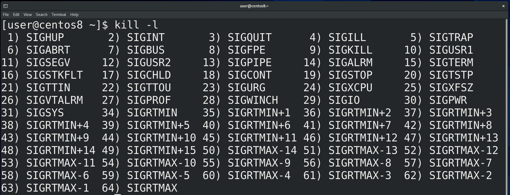
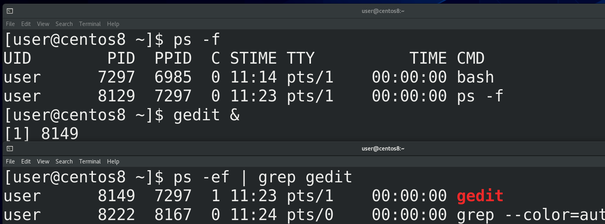
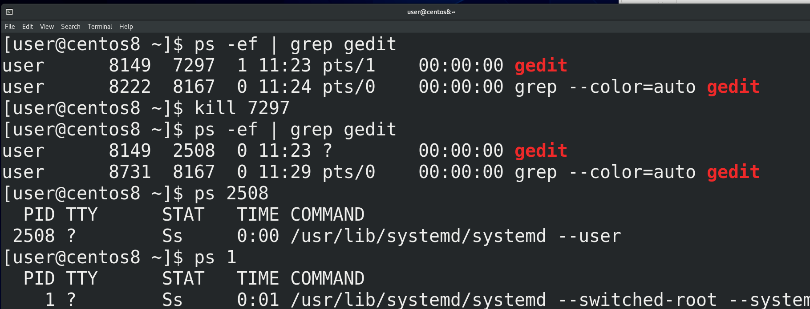
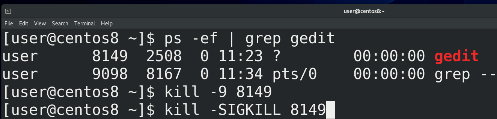
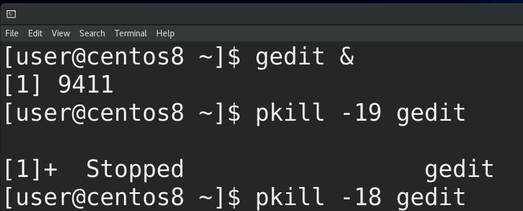
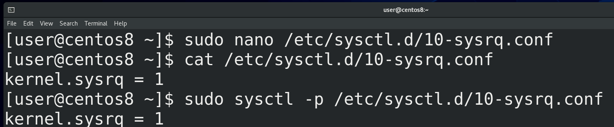




kill позволяет нам посылать сигналы:

```
kill
```

Судя по названию – в основном, чтобы убивать процессы. Для примера, откроем эмулятор терминала и выполним команду gedit - откроется блокнот. Потом найдём идентификатор процесса блокнота с помощью:

```
ps -ef | grep gedit
```

и используем команду kill c нужным pid:

```
kill pid
```

И вот - блокнот закрылся.



Давайте запустим

```
kill -l
```

и посмотрим список сигналов. До этого мы написали просто kill и номер процесса, из-за чего процессу послался сигнал по умолчанию – 15) SIGTERM. Это мягкий сигнал, который даёт процессу время закончить свои дела, прежде чем умереть. За это время процесс успевает попрощаться с дочерними и родительскими процессами. После смерти, дочерние процессы становятся процессами-сиротами, а их родителем становится процесс с номером 1.



Для примера, откроем окно эмулятора терминала, там у нас появится новая bash сессия:

```
ps -f
```

В этом окне я запущу блокнот с амперсандом в конце:

```
gedit &
```

Амперсанд нужен, чтобы выполнить команду в фоне, а не быть зависимым от эмулятора терминала. При запуске мы увидели id процесса блокнота. Можно посмотреть:

```
ps -ef | grep gedit
```

где видно, что у процесса gedit родительским процессом является bash сессия в этом эмуляторе терминала.



Теперь давайте избавимся от родительского процесса:

```
kill ppid
```

Блокнот все ещё запущен. Найдём его:

```
ps -ef | grep gedit
```

и у блокнота изменился родительский процесс. Но я говорил, что процессы сироты забирает себе процесс с номером 1, а тут другой ppid. Если посмотреть этот процесс:

```
ps ppid
```

и первой процесс:

```
ps 1
```

то команды будут похожи – systemd. В большинстве unix-подобных систем сирот на себя берёт первый процесс, но то что мы видим сейчас – связано с изменениями, которые происходят в последние лет 10. Во первых, это пока не затронуло все дистрибутивы,  во вторых, это связано именно с пользовательскими сессиями и не так актуально на серверах. Про systemd мы ещё поговорим, я же просто объяснил, что бывает с дочерними процессами.



Вернёмся к сигналам. Когда мы посылаем SIGTERM, процесс сам отвечает за своё завершение. Но что если процесс завис, ни на что не реагирует? На самом деле, в таких случаях лучше разобраться, с чем это связано. Есть способ по жёсткому избавиться от процесса, использовав сигнал – 9) SIGKILL. Но это очень опасный сигнал – резкое убийство процесса, без возможности завершить все дела, может повредить базу данных, файловую систему и т.п. Поэтому нужно быть крайне аккуратным с этим сигналом и лучше постараться найти причину проблемы и попытаться решить её, а не убивать процесс. Но всё же, если нет другого выхода – посылаем:

```
kill -9 pid
```

Можно ещё вместо номеров использовать сами сигналы:

```
kill -SIGKILL pid
```




Большинство сигналов нужны не столько администраторам, сколько разработчикам. Но пара занятных сигналов всё же есть, допустим - 19) SIGSTOP - о котором я говорил в прошлый раз. Потренируемся на том же блокноте. Чтобы постоянно не искать id процесса, я могу использовать команду pkill. Она сама ищет процесс по шаблону, но нужно быть осторожным, потому что в некоторых случаях у разных процессов могут быть совпадения и это может привести к плохим последствиям. Но так как блокнот запущен один, я пишу:

```
pkill -19 gedit
```

И теперь блокнот ни на что не реагирует, как будто завис. Если я хочу чтобы он продолжил работу, я посылаю сигнал 18) SIGCONT - от слова continue:

```
pkill -18 gedit
```

и он опять продолжает работать.

И так, когда у вас начинает зависать система, смотрим top или htop, сортируем по cpu или memory, а потом решаем, что делать с процессом – пытаемся найти причину и решить. Допустим, у вас шёл бэкап базы данных на внешний сервер, а он отвалился от сети и теперь база данных начала грузить процессор. Легче всего будет вернуть в работу бэкап сервер. Это просто пример, возможно не самый хороший, просто объясняющий, что делать. Если процесс не такой важный и это какая-то мелочь, типа блокнота, можно попытаться ему послать сигнал с помощью kill, для начала тот же SIGTERM. Старайтесь избегать использования SIGKILL, это крайняя мера.

Если у вас зависает графический интерфейс, попробуйте открыть виртуальный терминал – ctrl+alt+f3, f4  и т.п. и решайте проблему оттуда. Виртуальный терминал особо ресурсы не расходует, и, в случае тормозов, он работает получше графического интерфейса. Ещё одна проблема, которая может быть – ваша система намертво зависает и не реагирует абсолютно ни на что. Зачастую, это связано с проблемой нехватки памяти – возможно какой-то багованный софт съел всю оперативную память, отчего вся система зависла. Это называется OOM – out of memory – и различные компании предлагают свои превентивные меры против этой проблемы, достаточно погуглить oom killer linux. Но это всё превентивные меры, а если вы всё же столкнулись с проблемой, не спешите перезагружать систему. Вам поможет магическая кнопка [sysrq](https://ru.wikipedia.org/wiki/SysRq). На современных клавиатурах её не всегда пишут, но обычно это та же клавиша PrtSc. Эта клавиша позволяет напрямую посылать какие-то команды ядру.



Например, чтобы решить проблему out of memory, стоит нажать Alt+PrtSc+f, тогда ядро избавится от проблемного процесса, чтобы освободить память. Но это нужно предварительно настроить. Для этого создадим файл внутри директории /etc/sysctl.d с расширением .conf:

```
sudo nano /etc/sysctl.d/10-sysrq.conf
```

Напишем в этом файле:

```
kernel.sysrq = 1
```

Сохраним, затем выполним команду:

```
sudo sysctl -p /etc/sysctl.d/10-sysrq.conf
```

Есть и другие способы, допустим, установка демона oom-killer (earlyoom, systemd-oom и т.п.), который будет решать проблему без ручного вмешательства. Но это отдельная тема.

Таким образом, мы разобрались с тем, где найти информацию по процессам, немного углубились в теорию и разобрали, как управлять процессами с помощью сигналов, какие есть превентивный меры – ulimit, oom killer-ы - и что делать, когда система тормозит или вообще зависла.
