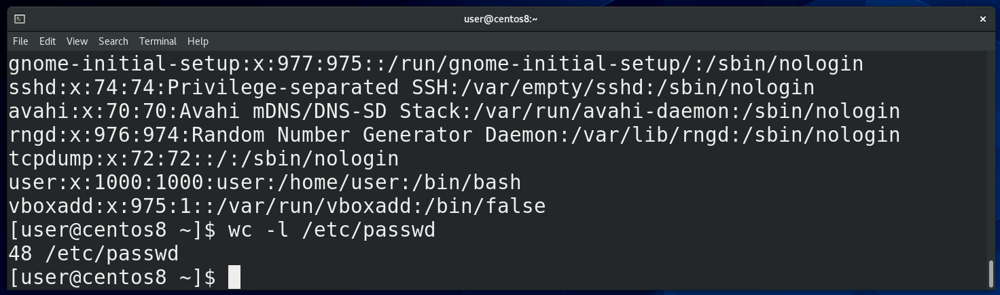
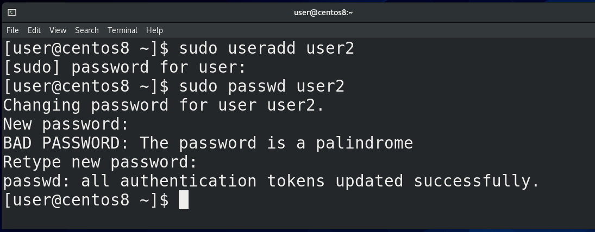
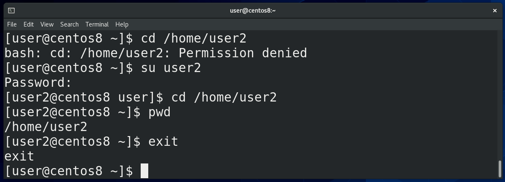
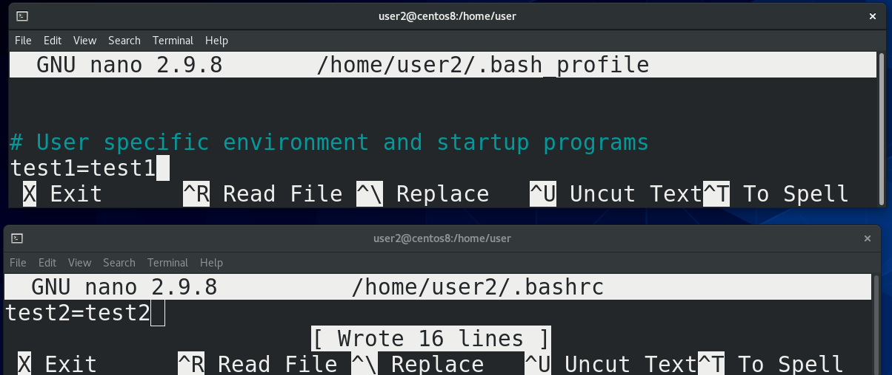
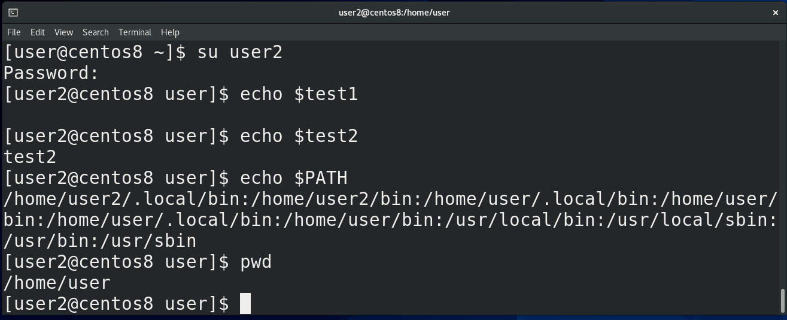
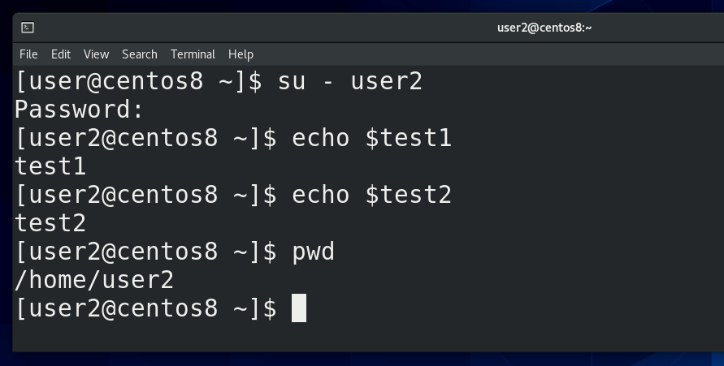
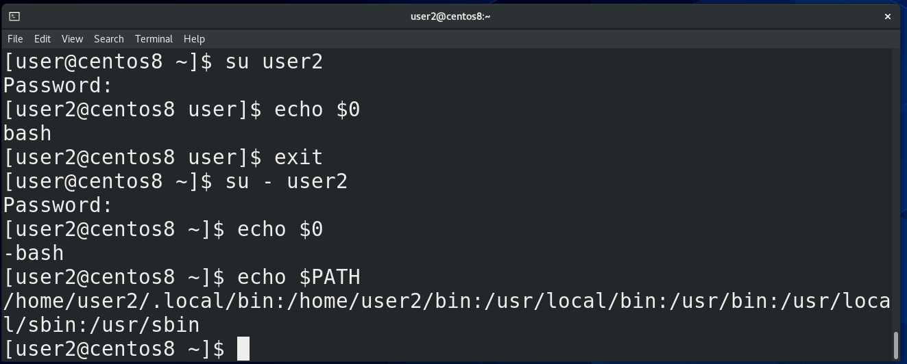
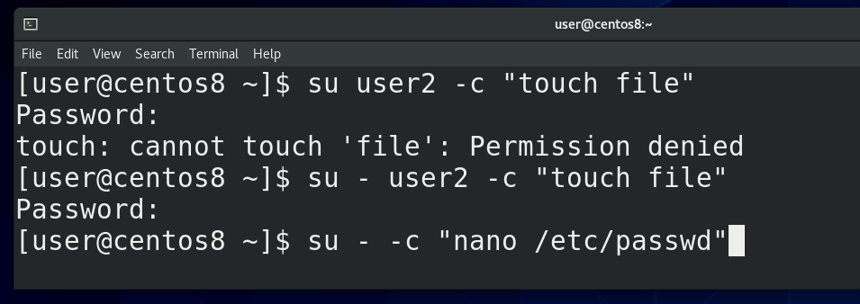
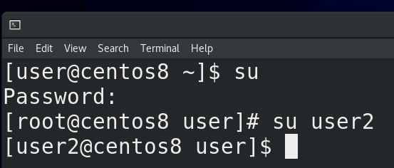

Мы с вами уже выяснили, что Linux – система многопользовательская. Если с помощью команды wc посчитать количество строк в файле /etc/passwd - cat /etc/passwd; wc -l /etc/passwd, где перечислены все пользователи, мы увидим, что сейчас в системе 48 пользователей.  Среди них есть наш пользователь user, суперпользователь root, а остальные, которых создавали не мы, а система, считаются сервисными пользователями.

Нам сегодня понадобится ещё один пользователь, поэтому создадим его с помощью команды sudo useradd user2, введём наш пароль, а потом с помощью sudo passwd user2 зададим пароль для второго пользователя.

Начнём с команды su. Она позволяет залогиниться каким-то пользователем или запускать команды от имени другого пользователя. При этом нужно знать пароль этого другого пользователя. Это бывает нужно, когда у нашего пользователя нет нужных прав, либо когда нам нужно запустить какой-то процесс от имени другого пользователя, например, в целях безопасности.

Например, сейчас мой пользователь не может зайти в директорию /home/user2 - cd /home/user2, потому что у него недостаточно прав. Я могу написать su user2, ввести пароль пользователя user2 и стать этим самым вторым пользователем, как видно в начале строки. А дальше смогу зайти в нужную директорию - cd /home/user2. Чтобы вернуться к моему пользователю, я могу написать exit, либо нажать Ctrl+d. Если написать просто su, либо su root, и ввести пароль рута, можно работать от пользователя root. 

Но помните мы разбирали файлы ~/.bash\_profile и ~/.bashrc ? Мы писали там переменные и алиасы, и, в случае с ~/.bash\_profile, нам нужно было перезалогиниться, а в случае с ~/.bashrc нам достаточно было просто запустить новый эмулятор терминала. То есть ~/.bash_profile это файл настроек для login shell, а ~/.bashrc для nonlogin shell.

Давайте сделаем вот что. У пользователя user2 - su user2 - в файле ~/.bash\_profile - nano /home/user2/.bash_profile - создадим переменную test1 равную test1 - test1=test1, а в файле ~/.bashrc - nano /home/user2/.bashrc - переменную test2 равную test2 - test2=test2.

Теперь выйдем - ctrl+d - заново зайдём - su user2 - и посмотрим, как обстоят дела с переменными - echo $test1; echo $test2. Как видите, сработала настройка только из ~/.bashrc, то есть non-login shell. Это означает, что переменные окружения не прочитались с ~/.bash_profile (login shell) пользователя user2. На самом деле, все переменные остались от предыдущего пользователя. Допустим, если посмотреть переменную PATH, можно увидеть пути к директориям /home/user/bin, а это домашняя директория первого пользователя. Также, если писать su user2, можно заметить, что директория, в которой мы находимся, не меняется - pwd.

Зачастую нужно, чтобы при логине за другого пользователя поменялось окружение, то есть, чтобы применились настройки из ~/.bash\_profile нужного пользователя. Для этого после su следует писать дефис - su – user2. Теперь у меня есть обе переменные - echo $test1; echo $test2, то есть считался файл ~/.bash_profile, а значит это был login shell. Также стоит заметить, что при su c дефисом поменялась и директория – раньше мы находились в домашней директории пользователя user, а после “su -” меняется текущая директория – pwd - /home/user2. 

Кстати, чтобы понять, текущий shell – login или non-login, не обязательно выдумывать каждый раз какие-то проверки с переменными, достаточно проверить значение переменной $0 - echo $0. При non-login shell значение будет просто bash, а при login shell “-bash”. И если проверить ту же переменную PATH - echo $PATH, можно увидеть, что теперь здесь нет пути /home/user/bin, то есть переменные окружения не передались от предыдущего пользователя, а появились как следует.

Так вот, подводя итоги. Когда вы вводите свой логин и пароль, будь то удалённо с помощью ssh, либо локально, зайдя в виртуальный терминал, либо залогинившись в графической оболочке - запускается оболочка со входом - login shell. Это оболочка с авторизацией, она считывает настройки – те же переменные, алиасы, функции сначала с файла /etc/profile, где написано смотреть на файлы в директории /etc/profile.d/ и в файл ~/.bash_profile в домашней директории пользователя. Там также написано смотреть в файл ~/.bashrc в домашней директории пользователя, в котором также написано смотреть в файл /etc/bashrc.

Когда же вы запускаете программу эмулятор терминала, то там нет логина, вы без логина и пароля можете вводить команды - оболочка без входа - non-login shell. В случае с non-login shell сначала считывается файл ~/.bashrc в домашней директории пользователя, затем считывается файл /etc/bashrc, который в свою очередь ссылается на файлы в /etc/profile.d/. Но приведённая схема может отличаться на других дистрибутивах.

Кроме этого, оболочки делятся на interactive и non-interactive. Если вы логинитесь и запускаете команды - это interactive login shell. Если вы работаете в эмуляторе терминала - это interactive non-login shell. Когда работают скрипты, они обычно запускаются без всякого логина - тут уже non-interactive non-login shell. Да, когда вы запускаете эмулятор терминала, в этом эмуляторе запускается bash и запускает ~/.bashrc. Сами по себе ~/.bashrc и ~/.bash\_profile - это просто набор команд в одном файле. То есть это скрипты. Когда же вы логинитесь, не важно каким образом, тоже запускается bash, при этом он запускает ~/.bash_profile.

Ладно, со сменой пользователя разобрались. Мы еще говорили, что su позволяет запускать команды от имени другого пользователя. Для этого используется ключ -c. Например -su user2 -c “touch file”; su – user2 -с “touch file”. Объясните в комментариях, почему первая команда завершилась с ошибкой, а вторая без? Ну и зачастую, su используют чтобы работать от имени root пользователя, для примера запустим nano от рута - su - -c “nano /etc/passwd” - и теперь мы можем редактировать файл /etc/passwd и в целом можем делать всё что угодно.

Кстати, если запускать su от имени рута - su; su user2 - то никаких паролей не потребуется, root может логиниться кем угодно.