

У su есть один нюанс – нужно знать пароли других пользователей, если, конечно, вы не root. Когда вы один админ в системе - это не проблема. Но представьте, что есть несколько пользователей или администраторов. Давать друг другу пароли плохая идея, потому что безопасность строится на полном недоверии друг к другу, включая других администраторов. Другой администратор может умышленно вас подставить, неопытный хелпдеск может сделать ошибку от вашего имени, завтра могут уволить кого-то, а он от вашего имени может положить все сервера. Ну и если не говорить о недоверии, когда несколько админов работают от имени одного пользователя, то кто-то может что-то неправильно настроить, и потом не вспомнит или не сознается. Таким образом в коллективе формируется недоверие и негативная атмосфера. Учётные записи придумали не просто так, в жизни бывает всякое, поэтому всем будет легче работать от своего имени. Ну и во вторых, когда работает несколько пользователей, допустим если есть хелпдеск и вы хотите дать ему возможность только создавать пользователей, то вроде ему и нужны какие-то права суперпользователя, но и давать пароль от рута не хочется.

Для решения таких проблем есть утилита sudo:

```
sudo
```

Вы уже замечали её пару раз – с помощью  неё мы устанавливали какие-то программы и создавали пользователей – потому что у нашего пользователя не было соответствующих прав. А если писать перед командой sudo – например:

```
sudo useradd user2
```

то команда useradd запускается от имени суперпользователя. Но, естественно, не любой пользователь может написать sudo и выполнить любую команду – у нашего user это работает, потому что при установке системы мы поставили галочку "сделать пользователя администратором". Как это работает – давайте разбираться.

Вкратце, sudo позволяет запускать какие-то команды от имени какого-то пользователя. А в файле sudoers пишутся те самые политики – кому, где и что. Из того, что мы уже видели – наш пользователь может запускать команды от имени суперпользователя. Давайте для начала найдём, где это написано.

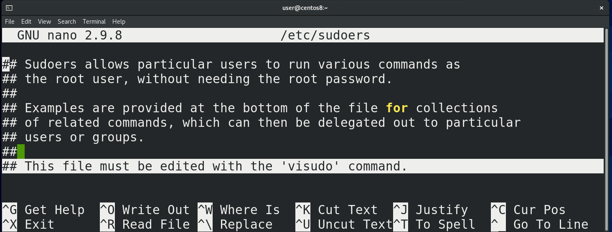

У sudo есть файл настроек - /etc/sudoers:

```
nano /etc/sudoers
```

Наш пользователь его читать не может, но так как у нас есть права суперпользователя, можем написать:

```
sudo nano /etc/passwd
```

введём свой пароль и файл откроется. В начале у нас есть строчка – этот файл нужно редактировать с помощью команды visudo:

```
visudo
```

Всё дело в том, что при запуске sudo программа каждый раз считывает этот файл, и, если здесь будет синтаксическая ошибка, sudo просто перестанет работать. А если у нас нет пароля от рута – то придётся повозиться, чтобы восстановить работу.

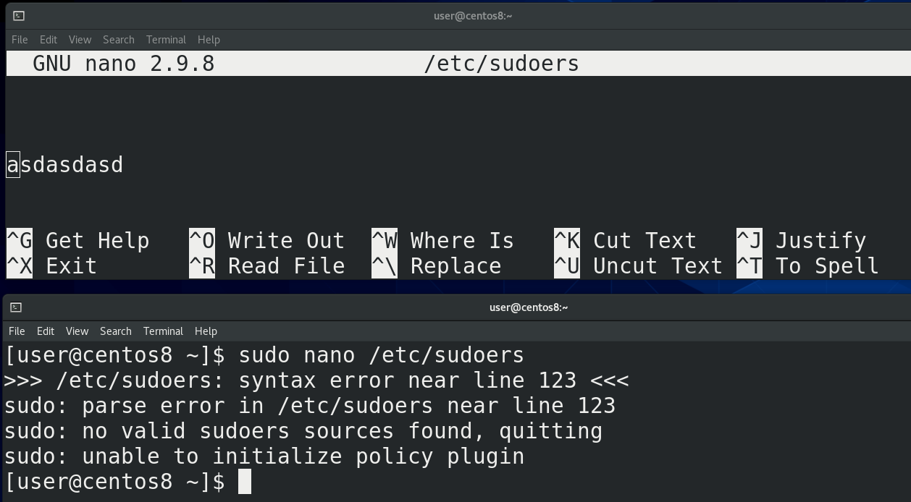

Давайте просто покажу – напишу в файле рандомные буквы, сохраню и выйду. Теперь, при попытке заново открыть файл с помощью sudo, у меня ничего не откроется - sudo скажет, что не смог прочесть такую-то строчку и просто откажется работать. К счастью, у меня есть пароль от рута, который я ставил при установке системы – я могу просто написать su, ввести пароль рута, а потом просто зайти и удалить лишнюю строчку:

```
nano /etc/sudoers
```

Теперь sudo опять будет работать.

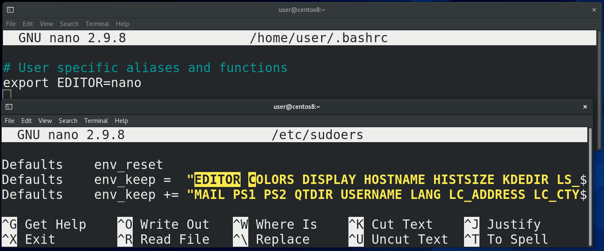

Попытаемся прислушаться к совету и запустить команду visudo:

```
sudo visudo
```

Visudo открывает /etc/sudoers в дефолтном редакторе – vim. Если же я хочу, чтобы всё работало с nano, мне нужно будет кое-что поменять. Как правило, программы по умолчанию задаются с помощью переменных окружения. Как это делать мы уже знаем – зайдём в ~/.bashrc:

```
nano ~/.bashrc
```

и напишем:

```
export EDITOR=nano
```

Дальше нам нужно зайти в sudoers:

```
sudo nano /etc/sudoers
```

найти строчку c env\_keep. Выше можно заметить env\_reset – которая сбрасывает все переменные, чтобы сделать окружение с sudo минимальным. Так вот, в env_keep добавляем EDITOR, чтобы sudoers не игнорировал нашу переменную, сохраняем, закроем эмулятор и заново запуcтим, чтобы bash перечитал настройки ~/.bashrc. И теперь, при запуске:

```
sudo visudo
```

файл откроется в nano.

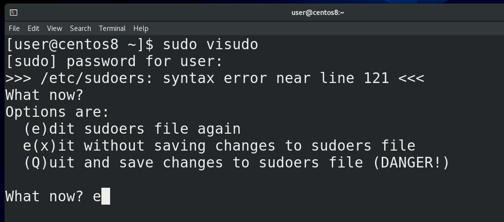

Обратите внимание - наверху указано не /etc/sudoers, а /etc/sudoers.tmp. Это означает, что когда мы запускаем visudo, у нас sudoers копируется во временный файл. Если здесь сделать ошибку, например, написать рандомные буквы, сохранить и попытаться выйти, то visudo сначала проверит, всё ли нормально с файлом, заметит синтаксическую ошибку и спросит нас – что делать? Если нажать enter, можно увидеть варианты – e чтобы вернуться к редактированию, x – чтобы выйти не сохраняя, Q – чтобы сохранить, но мы видим предупреждение, что это опасно. Можно вернуться, исправить ошибку, сохранить и выйти. При сохранении, sudoers.tmp заменит оригинальный файл sudoers. Таким образом visudo защищает нас от синтаксических ошибок.

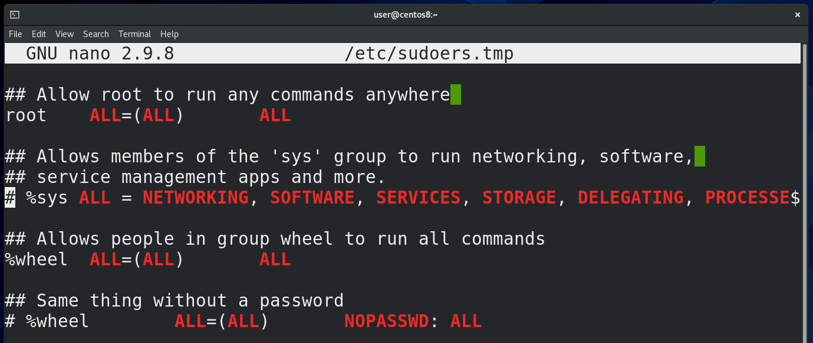

Спускаемся вниз, где у нас начинаются политики. Например:

```
root ALL=(ALL) ALL
```

Первое – это пользователь, для которого написана политика. Если начинается со знака процент(%), то речь о группе пользователей. Не то, чтобы руту были нужны sudo права – он и так может делать всё что угодно. Но без этой строчки - если root почему-то запустит sudo, например, если это написано в скрипте или кто-то скопировал команды с интернета – sudo выдаст ошибку и команда не сработает. Поэтому, на всякий случай, есть эта строчка.

Теперь, что означает ALL=(ALL) ALL. Первая ALL - это на каком компьютере. Если первое значение ALL или совпадает с именем компьютера, которое можно узнать с помощью команды:

```
hostname
```

то sudo будет работать с этой строчкой. Если же тут написано что-то другое – то sudo проигнорирует эту строчку. Если у вас несколько компьютеров, вы можете написать один файл sudoers и закинуть его на все компьютеры. И sudo на каждой машинке будет считывать только строчки, где хост равен ALL или совпадает с хостнеймом машинки.

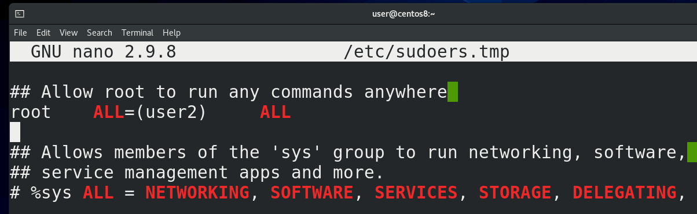

Вторая ALL – от имени какого пользователя, ALL значит от всех, то есть можно запустить команду от имени любого пользователя. По умолчанию, если явно не указывать пользователя, то команда запустится от имени root. А так, здесь можно написать конкретного пользователя, допустим user2. В таком случае пользователь root сможет запускать команды с помощью sudo только от имени user2. Также тут можно указать не только пользователя, а также группу, или просто группу. Чуть дальше будут примеры.

И третья ALL – это команды. В случае ALL можно запустить любую команду, а так, здесь можно прописать только те команды, которые вы хотите разрешить. Или наоборот, если вы хотите какие-то команды разрешить и какие-то запретить. Перед запрещёнными командами ставится восклицательный знак.

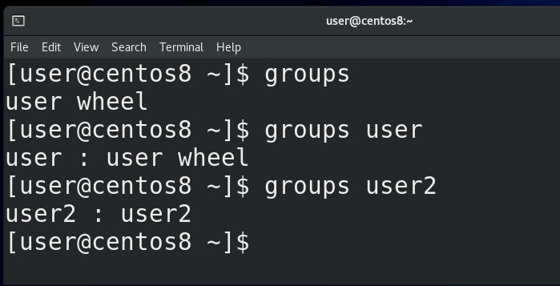

Так вот, почему наш пользователь user может запускать команды с помощью sudo? Пока что в этом файле всего 2 политики – для пользователя root и для группы wheel, всё остальное – закомментированные примеры. У группы wheel тоже все права – ALL ALL ALL. Чтобы узнать, в каких группах состоит наш пользователь, можно выполнить команду:

```
groups
```

от его имени, либо указать имя пользователя:

```
groups
groups user
groups user2
```

Как видно, наш пользователь user состоит в группе wheel – именно поэтому у него есть все права на систему. В других дистрибутивах вместо wheel может быть группа c именем sudo – но суть одна и та же.

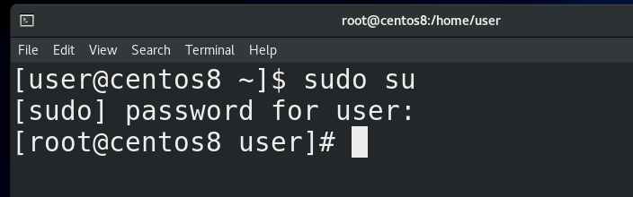

Прежде чем пойдём дальше, давайте я покажу частный случай использования sudo:

```
sudo su
```

Если выполнить просто команду su, то мы меняем текущего пользователя на root пользователя, правда для этого нам нужно знать пароль этого рут пользователя. Команда sudo позволяет нам выполнить команду от имени суперпользователя, а мы знаем, что если выполнять команду su от имени root пользователя, то пароль нам указывать не нужно. А значит выполнив sudo su и введя пароль своего юзера, мы просто от имени суперпользователя запустим команду su, а так как ему не нужно вводить пароль, мы просто станем рутом. Таким образом, не зная пароля рута, мы можем стать рут пользователем.

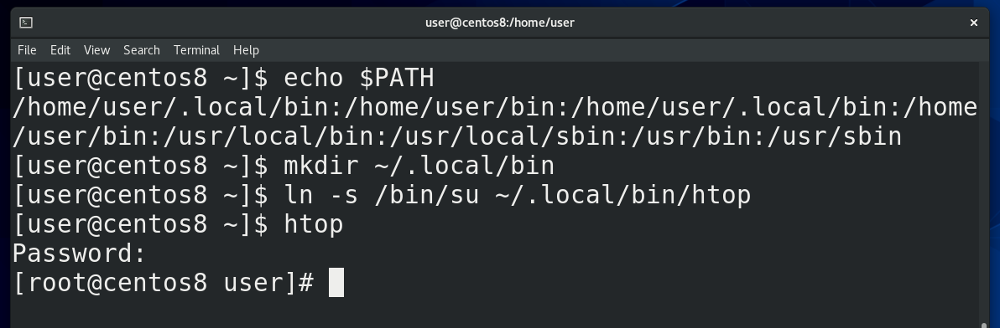

Учитывая, что sudo это механизм, который позволяет повысить свои привилегии, этим активно пользуются злоумышленники. Давайте, для примера, посмотрим один из теоретических способов с помощью переменной PATH.  У меня в переменной PATH:

```
echo $PATH
```

есть путь /home/user/.local/bin. Сейчас этой директории нет, но я могу её создать:

```
mkdir ~/.local/bin
```

и сделать такую обманку – создать символическую ссылку:

```
ln -s /bin/su ~/.local/bin/htop
```

Теперь когда я пишу htop, bash смотрит переменную PATH, видит в начале ~/.local/bin, находит там программу htop и запускает, а на самом деле это программа su. И представьте ситуацию, если мы разрешим пользователю запускать только команду htop c правами суперпользователя, допустим, чтобы понижать niceness, а этот пользователь напишет:

```
sudo htop
```

на деле выполнится sudo su – и он введя свой пароль станет рут пользователем.

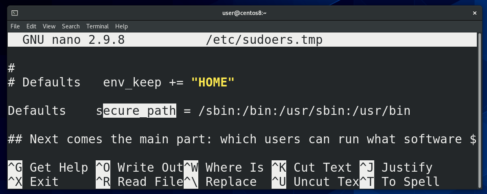

Естественно, этой очень банальный способ и его невозможно применить – во-первых, sudo требует, чтобы в sudoers был полный путь к программам. То есть, если в sudo явно не указан путь /home/user/~.local/bin/htop – то ничего не сработает. Во вторых – в sudoers есть настройка secure_path. Когда пользователь будет писать sudo command, то sudo будет смотреть только в директории, указанные в этой настройке.  Кстати, насчёт полного пути – его всегда можно легко найти с помощью команды which – допустим:

```
which htop
which ls
which rm
```

Но нужно понимать, что при ALL ALL ALL у пользователя будет полный доступ, а если вы ограничиваете пользователя определёнными командами, следует быть предельно осторожным с выбором команд, потому что очень часто можно повысить привилегии неочевидным способом. Допустим, давая кому-то право создавать пользователей, он может создать пользователя с группой wheel и через него стать рутом. Поэтому, прежде чем давать какому-то пользователю права на какую-то программу, следует очень внимательно изучить, что эта программа позволяет сделать.


Допустим, тот же less или vi позволяют запускать команды и для них есть специальный ключ, позволяющий предотвратить выполнение сторонних команд - NOEXEC.  Кроме NOEXEC есть ещё пара ключей, один из примечательных - NOPASSWD – позволяет запускать указанные команды без ввода пароля. Также, чтобы постоянно не вводить sudo, можно предварительно написать:

```
sudo -s
```

В некоторых случаях люди используют sudo чтобы предоставить доступ к редактированию каких-то файлов. И хотя лучше в таких случаях использовать права на файлы, ситуации бывают разные, поэтому у sudo есть относительно безопасный способ редактирования файлов с помощью sudoedit.

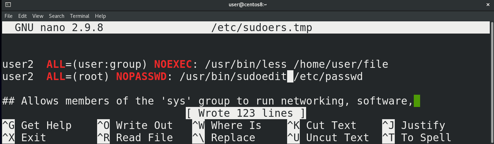

Для примера, давайте предоставлю пользователю user2 право редактировать файл /etc/passwd с помощью nano. Он вроде бы и не может открыть командой другой файл, но я могу изнутри nano открыть другой файл с помощью ^R, допустим, тот же sudoers, изменить его и сохранить как /etc/sudoers, тем самым обеспечив себе все права. Если же в sudoers я пропишу sudoedit, то предыдущая схема не будет работать, потому что принцип работы немного другой. sudoedit копирует нужный мне файл во временный файл, я редактирую временный файл, а когда сохраняю – то sudoedit заменяет нужный файл той копией, которую я изменил. Почти как с visudo.

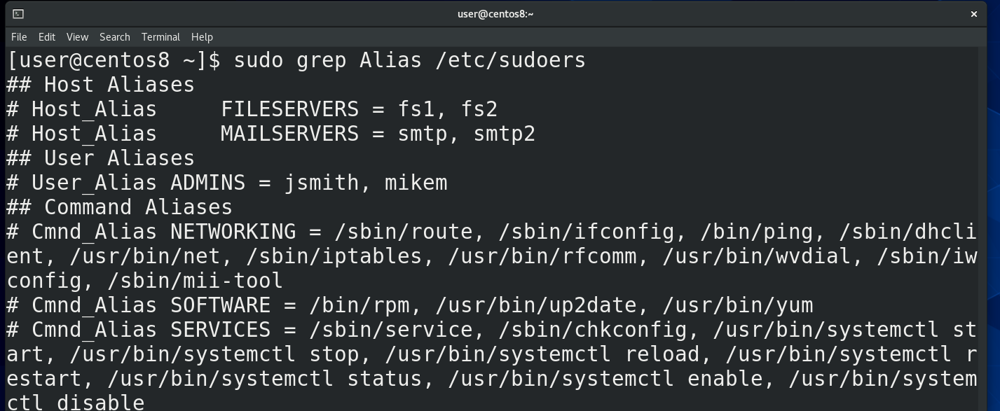

Когда у вас много пользователей, много разных команд и компьютеров, для облегчения прописывания политик можно использовать алиасы, где можно перечислить несколько значений через запятую. В файле уже даны примеры использования. Политика состоит из 4 столбиков: User – это собственно пользователь или группа, к которой применяется политика, поэтому алиас называется User\_Alias. Во втором столбике хостнеймы, поэтому Host\_Alias. Дальше у нас столбик, где указывается от чьего имени разрешено запускать – называется Runas – собственно, Runas\_Alias и последний столбик – команды, поэтому здесь Cmnd_Alias. Ну и тут пример использования политик с алиасами.

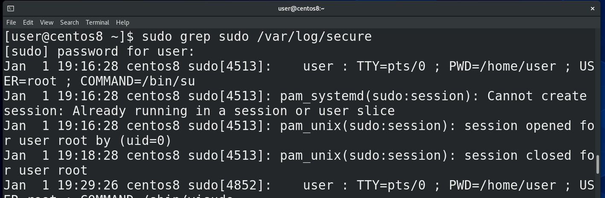

Также бывает полезно узнать, кто какие команды вводил с помощью sudo. Все действия sudo логирует и их можно посмотреть в файле /var/log/secure:

```
sudo grep sudo /var/log/secure
```

Также, в плане логирования, у sudo есть инструмент, называемый sudoreplay. Я его разбирать не буду, это вам такое задание – настроить и проверить его работу. Если будут какие-то сложности – спрашивайте в комментариях.

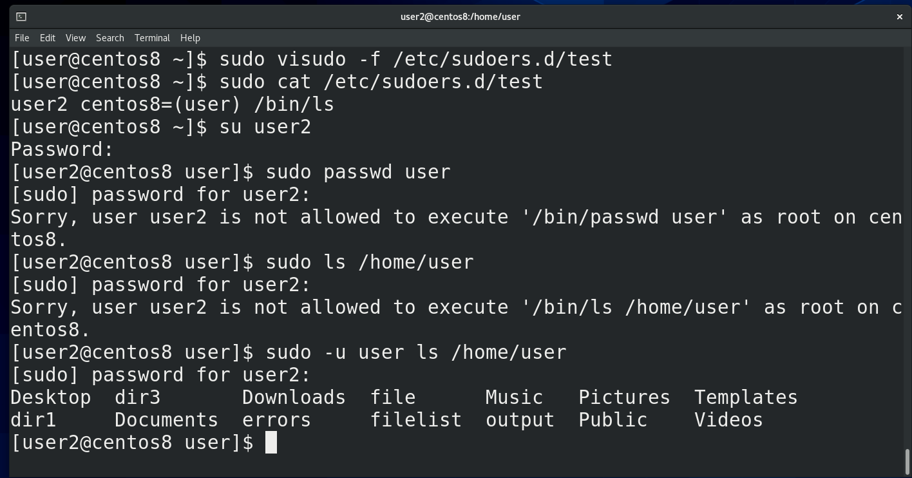

Последняя строчка файла говорит нам, что sudoers будет читать настройки из всех файлов, расположенных внутри директории /etc/sudoers.d . Для этого нам понадобится указать для visudo файл:

```
sudo visudo -f /etc/sudoers.d/test
```

Давайте пропишем здесь правило для пользователя user2, допустим, чтобы он мог от имени пользователя user запускать команду ls:

```
user2 centos8=(user) /bin/ls
```

Сохраним, выйдем и проверим:

```
su user2
sudo passwd user
ls /home/user/
sudo -u user ls /home/user
```

Подводя итоги, sudo – инструмент, который позволяет дать определённым пользователям определённые права. Но это делает sudo очень опасным инструментом, которым активно пользуются злоумышленники. Поэтому нужно запомнить – без острой необходимости пользователей в sudo прописывать не стоит, если речь идёт о правах суперпользователя. Не стоит строить правила на основе запретов – разрешить всё, а потом запретить опасные команды. Это заведомо проигрышный вариант – есть огромное количество способов обойти запреты. Давайте доступ только на необходимые команды, заранее проанализируйте, посмотрите в интернете, а насколько опасно то, что вы разрешаете. В дальнейшем вы научитесь писать скрипты – так вот, вместо самих команд пишите скрипты, которые выполняют строго заданные функции и указывайте в sudoers эти скрипты вместо команд. Ну и у sudo ещё много всяких настроек, которые я не рассмотрел – но для основ этого будет достаточно.