

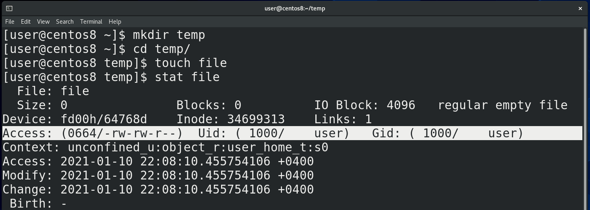

В теме "О файловых системах" мы познакомились с таким понятием, как инода – в ней хранится всякая информация о файле. С помощью утилиты stat мы можем увидеть часть этой информации и сейчас нас интересует 4 строка, где указаны стандартные UNIX права на этот файл:

```
mkdir temp
cd temp
touch file
stat file
```

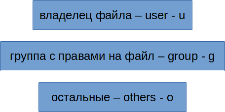

Доступы пользователей к файлам можно разделить на 3 категории: либо пользователь является владельцем этого файла и для него есть обозначение u - user; либо пользователь относится к группе, для которой выделены какие-то права на этот файл – обозначение для них – g - group; либо он относится к остальным – все остальные пользователи, которые не подходят под первую и вторую категорию – для них обозначение o - others. Конечно, есть ещё root – он может делать всё что угодно.

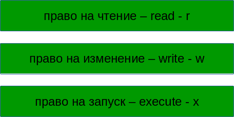

Что касается самих прав, то они делятся на три типа: право на чтение файла – обозначается как r — read; право на изменение файла – обозначается как w — write;  право на запуск файла - обозначается как x – execute. Право на запуск обычно относится к программам и скриптам.

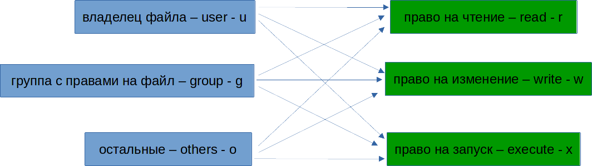

Теперь, указывая для владельца, группы и остальных права на файл, мы получаем такое значение:

```
rwxrwxrwx
```

Первая тройка rwx это для владельца, вторая для группы, третья для остальных. Такое обозначение говорит, что мы разрешаем и владельцу, и группе и остальным читать файл, изменять его и запускать.

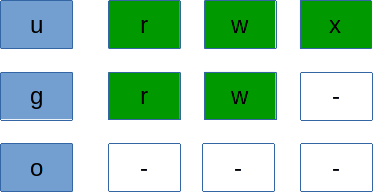

Если же мы хотим владельцу разрешить всё, группе разрешить только читать и запускать, а остальным ничего, получаем:

```
rwxr-x---
```

где отсутствующие права заменены на дефисы.

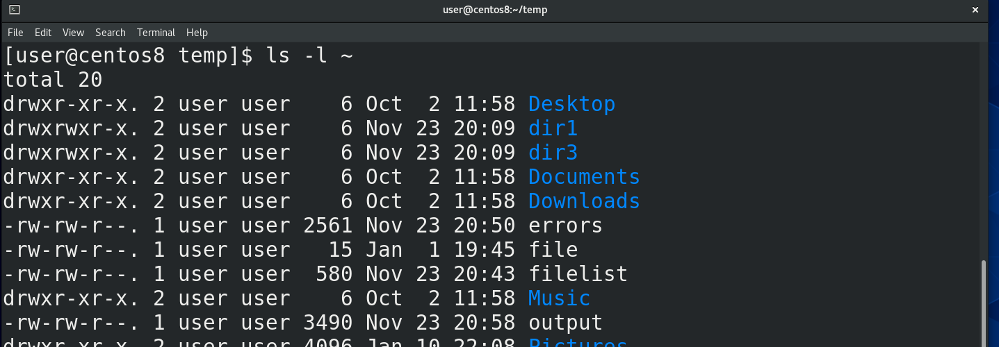

Кроме stat, можно использовать ls -l или его алиас ll:

```
ll ~
```

где в первом столбце также отображаются права на файлы,  в 3 отображается владелец, а в четвёртом группа.

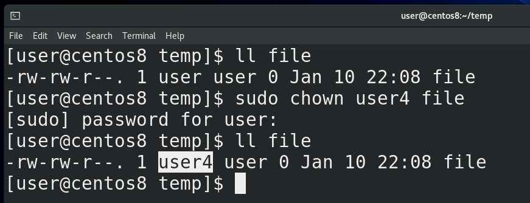

Теперь, как это всё менять. Начнём с владельца. Чтобы поменять владельца нужна команды chown – change owner. Но даже если мы владелец этого файла, без прав суперпользователя мы это сделать не cможем. Потому что если какой-то пользователь создаст файл, а потом укажет, что владельцем файла является другой пользователь, то он сможет подставить другого пользователя. Или, например, использовать выделенное для второго пользователя место в своих целях, когда каждому пользователю выделено сколько-то места на диске. Поэтому, чтобы поменять владельца, нужно использовать sudo:

```
ll file
sudo chown user4 file
ll file
```

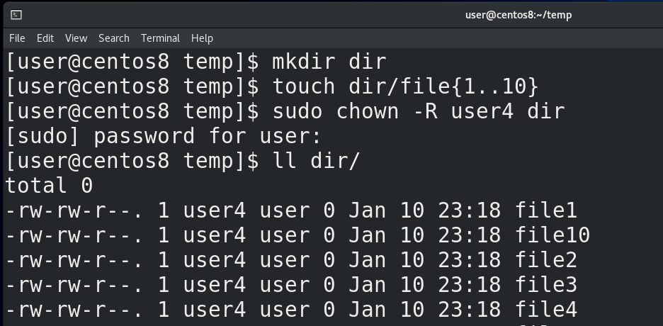

Если мы хотим это сделать для всех файлов в директории и во всех поддиректориях, вы уже знаете, для этого нужно делать рекурсивно:

```
mkdir dir
touch dir/file{1..10}
sudo chown -R user4 dir
ll dir
```

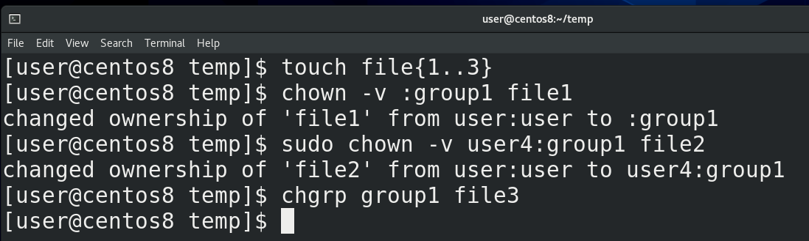

Группу также можно поменять с помощью chown:

```
touch file{1..3}
chown -v :group1 file1
```

Здесь ключ -v - verbose - только для вывода информации. Можно сменить разом владельца и группу:

```
sudo chown -v user:user file2
```

А вообще, чтобы менять группу, есть отдельная команда:

```
chgrp group1 file3
```

Как видите, чтобы менять группу, не нужны права root-а, конечно, если вы владелец файла.

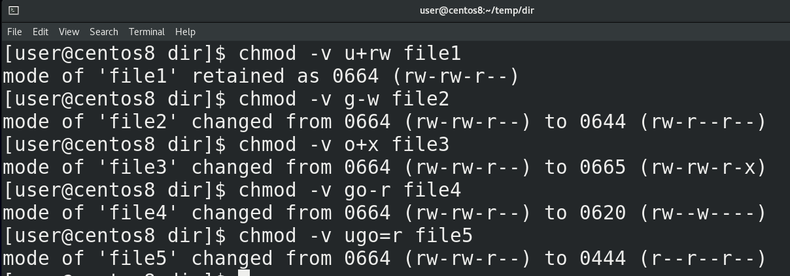

Теперь касательно самих прав. Для начала вернём все файлы нашему пользователю, они нам пригодятся:

```
sudo chown -R user dir
cd dir
```

Для смены прав используется команда chmod. Допустим, если мы хотим владельцу разрешить читать и изменять файл, пишем:

```
chmod -v u+rw file1
```

Хотим группе запретить изменять файл, пишем:


```
chmod -v g-w file2
```

Хотим всем разрешить запускать файл, пишем:

```
chmod +x file3
```

Группе и остальным запретить читать файл:

```
chmod -v go-r file4
```

\+ добавляет, - убавляет. Также можно использовать =, чтобы выставить определённые права, допустим:

```
chmod -v ugo=r file5
```

тогда останутся только права на чтение. chmod тоже работает рекурсивно с ключом -R. В целом по буквам понятно и это несложный способ, но он больше про изменение – кому-то что-то добавить, у кого-то что-то отнять. И если права для всех отличаются – придётся вводить две-три команды, чтобы выставить нужные права.

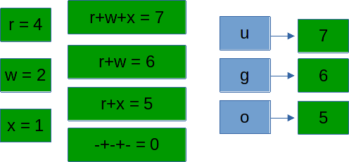

Часто легче использовать цифровой способ. У каждого права есть своя цифра – у read это 4, у write это 2, у execute это 1. И используя сумму этих чисел можно задать право разом. Допустим, rwx – это 4+2+1 – 7. rwxrwxrwx – это 777.  rwxr-x--- - это 750. rwxrw-r-- - это 754. Так и пишем:

```
chmod 765 file6
```

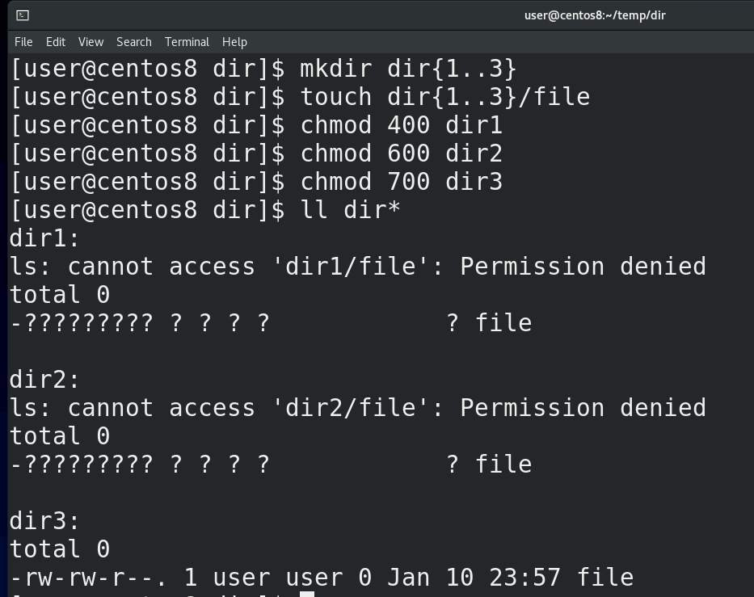

Если же говорить о директориях, вспомните, что директория как лист, в котором указаны имена файлов и их иноды – т.е. жёсткие ссылки:

```
mkdir dir{1..3}
touch dir{1..3}/file
chmod 400 dir1
chmod 600 dir2
chmod 700 dir3
ll dir*
```

read позволяет видеть только имена файлов – список файлов и директорий — как в dir1.


write позволяет изменять её содержимое - добавлять, переименовывать или удалять файлы – опять же, на самом деле это даже не файлы, а жёсткие ссылки - т.е. «записи на листе». Это как добавлять какие-то записи в лист или стирать их, при этом, не важно, есть у вас права на сами эти файлы или нет:

```
touch dir2/file1
touch dir3/file1
```

Как вы видите, несмотря на то, что write позволяет изменять содержимое директории, это не работает без execute. А execute позволяет заходить в эту директорию с помощью cd:

```
cd dir2
cd dir3
```

и выполнять операции с содержимым директории. Т.е. без execute write бесполезен.

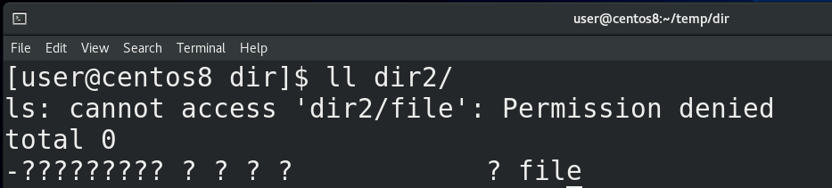

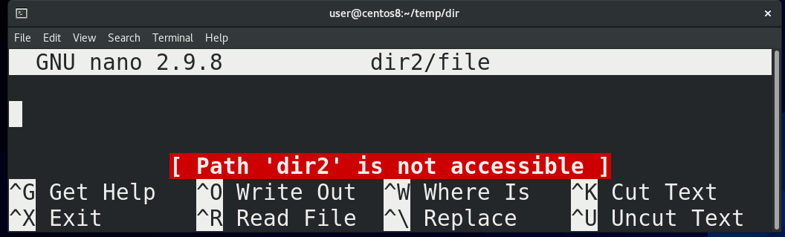

При этом без execute вы не сможете работать с файлами внутри этой директории, даже если у вас есть права на них:

```
nano dir2/file
```

обратите внимание на ошибку, которая говорит, что данный путь недоступен.

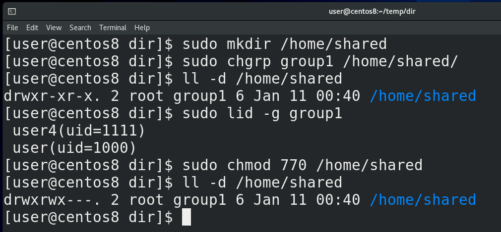

Как я сказал, права write и execute позволяют изменять содержимое директории, допустим, удалять файлы, даже если у нас нет права на сами файлы. Допустим, создадим общую директорию для группы пользователей:

```
sudo mkdir /home/shared
```

пусть у неё будет владелец root, а группа group1:

```
sudo chgrp group1 /home/shared
ll -d /home/shared
```

в которую входят user и user4:

```
sudo lid -g group1
```

И выставим права на директорию:

```
sudo chmod 770 /home/shared
```

чтобы у рута и группы были все права, а у остальных никаких.

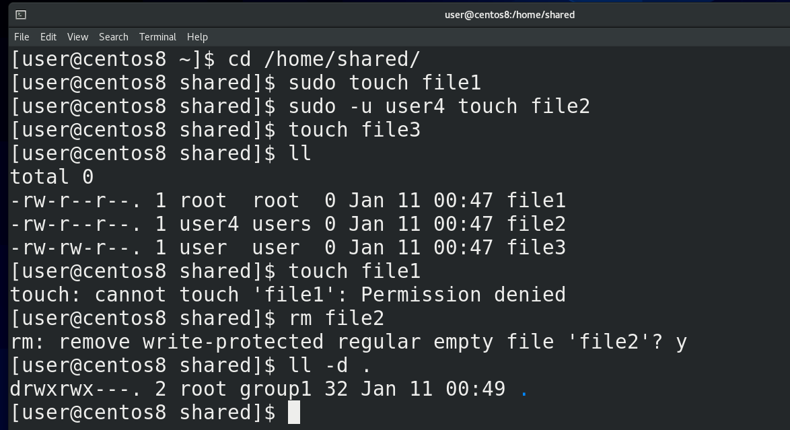

Значит, пользователь root, user и user4 могут создавать тут файлы:

```
cd /home/shared
sudo touch file1
sudo -u user4 touch file2
touch file3
ll
```

Как видите, тут 3 файла и write права у меня есть только на файл user-а, а другие я изменять не могу:

```
touch file1
```

При этом, я могу запросто удалить чужие файлы:

```
rm file2
```

потому что у группы group1 есть права write на эту директорию:

```
ll -d
```

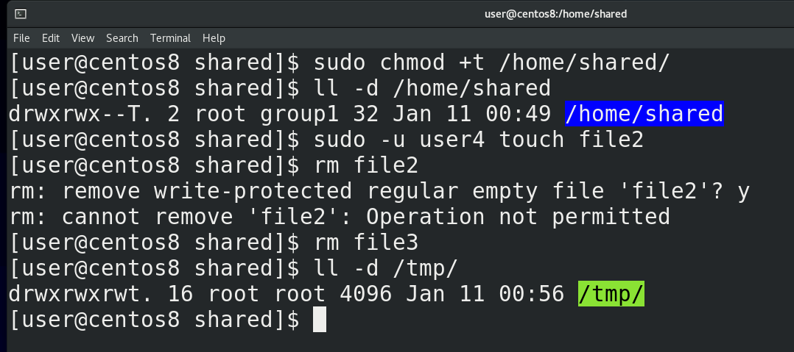

Вы, возможно, подумали – это ж как-то неправильно, нехорошо. Кто-то может случайно или специально удалить чужие файлы. Поэтому есть специальный атрибут – дополнительное право, называемое sticky bit, которое защищает файлы внутри директории. Поставить его можно используя буквенное обозначение:

```
sudo chmod +t /home/shared
```

либо используя цифровое обозначение – у стикибита цифра 1 и она ставится перед правами:

```
sudo chmod 1770 /home/shared
```

После того, как вы поставите sticky bit на директорию, у неё появится буква T после прав:

```
ll -d /home/shared
```

а также ls покажет эту директорию по другому. Так вот, теперь вернём файл пользователя user4:

```
sudo -u user4 touch file2
```

и попытаемся удалить ещё раз:

```
rm file2
```

Как видите, теперь у меня недостаточно прав. Но, как владелец, я могу удалять свои файлы:

```
rm file3
```

А владелец директории, не важно, root он или нет, может удалять все файлы. В системе есть директория /tmp:

```
ll -d /tmp
```

различные программы в процессе работы могут создавать здесь временные файлы. И чтобы другие процессы не удалили эти файлы здесь стоит sticky bit.

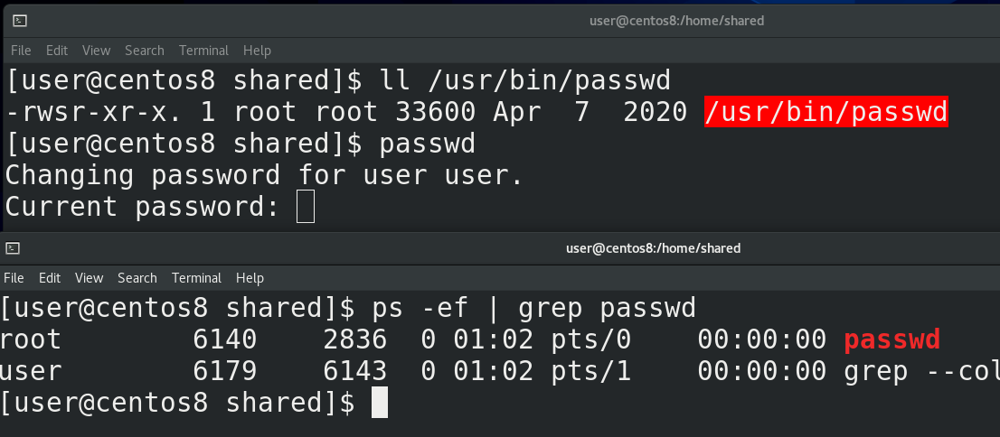

Есть ещё пара специальных атрибутов – setuid и setgid. Вкратце – они позволяют запускать файл от имени владельца или группы соответственно. Прекрасный пример – программа passwd:

```
ll /usr/bin/passwd
```

Как видите, вместо x у владельца стоит s – это означает что здесь есть атрибут setuid, плюс ls ярким красным выделяет этот файл. Мы знаем, что passwd меняет пароль пользователя. Пользователь запускает программу passwd, вводит пароль, программа хэширует пароль и записывает в /etc/shadow. Но ведь у обычного пользователя нет прав редактировать файл /etc/shadow. И процесс passwd, запущенный от имени обычного пользователя, просто не смог бы редактировать этот файл – а значит пароль не поменялся бы. Поэтому здесь стоит setuid – когда мы запускаем программу passwd, процесс запускается не от имени нашего пользователя:

```
passwd
ps -ef | grep passwd
```

а от имени владельца этого файла - root-а. А вот процесс, запущенный от рута, может редактировать всё что угодно. Если бы владельцем файла являлся user4, то программа запускалась бы от имени пользователя user4. Вот, собственно, для этого и есть setuid.

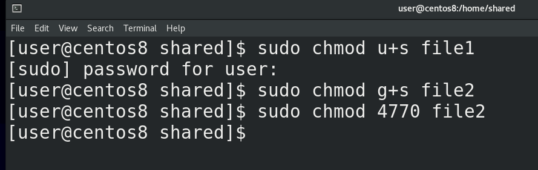

setgid делает примерно тоже самое, но уже от имени группы этого файла. Задаётся setuid, как и sticky bit – с помощью букв или чисел – u+s для setuid и g+s для setgid:

```
chmod u+s file
chmod g+s file
```

Ну и цифрами setuid это 4, setgid это 2 – всё как в правах. Допустим, чтобы поставить setuid и setgid:

```
chmod 6770 file
```

setuid, как и sudo, позволяет повысить привилегии пользователю, а значит это потенциальная брешь в безопасности. Используя программы, где стоит этот атрибут – можно попытаться стать рутом, как я показывал это с sudo. Поэтому использовать setuid вообще нежелательно и он используется только в крайних случаях, как например с passwd.

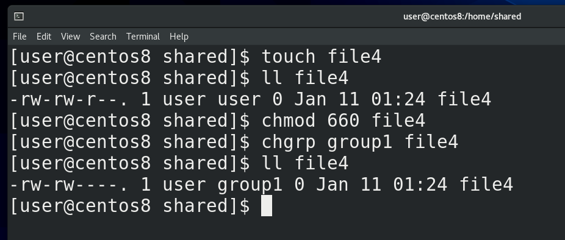

Также, у setgid есть одно особое применение. Если использовать setgid на директорию, то все файлы, создаваемые в этой директории, будут создаваться от имени группы, владеющей этой директорией. Обычно, когда вы создаёте какой-то файл, то владельцем являетесь вы, а группой – ваша основная группа. Это можно увидеть в той shared директории. Смотрите, user создал файл:

```
touch file4
ll file4
```

и у него группа user, потому что это его user private group, о котором мы говорили в прошлый раз. Пользователь user4 не входит в группу и не является пользователем user, а значит он для этого файла относится к others. Я не хочу, чтобы все пользователи в системе видели этот файл, поэтому меняю права на 660:

```
chmod 660 file4
```

но хочу, чтобы у пользователей в группе group1 был доступ к этому файлу: 

```
chgrp group1 file4
ll file4
```

А так как пользователь user4 тоже в этой группе, он сможет редактировать этот файл.

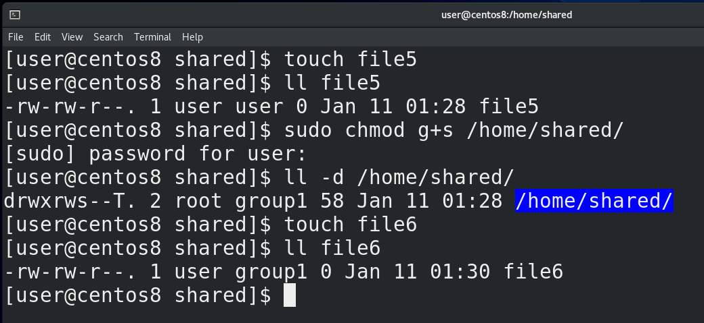

Но если я создам ещё один файл:

```
touch file5
ll file5
```

мне придётся опять менять группу для нового файла. Учитывая, что это общая директория, она специально создана для того, чтобы тут несколько пользователей из одной группы работали с файлами, было бы легче, если б все новые файлы создавались с группой group1. И вот для этого можно использовать setguid:

```
sudo chmod g+s /home/shared
ll -d /home/shared
```

Как видите, для группы теперь стоит setgid. И теперь, когда я создаю новый файл:

```
touch file6
ll file6
```

он автоматом создаётся с этой группой, а не моей основной группой. Все новые файлы в этой директории, независимо от пользователя, будут принадлежать группе group1, благодаря чему пользователям не придётся постоянно менять группу файла, чтобы все могли работать с этими файлами.

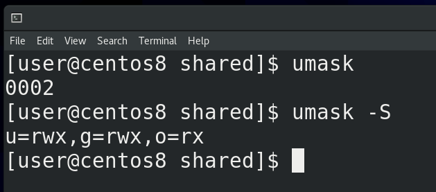

Ещё один момент – как вы, возможно, заметили, все файлы, которые я создаю, имеют одни и те же стандартные права – 664. Дефолтные права на новые файлы задаются утилитой umask. Если просто запустить umask, можно увидеть 0002. Можно ещё запустить:

```
umask -S
```

чтобы было понятнее. И так, первая цифра – для sticky bit, setuid и setgid, остальное для прав. Идея такая – берём максимальное значение – это 777 для директорий и 666 для файлов - и отнимаем те дефолтные права, которые мы хотели бы. Допустим, если мы хотим, чтобы у всех новых файлов были права 664, мы от 666 отнимает 664 – получаем 002. Вот у нас 002 и стоит. Ну и если от 777 отнять 002 получим 775.

Вы скажете – для файлов же максимальные права тоже 777. Но вот просто нельзя создавать новые файлы с правами execute, это большая угроза безопасности. Поэтому для файлов дефолтные максимальные права это 666. А с директориями без execute нормально не поработаешь, поэтому для них 777. Если я хочу, чтобы файлы создавались с правами 660, то я от 666 отнимаю 660 – получаю  006. Но если от 777 отнять 006 получится 771, 1 в конце выглядит бессмысленно, поэтому лучше использовать 007 – тогда права для директорий будут 770, а для файлов 660.

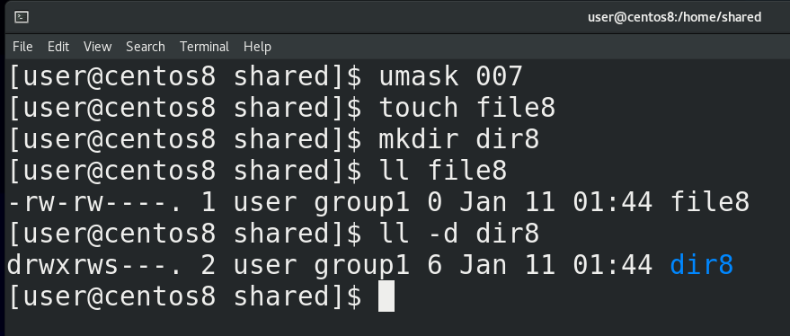

И так, как мне это применить? Я могу это сделать в текущей сессии – написать umask 007, и убедиться, создав новый файл и директорию:

```
touch file8
mkdir dir8
ll file8
ll -d dir8
```

Как видите, теперь у новых файлов для остальных пользователей нет никаких прав. Если же мы хотим, чтобы этот umask действовал для нашего пользователя всегда, мы добавляем строчку:

```
umask 007
```

в ~/.bash\_profile или ~/.bashrc. Если помните, login shell у нас все равно считывает ~/.bashrc, а вот если задействуется non login shell, то он не прочтёт bash_profile, поэтому в некоторых случаях лучше писать в ~/.bashrc. Ну и если мы говорим про всех пользователей, то используйте файлы /etc/profile и /etc/bashrc.

Стандартные права делят пользователей на владельца, группу и остальных, что в большинстве случаев достаточно, но иногда всё же нет. Что, если мы хотим дать права на файл всем в группе, кроме двух её участников? Ради этого придётся создавать отдельную группу без этих двух участников. Или, допустим, нужно дать права на 3 группы, а не одну, при этом, дать какому-то пользователю больше прав, какому-то меньше. Для этого можно использовать список контроля доступа – acl. В общем-то речь про две команды:

```
getfacl
setfacl
```

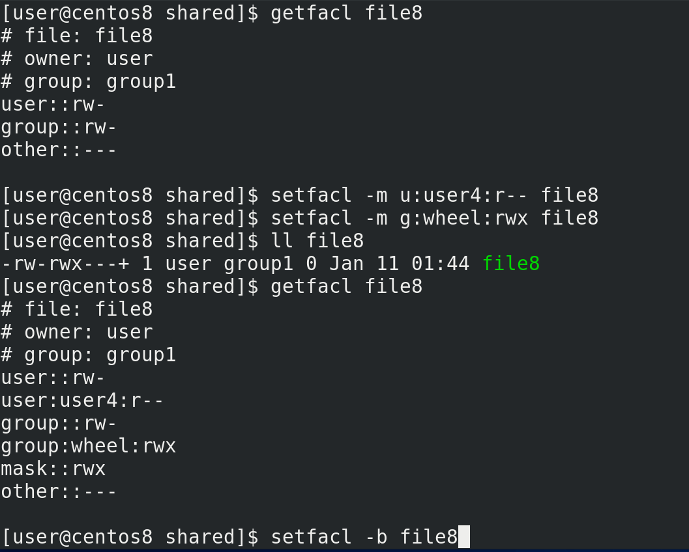

```
getfacl file8
```

показывает текущие права на файл. Как видим, владельцу user и группе group1 можно читать и изменять этот файл. User4 тоже в группе group1, но я хочу запретить ему изменять этот файл – для этого я использую утилиту setfacl:

```
setfacl -m u:user4:r-- file8
```

Команда говорит, что нужно модифицировать(-m) права для пользователя user4 и выставить их такими-то. Давайте ещё позволим группе wheel иметь полный доступ на файл:

```
setfacl -m g:wheel:rwx file8
```

После выставления acl ls показывает рядом с правами значок +, а с помощью:

```
getfacl file8
```

узнаем текущие права на файл.  Теперь user4 не может редактировать этот файл:

```
sudo -u user4 nano file8
```

Чтобы удалить дополнительные права используем ключ -b:

```
setfacl -b file8
getfacl file8
```

Возможно, тему ACL я еще затрону отдельно, но вкратце этого достаточно.


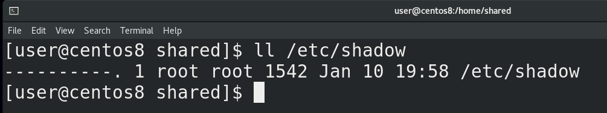

Ну и напоследок, есть интересный пример с файлом /etc/shadow:

```
ll /etc/shadow
```

Как вы видите, на этот файл никаких прав нет, даже у его владельца – root-а. Но при этом мы знаем, что при смене пароля с passwd новый пароль прописывается в этом файле, да и если открыть этот файл с nano – то мы можем читать и изменять этот файл.

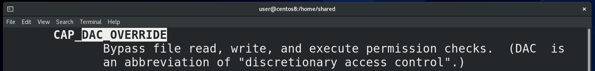

Суть в том, что все позволения работы с файлом проверяет ядро операционной системы – оно проверяет, соответствует ли uid пользователя, обращающегося к файлу, с uid-ом владельца файла на файловой системе, есть ли пользователь в группе и т.п. И при некоторых условиях – когда к файлу обращается залогиненный root, в том числе при выполнении команды passwd, ядро просто пропускает проверку и сразу даёт доступ к файлу:

```
man capabilities
/DAC_OVERRIDE
```

А вот для каких-нибудь сервисов, которые работают от имени рута, но запущены, допустим, при включении системы, а не вручную, этот файл недоступен для чтения. А при работе root может просто игнорировать все права на файлы.

Подводя итоги, мы с вами разобрали стандартные права – read, write и execute, команды chown, chgrp и chmod для смены прав и владельцев файлов, атрибуты sticky bit, setuid и setgid, права по умолчанию – umask, дополнительные права – acl. Администраторы всегда что-то делают с правами, тема хоть и простая, но может иметь много всяких нюансов, которые можно встреть при работе. Также для лучшего понимания советую почитать [статью](https://habr.com/ru/post/469667/) по ссылке.
