

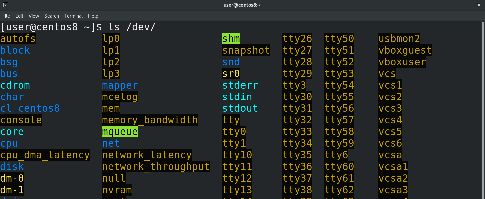

В прошлый раз мы разобрались, что udev при виде определённых устройств создаёт для них специальные файлы в директории /dev - ls /dev, через которые можно взаимодействовать с устройствами. И если с большинством устройств администратору не требуется ничего делать, то  вот с устройствами хранения информации практически постоянно нужно работать. При работе с дисками нужно быть крайне осторожными, потому что на дисках данные, а какие-то ошибки могут привести к потере этих данных. Поэтому всегда делайте бэкапы и убеждайтесь, что они в рабочем состоянии.

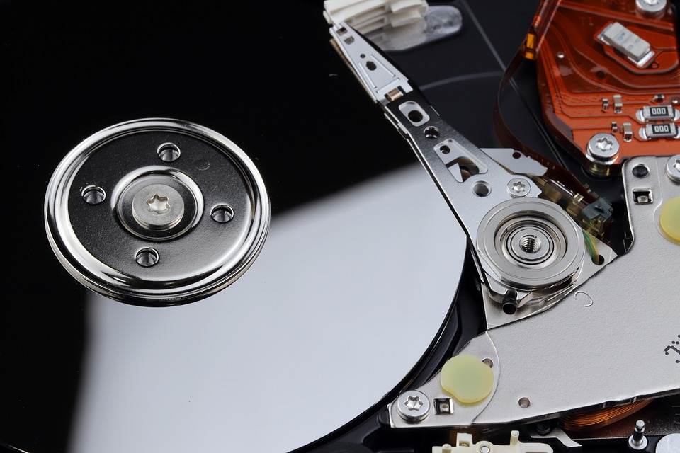

Есть разные типы накопителей и они могут по разному подключаться к компьютеру – старые диски подключались по IDE, сейчас преимущество у SATA, набирают популярность nvme SSD, есть ещё всякие флешки, подключаемые по usb, во многих компаниях диски выдаются по сети хранения данных, называемой SAN, а в облачных средах вам выдаются виртуальные диски, детали подключения которых вас могут и не интересовать. В зависимости от некоторых факторов – типа подключения диска, правил udev, которые могут отличаться в зависимости от дистрибутива – дискам могут выдаваться различные названия. При этом, несмотря на различия, для работы с устройствами хранения используется протокол SCSI – это касается и USB флешек, и SATA дисков, и сетей хранения данных и многого другого.

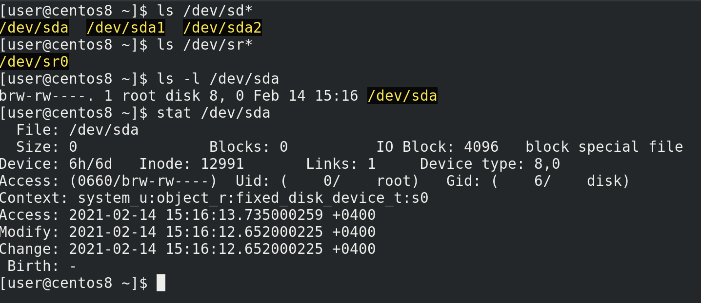

Поэтому большая часть накопителей будет именоваться sd – т.е. scsi диск - ls /dev/sd* - а дальше каждому устройству будет даваться буква по алфавиту – sda, sdb,sdc и т.п. Для cd приводов будет даваться название sr - ls /dev/sr* - sr0, sr1 и т.п. А в облаках вы будете натыкаться на названия vda, vdb и т.д. Что объединяет все накопители? Операционная система обменивается с этими устройствами данными в виде блоков данных фиксированной длины. Команда ls -l - ls -l /dev/sda, stat /dev/sda - покажет перед правами символ b – указывающий, что это блочное устройство.

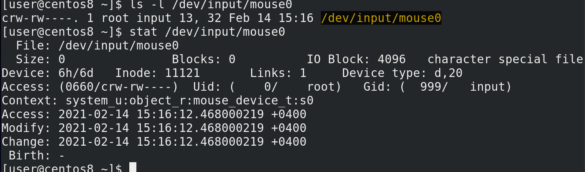

Кроме блочных устройств существуют символьные – такие устройства работают с потоком данных, а не с блоками. Допустим, та же мышка - ls -l /dev/input/mouse0, stat /dev/input/mouse0. Перед такими файлами стоит символ c – character device – символьное устройство.

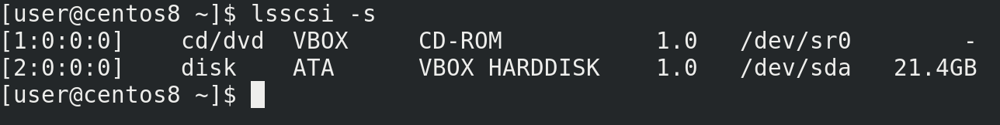

Но, как я уже сказал, чаще всего накопители работают через scsi протоколы – поэтому, как бы там не было написано в правилах udev, нам необязательно гадать – мы можем с помощью утилиты lsscsi увидеть наши диски - lsscsi -s. Как видите, тут у меня подключены дисковод и диск на 20 гигабайт, который получил название sda. Но названия, которые даёт udev – sda, sdb и т.п. -  не закрепляются за дисками навсегда. Каждый раз, когда вы запускаете систему или подключаете устройства, udev даёт название по порядку. Да, есть порядок обнаружения устройств и зачастую одни и те же диски будут называться одинаково, но ни в коем случае нельзя ориентироваться на эти названия. Допустим, если у вас 3 диска – sda, sdb и sdc и вы переподключите их, либо один перестанет работать – то sdc начнёт называться sdb. В теории это может привести к потере данных. Как? Мы разберём чуть позже. Просто запомните, что ориентироваться на эти буквы не стоит.

Из темы “О файловых системах” мы выяснили - чтобы мы могли создавать, хранить, изменять и в целом работать с файлами на диске - нам нужна файловая система. Для этого мы можем записать её на диск. В принципе, такая схема будет работать, но в целом это неудобно и может создать нам проблемы в будущем. Например, в будущем нам может понадобится переустановить систему. Как правило, это предполагает удаление старой файловой системы и создание новой – это называется форматированием файловой системы. Но, при этом, все файлы, которые мы хотели бы перенести на новую систему, также затрутся. Конечно, можно заранее закинуть всё на флешку и потом вернуть обратно – но это лишняя работа и потеря времени. Возможно, вы знаете как избежать этой проблемы – на том же Windows у вас может быть том D, на который вы кидаете файлы, и при форматировании эти данные не стираются – потому что стирается файловая система в томе C. На GNU/Linux файлы пользователей хранятся в директории /home, поэтому вам будет достаточно отделить /home от корня. Т.е. предполагается, что у вас две файловые системы на одном диске.  Для этого нужно разделить диск на так называемые разделы, и на каждый раздел записать свою файловую систему. Но чтобы компьютер знал – где начинается один раздел, где он заканчивается и начинается другой – нужно специальное место в начале диска, где указывается эта информация – таблица разделов.

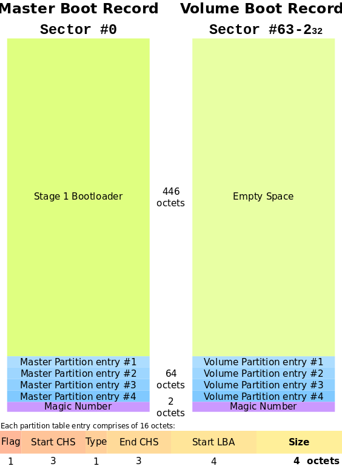

Есть разные типы таблиц разделов: MBR – которую также называют dos или ms-dos; GPT;  у Apple и BSD свои таблицы разделов; есть ещё какие-то – но это нас не интересует, в основном вы будете иметь дело с MBR и GPT. У аббревиатуры MBR есть и другое значение – главная загрузочная запись – и сама таблица разделов хранится внутри этой записи. А загрузочная запись MBR была нужна для компьютеров раньше. Дело в том, что раньше на компьютерах был чип BIOS, в котором был ряд микропрограмм, и, кроме всего прочего, BIOS отвечал за включение компьютера. Но BIOS был сильно ограничен – он должен был быть не больше десятка килобайт, оперативки ему было доступно было максимум мегабайт – ну и в таких условиях сильно не разгуляешься. И BIOS должен был в итоге загрузить операционную систему – но ведь с такими ограничениями не добавить поддержку какой-то файловой системы и программы, загружающей операционную систему. Причём операционные системы то разные, у каждого своя файловая система, каждую по своему грузить. Поэтому BIOS просто обращался к нулевому сектору жёсткого диска, где и находилась главная загрузочная запись - MBR. А там у нас и загрузчик операционной системы и таблица разделов. При этом сам MBR тоже был ограничен – всего 512 байт, из которых 446 байт на загрузчик и 64 на таблицу разделов. Забегая вперёд, скажу, что там ещё первые 63 сектора оставались свободными, в которые и помещается основная часть загрузчика, а не только эти 446 байт, но это тема загрузки операционной системы, мы это рассмотрим в другой раз.

Так вот, MBR нам даёт 64 байта на то, чтобы поместить всю информацию о разделах. А на информацию о каждом разделе требуется 16 байт. В итоге – 4 раздела. Потом появилась расширенная загрузочная запись(VBR), благодаря чему можно было создавать расширенные разделы, которые позволяли обойти ограничение в 4 раздела. Грубо говоря, там вместо самой записи о разделе указывалась ссылка на другую таблицу, в которой указывались дополнительные разделы. Также в таблице разделов MBR не получилось бы указать разделы больше 2Тб, так как адрес не помещается в таблице. По итогу, BIOS своими ограничениями создавал кучу проблем с вынужденными обходными решениями. В нулевых же решили избавиться от этих ограничений и создали новый стандарт – UEFI. Тут уже разгулялись – UEFI может весить десяток мегабайт, понимает файловые системы, может работать с сетью, имеет графический интерфейс. Точнее, это всё можно реализовать в UEFI, но не каждый производитель это делает, разве что какой-то стандартный функционал.  И, конечно же, отпала необходимость в загрузчике в MBR – зачем ограничиваться 446 байтами, когда можно в UEFI добавить поддержку файловой системы, где и будет лежать полноценный загрузчик? Плюс растут объёмы дисков – поэтому MBR заменили на GPT. Необходимость держать загрузчик в начальном секторе отпала – UEFI для этого использует специальный раздел EFI с файловой системой FAT32. Ограничение в 2 Tб тоже пропало, у GPT теоретическое ограничение почти в 10 Зеттабайт. Что касается количества разделов – то они, в принципе, не ограничены, разве что только со стороны операционной системы, но там речь про 128 разделов, чего с лихвой хватает. Но, при этом, UEFI в целях совместимости позволяет установить загрузчик в нулевой сектор, как это было в MBR.

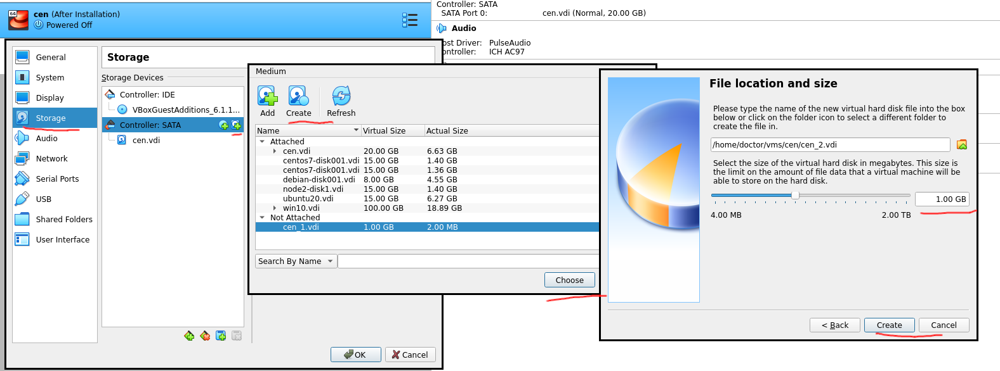

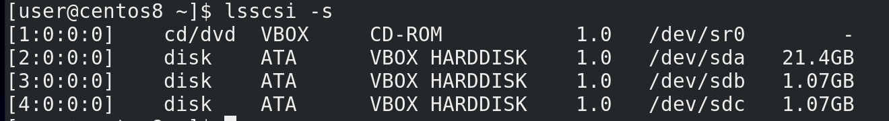

Прежде чем пойдём дальше, давайте немного попрактикуемся с таблицами разделов. Но для начала нам понадобится добавить диски для нашей виртуальной машины. Поэтому выключаем виртуалку, открываем её настройки, переходим во вкладку Storage – Controller SATA  и добавляем два жёстких диска, создаём их – по гигабайту будет достаточно, можно даже обойтись меньшим объёмом. Нажимаем OK и запускаем виртуалку. Теперь lsscsi -s покажет нам ещё два диска по гигабайту, с названиями sdb и sdc.

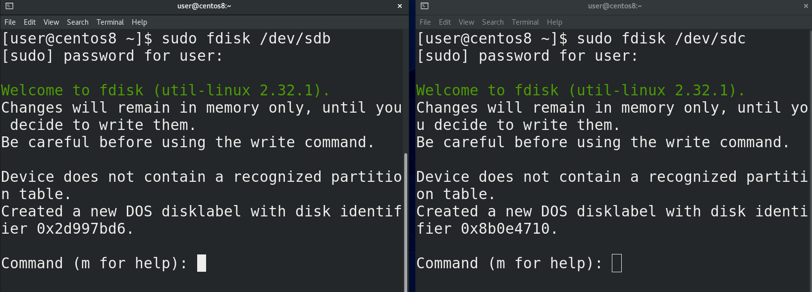

И так, диски у нас есть – sdb и sdc.  Давайте создадим таблицу разделов и пару разделов. Для этого используем утилиту fdisk - sudo fdisk /dev/sdb; sudo fdisk /dev/sdc. И так, для начала, нас предупредили, что всё что мы делаем – не сразу происходит, а сохраняется в памяти, и если мы захотим – то пишем w и изменения вступают в силу. Дальше нас предупредили, что на диске не нашли никакой таблицы разделов, поэтому программа создала таблицу DOS – но опять же, без write-а ничего на деле не изменилось.

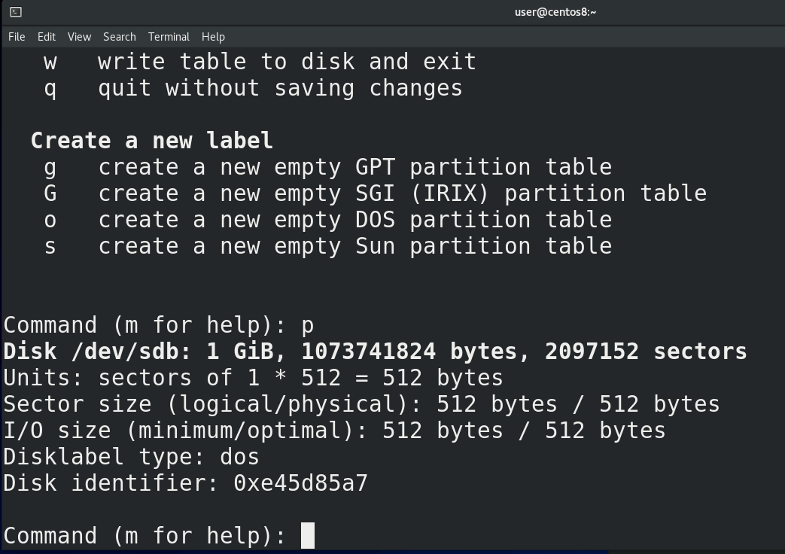

Ну и небольшая подсказка по командам с помощью m. Для начала выведем информацию – буква p. Наш диск – /dev/sdb, его размер – 1 Гибибайт, количество байт и секторов. Каждый сектор по 512 байт – умножаем на количество секторов – получаем количество байт. Буква o – создаёт таблицу разделов DOS, буква g – GPT.

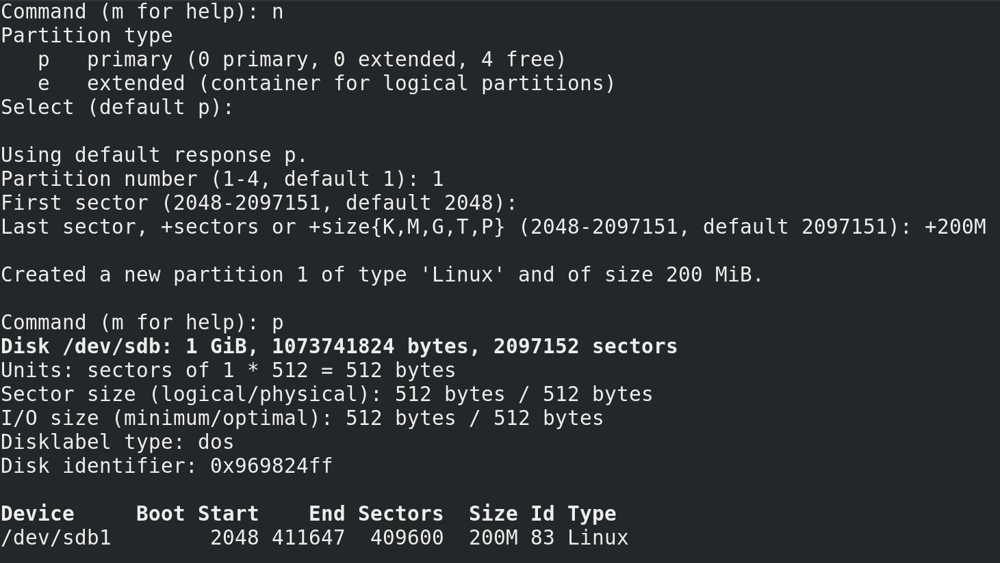

И так, с помощью o создали таблицу разделов, теперь можем создавать разделы. Для этого буква n – new partition. В случае с DOS у нас спрашивает – будет ли это основной раздел или расширенный. Основных может быть 4, а для создания расширенного используется один из основных. Выберем основной – по умолчанию он и создаётся, поэтому просто enter. Дальше нужно выбрать его номер – допустим 1. Потом выбираем начальный сектор – пусть будет 2048 – оставляем по умолчанию. Дальше пишем последний сектор, либо необходимый размер для раздела через +, допустим +200M. Создалось. Теперь пишем p и видим новый раздел. Разделы называются как соответствующий диск – то есть sdb, а в конце указывается номер раздела - sdb1.

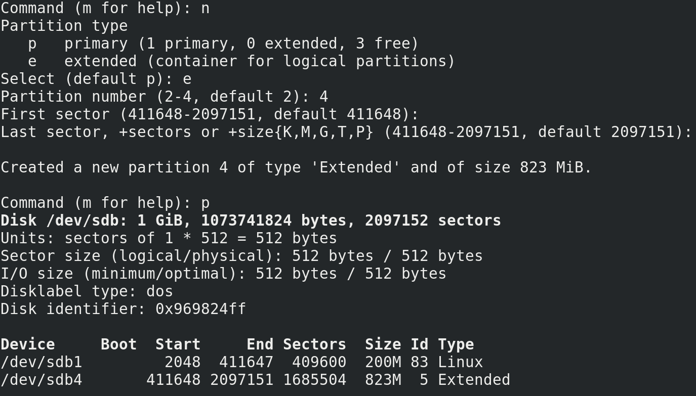

Давайте, для примера, создадим ещё один раздел. n - выберем extended – в качестве основного используем 4; первый сектор оставим как есть – это первый незанятый сектор;  дальше просто нажмём enter – тогда используется всё доступное пространство. Опять p – видим наши разделы. Но сам по себе расширенный раздел мы использовать не будем – он просто позволит создавать внутри него другие разделы, называемые логическими разделами.

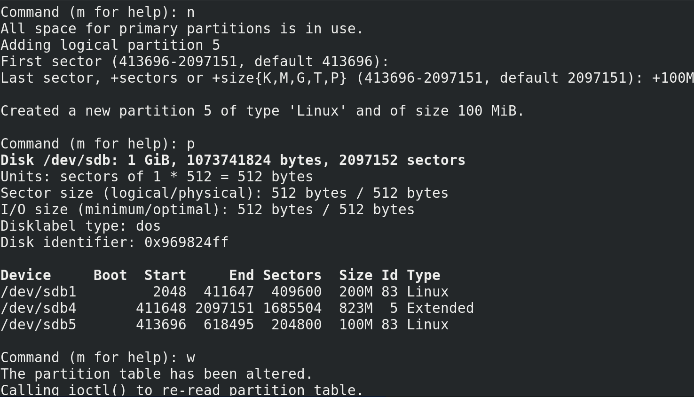

Поэтому опять n – оставляем первый сектор как есть, потом указываем размер раздела - +100M, и опять p. Теперь видим, что у нас есть 3 раздела: первый - sdb1 – это основной раздел; дальше у нас расширенный раздел – sdb4 – он у нас вроде платформы, внутри которой мы создаём логические разделы, к примеру - sdb5. Когда нас всё устраивает, мы пишем w и изменения сохраняются.

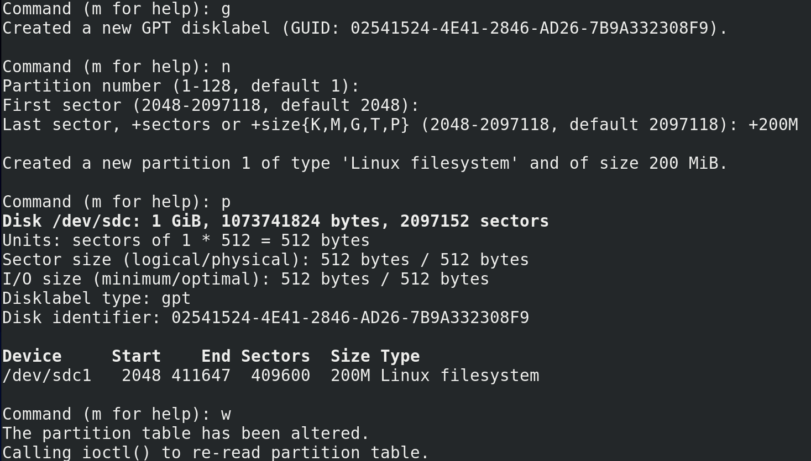

Теперь создадим разделы на диске sdc с таблицей разделов GPT. Для её создания - g. Для нового раздела – n. У нас спрашивают номер раздела – оставим 1. Первый сектор – оставляем как есть. Последний сектор - +200M. И p, чтобы вывести информацию о разделах. Как видите, никакой возни с расширенными и логическими разделами. Опять же - w – сохраняем изменения.

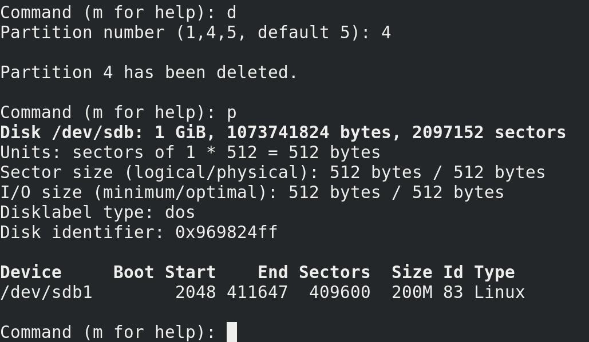

Для удаления какого-то раздела - sudo fdisk /dev/sdb – буква d – выбираем раздел –  4, enter, а потом p. Как видите, sdb5, который был внутри sdb4, удалился в том числе. Поэтому просто нажимаем q и ничего не сохраняем.

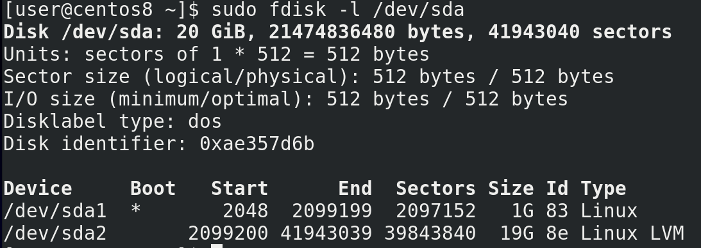

Чтобы увидеть, что у нас с разделами в системе – sudo fdisk -l. Тут у нас и то, что мы создали только что, а также  sda1 и  sda2  - там где у нас хранится система.  Если посмотреть внимательнее на sda2 - sudo fdisk -l /dev/sda - то можно увидеть, что его тип – Linux LVM. Про LVM мы ещё поговорим.

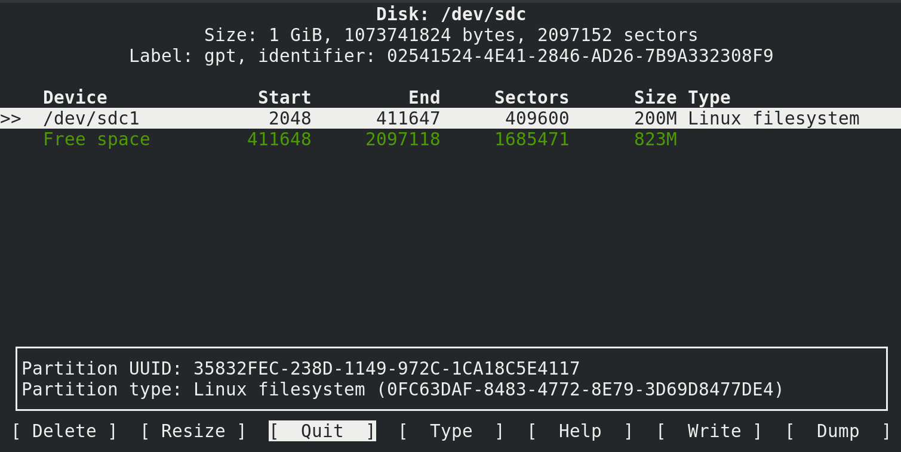

Через командную строку вы также можете воспользоваться псевдографической утилитой cfdisk - sudo cfdisk /dev/sdc. Также есть и другие утилиты – к примеру parted. В конечном счёте, чем пользоваться – решаете вы. Но в целом, практически на всех системах бывают предустановлены fdisk и parted. На старых системах можно наткнуться на fdisk, который не поддерживает GPT, но сейчас это не так актуально. В любом случае, знать много инструментов – хорошо, но зная основы можно разобраться с любой утилитой.

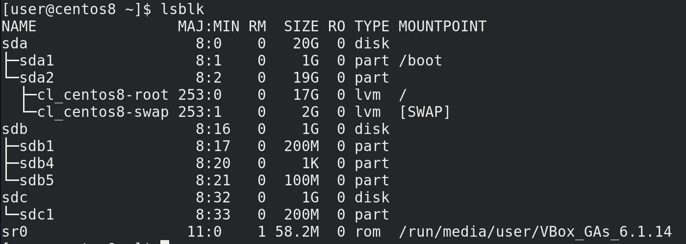

Напоследок, lsblk – покажет вам блочные устройства в древовидной форме, где прекрасно видно, что это за диск или раздел и к чему он относится.

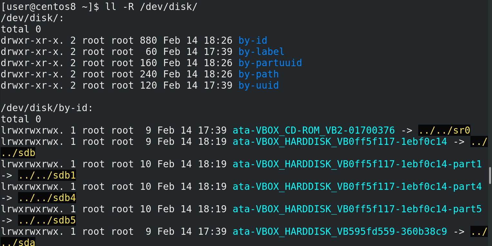

Помните, названия дисков даются udev-ом и могут меняться? Однако у дисков и разделов могут быть свои идентификаторы, которые могут помочь вам опознать различные устройства. И это хорошо видно, если запустить команду ll -R /dev/disk, где по различным идентификаторам есть символические ссылки, указывающие на текущее название каждого диска и раздела. То есть, как бы не изменилась буква диска – sda, sdb или sdc – идентификатор всегда будет один и тот же, и обращаясь к диску или разделу по идентификатору, вы всегда будете обращаться к нужному диску или разделу.

Получилось довольно много информации, хотя пока мы не затронули тему файловых систем и LVM. Попрактикуйтесь с разделами – создавайте их, удаляйте, используйте различные утилиты – как графические – тот же Disks и Gparted, так и терминальные – fdisk, cfdisk, parted. Всё это позволит вам лучше закрепить материал и в дальнейшем более уверенно чувствовать себя при работе с дисками и разделами.
