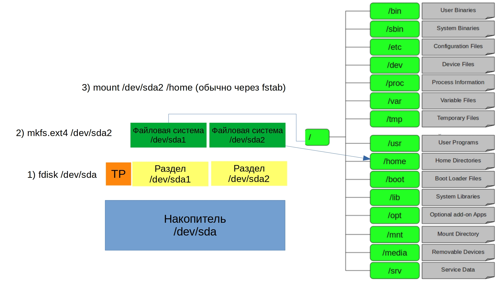

Стандартную схему работы с дисками и файловыми системами мы разобрали – создаём раздел с помощью fdisk, создаём на разделе файловую систему с помощью mkfs и монтируем файловую систему куда нужно.

Но представьте себе ситуацию, когда у вас на каком-то разделе перестало хватать места. Если этот раздел крайний и после него есть свободное место – то его можно увеличить. А что если раздел не крайний, если после него есть ещё?

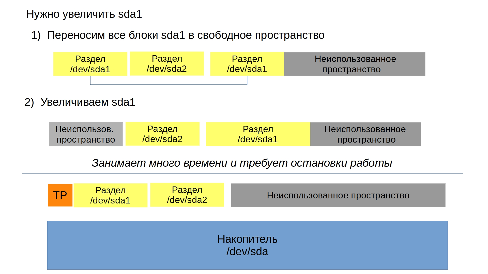

Стандартные таблицы разделов в этом плане ограничены, для раздела указывается только первый и последний сектор, то есть нельзя указать, чтобы раздел начался в одном месте, в другом закончился, а потом в третьем продолжился. 

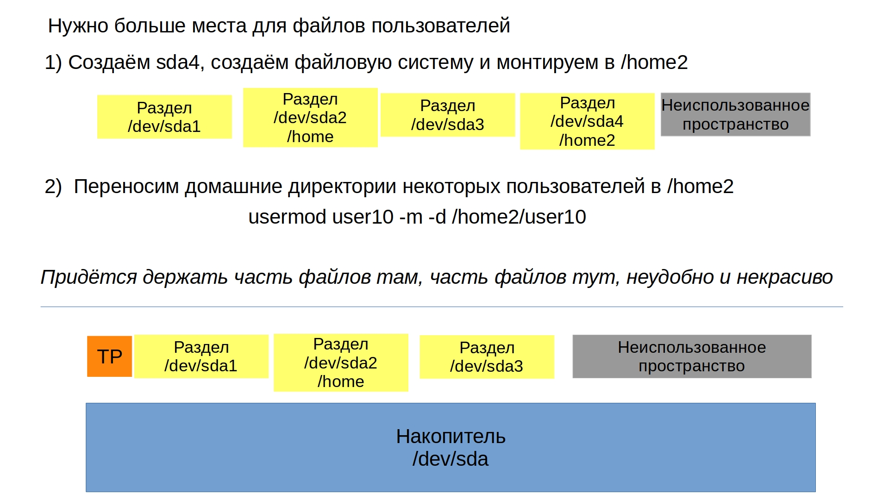

В некоторых случаях это не проблема – можно создать ещё один раздел, на нём поднять новую файловую систему и примонтировать куда-то. Допустим, создать директорию /home2, примонтировать туда новую файловую систему и перенести домашние директории некоторых пользователей в эту директорию. Просто нельзя несколько файловых систем монтировать в одну директорию. Точнее можно, но обходными, ненадёжными путями, чего стоит избегать.

Но иногда встречается софт, которому нужно хранить все свои файлы в одной директории, допустим, базу данных. И вот настаёт день, когда на разделе, где лежат данные, перестаёт хватать места. Примонтировать новую файловую систему в эту директорию не получится. Можно купить диск большего объёма и перенести на него файлы. Но, если там терабайты данных, перенос займёт много времени, а сервис при этом будет недоступен. И потом получится, что на первом диске место освободилось, но мы его не можем использовать. А завтра второй диск забьётся, опять купим новый диск большего объёма, опять перенесём на него файлы, и теперь у нас и первый и второй диск не будут использоваться.

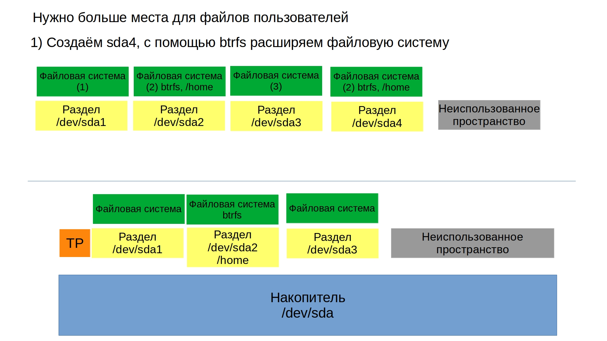

Но мы монтируем файловую систему, так? И, если таблицы разделов не позволяют, можно ли на уровне файловой системы сделать так, чтобы одна файловая система могла работать на нескольких разделах и дисках? Да, действительно, есть такие файловые системы – допустим, btrfs. Но это относительно молодые файловые системы, пока не используемые повсеместно. Однако, вполне может быть, что через пару лет все файловые системы будут поддерживать возможность работы на нескольких разделах и дисках. 

Хорошо, есть ли что-нибудь проверенное годами, что-то выше таблицы разделов, но ниже файловой системы? Да, есть такое и оно называется LVM – менеджер логических томов. Он позволяет вам объединять несколько разделов и дисков чтобы создать общее пространство. На основе этого общего пространства вы можете создавать логические разделы, на которых вы создадите файловую систему, примонтируете и всё как обычно.

Схема довольно простая – ваши разделы и диски становятся физическими томами – physical volume – pv. Общее пространство, которое формирует группа физических томов называется группой томов – volume group – vg. А разделы, которые создаются внутри этой группы – логическими томами – logical volume – lv. Физический том – группа томов – логический том. Несложно, просто нужно пару раз попрактиковаться. При этом LVM позволяет добавлять разделы и диски в группу томов и увеличивать логические тома с файловыми системами без необходимости останавливать работу. Логические тома ещё можно уменьшать при необходимости, но для этого надо уменьшить файловую систему, а это не всегда просто. Это далеко не весь функционал LVM, но давайте пока немного попрактикуемся. 

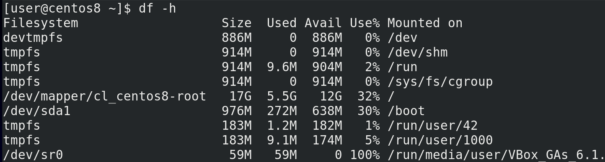

Для начала, я восстановил снапшот виртуалки, чтобы /home не был на диске sdc, так как нам понадобятся 2 диска для тестов - df -h. Вы можете восстановить снапшот, перенести /home обратно, либо добавить 2 новых диска. 

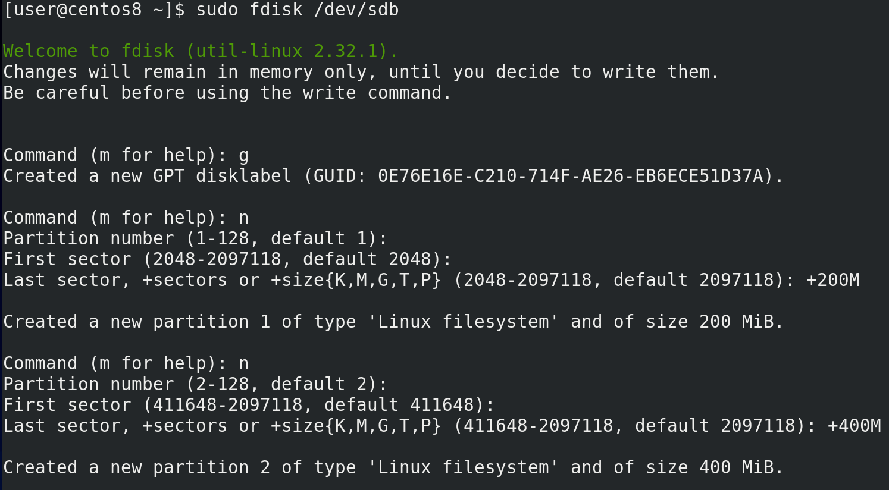

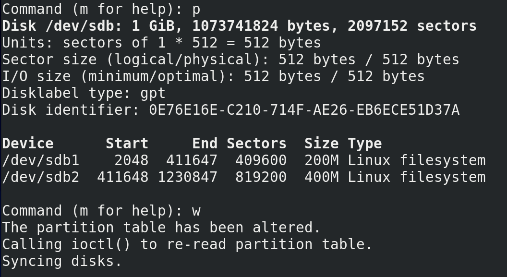

Начнём с простого – создадим таблицу разделов на диске sdb и два раздела на 200 и 400 мегабайт - sudo fdisk /dev/sdb; g - n, enter, enter, +200M; n, enter, enter, +400M; p, w. 

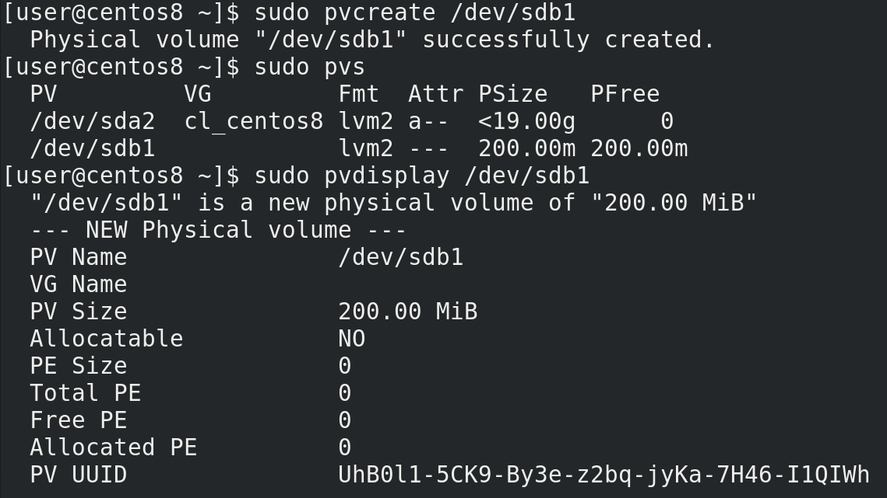

Хотя следующий шаг можно пропустить, я этого делать не буду, чтобы было понятнее. Вспоминаем последовательность – physical volume, volume group и logical volume. Все три нам нужно создать по порядку. И так, physical volume – это pv, создать – create - pvcreate и указываем раздел или диск, который будет использоваться – sudo pvcreate /dev/sdb1. Смотрим вывод – success – значит всё окей. У нас теперь есть физический том, посмотреть его мы можем с помощью sudo pvs; sudo pvdisplay /dev/sdb1. Как видите, тут помимо sdb1 есть ещё sda2 – это потому что при установке система сама создала LVM, но мы его трогать не будем. 

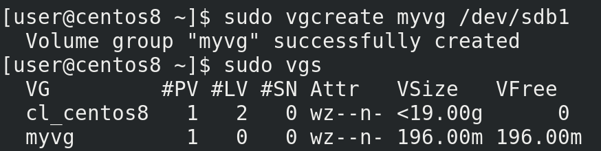

Physical volume у нас есть, дальше нужно создать группу томов – volume group – vgcreate. Для этого нужно дать ей имя и указать physical volume, один или несколько – sudo vgcreate myvg /dev/sdb1; sudo vgs. Опять видим success – всё окей. 

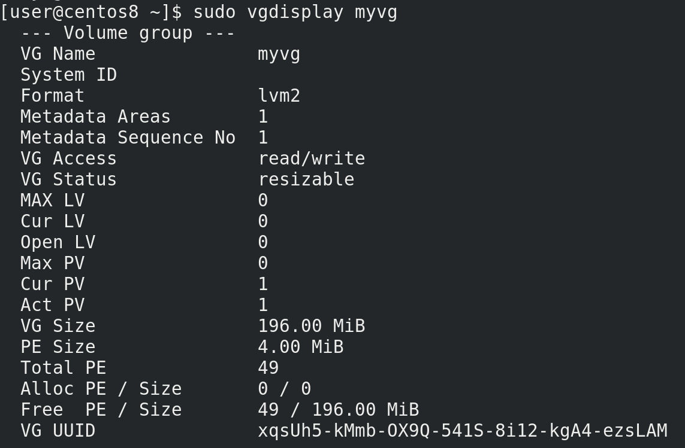

Как посмотреть? Правильно - sudo vgdisplay myvg. Опять же, у нас тут есть volume group, который создался при установке – cl_centos8 и наша группа – myvg. Отсюда же можем посмотреть информацию о ней, допустим, сколько свободного места – почти 200 мегабайт. Тут ещё есть PE – physical extents. Это блоки, которыми оперирует LVM. Как видите, они у нас по 4 мебибайта и их у нас в сумме 49.

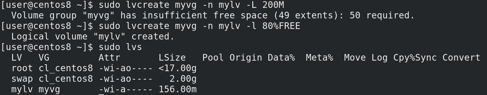

Последний шаг – logical volume – lvcreate. Тут у нас опций чуть больше – нужно указать в каком volume group мы хотим создать наш логический том, указать имя для logical volume и указать размер – sudo lvcreate myvg -n (name – имя) mylv -L (размер) 200M - sudo lvcreate myvg -n mylv -L 200M. Как видите, у нас не получается выдать 200, потому что 1 блок ушёл на метаданные для LVM. Мы можем указать 196 или поступить по другому – выдать свободное место по процентам. Допустим, выдать всё свободное место, либо 80 процентов свободного - для этого ключ -l - sudo lvcreate myvg -n mylv -l 80%FREE; sudo lvs.

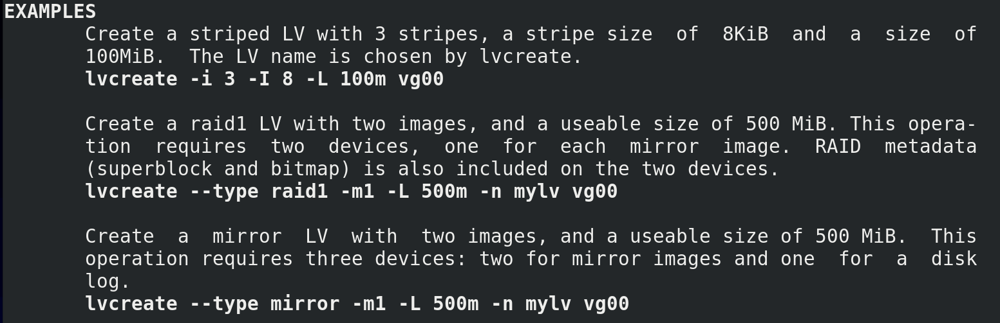

Кстати, важное замечание – если открыть man по любой из предыдущих команд lvm, допустим man, lvcreate и спуститься в самый низ, там есть примеры использования. И если вы вдруг забудете какой-то ключ, то эти примеры помогут вам вспомнить. 

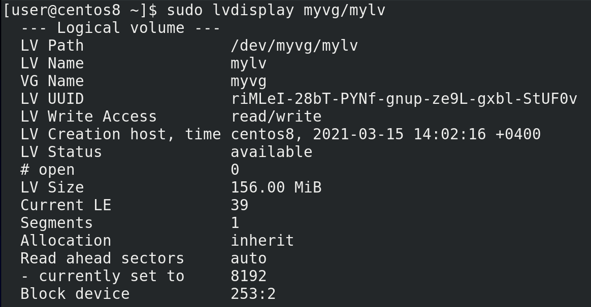

А сейчас, давайте посмотрим, что у нас получилось – sudo lvdisplay myvg/mylv. И так, тут у нас появился путь - /dev/myvg/mylv.

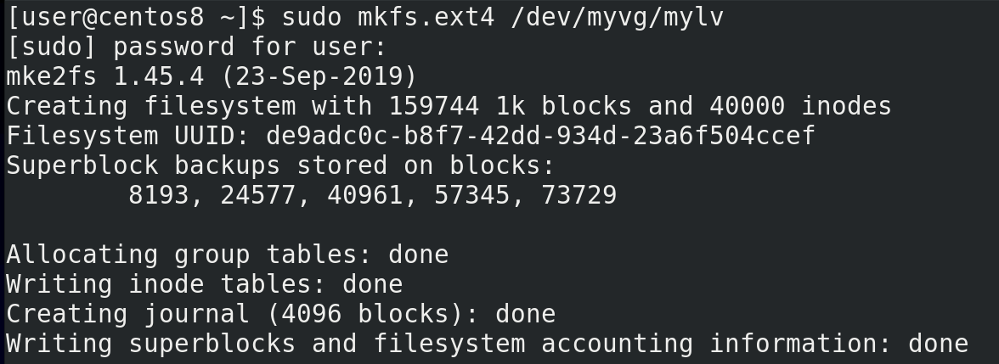

Именно сюда мы поставим файловую систему с помощью mkfs - sudo mkfs.ext4 /dev/myvg/mylv. 

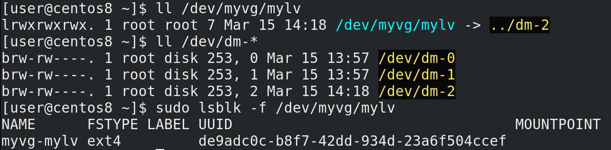

Сам же этот файл - ll /dev/myvg/mylv - является символической ссылкой на /dev/dm-2 - ll /dev/dm-*, который, как и sda, генерируется при обнаружении устройств. А значит, если говорить про fstab, /dev/dm-2 там указывать нельзя. Можно указать UUID - sudo lsblk -f /dev/myvg/mylv - или /dev/myvg/mylv. 

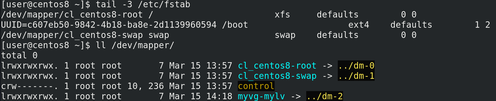

Но, при определённых условиях, о которых вы можете почитать по [ссылке](https://xan.manning.io/2017/05/29/best-practice-for-mounting-an-lvm-logical-volume-with-etc-fstab.html), оба варианта могут создавать проблемы. Поэтому лучший способ – способ, который предлагает сам RedHat – уже указан в fstab — tail -3 /etc/fstab - /dev/mapper. Если посмотреть - ll /dev/mapper - можно увидеть, что, как и /dev/myvg/mylv, тут символические ссылки.

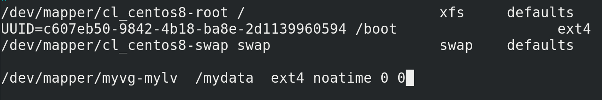

В целях совместимости рекомендую использовать вариант именно с /dev/mapper, потому что на старых системах с другими вариантами могут быть проблемы - sudo nano /etc/fstab, /dev/mapper/myvg-mylv /mydata ext4 noatime 0 0.

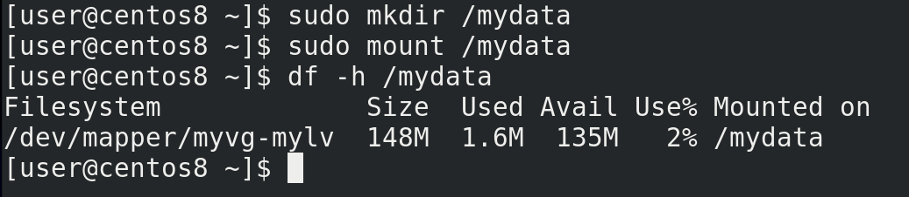

Примонтируем и убедимся, что всё работает - sudo mkdir /mydata; sudo mount /mydata, df -h /mydata.

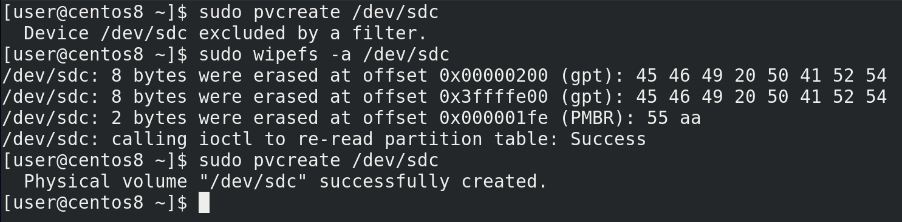

Предположим, у нас перестало хватать места и мы решили добавить ещё один диск – sdc.  Так, у нас есть volume group, состоящий из одного physical volume – раздела sdb1. Я хочу полностью отдать весь диск sdc volume группе myvg. Первый шаг – создаю physical volume - sudo pvcreate /dev/sdc. Но вместо привычного success я тут вижу excluded by a filter. LVM заботливо отказывается использовать весь диск, так как там уже есть таблица разделов. Чтобы избавиться от неё я использую утилиту wipefs с ключом -а - sudo wipefs -a /dev/sdc.  И теперь всё у меня создаётся как надо - sudo pvcreate /dev/sdc.

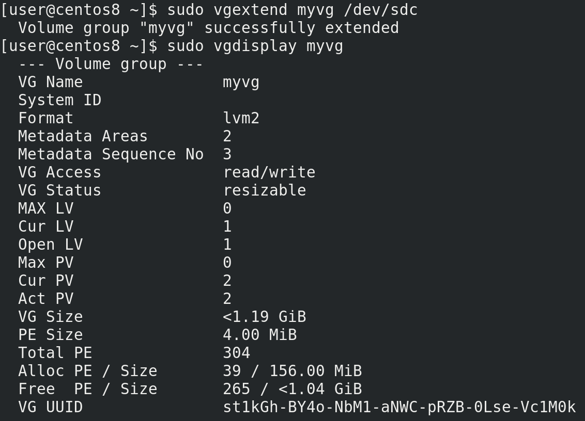

Дальше мне нужно расширить volume группу и добавить в неё новый диск. Расширить это extend, а значит пишем - sudo vgextend myvg /dev/sdc. Видим success и смотрим sudo vgdisplay myvg. Теперь в myvg 2 physical volume, 304 блока и гигабайт свободного места. Но это пока что группа, нужно ещё увеличить logical volume и файловую систему.

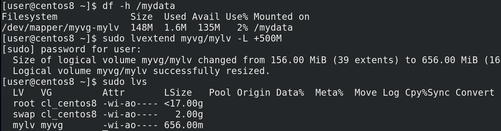

Да, если просто увеличить раздел или логический том – файловая система об изменениях не узнает. Поэтому нужно проделать 2 операции, но можно и одной командой. И так, смотрим сколько у нас свободного места на файловой системе - df -h /mydata – 100 с лишним мегабайт. Теперь пишем - sudo lvextend myvg/mylv -L +500M. Видим success – значит всё получилось. Смотрим размер logical volume – sudo lvs – 600 с лишним мегабайт. 

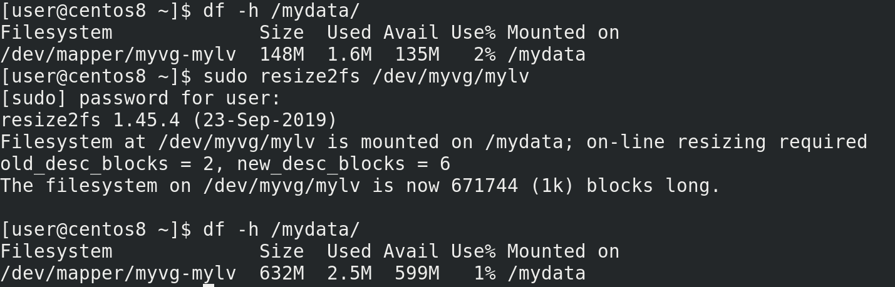

Смотрим df -h /mydata – 100 с лишним, ничего не изменилось. Файловая система изменений не увидела. Но об этом ей можно сказать – sudo resize2fs /dev/myvg/mylv. Теперь опять проверяем – df -h /mydata – всё как надо. 

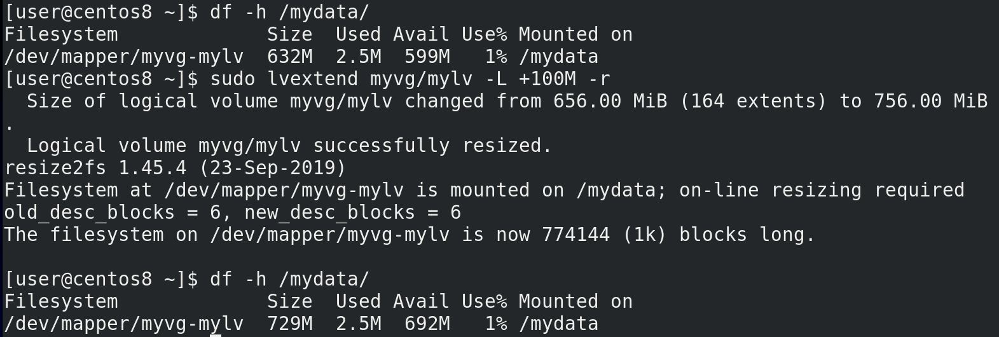

Но можно сразу увеличить размер файловой системы при увеличении logical volume - тот же lvextend но с ключом -r  - sudo lvextend myvg/mylv -L +100M -r; df -h /mydata. Как видите, никаких лишних действий.

Таким образом, мы смогли увеличить нашу файловую систему и в дальнейшем мы всегда сможем продолжать так делать, без необходимости останавливать работу, просто добавляя новые разделы или диски в нашу volume группу. При этом нам не важно, где заканчивается один lv и начинается другой – нет таких ограничений, как со стандартными разделами. Что касается удаления, то всё также просто – lvremove, vgremove и pvremove. В момент удаления логические тома не должны быть никуда примонтированы. Есть ещё много разных базовых команд с LVM – уменьшить размер, удалить physical volume из volume группы, переместить данные с одного physical volume на другой и много всего – но их много, они ситуативны, и всё разбирать в азах бессмысленно.

Но как я говорил, это далеко не весь функционал LVM-а. Как вы заметили, я стараюсь не выделять всё свободное пространство на logical volume. С одной стороны потому, что когда понадобится, увеличить размер файловой системы получится без труда. А вот если мне вдруг перестанет хватать места и я захочу уменьшить один из разделов – это будет сложнее. С другой стороны – свободное место нужно для снапшотов. 

Вы уже знаете, что такое снапшот – снимок текущего состояния. Мы делали снапшоты для виртуалки - сняли снапшот после установки системы, и, если вдруг мы где-то что-то испортим, всегда можем вернуться к прежнему состоянию. Это как сохранение в играх. В виртуальной инфраструктуре гипервизоры позволяют нам делать снапшоты. Когда нет гипервизора, допустим, это система, установленная на физический сервер или ваш домашний компьютер – снапшот не сделаешь, но можно делать бэкапы. Но, в случае проблем, восстановление из бэкапа занимает много времени – нужно перенести данные из одного накопителя в другой, это сильно зависит от скорости накопителя. В целом, восстановление из бэкапа чуть ли не последний вариант, к которому прибегают администраторы. 

Да и даже восстановление снапшота в виртуальной инфраструктуре не всегда приятно – для этого нужно выключить виртуалку – а если на ней какой-нибудь тяжелый софт, который долго запускается, или, скажем, виртуалку не трогали годами – есть шанс, что всплывёт куча других проблем. Тут нам на помощь приходит тот же самый LVM, который сам может делать снапшоты. Тут всё немного проще – вам не нужно перезагружать виртуалку и можно делать на физическом сервере. Всё что нужно чтобы восстановить – отмонтировать файловую систему. Да, если у вас проблемы в корневой файловой системе, что-то там после обновления отвалилось, без перезагрузки не обойтись. Если проблемы с данными какого-нибудь сервиса вам придётся остановить его, чтобы отмонтировать файловую систему с данными и восстановить снапшот. Но это в любом случае быстрее, легче и нередко можно обойтись без перезагрузки.

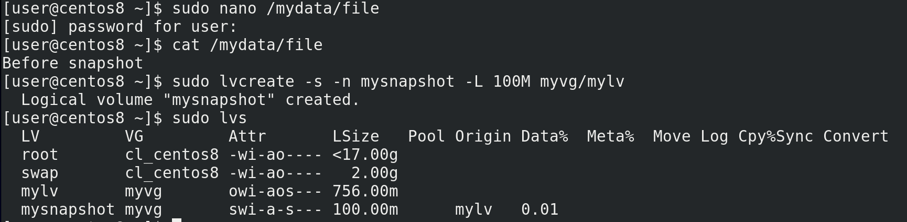

И так, прежде чем сделаем снапшот, создадим файл в /mydata, на который будем ориентироваться - sudo nano /mydata/file; Before snapshot; cat /mydata/file. Теперь создадим снапшот, нам для этого понадобится та же команда lvcreate с опцией -s - снапшот. Пишем sudo lvcreate -s -n (имя снапшота) mysnapshot -L 100M (размер снапшота) myvg/mylv — sudo lvcreate -s -n mysnapshot -L 100M myvg/mylv; sudo lvs. Снапшот создан.

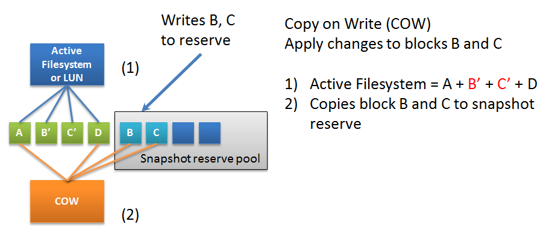

У вас, возможно, возникли два вопроса – что за размер снапшота и почему так мгновенно? LVM  использует технологию copy-on-write – копирование при изменении. Это работает так – мы создаём какое-то место для снапшота на диске – допустим на 100 мегабайт. Когда мы что-то меняем на исходном logical volume – старые блоки перед изменением копируются в это специальное место, в итоге на оригинальном lv новые блоки, а в выделенной области старые версии этих блоков. В случае, если у нас прям все блоки заменятся на исходном lv, размер снапшота должен быть размером с исходный логический том, ну, чуть больше, для всяких метаданных. А в большинстве случаев меняются не все блоки, а только часть, поэтому размер снапшота может быть меньше, т.е. нужно думать, а как много измениться на исходной lv, пока я буду держать снапшот. 

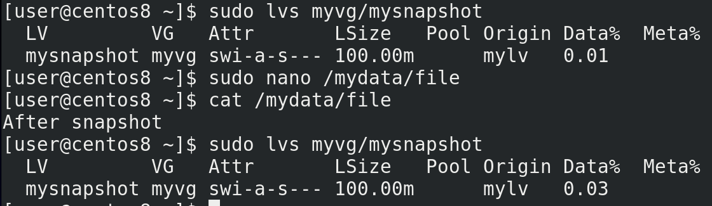

Теперь изменим наш файл — sudo lvs myvg/mysnaphost; sudo nano /mydata/file; After snapshot; cat /mydata/file. Смотрим lvs - sudo lvs myvg/mysnaphost - видим, что у снапшота используемое пространство немного изменилось.

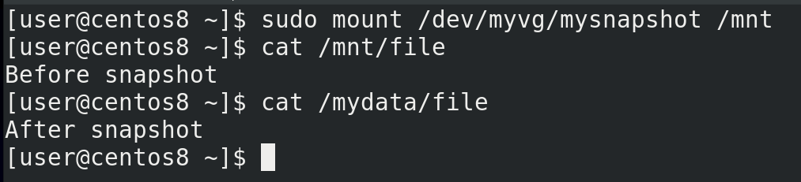

Кстати, мы можем примонтировать его и увидеть наши файлы в их исходном виде - sudo mount /dev/myvg/mysnapshot /mnt, cat /mnt/file, cat /mydata/file. 

Снапшот можно удалить как и обычный логический том – sudo lvremove myvg/mysnapshot, но я этого делать не буду. Вместо этого, давайте восстановимся из этого снапшота. Для этого нам понадобится отмонтировать снапшот и исходный том - sudo umount /mnt /mydata. Далее соединить снапшот с исходным lv – sudo lvconvert –merge myvg/mysnapshot. Дальше снапшот удалится и мы сможем примонтировать наш lv как раньше и проверить файл - sudo mount /mydata, cat /mydata/file, sudo lvs.

В целом снапшоты увеличивают количество записей на диске, поэтому на активно используемых томах они будут снижать производительность диска, особенно когда снапшотов несколько. Поэтому их стоит делать перед какими-то изменениями – допустим, перед обновлением системы. А потом, если всё прошло успешно, их удалять. Также снапшоты помогают с бэкапом – во время снапшота сохраняется текущее состояние файловой системы, из-за чего софту для бэкапа легче работать с этим самым снапшотом, а не исходной файловой системой, на которую постоянно может идти запись.

Если же в целом говорить про LVM, это отличный инструмент, который даёт администратору возможность более гибко работать с дисками. В то же время, это дополнительный слой абстракции и проблемы с LVM решать сложнее, чем проблемы с обычными разделами. Однако, больше практики, самостоятельного изучения и всяких экспериментов помогут вам лучше освоить этот инструмент. Больше информации про LVM вы можете найти по [ссылке](http://xgu.ru/wiki/LVM). Но, в рамках основ, вам достаточно знать базовые операции – как создать physical volume, volume group, logical volume, как расширить vg и lv c учётом файловой системы, ну и как работать со снапшотами. 