

Представьте – у вас есть сервер, на котором работает важный сервис. Вы подняли на сервере LVM, периодически добавляете диски и вроде всё нормально. Пока в один день не выходит из строя один из дисков. Диски периодически портятся, это совершенно нормально и вы можете по гарантии заменить диск. Гораздо страшнее, что случится с вашими данными. Во первых, восстановить данные из повреждённого диска не всегда возможно, а если что-то и можно восстановить, то это обычно стоит бешеных денег. Но это только часть проблем. Если какой-то логический том использовал несколько дисков, включая проблемный, то придётся потратить много часов, а то и дней, чтобы восстановить хоть что-то, а о полном восстановлении можно забыть. Это уже тот случай, когда нужно восстанавливать из бэкапа.

Учитывая, сколько проблем может создать один повреждённый диск, компании готовы заплатить чуть больше за железо, чтобы избежать таких проблем. И задачи примерно такие – выход диска из строя не должен приводить к потере данных и остановке работы сервиса. Для решения этих задач была разработана технология RAID – избыточный массив независимых дисков. Вариаций RAID-а, а точнее уровней, много и самый простой вариант – записывать одни и те же данные на два или больше дисков. Такой уровень RAID называется RAID 1 или mirror. Выйдет из строя один диск – не проблема, все данные есть на втором диске. Правда есть пара нюансов. Во первых – скорость записи немного уменьшается, так как нужно писать одни и те же данные на несколько дисков, хотя данные и пишутся параллельно. Во вторых – вам нужно минимум в два раза больше дисков. Учитывая, что серверные диски стоят дороже, так как должны работать 24/7 и быть надёжнее, то разница между 10 и 20 дисками довольно большая, не говоря уже о большем количестве дисков. Тут и другие нюансы  - у вас на сервере может быть 12 слотов на диски, а значит полезное пространство дадут только 6 дисков. А если в дальнейшем понадобится больше места? Либо покупать новые диски большего объёма и каким-то образом переносить все данные на новые диски. Либо покупать систему хранения данных, либо второй сервер. Всё не так просто и много где придётся искать компромисс.

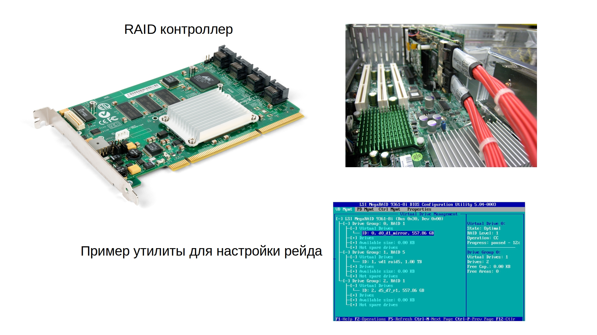

Кроме RAID 1 есть и другие уровни. Большинство компаний, у которых есть сервера, используют RAID с уровнями 1, 5, 6 и 10. Но это большая тема с кучей нюансов, которые не относятся к этому курсу, но вы можете почитать о них по [ссылке](https://ru.wikipedia.org/wiki/RAID). RAID можно реализовать как на уровне операционной системы – что называют программным рейдом, так и на уровне отдельного контроллера, или впаянного в материнку чипа, что называется аппаратным рейдом. И, скорее всего, на работе вы увидите именно аппаратный рейд – он независим от операционной системы, не использует ресурсы центрального процессора, работает чуть быстрее и может иметь специальную батарею, которая позволит не потерять данные в случае резкого выключения сервера. Но он стоит денег и в случае проблем с контроллером придётся покупать контроллер у того же вендора, иначе можно потерять все данные. Дело в том, что RAID добавляет уровень абстракции, храня метаданные на дисках. При этом каждый производитель делает это по своему, из-за чего разные контроллеры могут не определить RAID другого вендора. Хотя в случае первого рейда это не всегда актуально. Но в случае программного рейда вы не зависите от контроллера, вам просто нужен модуль в ядре, который и будет работать с рейдом.

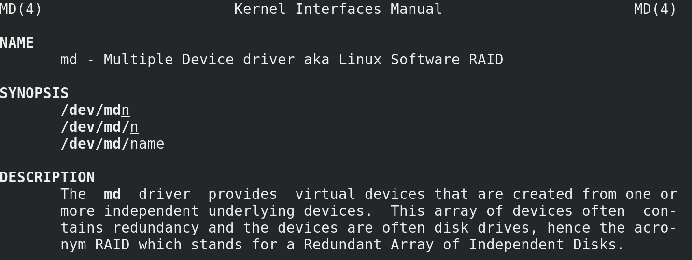

Вообще, RAID можно настроить и с помощью LVM. Но сам по себе LVM при работе с рейдом обращается к другому модулю для работы с рейдом – md – multiple devices - man md. И лучше научиться работать с самим md чтобы не зависеть от LVM, так как LVM это делает поверхностно, а с md можно сделать гораздо больше. Мы с вами для теста поднимем RAID 1 на sdb и sdc.

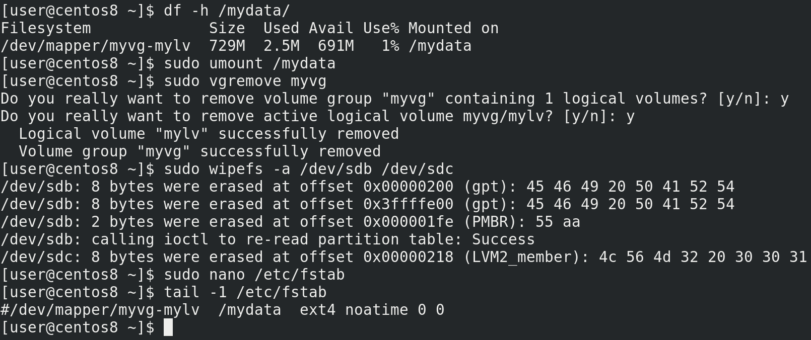

Но сейчас на них находится LVM - df -h /mydata, который мы создали в прошлый раз, он примонтирован в /mydata. У меня здесь ничего важного нет, поэтому я могу отмонтировать файловую систему - sudo umount /mydata, удалить vg - sudo vgremove myvg, которая при удалении также предложит удалить логический том, а потом затереть все метки с дисков - sudo wipefs -a /dev/sdb /dev/sdc. Также не стоит забывать про строчку в fstab - sudo nano /etc/fstab; tail -1 /etc/fstab, её я просто закомментирую, так как она нам ещё понадобится.

Прежде чем создадим рейд, прибегнем к одной особенности программного рейда. Если говорить про аппаратный рейд, то очень сильно рекомендуется использовать диски одного вендора, одной модели и чуть ли не одной партии, потому что при одинаковых параметрах дисков – их объёме и скорости чтения и записи, гарантированно всё будет окей. Если диски разные – то при создании рейда будет выбираться скорость и объём самого малого и медленного диска. У разных вендоров объёмы дисков могут немного отличаться, пусть хоть на 1 сектор, не важно. И если у вас вышел из строя диск, вы купили другой и внезапно оказалось, что там на 100 секторов меньше, чем на других дисках рейда – то ваш рейд просто не примет новый диск. Поэтому для аппаратного рейда практически всегда используются одинаковые диски.

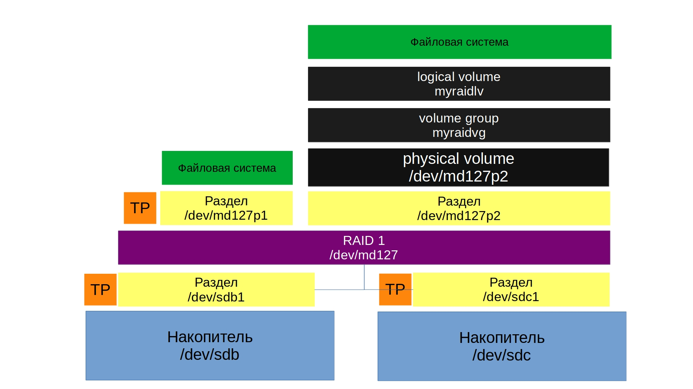

Что касается программного рейда, такой проблемы можно избежать. Для этого под рейд можно давать не весь диск, а чуть меньше, чтобы в случае замены подошёл любой новый диск нужного объёма. Для этого можно использовать разделы.

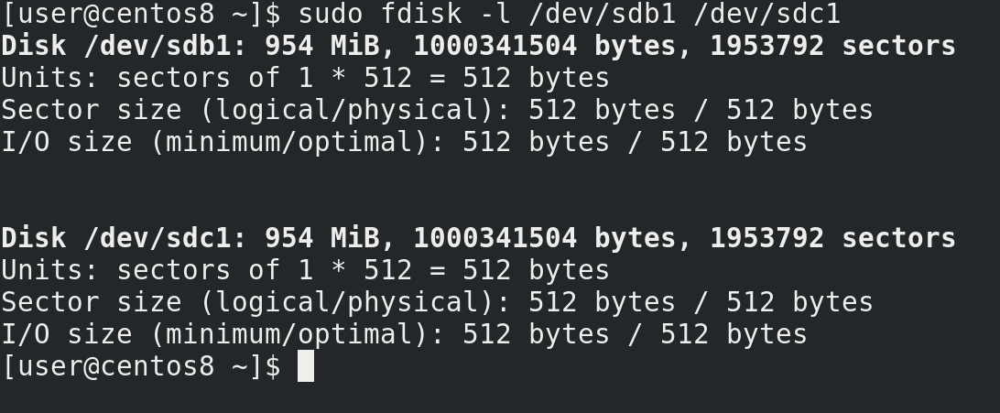

Поэтому я создам раздел на каждом из дисков на 1 гигабайт - sudo fdisk /dev/sdb; g, n,enter,enter,+1GB, p, w; sudo fdisk /dev/sdс; g, n,enter,enter,+1GB, p, w; sudo fdisk -l /dev/sdb1 /dev/sdc1, что чуть меньше реального объёма, но в дальнейшем мне будет проще заменить один из дисков.

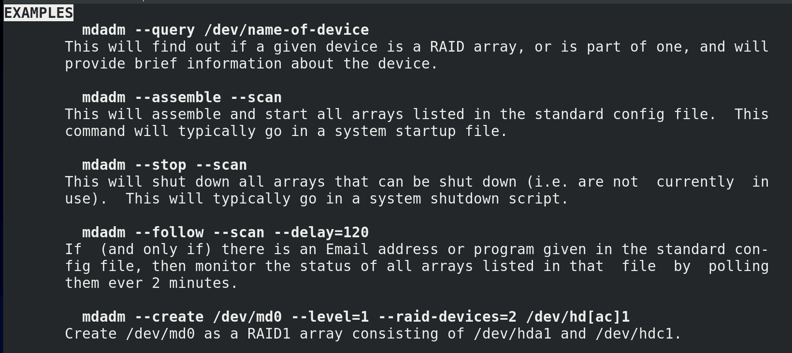

Дальше нам понадобится утилита mdadm. У этой утилиты также подробный мануал с примерами - man mdadm, /EXAMPLES.

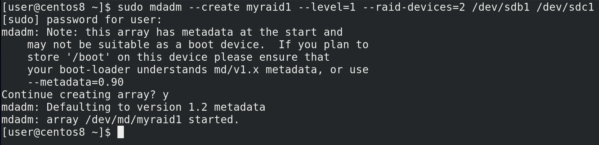

Пишем sudo mdadm –create указываем имя рейда, допустим, myraid1; указываем уровень рейда - --level=1 и указываем количество устройств и их имена –raid-devices=2 /dev/sdb1 /dev/sdc1 - sudo mdadm –create myraid1 –level=1 –raid-devices=2 /dev/sdb1 /dev/sdс1. Утилита нас предупреждает, что если мы планируем держать директорию /boot на этих дисках, нужно кое-что проверить или изменить, но пока мы этого не планируем. Причём здесь директория /boot мы разберём в другой раз, а пока продолжим. Пишем y и enter. Видим, что рейд у нас создался.

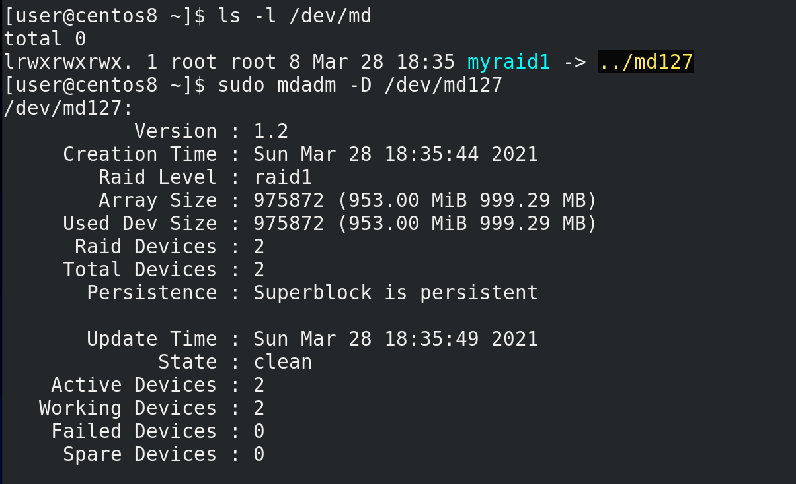

Если посмотреть - ls -l /dev/md, увидим, что это ссылка на устройство /dev/md127. Информацию о рейде можем посмотреть с помощью утилиты mdadm c опцией detail или просто D - sudo mdadm -D /dev/md127.

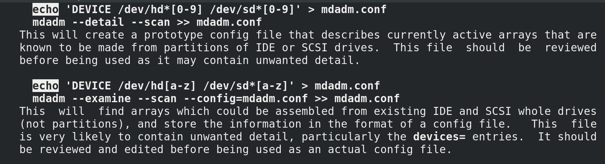

Дальше нам нужно сохранить текущую конфигурацию рейда. Для этого откроем man mdadm и найдём две строчки с echo — man mdadm, /echo. Будет два примера – с разделами или целыми дисками, мы выберем первый, так как мы создали рейд на разделах.

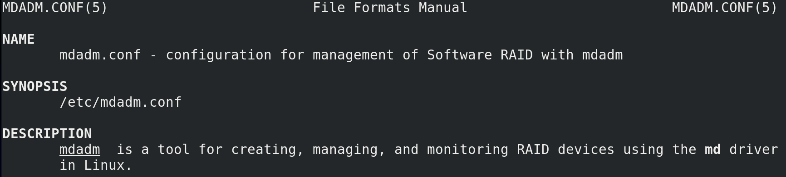

Станем рутом и зайдём в директорию etc. Правда директория может разниться в зависимости от дистрибутива, поэтому лучше всё же посмотреть в man - man mdadm.conf.

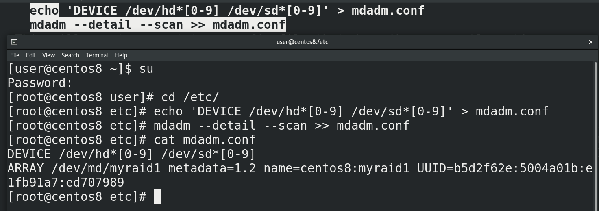

Первая строчка — echo 'DEVICE /dev/hd\*[0-9] /dev/sd\*[0-9]' > mdadm.conf - создаст файл mdadm.conf со списком разделов, которые нужно проверять при запуске системы на наличие рейда. Можно это подправить, оставив только текущие разделы, либо оставить как есть. Вторая строчка - mdadm --detail --scan >> mdadm.conf - добавит в файл информацию о текущем рейде и его идентификатор — cat /etc/mdadm.conf.

А дальше мы можем записать на файл устройства файловую систему с помощью mkfs или указать его как физический том для LVM. Мы сделаем и то и другое, для повторения. У вас может возникнуть вопрос – а зачем LVM, если RAID также объединяет диски, давая общее пространство? Вспомните, что у LVM есть и другие полезные возможности – те же снапшоты, более динамическое управление логическими томами, по сравнению со стандартной таблицей разделов.

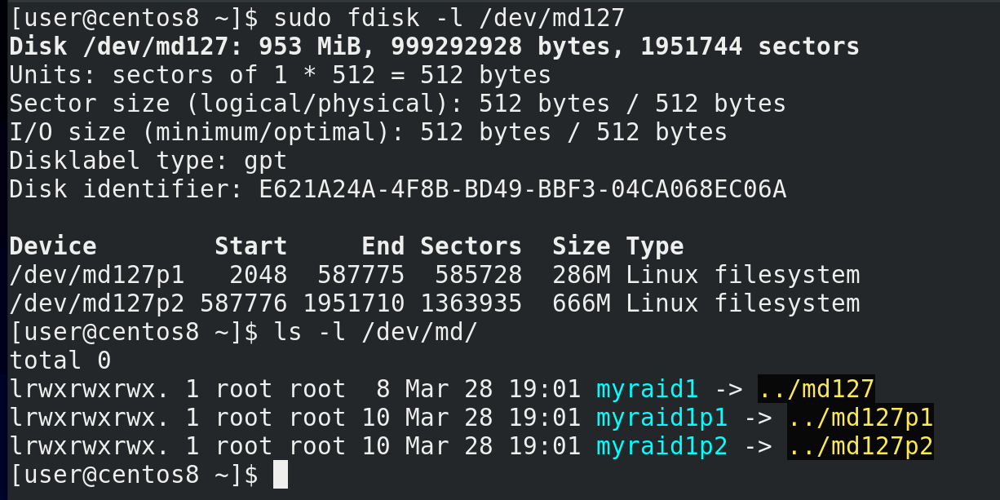

Чтобы сделать и стандартный раздел и логический том создадим на этом устройстве таблицу разделов - sudo fdisk /dev/md127; g и два раздела - n,enter,enter,+300MB; n,enter,enter,enter, p - и сохраним w; sudo fdisk -l /dev/md127. Как видите, разделы получили названия md127p1 и md127p2. Тоже самое касается ссылки в директории /dev/md - ls -l /dev/md.

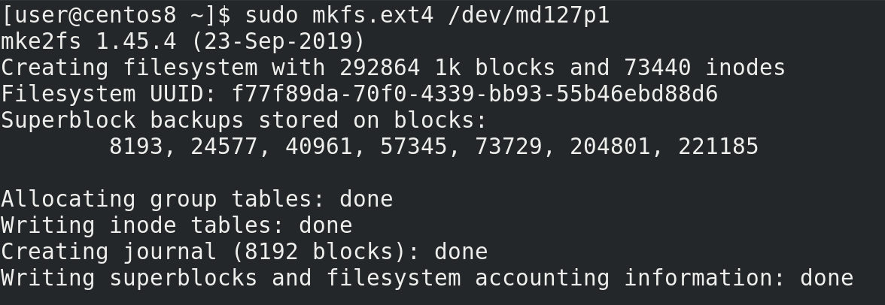

На первый раздел сразу запишем файловую систему - sudo mkfs.ext4 /dev/md127p1.

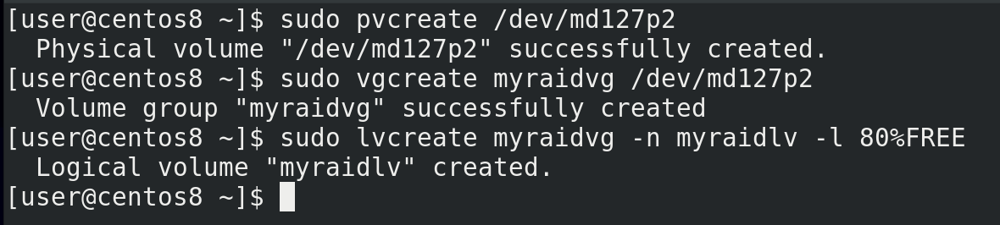

А на второй создадим логический том. Вспоминаем – физический том – группа томов – логический том. sudo pvcreate /dev/md127p2; sudo vgcreate myraidvg /dev/md127p2; sudo lvcreate myraidvg -n myraidlv -l 80%FREE.

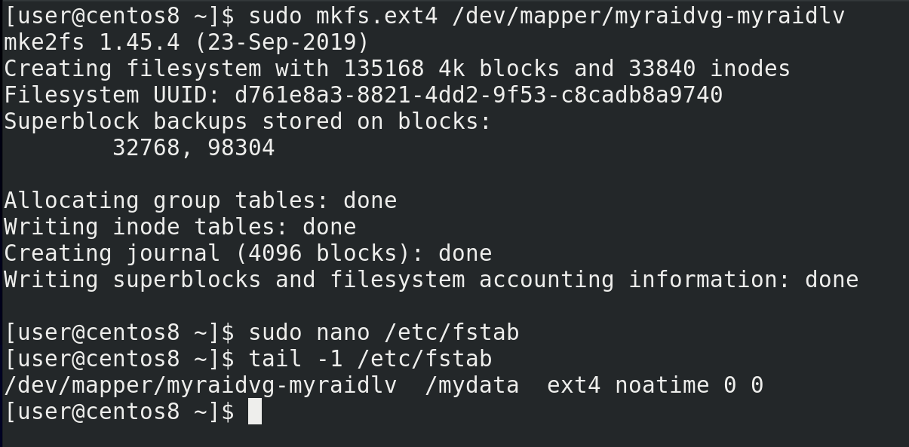

Смотрим в /dev/mapper - появилась ссылка на логический том. Записываем на него файловую систему - sudo mkfs.ext4 /dev/mapper/myraidvg-myraidlv - и подправляем запись в fstab - sudo nano /etc/fstab, tail -1 /etc/fstab.

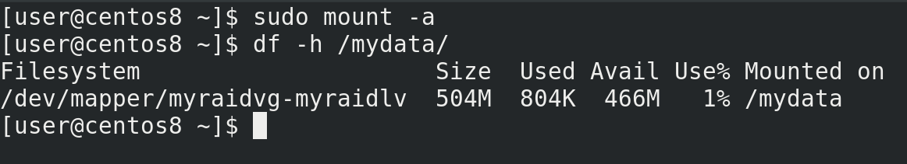

Можно для теста примонтировать - sudo mount -a, df -h /mydata. Всё работает. У нас, конечно, прибавился еще один уровень абстракции, но с точки зрения пользовательского пространства ничего не изменилось – та же директория /mydata.

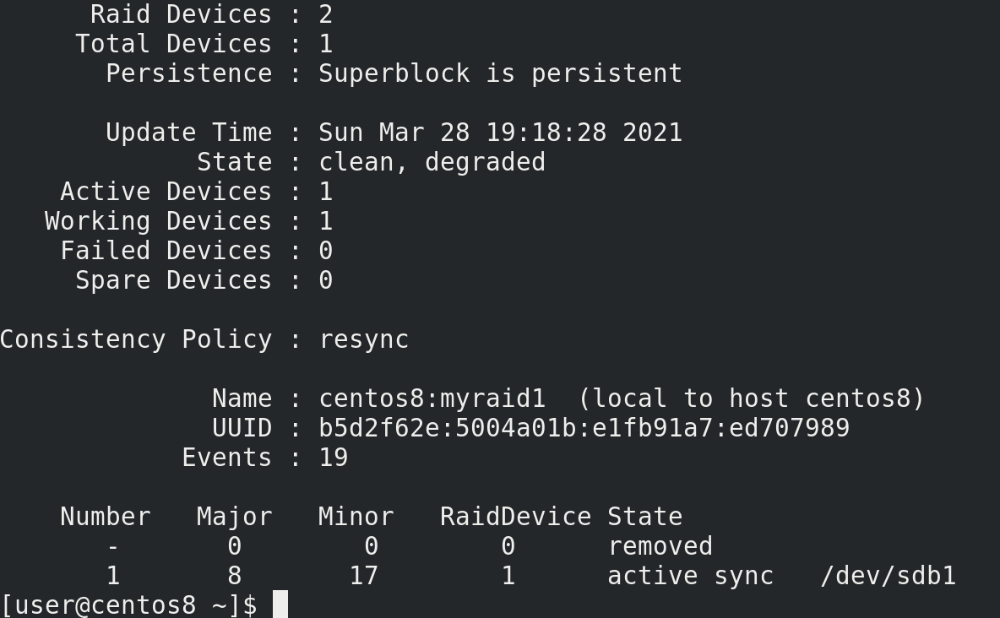

Напоследок, давайте избавимся от одного диска и посмотрим, что же произойдёт. Для этого я выключаю виртуальную машину и удаляю один из дисков. Дальше запускаю систему. После запуска системы, я проверяю, примонтирована ли файловая система - df -h /mydata - да, с файловой системой всё окей. Но если посмотреть статус рейда - sudo mdadm -D /dev/md127 - то можно увидеть, что статус рейда – degraded – а это значит, что есть какие-то проблемы c рейдом, он не в полноценном состоянии. А внизу видно - один из дисков removed.

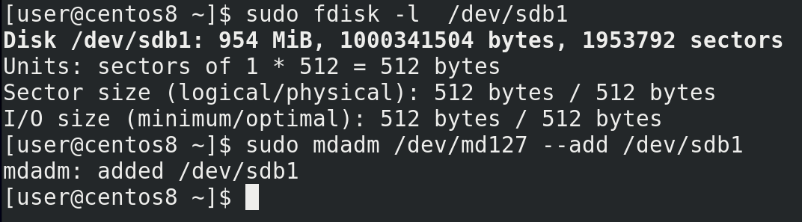

Теперь давайте представим, что мы купили новый диск, на замену старому. Опять вырубаю виртуальную машину, создаю ещё один диск – тоже на гигабайт. Хотя тут скорее особенность виртуалбокса, не получится при работе виртуалки добавлять диски. На физических серверах необходимости выключать сервер для добавления диска нет.  Для начала определим, какое название получил диск. Для этого выполним команду sudo fdisk -l и найдём чистый диск. Теперь нужно создать раздел, как мы это уже делали - sudo fdisk /dev/sdb; g, n,enter,enter,+1GB, p, w - и добавить его в рейд с помощью ключа add - sudo mdadm /dev/md127 –add /dev/sdb1.

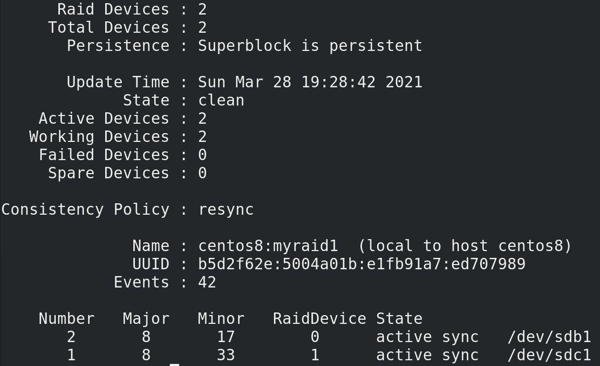

После добавления статус нового диска поменяется на spare rebuilding - sudo mdadm -D /dev/md127. При этом мы можем продолжать работать. Так как у нас информации на дисках не было, процесс прошёл довольно быстро.

И так, мы с вами разобрали, как на Linux настроить программный рейд. Выход из строя диска может создать кучу проблем для администратора, не говоря о других. Это не вопрос вероятности, это вопрос времени. При этом предотвратить один из худших кошмаров можно всего за пару минут, настроив, не важно, программный или аппаратный рейд.
И хотя мы рассмотрели только первый рейд, в настройке других уровней рейдов больших отличий нет. Как и в большинстве случаев, за парой простых команд скрывается тонна теории, которую важно знать, потому что неправильное обращение с командами может привести к печальным последствиям. По [ссылке](http://xgu.ru/wiki/mdadm) вы можете более подробно ознакомиться с программный рейдом на Linux.
