

Изучать что-то новое может быть интересно - новые знания, новый опыт. Вот мы изучили рейд, лвм, файловые системы и всё такое, попрактиковались пару раз – всё довольно просто. Но вы устраиваетесь на работу, там есть какая-то инфраструктура и ваша задача – администрировать эту инфрастуктуру. И то что вчера было новым и интересным превращается в рутину – вам постоянно нужно работать с одними и теми же командами, изо дня в день, годами. Где-то пользователей создать и права настроить, где-то бэкап сделать, где-то ещё что. И люди ищут способы, как бы это всё автоматизировать. Автоматизировать графический интерфейс довольно сложно. Писать новую программу ради какой-то рутины не всегда стоит того. И тут текстовый интерфейс раскрывает себя во всей красе. Можно написать так называемые сценарии, какие команды и как будут выполняться. И запускать этот сценарий вручную, либо автоматизировать его запуск, что вообще позволит админу избавиться от рутины.

Мы работаем с bash, поэтому будем учиться писать сценарии для него. Более привычное название – скрипты. Кто-то называет это "bash программированием".  И давайте сразу поставим себе задачу, которую будем решать с помощью скрипта. Начнём с чего-то простого – создать двух пользователей:

> #### user1 :                  
> 1. Основная группа - it  
> 2. it – группа с правами суперпользователя  
> 3. Домашняя директория в /home/it   
> 4. Оболочка - /bin/bash

> #### user2 :             
> 1. Основная группа - users  
> 2. Домашняя директория в /home/users  
> 3. Оболочка - /sbin/nologin

Один из них — user1 - его основная группа будет it, у которой будут права суперпользователя, его домашняя директория будет внутри директории /home/it и его оболочка будет bash. Второй пользователь – user2 - будет в группе users, домашняя директория внутри директории /home/users, а оболочка nologin. Кстати, попробуйте самостоятельно вспомнить все команды, которые необходимо выполнить.


Для начала вспомним, как это делается. Во первых, нужно создать группы и директории. Создаём группу it:

```
sudo groupadd it
```

Группа users есть по умолчанию:

```
grep users /etc/group
```

У группы it должны быть права суперпользователя – заходим в:

```
visudo
```

и добавляем строчку:

```
%it ALL=(ALL) ALL
```

Дальше нам нужны директории - /home/it и /home/users:

```
sudo mkdir -v /home/{it,users}
```

И наконец создаём пользователей:

```
sudo useradd user1 -g it -b /home/it -s /bin/bash
sudo useradd user2 -g users -b /home/users -s /sbin/nologin
tail /etc/passwd
```

Всего у нас получилось 5 команд:

```
sudo groupadd it
sudo visudo
sudo mkdir -v /home/{it,users}
sudo useradd user1 -g it -b /home/it -s /bin/bash
sudo useradd user2 -g users -b /home/users -s /sbin/nologin
```

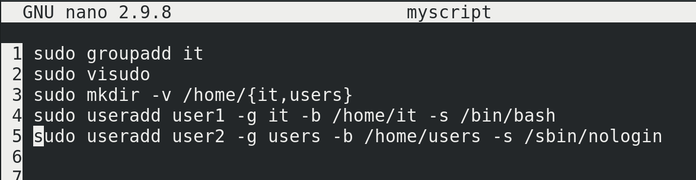

Теперь давайте сделаем скрипт – просто вставим все эти 5 команд в файл с любым названием - nano myscript. Каждая команда с новой строки.

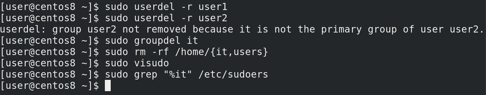

Но прежде чем запускать скрипт, надо вернуть всё как было – удаляем пользователей, группу, директории и запись из sudoers:

```
sudo userdel -r user1
sudo userdel -r user2
sudo groupdel it
sudo rm -r /home/{it,users}
sudo visudo
sudo grep «%it» /etc/sudoers
```

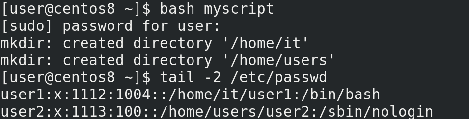

Запускаем скрипт с помощью bash:

```
bash myscript
```

У меня открылся visudo – это один из шагов, когда мне нужно добавить группу it в sudoers. Добавил, сохранил. Теперь опять проверяем:

```
tail /etc/passwd
```

всё создалось. И это одной командной, не считая ручного заполнения visudo.   

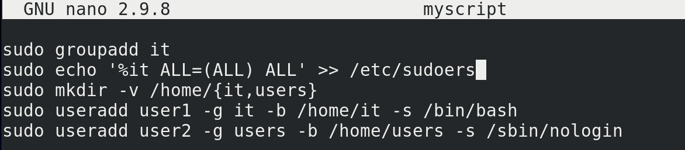

Но.. мы говорим про автоматизацию, а мне всё равно приходится добавлять запись в sudoers вручную. Давайте сделаем так, чтобы запись добавлялась без нашего участия. Помните, как мы делали с рейдом – писали echo текст и направляли в файл? Сделаем точно также. Заменим в нашем файле visudo на echo:

```
nano myscript
```

```
echo %it ALL=(ALL) ALL
```

Возьмём текст в одинарные кавычки, чтоб баш никак не обработал команду и направим этот текст в файл /etc/sudoers:

```
echo '%it ALL=(ALL) ALL' >> /etc/sudoers
```

с помощью двух символов больше, чтобы не перезаписать файл, а дополнить. Правда сама такая команда не сработает – перенаправление вывода (>>) выполняется от моей оболочки, не от команды sudo, а у моего пользователя не хватит прав записать что-то в sudoers.

```
sudo echo '%it ALL=(ALL) ALL' >> /etc/sudoers
```

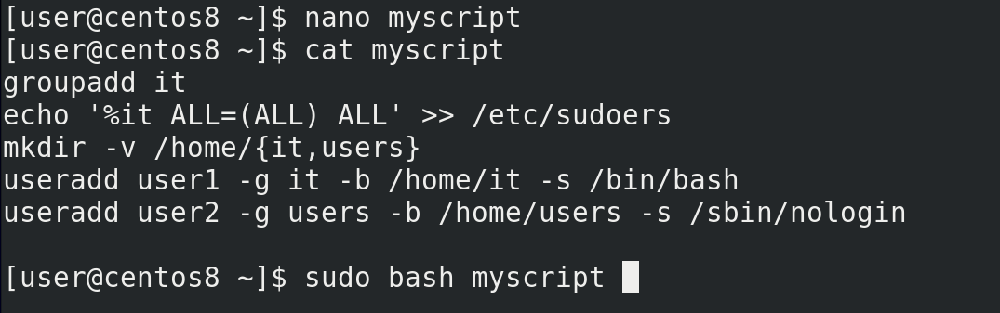

Можно, конечно, использовать команду tee, но, вообще, учитывая, что все команды тут выполняются с sudo, легче сделать по другому. Просто сотрём отсюда все sudo, а при запуске, вместо bash myscript будем писать:

```
sudo bash myscript
```

Тогда весь скрипт будет выполняться в оболочку суперпользователя – это и избавит нас от проблемы с перенаправлением вывода и не будет необходимости внутри скрипта запускать sudo.

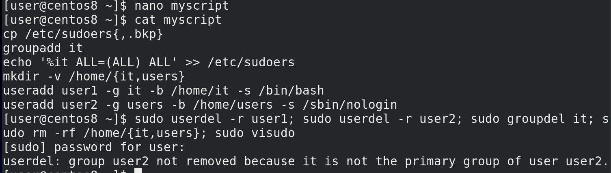

Но неплохо было бы на всякий случай сделать копию файла sudoers, чтобы случайно его не испортить.  Добавим команду в начале скрипта:

```
nano myscript
cp /etc/sudoers{,.bkp}
```

Хорошо, теперь опять удалим то что создали:

```
sudo userdel -r user1
sudo userdel -r user2
sudo groupdel it
sudo rm -r /home/{it,users}
sudo visudo
cp /etc/sudoers{,.bkp}
```

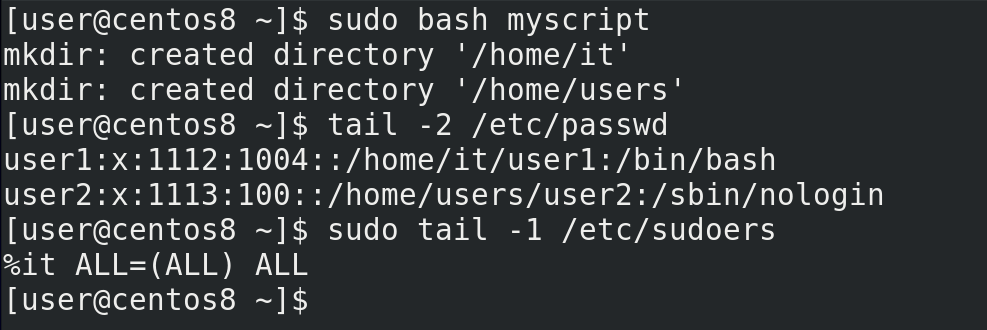

И заново запустим скрипт:

```
sudo bash myscript
tail -2 /etc/passwd
sudo tail -1 /etc/sudoers
```

Сработало – одной командой мы создали всё что нам нужно.

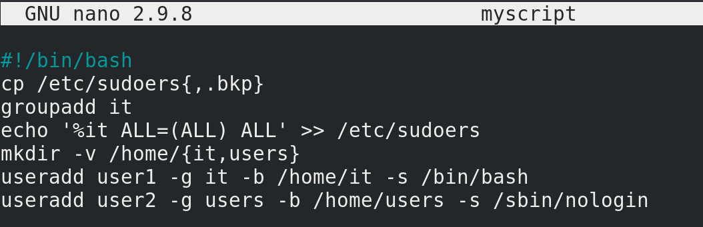

Чтобы наш скрипт выглядел более самостоятельным, то есть, чтобы нам не приходилось каждый раз перед ним писать bash, а также чтобы мы могли делиться этим скриптом с другими, кто, возможно, использует другие оболочки, мы можем внутри самого скрипта указать, а под какой именно интерпретатор написан скрипт. Так как, теоретически, у нас в скрипте могут быть всякие особенности, присущие только bash, которых нет в других интерпретаторах. Но тут могут быть нюансы – нужно понимать, что bash есть во многих системах, но не во всех. Если вы пишете скрипт, который предполагаете использовать не только на GNU/Linux, но и на всяких UNIX-ах, где может не быть bash-а, то лучше писать скрипты под интерпретатор shell. Чтобы указать, с помощью какого интерпретатора запускать скрипт, в первой строчке самого скрипта указываются два символа:

```
#!
```

называемые шебанг, после чего указывается путь к интерпретатору, допустим:

```
#!/bin/bash
```

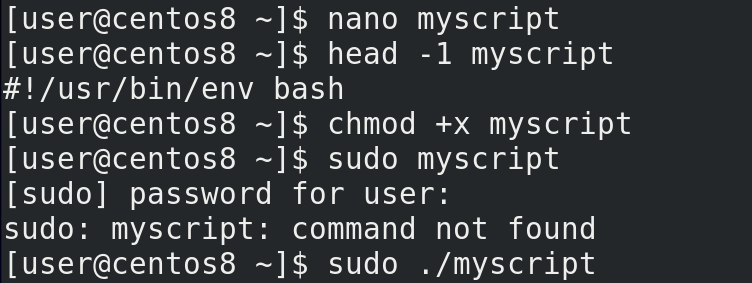

Но так как в разных дистрибутивах и системах bash или другой интерпретатор могут находится в разных директориях, есть более универсальный способ написания пути:

```
#!/usr/bin/env bash
```

Давайте так и оставим. Правда, так как теперь мы будем запускать скрипт напрямую, а не передавая его программе bash, ему понадобятся права для запуска – для этого пишем:

```
chmod +x myscript
```

Но написать:

```
sudo myscript
```

не получится – sudo будет искать программу myscript в директориях её переменной PATH. Либо нужно поместить myscript в одну из директорий переменной PATH, либо явно указывать путь к этому скрипту – достаточно поставить перед ним точку и слеш, если он в текущей директории:

```
sudo ./myscript
```

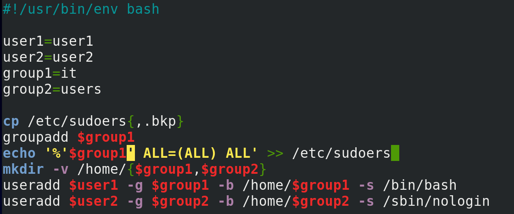

Но наш скрипт получился слишком однозадачным – он нацелен на создание двух конкретных пользователей. Сойдёт на разок, но потом, если понадобится создать ещё пользователей, придётся изменять скрипт. Давайте сделаем наш скрипт более динамическим – добавим в него переменные. Пользователей и группы заменим на переменные – user1,user2,group1,group2, а так как директории совпадают с именами групп, там тоже используем переменные. В строке echo одинарные кавычки, а значит переменная не обработается. Надо немного переделать строчку. Можно по разному, но я просто оставлю переменную group1 за кавычками. Теперь, если мне понадобится выполнить скрипт для других пользователей и групп, я могу просто заменить в начале скрипта значения переменных, вместо того, чтобы переделывать весь скрипт.

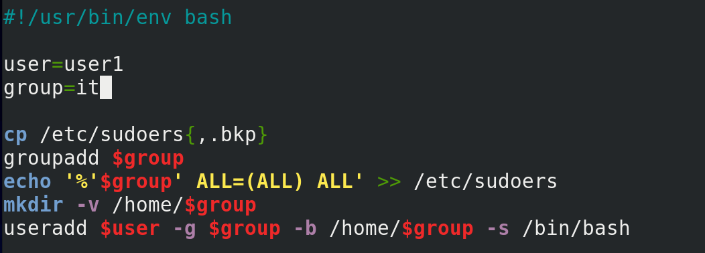

Опять же получилось так себе – у нас тут скрипт на двух пользователей в двух группах – а если мне нужно добавить одного или трёх пользователей? Давайте уберём всё что касается user2 и group2. Конечно, для второго пользователя придётся опять запускать скрипт, но динамичность скрипта это компенсирует.

Хотя.. в скрипте всё ещё вручную прописаны переменные user и group. Придётся для каждого пользователя заходить и менять значения. Обычно, когда мы работаем с программами в командной строке, мы передаём ей какие-то параметры. Нельзя ли пользователя и группу передать в виде параметров, чтоб не приходилось менять скрипт? Можно.

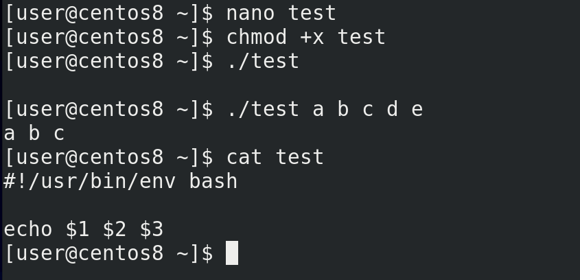

Давайте сделаем так – создадим новый скрипт:

```
nano test
```

```
#!/usr/bin/env bash
echo $1 $2 $3
```

сохраним и дадим права:

```
chmod +x test
```

Запустим:

```
./test
```

ничего. Теперь напишем после скрипта какие-то параметры:

```
./test a b c d e
```

Как видите, первые три параметра вывелись. Что же произошло? Переменные 1, 2 и 3 в виде значений получили соответствующие аргументы:

```
cat test
```

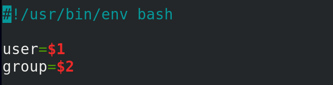

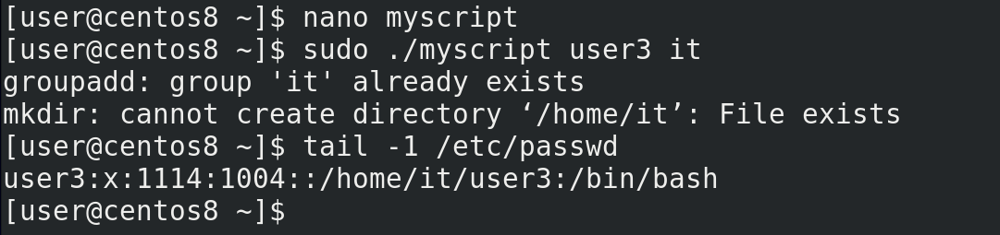

Вернёмся к нашему скрипту. Заменим значение переменной user на $1, а group на $2:

```
user=$1
group=$2
```

Теперь запустим наш скрипт с двумя аргументами – первый – это имя пользователя, второй – имя группы:

```
sudo ./myscript user3 it
tail -1 /etc/passwd
```

Всё сработало – у нас появился user3.

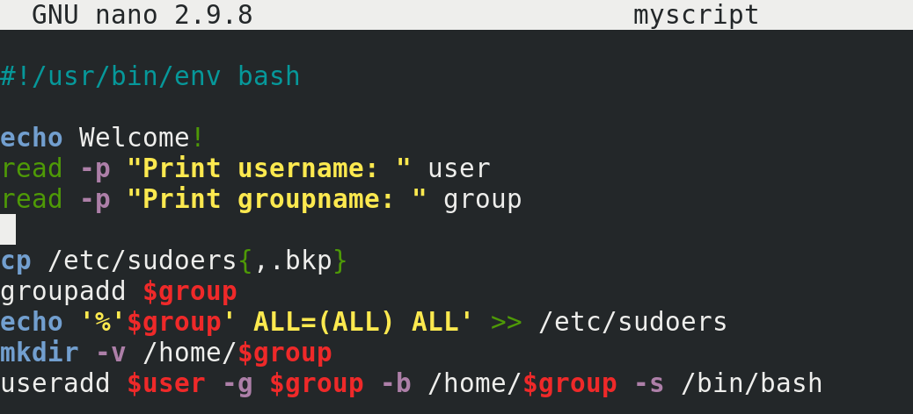

Можно сделать наоборот – добавить интерактивности, как это, например, в fdisk. Допустим, сделать так, чтобы скрипт при запуске спрашивал имя пользователя и группу. Добавим для красоты надпись в начале:

```
echo Welcome!
```

Дальше используем команду read, которая будет запрашивать ввод и сохранять его в переменной, с ключом p – которая выведет текст на экран. Допустим:

```
read -p "Print username: " user
read -p "Print groupname: " group
```

Здесь user и group – это переменные, которые получат своё значение от введённого текста.

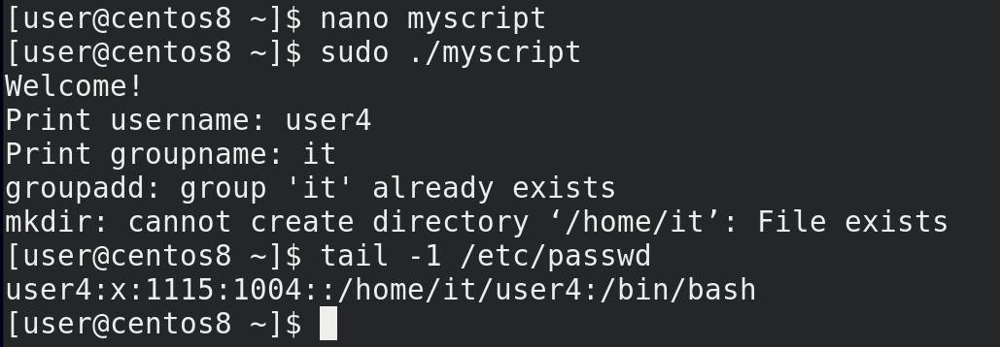

Давайте запустим скрипт и проверим:

```
sudo ./myscript
tail /etc/passwd
```

Всё сработало. Тут, конечно, есть ещё над чем поработать, но это оставим на следующий раз.

Подведём итоги. Мы начали разбирать скрипты. Это, конечно, совсем азы, но тут есть с чем попрактиковаться. Вспомните старые занятия – права, файлы, диски. Вспомните команды, сделайте из них скрипты – что-то интерактивное, что-то не интерактивное. Это большая тема, мы будем к ней возвращаться не раз. Но, в целом, чтобы хорошо писать скрипты нужно много много практиковаться. По [ссылке](https://habr.com/ru/company/ruvds/blog/325522/) можете найти цикл статей по скриптингу на bash.
