

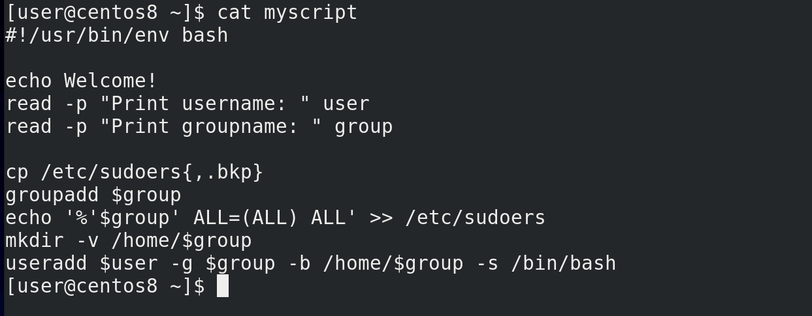

В прошлый раз мы остановились на том, что сделали скрипт более универсальным – вместо двух определённых пользователей мы теперь можем создавать разных пользователей, используя переменные:

```
cat myscript
```

Но сделав это мы перестали соответствовать начальным требованиям. Во-первых, мы говорили, что если группа it, её следует предварительно добавить в sudoers. Но в нашем скрипте всего одна переменная group и какое бы значение она не получила, она всё равно добавляется в sudoers. Если я буду добавлять пользователя с группой users, то она тоже попадёт в sudoers. Во-вторых, мы говорили, что оболочка bash только у пользователей группы it, у users должен быть nologin, значит сейчас скрипт подходит только для группы it. Для users мы можем создать отдельный скрипт, подходящий им. Но также можем это сделать в рамках одного скрипта.

Начнём с sudoers. Сформулируем задачу: если переменная group получит значение it, то нужно добавить такую-то строчку в sudoers. Если же переменная group получит любое другое значение, ничего в sudoers добавлять не надо. И так, у нас появилось слово «если» – это значит, что мы имеем дело с условиями. bash умеет работать с условиями, для этого у него есть команда if. Синтаксис команды выглядит так - if условие then команда, которую мы хотим выполнить, в случае если условие выполнилось, и в конце fi, чтобы показать, где у нас заканчивается команда if:

```bash
if условие
then команда
fi
```

Если с командой понятно, то чем же является условие? Тоже командой – cp, ls, grep и всё в таком духе, то есть просто команда. Вы спросите – if ls, где тут условие? ls просто покажет список файлов, о каком условии идёт речь? На самом деле, if интересует не сама команда, а результат её выполнения, так называемый «код выхода» или «статус выхода». Обычно это числа от 0 до 255.

Мы упоминали статус выхода, когда говорили про зомби процессы – дочерний процесс при завершении должен передать родительскому свой статус выхода. Зачем? Это принятый в программировании способ родительским процессам узнать, как выполнился дочерний процесс, без необходимости копаться в выводе дочернего процесса. Для процесса, который выполнился без всяких проблем, обычно статус выхода – 0. Если же что-то пошло не так, то статус выхода другой, и по нему иногда легче понять причину проблемы.

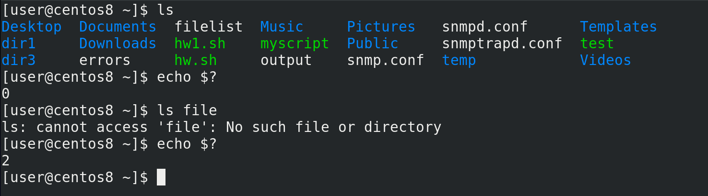

В bash-е с помощью специальной переменной:

```
$?
```

можно узнать статус выхода последней выполненной команды. Для примера возьмём команду ls. Просто выполнив команду и посмотрев значение переменной:

```
ls
echo $?
```

мы увидим, что код выхода - 0. Теперь давайте выполним команду:

```
ls file
```

Команда ругается, что такого файла нет. Посмотрим статус выхода ещё раз:

```
echo $?
```

Как видите, теперь он 2. Есть определённые правила, в каких случаях какие числа пишутся, но сейчас нас интересует только 0.

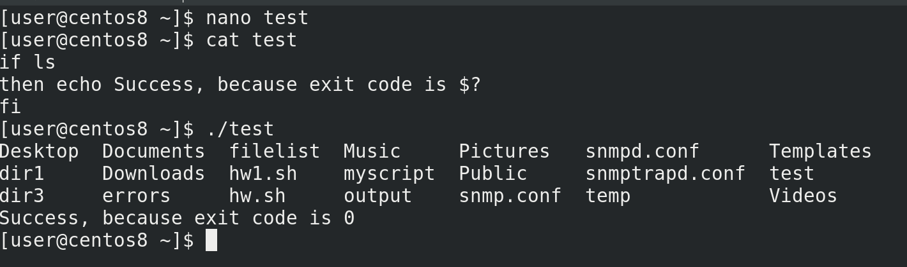

Если процесс завершился с кодом 0, то всё окей. Все остальные коды считаются за ошибку. Именно так думает if. Давайте напишем маленький пример:

```
nano test
```

```bash
if ls
then echo Success, because exit code is $?
fi
```

```
cat test
./test
```

Как видите, сработала команда ls, после чего команда echo.

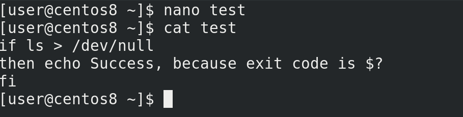

Давайте направим вывод команды ls в никуда, чтобы не было лишней информации:

```
nano test
```

```
if ls > /dev/null
then echo File exists
fi
```

```
./test
```

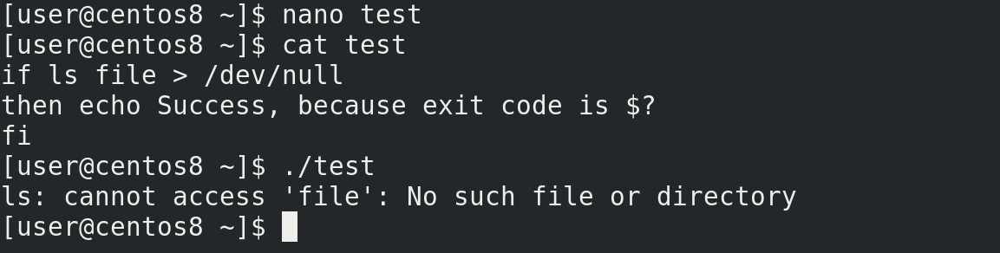

Теперь сделаем так, чтобы if получила не 0, а что-то другое:

```
nano test
```

```
if ls file > /dev/null
then echo File exists
fi
```

```
./test
```

Как видите, теперь у нас условие выдаёт не 0, а значит команда после then не сработает.

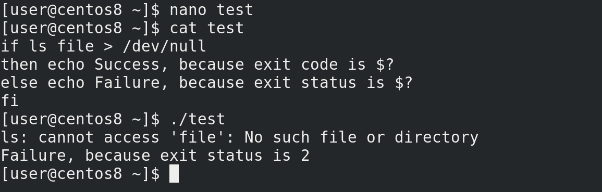

Можно ещё if дополнить с помощью else, которая будет запускать команду, если в if условие не сработает. Выглядит это так:

```bash
if условие
then команда, если 0
else команда, если не 0
fi
```

Например:

```bash
if ls file
then echo Success, because exit code is $?
else echo Failure, because exit status is $?
fi
```

```
cat test
./test
```

Как видите, сработала вторая команда.

Окей, по какому принципу работает if разобрались. Но этого недостаточно – нам нужно узнать, переменная group получила в качестве значение it или что-то другое. То есть нам нужна команда, которая сравнит значение переменной с каким-то текстом. Если всё окей, у неё статус выхода будет 0 и тогда if выполнит нужную команду. Такая команда есть и она, можно сказать, специально написана для if. Команда выглядит как открывающаяся квадратная скобка:

```
[
```

а после выражения внутри ставится закрывающаяся квадратная скобка:

```
[ выражение ]
```

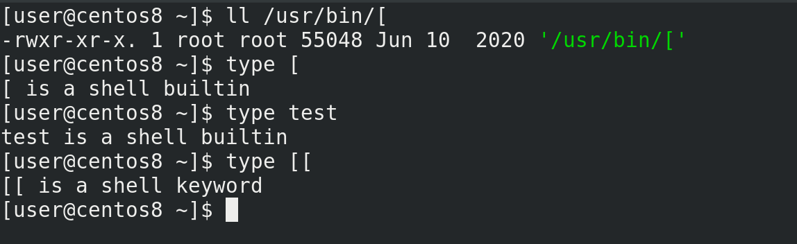

Причём даже есть такая программа в /usr/bin:

```
ll /usr/bin/[
```

но у bash обычно есть встроенная версия этой программы:

```
type [
```

а внешняя программа может понадобится для других оболочек. Есть такая же программа с названием test:

```
type test
```

и даже более продвинутая версия с двумя скобками:

```
type [[
```

но она есть на bash и паре других оболочек, а не на всех. В общем, если хотим, чтобы нашими скриптами можно было пользоваться не только на bash, будем обходиться без двойных скобок.

С помощью квадратных скобок можно сравнивать много чего – строки, числа, наличие файлов, директорий, их права и многое другое. Программа сравнивает, выдаёт значение 0 или 1, а дальше if действует так, как мы обсуждали. По [ссылке](https://tldp.org/LDP/Bash-Beginners-Guide/html/sect_07_01.html)  показан синтаксис для различных сравнений, а пока посмотрим нашу ситуацию.

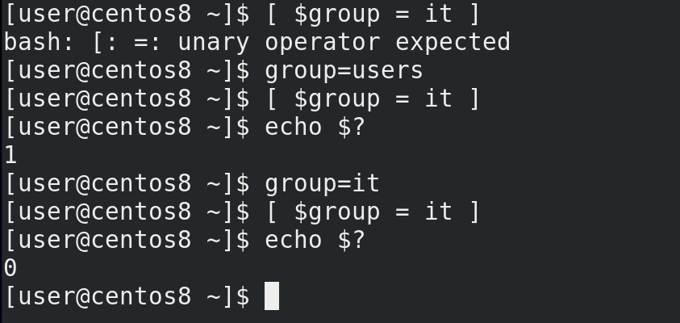

Нам нужно сравнить переменную group и текст it:

```
[ $group = it ]
```

Для примера, дадим переменной значение users, сравним и посмотрим код выхода:

```
group=users
[ $group = it ]
echo $?
```

Как видите = 1, то есть неправильно. Теперь дадим переменной значение it, сравним и посмотрим код выхода:

```
group=it
[ $group = it ]
echo $?
```

0 – значит всё правильно.

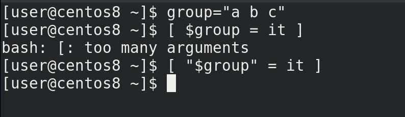

Кстати, важное замечание, если в переменной есть пробелы, то сравнение работать не будет:

```
group=”a b c”
[ $group = it ]
```

так как bash превратит нашу переменную в её значение и в выражении получится много параметров, типа:

```
[ a b c = it ]
```

а это не подходит под синтаксис. Поэтому лучше переменные брать в кавычки:

```
[ “$group” = it ]
```

Хорошо, с выражением разобрались, вернёмся к нашему скрипту и попробуем его добавить.

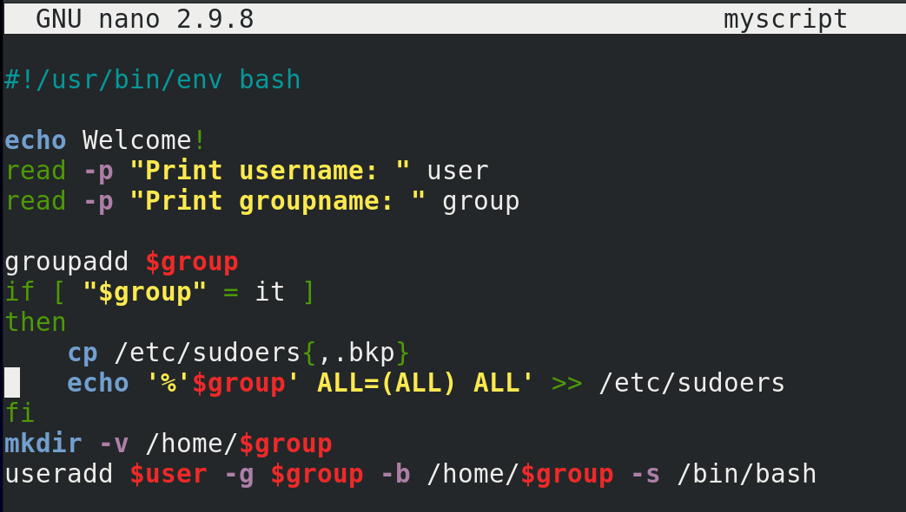

Вспомним наше условие - если переменная group получит значение it, то нужно добавить такую-то строчку в sudoers:

```
nano myscript
```

Находим нашу строчку с командой echo и окружаем её условием:

```
if [ “$group” = it ]
then
...
fi
```

Тут else нам не нужен, а команды после then можно чуток подвинуть направо с помощью пробелов, чтобы было проще для глаз.

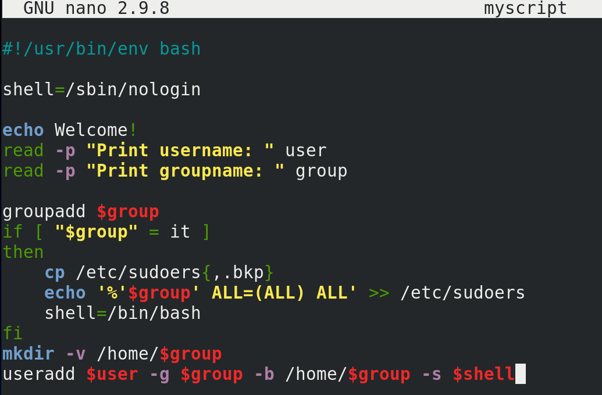

Теперь вспомним второе условие - оболочка bash только у пользователей группы it, у users должен быть nologin. Тоже довольно просто – наверху создаём переменную shell, чтобы легче было её поменять при надобности и даём ей значение:

```
shell=/sbin/nologin
```

А в if добавляем:

```
shell=/bin/bash
```

И не забываем в конце указать эту переменную в качестве оболочки:

```
-s $shell
```

Если у нас группа будет it, то значение переменной в if поменяется на bash, а если не it, то условие не выполнится и переменная shell останется nologin.

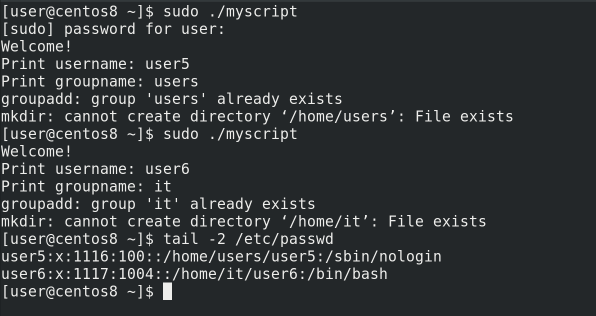

Попробуем запустить скрипт 2 раза – один раз для пользователя с группой it, а потом для пользователя с группой users:

```
sudo ./myscript
tail /etc/passwd
```

Всё сработало.

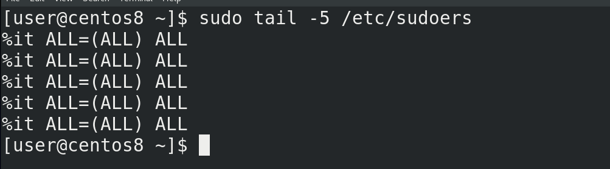

Но если посмотреть sudoers:

```
sudo tail -5 /etc/sudoers
```

можно заметить, что строчка it повторяется много раз, хотя одной строчки вполне достаточно.

Давайте решим и эту проблему. Сформулируем задачу – если мы добавляем пользователя с группой it и если в sudoers нет нужной строчки – то её нужно создать. То есть, если выполнилось первое условие, нужно проверить второе условие и если оно тоже выполнилось – то только тогда добавлять строчку.

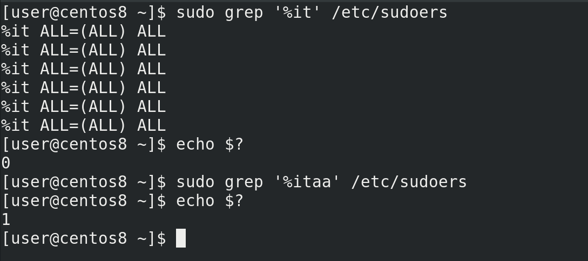

Первое условие у нас уже прописано. После его выполнения, то есть после then пишем ещё один if. Теперь нужно написать условие – если такой-то строчки нет в sudoers. Поиском строчек занимается команда grep. Посмотрим, что он нам выдаёт, если мы попытаемся найти строчку. Необязательно искать всю строчку, если есть что-то про группу it, то этого достаточно:

```
sudo grep ‘%it’ /etc/sudoers
```

И посмотрим код выхода:

```
echo $?
```

Ноль. Посмотрим, что будет, если он не найдёт строчку – напишем в grep какую-то несуществующую группу, чтобы он ничего не нашёл:

```
sudo grep ‘%itаа’ /etc/sudoers
```

и посмотрим ещё раз:

```
echo $?
```

Один.

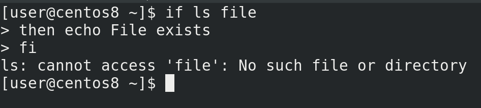

И так, если строчек нет, то grep выдаёт 1, если есть – 0. Мне же нужно, чтобы запись создавалась, если строчек нет, то есть grep должен выдать 1, а if должен получить 0.  Чтобы вот так вот перевернуть полученное значение, нужно после if поставить восклицательный знак. Давайте проверим на том же ls, чтобы было проще. И так, если ls не выполнился, то команда после then не должна сработать:

```bash
if ls file
then echo File exists
fi
```

Как видите, ls выдал ошибку и условие провалилось.

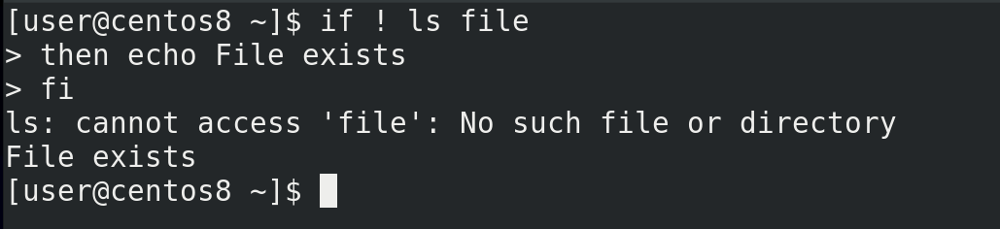

Но если мы после if поставим восклицательный знак:

```bash
if ! ls file
then echo File exits
fi
```

то ls, опять же, не сработал, но if перевернул значение, условие выполнилось и команда сработала.

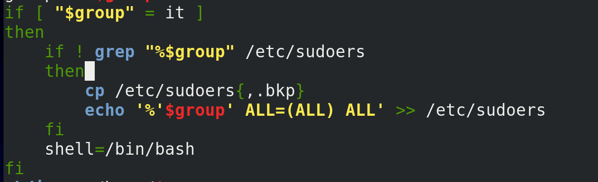

Попробуем тоже самое с нашим скриптом:

```
if ! grep “%$group” /etc/sudoers”
...
```

И так, прочтём – если переменная group равна it запускается второе условие – если grep не нашёл упоминание группы it в sudoers, то следует добавить в sudoers эту группу.

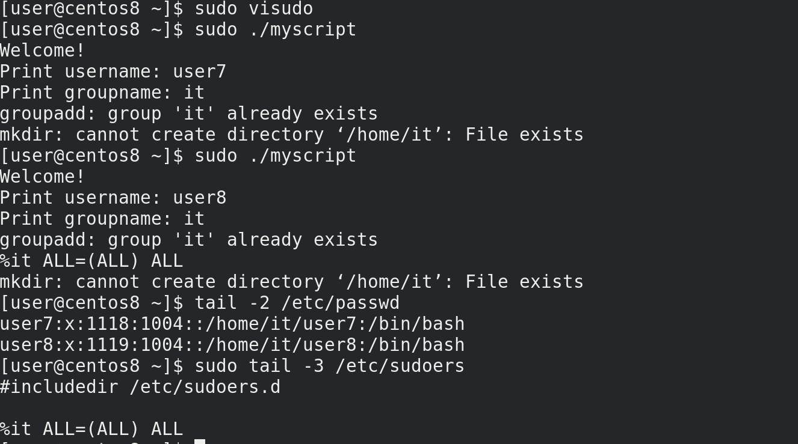

Давайте проверим. Для начала удалим все упоминания группы it в sudoers:

```
sudo visudo
```

Потом запустим наш скрипт и создадим пользователя с группой it:

```
sudo ./myscript
```

Теперь добавим ещё одного пользователя с группой it:

```
sudo ./myscript
```

Проверяем:

```
sudo tail -3 /etc/sudoers
```

всё также одна строчка. Условие работает.

Мы с вами разобрали условие if, которое добавляет вашим скриптам логики, чтобы они могли проверять какие-то условия и по результатам менять какие-то переменные или выполнять дополнительные команды. Также разобрались, для чего нужны коды выхода и использовали их для команды if. Не забудем и про программу квадратных скобок, которая позволяет нам сравнивать переменные, строки, числа и проверять файлы.  Мы ещё разберём, как в команде if проверять другие условия с помощью elif и много чего другого.
