

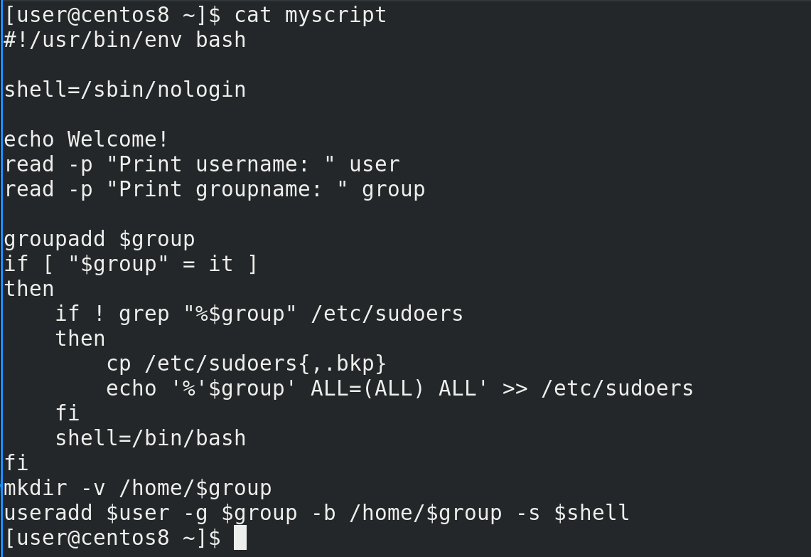

В прошлый раз мы с вами разобрали if. Есть много других команд, но if ещё кое-где пригодится.

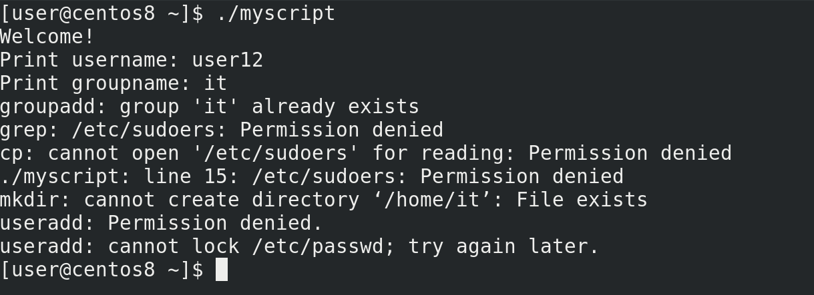

Начнём с того, что скрипт, который мы пишем, должен выполняться рутом, так как тут и команда useradd, и добавление строчки в sudoers. В самом скрипте мы нигде не пишем sudo, так как предполагаем, что либо root запустит этот скрипт, либо пользователь с командой sudo. Но что будет, если скрипт запустить без sudo? Выполнятся все команды, правда, некоторые выдадут ошибку, что недостаточно прав. Сейчас у нас скрипт небольшой, можно понять, что ничего страшного не произойдёт. Но в будущем в скрипте могут быть команды, которые могут сработать и у рута, и у обычного пользователя. И если скрипт запустится от обычного пользователя, то некоторые команды выполнятся, некоторые нет, в итоге это приведёт к неожиданным последствиям. Поэтому лучше в начале скрипта сделать проверку, а кто именно запускает скрипт. Если это root – то всё окей, если кто-то другой – то нужно остановить скрипт и выдать ошибку, что недостаточно прав.

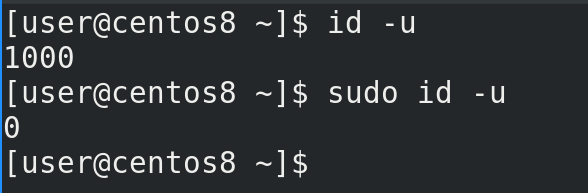

Условие у нас такое – если текущий пользователь является рутом, запускать скрипт, иначе выдавать ошибку. Для этого нужно распознать текущего пользователя – это можно сделать с помощью команды id. Причём, всё завязано не на самом слове root, а на его uid, который равен 0. То есть можно встретить случаи, когда вместо root используется другой пользователь с uid-ом 0, поэтому лучше ориентироваться на uid. Команда id с ключом -u должна быть 0:

```
id -u
sudo id -u
```


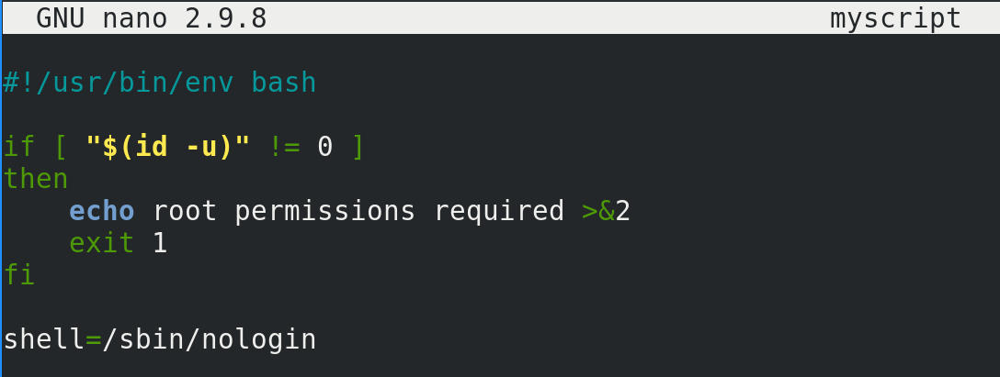

Проверку нужно делать в самом начале, чтобы никакие другие команды не выполнились.  Как писать условие мы знаем – if, дальше нам нужно выполнить команду, чтобы узнать uid и убедиться, что он не равен 0:

```
if [ "$(id -u)" != 0 ]
```

И так, если uid не равен нулю, пусть скрипт выдаст ошибку - echo root permissions required - и завершится. Чтобы завершить скрипт, используем команду exit. Также, давайте вспомним, что обычно ошибки сыпятся в stderr. И чтобы наш скрипт тоже так делал, добавим после echo направление stdout в stderr (>&2), в итоге у нас вывод echo уйдёт в stderr. Также вспомним про статусы выхода. Именно с помощью команды exit мы и будем выдавать статус выхода с ошибкой, то есть единицу:

```
exit 1
```

```bash
if [ "$(id -u)" != 0 ]
then
	echo root permissions required >&2
	exit 1
fi
```

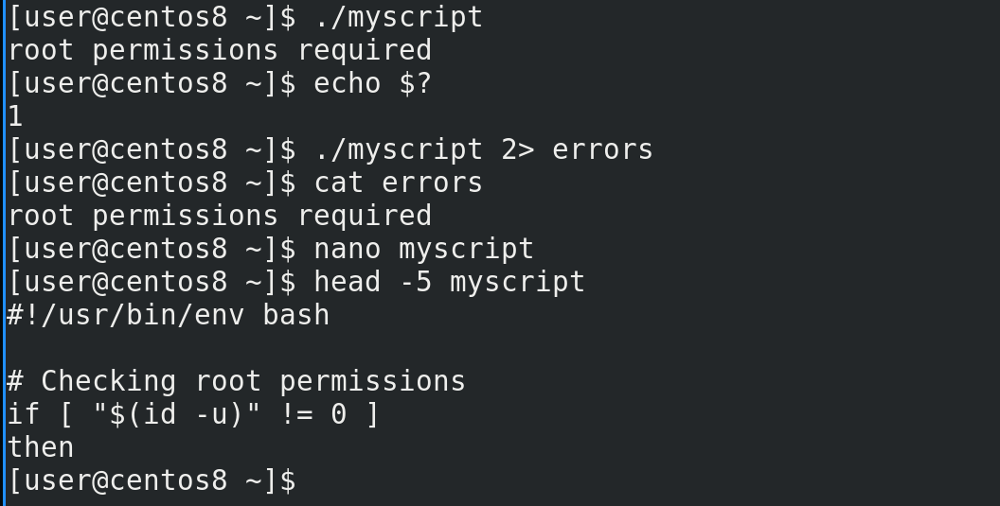

Сохраним и проверим:

```
./myscript
```

Как видите:

```
echo $?
```

статус выхода – 1, т.е. скрипт завершился с ошибкой, как мы и хотели. А чтобы убедиться, что ошибка выводится в stderr, направим stderr в файл:

```
./myscript 2>errors
cat errors
```

Всё работает как надо. Не забудем добавить комментарии к нашему скрипту, чтобы легче было его понимать:

```
nano myscript
```

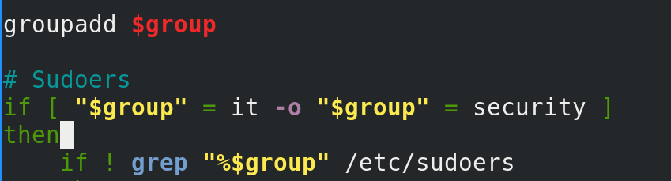

Теперь давайте переделаем условие по нашей группе. Добавим ещё требований – sudo права теперь должны быть у двух групп – it и security. И если имя пользователя admin, но его группа не it или security, то всё равно у него должны быть sudo права. И так, для групп нам нужно сравнивать переменную group с двумя значениями – it и security. Это можно сделать как в рамках программы скобок, используя опцию -o, то есть or:

```
["$group" = it -o "$group" = security ]
```

так и сделать это сравнение на уровне bash-а.

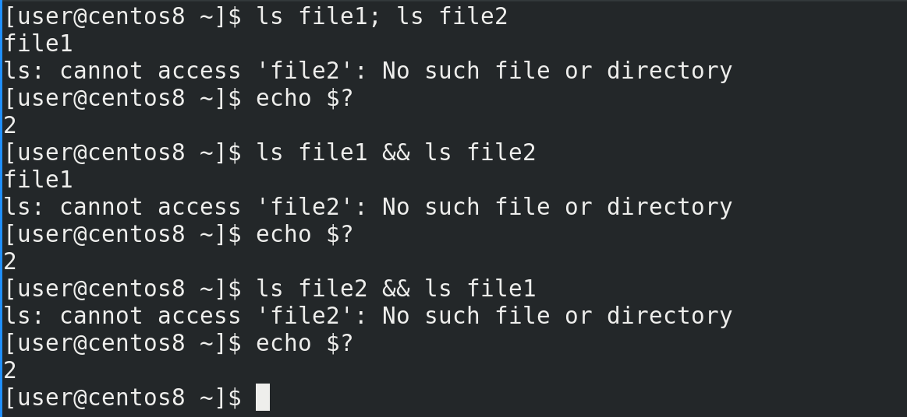

Это работает примерно как с if – bash понимает статусы выхода. Обычно, когда мы хотим выполнить несколько команд разом, без скриптов, мы ставим точку с запятой между командами:

```
ls file1
ls file2
```

И тут даже без if можно добавить логики. Допустим, если мы хотим, чтобы выполнилась первая команда и, если она выполнилась удачно, то есть статус выхода 0, выполнить вторую команду, то между командами мы ставим два амперсанда:

```
ls file1 && ls file2
echo $?
```

Это называется "оператор и". Первая команда выполнилась успешно, вследствие чего выполнилась вторая команда. Теперь перевернём команду:

```
ls file2 && ls file1
echo $?
```

Как видите, первая команда выполнилась неудачно, следствии чего вторая даже не запустилась.

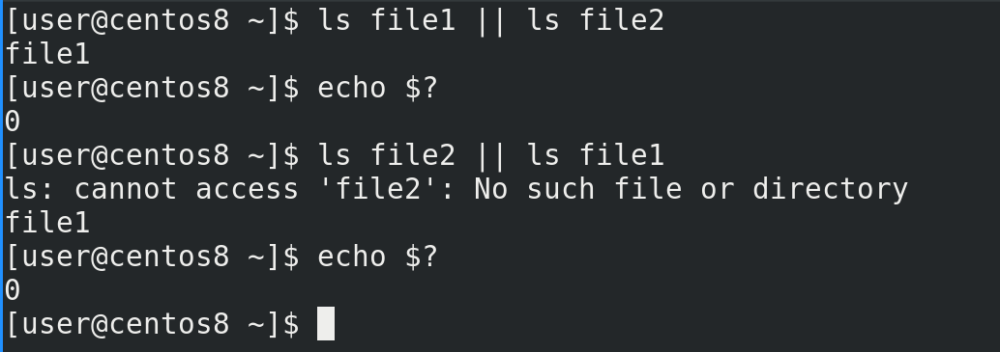

Теперь сделаем наоборот - если первая команда выполнилась удачно, то вторую даже не запускать, а если первая неудачно, то запустить вторую. Для этого используется "оператор или" – две прямые линии || . Например, в первом случае:

```
ls file1 || ls file2
echo $?
```

первая команда выполнилась успешно, следствии чего вторая команда даже не запустилась. Теперь перевернём:

```
ls file2 || ls file1
echo $?
```

Как видите, первая команда завершилась с ошибкой, вследствие чего запустилась вторая. Обратите внимание, в 3 из 4 случаев (обе команды срабатывают нормально;  первая команда выдаёт ошибку; вторая команда выдаёт ошибку; обе команды выдают ошибку) при использовании "оператор и"  получается статус выхода не равный 0, а с "оператором или" наоборот.

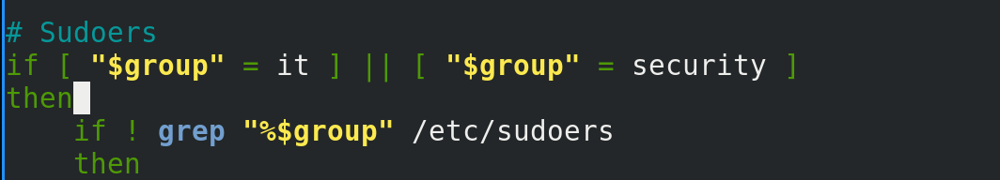

Теперь сделаем тоже самое в скрипте – используем две команды скобок и поставим "оператор или":

```
if [ "$group" = it] || [ "$group" = security ]
```

Как мы помним, if интересует только статус выхода, и если одно из условий окажется верным, то сработают команды после then.

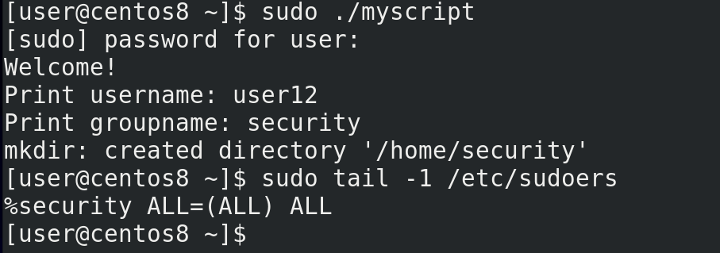

Давайте проверим:

```
sudo ./myscript
sudo tail -1 /etc/sudoers
```

Как видите, в sudoers добавилась группа security.

Касательно второй задачи – нам нужно пользователю админ также давать права sudo, если он не в вышеуказанных группах. У нас уже есть условие проверки на группы. Если условие не срабатывает, if закрывается. В прошлый раз я упоминал else – если условие не срабатывает, запускать другую команду. Но нам это не подойдёт – это будет работать для всех пользователей из других групп, а нам нужно, чтобы это работало только у админа. То есть нам опять же нужно проверить условие. И так, если не сработало первое условие – то есть группы другие, то нужно проверить ещё одно условие – пользователя. Для этого используем команду elif, то есть else if. Синтаксис примерно такой:

```bash
if условие
then команда
elif условие
then команда
elif условие
then команда
else команда
fi
```

Этих elif может быть много. if завершится, когда одно из условий сработает и выполнится команда после then, иначе выполнится else.

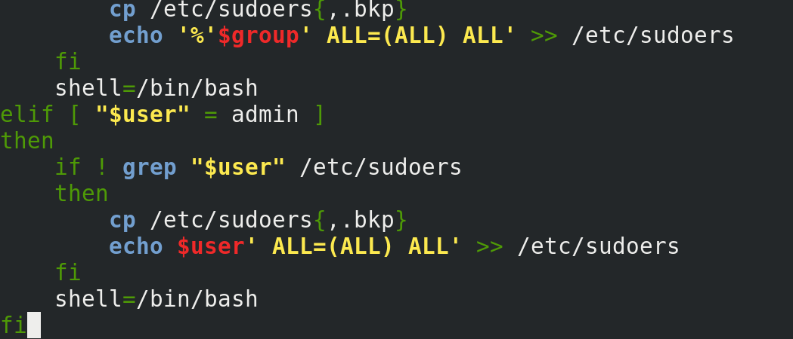

В нашем скрипте мы пишем:

```
elif [ "$user" = admin ]
then
```

и копируем строчки проверки и добавления записи в sudoers, заменяя при этом group на user. Можно было бы просто добавить пользователя admin в группу wheel, но на разных дистрибутивах это может быть группа sudo или что-то другое, поэтому надёжнее просто прописать самого пользователя.

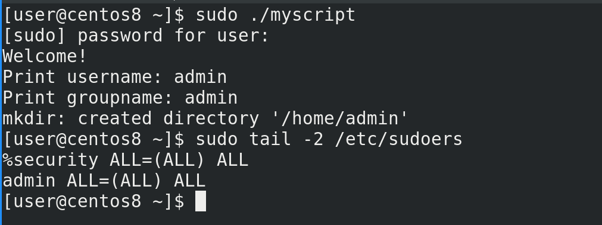

Окей, теперь проверим:

```
sudo ./myscript
sudo tail -2 /etc/sudoers
```

Как видите, запись создалась.

Пойдёмте дальше. До этого мы могли сделать наш скрипт либо интерактивным, либо вводить параметры при запуске скрипта.  Теперь же, с помощью if, мы можем использовать оба варианта. Для этого нам нужно проверять, было ли что-то передано нашему скрипту в виде параметров. Если да, то использовать эти параметры. Если нет, то выводить приглашение ввести данные. И так, задача – проверить, вводил ли пользователь параметры при запуске скрипта.

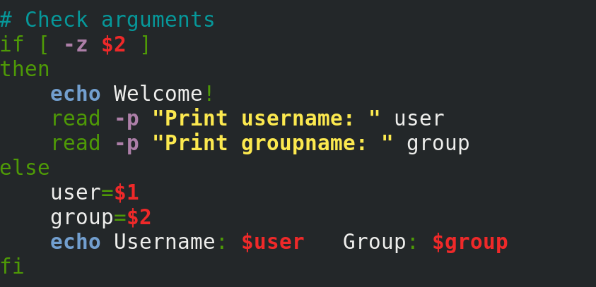

Мы знаем, что параметры превращаются в значение переменных $1, $2 и т.д. Нам нужно проверить, есть ли у этих переменных значения. Для этого используем тот же if со скобками с опцией -z, которая проверяет, есть ли значение у переменной. z – это zero length, то есть пустая строка. Если у переменной значения нет, то статус выхода 0. Проверяем переменную 2, так как если она есть, есть и первая:

```
[ -z $2 ]
```

И так, если скрипту не передали параметров, или передали всего один параметр, то стоит вывести приглашение ввести данные. Иначе стоит эти  параметры использовать как значения переменных user и group. Ну и вывести об этом текст:

```
user=$1
group=$2
echo Username: $user   Group: $group
```

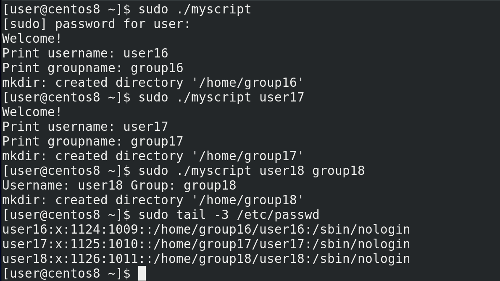

Теперь проверяем – сначала без параметров:

```
sudo ./myscript
```

потом с одним:

```
sudo ./myscript user17
```

и наконец с двумя параметрами:

```
sudo ./myscript user18 group18
```

Всё работает. А вы попробуйте самостоятельно сделать так, что если вводится один параметр, скрипт будет использовать его в качестве имени пользователя, а спрашивать только имя группы. Если больше двух параметров – то выдавать ошибку, что синтаксис неправильный и завершаться.


И если уж мы это делаем для автоматизации, то нужно сделать скрипт таким, чтобы он не требовал от нас ввода или параметров. Пусть лучше он будет их брать в файле. Предположим, у нас есть компания и HR при приёме на работу заполняет файл, а наш скрипт будет брать из этого файла данные и создавать пользователей. Для начала сделаем что-нибудь примитивное. Во первых, укажем путь к файлу, и зададим его как переменную, чтобы легче было его в дальнейшем менять:

```
file=/var/users
```

Дальше, я хочу оставить способ создания пользователей вручную, поэтому способ с файлом сделаем как одну из опций. То есть, по порядку – если скрипт запустили с параметрами, то использовать эти параметры. Если скрипт запустили без параметров, то пусть он проверит наличие нужного файла. Если файл есть, то пусть скрипт возьмёт данные из файла. Если файла нет, то пусть выведет предложение ввести данные.


Для этого я немного поменяю условия. Условие с пустой переменной 2 я переверну, тем самым проверяя, есть ли значение у переменной 2. И её команды поставлю выше. Т.е. если переменная не пустая, то брать значения из аргументов. Дальше использую elif чтобы проверить наличие файла:

```
elif [ -f $file ]
```

А в конце оставлю вариант с предложением ввода. Теперь остаётся определиться с файлом.

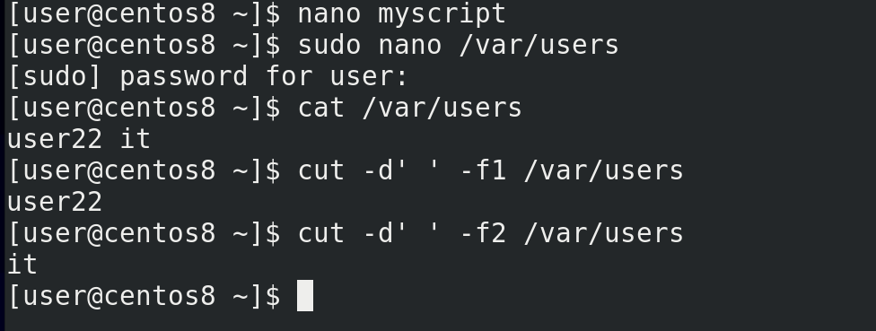

Создаём файл:

```
sudo nano /var/users
```

и прописываем в одну строчку пользователя и группу:

```
user22 it
```

Теперь нам нужно из этого файла достать эти данные и назначить их в качестве значений переменным. Для этого используем команду cut. Делителем у нас выступает пробел. Столбик 1 это имя пользователя:

```
cut -d' ' -f1 /var/users
```

а столбик два – группа:

```
cut -d' ' -f2 /var/users
```

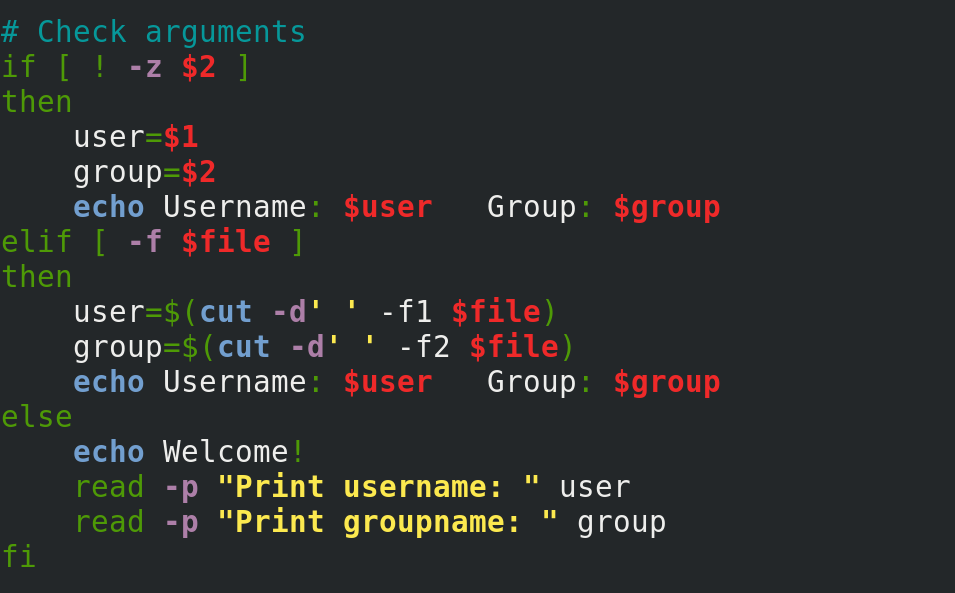

Укажем это в скрипте:

```
user=$(cut -d' ' -f1 $file)
group=$(cut -d' ' -f2 $file)
```

И в конце добавим строчку, чтобы показывала значения:

```
echo Username: $user   Group: $group
```

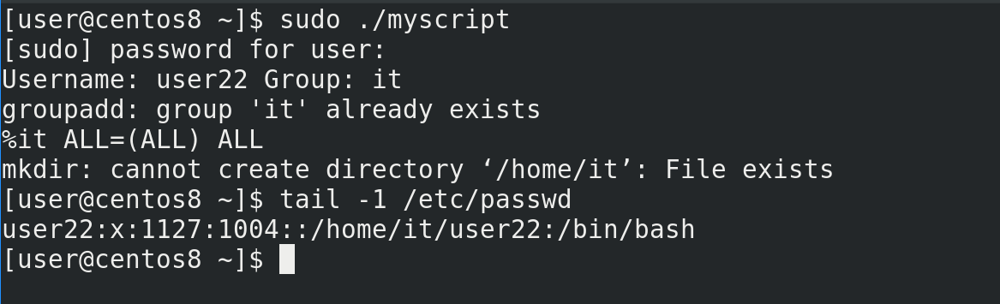

Проверим скрипт:

```
sudo ./myscript
tail -1 /etc/passwd
```

Всё создалось – пользователь 22 с группой it.

В будущем мы разберём, как с помощью одного файла создавать много пользователей, сделаем файл посложнее, добавим больше данных, больше возможностей. Обязательно практикуйтесь – придумывайте себе задания, какими-бы они сложными не казались, любая попытка – это опыт.
