

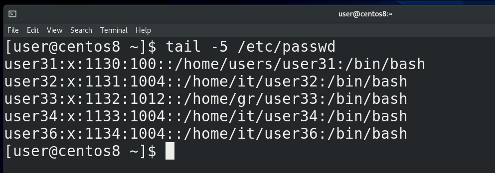

В прошлый раз мы с вами разбирали циклы и функции. Если посмотреть список созданных циклом пользователей:

```
tail /etc/passwd
```

можно заметить ошибку – у всех пользователей оболочкой является bash, хотя так должно быть только у определённых пользователей.

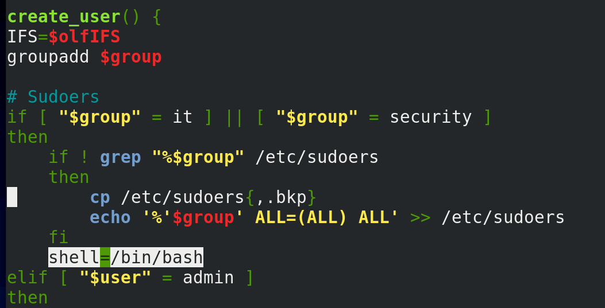

Оболочка в нашем скрипте задаётся переменной shell и значение по умолчанию – nologin. При выполнении цикла запускается функция create_user, где есть условие, что если группой является it или security, указать значение переменной shell:

```
shell=/bin/bash
```

Функция у нас выполнится, создастся один пользователь, а при итерации значение переменной так и останется bash. Собственно поэтому у всех пользователей оболочкой остался bash.

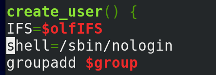

Чтобы решить эту проблему, мы можем занести переменную shell в начало функции, чтобы при каждой итерации переменная получала значение nologin.

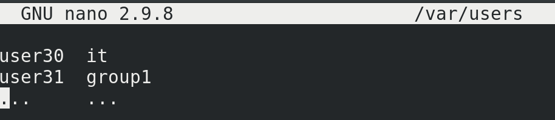

Касательно списка пользователей. В прошлый раз мы создали максимально простой файл, там были логины пользователей и группы, что легко было использовать в нашем скрипте. Но не всегда данные так хорошо подстроены под нас – вряд ли какой HR будет присылать нам файл в таком виде. Да и в большинстве реальных задач у вас есть файлы с большим количеством информации и вам нужно из этих файлов достать только нужное. Это чуть сложнее автоматизировать, но довольно увлекательно. В целом это называется парсингом – когда мы берём данные, структурируем их, чтобы в дальнейшем эти данные можно было использовать для других задач.


Для примера я подготовил excel файл со списком пользователей.

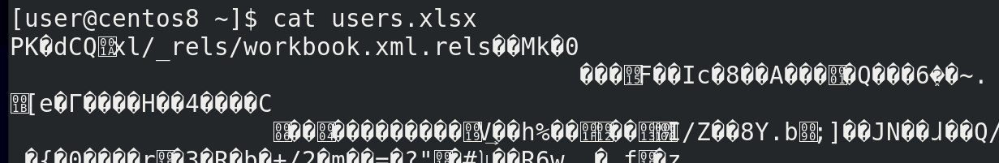

Такой файл не прочтёшь в командной строке - cat users.xlsx, так как это не просто текстовой файл. Но зачастую есть инструменты, которые позволяют превратить нечитаемые файлы в более подходящие форматы. Форматов много, ситуации разные, всё я вам показать не смогу, но с помощью гугла вы сможете найти многие решения. Давайте рассмотрим наш пример. И так, у нас есть excel таблица. Когда речь о каких-то таблицах, то обычно стоит попробовать превратить файл в csv формат.

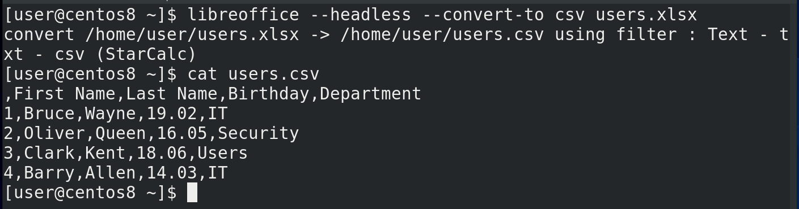

К примеру, это умеет делать программа libreoffice – свободный офисный пакет программ. Хотя можно найти и установить более лёгкие альтернативы. Команда такая:

```
libreoffice --headless --convert-to csv users.xlsx
```

Теперь посмотрим полученный результат:

```
cat users.csv
```

Каквидите, получился обычный текстовой файл, при этом это таблица, в которой делителем выступает запятая. Получить данные отсюда будет гораздо проще.

И так, основы работы с таблицами. У таблицы есть две составляющие – столбцы и строки. Зачастую, в столбце у нас списки, а в столбике данные по определённому объекту. Например, второй столбец – это список имён, а вторая строка – вся информация про одного пользователя.

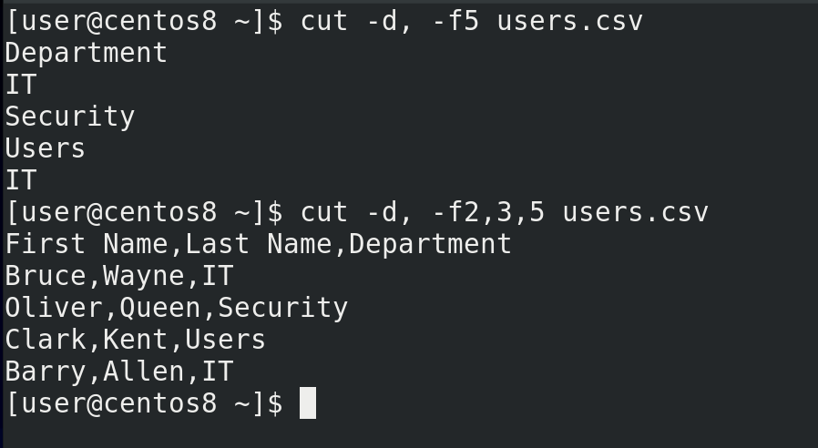

Мы уже знаем команду cut чтобы брать данные по столбцам. Тут у нас делителем выступает запятая. Допустим, выведем список всех департаментов:

```
cut -d, -f5 users.csv
```

Добавим ещё информации о пользователях:

```
cut -d, -f2,3,5 users.csv
```

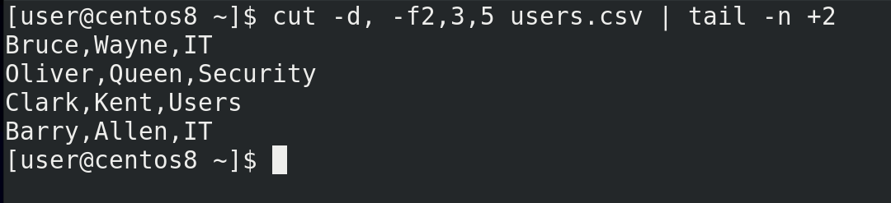

Но первая строчка нам не очень нужна и будет мешать, поэтому нужно как-то начать со второй. Вспоминаем команду tail — с ключом -n она позволяет выводить текст с определённой строчки:

```
cut -d, -f2,3,5 users.csv | tail -n +2
```

Вот, собственно, это наши будущие пользователи и группы. Но для начала эту информацию надо превратить в более удобный вид.

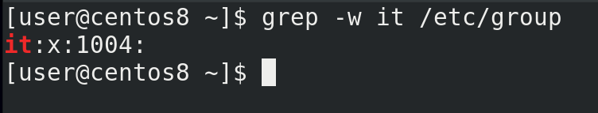

Например, посмотрим на департаменты – все они содержат заглавные буквы. Мы знаем, что Linux – система регистрозависимая. У нас уже есть группа it:

```
grep -w it /etc/group
```

но команда groupadd IT создаст абсолютно другую группу, чего нам не нужно. Для удобства лучше держать все логины и группы в строчных буквах. То есть, мне нужно преобразовать все заглавные буквы в строчные.

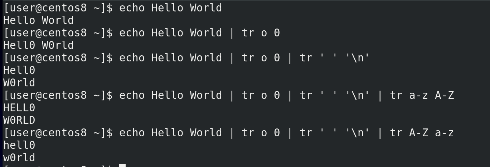

Для этого мы можем использовать команду tr – translate. С помощью этой команды мы можем одни символы преобразовывать в другие, удалять какие-то символы и много всего интересного. Например, заменим o на 0:

```
echo Hello World
echo Hello World | tr o 0
```

Или заменим пробел на символ переноса строки:

```
echo Hello World | tr o 0 | tr ' ' '\n'
```

Заменим все строчные буквы на заглавные:

```
echo Hello World | tr o 0 | tr ' ' '\n' | tr a-z A-Z
```

Или наоборот:

```
echo Hello World | tr o 0 | tr ' ' '\n' | tr A-Z a-z
```

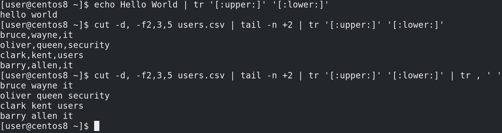

Хотя есть более правильный способ это сделать:

```
echo Hello World | tr '[:upper:]' '[:lower:]'
```

Более правильный, потому не во всех локалях буквы A и Z первая и последняя соответственно. Ну да ладно, вернёмся к нашей задаче. Превратим все заглавные буквы в строчные:

```
cut -d, -f2,3,5 users.csv | tail -n +2 | tr '[:upper:]' '[:lower:]'
```

Ну и для удобства можем все запятые заменить на пробелы:

```
cut -d, -f2,3,5 users.csv | tail -n +2 | tr '[:upper:]' '[:lower:]' | tr , ' '
```

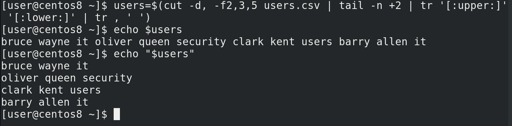

Сохраним это в переменной:

```
users=$(cut -d, -f2,3,5 users.csv | tail -n +2 | tr '[:upper:]' '[:lower:]' | tr , ' ')
```

Обратите внимание – если просто писать echo $users - то bash подставляет значение переменной в строку, при этом используя переменную IFS, где разделителем является сначала пробел, потом табуляция и только потом перевод строки. Поэтому у нас эти четыре строки начали разделяться пробелом, а не переводом строки. Это легко решить, если взять переменную в кавычки:

```
echo "$users"
```

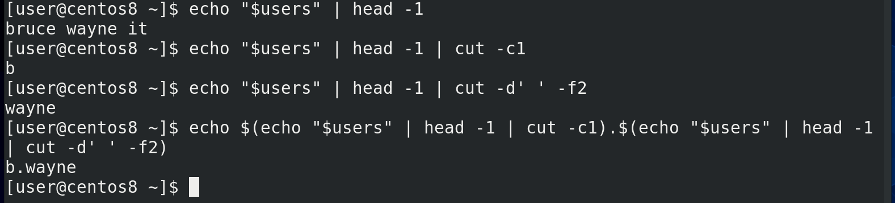

И так, у нас есть переменная, в которой содержится имя, фамилия и группа пользователя. Зачастую, в компаниях логин пользователя представляет из себя комбинацию имени и фамилии. Сделаем так, чтобы логин начинался с первой буквы имени, потом точка, а затем фамилия. Например, b.wayne. У нас в скрипте уже есть цикл, который построчно считывает список, поэтому для теста используем одну из строк:

```
echo "$users" | head -1
```

И так, для полученияпервой буквы имени, всё также используем cut, но с опцией -c1 – первый символ:

```
echo "$users" | head -1 | cut -c1
```

Для получения фамилии cut c делителем в виде пробела:

```
echo "$users" | head -1 | cut -d' ' -f2
```

Теперь объединим выводы этих команд с помощью echo:

```
echo $(echo "$users" | head -1 | cut -c1).$(echo "$users" | head -1 | cut -d' ' -f2)
```

Можно было бы предварительно превратить выводы команд в переменные, а уже потом объединять. Но, в целом, команда не такая сложная, да и head тут лишний, в конечном счёте мы будем работать с каждой строкой отдельно.

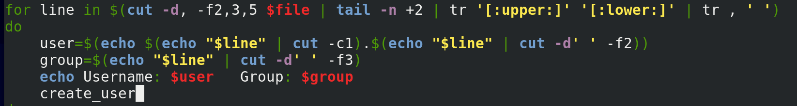

И так, логин мы получили, а группа и так в доступном виде. Теперь давайте добавим это в наш скрипт. Скопируем команду для получения списка пользователей:

```
cut -d, -f2,3,5 users.csv | tail -n +2 | tr '[:upper:]' '[:lower:]' | tr , ' '
```
и заменим в скрипте на эту команду. Заменим users.csv переменной $file. Скопируем команду для получения логина пользователя и вставим как значение переменной user. Заменим переменную users на line и уберём head:

```
user=$(echo $(echo "$line" | cut -c1).$(echo "$line" | cut -d' ' -f2))
```

Заменим значение переменной group:

```
group=$(echo "$line" | cut -d' ' -f3)
```

И так, вроде переменные user и group должны получить свои значения, остальные команды трогать не нужно.

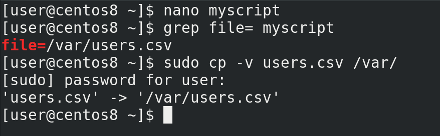

Разве что заменим значение переменной file - file=/var/users.csv. Вы, по желанию, можете добавить, чтобы excel файл конвертировался при запуске скрипта. А пока скопируем сам файл:

```
sudo cp users.csv /var/
```

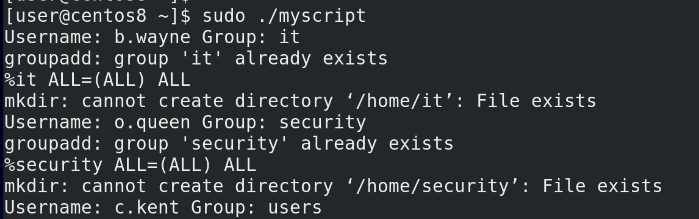

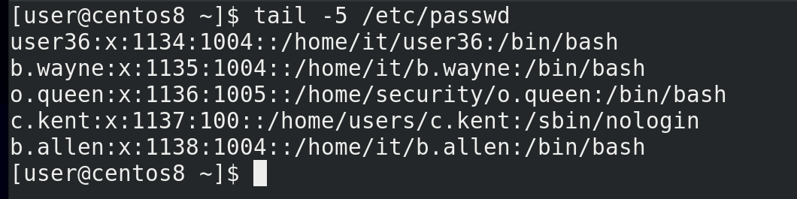

Давайте протестируем:

```
sudo ./myscript
tail /etc/passwd
```

Как видите, все пользователи создались, группы соответствующие, оболочки тоже.

Но задумайтесь вот о чём – если мы генерируем логины на основе имени и фамилии, в компании могут появиться тёзки, однофамильцы, какая-нибудь Clara Kent. Наш скрипт это проигнорирует, а команда useradd откажется создавать пользователя, так как такой логин уже есть. Поэтому такое вам задание – сделайте так, чтобы скрипт определял, есть ли уже такой логин, и, в случае чего, логин второго пользователя был немного другим, допустим, полное имя и фамилия, либо какое-то число в конце.

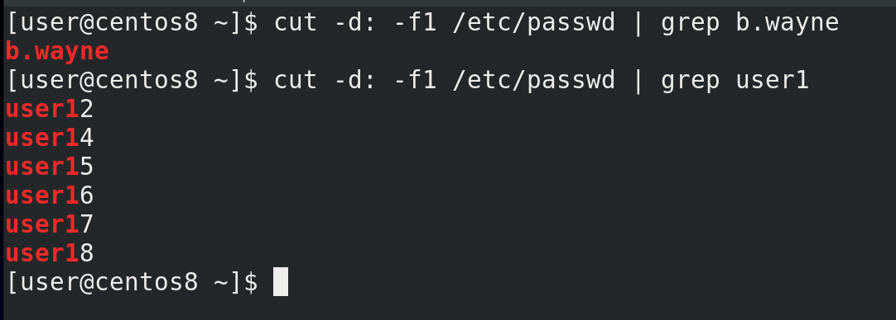

Скорее всего, вы будете определять по списку текущих пользователей. Наверняка вы обратитесь к файлу passwd, будете использовать cut и grep:

```
cut -d: -f1 /etc/passwd | grep b.wayne
```

Но такого grep-а может не хватить. Обратите внимание, я ищу пользователя user1:

```
cut -d: -f1 /etc/passwd | grep user1
```

Такого пользователя нет, но grep всё равно выдал мне результат, а скрипту главное результат. grep ищет соответствие, а все результаты содержат в себе user1. Мне нужно как-то сказать grep-u, что строчка в выводе должна заканчиваться на user1.

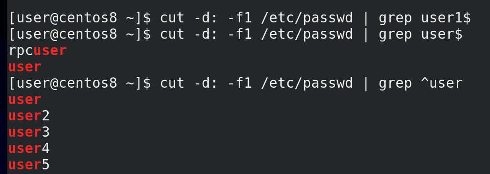

Для этого я могу использовать символ $ в конце искомой строки, то есть grep user1$:

```
cut -d: -f1 /etc/passwd | grep user1$
```

Теперь он ничего не нашёл. Но попробуем найти просто user$:

```
cut -d: -f1 /etc/passwd | grep user$
```

Как видите, опять несоответствие – есть некий rpcuser, в нём содержится слово user и оно заканчивается на него. Теперь мне нужно указать, чтобы строка начиналась на user – для этого можно использовать символ ^ - он называется карет. Указывая его перед выражением:

```
cut -d: -f1 /etc/passwd | grep ^user
```

мы говорим grep-u, что строка должна начинаться на эти символы.

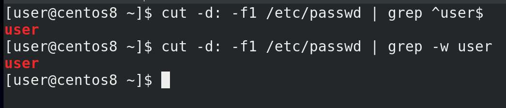

И так, указывая карет перед выражением, а доллар в конце:

```
cut -d: -f1 /etc/passwd | grep ^user$
```

мы говорим grep-у, что строка должна начинаться и заканчиваться на слове user. Таким образом, с помощью карет и знака доллара мы использовали так называемые регулярные выражения. Это специальный язык, с помощью которого мы можем более гибко работать с текстом. Регулярных выражений много, их можно применять по разному. Это большая тема, которую мы разберём в другой раз. Однако, в случае с grep, если мы ищем точное совпадение, можно использовать ключ -w:

```
cut -d: -f1 /etc/passwd | grep -w user
```

Подводя итоги, сегодня мы с вами взяли excel файл, вытянули оттуда данные, преобразовали эти данные в нужный нам вид и использовали в нашем скрипте.