

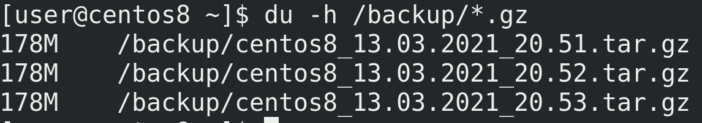

В прошлый раз мы с вами настроили простой скрипт для бэкапа. Он будет делать полную копию нашей домашней директории и хранить её в сжатом виде. Такой тип бэкапа, когда копируется всё что нужно, называется полным бэкапом. Например, мы бэкапили домашнюю директорию - du -h /backup/*.gz - и каждый раз копировалось всё - поэтому размеры файлов совпадают. Но, если подумать - за день никакие файлы не изменились, зачем нам ещё одна копия? Она занимает столько же места, а смысла от неё нет. Да и представьте, что у нас изменился один файл из 5 тысяч, а мы всё равно будем делать полный бэкап - копировать все 5 тысяч файлов. Мы просто теряем место.

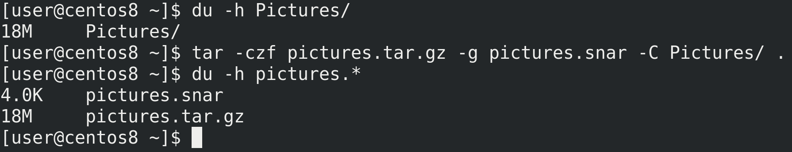

Почему бы не бэкапить только изменённые файлы? Такой тип бэкапа называется инкрементальным. У нас есть один полный бэкап, а при следующем будут сохраняться только изменённые файлы. Давайте мы это протестируем. Возьмём какую-нибудь директорию, например, Pictures - du -h Pictures. Для начала нужно создать полный бэкап. Но на этот раз нам понадобится дополнительный ключ - g - который указывает на файл с метаданными. По ним tar решает, какие файлы были изменены и в дальнейшем делает инкрементальный бэкап. Если файла с метаданными нету, то он делает полный бэкап и создаёт этот файл - tar -czf pictures.tar.gz -g pictures.snar -C Pictures/ .; du -h pictures.*. Как видите, создался сжатый архив и файл snar - именно в нём хранятся метаданные.

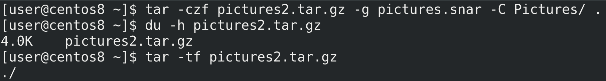

Теперь попытаемся создать ещё один бэкап - tar -czf pictures2.tar.gz -g pictures.snar -C Pictures/ .; du -h pictures2.tar.gz; tar -tf pictures2.tar.gz. Архив создался, но он весит всего 4 килобайта и пустой. То есть, если у нас за день никаких изменений не будет, мы не потратим место на диске на новый бэкап.

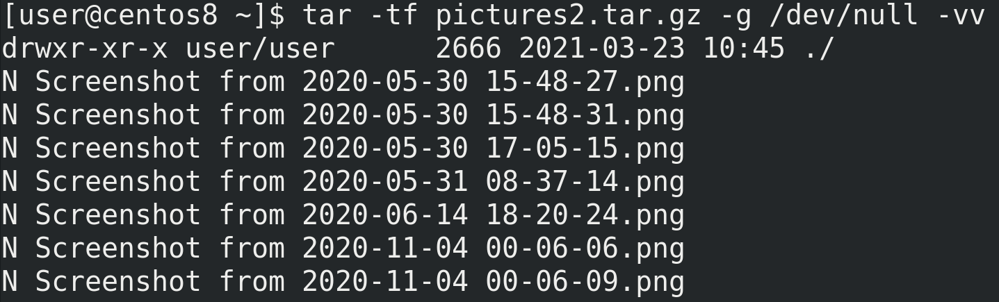

Когда речь идёт об инкрементальных архивах, нужна опция -g, но для извлечения и просмотра нет нужды указывать файл snar, так как в самом архиве есть эта информация - tar - tf pictures2.tar.gz -g /dev/null -vv. Поэтому вместо snar принято указывать /dev/null, а два -vv позволят увидеть добавленные или не включённые в архив файлы.

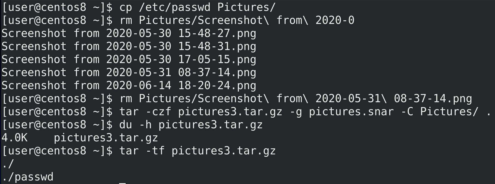

Давайте добавим в директорию Pictures новый файл и удалим какой-то из существующих - cp /etc/passwd Pictures/; rm Pictures/Screenshot	Потом создадим ещё один бэкап - tar -czf pictures3.tar.gz -g pictures.snar -C Pictures/ . ; du -h pictures3.tar.gz; tar -tf pictures3.tar.gz. Как видите, в новом архиве появился файл passwd.

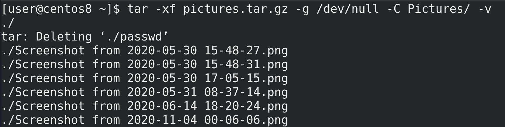

Теперь рассмотрим процесс восстановления. Для этого нужно поочерёдно восстанавливать бэкапы до требуемого дня. Сперва восстановим исходный архив - tar -xf pictures.tar.gz -g /dev/null -C Pictures -v. Как видите, он удалил файл passwd, так как его изначально не было.

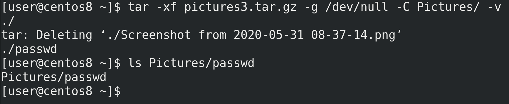

Смысла восстанавливать второй архив нет, так как там не было никаких изменений, сразу восстановим третий - tar -xf pictures3.tar.gz -g /dev/null -C Pictures -v. Таким образом, у нас удалился тот самый скриншот и восстановился файл passwd.

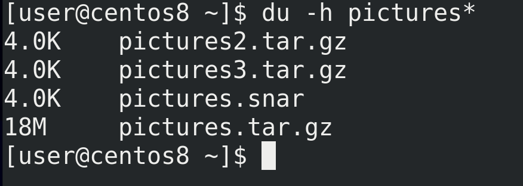

И при том, что я создал 3 бэкапа, инкрементальные копии практически ничего не весят - du -h pictures*. Естественно, в реальных условиях они бы занимали больше места, и тем не менее, инкрементальные бэкапы позволяют во много раз сэкономить пространство.

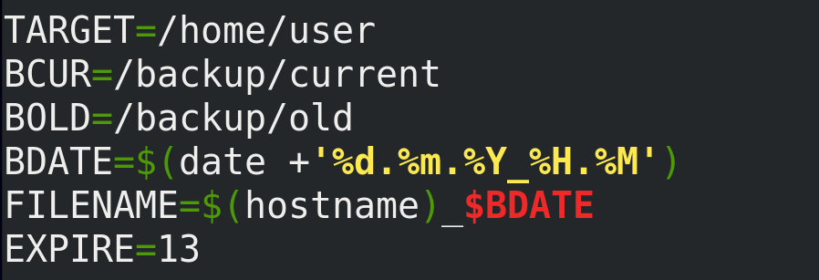

Теперь попытаемся научить наш скрипт делать инкрементальные бэкапы. Это немного усложнит его, потому что мы не можем просто удалять файлы недельной давности - инкрементальные копии зависят от полного бэкапа, без него они теряют смысл. Но так как мы сэкономили пространство, можем хранить бэкап с прошлой недели. Для начала, чтобы превратить наш скрипт в более универсальный, заменим /home/user на переменную - TARGET=/home/user, разделим логи на ошибки и стандартный вывод - > $FILENAME.log 2> FILENAME.err, заменим директорию BDIR на две - /backup/current и /backup/old, немного подкорректируем FILENAME - FILENAME=$(hostname)_$BDATE, уберём отсюда директорию, а также добавим переменную EXPIRE, по которой и будем удалять старые бэкапы - EXPIRE=13.

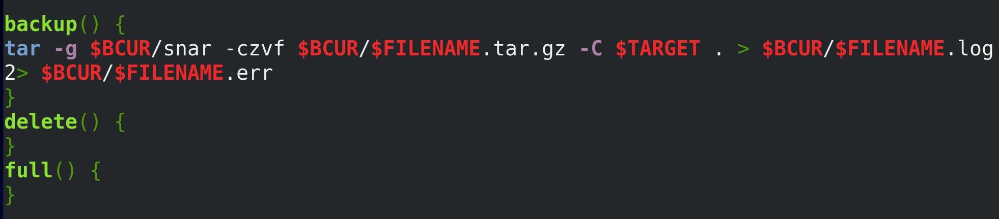

Так как удалять по старости бэкапа мы не можем, иначе сотрём полный бэкап, стоит придумать другую схему. Например, раз в неделю архивировать бэкап прошлой недели и создавать новый полный бэкап. Чтобы не решать это в скрипте, а сделать через планировщик задач, в самом скрипте я добавлю 3 функции - backup() {}, delete() {} и full() {}. В функцию backup добавлю нашу старую команду по бэкапу, подкорректированную по директориям и с опцией -g:

```bash
backup() {
tar -g $BCUR/snar -czvf $BCUR/$FILENAME.tar.gz -C $TARGET . >
$BCUR/$FILENAME.log 2> $BCUR/$FILENAME.err
}
```

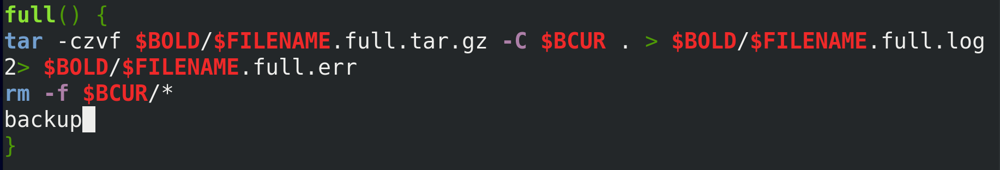

Когда будем делать полный бэкап, скрипт заархивирует содержимое директории /backup/current и сохранит его в директории /backup/old. После чего удалит содержимое current директории и создаст новый бэкап, запуская готовую функцию backup:

```bash
full() {
tar -czvf $BOLD/$FILENAME.full.tar.gz -C $BCUR . >
$BOLD/$FILENAME.full.log 2> $BOLD/$FILENAME.full.err rm -f $BCUR/*
backup
}
```

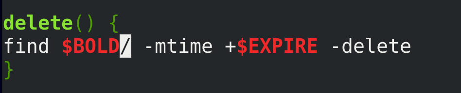

А при необходимости старые бэкапы будут удаляться из директории /backup/old, используя переменную EXPIRE:

```bash
delete() {
find $BOLD/ -mtime +$EXPIRE -delete
}
```

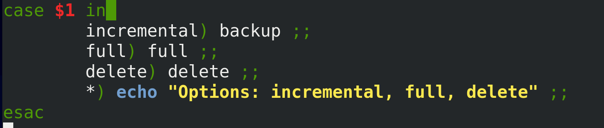

Но пока мы только задали функции, их нужно ещё запускать. Для этого мы будем передавать скрипту аргумент - $1 - и на основе него запускать ту или иную функцию:

```bash
case $1 in
   incremental) backup ;;
   full) full ;;
   delete) delete ;;
   *) echo "Options: incremental, full, delete" ;;
esac
```

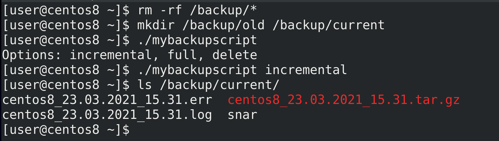

Теперь давайте проверим работу скрипта. Для начала очистим содержимое директории /backup - rm -rf /backup/* - и создадим необходимые директории - mkdir /backup/old /backup/current. Попробуем просто запустить скрипт - ./mybackupscript. Как видите, он выдаёт информацию об опциях. В нашем случае в первый раз лучше запускать incremental, чтобы не архивировать пустую директорию - ./mybackupscript incremental. После чего можем проверить содержимое директории /backup/current - ls /backup/current/.

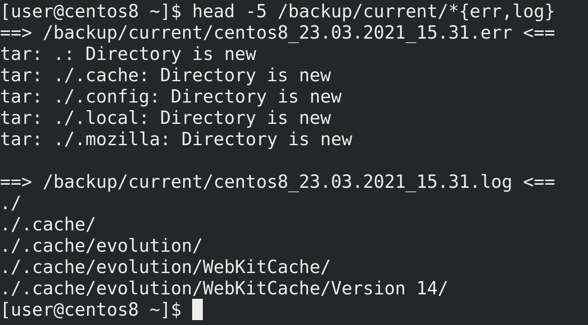

Если посмотреть лог ошибок - head -5 /backup/current/*{err,log} - можно увидеть, что в ошибки попадают записи "Directory is new". Это не совсем ошибки, просто информация о том, что при прошлом бэкапе этих директорий не было. Но это логично, потому что у нас прошлого бэкапа и не было.

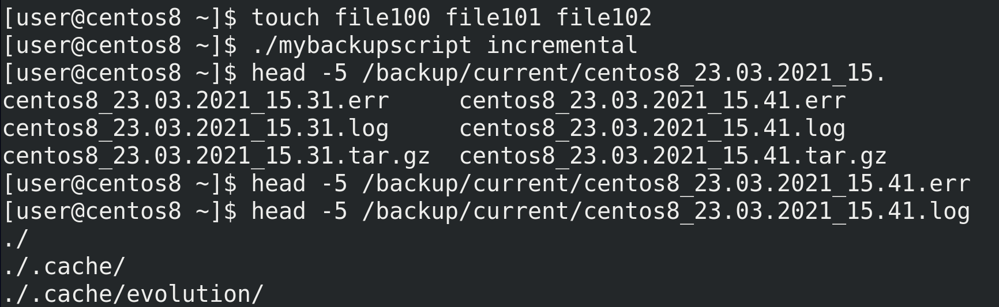
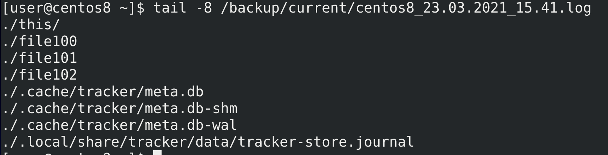

Создадим пару файлов - touch file100 file101 file102 и запустим скрипт заново - ./mybackupscript incremental. В err файле больше ошибок нет - потому что нет новых директорий. А в логах перечислены все директории, а также новые и изменённые файлы.

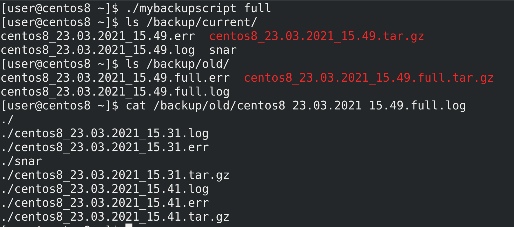

Теперь попробуем запустить полный бэкап - ./mybackupscript full. Как видите - ls /backup/current - создались новые файлы, а старые заархивировались - ls /backup/old; cat /backup/old/*full.log.

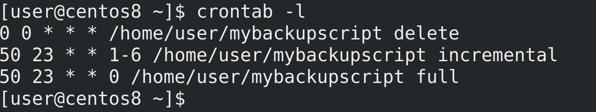

Осталось настроить cron - crontab -e; crontab -l. Пусть каждую ночь find ищет и удаляет старые бэкапы старее 14 дней. С понедельника по субботу пусть выполняется инкрементальное резервное копирование, а в воскресенье полное.

Подведём итоги. Сегодня мы с вами разобрали, что такое полные и инкрементальные бэкапы, зачем они нужны, научились ими пользоваться, а также добавили их в наш скрипт. Это позволяет значительно снизить занимаемое пространство, делать больше копий и в целом делать их быстрее. Но при этом бэкапы становятся зависимы друг от друга, недостаточно просто распаковать один архив, иногда нужно это делать по порядку их создания. Но сэкономленное пространство этого стоит.
