


Недавно мы с вами разбирали утилиту gzip, которая позволяет сэкономить пространство с помощью сжатия данных и реализовали это для бэкапа домашней директории. gzip работает с файлами и на этих картинках показан простой пример. Но у такого сжатия есть пара нюансов - со сжатыми файлами работать не получится, их нужно предварительно разжимать. Точнее, есть всякие утилиты, которые позволяют работать с сжатыми файлами, но это не годится для всего. Да и сжимается не абсолютно всё, а только то, что вы укажете.

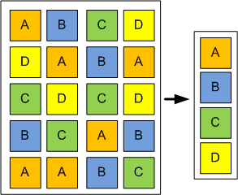

Однако есть механизм, который позволяет экономить пространство ещё на уровне блоков данных - дедупликация. В целом механизм напоминает сжатие, но работает не на уровне файлов и алгоритмов сжатия, а на уровне блоков - дублирующиеся блоки заменяются ссылками на один. Очень яркий пример использования - если у вас множество виртуальных машин. Представьте, что вы подняли 100 виртуалок с Centos-ом, каждая выполняет свою задачу. На всех одна и та же операционная система, ядро, библиотеки и куча утилит - всё это одно и тоже, дублирующееся на сотни виртуалок. Файлы работающих виртуалок не сожмёшь с помощью gzip-а, да и эффективность от такого сжатия будет сомнительная. А вот дедупликация просто увидит кучу одинаковых блоков и заменит их ссылками, что значительно сэкономит пространство. Минусы, конечно, тоже есть - дедупликация постоянно работает, из-за чего увеличивается использование оперативной памяти и диска, соответственно, где-то проседает скорость работы. Т.е. на домашних компьютерах это не так нужно, в рабочей среде зависит от конкретной задачи.

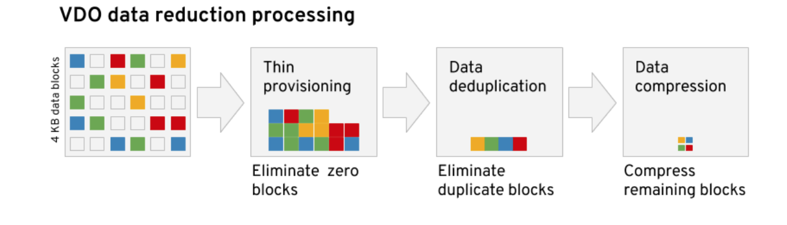

С недавних пор у RedHat появилась технология VDO -  virtual data optimizer. Она позволяет экономить пространство диска, при этом жертвуя ресурсами процессора и оперативки. И кроме дедупликации она избавляется от пустых блоков, в которых одни нули, а также сжимает итоговые данные алгоритмом LZ4. Также она обеспечивает thin provisioning - т.е. когда вы компьютеру выделили, скажем, 50 гигабайт, а операционной системе говорите, что там 500.

Зачем это нужно? Представьте, что вам нужно поднять несколько виртуальных машин и каждой дать по 50 гигабайт, на будущее, потому что количество данных будет расти. Но, во первых, сейчас каждая виртуалка будет занимать не больше 5 гигабайт, а во вторых у вас сейчас нет таких больших дисков. Будут расти данные - вы добавите новые диски. Если вы сейчас выделите в виртуалках всего по 5 гигабайт, то вам постоянно нужно будет в них увеличивать пространство по мере добавления дисков. А с thin provisioning-ом вам не нужно это делать - виртуалка будет занимать столько места, сколько ей нужно на самом деле, а вам просто нужно следить, чтобы выделенный вами диск не закончился. Если закончится - будет плохо, потому что виртуалки будут видеть свободное пространство, но не смогут туда писать, потому что реального пространства больше нет. И это приведёт к проблемам. Но если быть внимательным и до этого не доводить - всё будет хорошо.

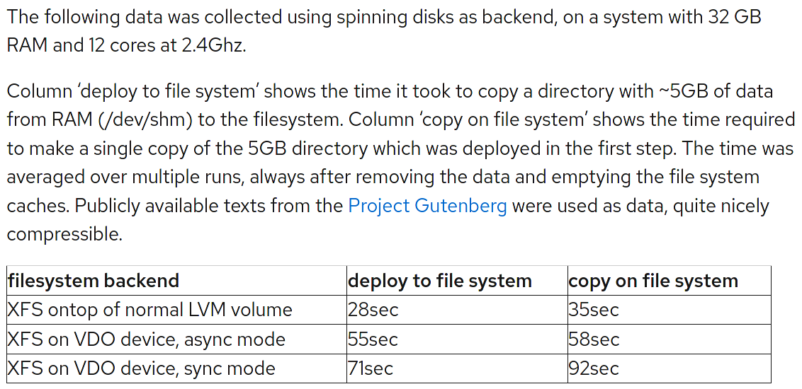

Ну и стоит упомянуть падение производительности при использовании VDO. По скрину видно, что просадка довольно таки значительная, если без VDO с XFS на LVM копирование 5 гигабайт занимает 28 секунд, то с VDO в асинхронном режиме - 55 секунд, а в синхронном и вовсе 71. При синхронном режиме VDO ждёт ответа от диска о том, что данные на него записались. Но суть в том, что диск может немного соврать об этом, потому что он может перед записью использовать кэш. Только вот если сервер вдруг вырубится, то данные в кэше пропадут. Тут, конечно, есть нюансы - кэш может быть с батарейками или диск со сквозным кэшэм - но, в любом случае, sync стоит ставить только если вы уверены в том, что делаете. При асинхронном режиме VDO не гарантирует файловой системе или приложению запись на диск, тем самым они сами заботятся о сохранности. По умолчанию же используется режим auto, который сам подбирает нужный режим в зависимости от накопителя.

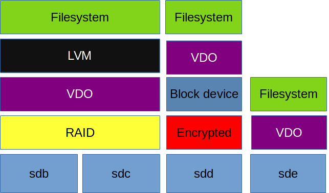

Сам VDO ставится поверх блочного устройства, ниже файловой системы и LVM. Если у вас RAID - VDO нужно ставить поверх рейда. Если зашифрованный раздел - VDO ставится поверх него, иначе он не увидит что там дедуплицировать и сжимать. У VDO есть ряд требований к размеру диска и оперативке, с которыми вы можете ознакомиться по [ссылке](https://access.redhat.com/documentation/en-us/red_hat_enterprise_linux/8/html/deduplicating_and_compressing_logical_volumes_on_rhel/vdo-requirements_deduplicating-and-compressing-logical-volumes#examples-of-vdo-requirements-by-physical-size_vdo-requirements). Например, для диска размером до терабайта нужно примерно 700 мегабайт оперативки под задачи VDO и 2.5 гигабайта пространства под метаданные.

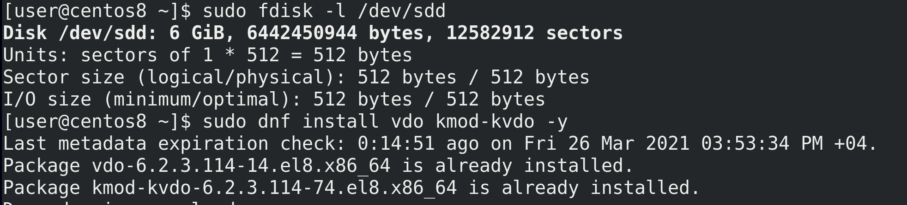

Для теста я добавил нашей виртуалке ещё один диск на 6 гигабайт - минимально необходимое пространство для VDO это почти 5 гигабайт:

```
sudo fdisk -l /dev/sdd
```

Также нам понадобится установить утилиту и модуль ядра для работы с vdo:

```
sudo dnf install vdo kmod-kvdo
```

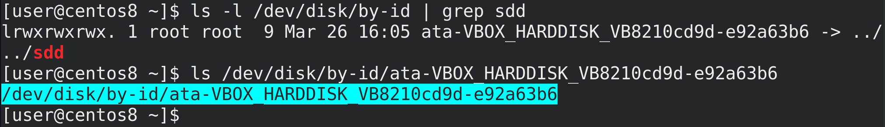

И так, у нас есть диск sdd, на котором требуется развернуть VDO. Но, как мы обсуждали, имя sdd динамически выдаётся udev-ом при включении, т.е. может поменяться при определённых условиях. VDO предпочитает постоянные имена. Попробуем найти sdd по идентификатору:

```
ls -l /dev/disk/by-id/ | grep sdd
```

Это - идентификатор диска, символическая ссылка, которая постоянно будет вести на нужно устройство, поэтому используем его. Хотя VDO и сам делает попытку найти нужную символическую ссылку, тем не менее мы это сделали за него, чтобы было нагляднее.

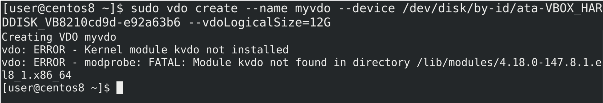

При создании VDO указываем желаемое имя - --name myvdo, указываем на устройство --device и указываем логический размер - то что я говорил про thin provisioning:

```
sudo vdo create --name myvdo --device /dev/disk/by-id/ata-... --vdoLogicalSize=12G
```

Т.е. физический диск у меня 6 гигабайт, а файловая система будет видеть все 12. Но команда у меня не сработала - как видите, вышла ошибка "Kernel module not installed", а дальше нам показывают, что ядро не нашло модуля в директории  /lib/modules/4.18.0-147.

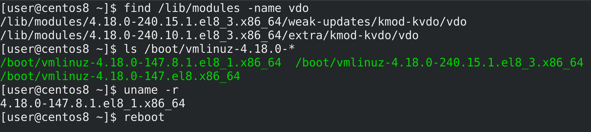

Но так как установка прошла успешно, попытаемся найти модуль вручную:

```
find /lib/modules -name vdo
```

Как видите, find нашла две директории с более новыми версиями ядра - 240.10 и 240.15 и в них эти модули. Скорее всего установка модуля подтянула новую версию ядра и в директории /boot как раз есть новые версии:

```
ls /boot/vmlinuz-*
```

На всякий случай проверим текущую версию ядра:

```
uname -r
```

147 - значит нам нужно просто перезагрузиться:


```
reboot
```

чтобы загрузиться с новым ядром. После перезагрузки слетели драйвера виртуалбокса, пришлось переустанавливать их для новой версии - сначала ставим необходимые пакеты:

```
sudo dnf install kernel-headers kernel-devel
```

после чего с диска запускаем установку гостевых дополнений. Потом опять перезагружаемся.

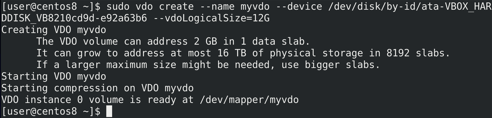

Пробуем команду опять:

```
sudo vdo create --name myvdo --device /dev/disk/by-id/ata-... --vdoLogicalSize=12G
```

и всё получается. Утилита нам говорит, что создала slab-ы - т.е. блоки в понимании vdo размером в 2 гигабайта. И с таким размером у нас получится использовать только 16 терабайт пространства, а для больших объёмов требуется указать размер слабов больше. Максимумом являются slab-ы размером 32 гигабайта и пространство объёмом 256 терабайт.

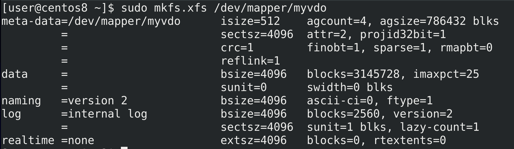

Давайте сразу на него запишем файловую систему:

```
sudo mkfs.xfs /dev/mapper/myvdo
```

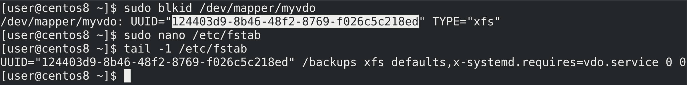

После чего выясним UUID:

```
sudo blkid /dev/mapper/myvdo
```

и добавим строчку в fstab. Обратите внимание на опцию монтирования:

``` x-systemd.requires=vdo.service ```

Она нужна, чтобы монтировать эту файловую систему только если сервис vdo запущен.

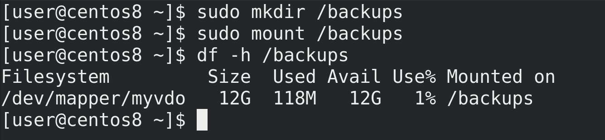

Попробуем создать директорию и примонтировать:

```
sudo mkdir /backups
sudo mount /backups
df -h /backups
```

Как видите, всё примонтировалось.

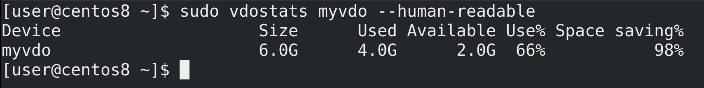

Теперь давайте протестируем. Например, сделаем несколько бэкапов домашней директории. Но перед этим проверим статистику:

```
sudo vdostats myvdo --human-readable
```

Несмотря на то, что пока здесь нет никаких данных, vdo уже зарезервировал 4 гигабайта места для информации о дедупликации. Поэтому нам остаётся всего 2 гигабайта, хотя df нам показал все 12.

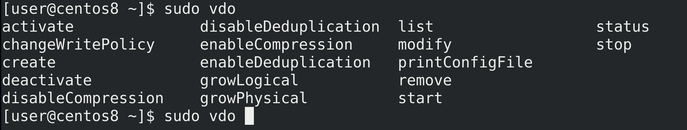

Но, как я уже говорил, нужно быть осторожным и не допускать заполнения этих двух гигабайт, либо увеличивать размер диска под vdo. Вообще у VDO множество возможностей - останавливать или запускать дедупликацию и компрессию, менять размер логического и физического диска, менять тип записи с синхронного на асинхронный и наоборот и т.д. Это вполне понятные ключи, но советую быть осторожным и предварительно прочесть [документацию](https://access.redhat.com/documentation/en-us/red_hat_enterprise_linux/8/html/deduplicating_and_compressing_storage/maintaining-vdo_deduplicating-and-compressing-storage#thin-provisioning-in-vdo_managing-free-space-on-vdo-volumes), прежде чем выполнять эти операции.

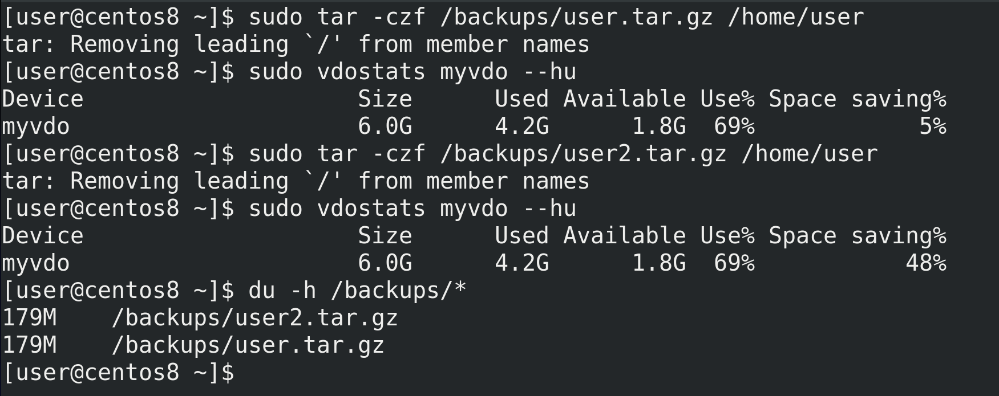

И так, давайте приступим. Для начала создадим один бэкап:

```
sudo tar -czf /backups/user.tar.gz /home/user
```

и посмотрим статистику:

```
sudo vdostats myvdo --hu
```

Как видите, почти 200 мегабайт потратилось под бэкап. Теперь попробуем сделать ещё один бэкап:

```
sudo tar -czf /backups/user2.tar.gz /home/user
```

Проверим ещё раз статистику  - а там всё равно 200 мегабайт, при этом обратите внимание, как сильно выросло значение Space saving. В итоге у нас получилось два файла, вместе они занимают почти 400 мегабайт:

```
du -h /backups/*
```

но благодаря vdo второй файл практически не занимает пространства. Да, в реальных условиях вряд ли все файлы будут одинаковы, но так как дедупликация работает на блочном уровне, в определённых случаях получится немало сэкономить.

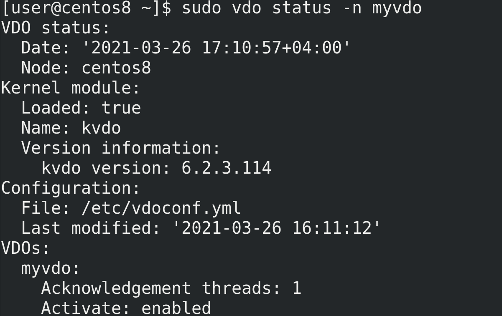
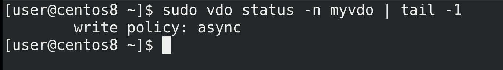

Более детальную информацию можно узнать с помощью ключа status:

```
sudo vdo status -n myvdo
```

например, о типе записи.

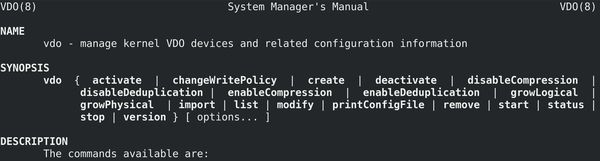

Напоследок, посоветую не забывать пользоваться man, где есть и примеры создания, и то что нужно указывать в fstab и информация по многим ключам.

Подведём итоги. Сегодня мы с вами разобрали VDO - технологию для дедупликации и сжатия данных. Её легко развернуть, но нужно быть внимательным и учитывать требования по оперативке, по занимаемому пространству и падение производительности. Это не так эффективно при небольших объёмах данных, но для определённых задач, например, для бэкап хранилища или хранилища для дисков виртуальных машин, эта технология незаменима.
