Мы с вами долгое время работаем через консоль виртуальной машины. В ней отображается графический интерфейс, но не то чтобы он сильно нужен - практически всё мы делаем через командную строку. Да, половину задач мы могли бы делать через графику, но вспомните скрипты и планировщики. Графический интерфейс программы автоматизировать очень сложно, а вот с текстовым можно сделать всё что угодно. Тогда нужен ли нам вообще графический интерфейс? Для рабочих задач можно обойтись и без него. Большинство серверов и виртуальных машин работает без графического интерфейса, чтобы не тратить ресурсы на оболочку и кучу программ, которые приходят вместе с ней. От этого и другой плюс, меньше программ - меньше уязвимостей.

Без графического интерфейса консоль виртуальной машины будет показывать виртуальный терминал. С ним зачастую неудобно работать - нельзя выделить и копировать текст, невозможно автоматизировать и всё такое. Однако консоль всё же иногда используют - при установке операционной системы, при начальной настройке сети и каких-то проблемах, когда сеть недоступна.

Но вот наличие сети позволяет администраторам через свой графический интерфейс подключаться к текстовому интерфейсу Linux-а и работать с командами ровно также, как мы это делали через эмулятор терминала. Это называется удалённым доступом. Чтобы это работало, используется сетевой протокол под названием SSH - secure shell - безопасная оболочка. SSH состоит из клиента и сервера.

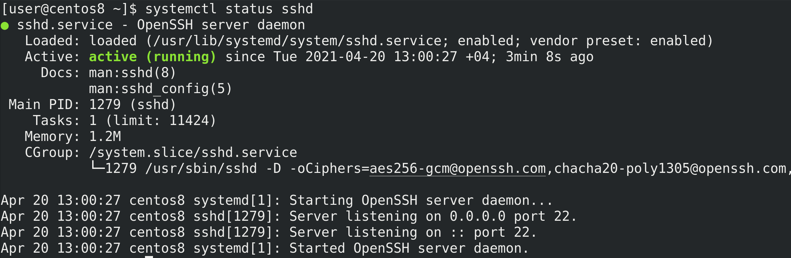

На сервере, куда вы подключаетесь, должен работать демон sshd - systemctl status sshd. По умолчанию, он использует 22 порт и работает с TCP. На Centos он устанавливается и включается ещё при установке системы, а на некоторых дистрибутивах его нужно устанавливать вручную.

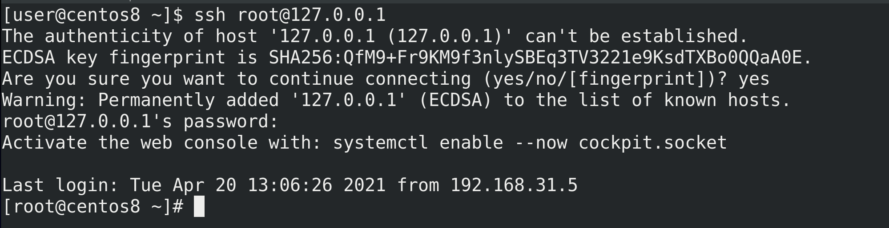

Для удалённого подключения есть множество программ. Начнём с самой простой - утилита ssh, она есть практически везде. Попробуем подключиться сами к себе. Для этого нужно знать IP адрес. Но мы помним, что каждый компьютер может обращаться к себе с помощью адреса 127.0.0.1 - этот адрес и используем. Также нужно указать пользователя, к которому мы подключаемся, например, к root-у - ssh root@127.0.0.1. Собачка разделяет имя пользователя и IP адрес. При первом подключении вы увидите предупреждение, что ssh клиент не смог распознать сервер и спрашивает нас, стоит ли подключаться к нему?

Дело в том, что сеть зачастую работает через десятки роутеров и свитчей. Особенно, если это в интернете, наше соединение проходит через оборудование незнакомых компаний. И если вы не соединены к серверу напрямую, а подключаетесь удалённо, есть шанс, что какой-то взломщик встанет посереди вашего трафика и сможет его видеть и даже вмешиваться. Такая атака называется man in the middle - человек посередине. Технически это возможно, поэтому многие сетевые протоколы, включая SSH, имеют встроенные механизмы защиты.

Например, у ssh сервера есть специальные ключи, что-то вроде удостоверения личности. И у каждого ключа есть отпечаток, что-то вроде серийного номера. Когда мы первый раз подключаемся к серверу, ssh клиент запоминает отпечаток ключа. И если завтра кто-то встанет посереди трафика и подставит свой ключ, то ssh клиент выдаст предупреждение, что этот ключ не соответствует тому, что мы сохранили. Злоумышленник, конечно, может обмануть нас, показав нам этот же ключ, но ключ, который мы видим - лишь один из двух. Мы видим лишь ключ, называемый публичным. А он не имеет смысла без второго, который хранится только на сервере и называется приватным. Но в целом, это большая тема и давайте её пока оставим. Если вам интересно, можете посмотреть по [ссылке](https://youtu.be/POjcECePqzY). Кроме распознавания  нужного сервера, ssh ещё шифрует соединение между клиентом и сервером, благодаря чему злоумышленник не увидит команды, которые вы вводите, и в целом трафик, который проходит через SSH.

Поэтому вводим yes, после чего ssh спрашивает пароль пользователя, к которому мы подключаемся. Вводим пароль и попадаем в оболочку этого пользователя - root-а. А дальше  всё как обычно, как мы всегда и работали, это полноценный bash со всеми командами.

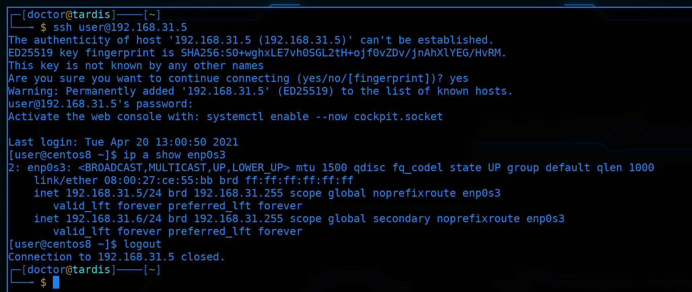

Для наглядности, давайте я подключусь со своего компьютера на виртуалку. В прошлый раз мы дали ей IP - 192.168.31.5 - ssh user@192.168.31.5; ip a show enp0s3. Как видите, соединение прошло успешно и теперь по началу строки, где указан пользователь и имя компьютера, можно различать, где мой компьютер, а где виртуалка. Чтобы выйти из ssh сессии, достаточно написать exit, logout или нажать Ctrl+D.

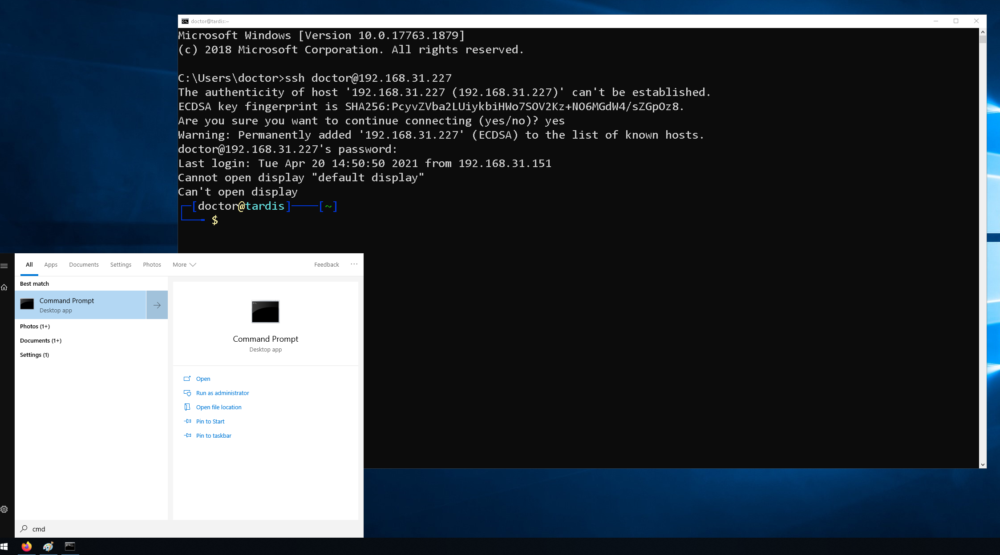

Если у вас основной системой является Windows, то тут несколько вариантов. Пару лет назад в Windows 10 добавили ssh клиент. Работает он почти также, как и на Linux. Предварительно следует запустить программу cmd.exe, которая является текстовым интерфейсом для Windows. И в нём можно запустить ssh - ssh user@192.168.31.227. Такой вариант подойдёт для небольших задач - функционала немного, но ничего не нужно доустанавливать.

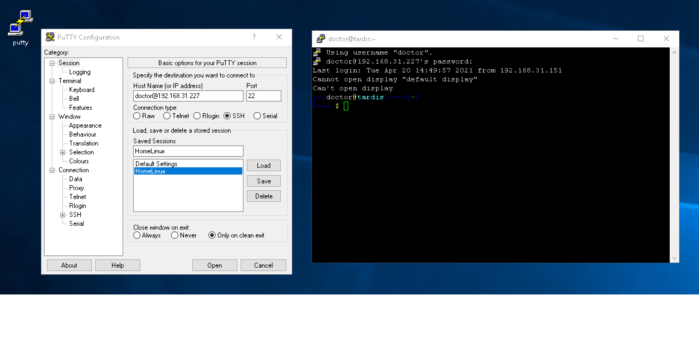

Одна из самых популярных программ - PuTTY. Функционала здесь побольше и её в основном используют администраторы, которым иногда нужно поработать с командной строкой. А также этой программой нередко пользуются для прямого подключения к сетевому оборудованию, например, к свитчам, через специальный порт. Программа весит очень мало, её легко скачать и в целом подойдёт для нечастых задач.

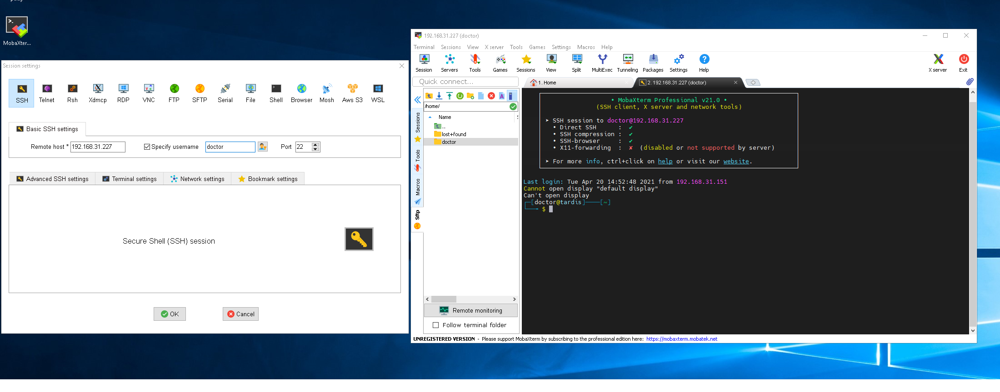

А администраторы, которые постоянно подключаются к большому количеству серверов, которым нужно много различных протоколов и более глубокий функционал, используют продвинутые инструменты, например, SecureCRT или MobaXterm.

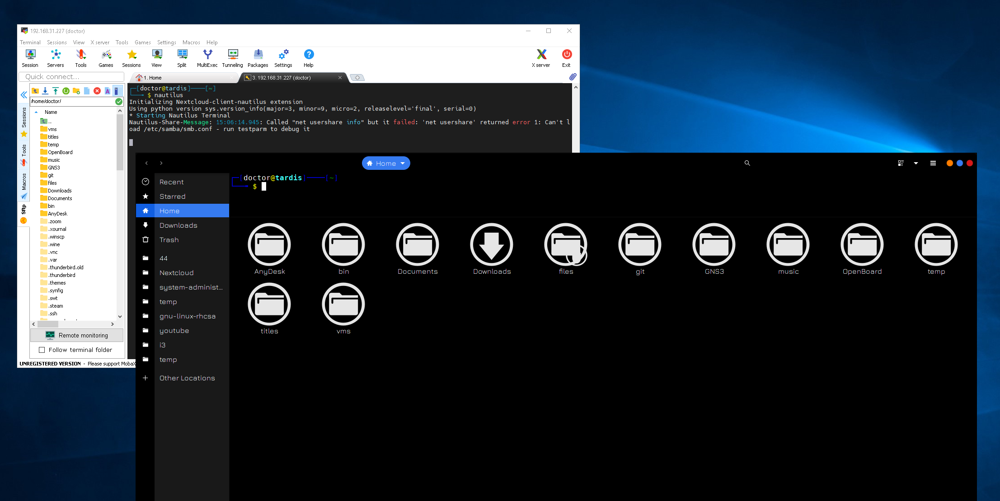

Например, ssh позволяет передавать файлы между компьютерами, что удобно реализовано в MobaXterm. Также графическая подсистема в Linux-ах позволяет запускать приложения удалённо, через ssh. Например, я могу запустить программу с графическим интерфейсом на виртуалке без графики, при этом окно будет отображаться на стороне клиента ssh, т.е. на Windows, а сама программа работать на сервере. Это называется проброс графики. Чтобы это работало на Windows через PuTTY, нужно установить дополнительную программу, а в MobaXterm это уже встроено.

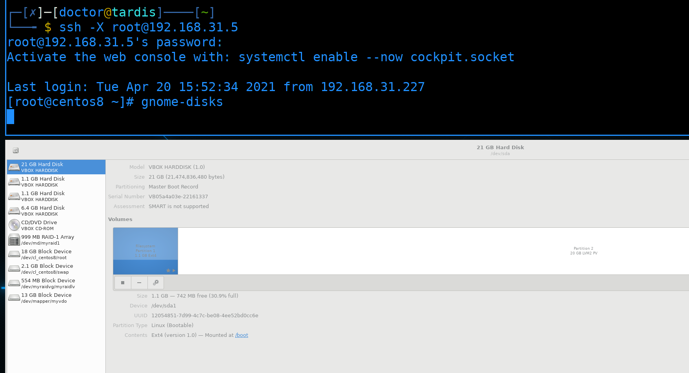

Для проброса графики на стороне сервера не нужна графика, достаточно пакета xauth. Если у вас основная система GNU/Linux, то никаких дополнительных программ не надо, достаточно при подключении использовать ключ -X - ssh -X root@192.168.31.5; gnome-disks.

Обычно, Linux серверов много - в компаниях могут быть десятки, сотни и тысячи Linux машин. И администраторы через свой комп или с помощью скриптов и программ управляют всеми этими компьютерами. Но пароли для такого не подходят - вам либо нужно будет на всех компьютерах держать один и тот же пароль, что очень плохая идея, либо для каждого компьютера отдельный пароль - что хорошо, но сложно. Да, вам нужно хранить пароли в парольных менеджерах, но многим программам и скриптам неудобно работать с паролями. Поэтому есть другой способ аутентификации - с помощью ключей.

Я до этого говорил о ключах в SSH, но то были ключи хоста - они нужны для безопасности, чтобы распознать нужный сервер. У SSH также есть понятие пользовательских ключей, которые можно использовать вместо пароля. Работает это так: у администратора есть два ключа - приватный и публичный. Админ закидывает публичный ключ на сервера, в домашнюю директорию пользователей, к которым будет подключаться. И при следующем подключении демон ssh увидит наличие подходящего ключа у пользователя и аутентифицирует его. Попробуем это реализовать.

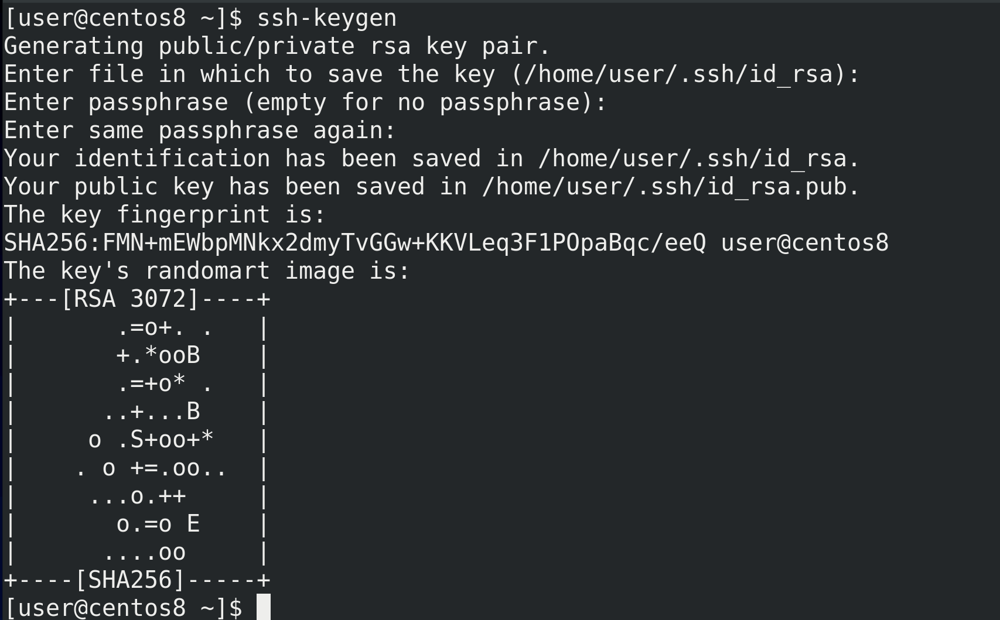

Для начала нужно сгенерировать ключи, это делается на стороне клиента, т.е. у администратора. Для генерации ключей используется команда ssh-keygen. По умолчанию ключи и в целом настройки клиента ssh хранятся в домашней директории пользователя, в скрытой директории .ssh. А ключи, по умолчанию, называются id_rsa. По хорошему, когда у нас много серверов, мы можем создать различные ключи и для подключения к разным серверам использовать разные ключи. Тут нажмём enter, чтобы использовать название по умолчанию. Дальше у нас спрашивается пароль для ключа. Так как ssh ключи позволяют заходить на сервера без пароля, они могут быть очень опасны, если попадут в руки злоумышленникам. Поэтому мы можем защитить приватные ключи паролем. При использовании ключа нам нужно будет вводить пароль от ключа, но, если у нас украдут этот ключ, без пароля хакеры ничего не сделают. Для нашего примера мы не будем использовать пароль, чтобы было нагляднее. Поэтому нажимаем два раза Enter и ключ создаётся. Мы видим, что создались два файла - id_rsa и id_rsa.pub - приватный и публичный ключ соответственно. Также внизу есть эдакая картинка, визуализирующая ключ. На самом деле это больше нужно для ключей хоста - вы можете настроить так, чтобы при подключении к серверам вы видели ключ хоста в таком виде. Если вдруг ключ хоста изменится или кто-то встанет посреди трафика, ключ будет другой и визуально вы сразу заметите разницу.

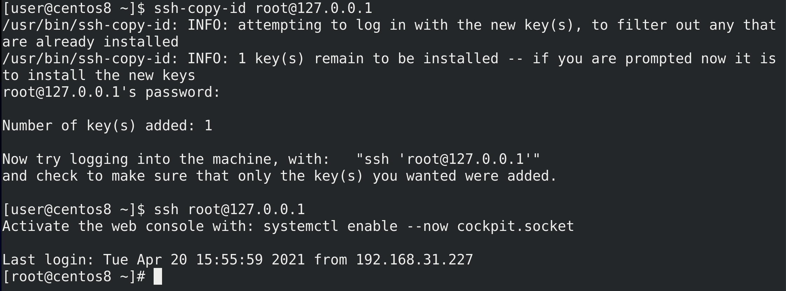

У нас есть ключи, теперь мы можем закинуть наш публичный ключ на какой-нибудь сервер и проверить. Используем эту же виртуалку и пользователя root. Самый простой способ закинуть ключ - команда ssh-copy-id - ssh-copy-id root@127.0.0.1. Если не использовать никакие опции, она найдёт дефолтный ключ id_rsa.pub и закинет его.  При этом, чтобы закинуть ключ, ssh подключается на этот сервер к пользователю, поэтому он попросит пароль пользователя. После чего добавит ключ и предложит нам проверить - ssh root@127.0.0.1. На этот раз никакого пароля не потребовалось, мы можем аутентифицироваться по ключу.

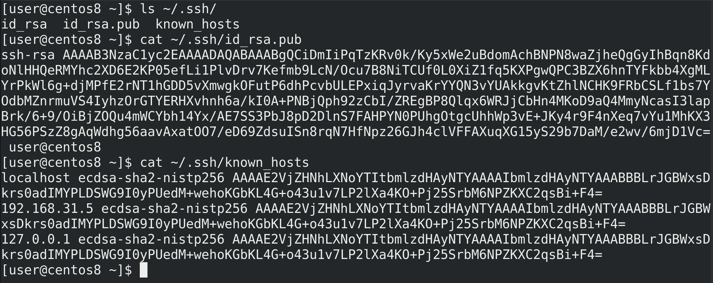

Посмотрим появившиеся файлы, для начала у клиента. В директории .ssh у нас 3 файла - два ключа и файл known_hosts -  ls ~/.ssh; cat ~/.ssh/id_rsa.pub; cat ~/.ssh/known.hosts. Ключи представляют из себя текстовые файлы с непонятным набором символов. А в файле known_hosts указаны адреса, к которым мы подключались, а также отпечатки их ключей. Именно по этому файлу наш клиент будет понимать, изменились ли у сервера ключи или нет.

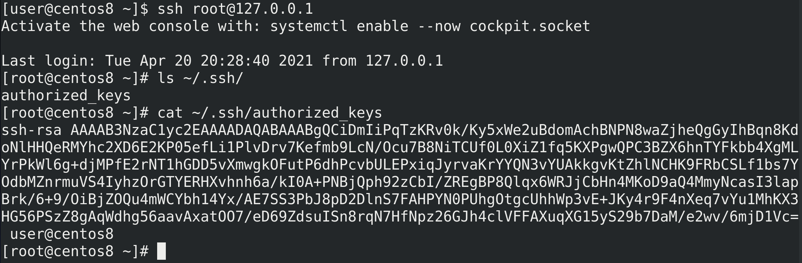

На сервере, в домашней директории пользователя, к которому я закинул ключ, также появилась директория .ssh с файлом authorized_keys - ssh root@127.0.0.1; ls ~/.ssh/; cat ~/.ssh/authorized_keys . В этот файл будут попадать публичные ключи пользователей, т.е. это результат команды ssh-copy-id. На самом деле, хоть и не понятно в терминале, в этом файле сейчас одна строчка с одним ключом. Этот тот же id_rsa.pub. Если кто-то ещё добавит ключ, то он будет на второй строчке, т.е. один ключ - одна строчка.

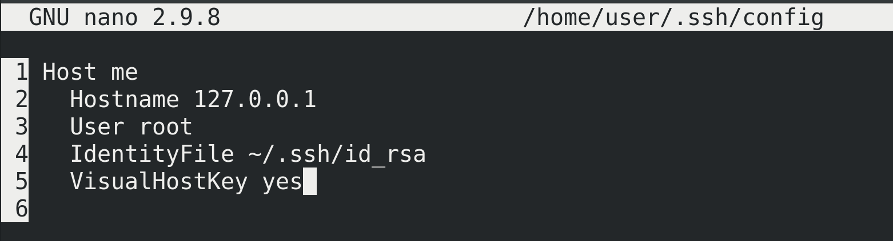

На стороне клиента мы можем настроить подключения в файле ~/.ssh/config - nano ~/.ssh/config. Например, можем дать подключению какое-нибудь понятное название, алиас, чтобы подключаться по нему, а не по ip адресу - Host me. После этого следует указать опцию Hostname с IP адресом, чтобы ssh знал, кто стоит за этим алиасом. Можем указать пользователя - User - чтобы не указывать его при каждом подключении. Если у нас несколько ключей, можем указать ключ, относящийся к этому хосту, чтобы не указывать его как опцию при подключении - IdentityFile. И добавим опцию VisualHostKey yes, чтобы при каждом подключении отображался ключ хоста. Сохраним и выйдем.

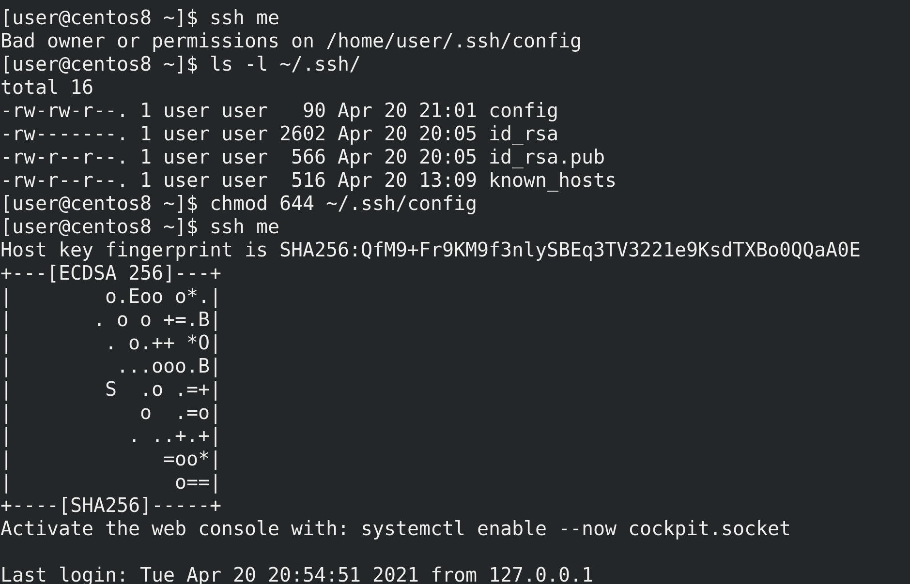

При попытке подключения - ssh me - мы увидим ошибку - Bad owner or permissions on /home/user/.ssh/config. Сейчас у файла config права 664, но для безопасности стоит выставить 644, чтобы никто из группы не смог изменить этот файл - chmod 644 ~/.ssh/config. Проверим ещё раз - ssh me. Как видите, соединение прошло, при этом мы видим ключ хоста.

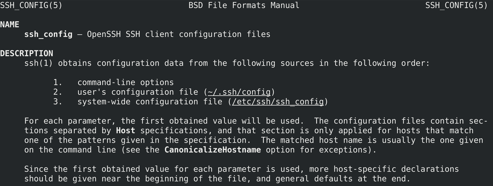

У ssh клиента есть множество опций - man ssh_config, которые мы можем указывать как в командной строке при подключении, так и в конфиг файле ~/.ssh/config. Если же мы хотим прописать общие настройки для всех пользователей, то можно использовать файл /etc/ssh/ssh_config.

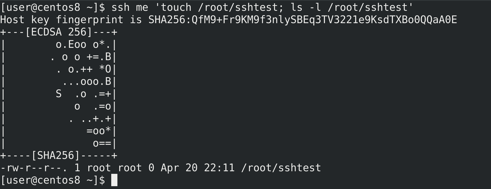

ssh позволяет не только запускать оболочку, но и сразу выполнять команды и выводить результат - ssh me 'touch /root/sshtest; ls -l /root/sshtest'. Т.е. я, не заходя на сервер, создал на нём файл и посмотрел вывод. Это и позволяет вам управлять серверами с помощью различных программ и скриптов.

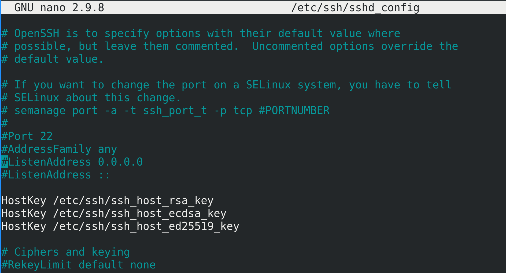

Хорошо, про работу и настройку клиента поговорили, теперь разберём ssh сервер. Основной конфиг файл - /etc/ssh/sshd_config - sudo nano /etc/ssh/sshd_config. Здесь у нас множество опций, но пока разберём основные. Одна из главных настроек - Port. 22 порт - стандартный для ssh и огромное количество ботов в интернете постоянно ищут компьютеры с открытым 22 портом и пытаются подобрать пароль, чтобы взломать. Даже если у вас будет хороший пароль, теоретически, у ssh могут существовать уязвимости, с помощью которых можно получить доступ к серверу. Поэтому, если ваш Linux сервер будет доступен из интернета или из недоверенной сети, нужно менять стандартный порт на нестандартный, четырёх или пятизначный, чтобы отсеять большинство ботов. Но сразу предупрежу, что порт 2222 также имеет большую популярность, поэтому придумайте что-нибудь оригинальнее, например, 7563.  Но пока я менять не буду, потому что подсистема безопасности SElinux не даст это сделать простым способом. Да, чуть выше есть подсказка, как решить проблему с SELinux, но я всё равно отложу это дело, пока мы не разберём SElinux.

* AddressFamily - семейство адресов - обычно речь идёт о сетях ipv4 и ipv6. Вы часто будете встречать подобную опцию, и она позволяет ограничить демон, чтобы он работал только с IPv4, только с IPv6 или с обеими сетями, как в нашем случае.
*	ListenAddress - говорит о том, на каких IP адресах будет работать этот демон. Если к серверу подключено несколько сетей, скажем, кабель от провайдера и локальная сеть, то мы можем настроить, чтобы SSH работал только на локальном IP адресе, т.е. тут указывается адрес этого сервера. В данном случае стоят нули - это означает, что сервер будет работать на всех своих адресах. А два двоеточия - тоже самое, но для IPv6 сетей.
*	HostKey - указаны ключи хоста. Именно по ним мы и понимаем, на нужный ли сервер мы подключаемся.
*	PermitRootLogin - говорит о том, разрешено ли пользователю root логиниться через ssh. Сейчас мы это можем, но так как пользователь root есть на всех серверах и многие боты пытаются подключиться именно им, в целях безопасности можно запретить пользователю root логиниться, либо разрешить это делать только с помощью пользовательских ключей - prohibit-password.
*	PubkeyAuthentication - разрешить логиниться по публичным ключам. В большинстве случаев так и должно быть.
*	PasswordAuthentication - разрешить логиниться по паролям. Для безопасности, чтобы никто не мог подобрать пароль, мы можем отключить эту опцию. Но, предварительно, стоит закинуть на сервер пользовательские ключи.
*	X11Forwarding - именно за счёт этой опции мы можем пробрасывать графику, чтобы запускать графические приложения через тот же MobaXTerm. В целом, проброс графики негативно сказывается на безопасности клиента, так как у сервера появляется доступ к вашему компьютеру. К примеру,  если на вашем сервере какая-то заражённая программа, которую вы запускаете через X11Forwarding, то пока она работает, она может следить за буфером обмена, вводом клавиатуры и т.п., даже если вы вводите данные в не в самом проброшенном приложении, а где-то в другой программе. Поэтому, в целом, не стоит злоупотреблять пробросом графики, особенно на недоверенных серверах.

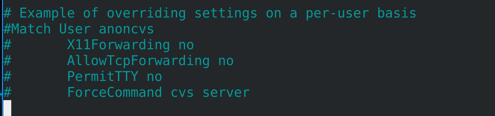

В самом низу конфига есть пример, как можно настроить определённые параметры для определённых пользователей, скажем, кому-то разрешить проброс графики, а кому-то нет. Или при подключении к ssh сразу выполнять какую-то программу, а не запускать bash.

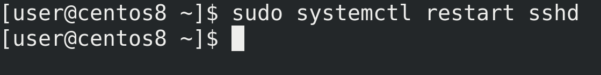

После проделанных изменений следует перезапустить сервис - sudo systemctl restart sshd, чтобы демон перечитал настройки.

Подведём  итоги. Мы с вами научились работать с SSH - это и протокол, который позволяет удалённо подключаться к Linux серверам, и утилита, с помощью которой это реализуется. Но кроме утилиты ssh есть и другие SSH клиенты, тот же PuTTY и MobaXTerm. Мы поговорили про настройки клиента, проброс графики, пользовательские ключи и запуск команд через ssh. Также немного рассмотрели настройки демона - порт, адрес и аутентификацию. Хотя и на стороне клиента, и на стороне сервера можно настроить огромное количество опций, зачастую SSH готов к работе из коробки, разве что стоит поменять порт и использовать ключи, а также не использовать простые пароли. На пока этих знаний достаточно, но к настройке SSH мы ещё не раз вернёмся.
