

Представьте себе, что вы находитесь в библиотеке. Полки - это ваш жёсткий диск, книги - это файлы, а вы - ядро операционной системы. Перед вами есть стол - это оперативная память. Ваша работа - читать книги. Только, как и в реальной жизни, вы не можете читать книгу целиком - вы читаете страницами. Когда вы берёте из полки книжку, вы копируете нужные страницы и кладёте их на стол.

Т.е. на столе у вас разложены страницы. И вы, как Цезарь, многозадачны, читаете множество книг одновременно. Когда стол большой, т.е. когда много оперативки - всё хорошо, вы можете разместить кучу страниц. Но большой стол стоит больших денег, поэтому обычно вы берёте средненький стол, рассчитанный под ваши задачи, ну и чтобы оставалось немного свободного места.

Есть определённые книжки, которые вам нужны не постоянно, но вы с ними работаете относительно часто. Скажем, вы читаете книжку, там много неизвестных терминов и вам периодически нужен словарь. Не то чтобы он нужен всегда на столе, но если у вас есть немного места, то почему бы временно не положить словарь на стол? Чтобы постоянно не тратить время на копирование словаря. А если понадобится место под другие книжки - ничего, уберёте словарь.

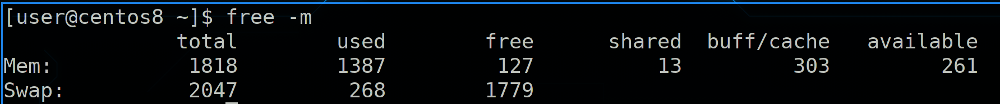

Если посмотреть вывод команды free -m, можно увидеть значение - столько-то места сейчас используется для буфера/кэша. Когда вы хотите прочесть файл с файловой системы, вы получаете блоки. Но в оперативке вы работаете не с блоками, а со страницами, т.е. вам нужно предварительно превратить содержимое блоков в страницы.

И вот этот переходный пункт, где вы блоки превращаете в страницы, а также записываете за какой страницей какой блок - называется буфером. Т.е. буфер содержит метаданные файловой системы и блоки, которые пишутся или считываются с диска. А в кэше хранятся уже страницы. И эти страницы нужны как для более быстрого чтения, так и для более производительной работы. Представьте, что вам нужно несколько раз прочесть одну и ту же страницу. Вместо того, чтобы каждый раз загружать её в память, вы её держите в оперативке и считываете её оттуда.

А касательно записи, представьте, что вам нужно что-то дописать в словаре. Если один раз - написали на листе, отнесли и добавили в книгу. А если вы часто что-то пишете? Вместо того, чтобы после каждой строчки относить и добавлять в книгу, вы можете подержать страницу пока на столе - а может ещё что-то понадобится дописать? Когда вы изменяете страницу в оперативке, у неё появляется метка, что она грязная - dirty page. И уже потом, скажем, раз в 5 секунд, вы относите грязные листы и добавляете в книги, т.е. сохраняете изменённые данные с оперативки на диск.

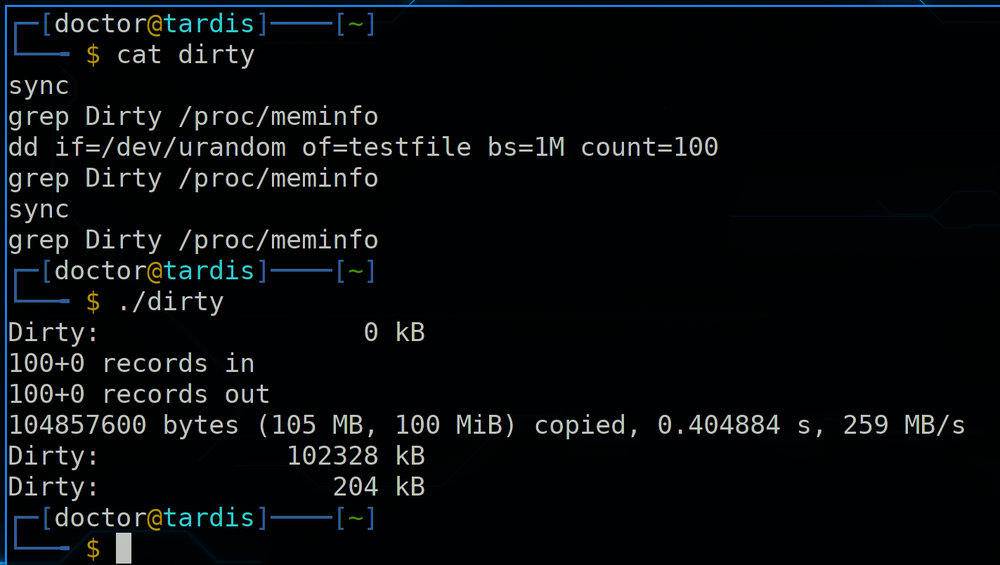

Т.е. данные не сразу пишутся на диск, а некоторое время хранятся в оперативке, в кэше. И чтобы вручную синхронизировать изменённые в оперативке данные с диском, надо выполнить команду sync. Размер грязных страниц можно посмотреть в /proc/meminfo - grep Dirty /proc/meminfo. И вот небольшой тест с созданием файла. Сначала делаем sync, чтобы убедиться, что все данные записаны на диск. Затем с помощью dd генерируем файл размером в 100 мегабайт. Сразу после этого смотрим размер грязных страниц - 100 мб. Это означает, что файл пока что в оперативке, а не на диске. Делаем sync и снова проверяем - теперь всё записалось на диск.

Такой режим кэша, когда данные сначала сохраняются в оперативке, а потом пишутся на диск, называется writeback. Но если вдруг компьютер потеряет питание и информация не успеет синхронизироваться, грязные страницы пропадут. Соответственно, есть риск потерять данные. Т.е. такой режим очень быстрый, но не самый надёжный. Также есть режим кэша writethrough - когда данные пишутся одновременно и на диск. Т.е. условно при каждом изменении страницы вы относите страницу в книгу на полку. Так всё работает чуть медленнее, зато при внезапном выключении вы ничего не теряете. Есть и другие режимы, но это два основных.

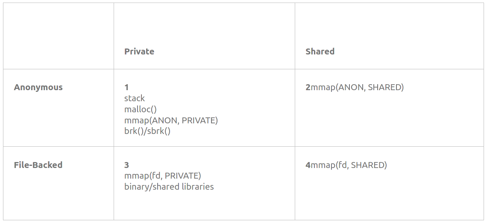

Память можно поделить на 4 типа по двум категориям. Она может быть личной и общей - т.е. доступна только для одного процесса или нескольких. А также может быть анонимной и основанной на файле, т.е. файловой. File-backed - это когда вы загружаете файл в оперативку - взяли книжку и положили листы на стол. А анонимная - это когда процесс просит вас выделить ему место, не привязанное к какому-либо файлу. Скажем, не книжку взять, а просто чистый A4 положить. Процесс там будет хранить какие-то данные во время работы. Таким образом получается 4 типа - anonymous private, anonymous shared, file-backed private и file-backed shared.

И теперь представим, что у вас на столе осталось мало места, а вам надо ещё добавить листов, т.е. мало оперативки осталось. Первым делом вы поищете листы, которые вам больше не нужны - т.е. освободите память, которую использовали завершённые процессы. Но этого может не хватить. Тогда в расход пойдут старые листы, которые как бы и нужны, но используются очень редко и основаны на книжках - т.е. файловые. Вы избавитесь от этих страниц, а если вдруг они потом понадобятся - то опять возьмёте их из книг, так как вы знаете, что это за файл. А вот от анонимных листов избавиться не получится. То что там написано - нет ни в одной книге. Поэтому выкидывать эти листы не вариант.

И тут вам на помощь приходят ящички стола. Туда вы можете сложить старые листы, которые сейчас на столе не нужны, а при необходимости оттуда достать. Это ваш swap - место на диске, выделенное для отгрузки редкоиспользуемых страниц с оперативки. Этот механизм, когда вы что-то кладёте в swap или достаёте оттуда называется подкачка страниц. В качестве места может быть как отдельный файл на файловой системе, так и целый раздел, в зависимости от этого место может называться файл подкачки или раздел подкачки.

Т.е. swap не выступает продолжением оперативки, он выступает временным хранилищем для редкоиспользуемых страниц. И не обязательно, чтобы он использовался только когда оперативки не хватает. Иногда полезней использовать оперативку для кэша, чем для редкоиспользуемых страниц.

Чтобы вся эта подкачка работала для программ прозрачно, чтобы разработчики сами не заботились о swap-е, ядро ОС выделяет процессам вместо реальной памяти виртуальную, которая может быть больше оперативки. Виртуальная память состоит из оперативки и swap-а.  Т.е. условно, книжка может предварительно попросить места под 100 листов на столе. И пусть у вас стол будет поменьше, но, если что, редкоиспользуемые страницы вы добавите в ящик.

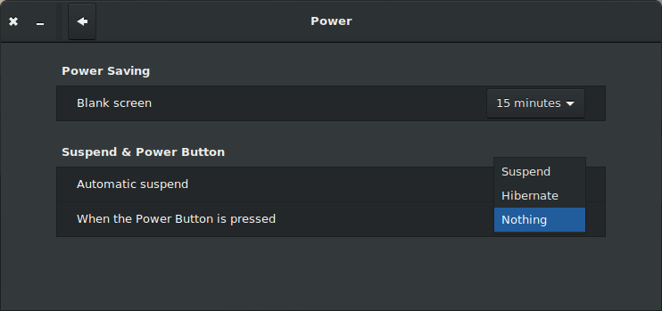

Также swap используется для гибернации. Это как спящий режим, только, если в спящем режиме у вас всё оборудование начинает меньше потреблять энергии, но всё ещё потребляет по чуть-чуть, то при гибернации все данные из оперативки сохраняются в swap-е, а компьютер полностью выключается, т.е. ничего не потребляет. А при запуске всё из swap-а возвращается в оперативку. Это позволяет больше сэкономить энергии, но запуск чуть дольше, чем при спящем режиме.

Пара популярных вопросов:
- нужен ли swap, если много оперативки?

Если большой излишек оперативки, т.е. много много оперативки не тратится - то можно обойтись и без swap-а. С другой стороны swap даже на таких системах может пригодится - будет чуть больше места для кэша.

- стоит ли делать swap на ssd?

С одной стороны, из-за скорости подкачка страниц будет быстрее, что увеличит производительность. С другой стороны, у ssd есть ограниченное число циклов перезаписи, и использование swap-а активно их расходует. Но, если у вас оперативки достаточно - подкачка будет происходить довольно редко. Ну и даже с относительно средним использованием, современные SSD проживут довольно долго, а их цена не такая кусачая. Точные сроки никто назвать не сможет, так как это индивидуально для конкретной системы и SSD.

- раздел подкачки или файл подкачки - что лучше?

Раньше из-за прослойки с файловой системой swap-файл был чуть помедленнее, но ядро после версии 2.6 работает с блоками swap-файла минуя файловую систему. С одной стороны пропала разница в производительности с разделом подкачки, с другой - нельзя просто взять и переместить файл подкачки на другую файловую систему, swap надо предварительно отключить. Но файл обычно легче увеличить, чем раздел, хотя если swap-раздел на LVM и есть свободное место - тоже несложно.

- сколько места выделять под swap?

Тут немного индивидуально - зависит от софта, который будет использоваться. Какие-то программы требуют больше swap-а, какие-то меньше. Но есть общие рекомендации - если у вас оперативки меньше 2 гигабайт - то под свап стоит выделить места в два раза больше, чем в оперативке. Если ещё и предполагаете использование гибернации - то в 3 раза больше. Ну и дальше по табличке.

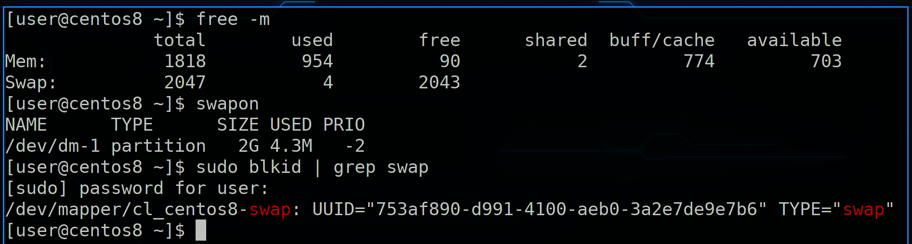

Хорошо, что такое swap и для чего он нужен мы разобрались. Насколько используется swap мы можем увидеть с помощью утилиты free, либо утилиты swapon. Как видно, у нас для swap-а используется отдельный раздел, а точнее lvm - sudo blkid | grep swap. Его размер - 2 гига, а используется небольшой процент. Кроме того видно, что у swap-а есть приоритет. Мы можем на одной системе сделать несколько swap разделов и файлов. Т.е. сначала будем складывать страницы в ящичек с высоким приоритетом, а если он забьётся - в ящик с приоритетом пониже. Скажем, мы можем выделить под swap место как на ssd, так и на жёстком диске. Также можно приоритет поставить одинаковым - тогда одновременно будут использоваться оба swap-а.

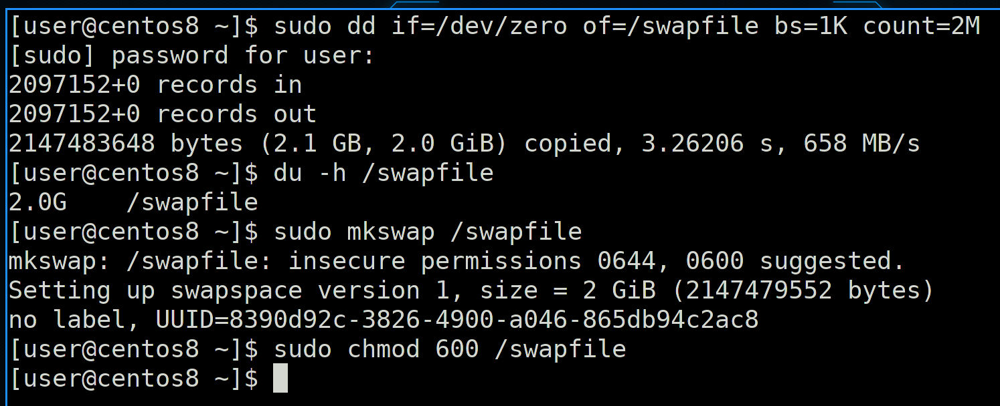

Попробуем добавить файл подкачки и перевести наш swap с раздела на файл. Для начала создадим файл размером в 2 гигабайта, для этого используем команду dd - dd if=/dev/zero of=/swapfile bs=1K count=2M. Здесь bs - размер блока - 1Килобайт; 2M - 2 миллиона. Т.е. 2 миллиона блоков по 1 килобайту - получается 2 гигабайта. Помните,  как после создания раздела мы записывали на него файловую систему - mkfs? Для swap-а мы делаем что-то похожее - sudo mkswap /swapfile. Был бы раздел - указали бы название раздела. Команда вывела нам предупреждение, что у файла не безопасные права - 644, и рекомендуется выставить 600. Что ж, сделаем - sudo chmod 600 /swapfile.

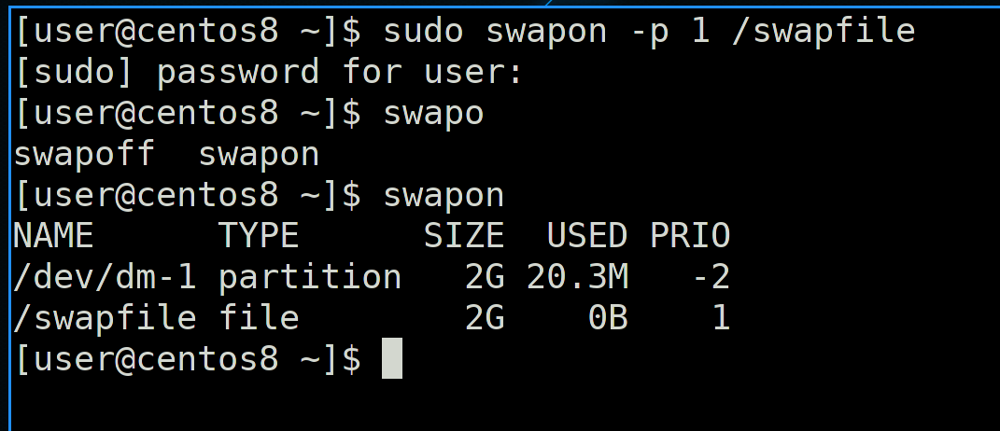

И дальше, по аналогии того, как мы монтировали файловую систему, мы должны активировать swap, заодно зададим ему приоритет повыше - sudo swapon -p 1 /swapfile. После этого посмотрим активные swap-ы - swapon. В списке появился наш файл.

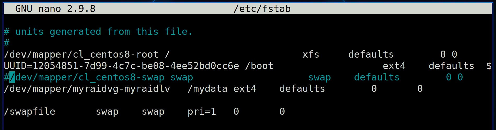

Но, как и с файловыми системами, чтобы swap работал после перезагрузки, надо его добавить в fstab - sudo nano /etc/fstab. Пропишем наш swap-file, а заодно закомментируем старый раздел.

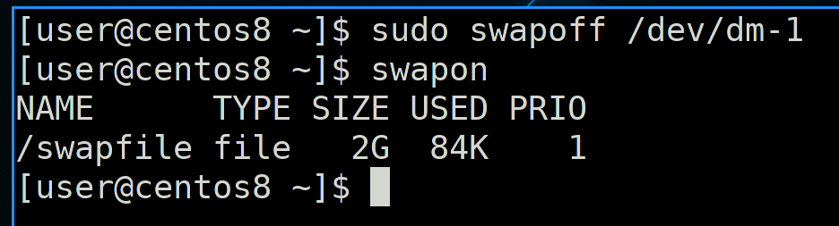

Чтобы без перезагрузки избавиться от swap раздела, используем команду swapoff - sudo swapoff /dev/dm-1; swapon. Таким образом мы убираем все страницы из раздела обратно в память или на другой swap.

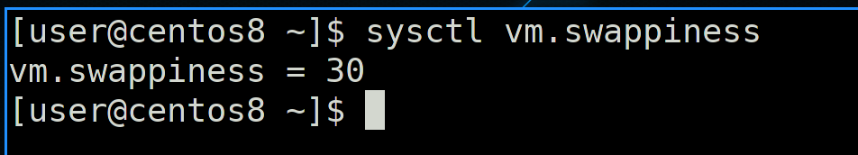

Также стоит упомянуть такой параметр, как swappiness - sysctl vm.swappiness. Этот параметр определяет, насколько сильно будет задействован swap. Тут значения от 0 до 100 - это баланс между кэшем и выгрузкой анонимных страниц. При низких значениях swap будет стараться держать анонимные страницы как можно дольше в памяти, при этом чаще выгружая кэш. Это может быть полезно, если программа сама управляет своим кэшем, а не отдаёт это ядру операционной системы. Например, так делают системы управления базами данных. Если же значение ближе к 100, то система агрессивнее будет заниматься подкачкой - перемещать анонимные страницы в swap и обратно. Это обычно системы, где программы сами не кэшируют, но кэш важнее. Например, частая работа с данными, при этом производительностью программ можно немного пожертвовать.  

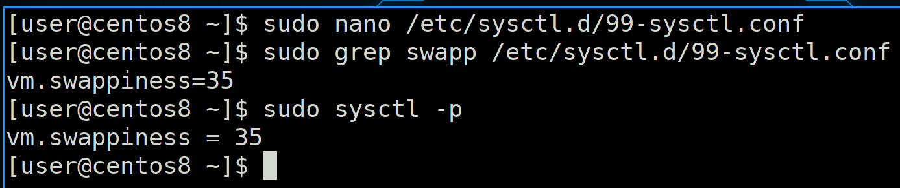

Если мы хотим поменять это значение и чтобы оно оставалось после перезагрузки, нужно создать файл или подредактировать существующий в директории /etc/sysctl.d/, прописав в нём vm.swappiness и нужное значение, после чего применить - sudo sysctl -p.

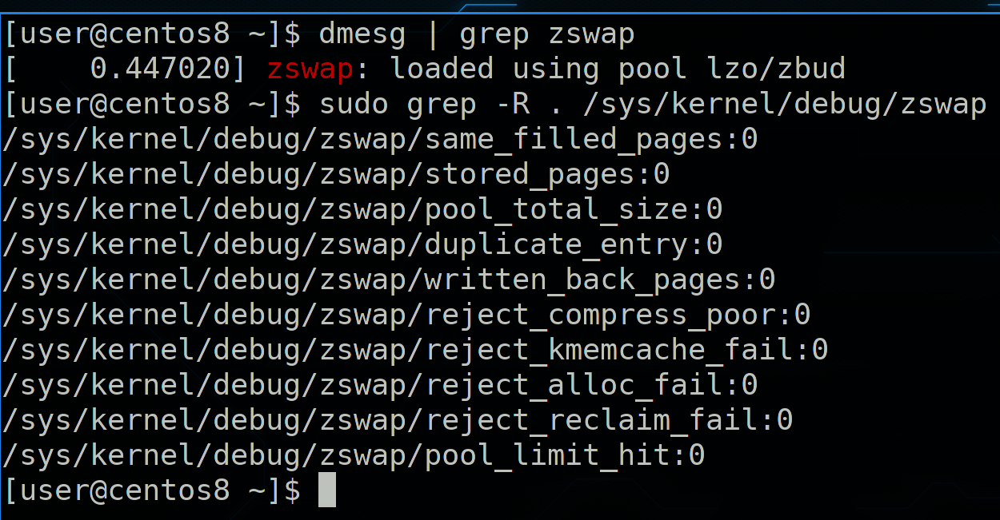

Также стоит упомянуть, что существует модуль ядра zswap. Он создаёт в оперативной памяти сжатую область, где и хранится swap. Это позволяет подкачке меньше использовать диск и работать быстрее. Но если места в оперативке нет - данные всё же выгружаются на swap, который на диске.

Подведём итоги. Сегодня мы с вами разобрали механизмы работы виртуальной памяти - что такое кэш, что такое грязные страницы, анонимные страницы, разобрались, зачем нужна подкачка, как она работает, как создавать раздел или файл подкачки и как это всё настраивать. Со swap-ом работают относительно редко - один раз настраивается во время установки системы, а больше делать ничего и не надо. Поэтому очень важно сразу всё настроить правильно.
