

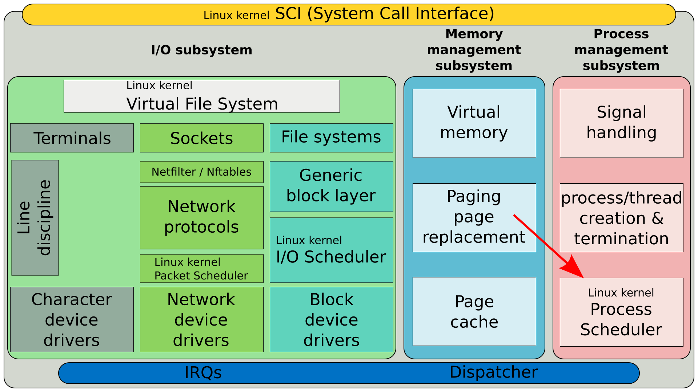

В первой теме мы с вами обсуждали, что одной из главных причин появления операционных систем является необходимость в разделении времени - time sharing. И одна из главных функций ядра операционной системы - планировщик процессов, который и решает, когда и какой процесс должен быть обработан процессором.  

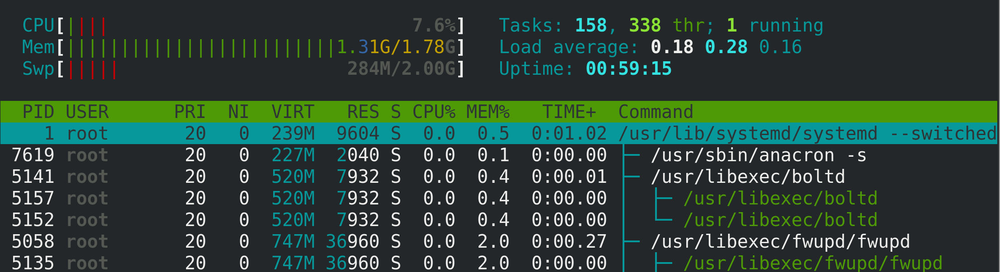

С планировщиком, который в текущей реализации называется "Полностью честный планировщик" - мы уже взаимодействовали, когда задавали процессам вежливость. Чем вежливее процесс, тем меньше процессорных ресурсов ему в итоге достаётся. Т.е. это функционал планировщика. Так вот, вежливость  влияет на приоритет процесса. Но сразу стоит упомянуть, что не всех процессов. Для нормальных процессов приоритет имеет значение:

```
PR = NI + 20
```

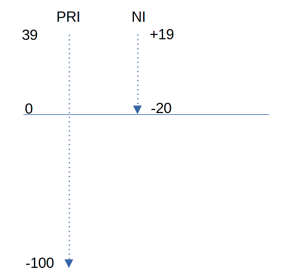

Мы помним, что niceness задаётся от -20 до 19, т.е. имеет 40 значений. Приоритет же имеет значения от -100 до 39, притом, от 0 до 39 - это те приоритеты, которые мы обычно видим и можем задать с помощью nice. Чем ниже значение, тем больше приоритет. То что ниже 0 - выделено для более важных процессов, которые нельзя ставить в один ряд с пользовательскими процессами.

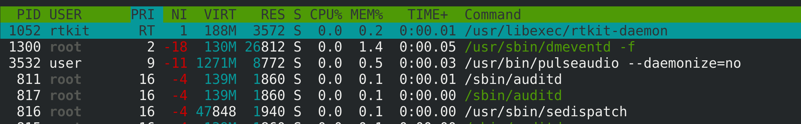

Например, миллисекундные зависания браузера могут быть неощутимы, а те же миллисекунды в звуке будут гораздо неприятнее. Как бы не была важна пользовательская программа, есть процессы, приоритет которых должен быть выше, т.е. ближе к нулю. top для таких процессов показывает значение RT - real time.

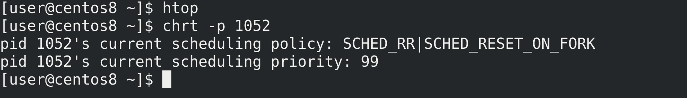

С помощью утилиты chrt мы можем посмотреть rt приоритет таких процессов - chrt -p 1052. Как видите, текущее значение - 99. Но rt приоритет не тоже самое, что обычный приоритет. Чтобы узнать итоговый приоритет, надо от -1 отнять rt значение:

```
PRI = -1 - rt_prior
```


Т.е. в таком случае высокое значение rt приоритета равно низкому значению самого приоритета. А чем ниже значение приоритета, тем сам приоритет выше. Т.е. процесс с rt приоритетом 99 имеет наивысший приоритет - -100.

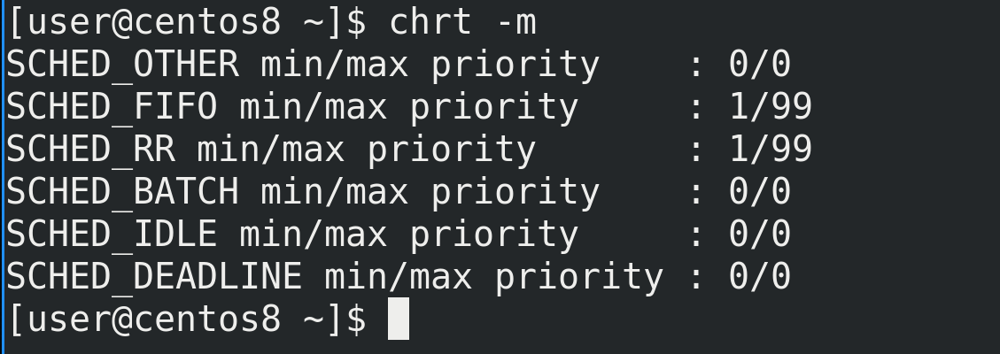

Но планировщик в ядре распределяет процессор не только по приоритету, но и по политике. Список политик можно увидеть с помощью ключа -m - chrt -m. Все процессы подчиняются каким-то политикам. На самом деле приоритет относится не к процессам, а к их потокам, но чтобы было легче всё это воспринимать, будем считать, что один процесс - это один поток.


Представьте это как фейс контроль в какой-нибудь клуб, только в клубе можно находить не постоянно, а зайти на время, потанцевать, после чего выйти и опять встать в очередь. Бугай на входе - планировщик - берёт какое-то время, допустим, час и делит на количество ожидающих, допустим, 10. Таким образом каждый в час может потанцевать 6 минут. Но тем, у кого приоритет выше, достаётся больше времени и они танцуют 8 минут. А более вежливые танцуют 2-3 минуты. Это касается нормальных процессов и для них обычно используется политика SCHED_OTHER.   

Но есть VIP персоны "RT" - и они не стоят в общей очереди, охранник пропускает их раньше всех. Но и самих VIP персон может быть несколько и они в том числе могут разниться. Скажем, есть музыканты, а есть известные личности. Музыкантов пускают по одной политике, а известных личностей по другой. Так или иначе, и те и другие важнее обычных людей и их пропускают первыми. Но и среди музыкантов, и среди известных личностей есть rt приоритет.

 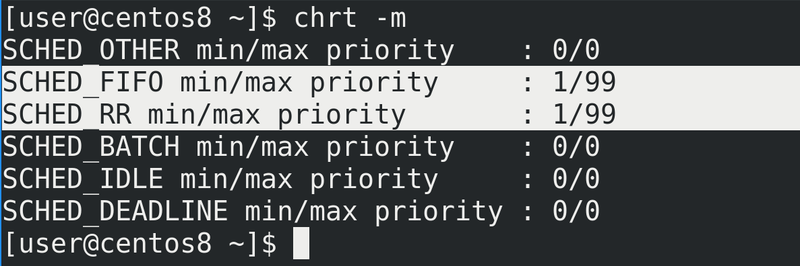

Так вот, есть две политики для rt приоритетов:
- FIFO - first in first out
- RR - round robin

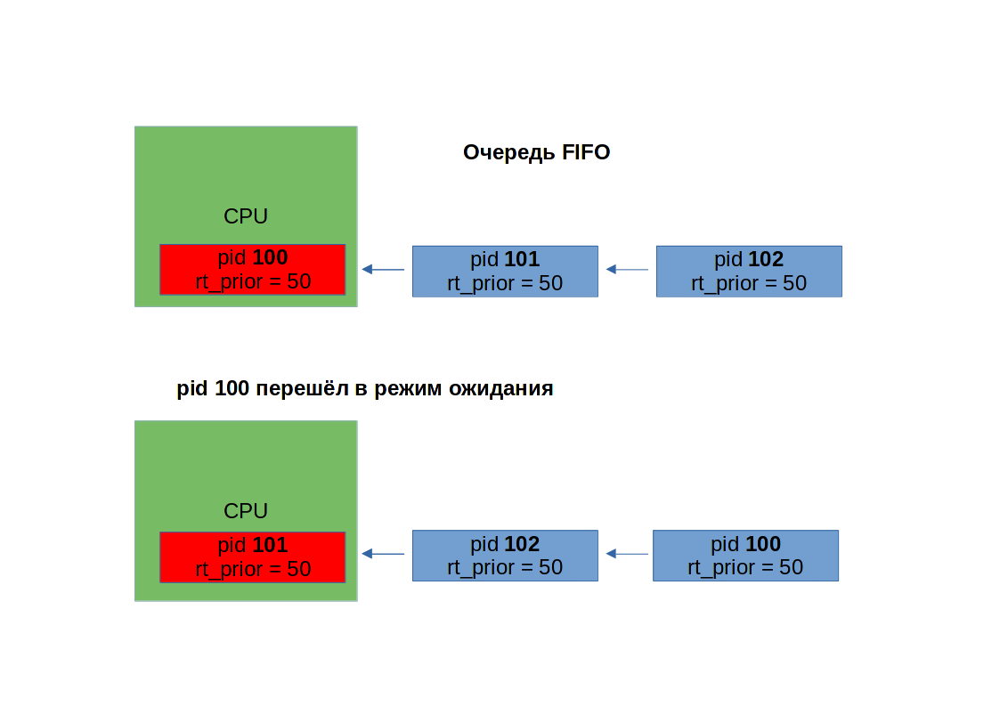

В случае с FIFO процесс будет работать, пока не остановится, скажем, в ожидании данных. В таком случае остановленный процесс помещается в конец списка таких же процессов с тем же приоритетом. Скажем, у вас есть 3 процесса - 100, 101, 102 с одинаковым rt приоритетом 50. Сотый запустился первым, поработал, остановился и стал третьим в списке rt процессов с приоритетом 50, т.е. теперь в очереди 101, 102 и 100.

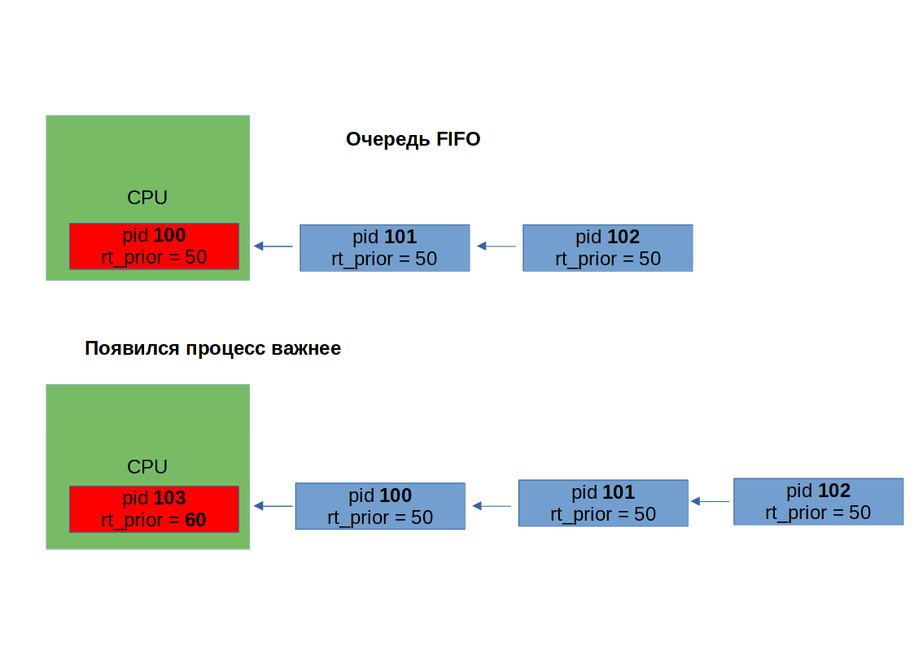

Однако если появляется процесс с rt приоритетом выше, допустим, 103, то 100-ый процесс перемещается в начало списка ожидающих, пока 103 работает.


В случае с round robin всё тоже самое, разве что процессам теперь время ограничено и они работают не сколько хотят, а только промежуток времени, после чего идут в конец очереди.

Есть и другие политики, и много всяких нюансов, но вдаваться в такие дебри пока не стоит. Достаточно в целом  иметь представление, как это работает.


Так вот, утилита chrt позволяет менять политику для процесса и выставлять приоритет. Для примера возьмём процесс bash-а - ps -ef | grep bash. С помощью chrt поменяем ему политику на FIFO и зададим rt приоритет 50 - ```sudo chrt -f  -p 50 7255```; chrt -p 7255. Как видите, политика теперь FIFO и выставился нужный rt приоритет. В htop видно, что общий приоритет - -51, это потому что от -1 отнимаем 50. А также видно, что у дочернего процесса - htop - приоритет унаследовался, тоже -51.

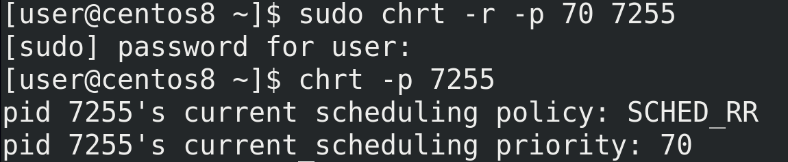

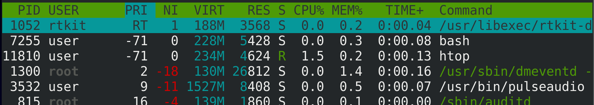

Теперь поменяем политику на Round Robin и выставим приоритет 70 - ```sudo chrt -r -p 70 7255```; sudo chrt -p 7255; htop. Таким образом у нас политика round robin и приоритет -71.


Ну и вернём обратно политику OTHER. Так как тут нет rt приоритета, значение -p - 0 - ```sudo chrt -o -p 0 7255```; sudo chrt -p 7255.

Насколько это часто используется в повседневной работе? Очень редко. Но в определённых случаях - при больших нагрузках - это позволит вам повысить приоритет важных для вас процессов куда больше, чем это делает nice. Но и в целом это полезно знать, чтобы лучше понимать работу операционной системы.
