


Диски и файловые системы - одна из важнейших тем, к которой мы возвращаемся уже не раз. Стандартные разделы, рейд, лвм, файловые системы - с одной стороны нужно всё это знать и уметь с этим работать. С другой стороны это добавляет слои абстракции, появляется куча утилит, с которыми нужно уметь обращаться и даже какие-то простые задачи становятся гораздо комплекснее, не говоря уже о нетривиальных проблемах. А цена ошибки может быть слишком высокой.

Так как все эти инструменты зачастую используются вместе и нужны для решения одной цели, это в итоге должно было привести к появлению единого решения. Подобные решения уже есть, к примеру, btrfs или zfs, но по определённым причинам Red Hat не берётся внедрять их. Вместо них компания работает над другим проектом - stratis. Сразу отмечу, что проект пока в разработке и доступен для тестирования, но применять его в рабочей среде пока не стоит.

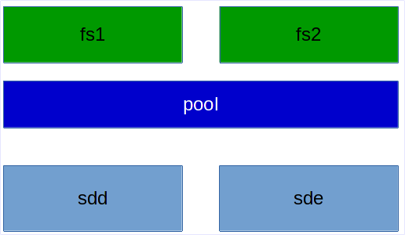

stratis сейчас напоминает упрощённую смесь LVM и mkfs. Очень грубо говоря, с помощью него вы объединяете диски в группы, называемые pool, и создаёте на них файловые системы.


Вкратце о функционале:
- нет raid-а, т.е. отказоустойчивости. stratis можно поднять и поверх рейда, как мы это делали с LVM. Но в будущем, скорее всего, добавят такой функционал.
- есть снапшоты, но, в отличии от LVM, здесь они являются просто полной копией файловой системы с другим UUID-ом.    

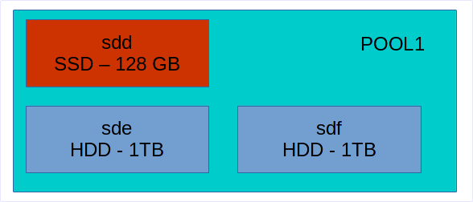

- есть tiering. Очень грубо говоря, это такая технология, когда берут несколько дисков hdd и ssd, объединяют их в одну группу - один pool, и ssd используют в качестве кэша. Т.е. когда вы будете что-то писать в этот пул, сначала данные будут писаться на ssd, что ускорит скорость записи, а потом в фоне переноситься на жёсткие диски, где больше места. На самом деле tiering чуть более сложнее и у разных производителей это понятие может отличаться, но в такие детали мы пока вдаваться не будем.

- есть шифрование - можно создавать зашифрованные пулы.

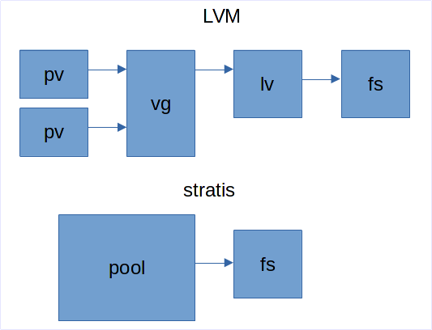

- есть thin provisioning. И тут таится главное отличие от LVM. Нет, в LVM тоже есть thin provisioning, но тут это сделано несколько иначе.

Когда вы работаете с LVM, вы создаёте физические тома, создаёте из них группу томов, в этой группе создаёте логический том и на нём файловую систему. При создании логического тома вы указываете его размер и файловая система внутри будет того же объёма.   

Когда же вы работаете со stratis, вы просто создаёте pool и внутри создаёте файловую систему. Вам нигде не нужно указывать размер. Файловая система автоматом создаётся на 1 ТБ, но она этот объём не занимает. Занимается только то пространство, которое занято реальными данными. При этом, stratis следит за объёмом, и, если файловая система заполняется, то он автоматом увеличивает её. Если, конечно, есть место в пуле.

С одной стороны это удобно - про ручное увеличение логического тома и файловой системы можно забыть. С другой стороны, в stratis используется только xfs, а значит уменьшить файловую систему не получится. Тут очень важно следить за тем, чтобы всегда в пуле оставалось пространство и вовремя добавлять новые диски, иначе с файловой системой могут возникнуть проблемы.


И так, прежде чем продолжим, давайте с помощью виртуалбокса добавим в систему два новых диска, по 1 ГБ. В системе ещё есть 3 диска, первый для системы и два у нас были выделены под raid.

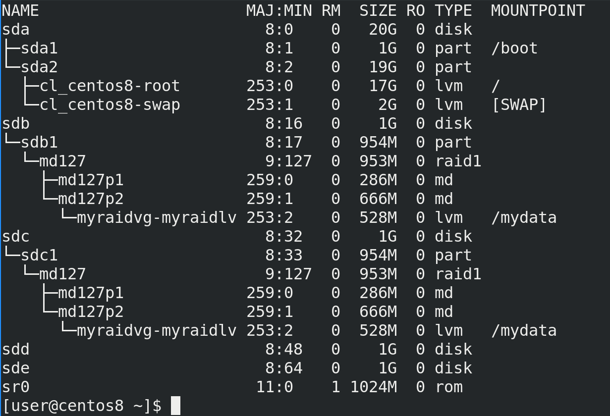

После запуска системы посмотрим lsblk - здесь мы видим, что на sdb1 и sdc1 у нас raid, а поверх рейда стоит lvm. Ну и два новых пустых диска - sdd и sde.

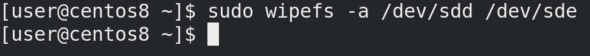

Если бы на этих дисках раньше были какие-то данные, какая-то файловая система, лвм и прочее, то предварительно следовало это всё удалить, а потом сделать wipefs:

```bash
sudo wipefs -a /dev/sdd /dev/sde
```

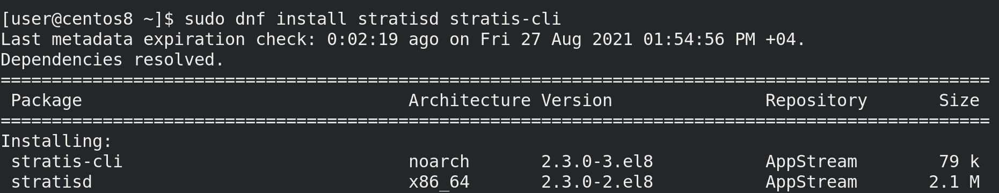

Также нам нужно установить демон stratisd и утилиту для работу с ним.

```bash
sudo dnf install stratisd stratis-cli
```

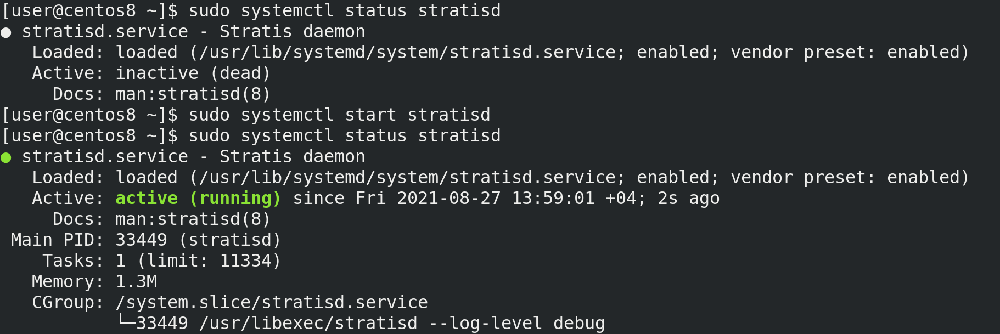

После установки стоит убедиться, что сервис stratisd включён, он должен автоматом запускаться при включении компьютера:

```bash
systemctl status stratisd
```

Как видно, сервис включён, но в данный момент не запущен. Давайте запустим его и убедимся, что он работает:

```bash
sudo systemctl start stratisd
sudo systemctl status stratisd
```

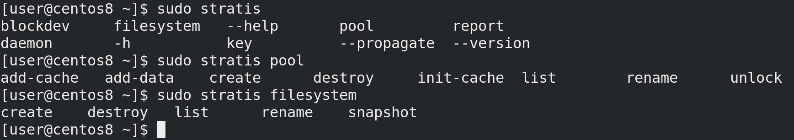

Основная утилита - stratis. Опций немного и основные это startis pool и stratis filesystem - с помощью них можно смотреть и управлять пулами и файловыми системами.

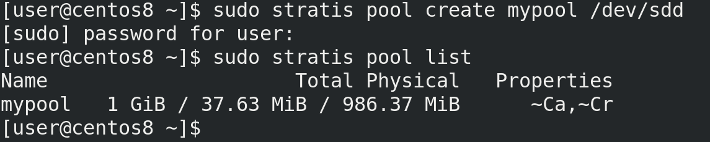

Для начала надо создать pool - create - указываем название и диски, которые входят в pool. Пока что добавим только один диск:

```bash
sudo stratis pool create mypool /dev/sdd
```

Команда завершилась без ошибок. Пулов может быть несколько, посмотрим их список:

```bash
sudo stratis pool list
```

И здесь мы видим созданный нами пул. Во втором столбце мы видим общий объём, занятый и свободный. В Properties мы видим ~Ca и ~Cr. Ca означает, что в пуле есть кэш, Cr - что пул зашифрован, а тильда перед ними означает "нет". Т.е. в нашем пуле нет кэш диска и нет шифрования.

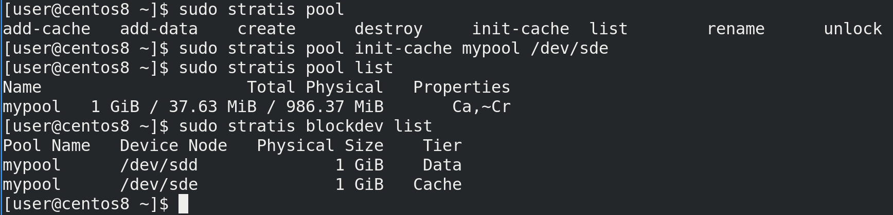

Давайте второй диск подключим как кэш. У опции pool есть несколько ключей:
- add-cache - добавляет кэш диск. Но она сработает, только если у нас уже есть кэш.
- add-data - добавляет обычный диск, т.е. расширяет пул, как vgextend.
- init-cache - создаёт кэш. Как раз этот ключ нам сейчас нужен.

Указываем его, наш пул и условный ssd диск.

```bash
sudo stratis pool init-cache mypool /dev/sde
```

Команда завершилась без ошибок, а значит можем посмотреть список пулов. Как вы заметили, теперь перед Ca пропала тильда. И, как видно, пространство не увеличилось, так как весь второй диск используется в качестве кэша, а не для постоянного хранения.

```bash
sudo stratis pool list
```

Список устройств и к каким пулам они относятся можно увидеть с помощью опции blockdev. Здесь видно, что sdd используется для данных, а sde для кэша.

```bash
sudo stratis blockdev list
```

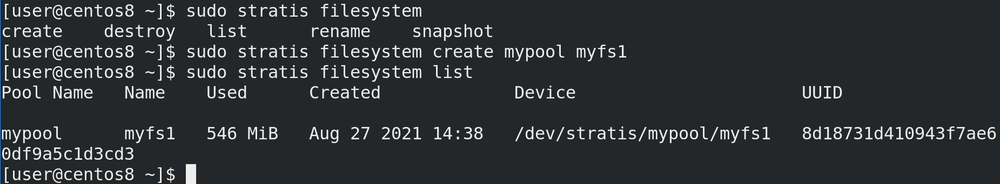

Теперь создадим файловую систему. Для этого используется опция filesystem с ключом create, указанием пула и названия файловой системы.

```bash
sudo stratis filesystem create mypool myfs1
```

А чтобы посмотреть список файловых систем - list:

```bash
sudo stratis filesystem list
```

Как видно, у нас есть файловая система, путь к ней - /dev/stratis/mypool/myfs1, а использовано уже где-то 500 мегабайт. Это всё выделено под метаданные, но почему так много?

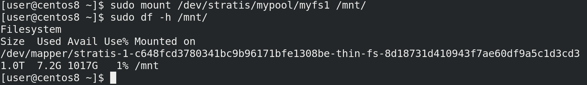

Давайте примонтируем и проверим.

```bash
sudo mount /dev/stratis/mypool/myfs1 /mnt
df -h /mnt
```

Как видно из вывода df, и, как я говорил ранее, настоящий размер файловой системы 1 ТБ, но из-за thin provisioning-а мы тратим только используемое пространство - 500 мегабайт. Как мы помним из темы о файловых системах, на каждый промежуток пространства создаются иноды прочая информация о файловой системе и её структуре, вследствие чего на 1 ТБ для такой информации пришлось потратить 500 МБ. И то, как видно, это 7.2 гигабайта, но так как эти данные пока пустые, мы потратили поменьше.


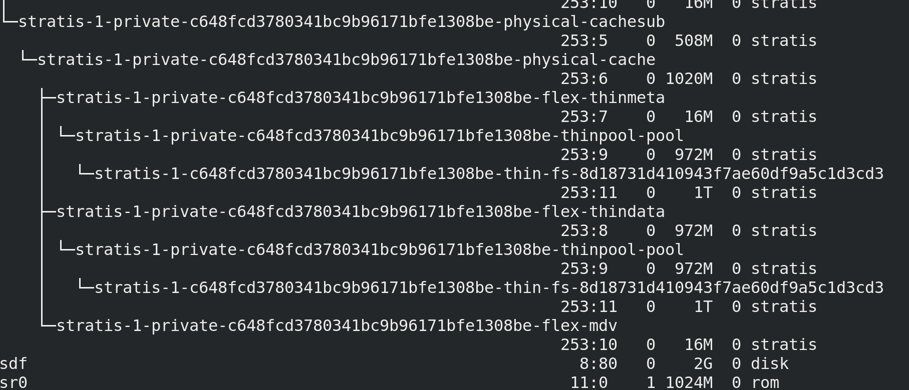

Так как места осталось довольно мало, давайте добавим ещё один диск на 2 ГБ, правда для этого надо будет выключить виртуалку. После чего проверим новый диск - lsblk. Как видите, после stratis здесь сплошная каша, но можно заметить новый диск - sdf.

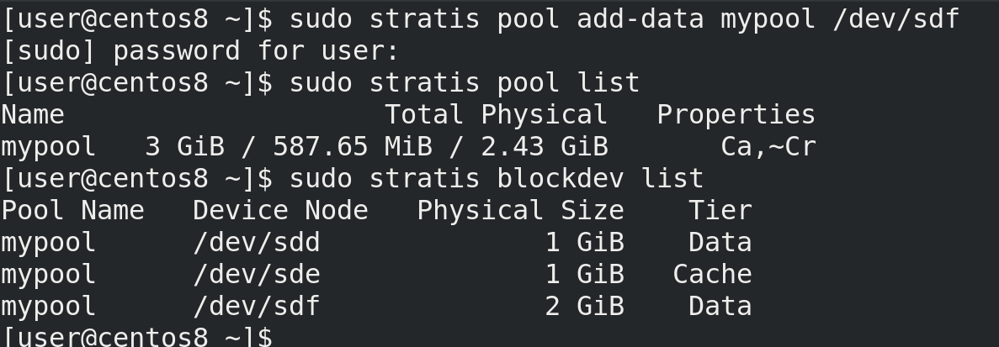

Добавим новый диск в существующий пул, используя ключ add-data:

```bash
sudo stratis pool add-data mypool /dev/sdf
```

Теперь проверим наш пул и список устройств:

```bash
sudo stratis pool list
sudo stratis blockdev list
```

Как видно, на этот раз размер пула увеличился и теперь в нём 2 data диска и один кэш диск.

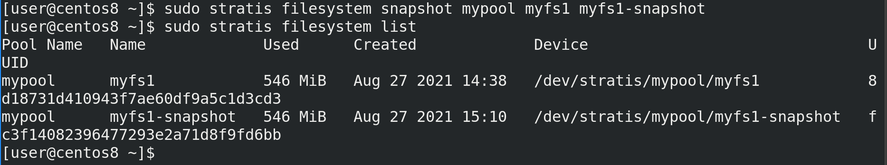

И теперь мы можем создать снапшот этой файловой системы, используя ключ snapshot и указав пул, название файловой системы и название снапшота:

```bash
sudo stratis filesystem snaphost mypool myfs1 myfs1-snaphost
```

Снапшот не стоит создавать на примонтированной файловой системе, ну или по крайней мере нужно убедиться, что сейчас ничего не пишется на неё. Как я говорил, в случае со stratis снапшот это просто копия файловой системы, поэтому его можно увидеть с помощью filesystem list.

```bash
sudo stratis filesystem list
```

Его можно отдельно примонтировать, ну и в целом обращаться как с обычной файловой системой. Ну и чтобы вернуться к данному снапшоту, можно просто примонтировать её вместо оригинала.

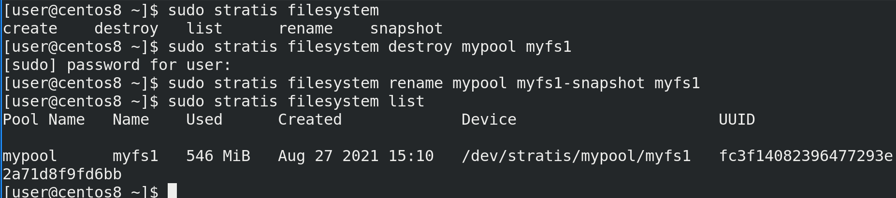

Ну и если мы решили вернуть снапшот, можно просто удалить старую файловую систему с помощью destroy, переименовать снапшот с помощью rename и считайте что мы восстановили снапшот.

```bash
sudo stratis filesystem destroy mypool myfs1
sudo stratis filesystem rename mypool myfs1-snaphost myfs1
sudo stratis filesystem list
```

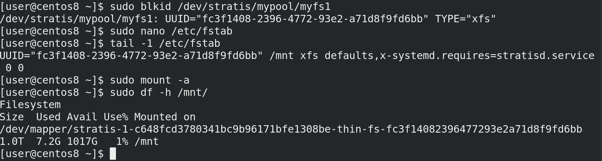

Чтобы файловая система монтировалась при каждом включении, добавим её в fstab. Но предварительно стоит узнать её UUID:

```bash
sudo blkid /dev/stratis/mypool/myfs1
```

После чего этот UUID надо прописать в fstab:

```
UUID="fc3f1408-2396-4772-93e2-a71d8f9fd6bb" /mnt xfs defaults,x-systemd.requires=stratisd.service 0 0
```

Обратите внимание, что указывается тип файловой системы - xfs, а в опциях монтирования стоит указать сервис stratisd. Мы такую же опцию использовали для VDO.

Ну и чтобы убедиться, что файловая система монтируется, используем mount -a

```bash
sudo mount -a
sudo df -h /mnt
```

Давайте подведём итоги. Ещё раз напомню, что stratis использовать в рабочей среде не стоит, он пока не прошёл проверку временем, а новый функционал, который постоянно добавляется, может всё сломать. Но цель этой темы в том, чтобы показать, что нас ждёт в будущем - возможно, лет через 5 этот инструмент обрастёт функционалом и начнёт набирать популярность. Основной урок, который можно вынести - всё идёт к упрощению. Многие задачи, такие как задание и изменение размеров логических томов и файловых систем, могут быть автоматизированы. Вам нужна файловая система - и вы её создаёте одной понятной командой. Всем остальным будет управлять система, единственное, что остаётся за вами - следить, чтобы в пуле было достаточно места, и, если что, добавлять новые диски. Но это не значит, что в ближайшем будущем стандартные разделы или LVM потеряют актуальность.
