

#### Прекращение поддержки CentOS

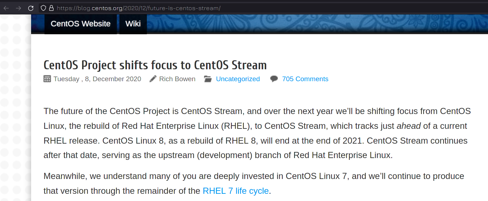

50 тем назад мы с вами установили CentOS. Тогда это был один из самых распространённых бесплатных дистрибутивов, во многом благодаря тому, что он был копией дистрибутива Red Hat Enterprise Linux. Сам RHEL не отличался функционалом, но из-за подписки на поддержку и доступа к репозиториям стоил денег и не был доступен для бесплатного использования. Компания Red Hat поддерживала проект CentOS, но в конце 2020 [объявила](https://blog.centos.org/2020/12/future-is-centos-stream/) о прекращении поддержки CentOS Linux и смещения фокуса на CentOS Stream. CentOS 8 будет поддерживаться до конца 2021, а 7 версия до середины 2024.

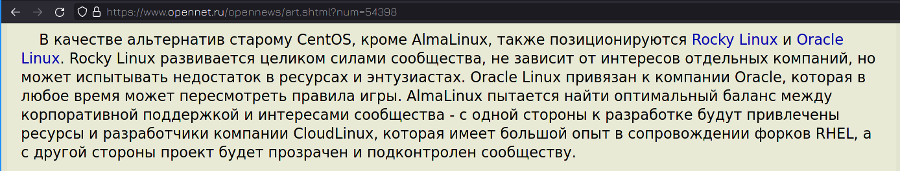

В связи с этим несколько компаний [объявили](https://www.tecmint.com/centos-alternative-distributions/) о выпуске своих дистрибутивов на замену CentOS, которые также будут копировать RHEL. Т.е. функционально эти дистрибутивы отличаться не будут, но могут быть отличия в частоте обновлений, количестве пользователей и прочих административных моментах. Второе, со временем, может привести к тому, что какие-то из этих дистрибутивов также прекратят поддерживаться.


При этом сам Red Hat [объявил](https://developers.redhat.com/terms-and-conditions), что теперь индивидуальные пользователи могут бесплатно использовать 16 копий RHEL на виртуалках или физических машинах, для тестирования или небольших рабочих задач, но, опять же, только для индвидуального использования. При этом не будет поддержки, но доступ к репозиториям останется.

Для продолжения курса вы можете выбрать любой из дистрибутивов, вышедших на замену. Свой выбор я остановил на RHEL и на это есть несколько причин. Во-первых, я хочу, чтобы этот курс помог вам с работой. Немало компаний используют бесплатные дистрибутивы, но если говорить о крупных компаниях - они предпочитают дистрибутивы с коммерческой поддержкой. И здесь Red Hat лидер. Хотя RHEL почти во всём идентичен с его бесплатными альтернативами, небольшие отличия всё же есть. И поэтому ваш опыт работы с RHEL может оказаться немножко предпочтительнее для работодателя. Во-вторых, и это куда важнее, у Red Hat есть много других продуктов, которые очень часто используются в крупных компаниях. И эти продукты можно установить только на RHEL. А их знание может сильно помочь вам в трудоустройстве в хорошую компанию. Поэтому в дальнейшем я планирую с вами разобрать хотя бы часть этих продуктов.

И так, зачем вообще мы взялись ставить систему?  Для некоторых следующих тем нам нужна ещё одна виртуалка. Почему не скопировать существующую? В прошлый раз, когда мы устанавливали систему, мы ничего о ней не знали, поэтому делали это вслепую. Сейчас же, набравшись знаний, мы можем куда детальнее разобрать этот процесс.

#### Как скачать?

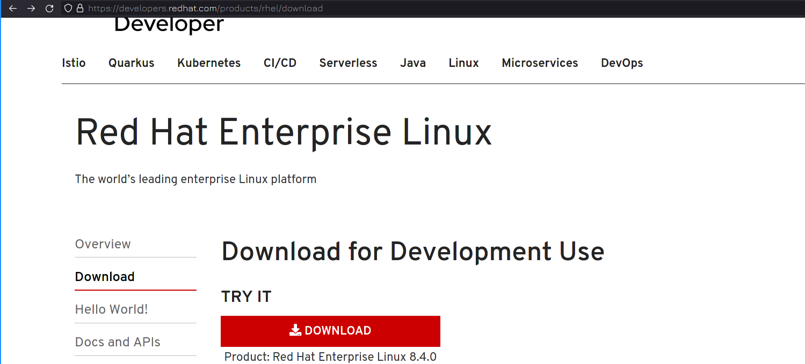

Для начала надо скачать ISO образ. Заходим по [ссылке](https://developers.redhat.com/products/rhel/download) на сайт и нажимаем Download.

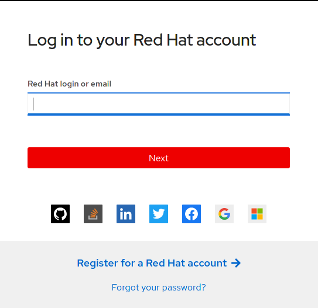

Так как аккаунта у нас пока нет, нажимаем Register.


Вводим наши данные и нажимаем Next.

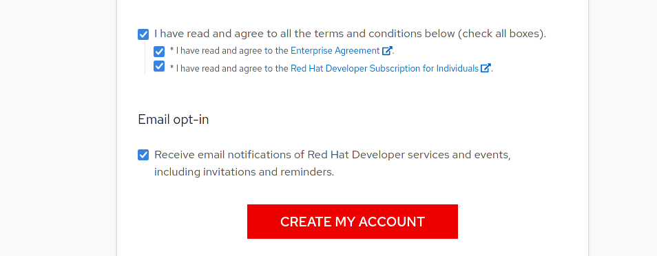

И опять вводим данные и нажимаем "Create My Account".

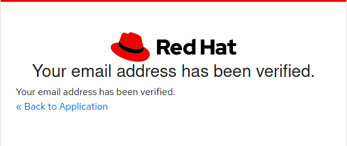

Подтверждаем email...

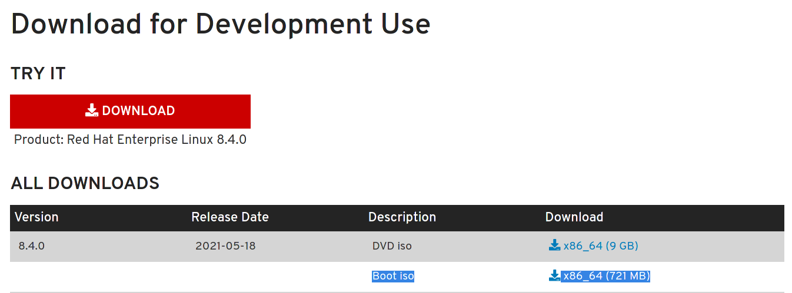

После чего возвращаемся на [ссылку](https://developers.redhat.com/products/rhel/download) скачки уже залогиненные. На этот раз скачаем Boot iso. Этот образ установщика весит мало, но всё необходимое ставит из интернета. Так как в дальнейшем мы будем работать с минимальной системой, этого нам вполне хватит.

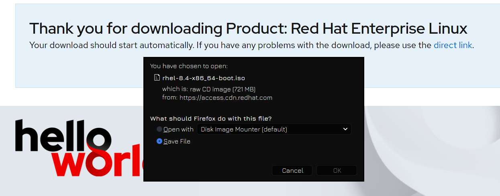

Теперь ждём, пока скачается.

#### Подготовка VirtualBox

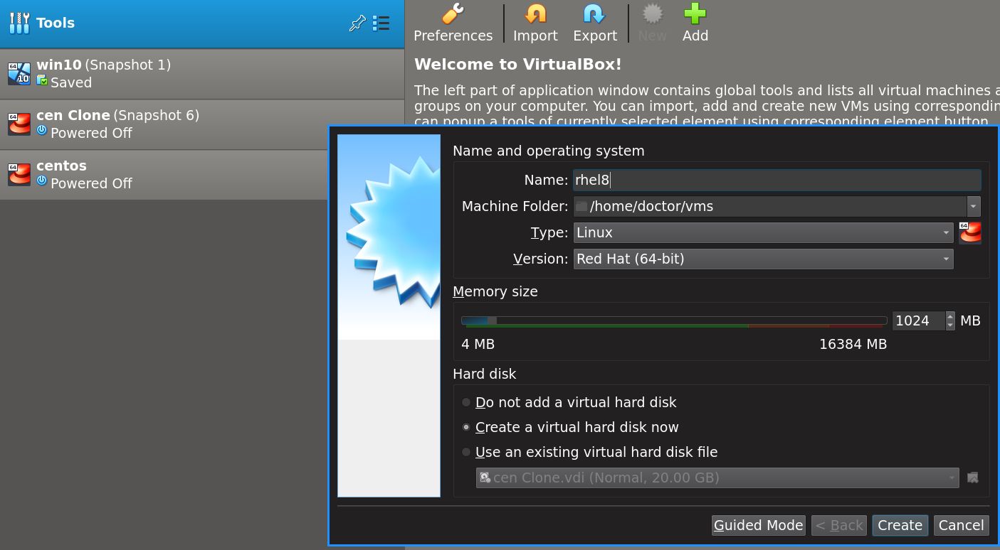

Запускаем VirtualBox, нажимаем New, чтобы создать виртуальную машину и пишем rhel8. При этом автоматом прописывается тип системы и его версия. 1 гигабайта оперативки нам вполне хватит. Также оставляем галочку на создании нового виртуального диска.

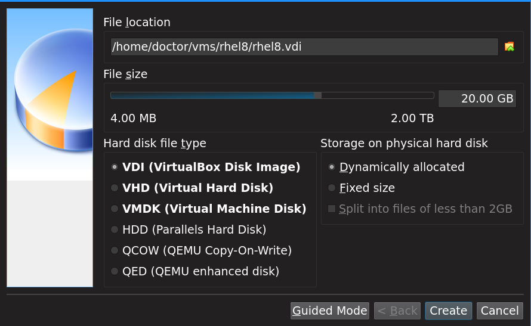

В окне создания диска выбираем размер - 20 Гигабайт. Тип файла оставляем VDI, также оставляем динамическое выделение пространства.

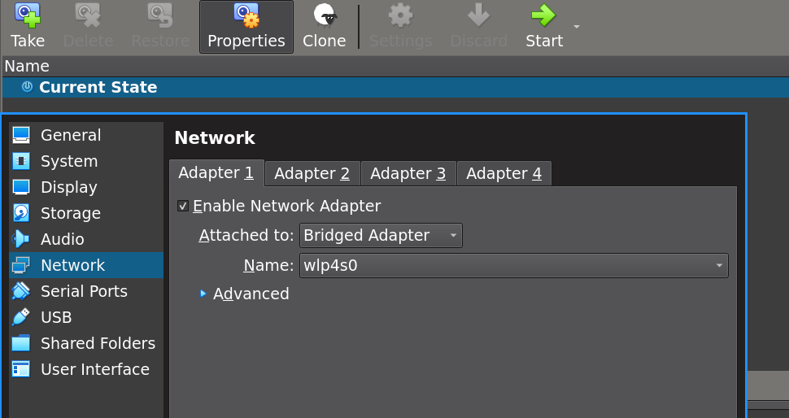

После чего заходим в настройки виртуалки, Network - Adapter 1 и меняем NAT на Bridged, т.е. сетевой мост. В зависимости от того, как вы подключены к сети, под сетевым мостом выбираете ethernet или wifi адаптер. Но, обычно, VirtualBox сам определяет нужный адаптер. После этого нажимаем OK.

Другие настройки нам не нужны. Раньше мы ставили систему с графическим интерфейсом и надо было поднастроить пару параметров, сейчас же графический интерфейс нам не нужен.

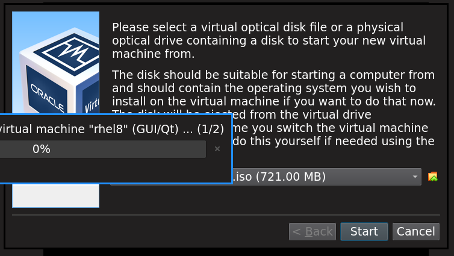

Стартуем виртуалку. При этом VirtualBox предложит подцепить ISO образ, находим скачанный файл и выбираем его.

#### Установка RHEL

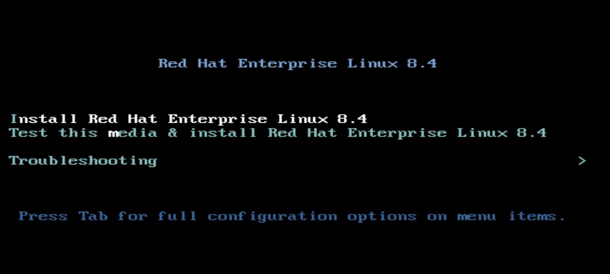

Первое что мы увидим - окно с выбором, где можно:

1. установить систему

2. протестировать установщик на целостность. Обычно нужно, если вы записали ISO образ на оптический диск или флешку и у вас подозрения, что что-то не так записалось.

3. решить какие-то проблемы с установленной системой через troubleshooting.

Выберем установку.


Затем нас встречает окно с предложением выбрать язык установщика. Оставим по умолчанию, английский. Виртуалбокс будет захватывать мышку и, чтобы вернуть мышку на основную систему, следует нажать правый Ctrl.

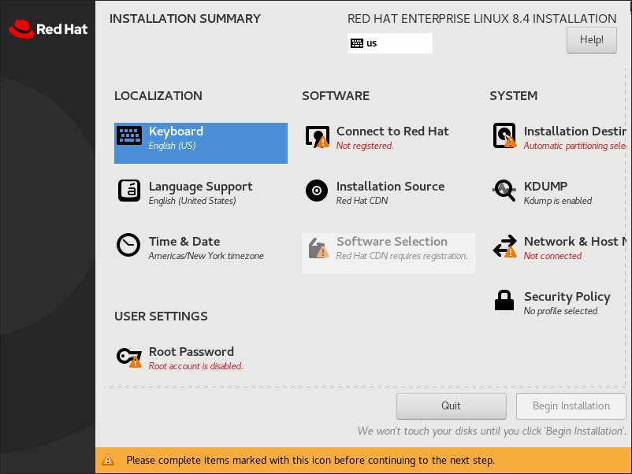

Раскладку клавиатуры и поддержку языков оставим по умолчанию. Наша система будет в качестве сервера, а в подавляющем большинстве случаев на серверах английского языка достаточно.

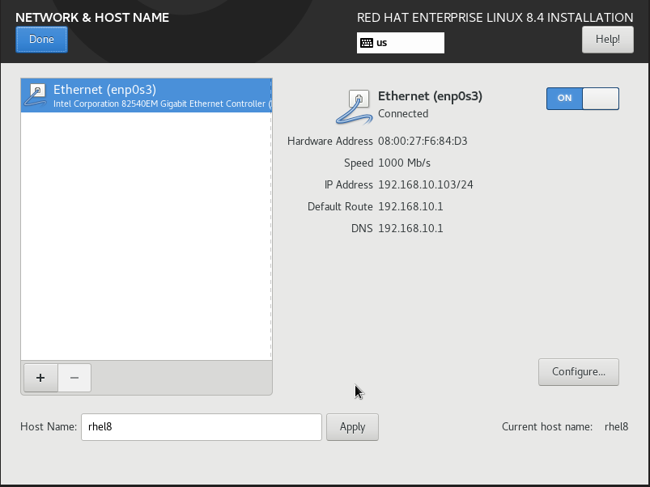

Заходим в Network & Host name, нажимаем галочку на включение адаптера, чтобы виртуалка получила IP адрес по DHCP. Затем снизу пишем hostname - rhel8, нажимаем Apply и Done.

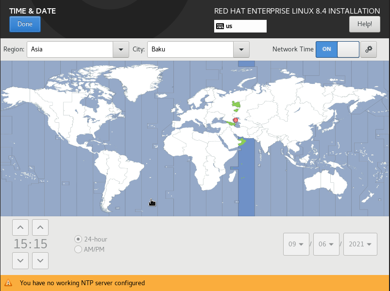

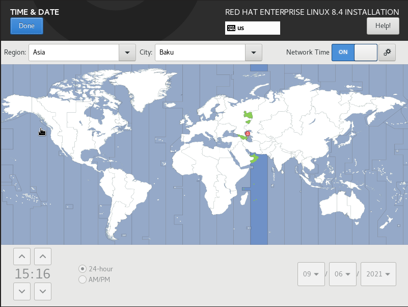

Затем в Time & Date, выбираем наш регион и город. Если у вас снизу отображается уведомление, что NTP сервер не настроен, просто переактивируем галочку Network Time. Это нужно, чтобы система синхронизировала время с сервером из интернета. Иначе в дальнейшем время в системе начнёт различаться с реальным временем, а это может привести к проблемам. Нажимаем Done.

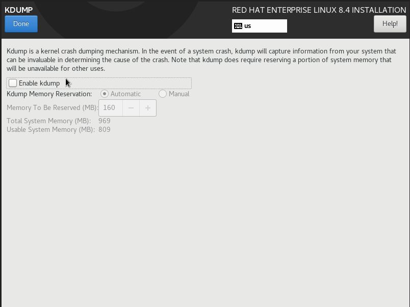

Заходим в KDUMP. Это механизм, который собирает информацию в момент поломки ядра и может быть полезен для диагностирования проблем. В целом это полезная штука и стоит её оставлять включённой в рабочей среде, чтобы, в случае чего, решать проблемы с ядром. Но kdump резервирует себе оперативку, а у нас тестовая среда для обучения, проблемы с ядром нам пока не страшны и маловероятны. Нам куда важнее ресурсы, поэтому отключим его, убрав галочку "Enable kdump" и нажав Done.

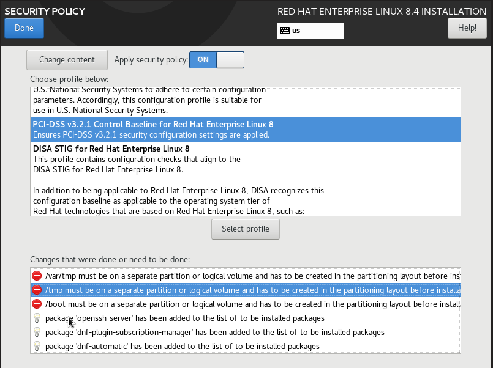

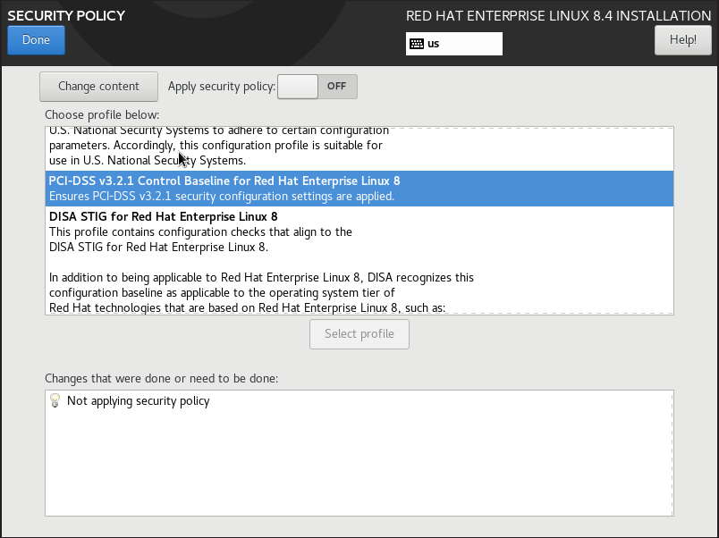

Заходим в Security Policy. Здесь у нас политики безопасности. Есть определённые стандарты настроек системы, особенно с точки зрения отказоустойчивости и безопасности, которым должны соответствовать различные организации и компании. К примеру, различные банки должны соответствовать стандартам PCI-DSS. В этих стандартах говорится как об организации инфраструктуры, так и конкретных настройках различных программ, к примеру, ssh демона, на какие файловые системы должен быть разделён диск, какие параметры должны быть у bash-а и т.д. и т.п. Соответствие стандартам полезно и предотвращает многие проблемы. Но настройка всего этого может занимать много времени, а дальнейшее администрирование настроенной системы немножко усложняется, так как появляется много ограничений с точки зрения безопасности. Возможно, когда-нибудь, мы пройдёмся по какому-нибудь стандарту, но нам пока рано. В этом окне мы можем выбрать один из стандартов и применить его, чтобы свежеустановленная система сразу соответствовала стандартам. Но, пока мы учимся, это будет мешать, поэтому отключим "Apply Security Policy" и нажмём Done.

#### Разметка диска

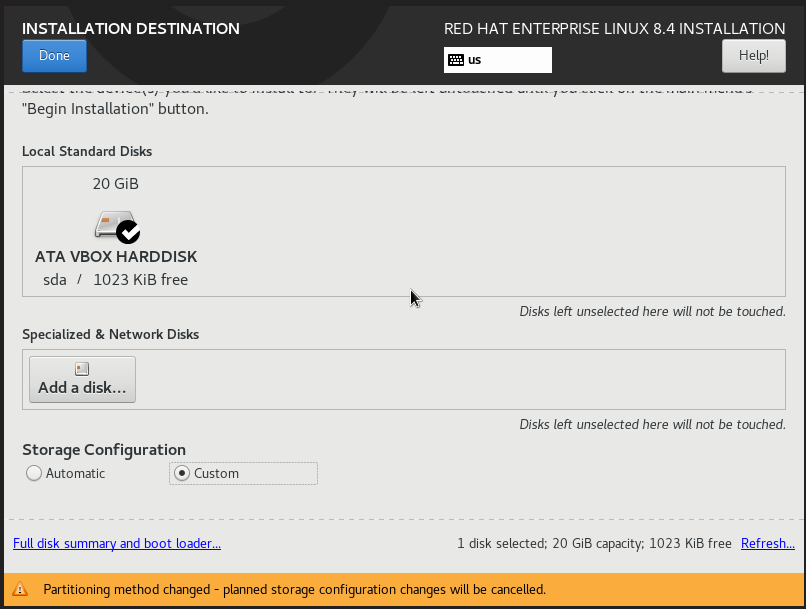

Теперь приступим к разметке диска - Installation Destination. Мы уже много говорили о дисках и файловых системах, поэтому вместо автоматической разметки можем выбрать "Custom", чтобы настроить самостоятельно. Это важно, потому что в большинстве случаев автоматическая разметка может не подходить под наши задачи. Нажмём Done.

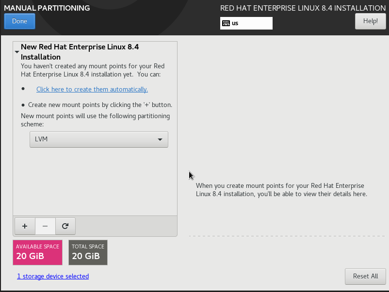

В этом окне можно гибко и удобно настроить разделы и файловые системы. И так, предположим, что мы настраиваем сервер. Зачастую полезно держать операционную систему и всё что ей нужно на одном диске, а данные, с которыми будет работать сервер - на другом. Это позволит в дальнейшем свободно перемещать данные на другую систему просто отключив диск с этой виртуалки и подключив на другую, а также заменить операционку в случае проблем, не затронув данные. Сейчас мы делаем шаблонную виртуалку, и, если что, подключим новый диск, где и будем хранить данные.

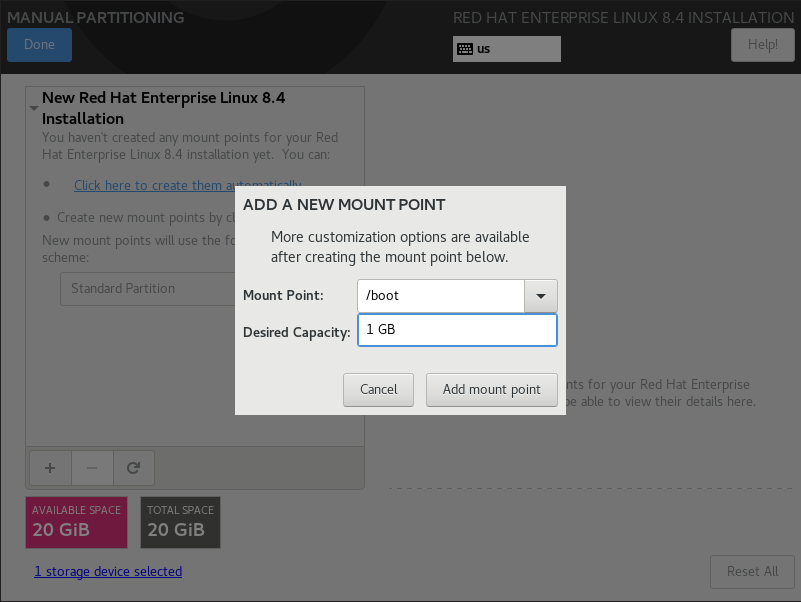

Из темы о LVM мы помним, что со стандартными разделами работать очень неудобно, и, если завтра будет не хватать места, что на серверах происходит очень часто, простым способом это не получится решить. Поэтому нам обязательно нужен LVM. Из темы о загрузчике мы помним, что всю систему можно хранить на LVM, если у нас используется GRUB2. Но Red Hat настоятельно рекомендует держать директорию /boot на стандартном разделе. Поэтому начнём с неё - в выпадающем меню выбираем Standard Partition и нажимаем +. В окне в качестве Mount Point выбираем /boot. В этой директории у нас хранится ядро, initramfs и настройки grub-а, что занимает мало пространства. Но при обновлении сюда же добавляется новое ядро, новый initramfs и если здесь место забьётся, возникнут проблемы. По умолчанию, при обновлении пакетный менеджер сохраняет старую версию ядра и initramfs, чтобы, в случае проблем, можно было загрузиться со старого ядра. И, по умолчанию, сохраняются 3 версии ядра - текущее, предыдущее и предпредыдущее. Ну и при установке новой версии появляется ещё и четвёртое, но потом самое старое ядро удаляется. На 4 версии ядра примерно хватит 1 GB, поэтому столько и выделим. Но если вы будете что-то делать с ядром, генерировать свой initramfs и т.п., проследите, чтобы /boot не забился.

Нажимаем Add mount point.

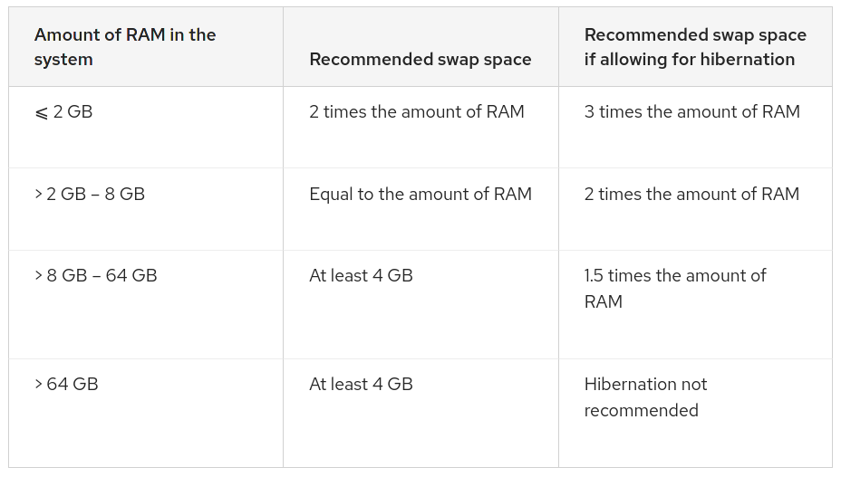

Теперь добавим swap. Тут всё очень индивидуально и зависит от сервиса, который мы будем поднимать на этом сервере. Советую посмотреть тему про swap, чтобы лучше понимать, зачем это нужно. Оттуда же возьмём шаблонную табличку и найдём значение для нашей виртуалки. И так, у нас оперативки всего 1 GB - под это подходит первая строчка. Гибернацию на серверах обычно не используют, поэтому под swap хватит 2 GB.

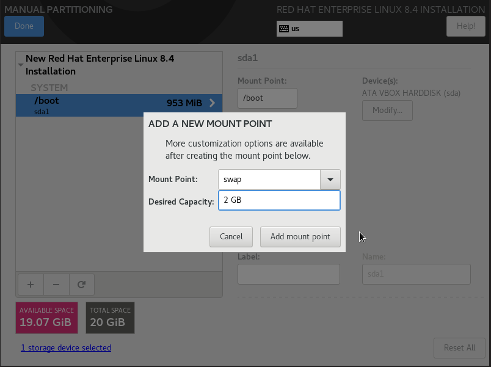

Нажимаем +, выбираем в качестве "Mount Point" swap, и capacity - 2 GB.

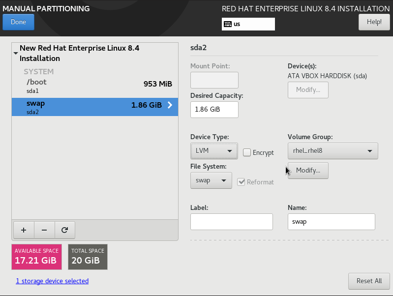

Но мы предполагаем, что в будущем может понадобится больше оперативки, и, соответственно, swap-а. И чтобы мы могли без проблем увеличить swap, следует его сделать на LVM. Для этого в Device Type выбираем LVM. Справа у нас появится название Volume Group-ы - rhel_rhel8. Обычно я придерживаюсь своего стандарта в названии томов, поэтому переименую. Нажимаем "Modify..."

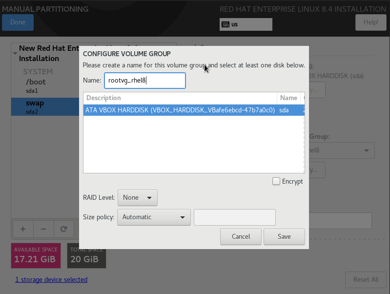

И так, VG, где у меня хранится корень и всё что относится к системе, я называю rootvg, а VG с данными - datavg. Но, если в будущем понадобится подключить этот диск к другому компьютеру, где уже есть VG с таким же названием, возникает проблема с LVM из-за одинаковых названий. Поэтому к rootvg я приписываю хостнейм - rootvg_rhel8. Нажимаем Save.

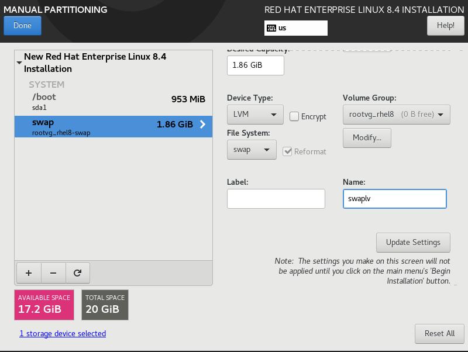

Ниже Volume Group есть Name - имя логического тома. К ним я обычно приписываю lv - swaplv. Если экран установщика маленький, нужно навести мышку направо и используя ползнунок спуститься вниз, чтобы появилась кнопка "Update Settings". После наших изменений надо на неё нажать.

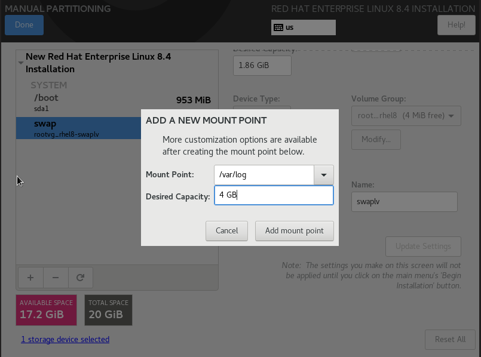

Ещё раз нажимаем +. Так как эта виртуалка у нас в качестве сервера и, скорее всего, здесь у нас не будет реальных пользователей и их файлов, /home выносить в отдельную файловую систему не надо. Бывают сервисы, которые хранят свои данные в домашней директории своего юзера - тогда имеет смысл отделить /home. Но в нашем случае это не надо. Зато на серверах имеет смысл отделять от корня директорию /var/log. При каких-то проблемах логи могут быстро накопиться и забить весь корень, из-за чего система перестанет работать. Выделив под логи отдельную файловую систему мы можем обезопасить корень. Сколько выделять под логи? Зависит от многих факторов - как долго вам нужно хранить логи, как много их пишется за день. Зачастую создаётся отдельный лог сервер для центрального хранения логов - тогда на самих машинках хранить много логов не нужно. Выставим 4 GB - для тестов этого объёма вполне хватит. И если что - всё равно мы используем LVM и сможем увеличить.

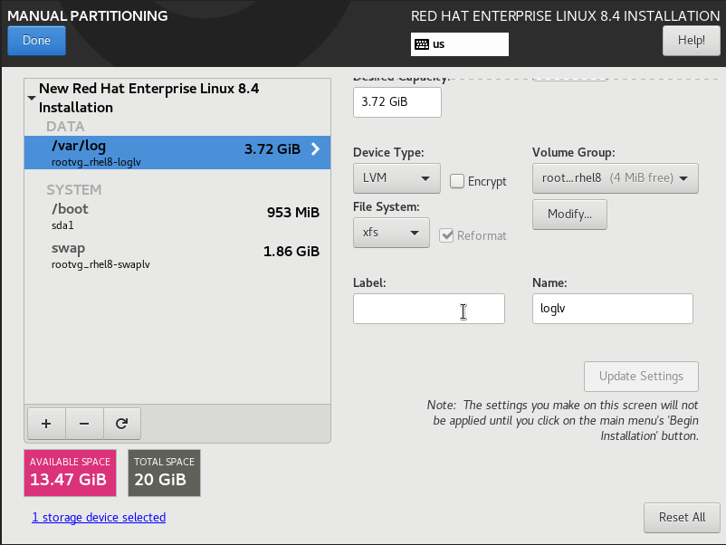

Появившийся стандартный раздел поменяем на LVM в Device Type. На этот раз менять volume group не надо, название уже сохранилось. Осталось поменять название логического тома - loglv и нажать Update Settings.

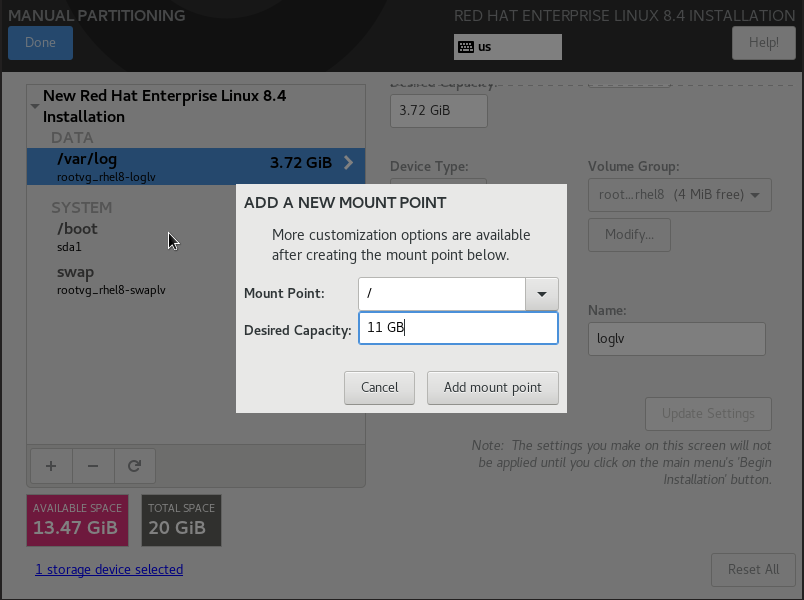

Ещё раз нажимаем +. Осталось только создать логический том для корня. В некоторых случаях имеет смысл выносить и другие директории, но это уже частности. И так, выбираем в качестве Mount Point корень - /. Свободного объёма осталось где-то 13 GB. Под корень выдадим 11 GB - остальное оставим свободным. Если завтра нам где-то перестанет хватать места или мы захотим сделать снапшот, немного лишнего места нас могут спасти.

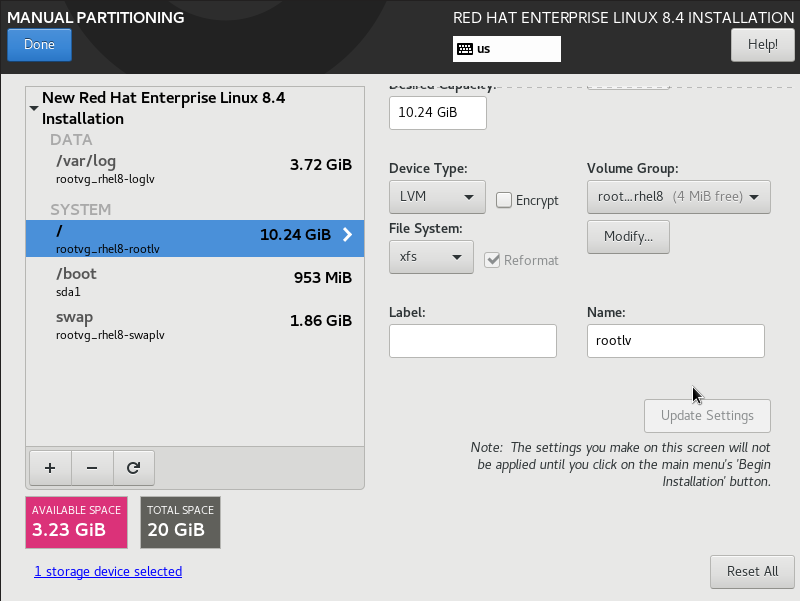

Опять же, выбираем тип - LVM, меняем название на rootlv и нажимаем Update Settings. После чего нажимаем Done.

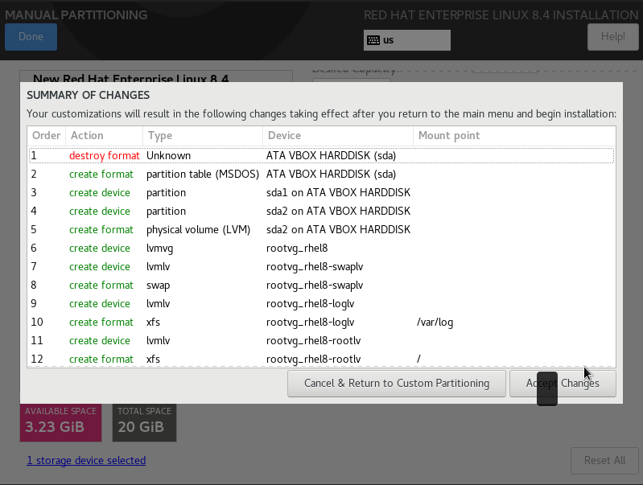

Установщик покажет, что к чему и предложит принять наши настройки - Accept changes.

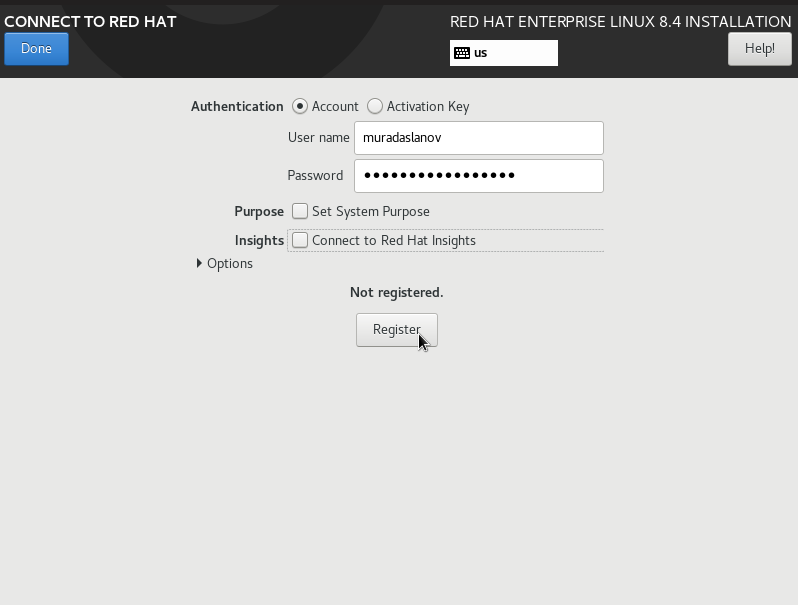

Затем заходим в Connect to Red Hat. Здесь нам нужно ввести логин и пароль, указанные при регистрации в портале Red Hat. Также убираем галочку с "Insights". После чего нажимаем Register.

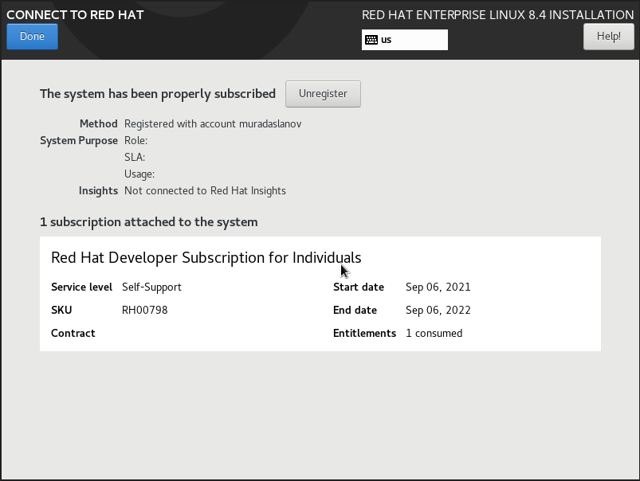

Если всё прошло нормально, вы увидите окно с информацией о подписке. Нажимаем Done.

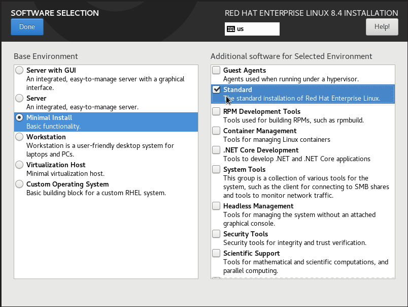

Installation source я пропускаю. Обычно здесь можно указать дополнительные репозитории, или выбрать локальные - если интернет не доступен. Но ни то, ни другое нам пока нужно. После этого идём в Software Selection.  Здесь у нас есть готовые шаблоны, которые позволят ещё при установке поставить все необходимые инструменты под нужную задачу. У нас задача не предопределена, поэтому мы поставим минимальную систему со стандартными утилитами. В стандартные утилиты входит тот же самый nano, всякие утилиты для управления Selinux и некоторые другие пакеты, без которых можно, но с ними удобнее. При этом графического интерфейса у нас не будет. Нажимаем Done.

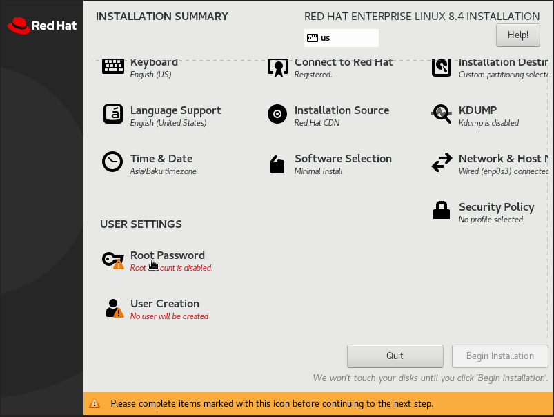

Используя ползунок, спускаемся вниз. Осталось настроить пароль рута и создать пользователя.

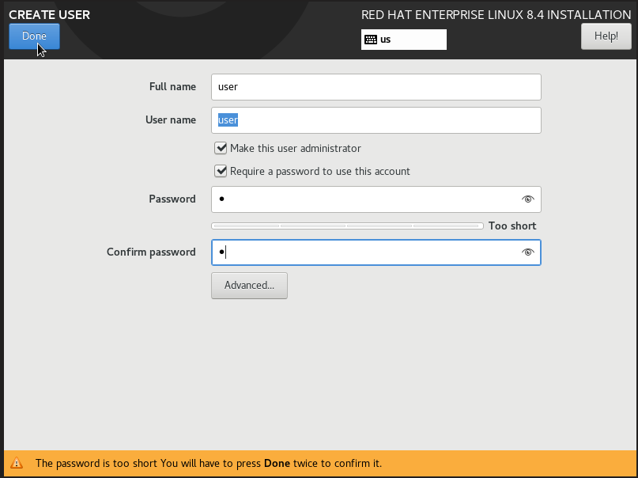

При создании пользователя не забываем поставить галочку, чтобы сделать его администратором.

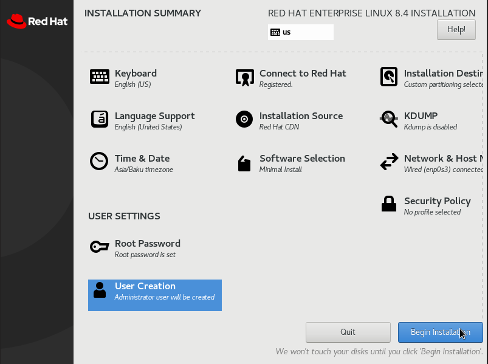

Ну и в конце концов нажимаем Begin Installation. Установка займёт некоторое время, потому что часть пакетов будет скачиваться с интернета. После установки нажимаете Reboot.

#### После установки

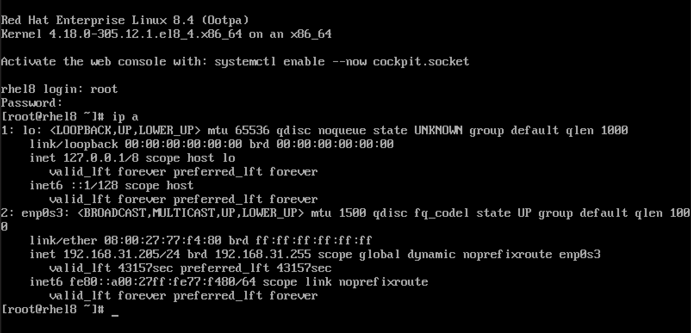

После перезагрузки логинимся в систему и узнаём ip адрес, чтобы подключиться по ssh.

```bash
ip a
```

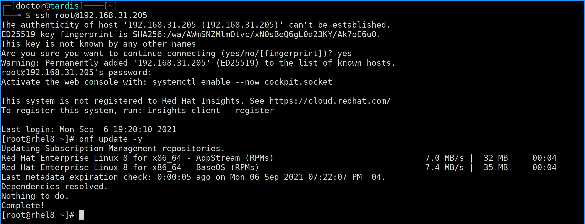

Собственно, подключаемся по ssh и на всякий случай проверяем обновления. Хотя обычно после установки по сети сразу обновления не требуются.

```bash
dnf update -y
```

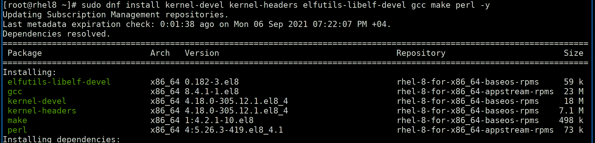

Так как мы работаем с виртуалкой, первым делом стоит установить гостевые дополнения. А для этого предварительно нужно установить пару пакетов:

```bash
sudo dnf install kernel-devel kernel-headers elfutils-libelf-devel gcc make perl -y
```


После чего в виртуалбоксе к виртуалке нужно подцепить гостевые дополнения, ну и по необходимости их скачать.

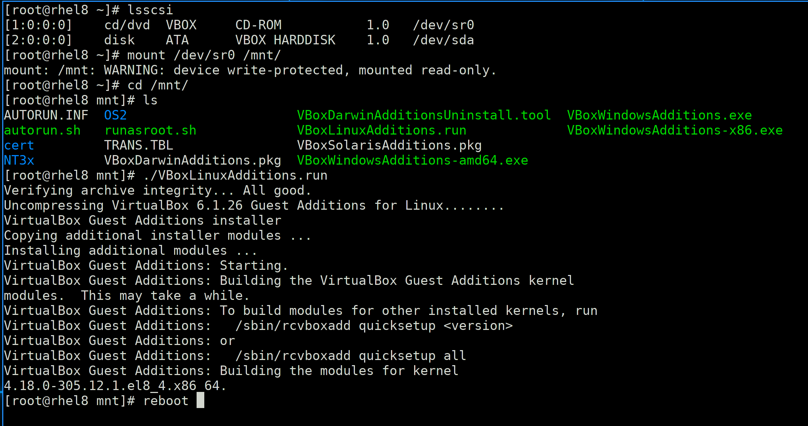

После того, как вы нажмёте Insert, вернитесь к ssh и запустите команду lsscsi. Она покажет файл CD-ROM-а, который надо будет временно примонтировать, допустим, в /mnt. Затем запустить из этого диска VBoxLinuxAdditions.run. А после установки - перезагрузить виртуалку.

```bash
lsscsi
mount /dev/sr0 /mnt
/mnt/VBoxLinuxAdditions.run
reboot
```

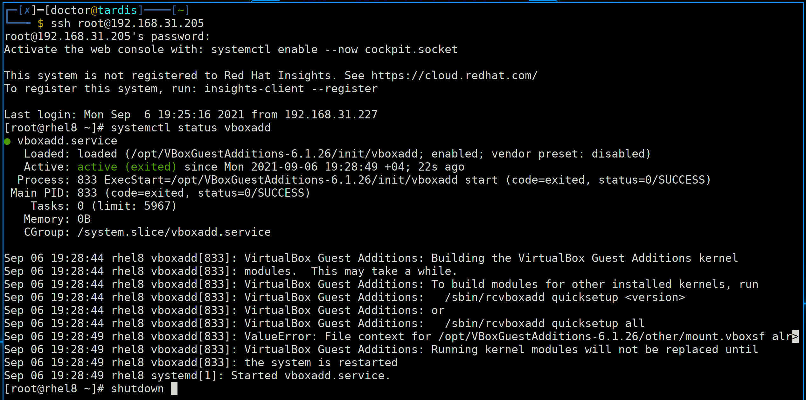

После перезагрузки ещё раз подключимся по ssh и убедимся, что гостевые дополнения установились. Сервис активен, а это говорит о том, что, скорее всего, всё установилось без проблем. И так, наша виртуалка готова. Давайте напоследок сделаем снапшот, чтобы, если что, можно было вернуться к текущему состоянию. Для этого предварительно стоит выключить виртуалку.

```bash
systemctl status vboxadd
shutdown
```

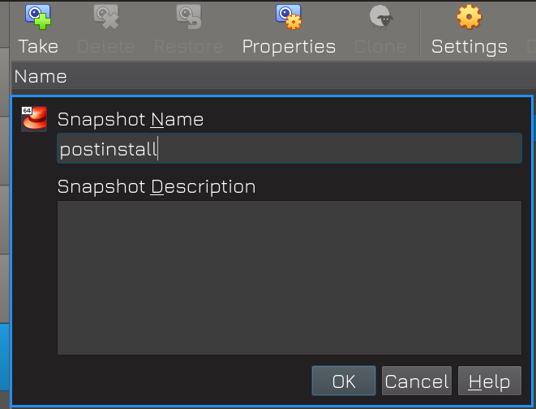

Затем открываем VirtualBox, переходим в секцию snaphots и нажимаем Take. Назовём снапшот "postinstall" и нажмём OK. Всё готово.

Давайте подведём итоги. Установка операционной системы - простой процесс, с которым многие могут справиться. Однако зачастую у новичков возникают вопросы и сомнения - к примеру, как правильно разметить диск. Это, конечно, очень индвидуально и разнится от системы к системе. Но если понимать, что и зачем делать, то в будущем можно избежать многих проблем. И я надеюсь, что за эти 50 тем вы стали лучше понимать, как устроена операционная система и как с ней работать. А установка CentOS практически идентична установке RHEL, за исключением момента с регистрацией и подпиской.
