

Время в операционных системах играет важную роль. Если оно настроено неправильно, то можно столкнуться с различными проблемами:

- невозможно будет зайти на безопасные сайты. На многих сайтах есть сертификаты, благодаря которым наш браузер и система могут доверять этим сайтам. Но у сертификатов есть срок действия. И если время в нашей системе сильно отстаёт или спешит, то браузер будет считать сертификат недействительным и не пускать нас на сайт;
- также сложнее будет разобраться в логах и понять, какие события связаны друг с другом, особенно когда у вас множество систем. Где-то часы спешат на 5 минут, где-то отстают на час, и сложнее становится коррелировать события.
- многие сервисы, настроенные на отказоустойчивость, из-за различий во времени могут привести к серьёзным неполадкам.

И это лишь часть проблем. Поэтому администратору важно уметь настраивать время.

#### Часы реального времени (RTC)

В каждом компьютере в материнской плате есть часы, называемые часами реального времени - real time clock - RTC. Засчёт плоской батарейки они работают всегда, даже когда компьютер выключен. Но они сбиваются, если эта батарейка разрядится или если её вытащить. И эти часы обычно настраиваются через BIOS, но и операционная система может их изменить.

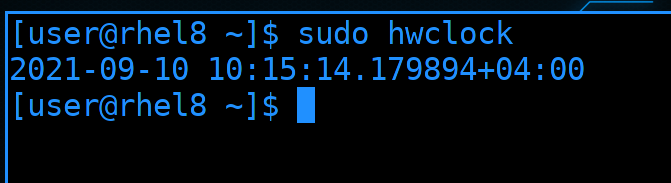

Операционная система при включении узнаёт время по этим часам. Чтобы посмотреть текущее время на них, можно использовать утилиту hwclock. Цифры после точки - это микросекунды, а плюс указывает, что ко времени добавлено 4 часа - учтён часовой пояс.

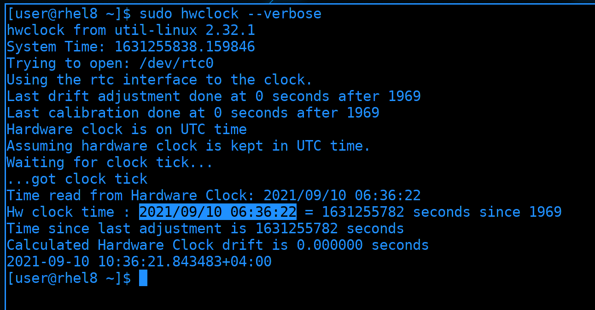

Время на таких часах считается в секундах, где нулём является полночь первого января 1970 года, так называемая "Эпоха UNIX", а количество прошедших секунд называется UNIX-временем. По-умолчанию, Linux предполагает, что на часах стоит время по UTC и добавляет к ним разницу в часовом поясе, а Windows предполагает локальное время. И если вы поставите на один компьютер обе системы, Windows-е и Linux будут перебивать часы друг друга. Но это легко исправимо, достаточно на линуксе указать, что на этих часах локальное время.

#### Системные часы

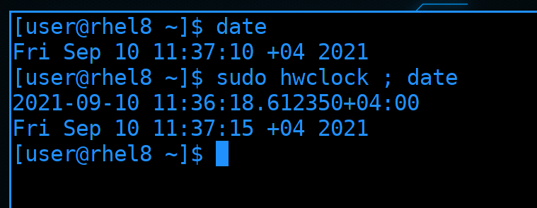

Во время запуска компьютера ядро операционной системы считывает RTC, берёт время и запускает свои часы, называемые системными. Оно работает в оперативке, поэтому при каждом выключении пропадает. Узнать время на системных часах можно с помощью утилиты date. Это независимые часы, поэтому спустя какое-то время системные часы могут расходиться с часами реального времени:

```bash
sudo hwclock; date
```

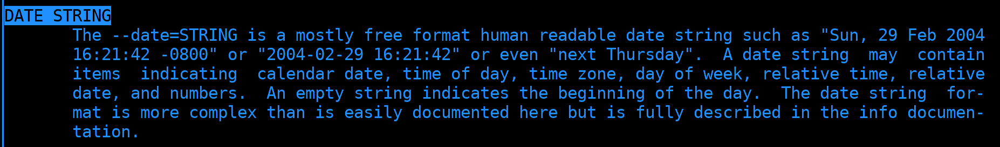

Системное время можно поменять с помощью этой же утилиты. Для этого нужно использовать ключ -s - set. Время можно задавать по разному, найдите в man-е по date строчку "DATE STRING", здесь есть примеры.

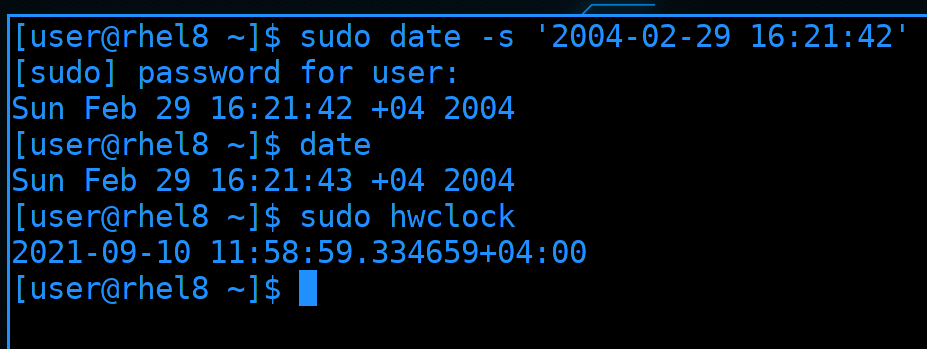

Скопируем пример и запустим команду:

```bash
sudo date -s '2004-02-29 16:21:42'
date
sudo hwclock
```

Как видите, системное время поменялось, теперь на часах 2004 год. Но это никак не повлияло на RTC.

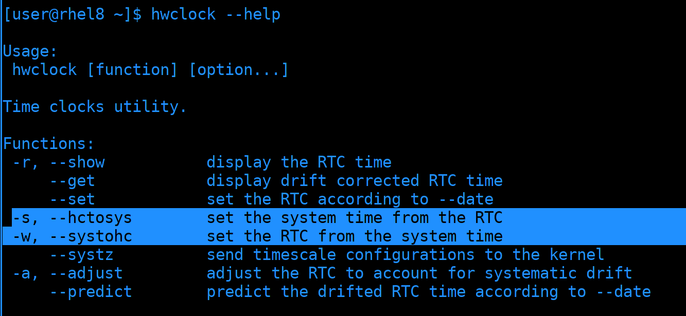

Можно записать время с системных часов на часы реального времени и наоборот. Это можно сделать через утилиту hwclock с помощью выделенных ключей.

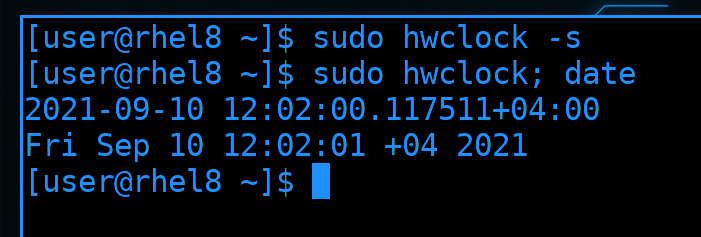

Давайте синхронизируем часы, что исправить время.

```bash
sudo hwclock -s
sudo hwclock; date
```

И теперь системные часы показывают 2021 год.

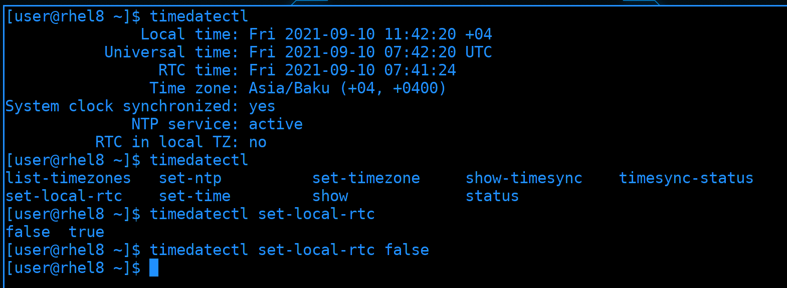

Есть утилита, которая объединяет настройку часов реального времени, системных часов и часового пояса - timedatectl. Как тут видно, локальное время и время на RTC отличаются. Это как раз о разнице с Windows. И чтобы Linux не добавлял к RTC таймзону нужно использовать опцию set-local-rtc со значением true:

```bash
sudo timedatectl set-local-rtc true
```

Но я этого делать не буду, у меня со временем проблем нет.


Давайте, для примера, настроим часовой пояс. Для начала найдём таймзону с помощью опции list-timezones и используя поиск с помощью слэша - /Moscow

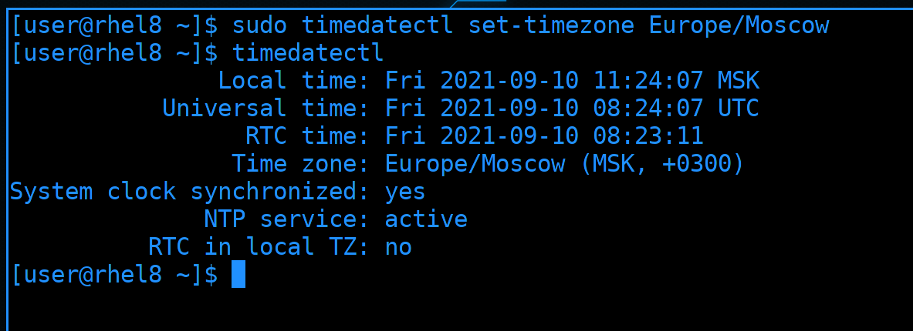

И с помощью опции set-timezone зададим найденное значение:

```bash
sudo timedatectl set-timezone Europe/Moscow
timedatectl
```

Как видите, теперь часовой пояс - Москва.

#### NTP

Когда у вас один компьютер, настроить время не проблема. Если время будет спешить или отставать, поправить его тоже не проблема. Но постоянно следить и исправлять часы неудобно. А если дело касается администрирования множества серверов, чувствительных ко времени, то за всеми уследить трудно, да и всё это лишняя трата сил и времени.

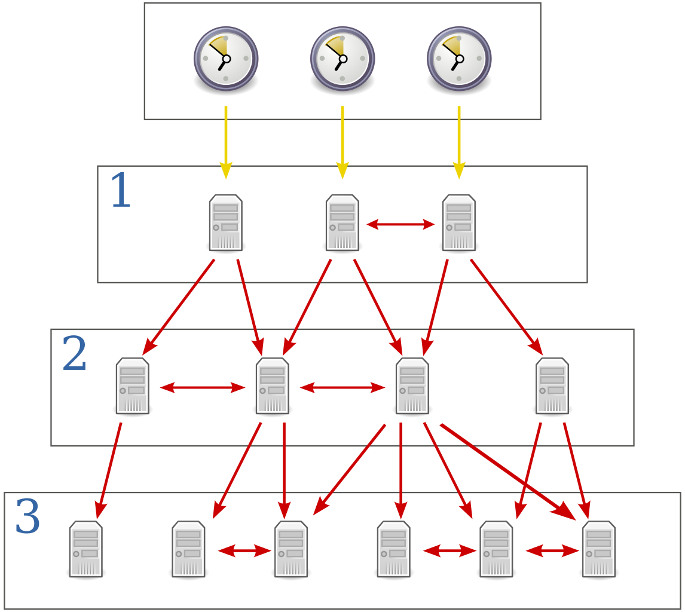

Чтобы на всех ваших системах было одно и тоже время и чтобы оно постоянно было правильным, используется протокол NTP - network time protocol. Грубо говоря, есть сервера, которые знают правильное время и ваши системы могут периодически обращаться к этим серверам, узнавать время и поправлять у себя. Сами сервера тоже в свою очередь берут время у других серверов.  


И есть определённая иерархия. Точное время с минимальной погрешностью определяется на специальных часах, называемых атомными. Но таких часов не так много, чтобы каждый мог к ним подключиться. Поэтому к ним подключаются первичные сервера времени.

Но и первичных серверов времени довольно мало, чтобы каждый желающий мог к ним подключаться. К ним могут подключаться только те, кто раздаёт время на большое количество устройств, обычно это вторичные сервера времени.


Т.е. всё по иерархии, как на картинке. У каждого сервера есть так называемый стратум, это то, на каком слое он находится, т.е. stratum 1 - это первичные сервера, stratum 2 - вторичные и т.д. Всего значений может быть 15. Чем ближе сервер к атомным часам, тем меньше стратум и тем точнее часы. Но речь идёт о микросекундах, поэтому, в большинстве случаев, это не критично.   

Обычно, в локальной сети вы поднимаете несколько своих ntp серверов и указываете их на других машинках. Ваши NTP сервера будут брать время из публичных серверов, а всякие компьютеры и сервера в сети - с ваших локальных NTP серверов. Если вдруг интернет пропадёт, или вы намеренно запретите всем серверам выход в интернет, всё равно будет работать синхронизация с локальным NTP сервером и время не разбежится.

Есть различные программы, которые могут забирать и раздавать время, т.е. выступать NTP клиентом и сервером. Одни из самых популярных - ntpd и chrony. Есть определённые различия в функционале, но они не так существенны в большинстве случаев. Но если вам интересно, можете почитать по [ссылке](https://chrony.tuxfamily.org/comparison.html).   

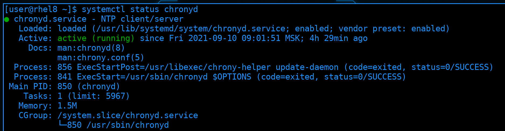

При установке системы мы поставили галочку "Network Time", благодаря чему у нас установился ntp клиент. По умолчанию, это chrony. Чтобы постоянно синхронизировать время, он работает как демон:

```bash
systemctl status chronyd
```

Если будут расхождения во времени, chrony поправит это. Но не то чтобы он заменит время на правильное - так делать нельзя, так как это может привести к большим проблемам. Вместо этого chrony будет ускорять или замедлять часы на доли секунд, чтобы исправить время. Соответственно, если время отличается сильно, то и смысла синхронизировать зачастую не будет, так как такой процесс может занять годы. Однако, если ничего важного и чувствительного ко времени не работает на сервере, то можно пренебречь ускорением и сразу выставить нужное время.

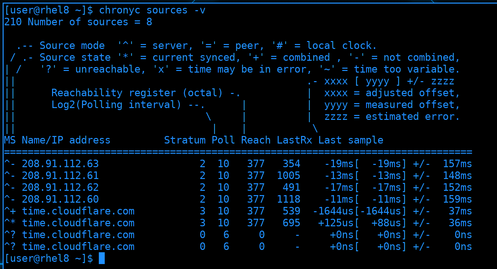

Также есть утилита chronyc, которая позволяет управлять и смотреть всякую информацию. Одна из главных опций - sources, она позволяет узнать, к каким серверам мы обращаемся и всё ли нормально. А ключ -v - verbose - даёт подсказки, что означают те или иные символы:

```bash
chronyc sources
```

Если проанализировать вывод: все строчки в таблице начинаются с символа карет - наверху видно, что это обозначение для серверов. Как видите, серверов много. Обычно рекомендуется указывать либо 4 и больше серверов, либо 1. Дело в том, что NTP для доставки информации использует UDP - т.е. не гарантирует целостность данных. Также, говоря о точности времени, речь идёт о микросекундах, а у разных серверов время может отличаться. Если указать два сервера - сложно будет понять, кто из них выдаёт правильное время. С одним сервером таких вопросов не будет, но, если такой сервер станет недоступен, то и узнать время не получится. Если же указать 4 или больше серверов, будут использоваться алгоритмы комбинирования для определения времени.

Второй символ в таблице показывает, какой сервер используется - он выделен звёздочкой. Значения с этого сервера могут комбинироваться со значениями от некоторых других серверов, с какими-то не могут. А вот вопрос означает, что такой сервер недоступен.

После адресов серверов мы также видим их стратумы. Обычно это 2 или 3. 0 означает, что мы не можем определить stratum, потому что сервер недоступен.

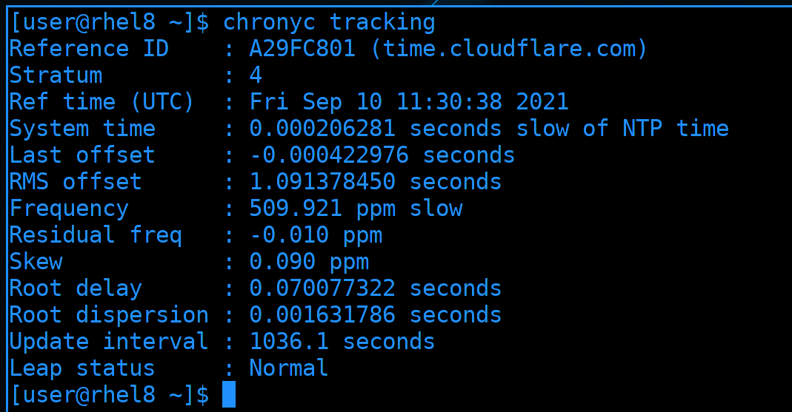

Опция tracking детальнее раскроет информацию. Большая часть этих данных нужна для диагностики проблем. И это не так важно, если вы не работаете с сервисами, щепетильными ко времени.

#### Настройка chronyd

Зачастую вам нужно уметь поднять NTP сервер и настроить клиенты, чтобы они подключались к вашему серверу. Сделаем так - RHEL настроим в качестве NTP сервера, который будет брать время от публичных NTP серверов и раздавать на наш Centos.

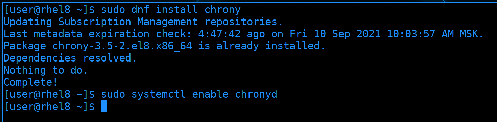

Начнём с NTP сервера. Им у нас будет chronyd, который уже предустановлен. Но, если у вас его нет, следует его установить и включить. Пакет называется chrony, а сервис - chronyd:

```bash
sudo dnf install chrony
sudo systemctl enable chronyd
```

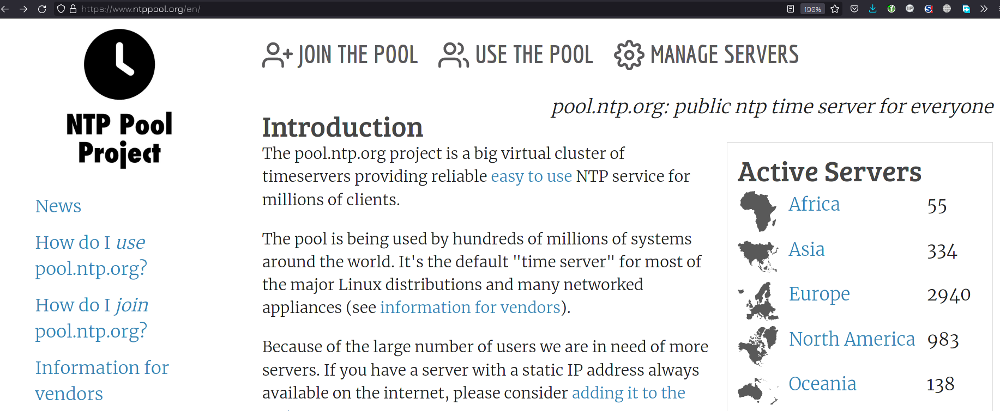

Обычно, пакет уже приходит с настройками, где указаны публичные NTP сервера, но давайте мы их заменим. Есть проект ntp.org, в котором участвуют сервера по всему миру. Заходим на сайт [ntppool.org](https://www.ntppool.org/) и выберем регион. Для России это Europe.

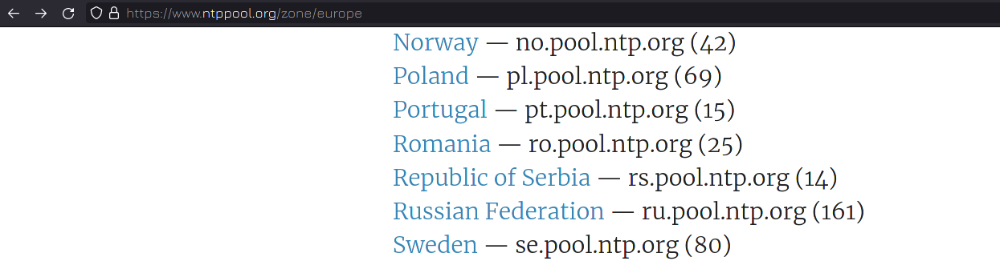

В списке находим [РФ](https://www.ntppool.org/zone/ru).

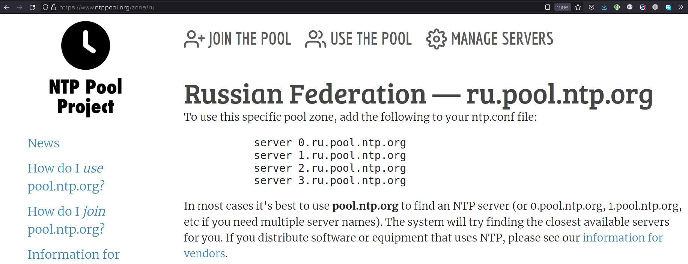

Здесь указаны 4 адреса. Но на самом деле это не 4 сервера, а сотня серверов, которые находятся  за этими адресами. Снизу также есть подсказка, что в большинстве случаев лучше указывать pool.ntp.org, чтобы найти ближайшие адреса. Мы можем как скопировать эти 4 адреса и использовать их, так и последовать совету и использовать pool.ntp.org. Параметр server мы будем использовать на CentOS, поэтому давайте на RHEL используем pool.

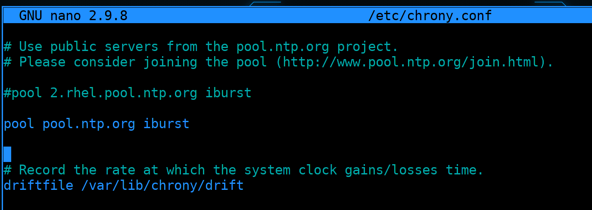

Зайдём в /etc/chrony.conf. Здесь уже есть строчка pool, закомментируем её и напишем свою. Кстати, в строчке pool также указан параметр iburst. Благодаря ему при запуске операционной системы или сервиса синхронизация времени происходит быстрее.

```
pool pool.ntp.org iburst
```

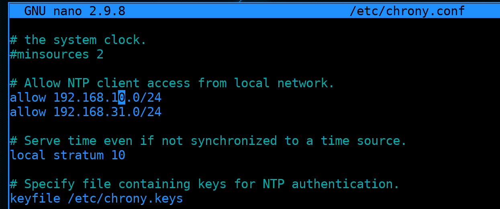

Спустимся чуть ниже. Чтобы превратить chrony в NTP сервер, т.е. чтобы он также раздавал время, надо раскомментировать строчку allow, в которой нужно указать сети, для которых мы будем раздавать адреса. Допустим, я хочу, чтобы он раздавал в сетях 192.168.10.0/24 и 192.168.31.0/24.

```
allow 192.168.10.0/24
allow 192.168.31.0/24
```

Ещё одно важное замечание. Если вдруг этот компьютер потеряет доступ в интернет и не сможет достучаться до указанных NTP серверов, он перестанет раздавать время. Чтобы он продолжал раздавать время даже когда нет интернета, допустим, в закрытой сети, надо расскомментировать строчку local stratum:

```
local stratum 10
```

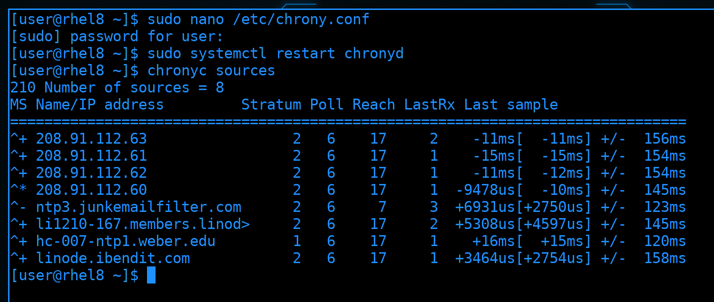

После проделанных изменений стоит перезапустить сервис chronyd, подождать пару секунд и проверить синхронизацию времени, с помощью того же chronyc:

```bash
sudo systemctl restart chronyd
chronyc sources
```

Я вижу, что перед одним из серверов стоит звёздочка, да и справа есть значения, а не нули. Значит, всё работает.

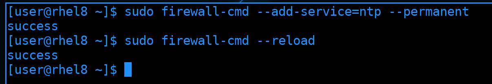

Также, чтобы CentOS мог подключиться к этому серверу и брать отсюда время, мне нужно разрешить NTP на файрволе. NTP работает на 123 порту по UDP, а в firewalld его можно добавить просто как сервис:

```bash
sudo firewall-cmd --add-service=ntp --permanent
sudo firewall-cmd --reload
```

NTP сервер мы настроили, осталось настроить клиент.

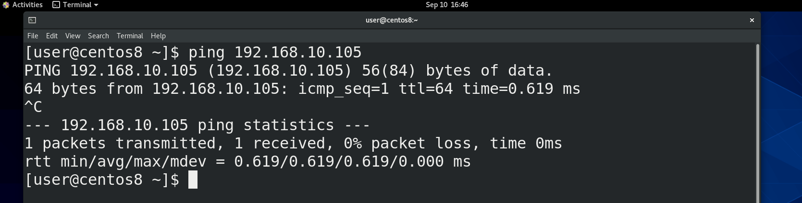

Для начала убедимся, что CentOS видит RHEL:

```bash
ping 192.168.10.105
```

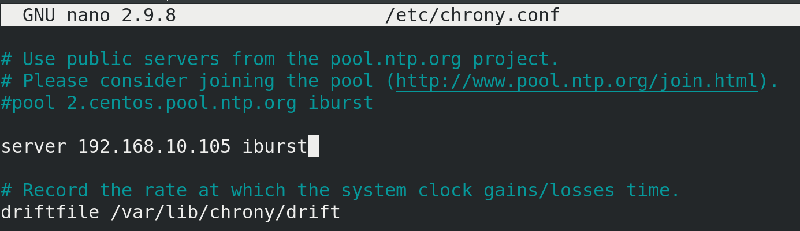

Заходим в /etc/chrony.conf, комментируем pool и прописываем server с адресом RHEL.

```
server 192.168.10.105 iburst
```

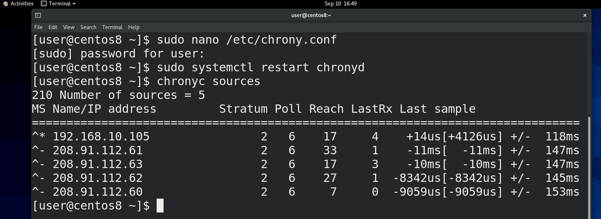

Сохраняем изменения и перезапускаем сервис:

```bash
sudo systemctl restart chronyd
```

Ждём пару секунд и убеждаемся, что NTP сервер доступен и работает

```bash
chronyc sources
```

Как видите, в списке отобразился адрес нашего сервера и перед ним есть звёздочка - значит всё работает. Таким образом, мы настроили локальный NTP сервер и подключили к нему какую-то машинку, чтобы она синхронизировала время.

NTP сервер потребляет мало ресурсов, поэтому мы можем сделать 4 таких сервера, чтобы время в сети было точнее, либо оставить один, это уже зависит от количества систем в нашей сети. И хотя функционал NTP сервера довольно большой и мы рассмотрели его поверхностно, этого хватает для большинства задач.

Давайте подведём итоги. Мы с вами разобрали часы реального времени и системные часы. Эти часы можно настроить с помощью различных утилит - hwclock, date и timedatectl. Но лучше всего использовать протокол NTP, чтобы на всех наших серверах было одно актуальное время, что позволит избежать многих проблем.  
