

Довольно часто бывает нужно перадать файлы с одной машинки на другую. В зависимости от некоторых факторов используются различные инструменты. Сегодня речь пойдёт, в основном, про небольшие объёмы данных, скажем, до 10 Гигабайт и не требующие постоянной передачи. Например, закинуть архив с программой на сервер, скопировать логи на локальную машину, сделать небольшой бэкап и всё такое. И всё это можно сделать с помощью нескольких утилит, использующих SSH для передачи данных. Это позволяет обезопасить передачу файлов, но сам протокол не оптимизирован для передачи большого объёма данных.

#### SCP

Если вам нужно просто передать файлы с одной машинки на другую, подойдёт утилита scp. Во многом она напоминает стандартный cp, но умеет работать с сетью. Синтаксис простой - scp откуда куда. Можно копировать с удалённой системы на локальную, с локальной на удалённую и даже с удалённой на удалённую.

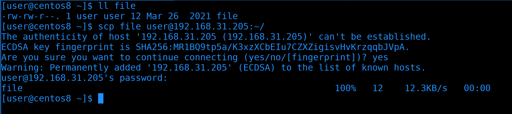

Начнём с простого. Мы находимся на Centos и хотим скопировать локальный файл на RHEL. Файл находится в текущей директории, поэтому путь к нему не указываем. Как и в ssh, мы должны указать пользователя, которым логинимся и адрес удалённой системы. Затем ставим двоеточие и указываем путь, куда хотим скопировать. Например, в домашнюю директорию пользователя user на rhel. Так как мы подключаемся в первый раз, увидим сообщение о ключе хоста, пишем yes и вводим пароль user-а от удалённой системы.  После чего появится строчка с прогрессом копирования.

```bash
scp file user@192.168.31.205:~/
```

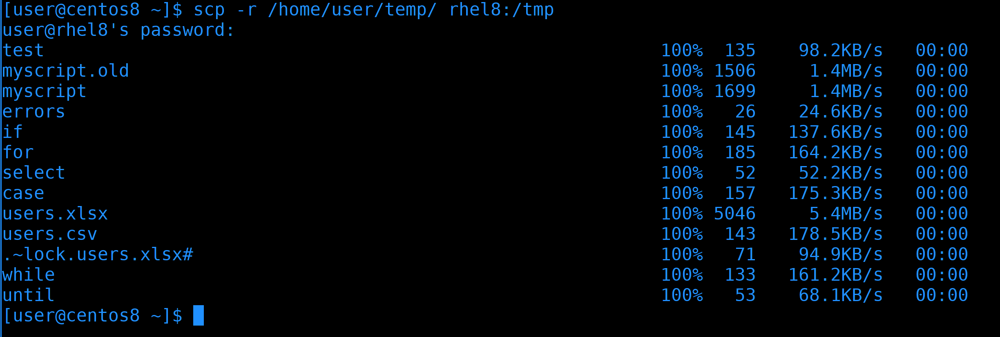

Теперь попробуем скопировать директорию, для этого нужен ключ -r - рекурсивно. На этот раз для примера укажем полный путь к локальной директории. На локальной машинке я сижу от пользователя user и на удалённой машинке есть user с таким же логином, от имени которого я подключаюсь. Поэтому мне не обязательно писать логин для удалённой машинки. Также вместо IP адреса я могу прописать имя хоста, не важно, прописано оно в ssh конфиге, /etc/hosts, или на DNS сервере. Ну и после двоеточия укажем полный путь к директории /tmp. Введём пароль и увидим, как передались все файлы.

```bash
scp -r /home/user/temp/ rhel8:/tmp
```


Теперь попробуем скопировать с удалённой машинки на локальную. Т.е. теперь сперва указываем удалённую машину, а потом локальную директорию или файл, если мы хотим его перезаписать. На этот раз используем глоббинг, т.е. скопируем все файлы с директории /var/log на удалённой системе, заканчивающиеся на .log, в локальную директорию Documents. И всё прошло успешно.

```bash
scp rhel8:/var/log/*.log Documents/
```

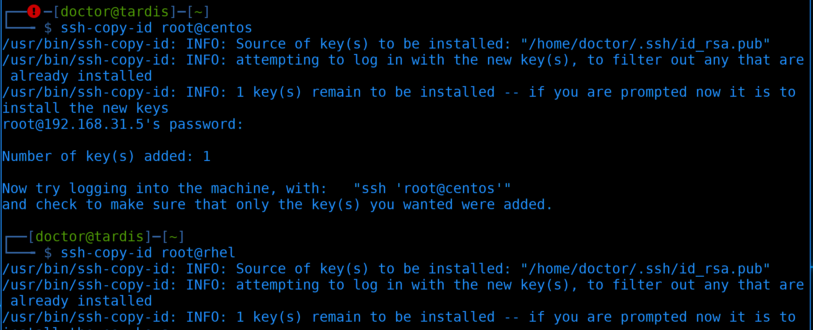

Теперь попробуем скопировать с удалённой машинки на другую удалённую. Чтобы не приходилось вводить пароли при копировании, сперва закинем ssh ключи.  

```bash
ssh-copy-id root@centos
ssh-copy-id root@rhel
```

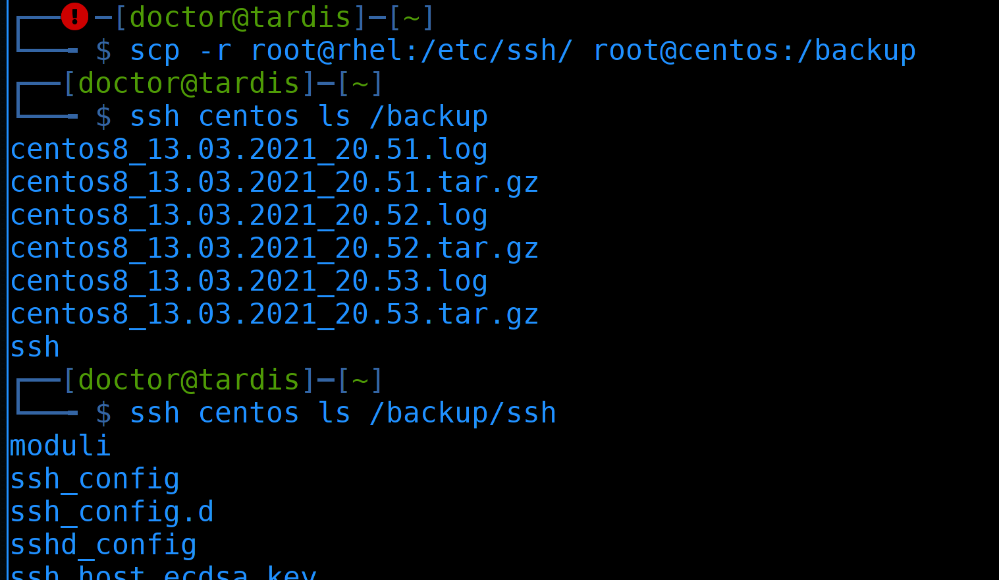

Когда всё готово, скопируем директорию /etc/ssh с rhel-а в директорию /backup на centos-е. Кстати, когда у нас есть ключи, можно использовать tab для автодополнения, т.е. путь подхватывается с удалённой системы. На этот раз вывода не будет, но можем увидеть результат просто сделав ls через ssh.

```bash
scp -r root@rhel:/etc/ssh root@centos:/backup
ssh centos ls /backup/ssh
```

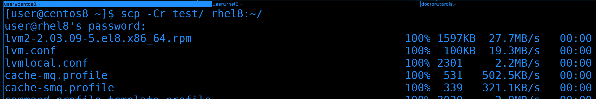

Можно ещё использовать ключ -C для сжатия данных перед копированием.

```bash
scp -Cr test/ rhel8:~/
```

Если вы планируете скопировать множество мелких файлов, лучше предварительно добавить их в архив и скопировать одним файлом - так будет гораздо быстрее. Так как при копировании обрабатывается каждый файл и, если файлов тысячи, то это большая нагрузка на процессор и сеть.

Окей, с scp разобрались - утилита, которая позволяет просто скопировать файлы по сети.

#### SFTP

Но иногда этого недостаточно. Нередко вам нужно не только скопировать файлы, но и создать директории, изменить права, удалить какие-то файлы и т.п. Да, это всё можно сделать просто подключившись по ssh, но это не всегда удобно, особенно для тех, кто не привык работать в командной строке. И тут лучше подойдёт sftp - программа, которая позволяет взаимодействовать с файлами через ssh.

Есть отдельный протокол FTP, который позволяет делать тоже самое, и SFTP, грубо говоря, добавляет функционал FTP в SSH. Но отличия всё же есть. Например, FTP использует множество портов в отличии от SFTP, который работает на одном порту. FTP по умолчанию не шифрует соединие, для этого ему нужно добавлять сертификаты и получается FTPS. Шифрование в SFTP и FTPS работает по разному. FTPS гораздо быстрее, но его нужно устанавливать и настраивать, а SFTP по умолчанию есть на любой линукс системе. В наше время FTP и FTPS довольно редко используются, в основном, если компания хочет поделиться какими-то данными с посторонними пользователями и компаниями. В локальной сети с файлами работают с помощью других протоколов, да и в интернете в последнее время публичные облака стали популярнее для передачи файлов. Ну и легче выложить файлы на сайте и качать через HTTPS.

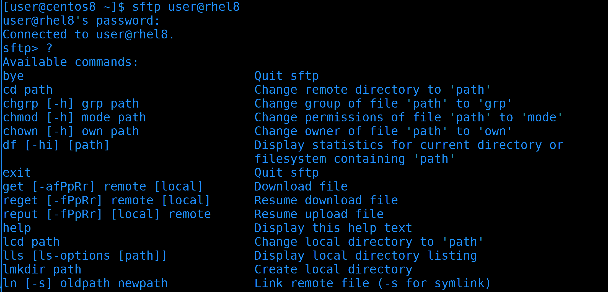

Ладно, перейдём к SFTP. Как я уже сказал, обычно он уже стоит и ничего доустанавливать не надо. Вообще, с помощью утилиты sftp можно подключаться к удалённой машинке. Тогда появляется консоль с определёнными командами, которые позволяют класть или забирать файлы с удалённом машинки, менять их права и многое другое. Но это не удобно для повседневного использования. Обычно с sftp работают через графические приложения.

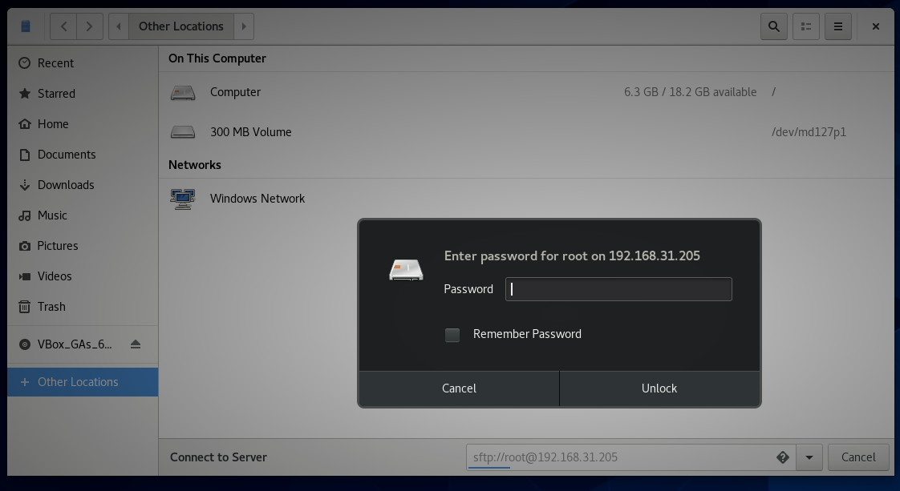

На Linux-е некоторые файловые менеджеры могут подключаться по SFTP. Откроем Nautilus, нажмём Other Locations и внизу в строке напишем следующее.

```
sftp://root@192.168.31.205
```

Как в браузере пишется http и https, так и тут можно написать протокол, двоеточие, два слэша, а дальше пользователя и адрес сервера. Программа запросит у нас пароль удалённого пользователя, после чего подключится.

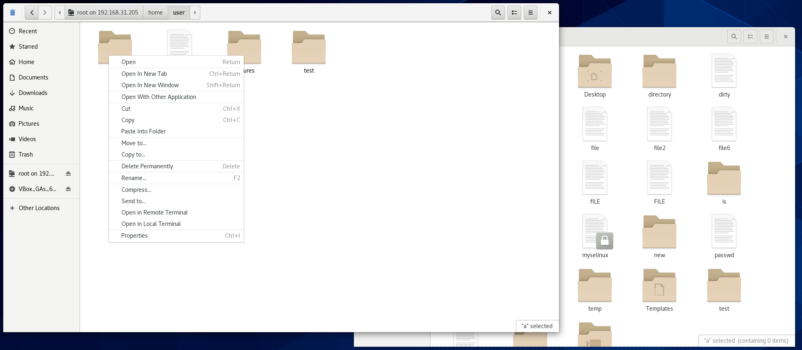

И теперь мы можем взаимодействовать с удалёнными файлами почти как с локальными.  Мы можем создавать директории, изменять текстовые файлы, копировать с локальной машины на удалённую и наоборот и всё в таком духе.

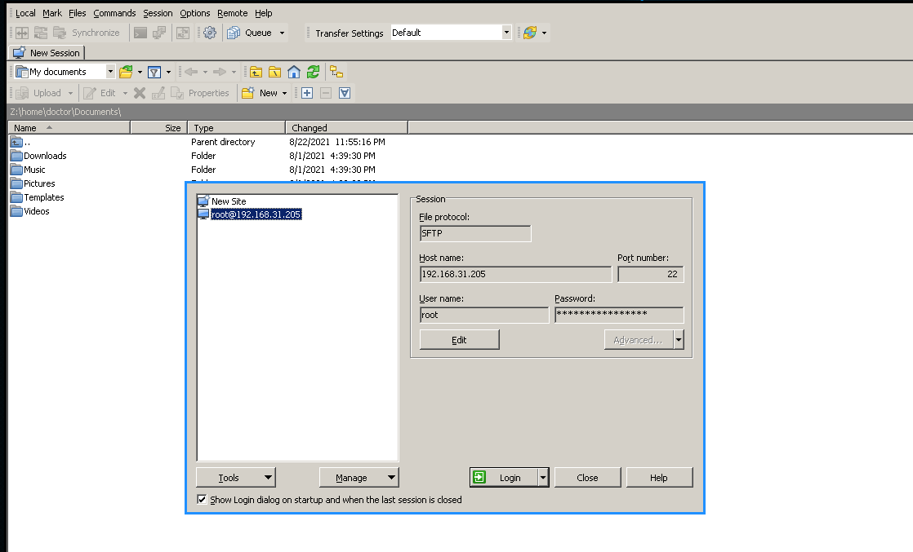

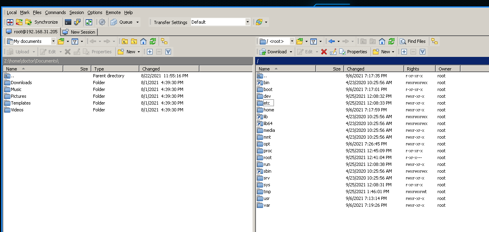

Если у вас основная система Windows, то вы также можете воспользоваться различными программами для подключения к SFTP. Одна из самых популярных - WinSCP - бесплатная и свободная программа. Здесь вы можете сохранить несколько сессий, пароли и прочее. Обычно все используют две панели, где слева - ваша система, а справа - удалённая. И вы простым перетягиванием можете копировать файлы и директории, ну и всячески взаимодействовать с ними.

#### rsync

Рассмотрим ещё одну утилиту - rsync. В основном её используют для синхронизации данных между двумя директориями или системами. Чем-то напоминает scp, но есть отличия. Представьте, что вы скопировали директорию с различными файлами из одной системы в другую, допустим, сделали бэкап. И за неделю какие-то файлы изменились и вам нужно опять перенести эти данные. scp опять скопирует все файлы с нуля, даже если в файл добавилась всего одна строчка. Если речь о десятках гигабайт и больше - то нужно огромное количество времени.

Если же вы используете rsync, в первый раз у вас точно также передадутся все файлы. Но в следующий раз программа перед передачей проверит отличия файлов, основываясь на разных размерах и дате модификации, используя алгоритм найдёт измененную часть файлов и передаст только её. В итоге во второй раз вместо повторных 10 гигабайт скопируется всего 1 мегабайт. Т.е. произойдёт синхронизация. Изменённые данные называются дельтами, как в математике.

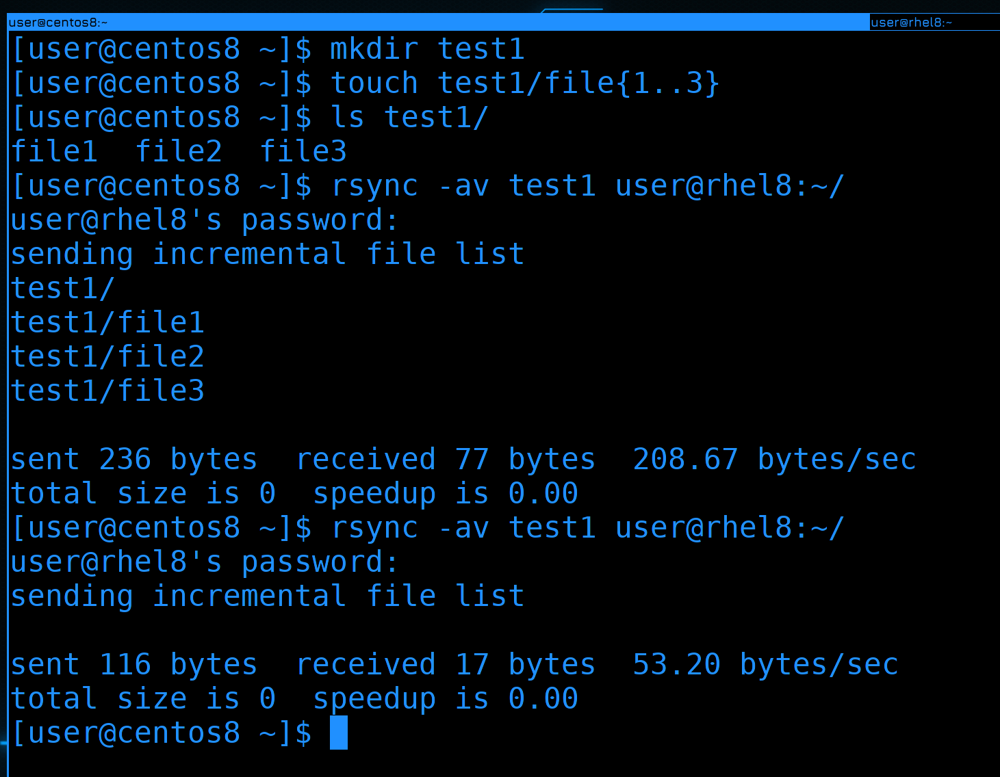

rsync тоже использует SSH для передачи данных. На самом деле он может и по другому работать, но сегодня мы разбираем только SSH. Чтобы rsync работал, он должен быть установлен на обоих системах. Давайте, для теста, создадим директорию и пару файлов в ней.

```bash
mkdir test1
touch test1/file{1..3}
ls test1
```

После чего использую rsync чтобы синхронизировать эту директорию на удалённую машину.

```bash
rsync -av test1 user@rhel8:~/
```

Синтаксис как у scp, но мы ещё использовали два ключа.

- Ключ -a - это чтобы скопировать рекурсивно, так как мы копируем директорию, плюс сохранить все права у файлов.
- Ключ -v - это verbose, чтобы мы видели, что скопировалось и какой объём этих данных.

Если мы попробуем ещё раз запустить эту команду, никаких файлов мы не увидим - потому что ничего не изменилось.

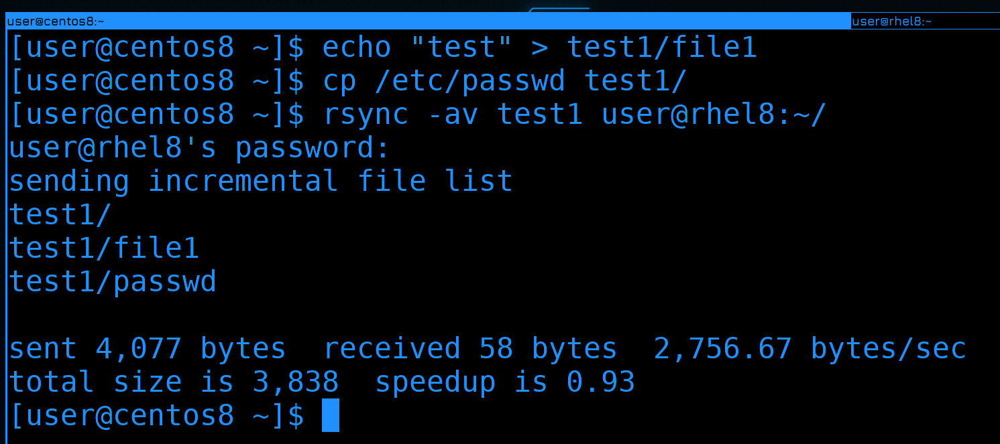

Теперь изменим один из файлов, что-нибудь в него запишем и ещё скопируем новый файл в эту директорию. После чего ещё раз запустим rsync:

```bash
echo test > test1/file1
cp /etc/passwd test1/
rsync -av test1 user@rhel8:~/
```

 Как видите, на этот раз передались всего 2 файла - новый и изменённый.

 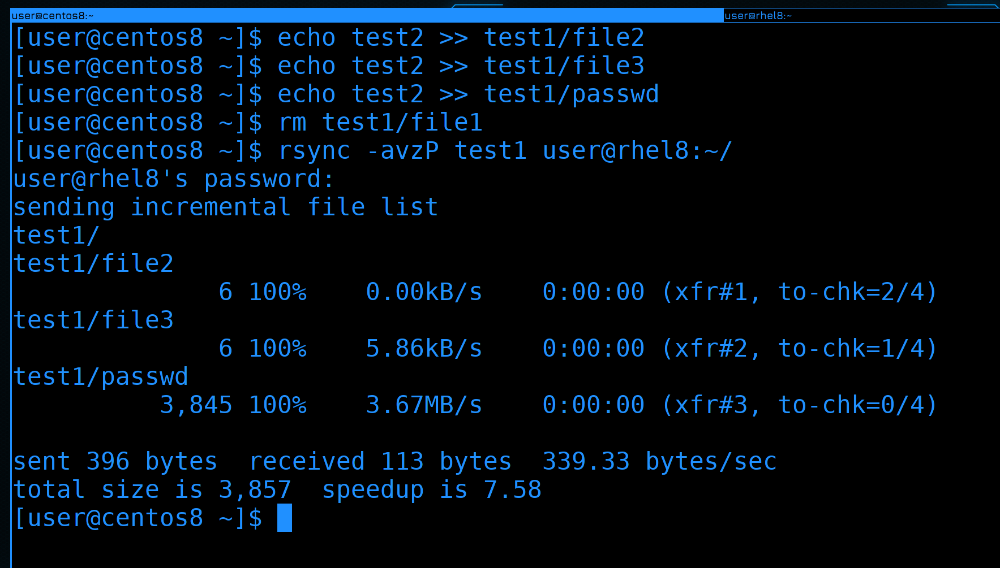

Давайте попробуем изменить ещё пару файлов, удалить один из них и ещё раз запустить синхронизацию.

```bash
echo test2 >> test1/file2
echo test2 >> test1/file3
echo test2 >> test1/passwd
rm test1/file1
rsync -avzP test1 user@rhel8:~/
```

На этот раз я добавил ещё два ключа:

- z - Сжимает данные перед отправкой.
- P - показывает прогресс. С маленькими файлами это не заметно, но если синхронизируется большой файл, будет легче понять, сколько перенеслось.

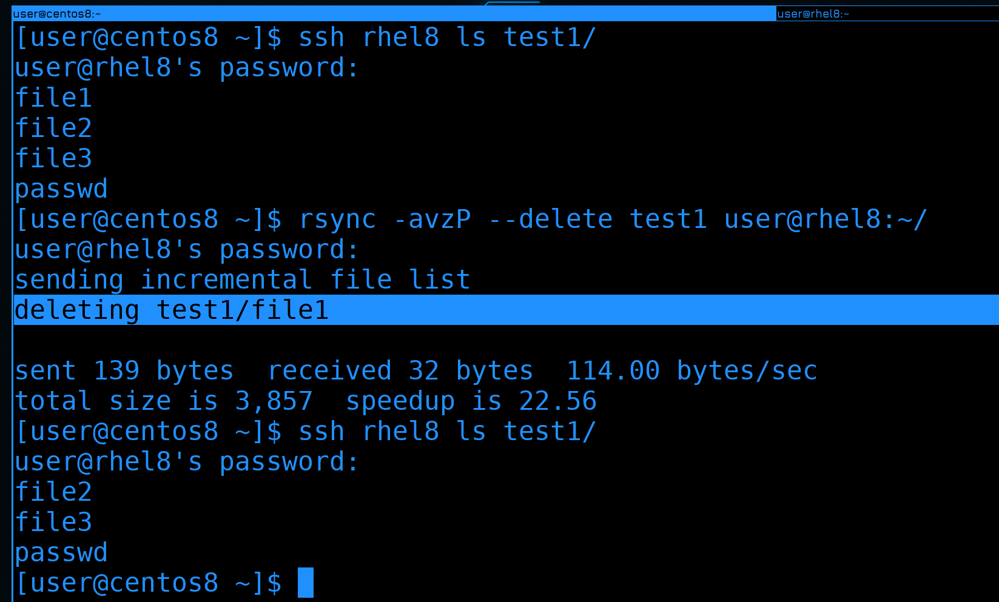

Только что мы удалили файл, а удалился ли он на той стороне? Давайте проверим:

```bash
ssh rhel8 ls test1/
```

 Как видите, хоть мы и удалили файл тут, синхронизация не удаляет файлы на той стороне. Но если мы хотим, чтобы файлы удалялись, добавим ключ --delete.

  ```bash
rsync -avzP --delete test1 user@rhel8:~/
ssh rhel8 ls test1/
```

В выводе видно, что команда удалила файл. Можем также убедиться в этом сами с помощью ls.

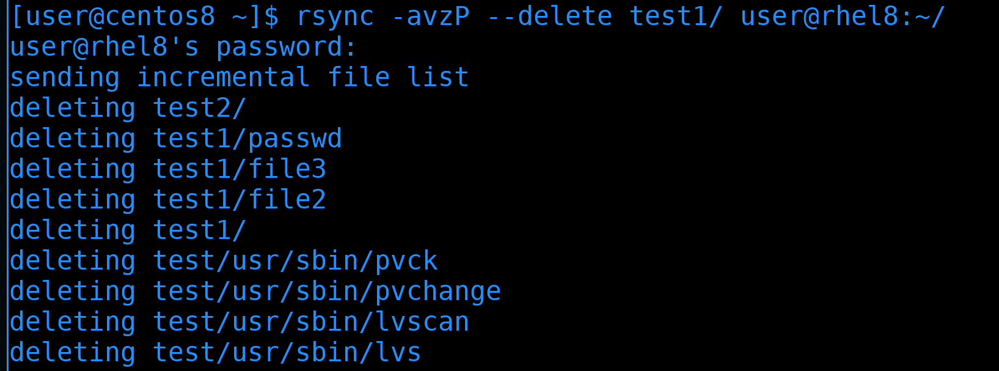

Работая с rsync важно помнить о слэше. Если вы не ставите слэш перед директорией, то копируется сама директория со всем содержимым. Если же поставить слэш, скопируется только содержимое директории. Обратите внимание, я просто поставил слэш после директории и это привело к тому, что все файлы в домашней директории удалённого пользователя удалились. Всё потому, что содержимое директории test1 копировалось в домашнюю директорию, а не в директорию test1. Из-за ключа delete rsync проверил, чтобы файлы в удалённой домашней директории соответствовали файлам в директории test1. Увидев, что есть лишние файлы, rsync просто их удалил. Поэтому будьте очень осторожны с этим.  

У rsync много функционала, но на пока достаточно. В целом это очень популярное решение как для бэкапа, так и для постоянной синхронизации данных между двумя серверами. Если scp для большого объёма данных не подходит, то rsync с этим справляется хорошо. Поэтому rsync можно добавить в планировщик и автоматизировать бэкапы, но не забудьте предварительно создать ssh ключи, потому что без них rsync будет просить пароль, а планировщик за вас пароль не введёт.

Давайте подведём итоги. Сегодня мы разобрали различные инструменты для передачи файлов по сети. scp часто используется для передачи небольших файлов, sftp это больше функционал, который позволяет удалённо работать с файлами, а rsync позволяет синхронизировать данные не используя много трафика. Все они используются очень часто, поэтому важно уметь ими пользоваться.
