

Как мы выяснили, NFS в основном используется в линуксовой среде и не очень годится для совместной работы пользователей с файлами. В компаниях большинство пользователей используют Windows, где права устроены иначе. И в таком окружении почти всегда используется протокол SMB (Server Message Block), который годится не только для работы с файлами, но и с принтерами. Вместо того, чтобы устанавливать на всех компьютерах драйвера от принтеров, достаточно это сделать на одном сервере. Компьютеры будут посылать запросы на этот сервер, а сервер будет печатать на принтерах. 

SMB также часто называют CIFS (Common Internet File System). Зачастую файловую шару с SMB поднимают на Windows серверах, но и на Linux-ах она не редкость. Как и в случае с NFS, файловые шары это просто директории, доступные по сети. Но права здесь работают абсолютно иначе. SMB - это лишь протокол, а для его работы нужна программа. 

##### Установка

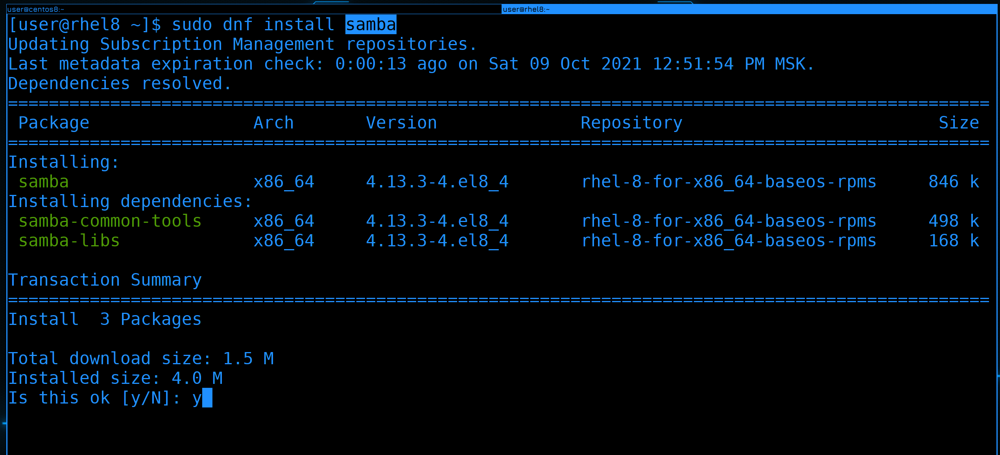

На Linux-ах она называется samba. Давайте для начала поднимем файловый сервер на rhel-е:

```bash
sudo dnf install samba
```

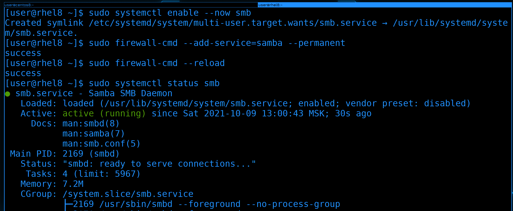

После установки включим и запустим сервис, который называется smb. А на файрволе добавим сервис samba. 

```bash
sudo systemctl enable --now smb
sudo firewall-cmd --add-service=samba --permanent
sudo firewall-cmd --reload
```

Обратите внимание, почти тоже самое мы делали для NFS. На самом деле это стандартные действия - каждый раз, когда вы устанавливаете какую-то программу-сервер, вам нужно добавить её в автозапуск, прописать на файрволе и запустить. На других дистрибутивах зачастую сервис автоматом запускается и добавляется в автозапуск, а файрвол не установлен по умолчанию. Но делать это вручную всё таки лучше, это помогает запомнить и немного учит дисциплине.

##### smb.conf

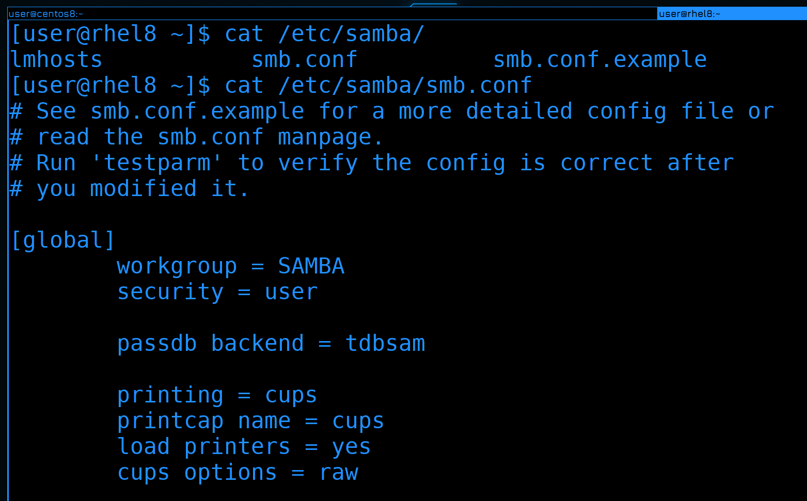

Основные настройки лежат в директории /etc/samba в файле smb.conf.

```bash
cat /etc/smb.conf
```

В отличии от NFS здесь настроек много, но всё это знать наизусть не нужно. Основные параметры разберём сегодня, а некоторые вещи оставим на потом.

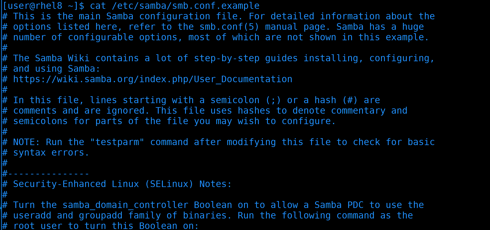

В соседнем файле smb.conf.example есть объяснение всех параметров, которые указаны в основном файле. Ну и в мане по smb.conf можно найти более детальную информацию. Стоит упомянуть, что sambу можно тесно связать с виндовой сетью, привязав её к домену или даже сделать из неё контроллер домена. Грубо говоря, в компаниях все компьютеры объединяют в одну сеть, называемую доменом. В этой сети есть специальные сервера, называемые "контроллер домена", которые могут централизовано управлять всеми компьютерами компании - хранить учётки пользователей, настраивать компьютеры, выдавать доступы и т.д. и т.п. И не мало настроек sambы связаны с этим функционалом, который нам сейчас не нужен. Поэтому мы и пропустим некоторые параметры, сейчас samba интересует нас только как файловый сервер.

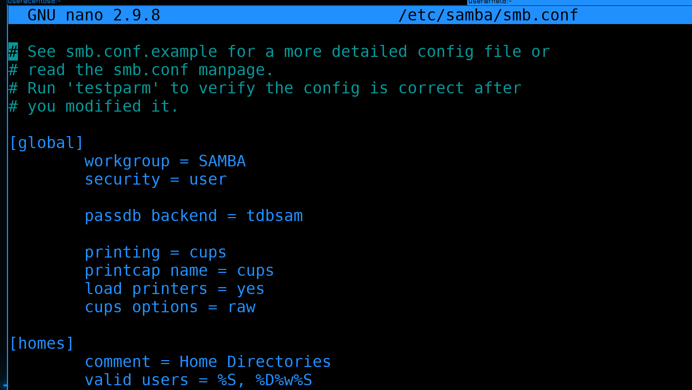

Перейдём в smb.conf. Файл состоит из секций и параметров. Секции указаны в квадратных скобках. В секции [global] указаны параметры, относящиеся к самой самбе, а также дефолтные параметры для всех остальных секций. К примеру, параметр security можно указывать только в global. Остальные секции считаются "шарами", т.е. там указаны конкретные ресурсы, которыми делятся  - директории и принтеры. Скажем, если в секции global указать параметр read only, он будет по по-умолчанию во всех секциях, если конечно в них не указано другое значение. Кстати, файл регистронезависимый, т.е можно писать и большими буквами, и маленькими. Пройдёмся по параметрам секции [global]. 

-  Workgroup - это рабочая группа - упрощённый вариант домена, когда нет централизованного управления, но компьютеры должны друг с другом делиться файлами, принтерами и т.п. Не то, чтобы компьютеры без этого не общаются, но те, кто входят в одну группу, могут находить друг друга в одной сети, видеть, кто чем делится и всё такое. Но workgroup-ы нацелены на домашнее использование или на компании где меньше 20 компьютеров и сейчас они практически не используются. Но чтобы это полноценно работало, надо ещё включать сервис nmb.

- security - в зависимости от того, является ли samba самостоятельным файловым сервером, или частью домена, или работает с Керберосом, пользователи по разному подтверждают доступ. Если это самостоятельный файловый сервер, значение будет user. 

- passdb backend - указывает  на механизм хранения аккаунтов. В зависимости от значения используется файл или LDAP сервер. 

Дальше пара параметров относящиеся к печати. Мы это сегодня разбирать не будем, поэтому я просто сотру эти строки. 

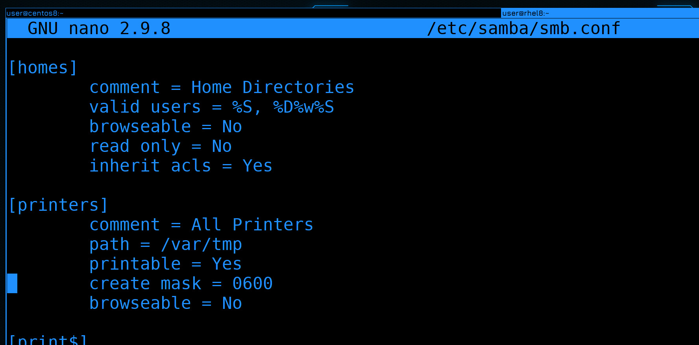

Дальше идут две специальные секции - homes и printers. Всё что касается принтеров сотрём, оставим только секции global и homes.

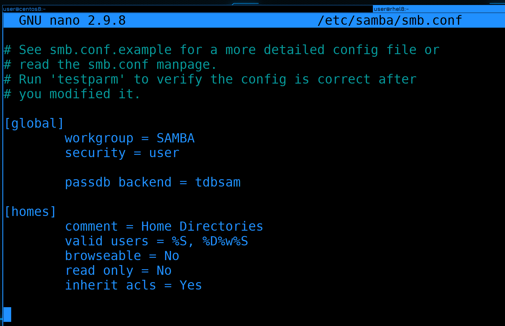

Как можно догадаться, здесь указаны домашние директории пользователей. Т.е. те кто будет заходить на SMB сервер, будут видеть свои домашние директории.

- сomment - это просто комментарий к шаре, виден для клиентов. 

- valid users - пользователи, которым разрешено подключаться к этой шаре. Здесь можно указывать пользователей и группы. Если этого параметра нет, то любой пользователь сможет подключаться. homes - это особая секция. Когда кто-то подключается к файловому серверу, вся эта секция homes копируется для него, но уже с его логином. Это происходит в памяти, а не в этом файле. Условно, если подключился user1, то появится секция [user1] со всеми параметрами секции homes. И здесь %S - это переменная, указывающая на название секции. Т.е. для user1 valid users будет user1, соответственно у него будет разрешение зайти в эту шару. %D%w%S - тоже указывает на юзера, но с учётом его Workgroup-пы. 

- browseable - SMB позволяет увидеть список доступных шар, как это показывал showmounts для NFS. Если стоит No, то при подключении нужно вписывать имя шары. Если стоит Yes, то можно просто увидеть эту шару в списке доступных. Но, как я говорил, homes это особая шара - хотя здесь стоит нет, т.е. все домашние директории не видны, но когда кто-то логиниться, лично для него значение меняется на yes и он видит только свою домашнюю директорию.

- read only - доступна ли шара только для чтения. Кстати, у read only есть антоним writeable - т.е. можно написать либо read only = No, либо writeable = Yes, разницы никакой. 

- inherit acls - наследовать ли дефолтные acl-ы от директорий. 

В теме о правах мы говорили, что стандартных UNIX-овых прав не всегда хватает, особенно это заметно на файловых серверах, где множество пользователей и групп. acl-ы решают эту проблему - мы можем выдать с помощью команды setfacl права для других пользователей и групп.

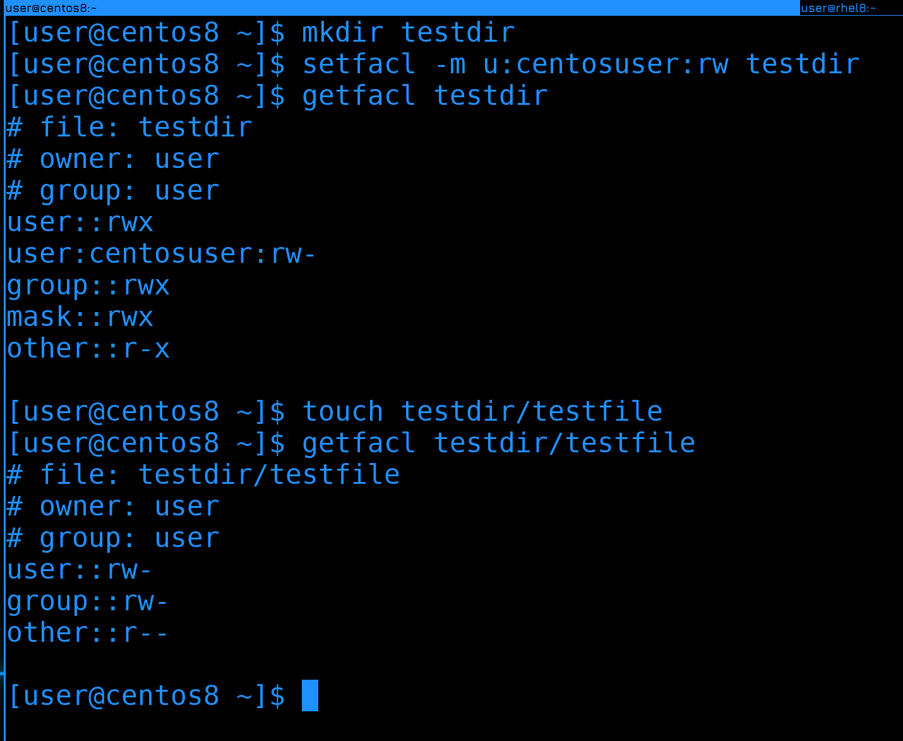

Давайте, для примера, создадим директорию testdir и дадим пользователю centosuser rw права на эту директорию с помощью setfacl. 

```bash
setfacl -m u:centosuser:rw testdir
getfacl testdir
```

Посмотрим - getfacl - как видно, права сработали. Но что, если создать файл в этой директории? Будет ли он иметь такие же права? Унаследует ли он acl-ы?

```bash
touch testdir/testfile
getfacl testdir/testfile
```

Как видите, нет. И это очень неудобно, вы создали директорию, дали нескольким пользователям доступ к ней. И когда пользователи будут создавать свои файлы внутри, у новых файлов права будут стандартные и придётся вечно подправлять права на новые файлы.

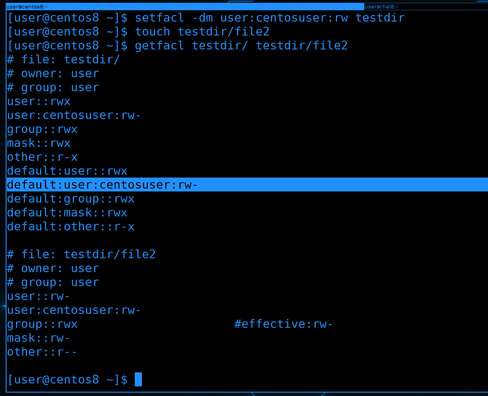

Поэтому на директории можно поставить acl-ы как дефолтные, с ключом -d.

```bash
setfacl -dm user:centosuser:rw testdir
touch testdir/file2
getfacl testdir testdir/file2
```

Это не повлияет на существующие файлы, но все новые файлы будут иметь такие же acl-ы, как и директория. 

Так вот, inherit acls как раз об этом - будут ли наследоваться права директории на новые файлы внутри.

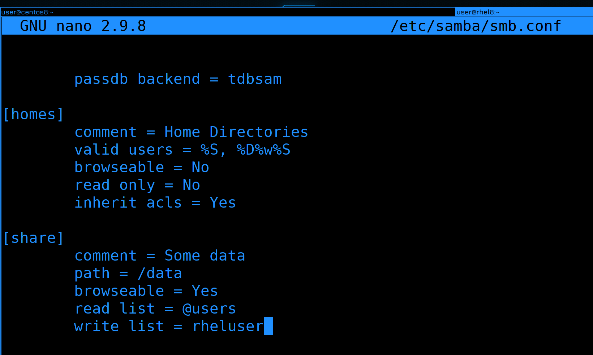

Давайте создадим свою шару.

```
[share]
    comment = Some data
    path = /data
    browseable = Yes
    read list = @users
    write list = rheluser
```
Назовём её share и пропишем какой-нибудь комментарий. Нужно указать путь к директории, которая будет раздаваться - пусть будет /data, для этого параметр path. И пусть она будет видима - browseable = Yes. 

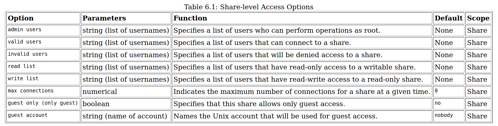

Пропишем два списка - read list и write list, соответственно, кому можно только смотреть и кому можно изменять содержимое. write list от valid users отличается тем, что даёт права на изменение даже если сама шара read only. Перед группой ставится собачка - @users. То есть это просто локальные пользователи и группы.

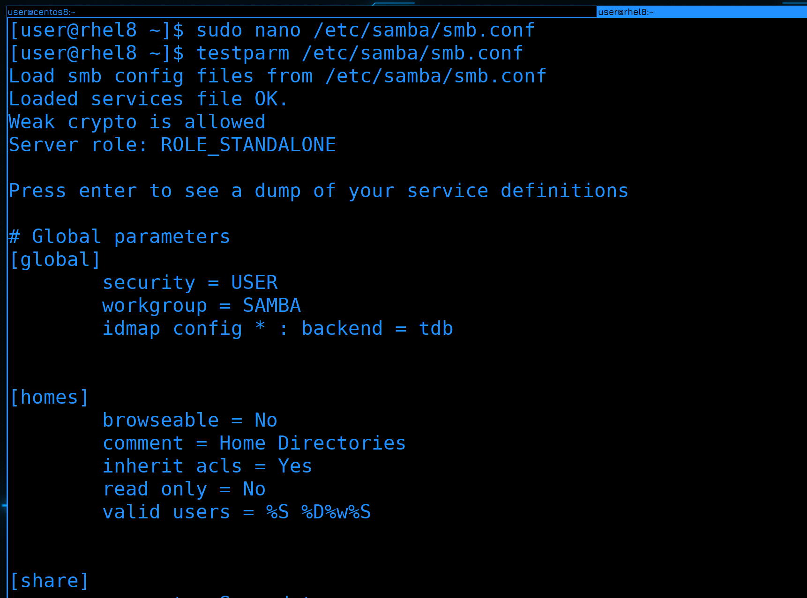

Сохраним и выйдем. Чтобы проверить синтаксис, мало ли мы где-то опечатались, есть утилита testparm:

```bash
testparm /etc/samba/smb.conf
```

Хотя указывать на дефолтный конфиг не обязательно, но полезно знать, чтобы проверять файлы с другим именем и директорией. Как видите, всё ок, и после нажатия Enter мы видим наши шары. 

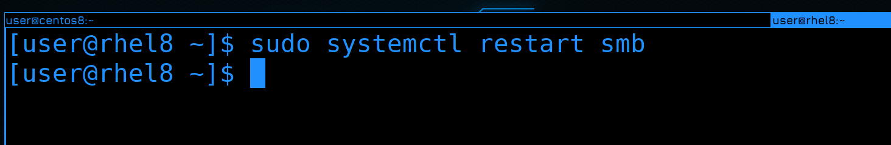

После чего не забудем перезапустить сервис.

```bash
sudo systemctl restart smb
```


Ещё один важный пункт. Хотя сейчас используются системные пользователи, но пароли для sambы надо создавать отдельно, с помощью команды smbpasswd:

```bash
sudo smbpasswd -a rheluser
```

При первом добавлении пароля надо указывать ключ -a, а для смены этот ключ не нужен. Системный пароль и пароль от самбы могут отличаться, но у пользователя должен быть системный пароль, хотя в качестве shell-а у него может быть nologin.

##### samba-client


Теперь пойдём на Centos и попробуем посмотреть список доступных шар. Для этого нужен samba клиент:

```bash
sudo dnf install samba-client
```

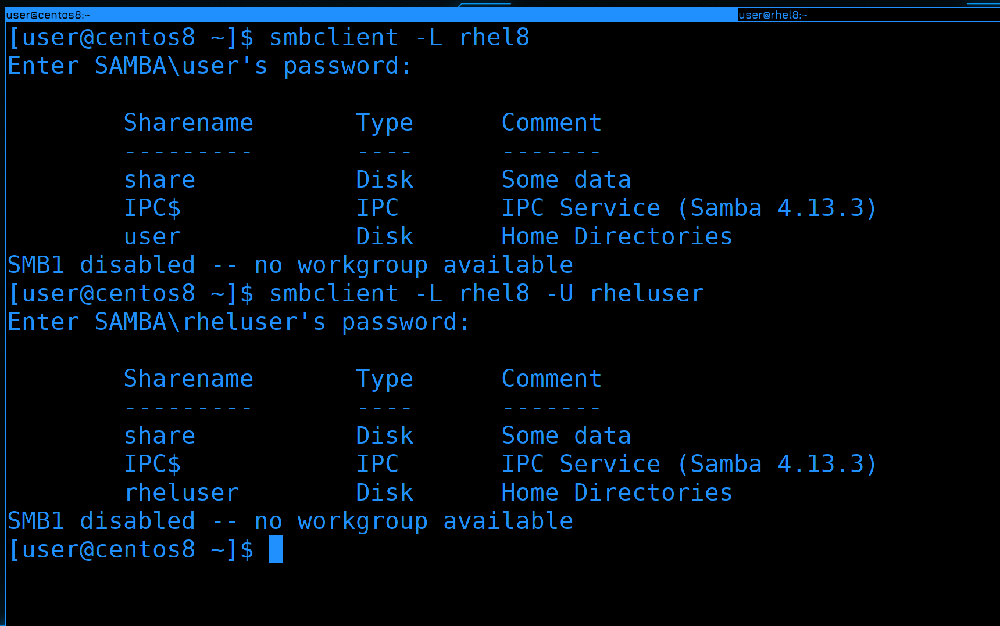

И так, используем smbclient с ключом -L чтобы посмотреть список доступных шар на rhel-е:

```bash
smbclient -L rhel8
```

Сервер у нас запросит пароль, но мы можем проигнорировать и просто нажать enter, тогда мы увидим те шары, на которых browseable = Yes. Сейчас мы видим share, который мы создали, user  потому что соответствует нашему пользователю и IPC. IPC это не файловая шара, а функционал SMB, который используется для сетевого обнаружения и подключения. Т.е. его просто игнорируем.

Теперь попробуем ещё раз посмотреть список доступных шар, но уже используя пользователя rheluser, для этого используем ключ -U - user:

```bash
smbclient -L rhel8 -U rheluser
```

Как видите, теперь видим домашнюю директорию пользователя rheluser. Теоретически, там может быть ещё множество невидимых директорий, для которых параметр browseable имеет значение no, но при монтировании мы можем их указать и получить доступ.

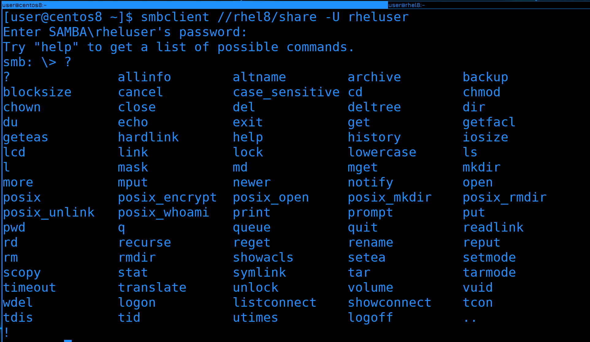

smbclient чем-то напоминает sftp и может подключаться к командной строке, в которой доступны опрелённые команды для работы с файлами:

```bash
smbclient //rhel8/share -U rheluser
```

Обратите внимание, как указывается путь к шаре - два слэша адрес сервера, затем один слэш и адрес шары.  Т.е. с этой стороны мы не знаем, где именно на сервере находится директория. Здесь, после адреса сервера, мы указываем название секции в smb.conf, ну или своего пользователя.

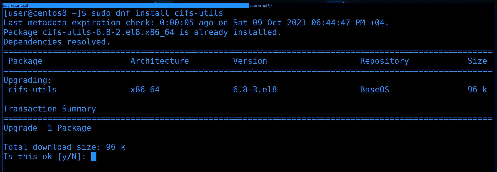

Для того чтобы примонтировать шару, нужен пакет cifs-utils:

```bash
sudo dnf install cifs-utils
```

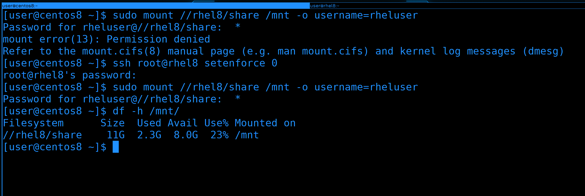

После установки попробуем примонтировать:

```bash
sudo mount //rhel8/share /mnt -o username=rheluser
```

Обратите внимание, что при монтировании нужно указывать опцию username, чтобы монтировать от имени определённого пользователя на сервере, для которого мы делали smbpasswd. 

##### SElinux

На этот раз монтирование не сработало, мол, отказано в правах. Тут дело в selinux-е и в smb.conf.example об этом говорится, на сервере надо вешать на директорию определённый контекст, чтобы самба мог раздавать эту директорию. Давайте убедимся, что дело в selinux - просто временно переведём его в permissive режим:

```bash
ssh root@rhel8 setenforce 0
sudo mount //rhel8/share /mnt -o username=rheluser
df -h /mnt
```

Как видите, теперь всё примонтировалось. По началу вы можете сталкиваться с ситуациями, когда вы всё правильно настроили, но ничего не работает, какие-то ошибки прав. В такие моменты вы можете попробовать сделать setenforce 0 и проверить, не в selinux-е ли дело.

Окей, предположим, мы поняли, что дело в SElinux. Как это исправить? 

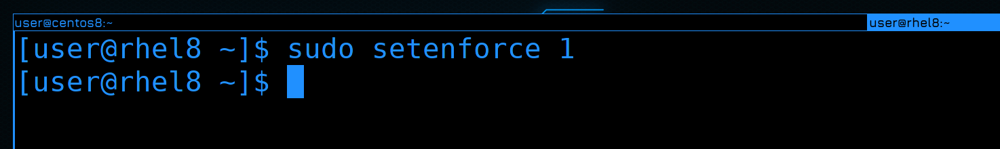

Давайте, сперва, заново включим selinux:

```bash
sudo setenforce 1
```

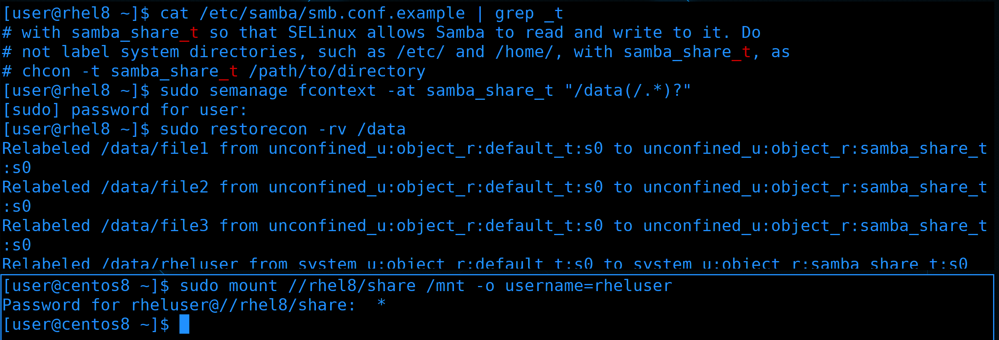

Легче всего подсмотреть в конфиге. И так, мы знаем, что надо подправить контекст для директории. Надо просто найти нужный тег. Контекст с тегом заканчивается на _t, и как-то связан с самбой. Если поискать grep-ом в конфиг файле, можно найти нужное:

```bash
cat /etc/samba/smb.conf.example | grep _t
```

Конечно, это сработает не всегда, но вот сейчас сработало. Не факт что это тот самый нужный тег, но если зайти в файл и прочесть, можно в этом убедиться. Правда мы помним, что chcon не лучший вариант, так как он может сброситься, поэтому возьмём контекст и воспользуемся командой semanage:

```bash
sudo semanage fcontext -at samba_share_t "/data(/.*)?"
sudo restorecon -rv /data
```

Ну и когда речь идёт о директориях, не забываем прописать к ним специальное выражение, его всегда можно подглядеть в man semanage-fcontext. После изменений попробуем примонтировать:

```bash
sudo mount //rhel8/share /mnt -o username=rheluser
```

Теперь всё работает.

##### Права

Поговорим о правах. Если в NFS работают UNIX-вые права, то в SMB права как бы раздваиваются на локальные и серверные. Я примонтировал шару от имени серверного пользователя rheluser, а значит с точки зрения сервера, все мои действия с файлами будут происходить от имени этого пользователя. При этом на локальной машине действуют локальные права. Я примонтировал в /mnt от рута, значит только он сможет изменять файлы. Звучит сложно, но пара примеров всё объяснят. 

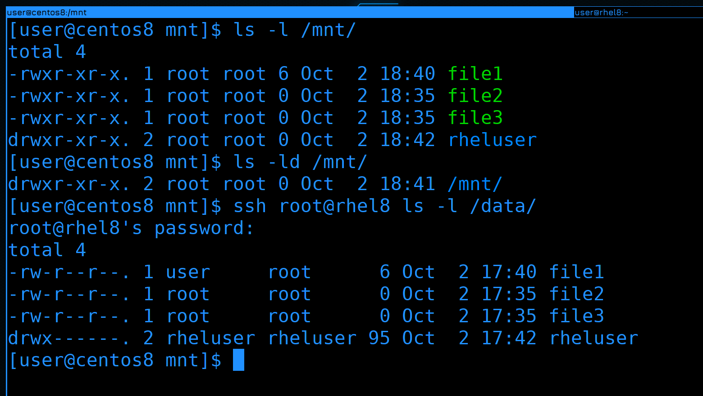

Для начала проверим права файлов в /mnt, ну и права самой директории:

```bash
ls -l /mnt
ls -ld /mnt
```

Обратите внимание, что всё что здесь есть принадлежит пользователю root, остальные пользователи могут только просматривать. Если же посмотреть как обстоят дела на сервере:

```bash
ssh root@rhel8 ls -l /mnt
```

можно заметить, что у каких-то файлов владелец root, а у каких-то user и rheluser. И даже сами права отличаются - на centos-е у файлов есть execute права, т.е. права 755, а на rhel-е нет - там 644.

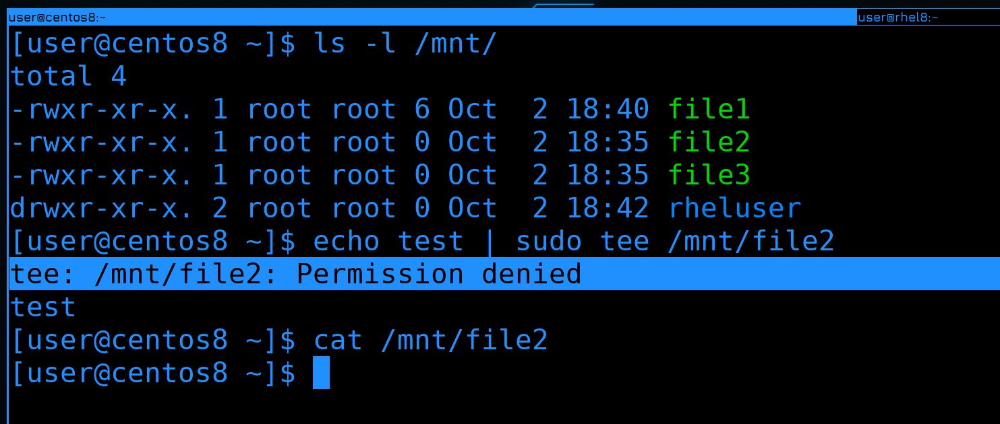

Видите, что у пользователя root есть право изменять file2? Давайте попробуем это сделать:

```bash
echo test | sudo tee /mnt/file2
cat /mnt/file2
```

Но у нас ошибка прав - ничего не изменилось. Почему? Потому что у пользователя rheluser на сервере нет прав изменять этот файл. Т.е. какой-бы  пользователь не был со стороны клиента, какие-бы права у него не были локально, права на сервере важнее.

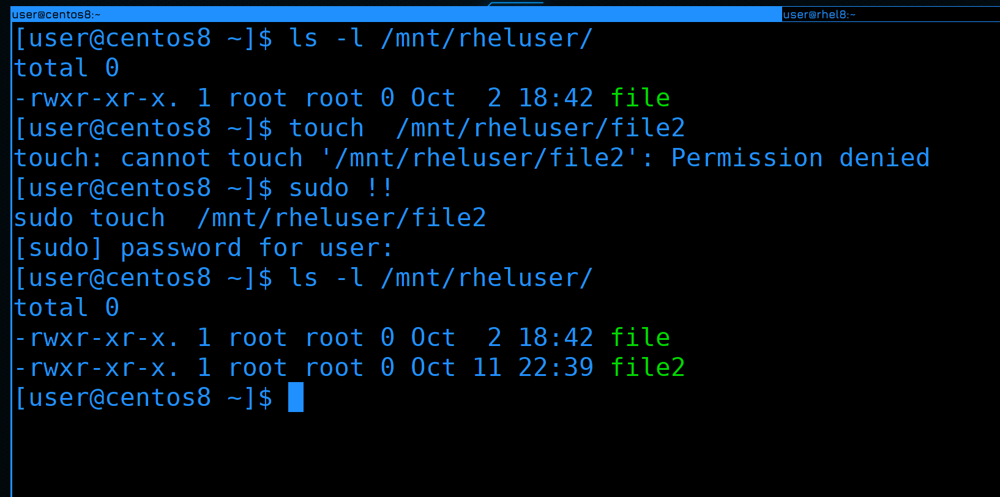

Теперь о правах со стороны клиента. У пользователя rheluser есть права на директорию /mnt/rheluser. Но со стороны клиента права есть только у рута. Если я попытаюсь что-то создать от имени обычно пользователя:

```bash
touch /mnt/rheluser/file2
```

ничего не получится, мне откажет в правах клиентская система. А вот root уже может работать в этой директории:

```bash
sudo touch /mnt/rheluser/file2
```

Т.е. сначала проверяются локальные права на стороне клиента Если нет - то отказывается в правах. Если же у локального пользователя с правами всё окей, на сервере проверяются права того, чьим именем примонтировали эту шару, т.е. пользователя rheluser.

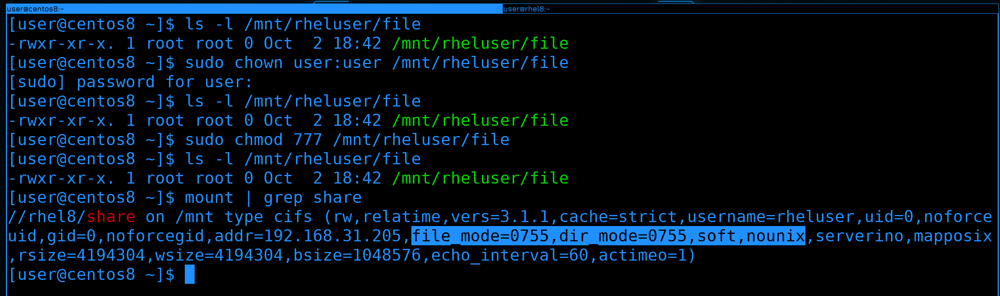

А давайте попробуем на клиенте выдать права. Скажем, поменять владельца или выставить максимальные права:

```bash
sudo сhown user:user /mnt/rheluser/file
sudo сhmod 777 /mnt/rheluser/file
ls -l /mnt/rheluser/file
```

Команды вроде бы срабатывают, но в результате ничего, ничего не меняется. Со стороны клиента нельзя менять права стандартными утилитами, не получится chmod-ом или chown-ом поменять что-то локально или удалённо. Права в SMB больше рассчитаны на виндовые, поэтому всякие uid-ы и gid-ы не работают так, как мы привыкли. 

Но это не значит, что может работать только root. То что касается прав на стороне клиента настраивается в опциях монтирования. Давайте их посмотрим:

```bash
mount | grep share
```

Во-первых, обратите внимание на опцию nounix. В старой версии протокола SMB версии 1 можно задать, чтобы цеплялись юниксовые права между сервером и клиентом, как это сделано в NFS. Опция nounix отключает использование этого. Ну и в современных версиях протокола это всё равно не будет работать. Кстати, сейчас в основном используется SMB версии 3.1, хотя где-то используются и более старые версии.

Во-вторых, взгляните на опции file_mode и dir_mode, где указаны права 755. Помните, у файлов в mnt были права 755? Т.е. какие будут права локально выдаются именно этими параметрами при монтировании. Допустим, можно указать при монтировании, чтобы file_mode был 777, и тогда на стороне клиента любой пользователь сможет работать со всеми файлами в шаре, потому что в /mnt будет rwxrwxrwx. Конечно, не стоит забывать, что и на сервере есть проверка прав, от чьего имени примонтирована шара. 

Ну и в-третьих, на что особенно стоит обратить внимание, так это на опции uid и gid, которые равны 0. Они как раз указывают, на какого локального пользователя нужно цеплять эту шару. Т.е., то что на локальной системе у всех файлов в /mnt владелец и группа root - благодаря этим опциям. И да, мы можем поставить другие значения. Давайте это и сделаем. 

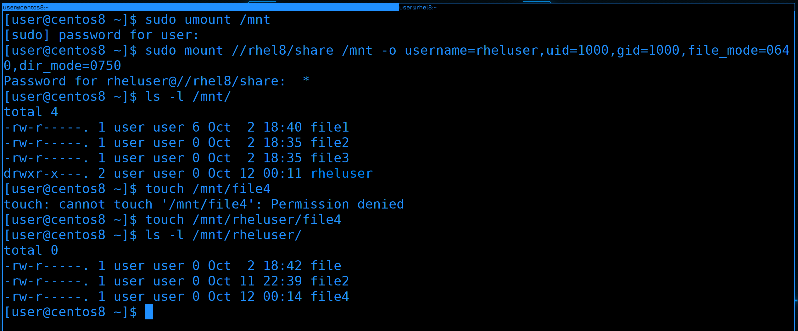

Для начала отмонтируем шару:

```bash
sudo umount /mnt
```

Затем попробуем примонтировать с новыми опциями:

```bash
sudo mount //rhel8/share /mnt -o username=rheluser,uid=1000,gid=1000,file_mode=0640,dir_mode=0750
```

Давайте прочтём, что мы написали:

- username - пользователь на сервере, кем мы логинимся и чьи файлы нам нужны. 

- uid и gid - 1000 - это наш локальный пользователь и группа на Centos, у кого будут права на примонтированные файлы и директории. 

- file_mode и dir_mode - с какими правами будут эти примонтированные файлы и директории. 

Теперь проверим:

```bash
ls -l /mnt
touch /mnt/file4
touch /mnt/rheluser/file4
ls -l /mnt/rheluser
```

И так, теперь файлы в /mnt принадлежат пользователю user и он сможет с ними работать без sudo прав. Но в /mnt мы по прежнему не можем создавать файлы - опять же, потому что у пользователя rheluser на сервере нет таких прав в директории /data. Зато в директории /mnt/rheluser мы можем спокойно создать файл нашим пользователем, и в целом делать всё, что можно пользователю rheluser.

##### fstab

Но, конечно же, сам пользователь user без root прав не смог бы примонтировать директорию. Нам стоит добавить эту запись в fstab, чтобы монтировалось автоматом, при включении. Но тут есть нюанс - в NFS пароль нам не нужен был, а с SMB то нужно указывать пароль пользователя rheluser. Да, конечно, мы можем прописать пароль в опциях монтирования в fstab просто опцией password, но ведь fstab доступен для чтения всем пользователям. Не хорошо светить паролем. Поэтому надо кое-что подготовить. 

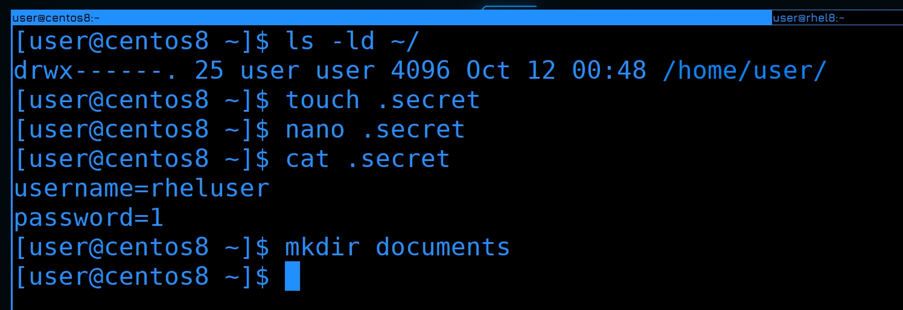

Для начала создадим файл, где будут храниться логин и пароль пользователя rheluser. Тут зависит от того, должен ли user на локальной системе знать пароль или нет. Если знает - то можем создать в его домашней директории, как раз она доступна для чтения только им и root-ом:

```bash
ls -ld ~/
```

Если же пользователь не должен знать пароль, то можно где-нибудь в системе, скажем, в /etc, создать файл, доступный для чтения только root-ом. Для примера, я создам файл у самого пользователя в домашней директории и пропишу в нём логин и пароль. 

```bash
nano .secret
```

```
username=rheluser
password=1
```

И здесь пишем - username=rheluser, а на следующей строчке password= и указываем пароль. С echo заполнять файл не стоит, так как это может остаться в истории. Ну и заодно создадим точку монтирования:

```bash
mkdir documents
```

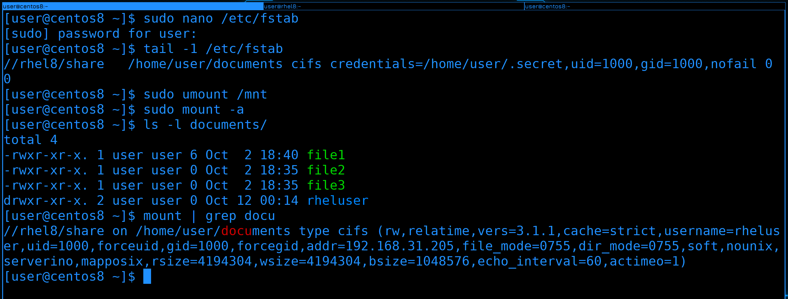

Теперь идём в fstab и прописываем строчку:

```
//rhel8/share /home/user/documents cifs credentials=/home/user/.secret,uid=1000,gid=1000,nofail 0 0
```

И так, в качестве типа файловой системы указываем cifs. Вместо username и password указываем опцию credentials, в которой указываем полный путь к файлу с логином и паролем. Также добавим опцию uid и gid, чтобы монтировалось от имени юзера, а не рута. file_mode и dir_mode не обязательно добавлять, всё равно в эту директорию никто кроме юзера не сможет зайти из-за прав на его домашнюю директорию. Ну и указываем nofail, чтобы проблемы в сети не приводили к проблемам с запуском системы.

Теперь отмонтируем и убедимся, что мы нигде не ошиблись:

```bash
sudo umount /mnt
sudo mount -a
ls -l documents
mount | grep docum
```

Я вижу файлы в documents и вижу, что шара примонтирована куда нужно. Значит всё работает.

##### Windows

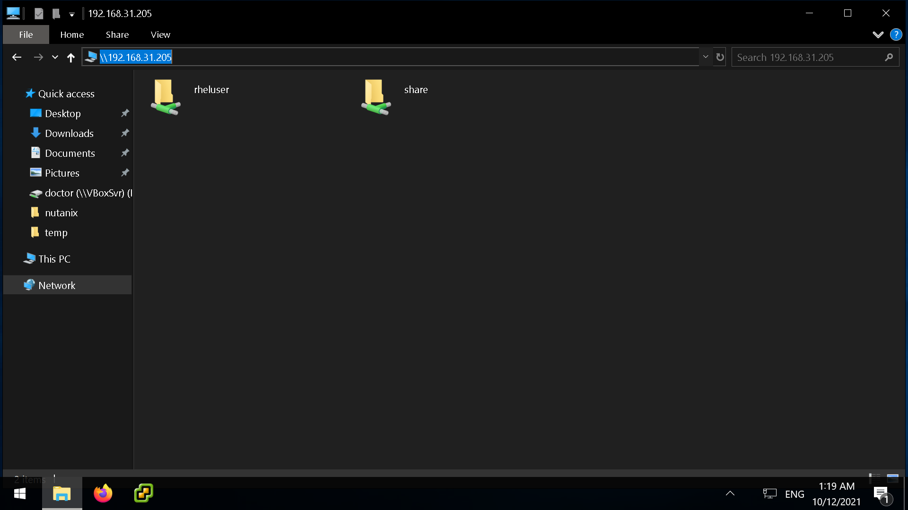

Ну и напоследок стоит показать, как монтировать эту шару на Windows. Тут уже вместо прямых слэшей используются обратные. Нужно открыть проводник и в поле адреса указать ip адрес сервера. Можно и по имени, но я это не настраивал. Плюс, можно сразу указать полный адрес шары, а можно указать только адрес сервера, и тогда мы после логина увидим все доступные сервисы.

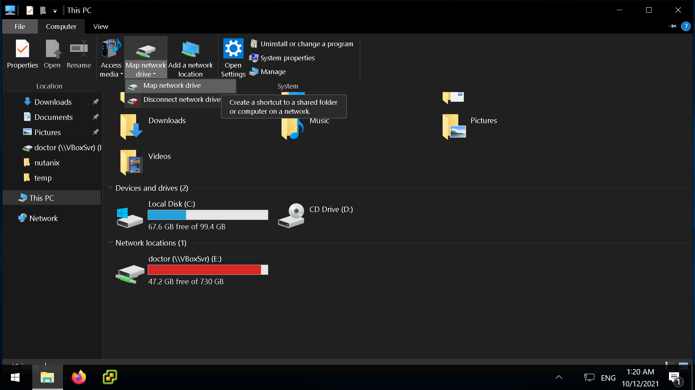

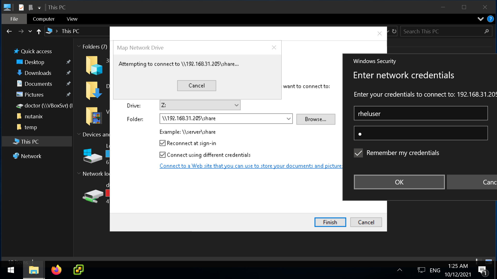

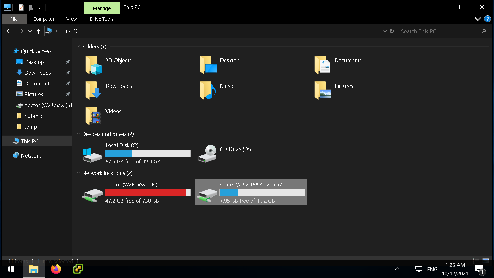

Ну а чтобы шара была видна всегда в окне "Мой компьютер", нажимаем сверху Computer  - Map Network Drive - и указываем адрес шары - \\\192.168.31.205\share. Так как логин пользователя Windows отличается от rheluser, ставим галочку "использовать другой логин". После чего вводим логин и пароль. Теперь всё готово.

Давайте подведём итоги. Сегодня мы с вами разобрали протокол SMB и в частности программу samba. Это может показаться сложной темой, здесь относительно большой функционал и много опций, особенно сравнивая с предыдущими нашими темами. Не говоря уже о том, что мы многое оставили на потом. Плюс различия с точки зрения прав могут запутывать. Но вам не нужно знать все опции наизусть, всегда есть маны и интернет под рукой. Попрактикуйтесь пару раз и всё вам станет понятнее.    