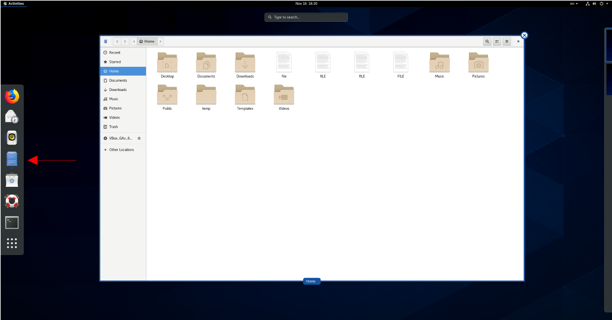
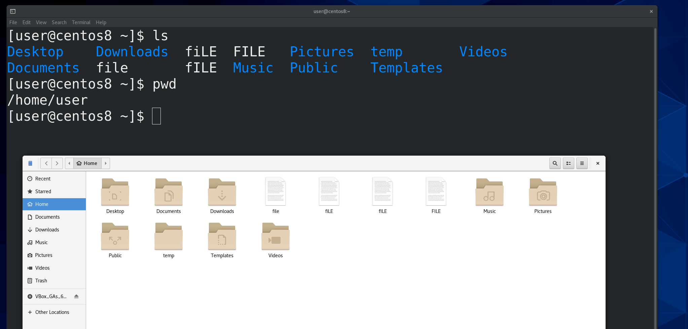
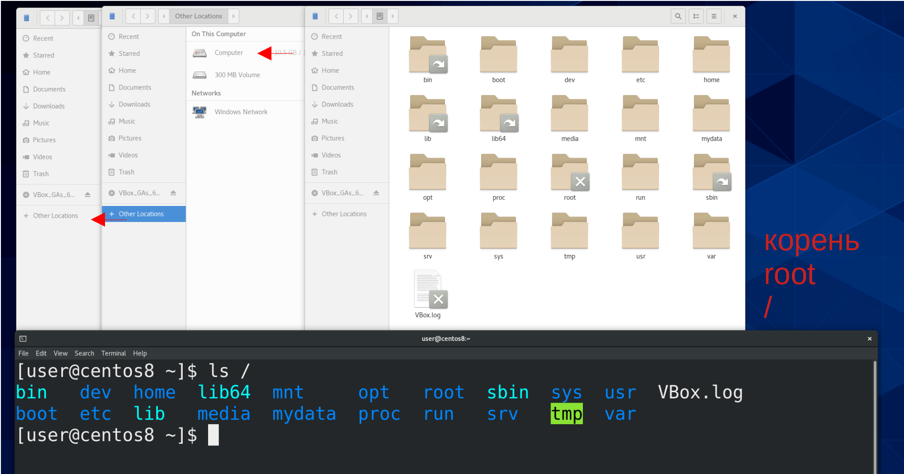
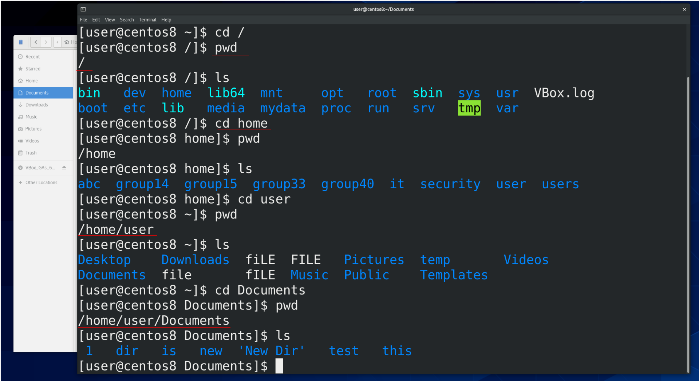
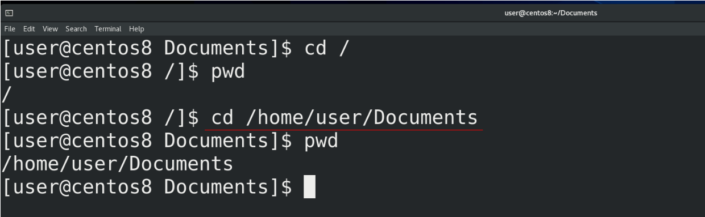
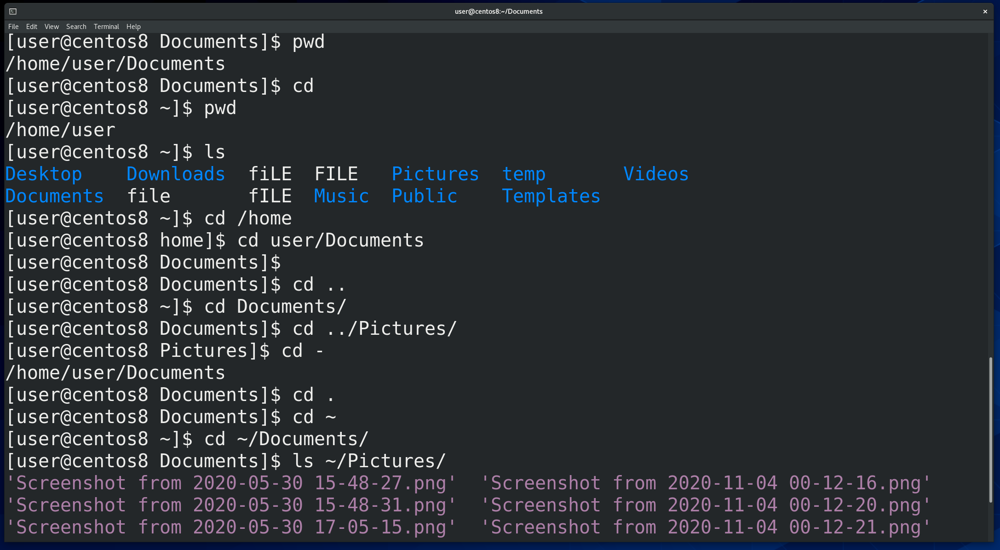
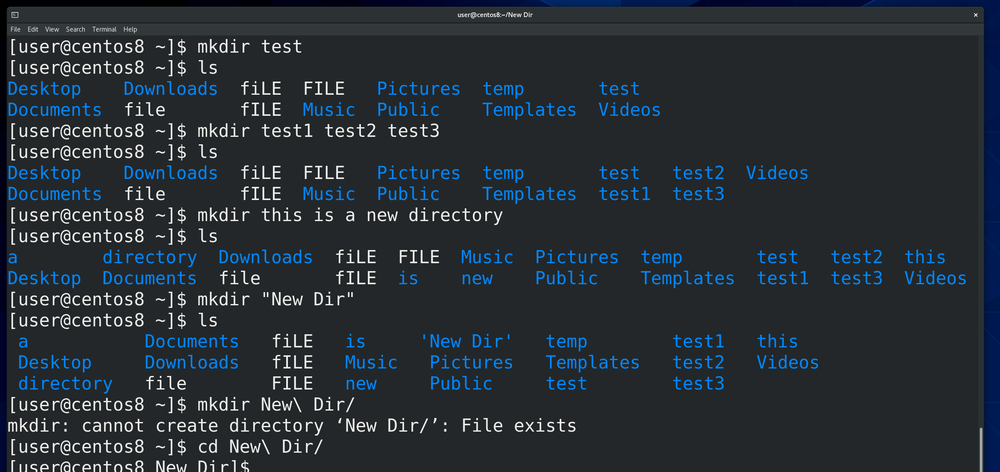
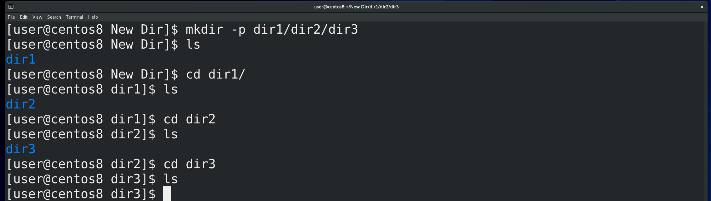
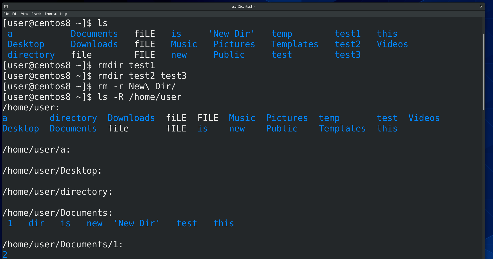

Для работы с файлами и директориями в графическом интерфейсе есть программы, называемые файловыми менеджерами. У разных графических окружений могут быть разные программы, тот же GNOME, который стоит на CentOS, по умолчанию использует файловый менеджер под названием nautilus. Я думаю все знают, что можно делать с файлами и директориями – смотреть информацию о них, копировать, вырезать, удалять, переименовывать, создавать директории и всё такое. И в командой строке это также просто. 

Мы знаем, что посмотреть содержимое директории можно с помощью команды ls. По умолчанию она показывает содержимое текущей директории. Заметьте, что ls показывает директории одним цветом, а файлы другим.  Чтобы понять, в какой директории мы сейчас находимся, нужна команда pwd – print working directory. Когда вы открываете терминал, как правило он  использует домашнюю директорию пользователя – это личная директория пользователя, где находятся все его файлы. С помощью ls можно смотреть содержимое и других директорий, для этого нужен  путь к другой директории.

Кстати о пути . В корне находятся директории, внутри которых тоже есть какие-то директории. Например, в корне у нас есть директория home, где обычно лежат домашние директории пользователей, например, нашего пользователя user. А внутри домашней директории пользователя есть какие-то его личные директории. 

То есть, чтобы мне зайти, допустим, в директорию Documents у пользователя user, мне нужно зайти в корень, потом открыть home, user и зайти в директорию Documents. Чтобы переходить по директориям в командной строке, используем команду cd – сhange directory – сменить директорию. И так, пишем cd /, то есть заходим в корень (слеш – это путь к корню), проверяем текущую директорию (pwd),  и смотрим её содержимое(ls). Дальше пишем cd home и повторяем всё тоже самое. Не стесняйтесь использовать tab – допустим, пишете cd h, нажимаете tab и он автоматом добавляет ome, так как никаких других директорий, начинающихся на h здесь нет. Точно также для user и Documents. 

Чтобы сразу зайти в Documents, мы можем разом написать cd /home/user/Documents , разделяя директории знаком слэш. 

Когда мы в начале указываем корень (/), а потом пишем первую директорию, которая находится в корне, а потом то что внутри и т.д. - это полный путь. /home/user/Documents – пример полного пути. Он всегда начинается со знака / - то есть мы возвращаемся в самое начало файловой системы и оттуда начинаем писать путь. Такой путь универсальный  - где бы вы сейчас не находились, вы можете указать полный путь и попасть туда куда вам надо.

В домашнюю директорию пользователя можно вернуться просто написав cd. Я вижу(ls), что здесь есть директория Documents. Если я хочу зайти в эту директорию, мне не обязательно писать полный путь – cd /home/user/Documents, я могу просто написать cd Documents. Или допустим, давайте зайдём в cd /home/. Я могу написать cd user/Documents. То есть, я строю путь не с корня, а с текущей директории. Такой путь называется относительным. Но что, если я нахожусь в директории /home/user/Documents и хочу попасть на директорию выше, то есть в /home/user ? Для этого в каждой директории есть ссылки на вышестоящую директорию – две точки (..). Если я напишу cd .. , я попаду в /home/user . Я могу делать всякие комбинации, допустим, находясь в директории Documents, я могу написать cd ../Pictures. То есть, я разом вернулся в директорию /home/user и зашёл в Pictures. Чтобы сразу вернуться туда, где я был раньше, я могу написать cd - . Также есть ссылка на текущую директорию – одна точка. Зачем это нужно мы разберём чуть позже. Также есть  готовая ссылка на домашнюю директорию нашего пользователя – тильда (~). Где бы мы не находились, мы всегда можем написать cd ~ и попасть в домашнюю директорию, либо использовать это для относительного пути, например cd ~/Documents . Ну и возвращаясь к теме ls, мы можем посмотреть содержимое любой директории, где бы мы сейчас не находились, используя полный или относительный пути. Допустим, ls /home/user/Documents или ls Documents или ls ~/Pictures. 

С путями разобрались. Теперь давайте посмотрим, как работать с директориями. Начнём с создания директории, для этого используем команду mkdir – make directory – создать директорию. В качестве аргумента мы должны указать название новой директории – допустим,  mkdir test (ls). Можно разом создать несколько директорий – mkdir test1 test2 test3 (ls). Очень не рекомендую использовать пробелы в названиях, так как командная строка воспринимает пробелы как переход на новый аргумент или опцию. Как я показал выше, если я напишу mkdir this is a new directory, у меня создастся пять директорий. Но если всё же вам необходимо создать директорию  с пробелами в названии, вы можете взять название новой директории в кавычки – mkdir “New Dir”. Теперь, чтобы зайти в эту директорию,  нужно либо использовать кавычки, либо использовать специальный символ - \ (обратный слэш) перед пробелом. Это называется экранированием символов. В данном случае это позволит консоли игнорировать пробел как переход на новый аргумент.

Если я хочу создать сразу директорию 1, а внутри неё директорию 2, а внутри неё директорию 3, для этого нужна опция -p – parents – создавать родительские директории. То есть, написав mkdir -p dir1/dir2/dir3 я создам несколько вложенных директорий. 

Для удаления пустой директории используется команда rmdir – remove directory – удалить директорию.  Например, rmdir test1. Можно разом удалять несколько директорий – rmdir test2 test3. Если директория не пустая, то rmdir откажется её удалять. Поэтому, когда вам нужно удалить директорию со всем содержимым, используется команда rm -r . Например, rm -r New\ Dir, тогда я удалю как New Dir, так и директории dir1, dir2 и dir3. Вообще, rm используется для удаления файлов, но о файлах мы поговорим в следующий раз. А опцию -r вы часто будете встречать – она означает рекурсивно, то есть со всем, что находится внутри. Допустим, та же команда ls уже с большим -R покажет содержимое директории вместе с содержимым поддиректорий.

Осталось ещё рассмотреть копирование, перемещение и прочее, но так эти команды совпадают с командами по работе с файлами, а тема уже получилась достаточно большая, оставшееся мы рассмотрим в следующий раз. Чтобы не забывать пройденное, обязательно практикуйтесь. Например, найдите в ролике все команды с опциями, которые я вводил, выпишите, повторите на различных директориях. Добейтесь того, чтобы вы знали без всяких раздумий, для чего нужна каждая из этих команд и ключей. 