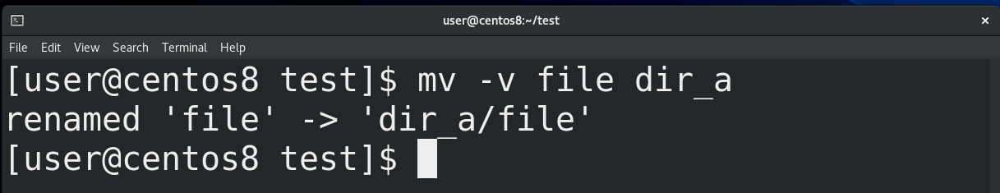
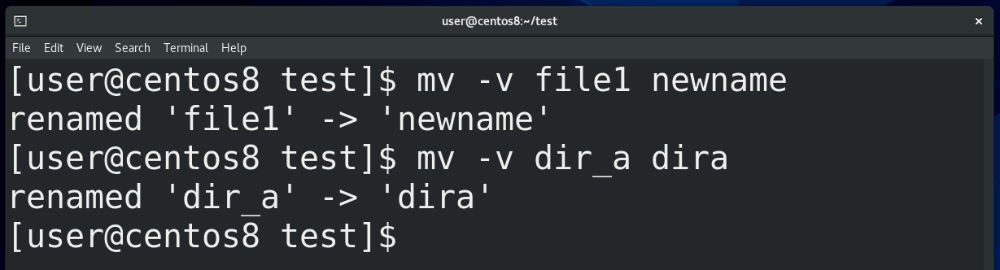
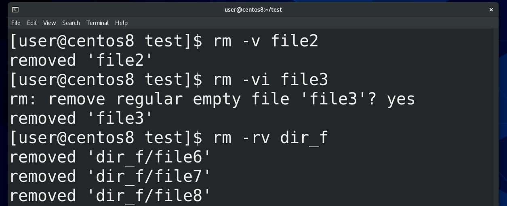
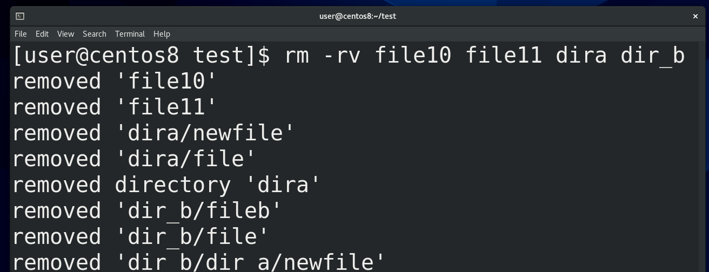
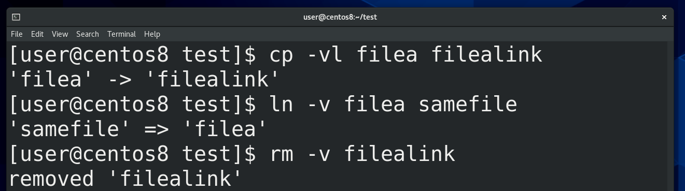
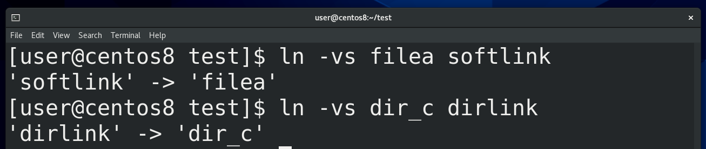
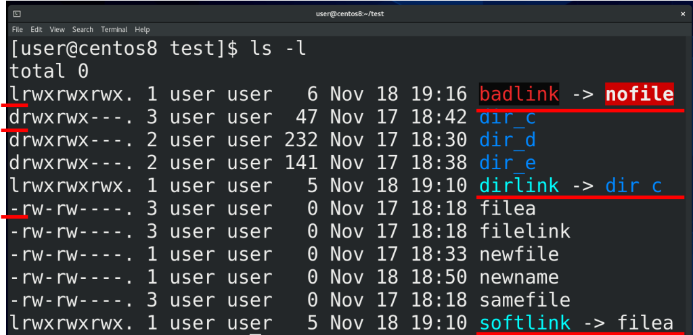
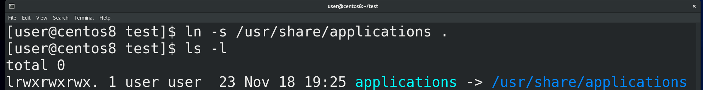

Осталось разобрать ещё пару операций – перемещение, переименование и удаление. В отличии от копирования, при перемещении в рамках одной файловой системы нам не нужно создавать копию данных, нам просто нужно изменить путь к этому файлу. Для этого не нужно затрагивать сами данные, достаточно просто создать жёсткую ссылку в новом месте и удалить в старом. За это отвечает команда move – mv. Синтаксис команды и ключи во многом сходятся с ключами команды copy (cp), та же интерактивность с ключом -i, тот же update и всё такое. Для примера, чтобы переместить файл в директорию, пишем mv -v file15 dir_a. 

Но, в отличии от copy, при перемещении директории не нужно указывать опцию рекурсивно (-r). То есть достаточно написать mv dir_a dira. Вы можете спросить, а почему mv для директорий не нужна рекурсия? Всё дело в том, что директория – это специальный файл, который можно представить в виде листа. А файлы внутри директории - это просто строчки на этом листе (жёсткие ссылки), в которых указано имя файла и номер иноды. Внутри директории (листа) есть список жёстких ссылок (файлов) и две специальные жёсткие ссылки – на себя и на директорию выше – точка и две точки соответственно. То есть перемещая директорию вы просто перемещаете лист, при этом вам не нужно ничего делать с файлами, указанными на листе. В отличии от копирования, когда вы создаёте новую директорию(лист), а также создаёте новые файлы и, соответственно, новые жёсткие ссылки.

Но всё вышесказанное работает в рамках одной файловой системы, так как жёсткие ссылки – это часть файловой системы. Они содержат номер иноды, а не данные. Поэтому перемещение из одной файловой системы в другую – это просто копирование данных с удалением того, что было. Хотя это делается той же командой mv.

Теперь про переименование. Помните – имя файла – это жёсткая ссылка, которая содержит собственно имя и номер иноды? Собственно поменять имя – это создать жёсткую ссылку с новым именем и удалить со старым. Именно этим у нас занимается команда mv. То есть, если вы хотите переименовать файл или директорию, достаточно написать mv -v file1 newname или mv dir_a dira.

Что касается удаления, как думаете, с чем оно работает? Да, опять же, с жёсткими ссылками. Для удаления используется команда remove – rm. Например, rm -v file2. Опции во многом совпадают с предыдущими командами – та же интерактивность с ключом -i, та же рекурсия, если мы удаляем целую директорию со всем содержимым. 

Можем разом удалить несколько файлов и директорий – rm -rv file1 file2 dir1 dir2, в общем, всё как при копировании. Ну или допустим, если хотим удалить всё в текущей директории – rm -r *. Кстати, одна из самых "мемных" команд – “rm -rf /”  - удаляет всё в корне, включая все поддиректории, то есть все файлы в системе. Поэтому будьте внимательны, когда выполняете команды.

Помните, я говорил, что файл существует, пока есть хотя бы одна жёсткая ссылка на него? В прошлый раз мы создали жёсткую ссылку с помощью команды cp с ключом -l (cp -vl filea filealink). Но обычно для создания жёстких ссылок используется команда link - ln. Синтаксис простой – ln -v filea samefile.  Но жёсткие ссылки работают только для файлов, а не директорий, так как жёсткая ссылка для директории может создать проблему в файловой системе. Жёсткие ссылки можно создавать и удалять, друг на друга они не влияют. 

Жёсткие ссылки часто используются при бэкапе данных - когда у вас уже есть копия данных и изменились только некоторые файлы. Вместо того, чтобы копировать в новую директорию абсолютно всё, вы просто кладёте туда новые файлы и жёсткие ссылки на неизмененные файлы. Это позволяет здорово сэкономить место, так как жёсткие ссылки практически ничего не весят, в отличии от копии данных.

Кроме жёстких ссылок, существуют символические ссылки. На английском вместо symbolic link чаще говорят soft link, но на русском больше закрепилось выражение символические ссылки. Символические ссылки ссылаются не на иноду, а на жёсткую ссылку и создаются с помощью ln с ключом -s – ln -vs filea softlink. Также символические ссылки работают с директориями – ln -vs dir_c dirlink. Такой ссылке вообще плевать, есть файл или нет, удалили или не создали. Символическая ссылка может ссылаться на файл на других файловых системах. 

Символические ссылки можно увидеть с помощью команды ls -l. Эта команда даёт много информации, но сейчас нас интересует первый символ и последний столбик. Первый символ говорит о типе файла – если дефис, то это обычный файл, а правильнее - жёсткая ссылка, если d – это директория, если l – символическая ссылка. А в последнем столбике видны имена файлов и директорий. Рядом с символическими ссылками стоит символ, показывающий, на какой файл ссылается символическая ссылка. Если этого файла нет (ln -vs nofile badlink), допустим, удалили – то ссылка всё ещё остаётся и становится “битой ссылкой”. Ссылки – это тоже файлы, а значит удаляются простой командой rm -v softlink. 

Многие новички путают символические ссылки с ярлыками, но это разные вещи. Ярлык относится к графической оболочке, ему можно поставить описание, иконку, а также прописать какую-то команду запуска, чем активно пользуются всякие вирусы. Вы, возможно, сталкивались – вставили флешку в чужой компьютер, а там все содержимое превратилось в ярлыки. И люди ведутся на обман – щёлкают по ярлыкам. А в этих ярлыках, как правило, содержится команда для запуска какого-нибудь скрытого вируса, который прописывает себя в планировщик задач. 

Символические ссылки больше относятся к файловой системе. А путают их, потому что применение примерно одинаковое – допустим, вам нужен простой путь к какой-то директории или файлу, допустим, хотите видеть в домашней директории какую-нибудь другую директорию - ln -s /usr/share/applications . . Или, допустим, какая-то программа всегда работает с определённой директорией, а вам это нужно поменять, например, выложить эту директорию на сервер. Это, конечно, зачастую можно сделать и в настройках программ, но ситуации бывают разные. 	

И так, мы рассмотрели, как создавать, копировать, перемещать, удалять файлы и директории, а также разобрали жёсткие и символические ссылки. Многое из этого, хотя и не всё, можно делать и через графический интерфейс, но когда речь идёт о серверах, ставить на них графический интерфейс не стоит – это пустая трата ресурсов и, теоретически, новые уязвимости. Эти команды довольно простые, если вы будете практиковаться, то многие эти операции вам проще будет сделать через командную строку даже при наличии графического интерфейса. 