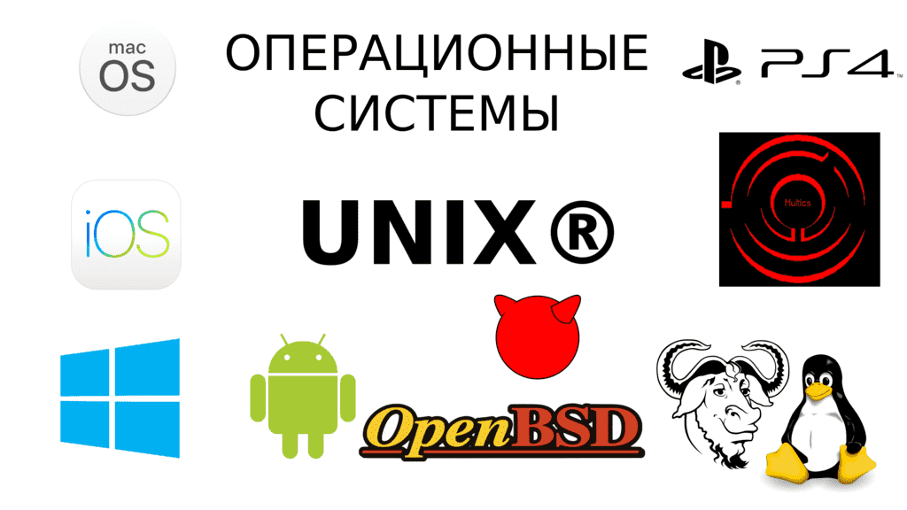
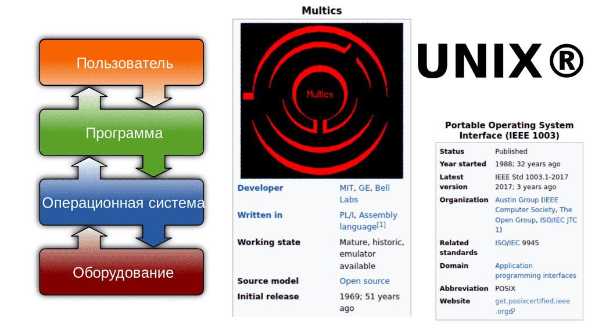
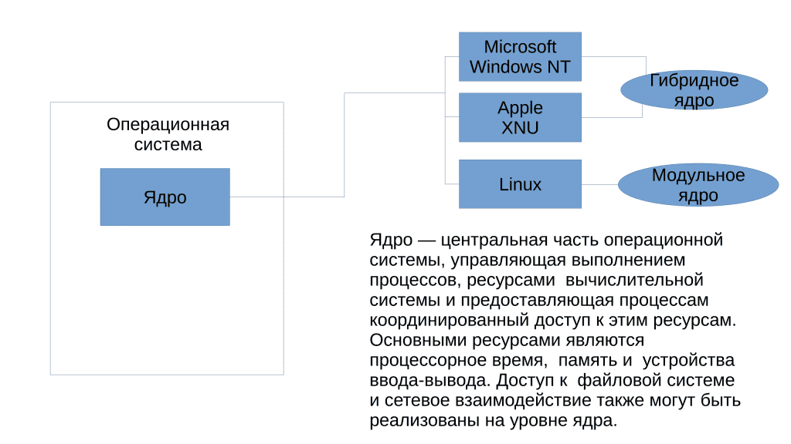
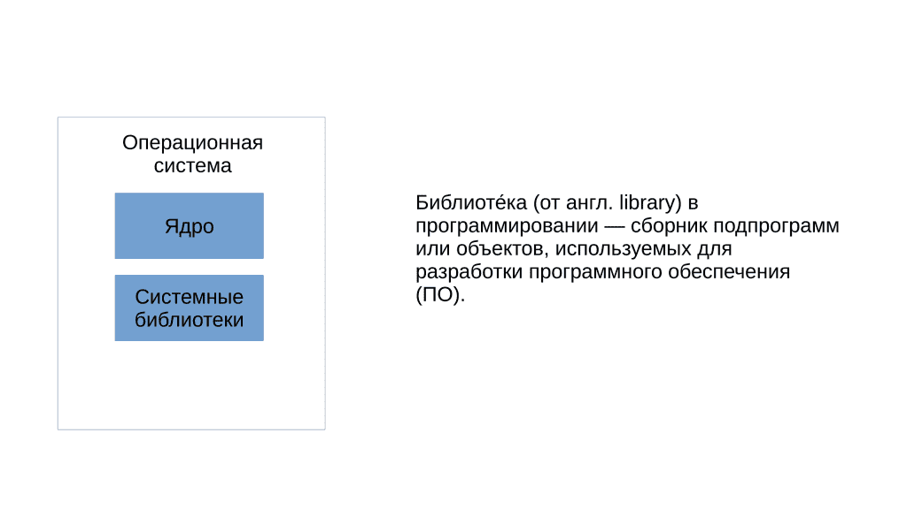
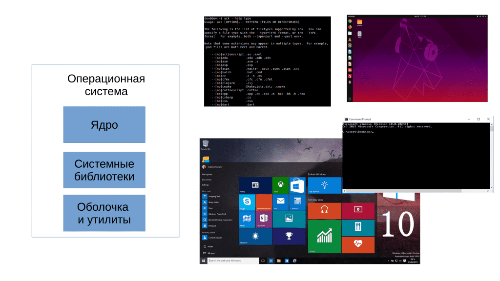
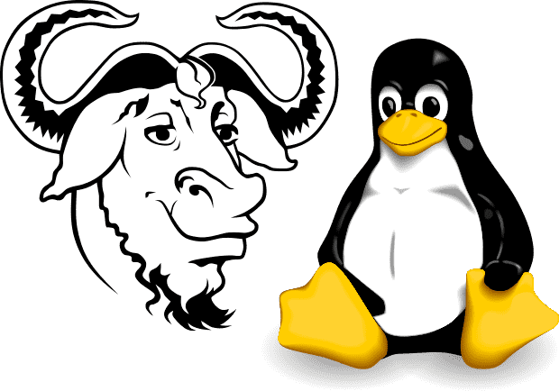

# 01. Операционные системы и GNU-Linux

<iframe width="560" height="315" src="https://www.youtube.com/embed/BpEZgAw1lLU" title="YouTube video player" frameborder="0" allow="accelerometer; autoplay; clipboard-write; encrypted-media; gyroscope; picture-in-picture" allowfullscreen></iframe>

## Появление операционных систем

Во времена моего детства на вопрос "какая у тебя операционная система?" люди отвечали "Pentium 4". C появлением мобильных операционных систем Android и iOS и развитием публичного противостояния между Apple и Samsung все больше людей узнало понятие "операционная система". Но для полного понимания этого термина нужно ознакомиться с историей программного обеспечения и понять, как и почему оно появилось и развивалось. Поэтому давайте заглянем в историю программного обеспечения.

Раньше компьютеры были настолько большими и дорогими, что их могли позволить себе только крупные организации и учреждения, такие как университеты и научно-исследовательские центры. При этом компьютеры выполняли только одну задачу в одно время. Под задачей я подразумеваю прикладную программу – программу, с которой работает пользователь. Допустим, ваш браузер, почтовый клиент, текстовой редактор или игра – всё это прикладные программы. Хотя в те годы это были программы для научных и инженерных исследований.

Так вот, как правило, компьютеры стояли в институтах и работники могли долго ждать, пока до них дойдёт очередь поработать с компьютером, как в семье где 10 детей и 1 компьютер. Со временем, мощности компьютеров росли и была необходимость выполнения нескольких задач последовательно или параллельно, а также возможность работать нескольким пользователям одновременно. Была разработана концепция разделения времени, так называемый "time-sharing", на основе которой создали служебные программы, которые решали вопросы многозадачности.

С развитием компьютерной техники, такие служебные программы стали приобретать всё больше функций. Если раньше программы взаимодействовали с оборудованием напрямую, то теперь часть задач брали на себя служебные программы. Они стали эдакой прослойкой между прикладными программами и оборудованием. Набор этих служебных программ начал называться операционной системой, одна из первых реализаций которых называлась Multics. На её идеях создали UNIX, который задал стандарты для современных операционных систем.

## Из чего состоит?

Операционная система – это прослойка между прикладным ПО и оборудованием. Но и ОС можно разделить на 3 составляющие:

- Ядро - это программа, отвечающая сразу за несколько важных функций. Одной из ключевых функций ядра является планирование задач, то есть определение того, какие программы и в каком порядке будут выполняться процессором для максимальной производительности и эффективности работы, тот самый "time-sharing". Еще одной важной функцией ядра является управление оперативной памятью – ядро решает, когда и что загружать или выгружать из оперативной памяти. Также ядро отвечает за непосредственную работу с оборудованием за счёт специальных модулей, называемых драйверами. Когда прикладное ПО хочет поработать с оборудованием, допустим, игра хочет обработать какие-то данные и вывести на экран изображение, она обращается к ядру, а ядро пересылает запрос через драйвер на видеокарту. У ядра есть и другие функции, но на пока этого достаточно. Следует отметить, что существуют различные типы архитектур ядер, и в данном случае мы рассмотрели модульный вариант, который используется в операционной системе Linux.

- Системные библиотеки - это важная часть операционной системы, хранящая код, функции и данные, которые используются при запуске и работе прикладных программ.  Хотя администраторы редко взаимодействуют с библиотеками напрямую, знание о них может быть полезно при устранении проблем с прикладными программами. 

- Оболочка и утилиты. Одна из важных функций операционной системы – дать пользователю интерфейс взаимодействия с компьютером. Интерфейс может быть как графическим, так и текстовым. Не стоит думать, что текстовый интерфейс – это какое-то окно в скрытый мир компьютера, через которое вы можете делать с компьютером всё что угодно. Да, текстовый интерфейс, как правило, несколько функциональнее графического, но его писали люди для людей и функции у него как у графического интерфейса – дать возможность запускать программы, работать с файлами и т.п. Современные операционные системы содержат сотни небольших программ, называемых утилитами, которые могут служить как для самой системы для каких-то внутренних задач по обслуживанию, так и для пользователей для какого-то базового функционала, а также для диагностики и решения проблем.

## GNU/Linux и дистрибутивы

Коммерческие компании, занимающиеся разработкой операционных систем, дают название своим продуктам Windows, MacOS, Android или iOS. Но в случае с GNU/Linux всё сложилось несколько иначе. Ядро, называемое Linux, разрабатывают одни люди, точнее даже сказать тысячи людей и компаний, а библиотеки и утилиты сотни других людей и компаний. Что-то осталось ещё с 80-ых, а что-то появляется и исчезает каждый год. Как правило, какие-то базовые утилиты разрабатывает организация GNU, а большинство остальных утилит и оболочек выпускается под лицензией GNU GPL (в том числе ядро Linux). 

Существуют люди и компании, которые берут эти компоненты, соединяют и получают готовую операционную систему. Но у разных людей свои видения и свои цели, в итоге получается много разных вариаций этой операционный системы, которые называют дистрибутивами. Ubuntu, Debian, Centos, RedHat Enterprise Linux – всё это дистрибутивы, которые используют программы GNU и ядро Linux. Есть дистрибутивы, которые отличаются только набором предустановленных программ и настройками графического интерфейса, а есть дистрибутивы, в которых абсолютно разный подход к обновлениям, поддержке и даже наличие каких-то специфичных программ. Но так как все эти дистрибутивы в основе имеют программы GNU и ядро Linux - их можно условно объединить под одним названием GNU/Linux.

## Распространение ОС

Современные операционные системы для персональных компьютеров, как правило, распространяются в виде специальных файлов с расширением ISO. Этот файл – так называемый "образ диска" – содержит программу-установщик операционной системы и для установки его следует записать на диск или флешку и загрузить компьютер с этого устройства. Несмотря на то, что возможно установить несколько операционных систем на один компьютер, ошибка при установке может привести к потере данных, поэтому к процессу установки следует отнестись с особой ответственностью. Мы рассмотрим основные шаги по установки операционной системы в отдельной части.

Как правило, дистрибутивы GNU/Linux можно скачать с официальных сайтов дистрибутива бесплатно и без всяких регистраций, а коммерческие операционные системы предоставляют доступ к этому файлу только после покупки лицензии – специального документа, разрешающего использование копии программного обеспечения. Некоторые операционные системы жёстко привязаны к определённому железу – как например, MacOS, но большинство ставится на различное оборудование при наличии драйверов.

В этой теме я предоставил минимально необходимую информацию об операционных системах и GNU/Linux. Советую обратить внимание на "Полезные ссылки", указанные в практике к данной главе.