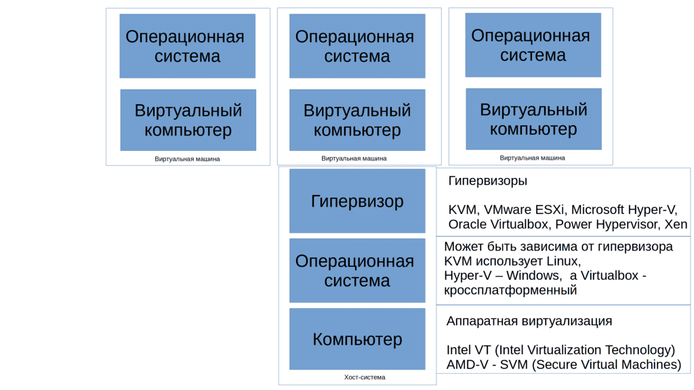
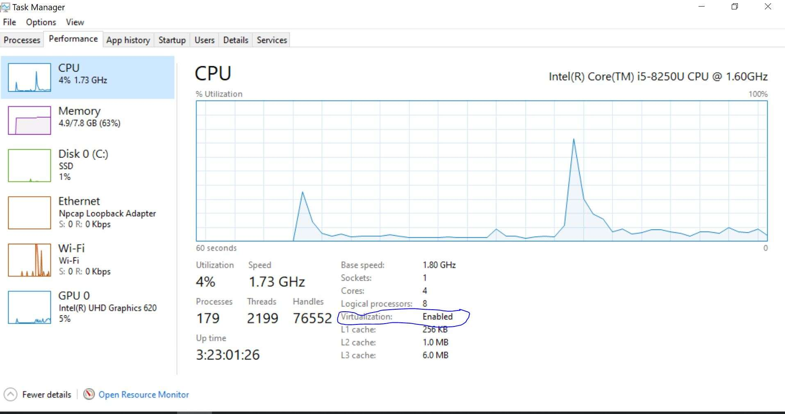
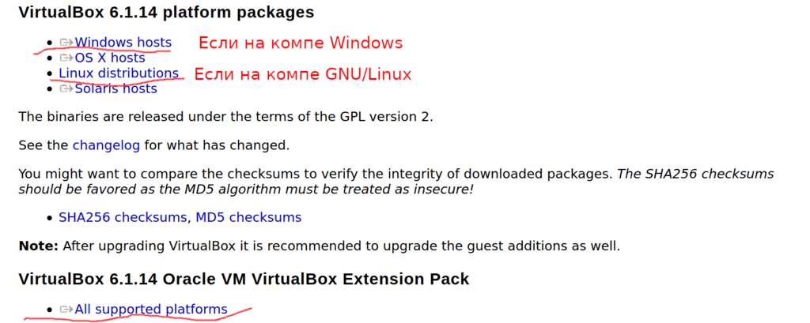

# 02. Virtualization

<iframe width='560' height='315' src="https://www.youtube.com/embed/CpOXaYOykp8" title='YouTube video player' frameborder='0' allow='accelerometer; autoplay; clipboard-write; encrypted-media; gyroscope; picture-in-picture' allowfullscreen></iframe>


#### What is it used for?

The foundation of modern IT infrastructure consists of three elements: security, fault tolerance, and performance.

- Security requires that only one task be performed on one operating system, for example, a web server or a mail server. This makes it easier to control vulnerabilities and mitigate losses in the event of any threats. Remember, good security is built not only on preventive measures but also on mitigation measures. When security fails and you need to protect as much as possible, it is better to lose one system than several.

- Fault tolerance requires having multiple copies of one service on different computers, allowing the service to work without interruption in case of problems with one computer, power outage in the building, or even a natural disaster in the city.

- Performance requires optimal resource utilization and the ability to scale quickly so that the service does not consume unnecessary resources during downtime and does not crash during peak loads.

All this sounds scary for both administrators and the boss's budget. But there are technologies that can simplify and significantly reduce the cost of all this. One of such technologies is virtualization, which is used by almost everyone. It allows running multiple virtual computers with full-fledged operating systems inside one physical computer.



#### Hypervisor

For virtualization, special programs called hypervisors are used. It requires an operating system and a processor that supports virtualization. Most modern processors support this technology. The operating system on which the hypervisor is run is called the host system or host, and the "virtual computers" running on the hypervisor are called virtual machines, VMs, or guest machines.

There are many implementations of hypervisors, which differ in functionality and price. For learning Linux, free options will work just fine, for example, VirtualBox. But before installing a hypervisor, you should make sure that your computer supports virtualization and that it is enabled.

#### Does your computer support it?



If you are on a Windows computer, launch the Task Manager, select the CPU tab, and look for the Virtualization line. If the value is "Enabled," everything is fine, your computer supports virtualization and it is enabled. If "Disabled," you need to go to the BIOS and enable virtualization. I'll provide a [link](https://2nwiki.2n.cz/pages/viewpage.action?pageId=75202968) on how to do it, as this process may vary depending on the computer. If you are on GNU/Linux, I still recommend using virtual machines for learning. To check if your computer supports virtualization on GNU/Linux, run the command ( lscpu | grep Virtualization ). If the command returns a response, then everything is good; if not, try checking in the BIOS using the link above.

```
lscpu | grep Virtualization
Virtualization:                  VT-x
```

#### Installing VirtualBox

After that, go to the website virtualbox.org -> [Downloads](https://www.virtualbox.org/wiki/Downloads) -> select "Windows hosts," and wait for everything to download. Then install the hypervisor, following the default settings. After installing the hypervisor, download the "VirtualBox Extensions Pack" from the website and install it.



After all the manipulations, restart your computer. If you are on GNU/Linux, you can download and install VirtualBox from either the repository or the website. An additional step on Linux is to add your user to the vboxusers group ( sudo usermod -aG vboxusers username ). Here, username is the login of your user.

```
sudo usermod -aG vboxusers username
```
