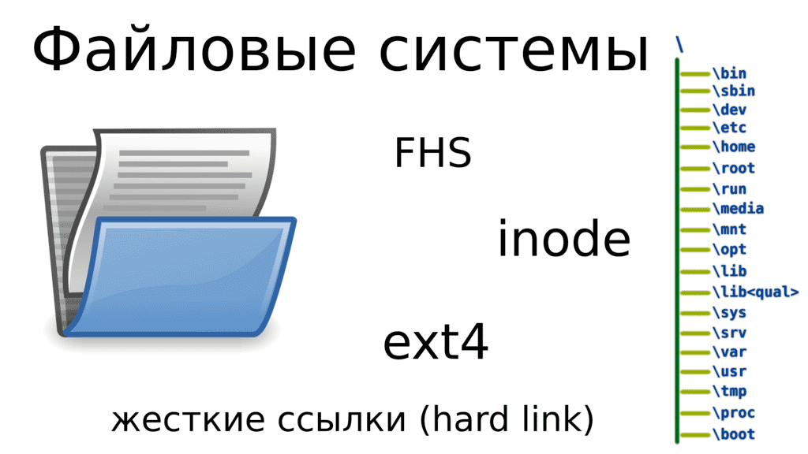
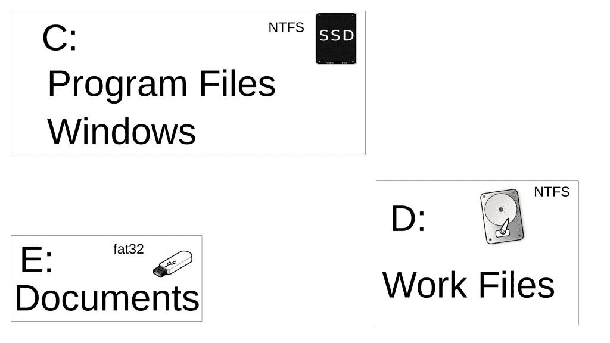
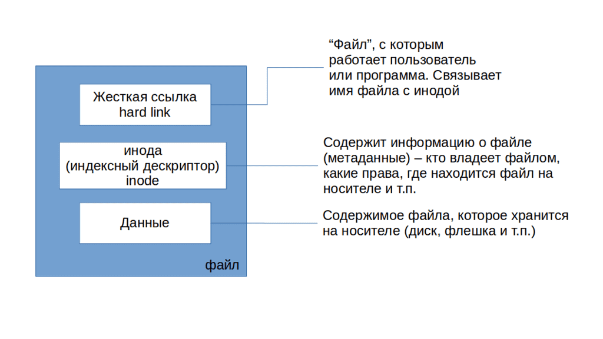

# 04. О файловых системах

<iframe width='560' height='315' src="https://www.youtube.com/embed/WOeZ-Tt3IkY" title='YouTube video player' frameborder='0' allow='accelerometer; autoplay; clipboard-write; encrypted-media; gyroscope; picture-in-picture' allowfullscreen></iframe>

Компьютер – это инструмент для работы с информацией, которая хранится в виде файлов. UNIX-подобные операционные системы придерживаются идеи "Всё есть файл", поэтому в качестве файлов также выступают устройства, процессы, директории, сокеты, пайпы – но об этом пока рано говорить. Современная операционная система состоит из десятков и сотен тысяч файлов, которые нужно правильно организовать и предоставить пользователям и программам  удобный доступ к ним. Для этого используется файловая система. Но это довольно широкий термин, для понимания которого нужно несколько точек зрения.

С точки зрения пользователей или прикладных программ, файловая система – это место для записи и чтения файлов. Пользователи видят иерархическую структуру организации файлов – внутри директорий хранятся файлы и другие директории, которые также могут хранить файлы и директории. На Windows системах директории обычно называют папками, но папка – это термин, относящийся к графической оболочке операционной системы, а директория – к файловой системе. У папки можно поменять иконку, цвет или добавить описание, чего не сделаешь с директорией. И хотя на линуксах тоже может стоять графический интерфейс, но при общении люди обычно подразумевают не цвет и не иконку какой-нибудь папки, а содержимое и аттрибуты файловой системы, поэтому закрепилось выражение директория.

Структура организации файлов на Windows системах и UNIX-подобных системах несколько отличается. На Windows у вас есть некая файловая система, которой вы назначаете букву C. Внутри этой файловой системы у вас несколько директорий – где-то хранятся файлы пользователей, где-то программы, а где-то файлы операционной системы. Когда вы подключаете флешку или любое другое устройство со своей файловой системой, ей назначается другая буква и через неё вы можете увидеть содержимое этой файловой системы. Структуры этих файловых систем независимы и не пересекаются.

На UNIX подобных системах используется другой подход, называемый FHS – стандартом иерархии файловой системы. По этому стандарту у многих файлов и директорий есть специальные пути, где они должны храниться. Допустим, если на Windows системах вы устанавливаете программу, то все её файлы попадают в директорию C:\Program Files\ИмяПрограммы. А на UNIX-подобных системах большинство программ "размазывается по системе" – запускаемая часть программ попадает в директорию /usr/bin/, ярлыки программ попадают в /usr/share/applications/, настройки в /etc/ и т.д. Кроме удобства, это также помогает с безопасностью при правильных настройках.

Это следует из следующего отличия – корень на UNIX-подобных системах один. Корень, с точки зрения структуры, это начало файловой системы, внутри которого хранятся первые директории. На Windows у каждой файловой системы свой корень – С:, D: и т.п.. А на UNIX-подобных системах каждая файловая система "прикрепляется", правильнее сказать монтируется, в какую-нибудь директорию внутри единого корня. Допустим, у вас может быть корневая файловая система на SSD, файлы пользователя хранятся на отдельном диске, при этом доступ к ним в директории /home, ваши документы, которые вы держите на флешке, могут быть доступны в директории /home/user/Documents. Три разных устройства, три разные файловые системы, но внутри одного корня.

Возвращаясь к теме безопасности, различным файловым системам можно задать различные опции монтирования. Допустим, если у вас /home, где обычно хранятся файлы пользователя, на отдельной файловой системе, вы можете запретить запуск программ на этой файловой системе. Программы обычно лежат в директории /usr/bin/, куда у обычного пользователя нет прав для доступа. В итоге, если какой-то пользователь скачает какой-то вирус к себе в домашнюю директорию (/home/user), он просто не сможет его запустить. Или, допустим, мы знаем, что в /usr/ лежат файлы программ. Если отделить /usr/ на другую файловую систему, то после установки всех программ мы можем убрать право записи в эту файловую систему. В итоге вирус не сможет воспользовавшись уязвимостью программы изменить её запускаемый файл, чтобы добавить в него вредоносный код. А в момент обновления мы просто возвращаем файловой системе право на запись,  обновляем программы и опять возвращаем как было.

Как вы, возможно, заметили,  я упомянул файловые системы ещё с двух точек зрения – когда я говорил о файловых системах на устройствах и когда говорил про опции на запуск или запись. С точки зрения устройства, файловая система  - это способ записи и чтения файлов на устройстве. Недостаточно просто записать файл на диск, нужно ещё определить, куда писать файл, как с ним работать и т.п. Это зависит от типа файловых систем – NTFS, exFAT, EXT4, XFS и т.д..  Файл условно можно разделить на 3 части – сами данные внутри файла, жёсткая ссылка и информация об этом файле – где хранятся данные файла на устройстве, кто владелец, какие права доступа и т.п. Информация о файле называется метаданными и на UNIX-подобных системах хранится на файловых системах в структурах данных, называемых инодами(inode). У каждой иноды есть свой уникальный номер, а чтобы операционная система могла найти иноду по имени файла, она использует жёсткую ссылку (hard link). Подводя итоги, файлы, которые мы обычно видим на компьютере – это жёсткие ссылки, в которых содержится номер иноды, а в иноде содержится информация о файле и его местоположение на устройстве. Этих жёстких ссылок, которые ссылают на одну и ту же иноду, может быть несколько, по сути это способ обращения к одному и тому же файлу по разным именам и с разных директорий, но внутри одной файловой системы, потому что жёсткая ссылка – часть файловой системы. Когда вы удаляете последнюю жёсткую ссылку на файл, файловая система очищает inode запись и помечает местоположение данных файла как свободное, хоть там и лежат данные. Когда появится необходимость записать новый файл, файловая система запишет туда новые данные, но пока этого не произошло,  есть вероятность восстановить эти данные.

С точки зрения операционной системы, файловая система – это драйвер, модуль ядра. Этот драйвер предоставляет интерфейс, через который программы могут взаимодействовать с файлами. И в момент монтирования файловой системы вы можете указать специальные опции монтирования, например, чтобы файловая система была только для чтения.  На GNU/Linux системах есть возможность установить модули для работы с множеством различных типов файловых систем, включая файловые системы других операционных систем, допустим NTFS. Но на NTFS нет некоторых функций, необходимых для работы линукса – допустим, прав, как в UNIX-подобных системах и т.п., вследствие чего невозможно установить Linux на NTFS, хотя и можно использовать такую файловую систему для хранения пользовательских файлов. Windows системы же не содержат нужных драйверов для работы с файловыми системами EXT4 или XFS, на которых обычно устанавливается Linux. Из-за чего, если у вас 2 операционные системы на компьютере, на Линуксе видны файлы Windows, а чтобы увидеть содержимое линуксовых файловых систем, на Windows надо установить специальные утилиты.

Есть множество различных типов файловых систем, различающихся функционалом и возможностями, но самые используемые на GNU/Linux – ext4 и xfs. Сейчас я рассказал только о том, что такое файловая система, чтобы мы могли рассмотреть работу с файлами в следующих видео. А к теме "Работа с файловыми системами" мы ещё вернёмся.
