# 09. Чтение текстовых файлов

<iframe width='560' height='315' src="https://www.youtube.com/embed/ZKF8M7plxwc" title='YouTube video player' frameborder='0' allow='accelerometer; autoplay; clipboard-write; encrypted-media; gyroscope; picture-in-picture' allowfullscreen></iframe>

Как вы, возможно, поняли, в текстовом интерфейсе всё есть текст – команды, файлы, устройства - всё что угодно. В том числе это касается настроек и логов большинства программ, которые хранятся в виде текстовых файлов. Поэтому инструментов для работы с текстом на UNIX-подобных системах просто дофига. Какие-то из них очень простые, а о каких-то пишут книги на сотни страниц.  Ну и чтобы научиться работать с текстом, нам нужен какой-то подопытный файл – и для этого идеально подойдёт файл /etc/passwd – файл, в котором хранится информация о пользователях в системе.


Для начала посмотрим содержимое этого файла. С помощью команды cat мы можем вывести содержимое этого файла в терминал:

```
cat /etc/passwd
```

Как вы видите, в терминале появилось много текста. Мы можем прокрутить его с помощью колёсика мыши, либо с помощью клавиш shift+PgUp, либо shift+PgDn. Запомните эти клавиши, потому что в виртуальном терминале мышка не работает.

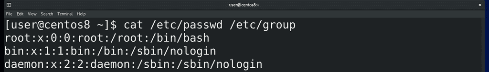

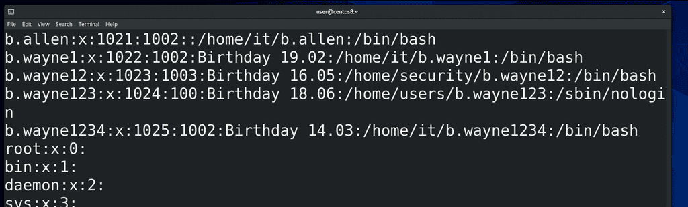

Команда cat подойдёт, когда у вас есть относительно небольшой текстовой файл и вам  просто нужно посмотреть его содержимое. Но в целом cat – от слова конкатенация – может объединять вывод содержимого нескольких файлов. Для примера возьмём ещё один файл - /etc/group – и выведем оба файла разом:

```
cat /etc/passwd /etc/group
```

Если покрутим вверх, то увидим - как только закончился один файл, начинается другой.

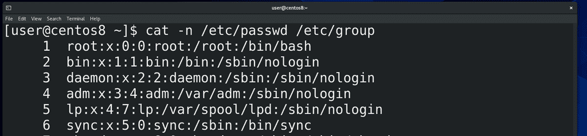
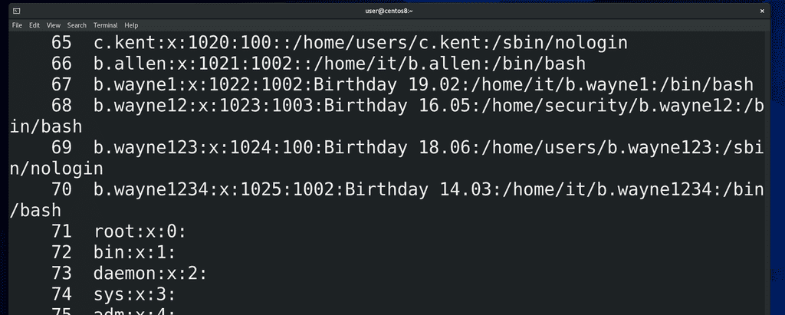

Ещё cat может пронумеровать строки с помощью ключа -n:

```
cat -n /etc/passwd
```

Ну и обратите внимание, как эта опция работает при выводе двух файлов.

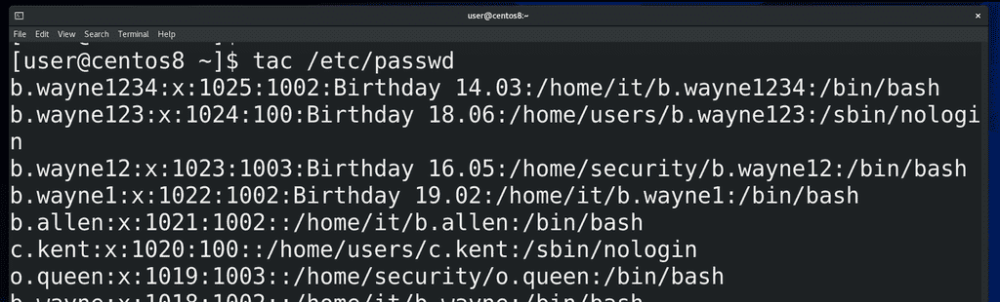

У команды cat есть противоположная команда – tac, которая выводит текст реверсивно, то есть с конца:

```
tac /etc/passwd
```

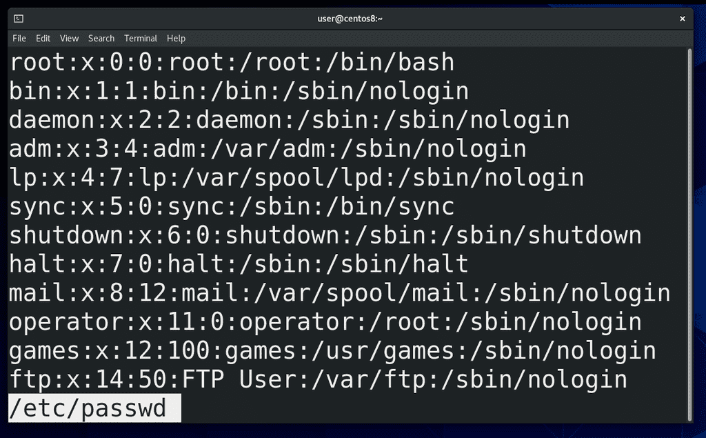

Как вы заметили, команда cat просто вывела содержимое файла на экран и всё. Если там сотни строк – придётся крутить вверх, вниз. Если у вас задача прочесть какой-то большой файл,  то вам больше подойдёт программа-читалка, например, less:

```
less /etc/passwd
```

Такие программы часто называют пейджерами. Стрелки, Enter, pgup-pgdn, пробел – с помощью всего этого можно листать.

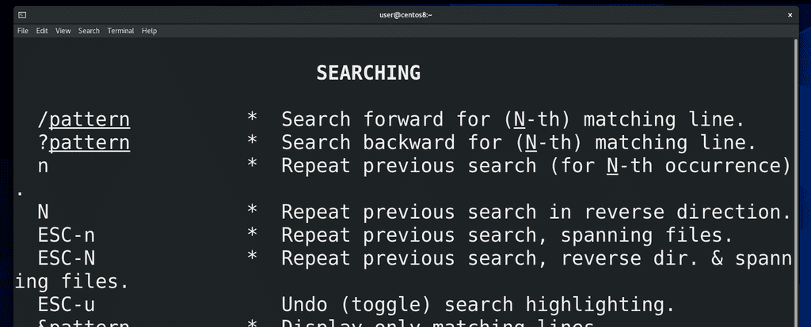

Если написать слэш (/) и текст, то less поищет этот текст в файле, а с помощью n или N можно перейти на следующее или предыдущее совпадение соответственно. Ну и q чтобы выйти. Похоже на man? А это потому что man использует less в качестве читалки. Если в man или в less нажать h, то откроется небольшой гайд по командам управления читалкой.

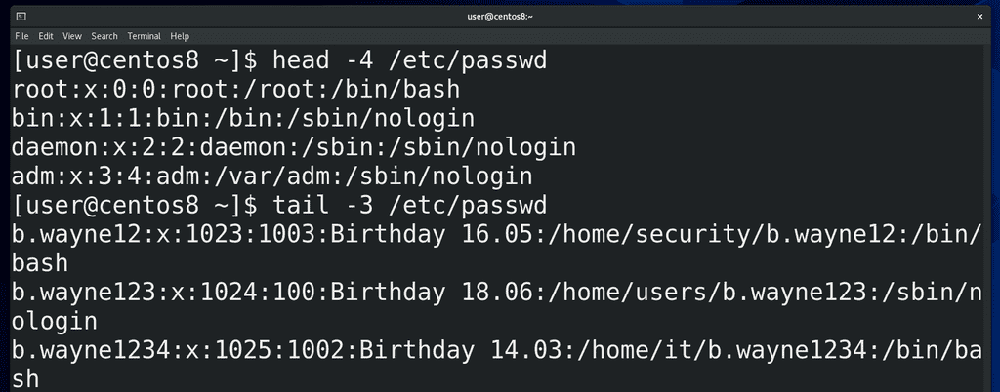

Но жизнь слишком коротка, чтобы читать большие файлы, поэтому часто пользуются двумя командами – head и tail – они показывают определённое количество строк с начала и с конца файла соответственно:

```
head /etc/passwd 
tail /etc/passwd
```

По умолчанию они показывают 10 строк, но можно указать что-то своё: 

```
head -4 /etc/passwd
tail -3 /etc/passwd
```

Ещё tail может читать с определённой строки, допустим всё что ниже 35 строки:

```
tail -n +35 /etc/passwd
```

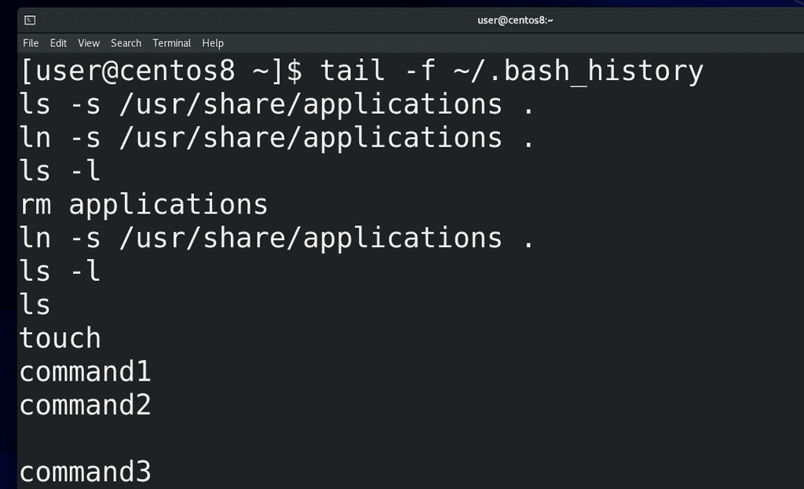

Одна из самых используемых опций tail – ключ f - может показывать, что добавляется в файл в реальном времени:

```
tail -f logfile
```

Это часто применяется при решении проблем, когда вы видите кучу логов и вам нужно понять, что именно происходит при выполнении каких-то действий. Для примера посмотрим файл:

```
tail -f ~/.bash_history
```

Сюда записываются выполненные команды. Так вот, я открываю ещё один эмулятор терминала и ввожу какие-то команды. Потом закрываю новое окно и вижу, что у меня в этот файл добавились строчки. Когда текста много, не всегда понятно, что где куда добавилось, поэтому я могу зажать Enter и у меня появляется пустое пространство. Не беспокойтесь, это никак не влияет на сам файл, это просто для удобства чтения. Чтобы выйти, нажмите Ctrl+c.  Возможно вам пока это не понятно, но просто запомните – если вам нужно открыть конец файла и ждать появления новых строчек, например в случае чтения логов, то используется tail с ключом f.

Вообще, одна из лучших фишек команд less, head и tail – то что они не пытаются прочесть весь файл целиком. Вы когда-нибудь пытались открыть текстовой файл на 100 мегабайт? А админы иногда сталкиваются с файлами с размером в пару гигабайт. Бывает - утром пришел на работу, а там сервер не работает. Смотришь – нет места на диске. Почему? А там лог файл на десяток или сотню гигабайт забил весь диск за одну ночь. Да, конечно, по хорошему такие ситуации легко предотвратить, но всё же речь о другом. И вот тебе нужно понять, что это там в логах такого на пару гигов. Сервера просто зависают при попытке открыть такие файлы. Но на линуксах есть эти утилиты, с помощью которых можно запросто прочитать файл любого размера. И так как, обычно, такие большие лог файлы забиваются одними и теми же строчками, то достаточно вывести, допустим, последние строк 50 файла, чтобы понять, что там произошло.

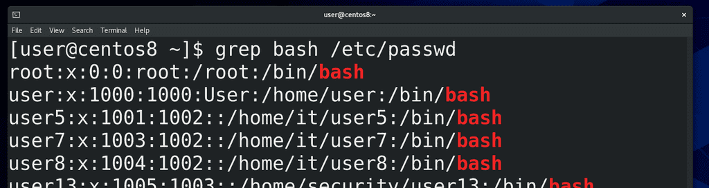

Ну и давайте напоследок затронем ещё одну команду – grep, хотя о ней мы ещё поговорим более подробно в другой раз. grep позволяет нам искать строки текста по шаблону. Допустим, в нашем файле /etc/passwd есть пользователи, которые пользуются интерпретатором bash. Я могу написать:

```
grep bash /etc/passwd
```

и команда выдаст мне только строки, в которых есть слово bash.

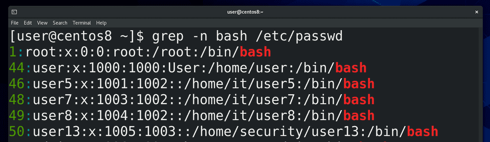

Я могу добавить опцию n:

```
grep -n bash /etc/passwd
```

тогда я ещё увижу номера строк.

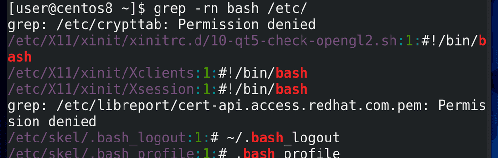

grep может искать рекурсивно. То есть, я могу указать grep-у, чтобы он нашёл мне все упоминания bash в директории /etc:

```
grep -rn bash /etc/
```

Как вы видите, вывода много, много где ошибки, потому что не хватает прав.

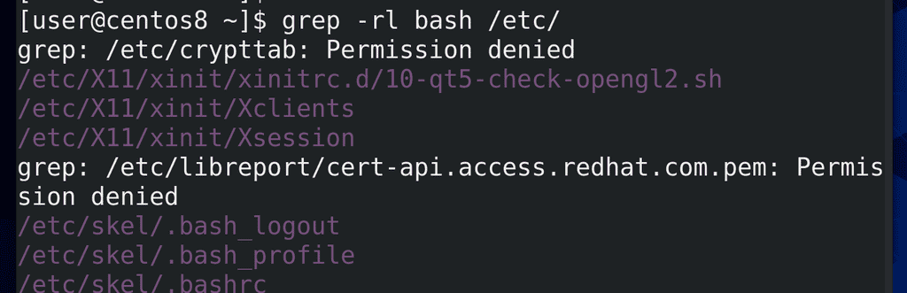

Я могу использовать ключ l – чтобы просто выводить имена файлов, в которых встречается слово bash:

```
grep -rl bash /etc/
```

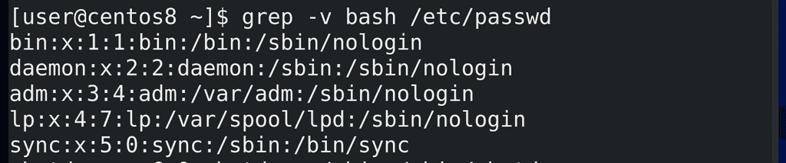

Ну и я могу найти все строки, в которых не содержится это слово, то есть реверсировать поиск с помощью ключа v:

```
grep -v bash /etc/passwd
```

И вот мы затронули 4 команды для чтения текста – cat, less, head и tail, и даже научились искать текст с помощью команды grep. Осталось научиться писать.
