# 21. Ядро Linux

<iframe width='560' height='315' src="https://www.youtube.com/embed/zvk0NNrDTow" title='YouTube video player' frameborder='0' allow='accelerometer; autoplay; clipboard-write; encrypted-media; gyroscope; picture-in-picture' allowfullscreen></iframe>

Мы с вами частично знакомы с некоторым функционалом ядра – оно отвечает за time sharing, управление процессами, их приоритетами и т.п, также управление памятью – та же виртуальная память, swap и всё что с этим связано, ну и из недавнего – отвечает за проверку прав на файлы - каким пользователям к каким файлам есть доступ. Это далеко не всё, чем занимается ядро, что-то мы ещё будем разбирать по мере изучения, но пока давайте разберём, что из себя представляет ядро и что администратору с ним делать.

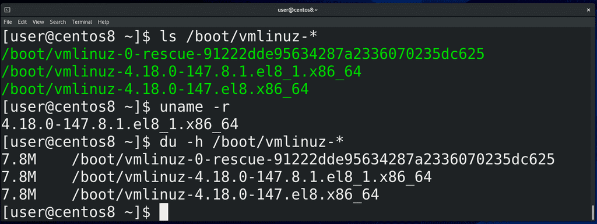

Для начала, ядро - это программа. В отличии от других программ, оно лежит в директории /boot и называется vmlinuz:

```
ls /boot
```

Почему оно лежит здесь и что это за другие файлы – это касается вопроса загрузки операционной системы, что мы будем разбирать в другой раз. Как вы видите, тут несколько файлов с названием vmlinuz и они отличаются версиями. Когда мы обновили систему, у нас появилась новая версия ядра, но старая не удалилась – если с новым ядром будут проблемы, всегда можно загрузиться со старого. Версию ядра, которую мы сейчас используем, можно увидеть с помощью команды:

```
uname -r
```

Давайте посмотрим, сколько же весит ядро: для этого воспользуемся утилитой

```
du

```

которая показывает размеры файлов, с ключом -h – чтобы отображалось не в килобайтах, а в более удобном для чтения виде:

```
du -h /boot/vmlinuz-*
```

Как видите, ядро весит почти 8 мегабайт. На самом деле, буква z в слове vmlinuz говорит о том, что ядро сжато. То есть, фактически, оно весит чуть больше.

Возможно, вы знаете – ядро Linux используется везде: android смартфоны, коих больше 3 миллиардов, работают на Linux; огромное количество сетевого оборудования, серверов, всяких медиабоксов, умных телевизоров, холодильников, машин, да даже бортовые компьютеры Space X – всё это работает на Linux. Это огромное количество разнообразного оборудования, которое должно поддерживать ядро. Поэтому в разработке ядра участвуют тысячи крупнейших компаний и специалистов. И всё ради 8 мегабайтного файла? Конечно нет. В этом файле только основной функционал, необходимый для работы – работа с памятью, управление процессами и т.п. Когда же ядру нужен дополнительный функционал – допустим, чтобы работать с сетевым адаптером, видеокартой или другим оборудованием – ядро обращается к специальным файлам, называемым модулями. В модулях хранится код, необходимый для работы с оборудованием или программный функционал – допустим, драйвер для видеокарты или программа для шифрования. Обычно это происходит незаметно для пользователя – вы вставили флешку, а ядро загрузило модуль для работы с usb флешками, а также модуль для работы с файловой системой на этой флешке. На других операционных системах это может работать по другому – есть различные архитектуры ядер операционных систем. У Linux архитектура модульная – то есть какой-то функционал вынесен в модули и подгружается по необходимости. Также Linux называют монолитным – потому что всё что делает ядро происходит в рамках одной программы – а правильнее сказать – все части ядра работают в одном адресном пространстве. Помните, мы обсуждали, что это такое, когда говорили о процессах? Но так как у Linux-а огромный функционал, который бессмысленно держать одновременно в памяти – поэтому функционал вынесен в модули, благодаря чему ускоряется работа ядра.  

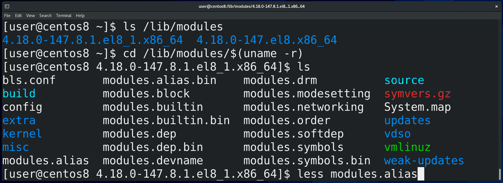

Так вот, модули ядра хранятся в директории /lib/modules/:

```
ls /lib/modules
```

где есть директории для каждой версии установленного ядра. Зайдём в директорию текущего ядра:

```
cd /lib/modules/$(uname -r)
ls
```

и посмотрим файл modules.alias:

```
less modules.alias
```

Тут перечислено - для каких устройств какие модули грузить в ядро.

В отличии от Windows, где вы ставите систему, а потом доустанавливаются драйвера, в Linux большинство драйверов уже предустановлены в виде модулей. Это благодаря тому, что многие производители оборудования сотрудничают с разработчиками ядра и предоставляют открытый исходный код драйверов на оборудование. Но, естественно, далеко не все производители предоставляют исходный код своих драйверов, из-за чего что-то может не работать из коробки – зачастую, это касается драйверов на wi-fi. Иногда, допустим, в случае с драйверами на видеокарты Nvidia, находятся энтузиасты, которые с помощью реверс инжиниринга создают свободные драйвера – т.е. берут драйвер с закрытым исходным кодом, изучают его с помощью специальных программ и методик и стараются воссоздать этот драйвер. Для видеокарт Nvidia таким образом создан драйвер nouveau. Зачастую это работает – естественно без каких-либо гарантий, потому что  драйвер написан не самим производителем. При этом сам производитель – тот же Nvidia, также предоставляет свой драйвер в виде модуля, но уже с закрытым исходным кодом, т.е. проприетарный, поэтому он не бывает включён в ядро по умолчанию, из-за чего нужно самому доустанавить этот модуль. К примеру, после установки Centos на Virtualbox, мы с вами установили гостевые дополнения Virtualbox вручную именно потому, что они не под лицензией GPL, хотя сам Virtualbox имеет открытый исходный код с лицензией GPL. Всё это к тому, что если вы поставили Linux и у вас что-то не работает, допустим, wifi, то, скорее всего, производитель wifi адаптера не открыл исходный код своих драйверов и вам придётся искать нужный драйвер на сайте производителя, либо гуглить. Однако, некоторые юзер-френдли дистрибутивы, допустим Ubuntu, делают это за вас – после того, как вы установите Ubuntu, система найдёт нужные проприетарные драйвера и предложит вам их установить, что удобно для новичков.

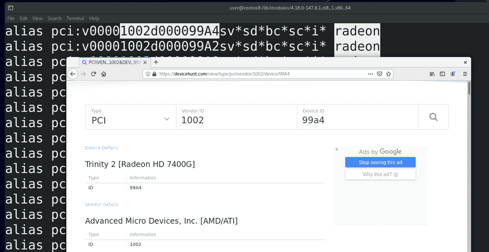

Возвращаясь к нашему файлу, во втором столбике у нас перечислены идентификаторы оборудования – так называемые hardware id. Возьмём для примера radeon - /radeon – это видеокарты от AMD. Чтобы было удобнее, откроем сайт devicehunt.com – где мы можем увидеть информацию о вендорах и оборудовании. Так вот, если ядро видит, что к pci шине подключено устройство, у которого vendor id – 1002, а device id – 99A4 – ядро знает, что для этого устройства нужен модуль с названием radeon. Тут могут быть ещё версии какого-то оборудования, классы и подклассы – но нам это сейчас не особо важно. Если вам интересно, что значат все эти обозначения, посмотрите по [ссылке](http://people.skolelinux.org/pere/blog/Modalias_strings___a_practical_way_to_map__stuff__to_hardware.html).

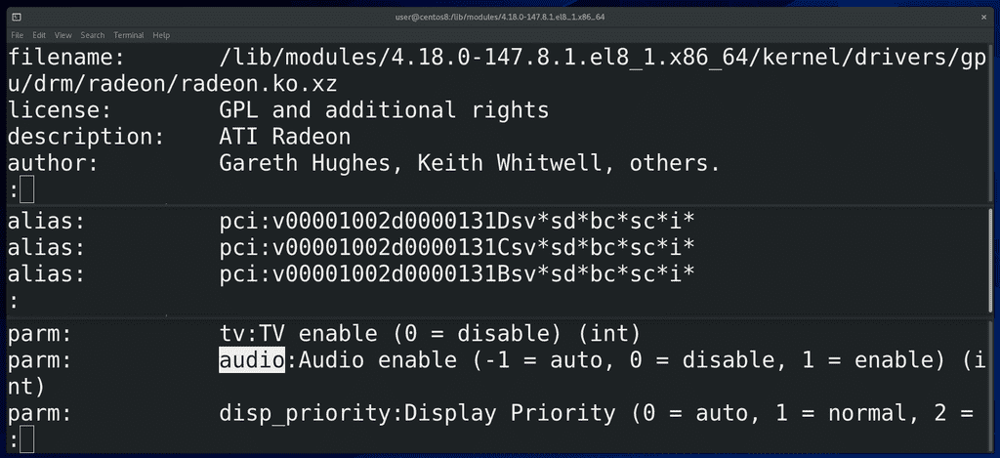

Сам этот файл не статичный, он генерируется от информации из самих модулей. Чтобы увидеть информацию о каком-нибудь модуле, можно использовать команду modinfo – допустим:

```
modinfo radeon | less
```

Тут мы видим расположение и имя файла, причём, у всех модулей расширение .ko, ну а .xz в конце означает, что модуль в сжатом виде. Также лицензия, автор, описание. И чуть ниже у нас alias-ы – собственно на основе этого и генерируется файл modules.alias, который мы смотрели. Ну и ниже – параметры – функционал оборудования на уровне драйвера. Допустим, audio – будет ли у нас видеокарта работать со звуком через тот же hdmi.

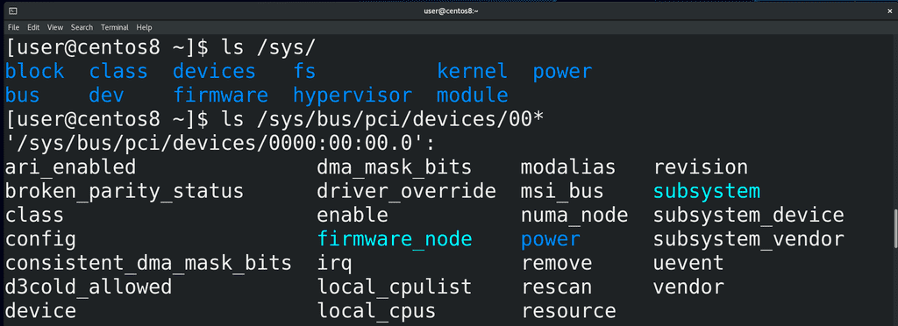

Так вот, недавно мы узнали о виртуальной файловой системе procfs, через которую ядро нам показывает информацию о процессах. А для структурированной информации об устройствах и драйверах есть виртуальная файловая система sysfs, доступная в директории /sys:

```
ls /sys
ls /sys/bus/pci/device/00*
```

И хотя тут куча файлов, через которые можно увидеть очень много информации, сидеть и копаться в этих файлах не всегда удобно, есть утилиты, которые показывают эту же информацию в более компактном и простом виде.

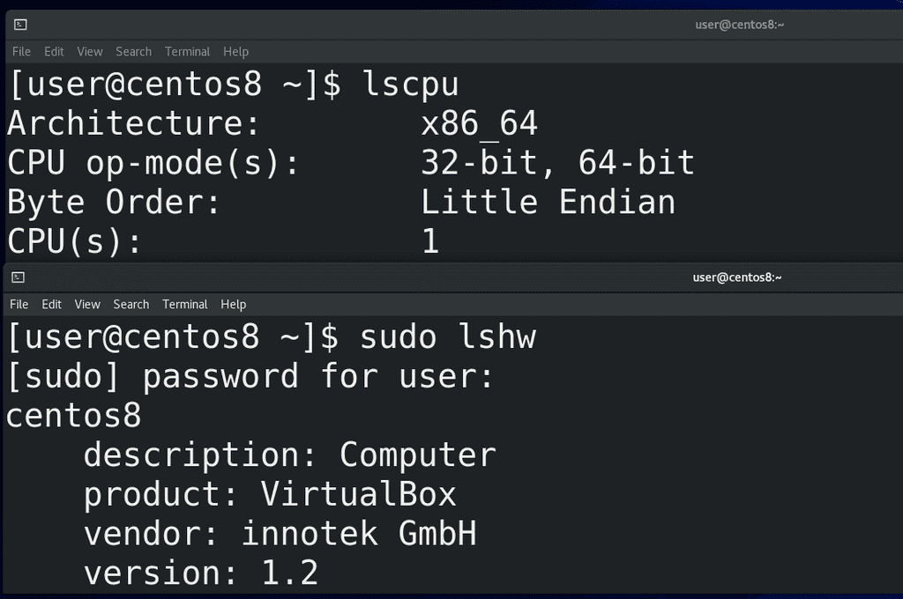

Например:

```
lscpu
```

показывает информацию о процессоре,

```
lspci
```

показывает информацию об устройствах, подключённых на pci шину,

```
lsusb
```

устройства, подключённые к usb. Для более подробной информации вы можете использовать lshw:

```
sudo lshw
```

а из графических утилит есть hardinfo.

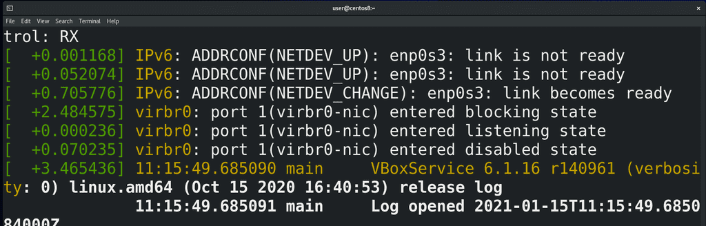

Чтобы видеть, что происходит в ядре при запуске системы или сейчас, например, вы вставили флешку и хотите понять, видит ли её система или нет, вы можете использовать утилиту dmesg:

```
sudo dmesg -wH
```

Запустили команду, вставили флешку или любое другое устройство, и тут вы увидите, как ядро распознаёт устройство.

Ядро, при виде какого-нибудь оборудования или при необходимости работы с каким-нибудь программным функционалом, загружает модули автоматически. И хотя работать с этим вам придётся не так часто, вы должны иметь представление, как это работает и как это менять. Например, может быть требование, чтобы система игнорировала флешки, хотя, по умолчанию, вы вставили флешку и она работает.


И так, для управления модулями ядра используется утилита:

```
modprobe
```

Допустим, если хотим загрузить модуль radeon, пишем:

```
sudo modprobe radeon
```

Увидеть можем с помощью утилиты lsmod, которая показывает загруженные модули:

```
lsmod | grep radeon
```

Одни модули могут работать с другими и сами могут использоваться какими-то процессами. Например, чтобы выгрузить модуль из ядра, можно использовать тот же modprobe с ключом -r:

```
sudo modprobe -r radeon
```

Этот модуль не использовался, поэтому мне получилось с лёгкостью его выгрузить. Но есть модуль, допустим, vboxguest, который используется и убрать его с помощью modprobe не получится:

```
sudo modprobe -r vboxguest
```

Предварительно нужно избавиться от процессов, которые используют этот модуль. Например, чтобы выгрузить драйвер видеокарты, вам нужно будет предварительно завершить все приложения, использующие графический интерфейс.

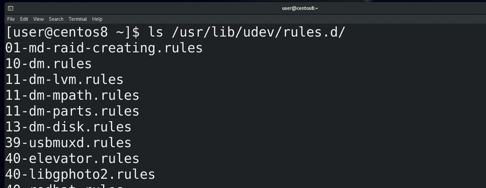

Так вот, возвращаясь к теме про автоматическую загрузку модулей. В системе есть программа, называемая udev – именно она отвечает за управление устройствами. И когда ядро видит новое устройство, оно создаёт событие, которое отслеживает udev. У udev есть большое количество правил:

```
ls /usr/lib/udev/rules.d/
```

которые оно применяет при виде того или иного события. Например, udev видит в событии, что в usb подключено устройство, которое говорит что оно является накопителем – и у udev есть правило, которое при виде такого устройства создаёт для него специальный файл в директории /dev с таким-то названием – допустим, sdb. Этот файл ядро связывает с драйвером, работающим с оборудованием. Таким образом наша флешка становится файлом, благодаря чему мы через этот файл можем взаимодействовать с устройством. Точно также можно в udev прописать, чтобы при виде usb устройства для него передавался специальный параметр, который бы запрещал устройству что-либо делать. Углубляться в udev мы пока не будем, для начала хватит понимания, зачем он вообще нужен.

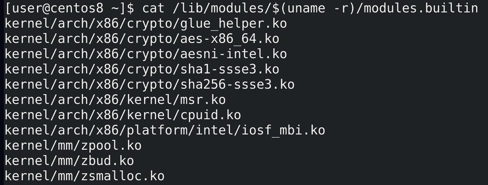

Модули можно скомпилировать в ядро – тогда отпадает необходимость загружать модули из файлов, но это увеличивает размер ядра. Такие модули называются встроенными и их список можно увидеть в файле modules.builtin:

```
cat /lib/modules/$(uname -r)/moduiles.builtin
```

А те модули, которые загружаются при необходимости и которые можно, теоретически, выгрузить, называются загружаемыми. Встроенные же модули выгрузить из ядра не получится.

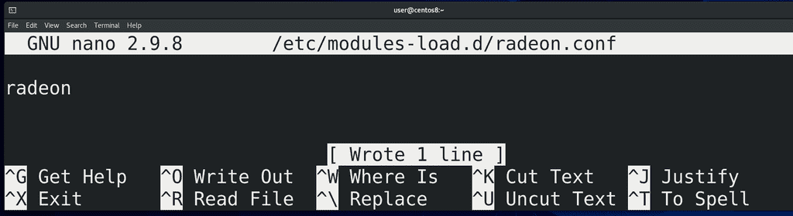

Иногда может понадобится, чтобы загружаемые модули загружались всегда при включении компьютера. Для этого нужно создать файл в директории /etc/modules-load.d/ c .conf в конце имени, допустим, radeon.conf:

```
sudo nano /etc/modules-load.d/radeon.conf
```

где вписываем название модуля, которые мы хотели бы загружать в ядро при включении. Теперь, после перезагрузки, этот модуль автоматом загрузится.

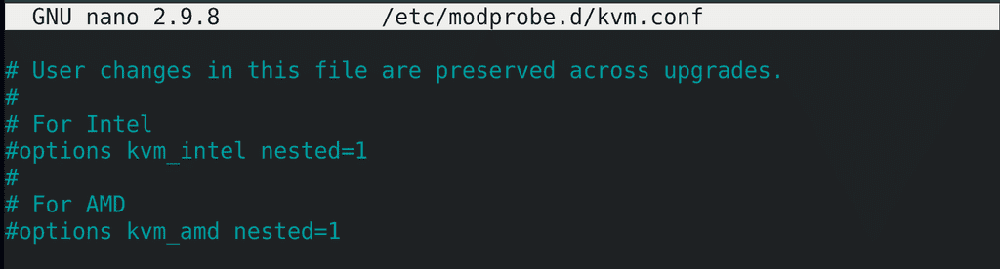

Если же нам нужно, чтобы какой-то определённый модуль не загружался при включении или загружался с определёнными параметрами – теми параметрами, которые мы видели с modinfo radeon - то для этого нужно создать файл в директории /etc/modprobe.d тоже заканчивающийся на .conf, например, kvm.conf:

```
sudo nano /etc/modprobe.d/kvm.conf
```

Тут у нас есть закомментированные примеры. Чуть подробнее об этом можно почитать на [арчвики](https://wiki.archlinux.org/index.php/Kernel_module_\(Русский\)).

Надеюсь у вас сложилось представление, что же есть ядро. Это далеко не весь функционал ядра, я его и не смогу полностью рассмотреть. Но теперь вы немного знаете про само ядро, про его модули, про драйвера и устройства, в том числе udev, который позволит вам более гибко настраивать работу системы с устройствами и директорию dev, где у нас специальные файлы, с помощью которых мы можем работать с различным оборудованием.
