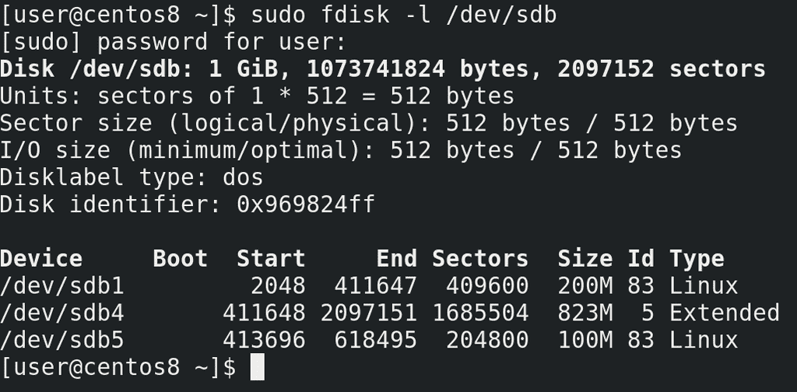
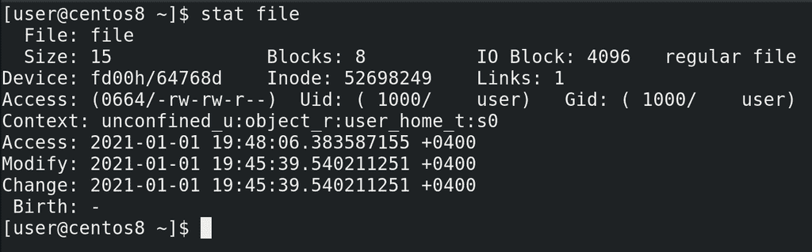
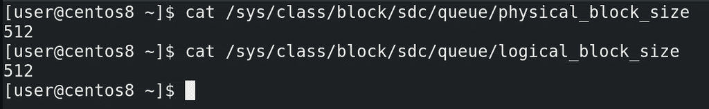
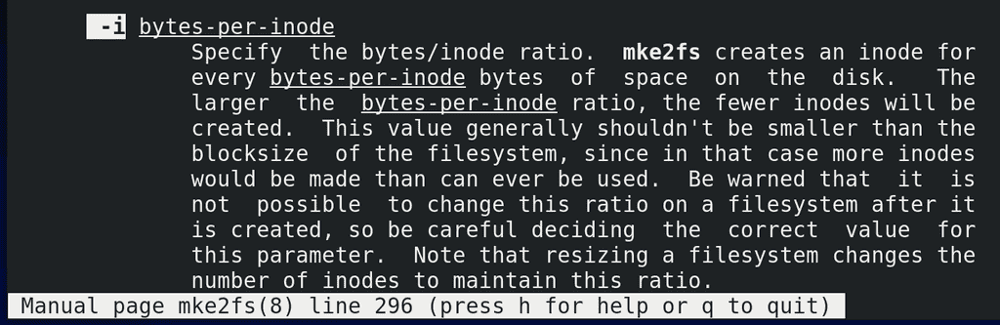
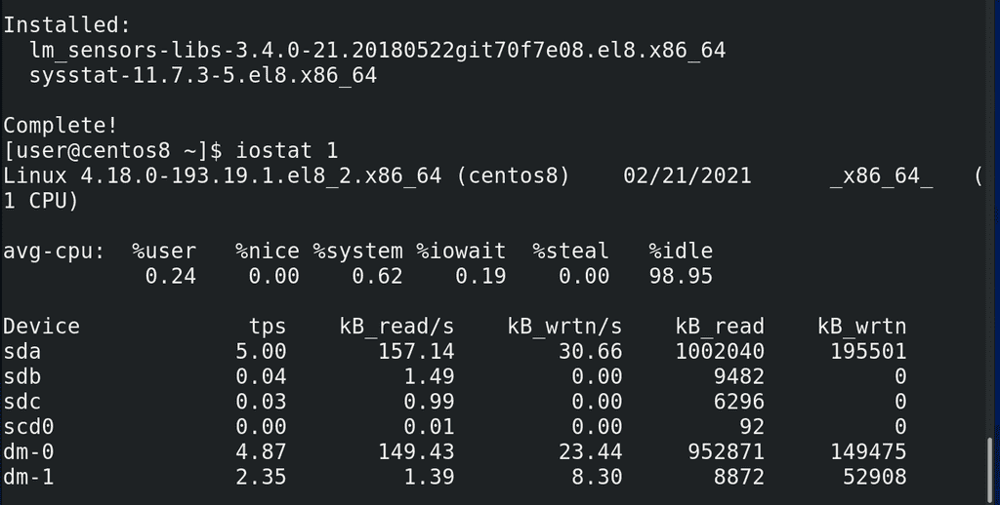
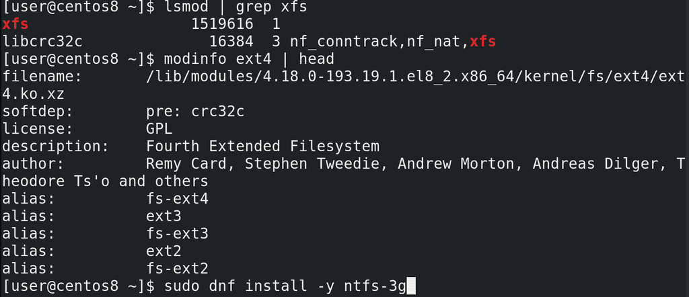

# 23. Основы файловых систем

<iframe width='560' height='315' src="https://www.youtube.com/embed/RfGnaYdRSMQ" title='YouTube video player' frameborder='0' allow='accelerometer; autoplay; clipboard-write; encrypted-media; gyroscope; picture-in-picture' allowfullscreen></iframe>



Теперь, когда у нас готовы диски и разделы, пора заняться файловыми системами. И хотя мы уже говорили о файловых системах, мы прошлись по ним поверхностно, теперь же копнём чуть глубже. Когда мы создавали разделы, мы заметили, что они имеют начало и конец, определённые секторами:

```
sudo fdisk -l /dev/sdb
```

То есть сектор – это физический адрес на диске. Причём, реальный, то есть физический размер секторов на современных жёстких дисках – 4 кибибайта или больше, да и сам термин больше относится к жёстким дискам, в тех же SSD вместо секторов - страницы. Тем не менее, в целях совместимости всё ещё можно работать с секторами размером в 512 байт, но лучше почитайте об этом по [ссылке](https://www.seagate.com/ru/ru/tech-insights/advanced-format-4k-sector-hard-drives-master-ti/).



Так вот, к чему я веду. Файлы хранятся на жёстком диске в секторах. Допустим, файл у нас начинается в секторе с номером 10000 и заканчивается в секторе с номером 20000. Несложно запомнить, когда у нас один файл. А когда 10 файлов? 100? 1000? А если у нас файлы постоянно меняют размеры? Тут, конечно, нужна программа, которая и будет всё это отслеживать – где начинаются и заканчиваются файлы. Причём, если у нас вчера файл заканчивался на секторе 20000, после него мы записали другой файл, а теперь понадобилось увеличить первый файл – то он станет занимать сектора от 10 тысяч до 20, и от 30 тысяч до 35. То есть необязательно, чтобы все сектора файла находились рядом друг с другом. Кроме этого, нужно различать все эти файлы – поэтому для каждого файла есть свой номер:

```
stat file
```

Да и этого недостаточно - у каждого файла свои права, свой владелец и группа. Также неплохо было бы также знать, когда файл создали, когда изменили, когда в последний раз к нему обращались. Ну и файлы нужно как-то структурировать, а не показывать пользователю одну большую кучу файлов.

Всем этим и занимается файловая система. И, условно, её можно разделить на две составляющие: первая – это программа, которая будет решать, куда писать файлы, откуда их читать и изменять какие-то значения, относящиеся к файлу, например, права; а вторая – это сами данные о файлах, откуда программа берёт данные и где она их сохраняет. Первая – программная часть – это модуль ядра. Вторая – метаданные файловой системы, иноды и прочее - хранятся, зачастую, на самом диске или разделе, где эта файловая система, хотя возможны исключения. А вот где именно хранятся метаданные, иноды, и что они из себя представляют – в целом ответить не получится, потому что это сильно разнится от типа файловой системы.

С некоторыми типами файловых систем, скорее всего, вы уже знакомы – FAT32, exFAT, NTFS.  И, возможно, вы знаете, что на FAT32 нельзя создать файл размером больше 4 ГиБ – просто потому что в метаданных для указания размера файла выделено 4 байта. Максимальное число, которое можно поместить в 4 байтах - 4 миллиарда. 4 миллиарда байт – 4 Гибибайта. Примерно по таким же принципам файловая система может, допустим, ограничить длину имени файла. Хотя сейчас это не так актуально, но это пример того, как тип файловой системы может накладывать ограничения.

Но всегда есть разработчики, которые любят обходить ограничения и добавлять какой-то функционал. Поэтому типов файловых систем много и для Linux есть много различных модулей для их поддержки – в том числе NTFS, FAT32 и т.п. Но мы с вами разбирали иноды, знаем, что там информация о правах на файлы, о владельце и группе файла – то есть стандартные UNIX-овые права. А в NTFS права реализованы по другому, поэтому, хоть Linux и работает с NTFS, но установить операционную систему на файловую систему NTFS не получится. Зато есть много других файловых систем, на которых всё работает как надо. Самые популярные для GNU/Linux – ext4 и xfs. В рабочей среде чаще всего вы будете иметь дело с ними.

Ещё в начале 90-ых была создана файловая система ext, которую стали использовать в Linux и с тех она постоянно развивалась. За годы работы эта файловая система доказала свою стабильность, а большинству пользователей от файловой системы другого и не надо. О максимальных размерах файловой системы и файлов можно не беспокоится – там эксбибайт и 16 тебибайт соответственно. У xfs также история начинается в начале 90-ых, сейчас её развивает компания RedHat и xfs по умолчанию стоит на дистрибутивах, основанных на RHEL. Давайте лучше поговорим о структуре файловой системы.



И так, мы говорили, что накопители – это блочные устройства и ядро работает с ними с помощью блоков данных фиксированной длины. Так вот, сектора являются минимальной физической единицей и называются физическими блоками, а их размер можно глянуть в файле:

```
cat /sys/class/block/sdc/queue/physical_block_size
```

Не нужно запоминать команды, это в целом информация для общего развития. А те самые блоки фиксированной длины, которыми оперирует ядро – это логические блоки:

```
cat /sys/class/block/sdc/queue/logical_block_size
```

Но, кроме этого, также и у файловых систем существует понятие блоков. Как мы выяснили раньше, секторам, в которых хранится файл, не обязательно находится рядом. В системе бывают тысячи файлов, какие-то растут, какие-то удаляются, появляется промежуток между секторами файла. Происходит так называемая фрагментация диска. И жёсткому диску для прочтения одного файла приходится совершать больше движений, от чего падает производительность. Когда таких файлов много – это беда. И если каждый сектор – это 512 байт,  жёсткому диску придётся несладко, прыгая между кучей разделённых секторов. Правда современные файловые системы поступают чуть умнее, оставляя много свободного места между файлами, что позволяет не мешать файлы в кучу мелких секторов, давая возможность файлам расти, не пересекаясь с другими. И тем не менее, если объединять сектора в небольшие группы, называемые блоками, допустим по 8 секторов – т.е. 4 кибибайта, то диску будет проще. Да и дело не только в этом – файловой системе легче работать с блоками. Допустим, если секторов по 512 байт на больших дисках получается огромное количество, то файловой системе может не хватить адресов, в итоге не получится создать файловую систему и файл большого объёма. Но вот объединив сектора в блоки, пусть хоть по 64 кибибайта, получится во много раз увеличить допустимый размер диска и файла. Это как с блокнотом, давая номер каждой клеточке блокнота у вас просто перестанет помещаться номер клетки в вашей таблице. Зато нумеруя не клетки, а страницы, вы сможете использовать куда больше клеток.

Но у блоков есть свои недостатки. Файловая система хранит информацию в блоках, а значит 1 файл – минимум 1 блок. Если предположить, что средний размер одного блока – 4096 байт, то для хранения однобайтного файла вы потратите 4096 байт. Если у вас в системе большинство файлов мелкие, то уйма места не будет использоваться. В таких случаях лучше указывать размер блока минимальным – для ext4 это 1КиБ. В любом случае, куча мелких файлов – большой напряг для диска. Но сейчас, в основном, файлы довольно большие, поэтому особо места вы не потеряете, если будете использовать 4 кибибайтные блоки. А в случае работы с большими файлами можно выставить размер блоков побольше.



Но мало хранить сам файл, нам ещё ведь нужно где-то хранить информацию о файле – иноду. И инода на ext4 весит 256 байт и больше. При этом, на разных типах файловых систем иноды создаются по разному – где-то они создаются динамически, когда это необходимо – так сделано в xfs, а где-то создаются сразу при создании файловой системы, как это сделано в ext4. Причём создаются они на каждые сколько-то байт, по умолчанию 16КиБ:

```
man mke2fs
/ -i
```

Из этого можно извлечь пару фактов. Количество инод на ext4 – ограничено. Если у вас куча файлов, размером меньше 16 КиБ, то у вас может закончится количество инод. И тогда, хотя и будет место на диске, использовать его вы не сможете – без свободных инод файл не создать. Но, во первых, по иноде на 16КиБ получается 64 иноды на один мебибайт места, т.е. на реальных дисках вы сможете создать миллионы файлов. Во вторых, вы это значение можете изменить, сделать количество байт на инод больше или меньше. С одной стороны, уменьшив количество байт на иноду, вы  сможете создавать больше файлов. С другой – посчитайте, на каждый мебибайт места вы тратите 16 КиБ на иноды, так как каждая инода весит 256 байт, а их 64. Т.е. на каждый гигабайт – 16 мегабайт чисто на иноды. На один терабайт – 16 Гигабайт. Ощутимо, правда? И это ещё при стандартном раскладе. Если у вас файлы большие, то можно и увеличить количество байт на иноду, но всё это делается при создании файловой системы. Поэтому такие вещи надо продумывать заранее – допустим, если вам нужен почтовый сервер, где будут миллионы писем – рассчитайте заранее, хватит ли вам инод? Ну или используйте xfs, тогда количество инод вас не будет беспокоить, так как там иноды выделяются динамически.

Можно долго говорить про структуру – сами блоки объединяются в группы блоков; в нулевой группе и некоторых других группах есть суперблок, где хранится информация о самой файловой системе, также во всех группах содержатся дескрипторы групп, таблицы инод и много чего другого, но… хотя эта тема интересная, но она будет актуальна только для ext4. Возможно, другие файловые системы работают со схожими структурами, но углубляться в эти структуры у нас сейчас нет необходимости. Моя цель была показать вам, что из себя представляют файловые системы, если вам интересно, посмотрите ссылки на структуру [ext4](https://ext4.wiki.kernel.org/index.php/Ext4_Disk_Layout) и [xfs](https://paste.c-net.org/RecipesMurdock).

Понимание структуры файловой системы поможет вам лучше понять их работу и различия, но пока вы изучаете азы, лезть в такие дебри не обязательно. Я знаю, что многим интересна тема [различия файловых систем](https://en.wikipedia.org/wiki/Comparison_of_file_systems), но о поверхностных различиях можно найти на всяких сайтах, а чтобы понять детали нужно разобрать многие термины и технологии, что займёт много времени и пока не критично для основ. Однако кое-что мы всё же разберём сейчас – журналирование.



Вы, возможно, знаете – нельзя вытаскивать флешку на ходу – нужно её сначала программно "отсоединить". Ну или допустим, нельзя выключать компьютер сразу из розетки, и в целом резкое выключение электричества может привести к печальным последствиям. Если говорить о дисках, то в операционной системе сотни процессов и часть из них постоянно пишет данные на файловую систему, всякие логи или временные файлы, не говоря о серверах, которые могут писать какие-то важные данные. Чтобы видеть информацию, как сейчас используется диск, можно глянуть утилиту iostat:

```
sudo dnf install sysstat
iostat 1
```

Но операции при работе с файлами – их создание или удаление – требуют от файловой системы нескольких операций – создание жёсткой ссылки, изменение информации в иноде, записывание данных на диск и т.п. Но что, если при создании или удалении файла выполнится только часть этих операций, а потом компьютер резко выключится или вы вытащите флешку? В итоге у вас может появится жёсткая ссылка, указывающая на иноду, в которой нет никаких данных. Или скажем запишется только часть данных, а инода будет указывать на незанятые блоки, в итоге место будет недоступно. Когда у вас пишутся сотни и тысячи файлов – это создаст кучу ошибок в файловой системе. И если флешку можно не выдёргивать, то вот полностью исключить резкое выключение компьютера невозможно. Но если писать все операции с файлами предварительно в специальное место, называемое журналом, а уже потом применять на диск – то файловая система после сбоя всегда может посмотреть в журнале, а что там недописалось и подчистить всякие ошибки при включении. Да и журналировать можно не только операции и метаданные, но и сами файлы, но это зависит от типа  и настроек файловой системы. В любом случае, наличие журнала позволяет смягчить урон при резкой потере связи с диском. И журналирование есть в большинстве современных файловых систем.



Ну и напоследок. Как я сказал, программная часть файловых систем выполнена в виде модулей ядра и их можно увидеть с помощью lsmod:

```
lsmod | grep xfs
modinfo ext4 | head
```

Но для работы с некоторыми файловыми системами – допустим, NTFS – надо устанавливать дополнительные пакеты:


```
sudo dnf install -y ntfs-3g
```

Подводя итоги. Для начала мы выяснили, зачем вообще нужны файловые системы. Также затронули тему блоков – физических, логических и блоков файловой системы. Поговорили о том, к чему приводят различия в структурах – как, например, различия в максимальных размерах файлов и блоков. Затронули одну из функций файловой системы – журналирование. На самом деле, мы не слишком углубились в детали, потому что их очень, очень много, но, кое-какое представление о файловых системах у нас сложилось.
