# 32. bash скрипты №6

<iframe width='560' height='315' src="https://www.youtube.com/embed/uSfLduR2H_o" title='YouTube video player' frameborder='0' allow='accelerometer; autoplay; clipboard-write; encrypted-media; gyroscope; picture-in-picture' allowfullscreen></iframe>

В прошлый раз мы научили наш скрипт вытягивать информацию о пользователях из файла. Всё это для того, чтобы наш скрипт был более самостоятельным. Но создавая пользователей вручную, мы можем предварительно проверить, занят ли такой логин, и, в случае чего, создать пользователя с другим логином. Попробуем научить скрипт делать также.

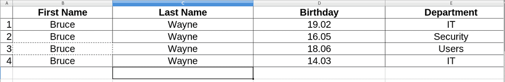

Я немного изменил файл с пользователями. Предположим, так получилось, что у нас 4 тёзки и мы отличаем их по дням рождения и группам.


Конвертируем файл в csv формат:

```
libreoffice --headless --convert-to csv users.xlsx
cat users.csv
```

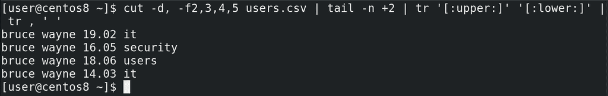

Немного подправим cut, с помощью которого мы брали информацию из csv файла – добавим в него поле 4, чтобы также вытягивать информацию о днях рождения. Проверим в терминале:

```
cut -d, -f2,3,4,5 users.csv | tail -n +2 | tr '[:upper:]' '[:lower:]' | tr , ' '
```

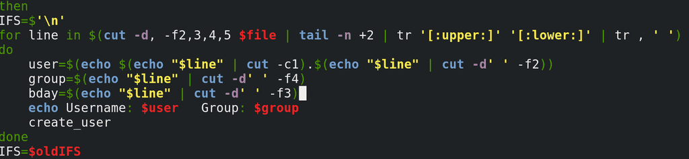

Как видите, информация о группе сместилась на 4 столбик, поэтому подправляем это в скрипте:

```
group=$(echo "$line" | cut -d' ' -f4)
```

Добавляем ещё одну переменную – bday – в которой и будет информация о дне рождения:

```
bday=$(echo "$line" | cut -d' ' -f3)
```

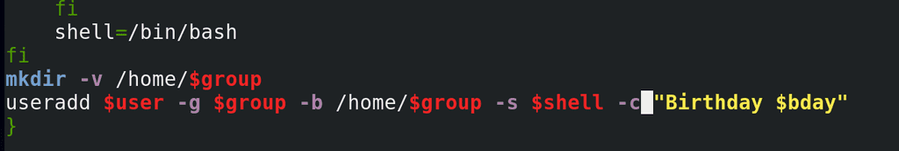

Ну и чтобы использовать эту переменную, добавим в нашу функцию create_user в саму команду useradd опцию -c  - то есть комментарий:

```
-с "Birthday $bday"
```

Пока мы только подготовились к тому, чтобы различать тёзок после их создания. Если мы сейчас просто запустим скрипт, useradd не создаст пользователей с одинаковыми логинами. И так, наша задача - скрипт перед созданием пользователя должен проверить, есть ли уже такой логин, и, если есть, создать пользователя с другим логином. Но, конечно, нужно ещё проверить, а не занят ли тот второй логин. Если мы будем проверять просто с помощью if, мы увидим, что есть пользователь b.wayne и создадим пользователя b.wayne2. А если он уже занят? Чтобы проверить, а не занят ли логин b.wayne2, нам придётся написать elif. Тогда мы укажем b.wayne3. А если и он занят? Сколько раз нам придётся писать условие? Мы не можем этого знать. Нам нужно проверять условие до тех пор, пока мы не получим нужный результат.

Для этого у нас есть команда while – комбинация условия и цикла. Пока выполняется условие, будет выполняться цикл. Синтаксис такой:

```bash
while условие
do команда
done
```

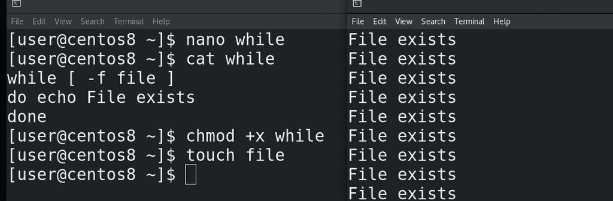

Как мы помним, условие – это просто любая команда, главное статус её выхода – 0, или что-то другое. Например:

```bash
while [ -f file ]
do echo file exists
done
```

То есть, пока файл есть, echo будет писать такой текст. Попробуем создать файл:

```
touch file
```

и запустить команду. Как видите, команда echo постоянно выдаёт текст.

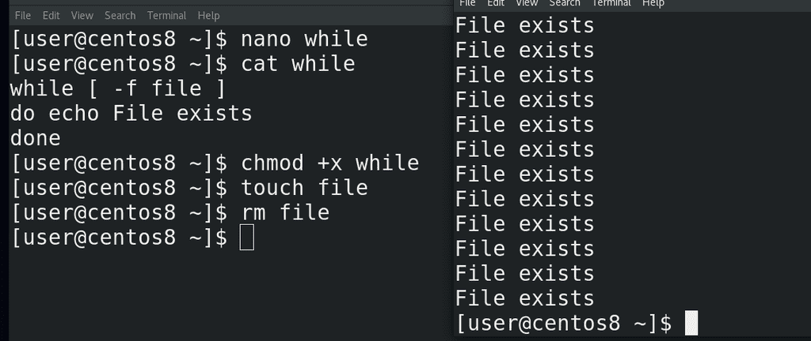

Попробуем удалить файл:

```
rm file
```

while получил код выхода 1 и закончил свою работу.

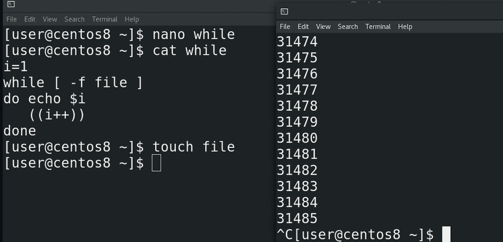

С while часто используют инкремент. Это такая операция увеличения переменной. Например, берут переменную i и перед циклом дают ей какое-то значение, например 1. Во время выполнения цикла её значение увеличивают. То есть при каждой итерации значение переменной будет увеличиваться. Увеличивать значение в bash-e можно по разному, хоть с помощью математических операций, так и используя специальный оператор ++:

```
((i++))
```

С помощью "--" можно, соответственно, уменьшать значение. Заменим echo, чтобы видеть значение переменной:

```
echo $i
```

и попробуем запустить скрипт:

```
./while
```

Как видите, очень быстро переменная достигла больших значений, а значит while сделал столько итераций.

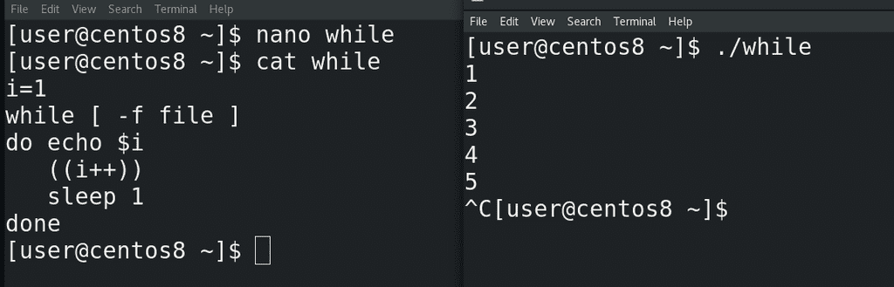

Можно, кстати, использовать команду sleep, чтобы заставить скрипт подождать сколько-то секунд, прежде чем выполнить следующую команду:

```
sleep 1
```

Как видите, теперь итерация происходит раз в секунду:

```
./while
```

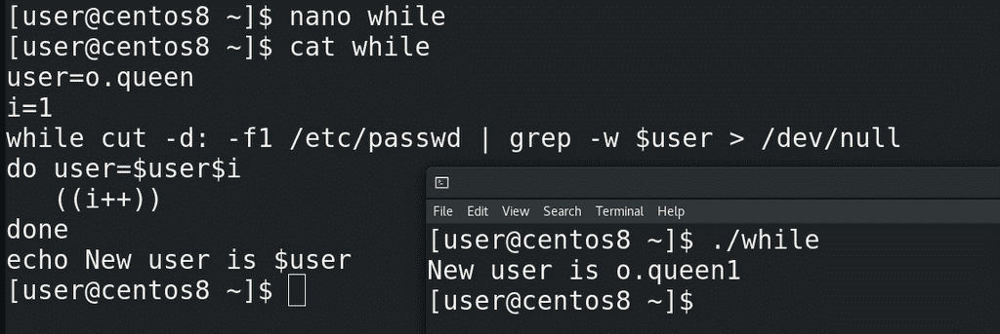

Хорошо, попробуем применить while к нашей задаче. Для начала напишем условие проверки наличия логина. В прошлый раз я показал, как с помощью grep-а найти нужный логин в passwd, сделаем также. Для тестов укажем переменную user=o.queen. Условие в while поставим проверку наличия пользователя:

```
while cut -d: -f1 /etc/passwd | grep -w $user
```

Таким образом мы проверяем, есть ли пользовать в passwd и, если есть, запускаем команды внутри цикла. Сделаем так, чтобы команда внутри цикла меняла значение переменной:

```
user=$user$i
```

то есть o.queen превратится в o.queen1. Переменная i станет 2:

```
((i++))
```

Убираем sleep, он нам не нужен. Попытаемся прочесть наш цикл. При запуске скрипта while проверяет, есть ли пользователь o.queen в passwd. Если он нашёл такого пользователя, значит условие выполнилось. Если условие выполнилось, значит while запускает команды – сначала он меняет значение переменной user на o.queen1. Затем он меняет значение переменной i на 2. Происходит итерация – теперь while ищет в passwd пользователя o.queen1. Если он не находит - цикл заканчивается, значение переменной остаётся o.queen1 и запускаются следующие команды. Если же он нашёл юзера o.queen1, то переменная становится o.queen2, переменная i становится 3 и так до тех пор, пока grep не скажет, что такого пользователя нет. Давайте в конце выведем полученное значение переменной:

```
echo New var is $user
```

Запустим скрипт:

```
./while
```

Как видите, теперь переменная user стала o.queen1, а дальше можно эту переменную использовать для создания пользователя. Ну и чтобы не видеть вывод команды grep, просто направим его в /dev/null:

```
> /dev/null
```  

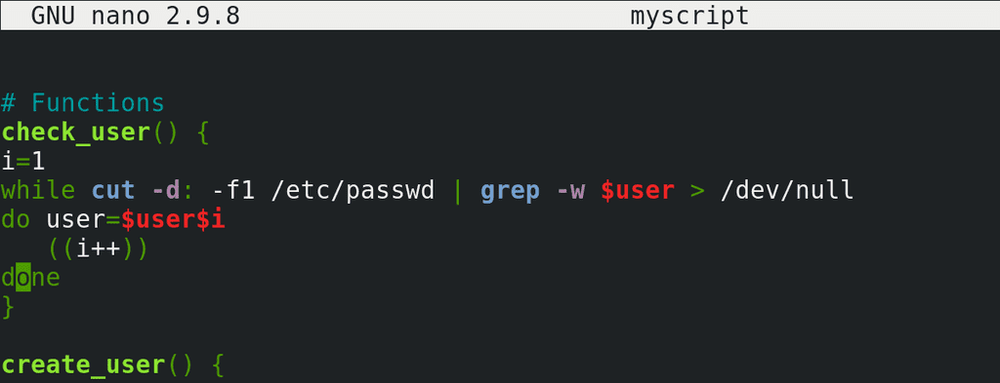

Хорошо, теперь скопируем полученный цикл и вставим его в наш скрипт. Сделаем это в виде функции – check_user:

```bash
check_user()    { 
    i=1 
    …
                }
```
                

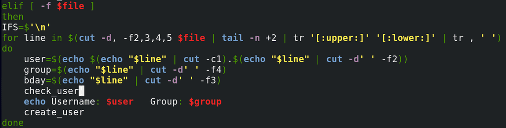

Ну и укажем эту функцию в нашем цикле for, который создаёт пользователей из файла.

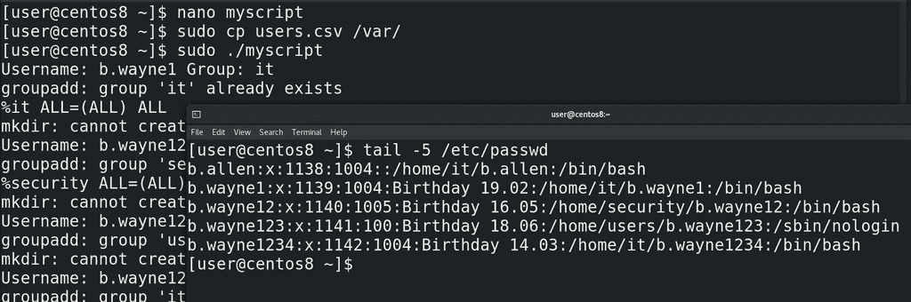

Сохраним, скопируем новый файл users.csv в директорию /var/:

```
sudo cp users.csv /var/
```

и запустим скрипт:

```
sudo ./myscript
tail -5 /etc/passwd
```

Как видите, для всех тёзок создались аккаунты, хотя логины получились не такими, как мы ожидали. Почему так получилось и как это исправить – это задача для вас.

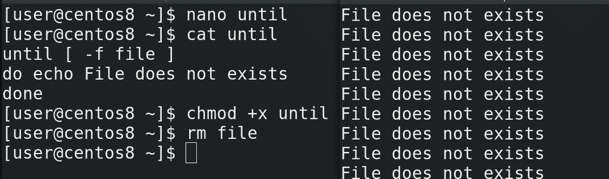

Напоследок, рассмотрим команду until. Если в while цикл продолжает работать пока условие верно, то есть код выхода условия 0, то в until наоборот – цикл будет работать пока условие неверно, то есть код выхода не 0. То есть, условно, while - пока всё хорошо, делать что-то. А until – пока не станет хорошо, делать что-то. Синтаксис практически одинаковый:

```bash
until [ -f file ]
do echo file does not exists
done
```

Дадим права, удалим файл и попробуем запустить:

```
chmod +x until
rm file
./until
```

Как видите, скрипт говорит, что файла нет.

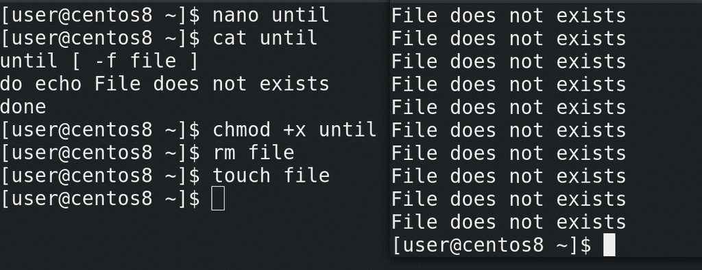

То есть, пока не выполнится условие, пока не появится файл:

```
touch file
```

until будет продолжать работать.

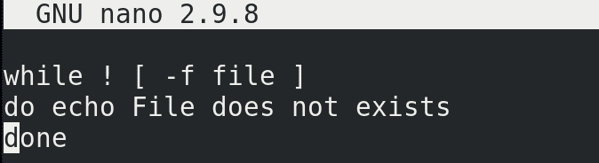

Но, как мы помним, мы можем использовать тот же while с восклицательным знаком:

```
while ! [ -f file ]
...
```

что даст, по сути, тот же результат. Разве что читать скрипт с until где-то проще, вместо того, чтобы обращать значение while.

В этот раз мы с вами разобрали while и until. Можно наткнуться на различные способы использовать тот же while, until, for и другие команды. Но если понимать, что, допустим, тому же while нужен статус выхода и безразлична сама команда, то многие способы применения станут понятнее. Со скриптами мы сделаем перерыв, так как много других важных тем, но, я надеюсь, что вы стали лучше понимать, что такое скрипты, как их читать и писать. Для примера, постарайтесь прочитать те же файлы /etc/bashrc и /etc/profile, которые мы разбирали раньше. Это просто скрипты, которые выполняются при запуске bash-а.  Возможно вам неизвестны все ключи – но это нормально, всегда можно обратиться к документации.
