# 33. Загрузчик GRUB

<iframe width='560' height='315' src="https://www.youtube.com/embed/wBlChpSjwlg" title='YouTube video player' frameborder='0' allow='accelerometer; autoplay; clipboard-write; encrypted-media; gyroscope; picture-in-picture' allowfullscreen></iframe>

Для работы какой-либо программы её нужно предварительно запустить. Какие-то программы мы запускаем сами, какие-то программы запускают другие программы. И при запуске компьютера есть определённая последовательность, какие программы что и зачем запускают. Процесс запуска операционной системы администратору нужно знать, потому что, во-первых, это помогает выявить и решить какие-то проблемы, во-вторых, это помогает какие-то проблемы предотвратить. Ну и в-третьих, помогает лучше понять работу операционной системы. Например, вспомните, мы с вами испортили запись в fstab, у нас система не прогрузилась, потом мы её исправили и всё заработало.

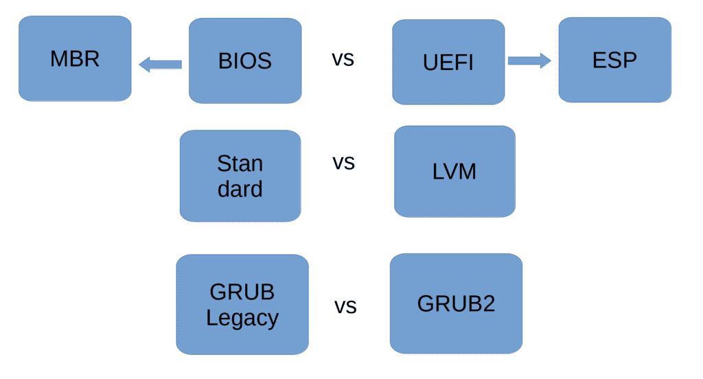

Есть много сценариев запуска операционной системы, которые зависят от определённых условий. Например, мы с вами говорили про BIOS и UEFI, и тут, как минимум, уже два сценария запуска – с использованием MBR или раздела EFI system partition. Также мы с вами разбирали стандартные разделы, LVM, RAID – и это тоже добавляет варианты – используется ли для корня стандартные раздел или какой-то нестандартный, допустим, LVM. Ну и сегодня мы будем говорить о загрузчиках, которых много. Даже с учётом того, что мы будем разбирать только один загрузчик – grub, у него есть разные версии, от чего тоже появляются вариации. Но не будем усложнять, обо всём по порядку.


Со всем вышесказанным мы знакомы, кроме загрузчика. Загрузчик – это программа, которая загружает операционную систему. Это особая программа, потому что она работает ещё до того, как загрузилась операционная система, ядро и всякие другие программы. Тут можно понять, что у загрузчика должны быть свои, хотя бы минимальные драйвера для работы с компьютером – где-то он обращается к биосу, где-то напрямую к железу. При включении GNU/Linux-а мы видим такое окно – это такой интерфейс загрузчика Grub. Есть и другие загрузчики, но grub самый популярный, он стоит по дефолту на многих системах и, чтобы не усложнять, мы будем говорить только о нём.

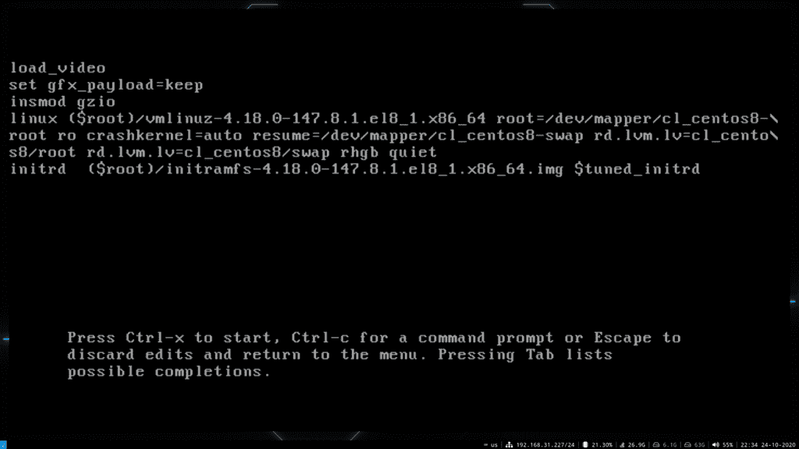

И так, при включении у нас появляется окно grub, где мы можем выбрать нужную операционную систему. Если у нас на дисках установлены разные операционные системы мы сможем загрузить любую из них. К тому же тут также есть возможность загрузить одну и ту же операционку с разными версиями установленного ядра. Также отсюда мы можем повлиять на процесс загрузки – например, нажать "e" на нужной записи и изменить какие-то параметры. Но мы к этому ещё придём. Плюс grub можно кастомизировать – поменять шрифт, рамки, цвета, поставить фон и всё такое. Чтобы лучше понять grub нам нужно хотя бы разок пройтись по сценарию запуска операционной системы.

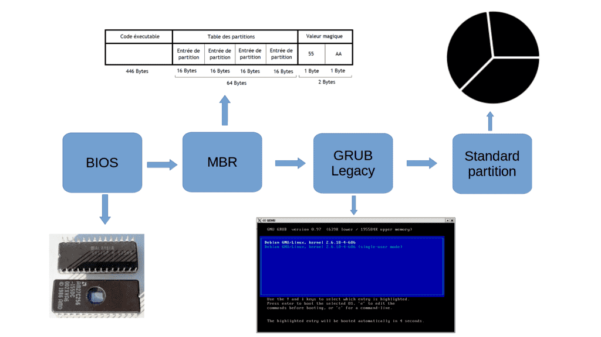

Возьмём самый простой сценарий: BIOS – MBR – GRUB – корень на стандартном разделе. И так, вы нажали кнопку включения на компьютере, загрузился BIOS, какие-то свои задачи выполнил, а дальше обращается к порядку загрузки – диски, флешки, сеть и всё такое. Предположим, у нас на первом месте жёсткий диск. BIOS загружает первый сектор - 512 байт этого диска, то есть MBR. Как мы помним, у нас в MBR есть загрузчик и таблица разделов. Для загрузчика выделено 446 байт – это очень маленький объём, куда невозможно поместить полностью grub – поэтому здесь лежит программа, в которой прописан блочный путь к основной части grub-а. Блочный – потому что поддержку файловой системы в такой маленький объём не запихнуть. Этот шаг, когда загружается маленькая часть grub из MBR называется этапом 1.

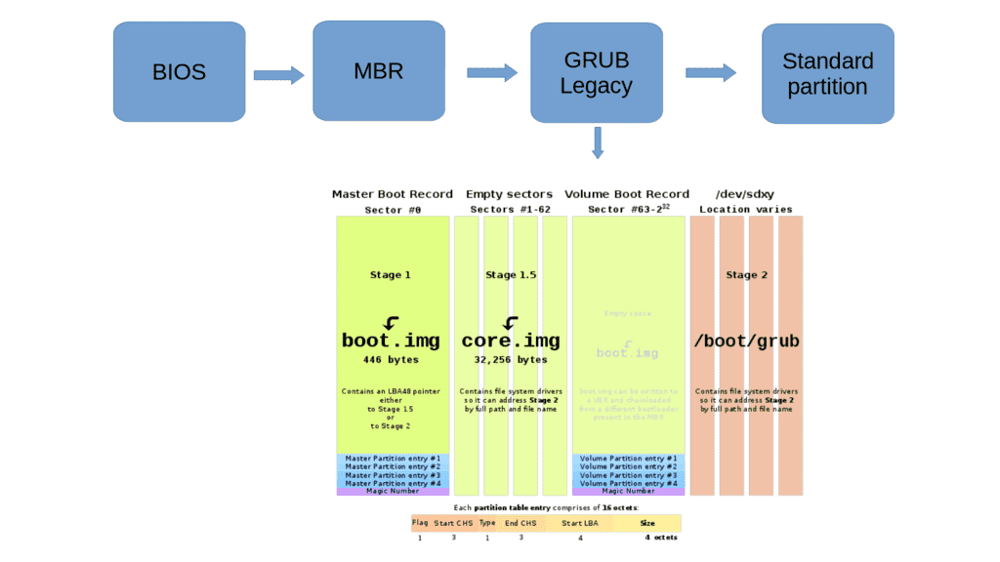

В случае со старым железом BIOS мог видеть только первые 1024 цилиндра жёсткого диска, т.е. примерно первые 500 мегабайт, а если основная часть grub-а находилась в другом месте – то не получилось бы его загрузить. Поэтому для таких случаев существовал этап 1.5, когда загружалась чуть большая часть grub-а, расположенная в первых 62 секторах диска, где лежали драйвера для файловых систем. Загрузив их grub мог уже полноценно найти и загрузить основную свою часть, которая лежит в директории /boot/grub – т.е. приступить к этапу 2.

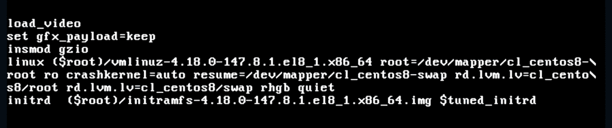

Grub, загрузив свою основную часть, обращается к файлу /boot/grub/grub.cfg и берёт оттуда записи, что и как грузить. Если говорить про Linux, то задача grub – загрузить ядро и передать ему нужные параметры. Эти параметры видны в строчке linux: файл vmlinuz, который мы видели в директории /boot; файловая система (root=...), где лежит корень; rhgb – чтобы отображать анимацию, пока грузится операционная система; quiet – чтобы скрыть подробный вывод при запуске.


Давайте, для примера, сотрём последние две опции — используем стрелки для перемещения, на строке linux уберём «rhgb quiet» и нажмём ctrl+x, чтобы загрузиться. Как видите, теперь при загрузке отображается куча информации, что может быть полезно, если по какой-то причине система не грузится и мы пытаемся найти причину. После перезагрузки эти опции опять будут на месте, потому что мы их стёрли в текущей сессии, а не в конфиг файле.

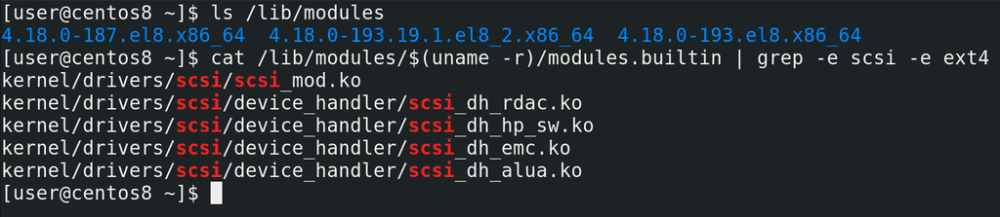

Окей, grub запустил ядро. Что дальше? Ядро начинает запускаться, находить устройства и загружать драйвера. Но для этого ядру нужны модули. Вспомните про модульность ядра – у ядра есть встроенные модули и загружаемые. Встроенные уже в самом файле vmlinuz, а загружаемые лежат в директории /lib/modules/. Ядро загрузит то что сможет, используя встроенные модули, а дальше ядру нужен доступ в директорию /lib/modules. Для этого ядро должно примонтировать корень. Только вот такой нюанс – для того, чтобы примонтировать корень, ядру нужны модули – как минимум, модуль scsi и модуль файловой системы. Давайте посмотрим список встроенных модулей:

```
cat /lib/modules/$(uname -r)/modules.builtin | grep -e scsi -e ext4
```

Как видите, тут есть модули scsi, но нет модуля ext4. То есть ядро просто не сможет примонтировать корень, чтобы взять оттуда модули. При этом, чтобы эти модули были, ему нужно примонтировать корень.


Можно было бы встроить в ядро все нужные модули, но это сделает ядро значительно тяжелее, файловых систем много, да и если брать LVM и прочее.. в общем, не выход. Эта проблема решается по другому. В grub под строкой с linux есть еще одна строка – initrd – initial ram disk. Как видите, она указывает на файл. Этот файл – ram disk – временный образ корня, который специально предназначен для решения указанной проблемы. При загрузке grub монтирует этот файл в качестве корня и ядро может с ним работать. Здесь оно находит все нужные драйвера для того,  чтобы загрузить настоящий корень, после чего ядро переключается на основной корень. Этот временный корень не содержит все файлы, а только необходимый минимум, какие-то драйвера файловых систем и т.п., чтобы можно было перейти на нужный корень. Но в каких-то дистрибутивах сюда включены чуть ли не все драйвера и некоторые программы. И если у вас какие-то проблемы с корнем, не получается монтировать, или, например, вы хотите сделать fsck корня, то используя этот временный корень вы можете провести какие-то работы.

Но, на самом деле, если присмотреться, файл называется не initrd, а initramfs – initial ram file system. Initramfs пришёл на замену initrd, так как у initrd есть определённые недостатки. Например, initrd был файлом образом блочного устройства, внутри которого была файловая система, а значит ядру для работы с ним нужен был хотя бы один встроенный модуль файловой системы. Initramfs это больше архив, который распаковывается в виртуальную файловую систему tmpfs. А tmpfs является частью ядра, предназначенной для всяких файловых систем, работающих в оперативке. Так вот, когда ядро видит initramfs, оно берёт оттуда нужные модули, а также запускает программу, ну или просто скрипт, с названием init. Она может выполнять какие-то команды, если этого захотели разработчики дистрибутива, в итоге монтирует настоящий корень и переключается на него. Есть небольшие отличия в работе между initrd и initramfs, но такие подробности нам сейчас не нужны.

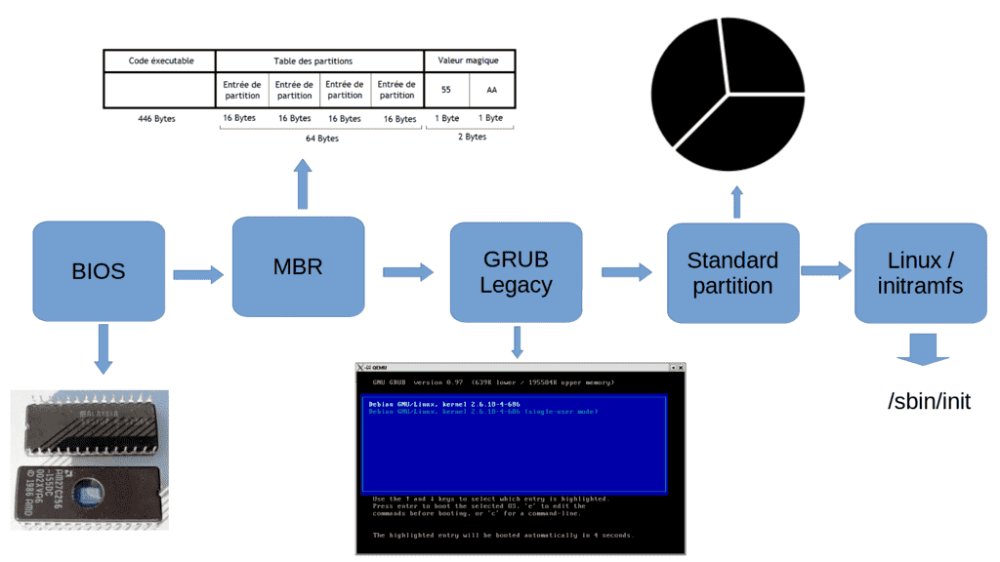

Так вот, после всей этой инициализации, когда ядро взяло нужные модули из initramfs, init запускает программу /sbin/init в настоящем корне, которая стартует систему инициализации. Система инициализации – это отдельная тема, которую будем разбирать в следующий раз. Пока что мы разобрали только один сценарий: BIOS – MBR – GRUB – стандартный раздел. Давайте вкратце пройдёмся по нему – BIOS грузит загрузчик из MBR на 446 байт, это первый этап загрузки GRUB-а. Дальше GRUB грузит свой второй этап, ссылаясь на /boot/grub. Полностью загруженный GRUB видит в конфигах путь к ядру и initramfs, загружает ядро и initramfs в оперативку, ядро подгружает нужные модули благодаря initramfs, запускает init, который в итоге переключается на реальный корень и запускает программу /sbin/init – то есть систему инициализации. В других сценариях в целом многое будет схоже, но отличия всё же есть, давайте их разберём.

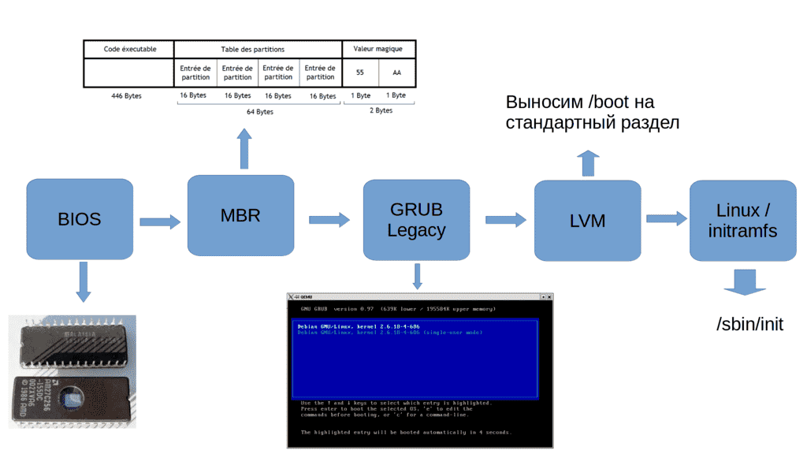

Заменим стандартный раздел на LVM. Допустим, корень у нас в LVM. Чтобы grub мог загрузить ядро и initramfs, ему нужен доступ в директорию /boot, но если они находятся на LVM разделе, grub не сможет их увидеть. В таких случаях директорию /boot выносили на отдельный стандартный раздел. Благодаря чему grub мог загрузить ядро и initramfs со стандартного раздела, а дальше ядро находило в initramfs модули для LVM и могло примонтировать реальный корень.

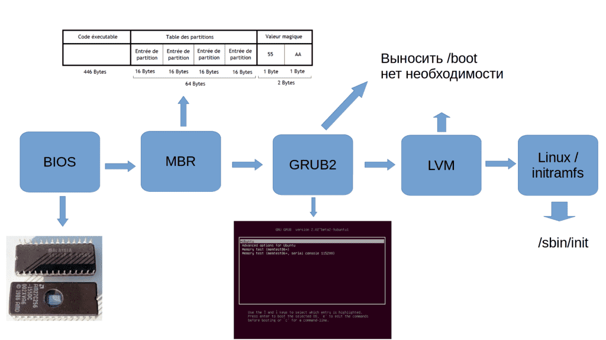

Но так было раньше, со старой версией Grub, которая сейчас называется grub-legacy. Современная версия grub называется grub2 и она поддерживает LVM, благодаря чему нет необходимости выносить /boot на отдельный раздел.

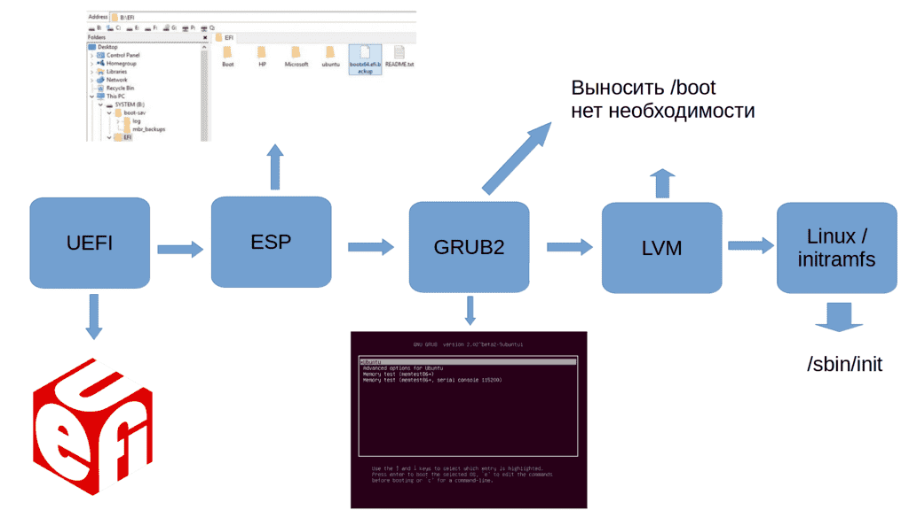

Если заменить BIOS на UEFI, то отпадает необходимость в загрузчике в MBR.  При включении UEFI ищет раздел EFI system parititon и загружает оттуда bootx64.efi или grubx64.efi. А это запускает grub, который обращается к файловой системе, где находится директория /boot/grub и дальше всё как мы говорили.

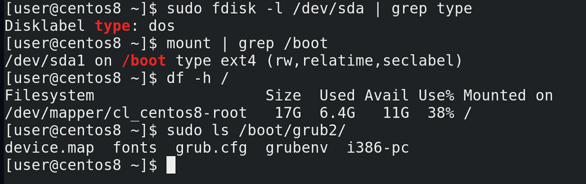

Давайте посмотрим, как всё организовано на нашей виртуалке. Virtualbox для гостевых машин использует BIOS. Таблица разделов у нас dos, т.е. используется MBR:

```
sudo fdisk -l /dev/sda | grep type
```

Ну и если посмотреть файловые системы:

```
mount | grep /boot
```

можно увидеть, что boot вынесен в отдельный раздел, а для корня используется LVM:

```
df -h /
```

При этом grub у нас второй версии:

```
ls /boot/grub2
```

Если вы читали внимательно, вы помните, что grub2 поддерживает LVM, и выносить /boot на стандартный раздел не нужно. Но официально RedHat рекомендует держать /boot всё таки на стандартном разделе. Объяснения почему я не нашёл, но, предполагаю, что дело в решении проблем. Если у вас возникнут проблемы с LVM, вы не сможете загрузить даже ядро с initramfs, потому что они лежат на логическом разделе, вам придётся использовать live-cd. Стандартный раздел для /boot позволит вам прогрузить хотя бы ядро с initramfs. Хотя, возможно, есть и другие причины, но о причинах в документации ничего не сказано.

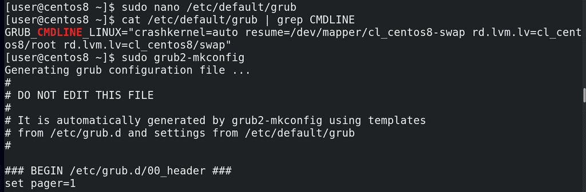

Ну и напоследок, давайте немного подредактируем grub. Хотя сам конфиг это /boot/grub2/grub.cfg, вручную редактировать этот файл не стоит, он будет перезаписываться при обновлениях. Чтобы наши изменения оставались даже после обновления, нужно редактировать файл /etc/default/grub:

```
sudo nano /etc/default/grub
```

Например, уберём rhgb и quiet в строчке GRUB_CMDLINE_LINUX и сохраним. После этого нужно обновить конфиг файл grub-а. Сначала убеждаемся, что всё нормально, просто запускаем команду:

```
grub2-mkconfig
```

Если всё нормально, то мы увидим будущий конфиг.

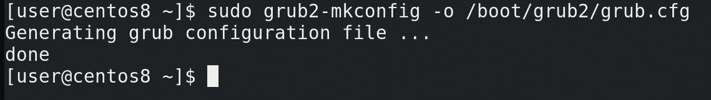

Затем перенаправляем вывод этой команды в файл /boot/grub2/grub.cfg:

```
sudo grub2-mkconfig -o /boot/grub2/grub.cfg
```

Ну и для проверки можем перезагрузиться.

Ну и если говорить про initramfs, стоит упомянуть возможность добавлять в него определённые модули. Пример из практики – у вас есть виртуальная машина на гипервизоре ESXi, это такой коммерческий гипервизор от компании VMWare. И вам нужно перенести виртуальную машину на гипервизор KVM – свободный гипервизор, активно используемый в Linux-ах. Если вы просто перенесёте файлы, скорее всего у вас виртуальная машина просто не запустится. Причина – ядро виртуалки при запуске просто не увидит корень, у вас не будет дисков sda, sdb и т.д.

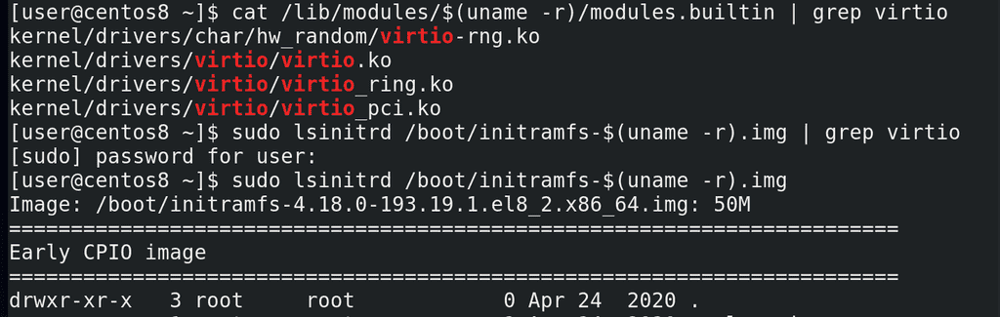

Чтобы ядро увидело диски, ему нужны будут другие драйвера scsi – virtio. Но они не встроены ни в ядро:

```
cat /lib/modules/$(uname -r)/modules.builtin | grep virtio
```

ни в initramfs:

```
sudo lsinitrd /boot/initramfs-$(uname -r).img | grep virtio
```

Список модулей в initramfs можно увидеть с помощью команды:

```
lsinitrd /boot/initramfs-$(uname -r).img
```

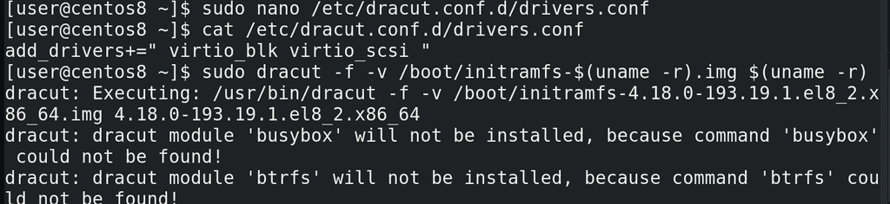

Ну и чтобы добавить эти модули в initramfs, нужно создать файл в директории /etc/dracut.conf.d/ с названием, заканчивающимся на .conf и списком необходимых модулей:

```
add_drivers+=" virtio_blk virtio_scsi "
```

Ну и сгененировать новый образ initramfs:

```
sudo dracut -f -v /boot/initramfs-$(uname -r).img $(uname -r)
```

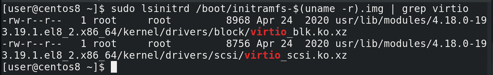

После чего можем убедиться, что новые модули будут в initramfs:

```
sudo lsinitrd /boot/initramfs-$(uname -r).img | grep virtio
```

Подведём итоги. Сегодня мы с вами разобрали, как операционная система запускается – куда обращаются BIOS и UEFI, что такое загрузчик и какова его роль, зачем нужна директория /boot, почему ядро и initramfs находятся в этой директории, ну и что такое initramfs.
