# 38. Создание backup скрипта

<iframe width='560' height='315' src="https://www.youtube.com/embed/vQUVsHwyRhg" title='YouTube video player' frameborder='0' allow='accelerometer; autoplay; clipboard-write; encrypted-media; gyroscope; picture-in-picture' allowfullscreen></iframe>

Планировщики задач используют для разных целей, одна из самых популярных - бэкап данных. Сейчас во многих компаниях для бэкапа используются готовые решения, которые делают это централизовано, со всех систем, умеют самостоятельно восстанавливать и имеют широкий функционал. Однако дедовский метод организации бэкапа с линукс серверов всё ещё имеет большую популярность и применяется не только в малых компаниях.  На самом деле, у меня скопилось несколько небольших утилит, о которых нужно рассказать, и все эти утилиты так или иначе применяются при бэкапе. Поэтому мы будем создавать решение для бэкапа и одновременно рассмотрим каждую из утилит.

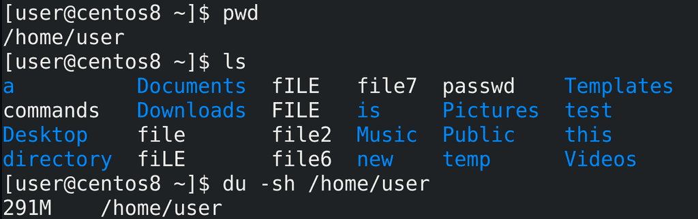

Для начала следует определиться, что мы будем бэкапить. Для примера возьмём домашнюю директорию пользователя /home/user:

```
pwd
ls
```

Следует определиться с размером этой директории, для этого я использую утилиту du с ключами -sh:

```
du -sh /home/user
```

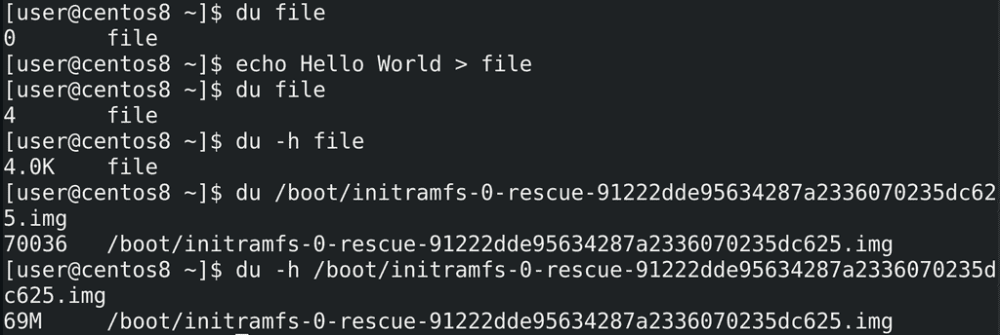

Приостановимся на этой утилите. du file покажет размер файла. В данном случае файл пустой, поэтому его размер 0. Если я добавлю что-то в файл:

```
echo Hello World > file
```

его размер изменится:

```
du file
```

Теперь мы видим, что размер стал 4. По умолчанию, размер показывается в кибибайтах - т.е. 4096 байт. Чтобы не считать размер, особенно если файл большой, лучше использовать опцию -h - human readable - то есть понятный человеку размер:

```
du -h file
du /boot/initramfs-*
du -h /boot/initramfs-*
```

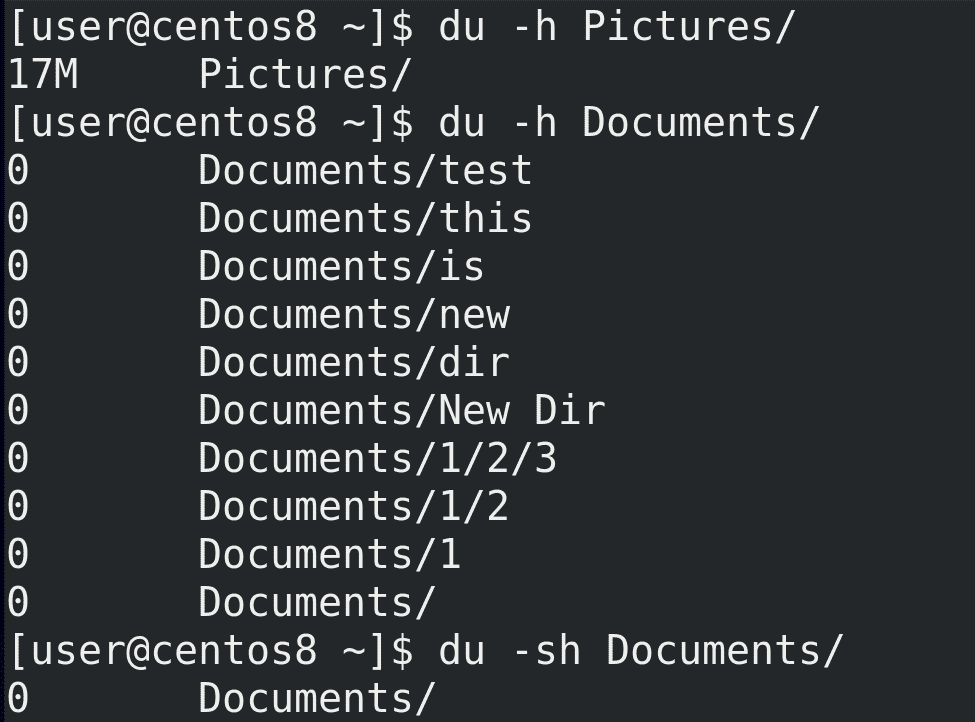

Можно узнать размер директории со всем содержимым, просто указав директорию - du -h Pictures. Но если в этой директории будут поддиректории, то du покажет размер каждой из них:

```
du -h Documents
```

Чтобы показать общий размер директории можно использовать ключ -s:

```
du -sh Documents
```

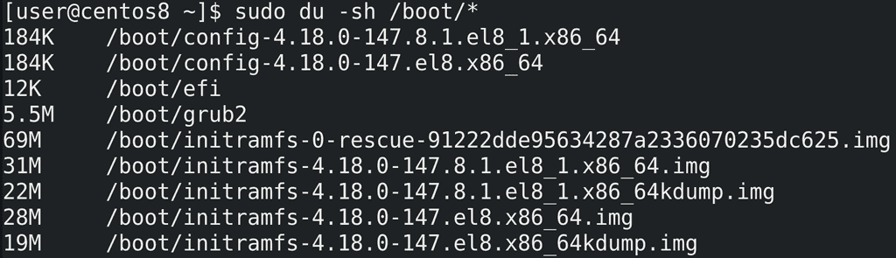

Чтобы увидеть размеры всех файлов в директории следует передать их команде du с помощью, например, звёздочки:

```
sudo du -sh /boot/*
```

На всякий случай напомню, что звёздочку обрабатывает bash - т.е. при виде звёздочки он собирает имена всех файлов и передаёт их команде du в виде аргументов:

```
du file1 file2 file3
```

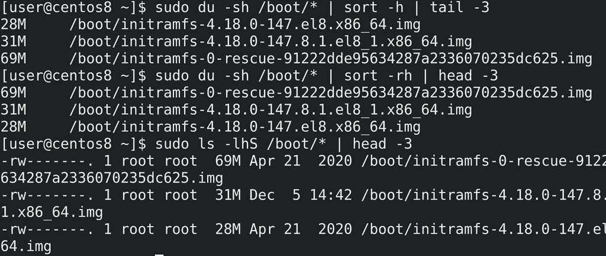

Весьма полезно бывает отсортировать файлы по размеру, например, чтобы увидеть самые большие файлы. du сам не сортирует, но для этого можно использовать команду sort с ключом -h:

```
sudo du -sh /boot/* | sort -h | tail -3
```

По умолчанию она сортирует от самого маленького файла к самому большому, что не всегда удобно, поэтому сортировку можно перевернуть с помощью ключа -r:

```
sudo du -sh /boot/* | sort -rh | head -3
```

Команда ls также может вывести размеры файлов и сразу их отсортировать:

```
sudo ls -lhS /boot/* | head -3
```

Но, как видите, вывод ls не всегда удобен для чтения.

У du есть и другие интересные ключи, но для большинства случаев сказанного выше будет достаточно. Поэтому продолжим.


И так, мы знаем, что наша домашняя директория занимает столько-то мегабайт:

```
du -sh /home/user
```

И здесь огромное количество файлов и директорий. Давайте узнаем сколько, для этого используем утилиту find:

```
find /home/user -type f | wc  -l
find /home/user -type d | wc -l
```

Примерно 5 тысяч файлов и 300 директорий. Теперь разберём, как мы это узнали.

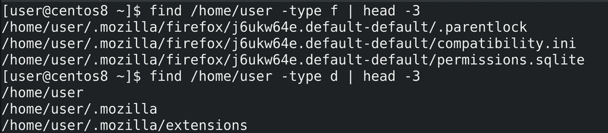

find - важная утилита, с которой нужно научиться работать. Синтаксис примерно такой - find где, а дальше что мы ищем. В данном случае мы искали файлы - ключ -type f, а также директории - -type d. find найденное выводит в виде списка, по одному значению на строку:


```
find /home/user -type f | head -3
find /home/user -type -d | head -3
```

поэтому можно просто посчитать количество полученных строк и это будет количеством файлов. Для этого мы использовали утилиту wc с опцией -l - посчитать количество строк.

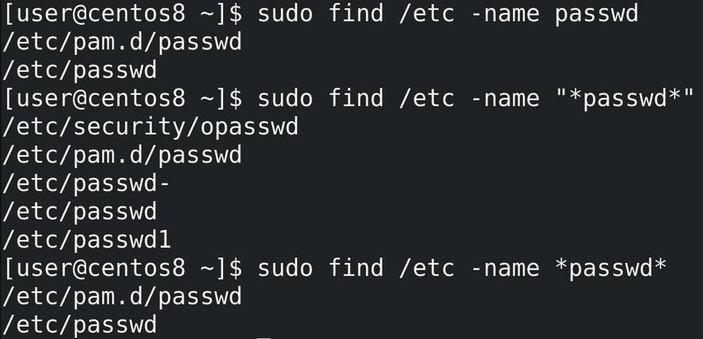

find обладает большим функционалом для поиска файлов. Самое простое - поиск файлов по имени:

```
sudo find /etc/ -name passwd
```

При поиске можно использовать регулярные выражения:

```
sudo find /etc/ -name "*passwd*"
```

При этом не забывайте брать выражение в кавычки.

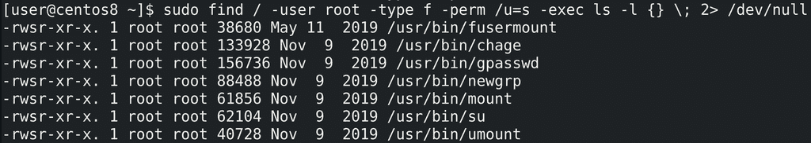

Для примера, найдём все файлы с правами SUID, принадлежащие root пользователю:

```
sudo find / -user root -type f -perm /u=s -exec ls -l {} \; 2> /dev/null
```

Некоторые опции мы уже разбирали, из нового - perm - permissions - права. С помощью этой опции мы можем искать файлы с определёнными правами. Также мы можем запускать команды с помощью -exec и передавать им найденный список файлов. В данном случае я передал список команде ls -l.

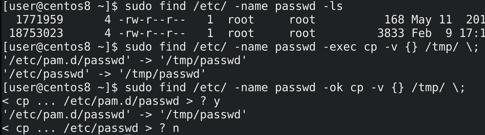

У find есть список готовых команд, которые можно выполнить с найденными файлами. Среди них есть тот же самый ls:

```
sudo find /etc/ -name passwd -ls
```

Можно, например, список найденных файлов копировать:

```
sudo find /etc/ -name passwd -exec cp -v {} /tmp/ \;
```

Также можно -exec заменить на -ok, чтобы перед каждым действием спрашивать пользователя:

```
sudo find /etc/ -name passwd -ok cp -v {} /tmp/ \;
```

find заменяет фигурные скобки найденным значением.

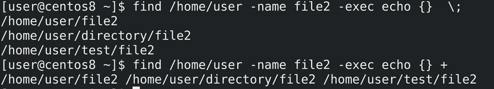

Точка с запятой означает, что команда будет запущена для каждого значения отдельно. Вместо точки с запятой можно использовать плюс, чтобы запустить всего одну команду со списком значений. Для примера используем echo:

```
find /home/user -name file2 -exec echo {} \; 
find /home/user -name file2 -exec echo {} +
```

В первом случае команда echo запустилась 3 раза с разными аргументами, что-то вроде цикла for со списком значений. Во втором случае команда find получила разом все три аргумента, поэтому вывела всё в одну строку.

В общем, с помощью find можно гибко искать по всей системе файлы основываясь на различных значениях - имени файла, владельце, правах, времени доступа и изменении файла и т.п. После чего можно сразу выполнить с файлом какое-либо действие - удалить, скопировать, посмотреть и т.п. Я раскрыл не весь функционал find-а, но вы всегда можете найти необходимую опцию в man-е или гугле. find нам ещё понадобится чуть позже, а пока вернёмся к бэкапу.

И так, у нас есть директория, в которой тысячи файлов и сотни директорий. Самый простой способ бэкапа - просто скопировать директорию. Но нужно понимать, что при этом система будет копировать каждый файл и каждую директорию по отдельности, создавая для каждой копии новый инод, проделывая кучу операций. При этом, если мы будем копировать на другой компьютер - опять же, все операции будут проводиться с каждым файлом по отдельности. Для нас это может быть и прозрачно, но для системы это множество лишних операций. И это у нас ещё тестовая система, где файлов мало, а в рабочей среде файлов может быть во много раз больше. Для бэкапа и передачи большого количества файлов лучше использовать архивацию - объединить несколько файлов в один. Для архивации используется утилита tar.

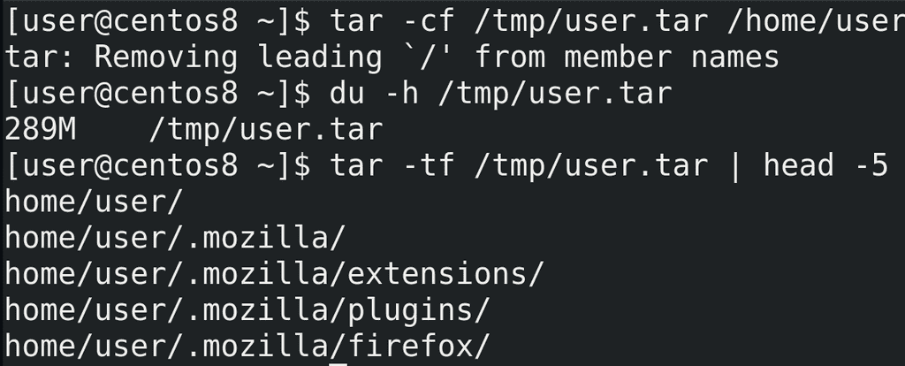

Синтаксис для создания архива такой - tar -cf - где ключ -c это create, т.е. создать, а ключ -f это file - файл архива. После f нужно указать директорию и имя архива, после чего указываются директории и файлы для добавления в архив. Для примера, создадим архив домашней директории пользователя:

```
tar -cf /tmp/user.tar /home/user
```

Этой командой tar создаёт архив в директории /tmp/ с названием user.tar и добавляет в этот архив директорию /home/user. Обычно для архивов используется расширение .tar. Размер архива примерно соответствует размеру директории:

```
du -h /tmp/user.tar
```

Чтобы посмотреть содержимое архива можно использовать ключ -t:

```
tar -tf /tmp/user/tar
```

Кстати, обратите внимание, что при создании архива tar выдал сообщение об удалении символа корня со всех файлов. И при просмотре содержимого архива это видно - в начале каждого файла отсутствует слэш /. Т.е. используются относительные пути. Это позволяет распаковывать архив в любую директорию.

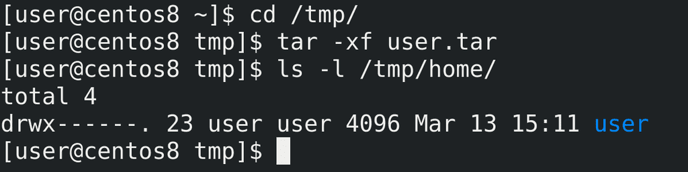

Для распаковки архива используется ключ -x - extract - извлечь:

```
cd /tmp/
tar -xf user.tar
ls /tmp/home
```

Во первых, я не спроста зашёл в директорию tmp - tar по умолчанию распаковывает содержимое архива в текущую директорию. Т.е. я находился в /tmp и tar распаковал архив в эту директорию. Во вторых, из-за того, что в архиве при создании был убран корень, то все файлы распаковались в директорию /tmp, в итоге получилось /tmp/home/user.

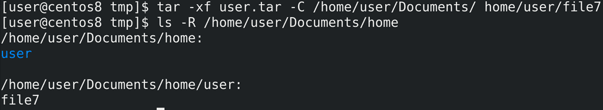

Из архива можно распаковывать определённый файл, а также указывать директорию, куда это будет распаковываться с помощью ключа -C:

```
tar -xf user.tar -C /home/user/Documents home/user/file7
```

При этом, как видите, везде используется относительный путь home/user.

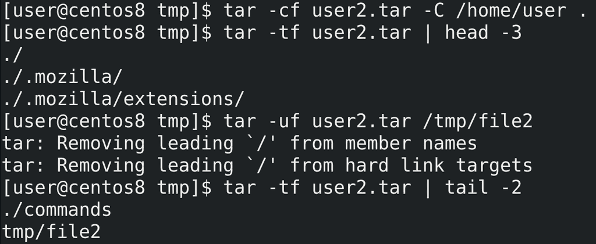

Если при создании архива мы не хотим включать путь к самой директории,  как это было с home/user, то нужно либо зайти в эту директорию и указать текущую директорию, либо использовать тот же ключ -C, который заходит в директорию за нас. А дальше указать точку в качестве текущей директории:

```
tar -cf user2.tar -C /home/user .
tar -xf user2.tar | head -5
```

Если же мы хотим добавить новые файлы в архив используем ключ -u - update:

```
tar -uf user2.tar tmp/file2
tar -tf user2.tar | tail -2
```

Ладно, с архивом разобрались. Для бэкапа мы будем создавать архив, в котором будут все наши файлы. Если что - распакуем и достанем нужный файл. Но каждый наш бэкап будет занимать места столько же, сколько сами данные. А если мы делаем ежедневный бэкап и храним их неделю, то нам понадобится в 7 раз больше места. В нашем случае 300 мегабайт не много и не критично, а в рабочих системах данные могут весить очень много, а значит надо как-то экономить место при бэкапе. Для этого можем воспользоваться сжатием данных.


Существуют разные типы сжатия - с потерей или без потерь, разные алгоритмы и утилиты. Вдаваться в детали мы не будем, но эти картинки иллюстрируют простой механизм сжатия без потерь - у нас есть сколько-то блоков данных, в них повторяющиеся данные - мы можем заменить повторяющиеся данные просто ссылками на один блок. Для сжатия мы будем использовать [gzip](https://habr.com/ru/post/221849/), хотя есть другие алгоритмы и утилиты, но gzip наиболее популярен.

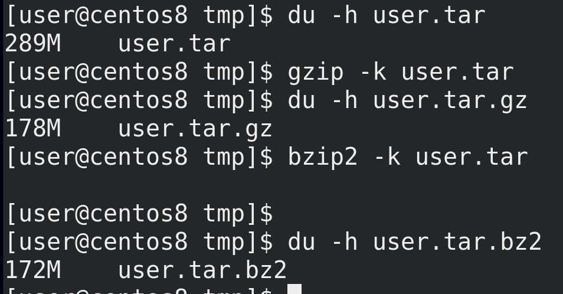

И так, для сжатия с помощью gzip можно указать gzip и нужный файл:

```
du -h user.tar
gzip -k user.tar
du -h user.tar.gz
```

Здесь ключ k нужен, чтобы не удалять оригинальный файл, так как по умолчанию gzip сжимает файл и удаляет оригинал. В обычных условиях нам оригинал файла не нужен после сжатия, но для тестов он ещё пригодится. gzip создаёт файл с расширением .gz и сжимать можно не только архивы, но и сами файлы. Как видите, сжатый архив весит примерно на треть меньше, но при сжатии задействуется процессор и это занимает время. Для примера используем другую утилиту для сжатия - bzip2 - которая использует другой алгоритм сжатия:

```
bzip2 -k user.tar
du -h user.tar.bz2
```

Как видите, с этой утилитой получается сжать файл чуть больше, но при этом процесс требует больше ресурсов и времени.

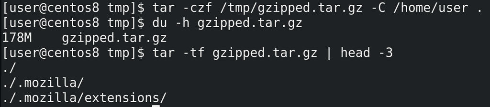

Обычно процесс архивации и сжатия совмещают, для этого с tar используют ключ -z:

```
tar -czf /tmp/gzipped.tar.gz -C /home/user .
du -h gzipped.tar.gz
```

Как видите, архив сразу получился сжатым и нам не пришлось вводить команду для сжатия.

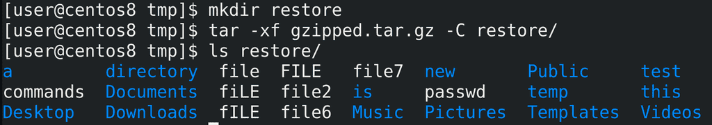

При этом, для распаковки сжатого архива дополнительных ключей не требуется:

```
mkdir restore
tar -xf gzipped.tar.gz -C restore/
ls restore/
```

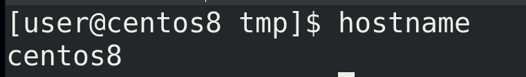

Хорошо, теперь мы знаем как делать бэкап. Но для удобства названия бэкапов должны говорить за себя. Например, они должны содержать имя хоста и время бэкапа. В этом нам поможет bash. Определить имя хоста можно легко - просто команда:

```
hostname
```

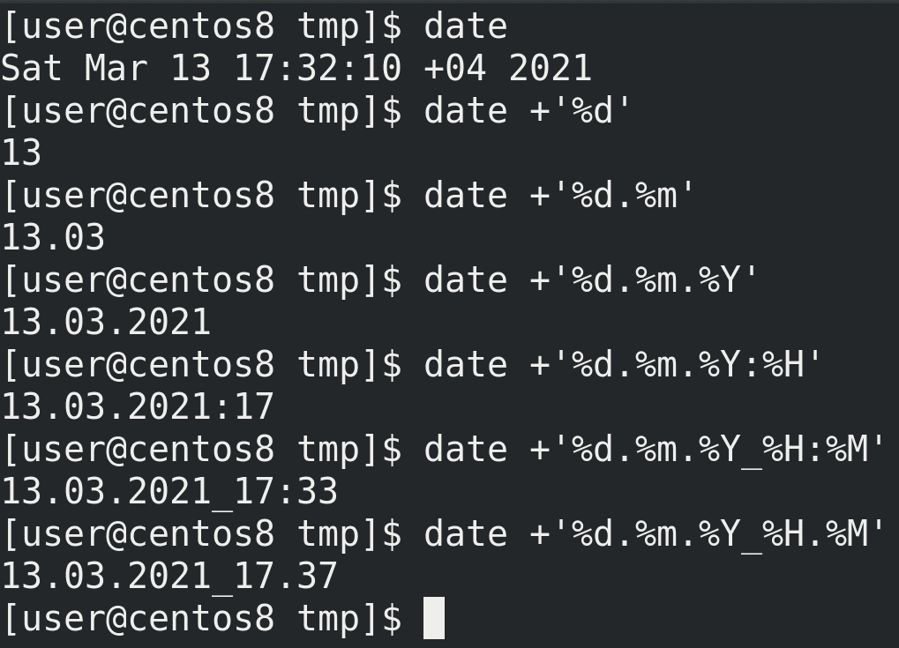

Дальше нам стоит определиться с форматом времени. Для показа времени используем команду date. Но стандартный формат вывода date не подходит для названия файлов. И date очень гибкий в этом плане:

```
date +'%d'
date +'%d.%m'
date +'%d.%m.%Y'
date +'%d.%m.%Y:%H'
date +'%d.%m.%Y_%H:%M'
```

На линуксах с двоеточием в имени файла проблем не будет, но если нам вдруг понадобится перенести файл на Windows, придётся переименовывать файл. Поэтому лучше заменим двоеточие на точку:

```
date +'%d.%m.%Y:%H'
date +'%d.%m.%Y_%H.%M'
```

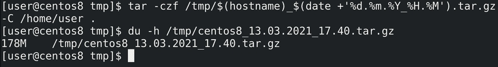

Теперь интегрируем это в команду tar:

```
tar -czf /tmp/$(hostname)_$(date +'%d.%m.%Y_%H.%M').tar.gz -C /home/user .
du -h /tmp/centos8*
```

В итоге у нас получился сжатый архив с нашей домашней директорией с датой и временем создания.

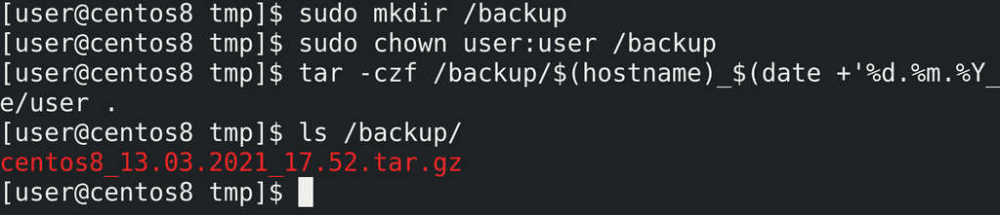

Так как /tmp не подходящая директория для бэкапов, создадим директорию /backup, выдадим права и протестируем:

```
sudo mkdir /backup
sudo chown user:user /backup
tar -czf /tmp/$(hostname)_$(date +'%d.%m.%Y_%H.%M').tar.gz -C /home/user .ls /backup
```

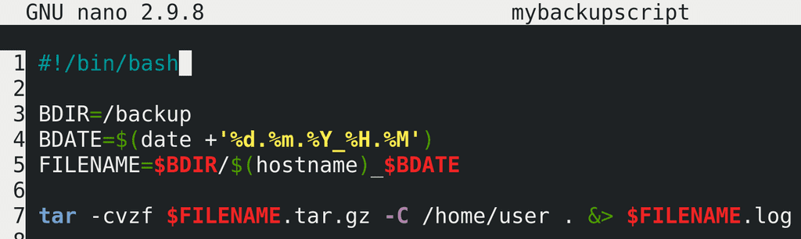

Сделаем из нашей команды скрипт, в команде tar добавим опцию verbose -v - и добавим перенаправление stdout и stderr в файл лога.

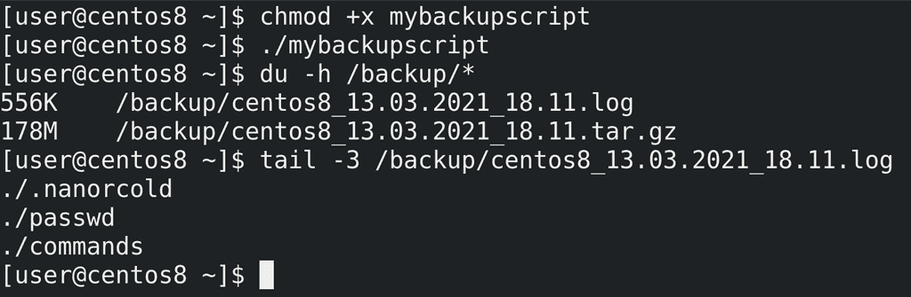

Дадим права и протестируем:

```
chmod +x mybackupscript
./mybackupscript
du -h /backup/*
tail -3 /backup/*.log
```

Скрипт работает.

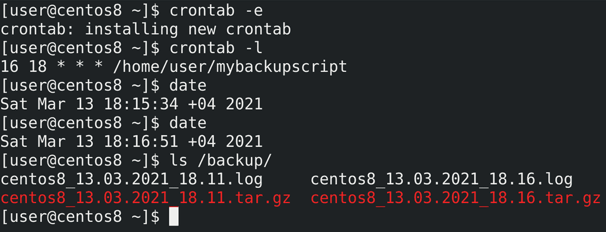

Теперь добавим его в crontab. Я добавлю на ближайшее время для теста:

```
crontab -e
```

``` 16 18 *  * * /home/user/mybackupscript ```

```
crontab -l
date
ls /backup/
```

Как видите, cron сработал, бэкап создался.

Но, как и с логами, бэкапы надо периодически удалять, чтобы не забивать всё свободное пространство. Для начала нужно определиться, сколько мы будем хранить бэкапы. Предположим, 5 дней. Бэкапы старее 5 дней мне не нужны. Теперь нужно научить систему удалять такие бэкапы. Можно написать какой-нибудь скрипт, который будет считать по датам и сравнивать с именами, но это очень сложно и не лучшее решение. Лучше всего для этого использовать find, который может находить файлы, с ключом -mtime - который ищет по времени модификации файла.

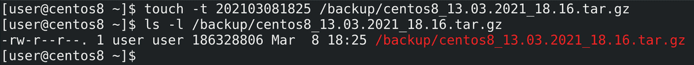

Для начала нам понадобится бэкап старее 5 дней. Но сидеть и ждать 5 дней я не хочу, поэтому воспользуюсь утилитой touch с ключом t, которая может изменить время модификации файла:


```
touch -t 202103081825 /backup/*tar.gz
ls -l /backup/centos8*tar.gz
```

Как видите, время изменилось на 8 марта, это 5 дней назад.

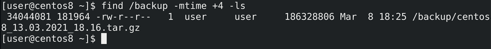

Теперь воспользуемся find чтобы найти файлы старее 5 дней назад в директории /backup:

```
find /backup -mtime +4 -ls
```

Я пишу +4, потому что mtime начинает отсчёт от 0, и mtime +0 - это в предыдущие 24 часа, соответственно +4 - это старше 5 дней.

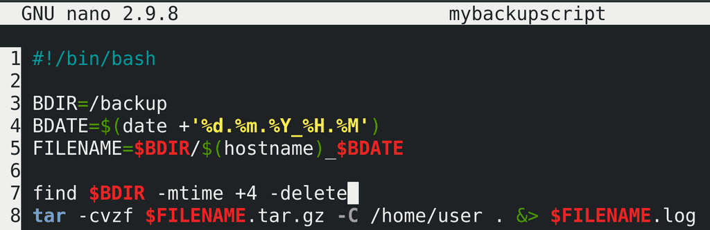

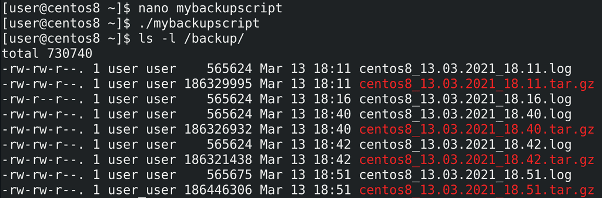

Добавим это в наш скрипт, заменим ls на -delete и протестируем:

```
nano mybackupscript
```

``` find $BDIR -mtime +4 -delete ```

```
./mybackupscript
```

Как видите, бэкап, который был старее 5 дней, удалился.

И так, давайте подведём итоги. Сегодня мы с вами написали простенький скрипт, который бэкапит нашу домашнюю директорию. Однако целью был не сам скрипт, а утилиты, стоящие за его работой. Мы с вами познакомились с утилитами du, которая считает размер файлов, find, которая может находить файлы по разным критериям, tar, которая может архивировать файлы, gzip, которая может сжимать файлы, date, которая позволяет нам именовать наши файлы с нужным форматом времени, touch, которая позволяет поменять время изменения файла, чтобы мы могли провести тесты. Воспользовавшись всеми этими утилитами мы создали простенькое скрипт и добавили его в cron, что даёт нам простой бэкап механизм с автоматическим созданием и удалением старых бэкапов.
