# 41. Создание systemd юнитов

<iframe width='560' height='315' src="https://www.youtube.com/embed/-v3Ai8mjCuA" title='YouTube video player' frameborder='0' allow='accelerometer; autoplay; clipboard-write; encrypted-media; gyroscope; picture-in-picture' allowfullscreen></iframe>

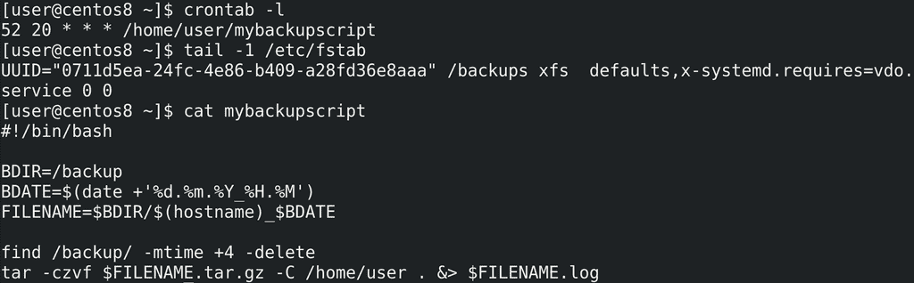

За последние пару тем мы с вами написали бэкап скрипт, автоматизировали его через cron, а также создали раздел для бэкапов с VDO:

```
crontab -l
tail -1 /etc/fstab
```

Этот бэкап стал частью системы - он периодически выполняется, использует какие-то ресурсы, связан с сервисом vdo и всё такое. Почему бы нам не связать его с systemd? Зачем? Есть несколько преимуществ.

Например, управление. Что мне нужно, чтобы перестать делать бэкапы? Редактировать cron, убрать или закомментировать строчку. А в случае с systemd я могу просто отключить unit - одна простая команда. В принципе, и то и другое не сложно, когда один компьютер. А если у вас компьютеров много? Или, скажем, нужно задачу автоматизировать? Всегда легче выполнить команду, нежели редактировать файл.

Другой пример - связанность с другими задачами. Допустим, у вас есть антивирус, который раз в день проверяет систему. И вы хотите делать бэкап только после проверки антивирусом. Обычно cron запускает задачу в указанный срок, независимо от других задач. Вы, конечно, можете в самом скрипте это как-то связать, но это будет костылём. А systemd позволит вам связать различные сервисы, выстроить зависимости.

Ещё один пример - файловая система, которая монтируется в /backup. При текущем конфиге fstab она монтируется при запуске системы. Но, по хорошему, в большую часть времени эта файловая система не нужна, и, если вдруг что-то произойдёт с системой, кто-то там сделает rm -rf или запустит шифровальщик, то все наши бэкапы полетят.  Почему бы не держать эту файловую систему в отмонтированном состоянии и подключать только при необходимости, когда мы делаем бэкап? Да, конечно, это можно сделать и через сам скрипт, и через cron, только это будет костылём - у нас либо скрипт перестанет быть универсальным, либо придётся через cron. В принципе, cron не плохой вариант, но, как я говорил выше, командами всё же предпочтительнее.

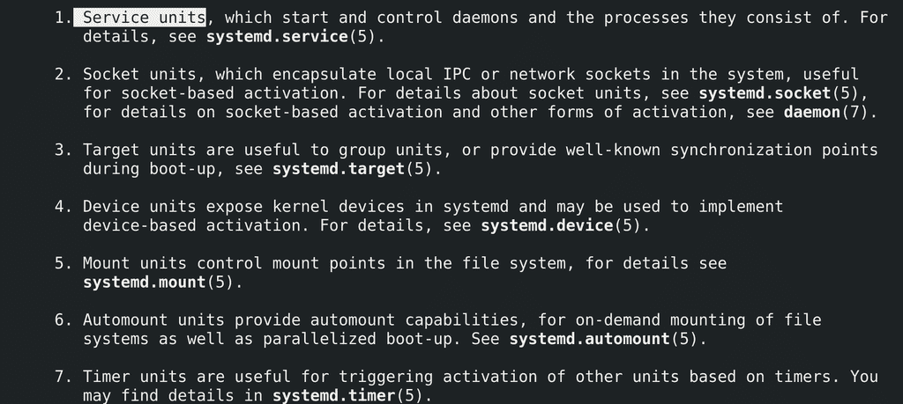

И так, что мы сделаем:

```
man systemd
```

``` / Service units ```

Создадим пару различных юнитов systemd: во-первых - сервис, который будет запускать наш скрипт для бэкапа; во-вторых - таймер, который будет задавать периодичность бэкапа; в-третьих - mount, который будет монтировать файловую систему /backup; в четвёртых - автомаунт, который будет запускать третий пункт при необходимости, а не при запуске компьютера; в-пятых - таргет - чтобы объединить несколько сервисов в одну группу. Остальные типы юнитов обычно трогать не надо, их настройка нужна для более редких задач.

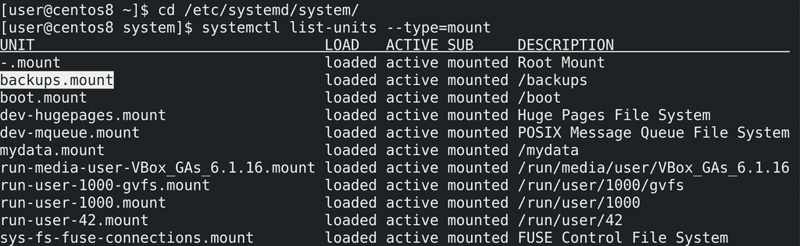

Свои unit-ы желательно создавать в директории /etc/systemd/system:

```
cd /etc/systemd/system
```

Это просто текстовые файлы с определённым расширением и синтаксисом. Для начала создадим mount юнит, так как он нам пригодится в дальнейшем. Обычно имя mount юнита совпадает с путём монтирования и systemd сам генерирует эти юниты на основе fstab-а:

```
systemctl list-units --type mount
```

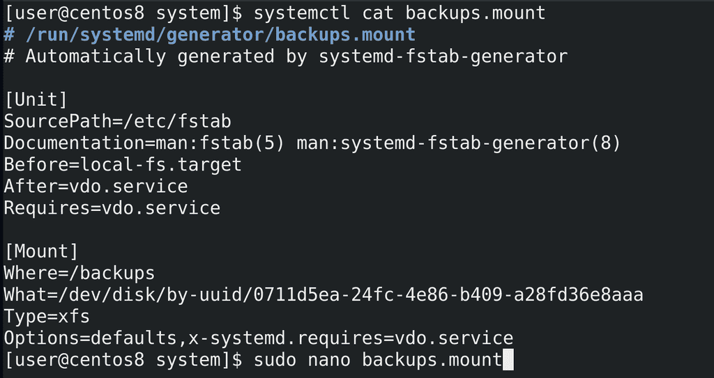

Давайте  просто возьмём готовый юнит и используем его:

```
systemctl cat backups.mount
```

Скопируем всё что здесь есть, создадим файл с таким же названием:

```
sudo nano backups.mount
```

и вставим сюда скопированное. Я собираюсь убрать эту строчку из fstab, чтобы только systemd управлял этой файловой системой, поэтому немного подредактируем файл.

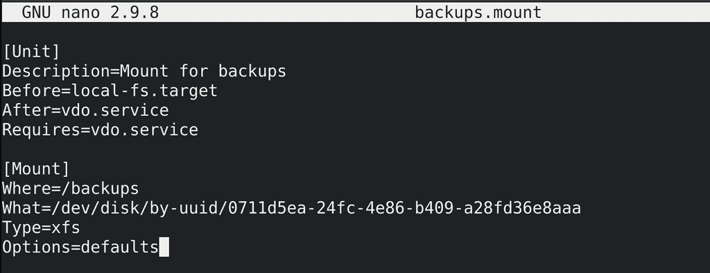

Уберём комментарии в начале. Сперва идёт секция [Unit] - она есть во всех юнитах systemd и в ней указывается описание юнита и зависимости от других сервисов. Убираем лишнее - SourcePath и Documentation - они указывают на то, что этот юнит был сгенерирован systemd, что не актуально для нашей ситуации. Добавим Description=Mount for backups. Ниже указаны зависимости - Before, After и Requires. Before и After говорят о том, что данный mount должен быть запущен до local-fs таргета и после vdo.service, т.е. эти опции определяют порядок запуска юнитов. А Requires говорит о том, что для работы этого юнита необходим также сервис vdo, если тот сервис не запущен или его не получается запустить, то не нужно запускать этот mount.

В секции [Mount] всё предельно понятно: Where - куда монтировать; What - какую файловую систему; Type - тип этой файловой системы; Options - опции монтирования, всё как в fstab. Опция x-systemd.requires больше не нужна, так как она нужна была для генерации вышеуказанных зависимостей от vdo. Это нужно для fstab-а, а мы сразу создаём mount через systemd. На этом сохраняем файл и выходим.

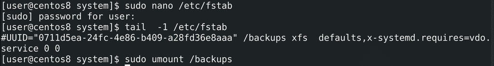

Но, прежде чем пойти дальше, нужно убрать или закомментировать строчку в fstab и отмонтировать файловую систему:

```
sudo nano /etc/fstab
tail -1 /etc/fstab
sudo umount /backups
```

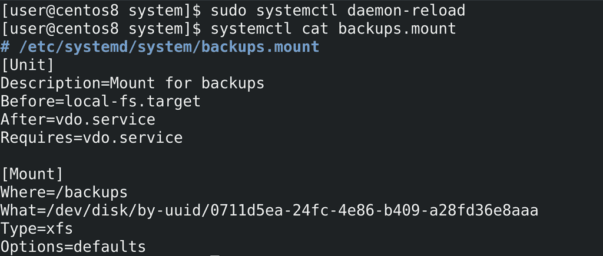

Чтобы systemd перечитал свои файлы и увидел наш mount файл, нужно запустить:

```
sudo systemctl daemon-reload
```

Проверим, увидел ли он наши изменения:

```
systemctl cat backups.mount
```

Да, это наш изменённый файл.

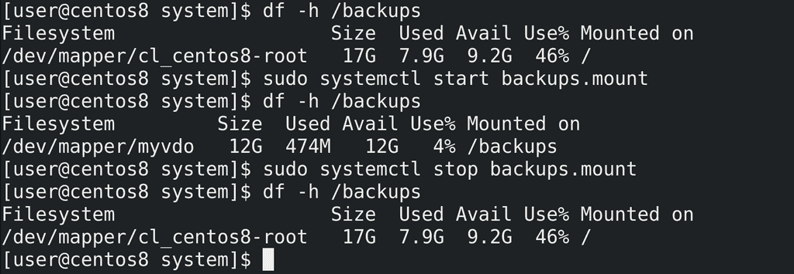

Теперь протестируем наш mount. Посмотрим, примонтировано ли что-то в /backups:

```
df -h /backups
```

Как видите, /backups сейчас принадлежит корневой файловой системе. Запустим наш юнит:

```
sudo systemctl start backups.mount
df -h /backups
```

Теперь файловая система с vdo примонтировалась куда нужно. Остановим юнит:

```
sudo systemctl stop backups.mount
df -h /backups
```

Теперь ничего не примонтировано. Т.е. сейчас за монтирование отвечает только systemd - в зависимости от того, запущен юнит или нет, у нас будет монтироваться файловая система.

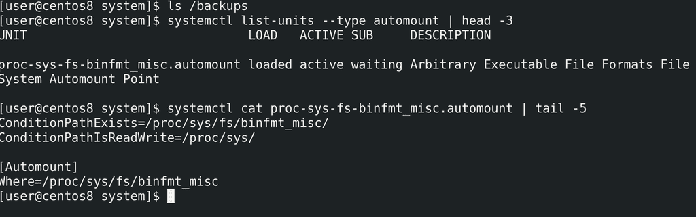

Для примера, рассмотрим ещё юнит automount. В нашей ситуации он не нужен, но в целом полезно знать. Сейчас наша файловая система отмонтирована, а значит /backups пустой:

```
ls /backups
```

automount позволяет монтироваровать файловую систему при запросе к ней:

```
systemctl list-units --type automount | head -3
systemctl cat proc-sys-fs* | tail -5
```

Т.е. пока нам не нужно, файловая система не примонтирована. Но стоит нам посмотреть или зайти в эту директорию - systemd сам примонтирует то что нужно. Выйдем, не будем пользоваться - отмонтирует. Это обычно нужно для сетевых файловых систем, для зашифрованных дисков и т.п. - чтобы сократить время запуска операционной системы, и даёт кое-какие определённые плюсы, которые нам сейчас не интересны.

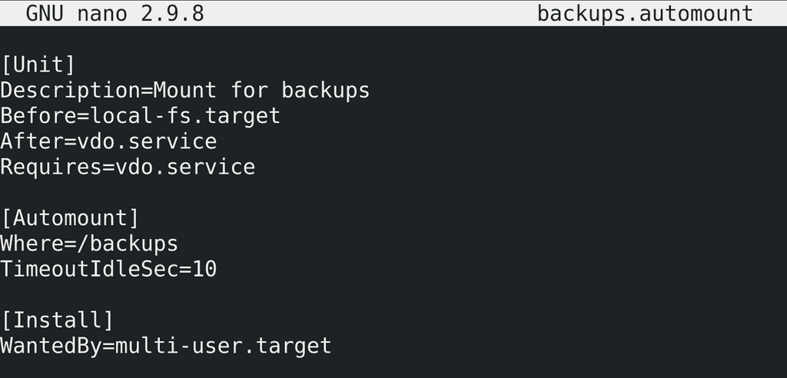

automount юнит должен называться как и сам mount, но после точки - automount:

```
sudo nano backups.automount
```

Так как и при автомонтировании нам нужен сервис vdo, секция [Unit] со всеми зависимостями должна совпадать, поэтому просто скопируем с основного mount:

```
systemctl cat backups.mount
```

Основная секция: `[Automount]`. Здесь мы указываем `Where=/backups`, т.е. куда мы заходим, чтобы у нас автомонтировалась файловая система. Также здесь время для размонтирования - `TimeoutIdleSec=10`. Т.е. если на протяжении 10 секунд не обращаться к примонтированной файловой системе, она автоматом отмонтируется. Я указал небольшое время для теста, в реальных условиях обычно больше. В отличии от предыдущего юнита,  который мы хотим запускать при необходимости, этот юнит должен работать всегда -  если этот юнит не будет работать, автомонтирования не будет. Поэтому нам нужно, чтобы юнит запускался при включении компьютера. Для этого нужна секция `[Install]`. Здесь обычно указывают, каким сервисом или таргетом требуется данный юнит, и, как правило, речь про multi-user.target - `WantedBy=multi-user.target`. Сохраним и выйдем.

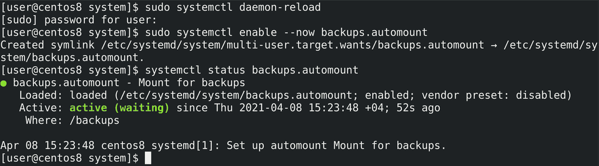

Применим наш конфиг:

```
sudo systemctl daemon-reload
```

Затем включить и запустим сервис:

```
sudo systemctl enable --now backups.automount
```

Здесь ключ --now нужен, чтобы разом добавить в автозапуск и включить юнит. Также проверим статус:

```
systemctl status backups.automount
```

Всё работает.

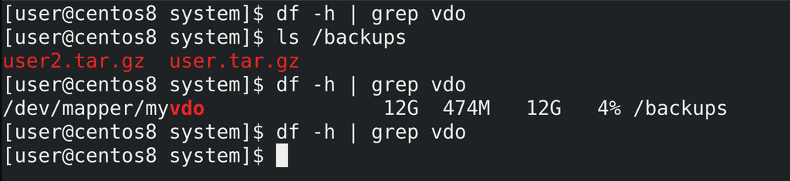

Теперь потестим. Для начала убедимся, что ничего не примонтировано:

```
df -h | grep vdo
```

Вроде не примонтировано. А попробуем посмотреть содержимое:

```
ls /backups
```

Файлы на месте. Сразу же проверим список примонтированных файловых систем:

```
df -h | grep vdo
```

Как видите, файловая система примонтировалась. Подождём немного и перепроверим:

```
df -h | grep vdo
```

опять пусто.

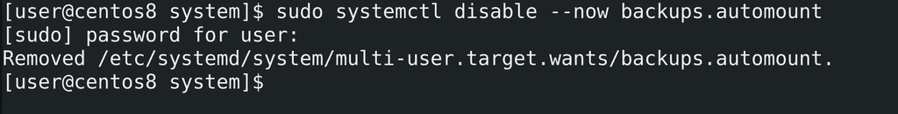

Но, как я говорил,  нам automount не нужен, поэтому его убираем:

```
sudo systemctl disable --now backups.automount
```

Теперь сделаем  сам сервис:

```
sudo nano mybackups.service
```

В секции `[Unit]` укажем описание - `Description=Creating /home/user backup`. Укажем, что для работы сервиса нужен юнит backups.mount и что этот сервис запускается только после него - `Requires=backups.mount`, `After=backups.mount`. Дальше добавляем секцию `[Service]` - здесь мы указываем что и как запускать, какие-то дополнительные команды до и после, от какого пользователя, что делать, если сервис упал и кучу других настроек. Для начала нужно указать тип - `Type=oneshot` - этот тип используется для скриптов.

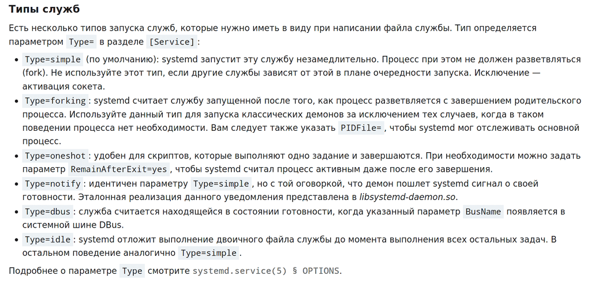

В чём суть типа - обычно за сервисом стоят демоны - программы, которые постоянно работают на фоне. И systemd отслеживает состояние процесса, который запустила, по pid-у. И если с этой программой что-то не так, если вдруг процесс остановился, systemd может попробовать перезапустить программу. В случае скриптов всё проще - скрипт запустился, сделал свой дело и завершился. Нужно ведь предупредить systemd, что если запущенная программа завершилась, это не говорит ни о чём плохом - просто скрипт выполнил свою задачу. В общем, программы работают по разному и systemd должен знать, как себя вести в тех или иных случаях.

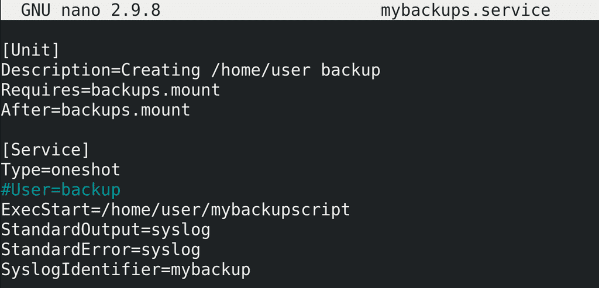

По хорошему, стоит избегать использования root-а и backup должен запускаться от специального пользователя. Я не настраивал права и это не совсем входит в данную тему, но для примера я оставлю в закомментированном виде запись `User=backup`, т.е. от чьего имени будет запускаться сервис. Основная строчка - `ExecStart=/home/user/mybackupscript` - собственно, то что нужно запускать. Можем воспользоваться плюсами systemd - посылать стандартный вывод и ошибки в syslog, чтобы потом смотреть и сортировать через journalctl - `StandardOutput=syslog`, `StandardError=syslog`, `SyslogIdentifier=mybackup`. Зачастую в сервисе добавляют секцию `Install`, чтобы он автоматом запускался при включении компьютера, но это не актуально для нас - нам не нужно при каждом включении делать бэкап, скрипт будет запускаться таймером. Поэтому с сервисом достаточно, сохраняем и закрываем. Тут ещё может быть миллион разных настроек в зависимости от типа сервиса, но у systemd неплохая документация, если вам нужно что-то конкретное - всегда сможете найти или спросить.

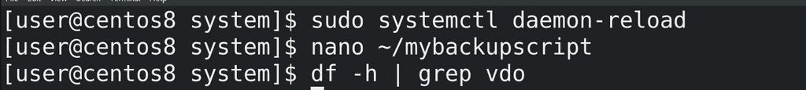

Опять же, перезапускаем демон:

```
sudo systemctl daemon-reload
```

Прежде чем потестить, я немного подправлю скрипт:

```
nano ~/mybackupscript
```

Раньше он сам отвечал за перенаправление вывода в лог файл (&> $BDIR/$FILENAME.log), теперь этим занимается systemd. Также подправим директорию бэкапа - /backups. Прежде чем потестить, проверим, примонтирована ли файловая система:

```
df -h | grep vdo
```

нет, отлично.

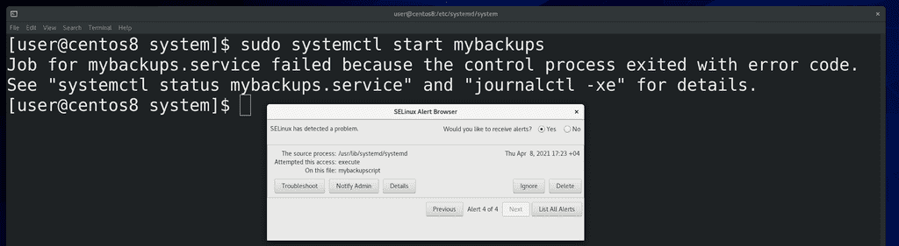

Попробуем запустить сервис:

```
sudo systemctl start mybackups
```

и видим ошибку. SElinux не разрешает нашему сервису запустить скрипт. О SElinux мы ещё поговорим, но вкратце - это система безопасности.

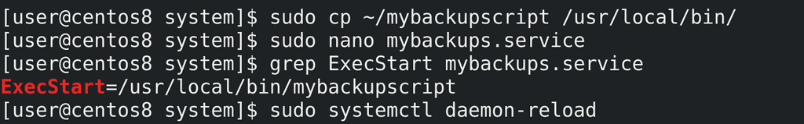

Я подозреваю, в чём дело - ей не нравится, что сервис пытается что-то запустить из домашней директории. Это легко исправить - просто переместим наш скрипт в /usr/local/bin и подправим строчку ExecStart в сервисе:

```
sudo cp ~/mybackupscript /usr/local/bin
sudo nano mybackups.service
grep ExecStart mybackups.service
```

и перечитаем конфиг:

```
sudo systemctl daemon-reload
```

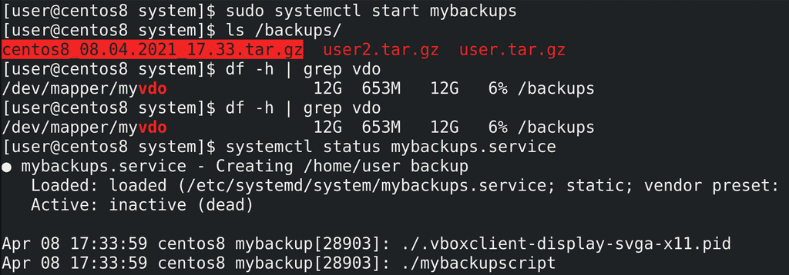

Попытка номер 2:

```
sudo systemctl start mybackups
```

Подождали немного - и всё сработало:

```
ls /backups
```

При запуске сервиса у нас выполняется бэкап. И даже файловая система примонтировалась:

```
df -h | grep vdo
```

потому что сервис бэкапа требовал backups.mount. И если посмотреть статус сервиса:

```
sudo systemctl status mybackups
```

внизу видны логи.

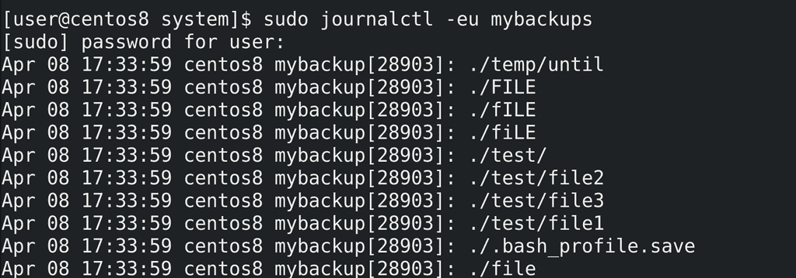

Их также можно посмотреть через journald:

```
sudo journalctl -eu mybackups
```

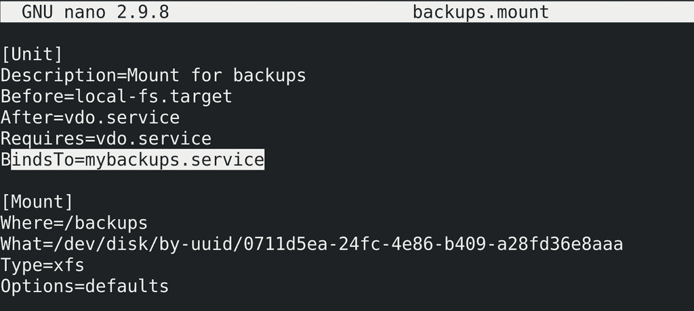

Но так как мы убрали automount, файловая система всё ещё висит, даже если бэкап завершился:

```
df -h | grep vdo
```

Попробуем это подправить. Для этого свяжем юнит mount с сервисом:

```
sudo nano backups.mount
```

и в секцию `[Unit]` добавим `BindsTo=mybackups.service`. Благодаря этой опции mount будет следить за сервисом - если тот перестанет работать, то и mount завершится. Ладно, сохраним и выйдем.

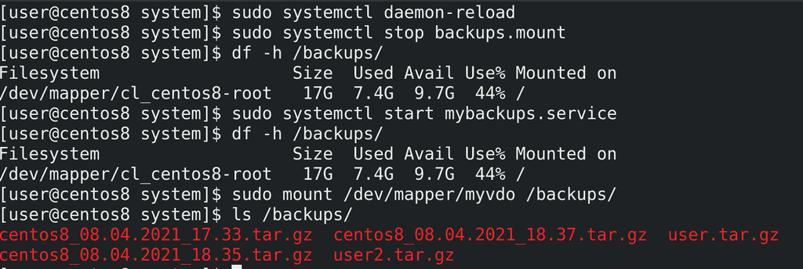

Давайте тестировать. Для начала, перечитаем конфиг:

```
sudo systemctl daemon-reload
```

Затем остановим backups.mount:

```
sudo systemctl stop backups.mount
```

и убедимся в этом:

```
df -h /backups
```

Как видите, примонтирована корневая файловая система, а не vdo. Теперь стартанём сервис бэкапа:

```
sudo systemctl start mybackups
```

После чего сразу проверим:

```
df -h /backups
```

Как видите, vdo не примонтирован. Но если примонтировать вручную:

```
sudo mount /dev/mapper/myvdo /backups
ls /backups
```

то последние бэкапы там есть.


Правда есть довольно весомый минус - `BindsTo` делает такую привязку, что даже при простом монтировании этой файловой системы в эту директорию, как указано в юните, запускается сервис mybackups. Для примера, проверим, примонтирована ли файловая система:

```
df -h | grep vdo
```

пусто. Теперь примонтируем вручную:

```
sudo mount /dev/mapper/myvdo /backups
```

Посмотрим содержимое:

```
ls /backups
```

и сразу тут появился файл с новым бэкапом. Т.е. монтирование привело к запуску mount юнита, а он запустил сервис бэкапа. Через какое-то время бэкап закончится, сервис остановится, что приведёт к остановке mount-а и файловая система отмонтируется. С одной стороны это легко обойти - при необходимости можно просто монтировать в другую директорию, чтобы лишний раз не делать бэкап. С другой - будь у нас демон, а не скрипт, такой проблемы не было бы, так как есть другая опция - `PartOf`, вместо `BindsTo`, которая не вызывала бы лишний раз сервис бэкапа. Но эта опция отрабатывает только если сервис стопится с помощью systemd, а не скрипт завершается.  Также есть другая опция - `StopWhenUnneeded` - останавливает юнит, если сейчас никакой другой юнит не требует работы этого. Но почему-то у меня это не сработало.

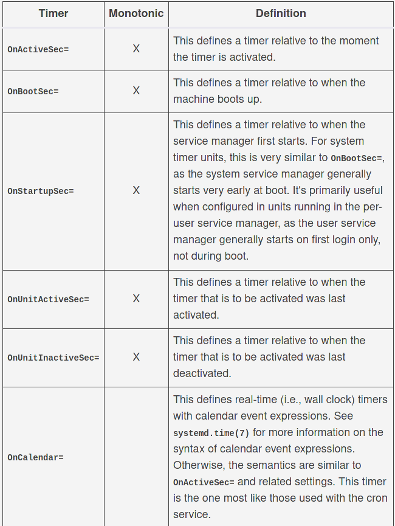

Теперь перейдём к таймеру. Имя таймера должно соответствовать имени сервиса, но в конце - `.timer`:

```
sudo nano mybackups.timer
```

Опять же, начинаем с секции `[Unit]`, где добавляем описание - `Description=Timer for my backup service`. Потом добавляем секцию `[Timer]`, где и будем указывать периодичность бэкапа. Время можно задавать по разному - связать его с определёнными часами и минутами, например, в 11 вечера каждое воскресенье, либо со временем запуска компьютера, например, через 15 минут после включения, либо промежуток времени от последнего запуска таймера. Много различных вариантов, поэтому мы сделаем так  - делать бэкапы каждый день в 11 вечера, а если вдруг компьютер был выключен и пропустил один бэкап - то сделать его после включения.

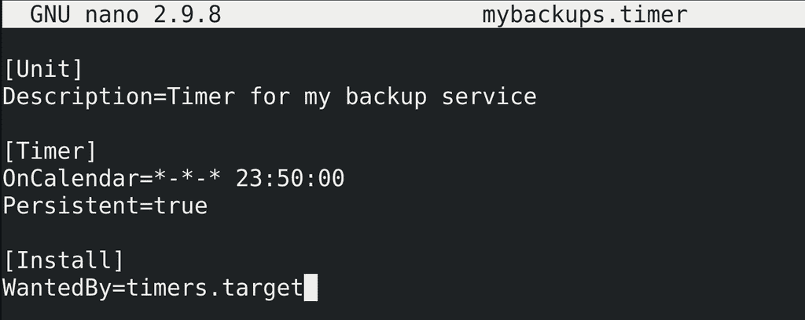

Для этого мне понадобится опция `OnCalendar` со значением

``` *-*-* 23:50:00 ```

Здесь первые три звёздочки - это год, месяц и день. Хотя можно указывать по разному. Также добавлю опцию `Persistent=true`. Это как раз для того, чтобы в случае пропускания таймера, если компьютер был выключен, после включения автоматом сработал наш бэкап сервис. Ну и для таймеров существует отдельный таргет, который можно указать в секции `[Install]`, чтобы добавить таймер в автозапуск.

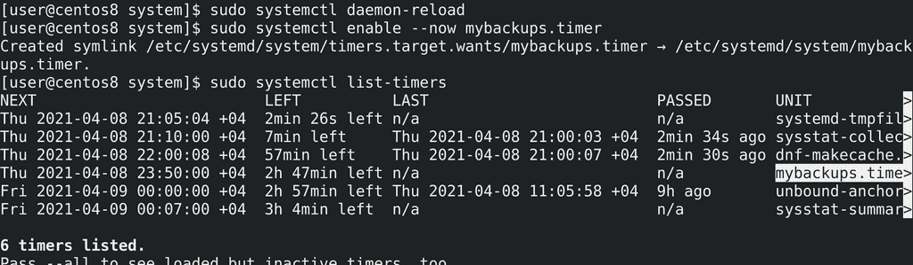

Опять же, после сохранения файла перечитываем конфиги:

```
sudo systemctl daemon-reload
```

Потом включаем таймер:

```
sudo systemctl enable --now mybackups.timer
```

Ну и смотрим список активных таймеров и время их срабатывания:

```
sudo systemctl list-timers
```

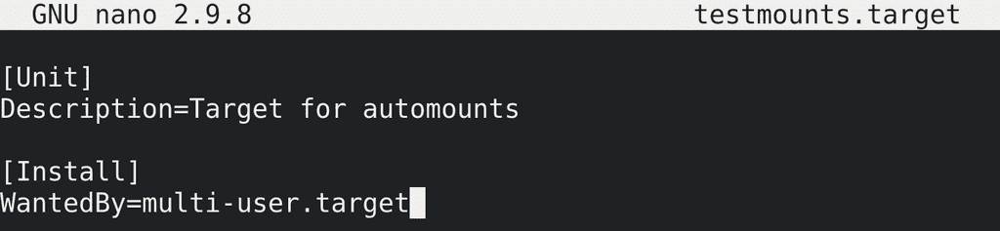

Напоследок, рассмотрим таргеты. В основном таргеты мы создаём, чтобы объединять юниты в группы и через эту группу управлять ими, указывать целую группу в зависимостях и т.п.. Это не совсем подходит под нашу задачу, но для примера используем что-нибудь другое. У нас остался неиспользованный automount, возьмём его для теста. Создадим таргет:

```
sudo nano testmounts.target
```

Создаём секцию [Unit] и добавляем `Description=Target for automounts`. И создаём секцию `[Install]`, где укажем, чтобы наш таргет грузился при включении компьютера - `WantedBy=multi-user.target`. Сохраняем и выходим.

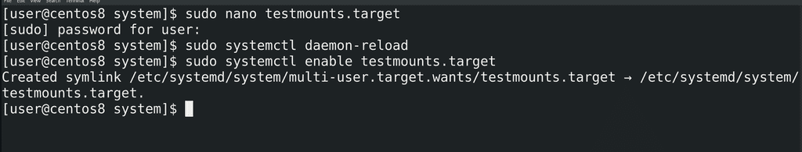

Перечитываем конфиг:

```
sudo systemctl daemon-reload
```

Включаем наш таргет, чтобы он грузился при запуске системы:

```
sudo systemctl enable testmounts.target
```


Дальше надо в юнитах, которые мы хотим объединить, указать этот таргет в секции `[Install]`, вместо multi-user таргета - `WantedBy=testmounts`.target. Сохраняем и выходим.

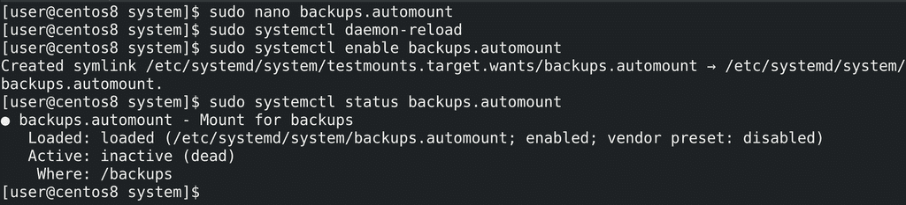

Снова перечитываем конфиг:

```
sudo systemctl daemon-reload
```

И включаем automount:

```
sudo systemctl enable backups.automount
```

Обратите внимание, где создалась символическая ссылка - у таргета появилась своя директория, как это было у multi-user-а. Теперь у нас есть таргет, внутри которого один юнит. Ну и перед тестом проверим статус automount-а - он выключен.

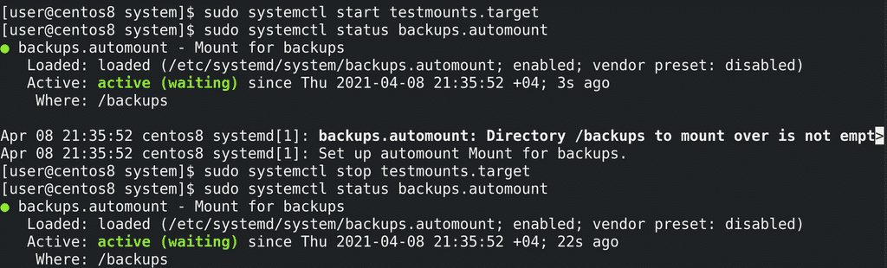

Попробуем стартануть таргет:

```
sudo systemctl start testmounts.target
```

и перепроверим статус automount-а - он запустился. Но при остановке таргета:

```
sudo systemctl stop testmounts.target
```

сервис сам не останавливается: 

```
systemctl status backups.automount
```

С одной стороны это хорошо - это немного безопаснее, чтобы случайно не вырубить важный сервис.

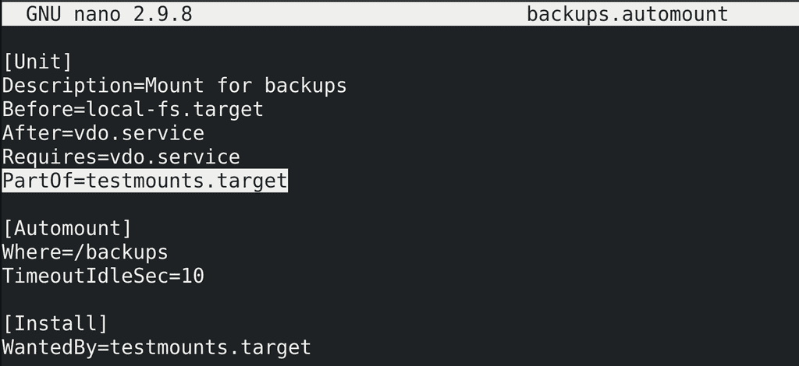

Однако, если мы всё же хотим, чтобы юнит перезагружался вместе с таргетом, можно в секцию `[Unit]` добавить опцию `PartOf`:

```
sudo nano backups.automount
```

``` PartOf=testmounts.target ```

Сохраняем и выходим.

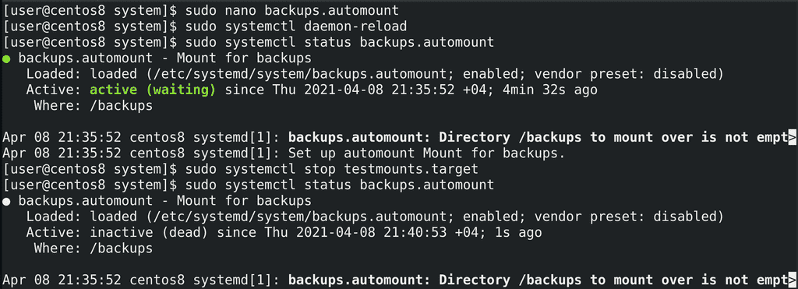

А дальше как обычно - перечитываем конфиг:

```
sudo systemctl daemon-reload
```

Посмотрим статус юнита:

```
sudo systemctl status backups.automount
```

работает. Попробуем стопнуть таргет:

```
sudo systemctl stop testmounts.target
```

а потом заново посмотреть статус сервиса:

```
sudo systemctl status backups.automount
```

сервис стопнулся. Т.е. всё правильно.

Подведём итоги. Мы с вами научились делать юниты для systemd - mount, automount, service, timer и target. Это довольно простая задача. И хотя эта тема невероятно огромная, в большинстве случаев хватает небольших юнит файлов. В системе и интернете есть  документация и большое количество примеров. Хотя mount-ы и timer-ы могут встречаются реже и вместо них всегда можно использовать cron и fstab, с сервисами всё несколько иначе. Нередко администраторам попадаются программы, которые нужно запускать при включении сервера, но, либо производитель не дал готовые файлы для systemd, либо эту программу написали ваши программисты, которые могут не разбираться в systemd, ну или вы сами хотите изменить процесс, построить его иначе. И, вместо того, чтобы при каждом включении вручную всё запускать, вы всегда можете сделать из скриптов и программ сервисы, которые автоматизируют и облегчат вам работу.
