# 43. Работа с сетью

<iframe width='560' height='315' src="https://www.youtube.com/embed/j4tHaS7NJC4" title='YouTube video player' frameborder='0' allow='accelerometer; autoplay; clipboard-write; encrypted-media; gyroscope; picture-in-picture' allowfullscreen></iframe>

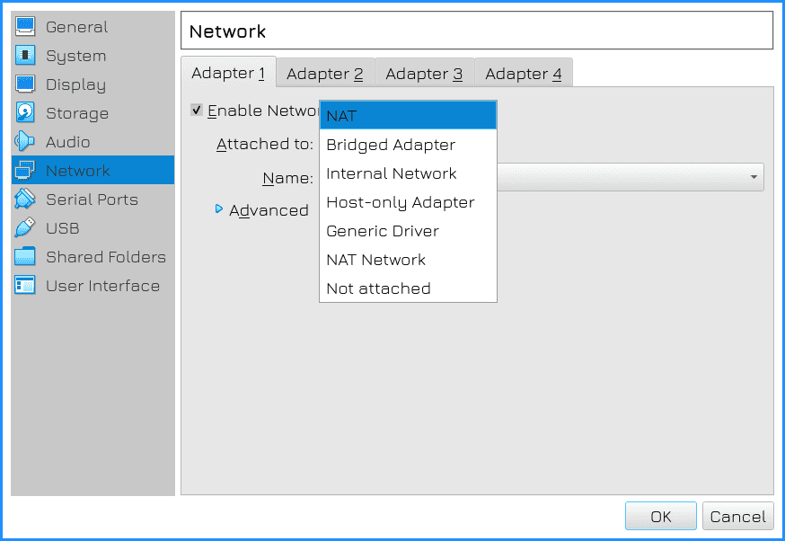

С теорией сетей немного разобрались, попробуем реализовать.  Мы с вами работаем с виртуалкой, а за её сеть отвечает гипервизор. Зайдите в настройки виртуалки - Сеть. Наверху есть 4 вкладки - виртуалке можно выделить 4 сетевых адаптера. Нам пока хватает одного, но в дальнейшем это пригодится. В выпадающем меню "Тип подключения" указано, в какую сеть будет смотреть виртуалка. Допустим, NAT означает, что гипервизор будет выступать в роли роутера с включённым NAT-ом для виртуальной машины, точно как ваш домашний роутер для вашего компьютера. Как и домашний роутер, гипервизор выдаст IP адрес с помощью  DHCP виртуальной машине. Из самой виртуалки будет доступ в вашу домашнюю сеть и интернет, а из вашей сети, скажем, с телефона, не будет прямого доступа к виртуалке.

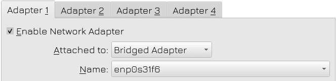

Второй тип сети - это сетевой мост - bridged adapter. В таком случае гипервизор будет выступать как свитч, благодаря чему виртуалка окажется в вашей домашней сети. Она получит IP адрес от вашего роутера, так как он выступает DHCP сервером и будет доступна для любого устройства в вашей домашней сети. Дальше нужно указать имя адаптера вашего компьютера, который подключён к сети. Это может быть ethernet или wifi адаптер.

Другие типы подключения нам пока не интересны, но в целом они позволяют создать изолированную сеть между виртуалками, либо сеть, которая только между хостом и виртуальной машиной и т.п., под различные сценарии.

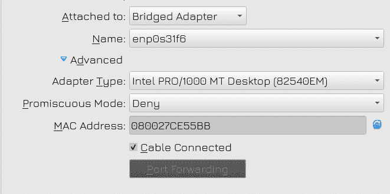

Идём в дополнительные настройки. Тут можно выбрать тип адаптера. Виртуалбокс эмулирует сетевой адаптер и здесь можно выбрать какой именно. Какие-то старые операционные системы могут не работать с определёнными типами, какие-то быстрее, какие-то функциональнее. Чуть больше о различиях можете почитать по [ссылке](https://www.nakivo.com/blog/virtualbox-network-setting-guide/). В большинстве случаев с современными системами лучше использовать Intel PRO/1000 MT, а если у вас виртуалка с линуксом, можете использовать virtio-net - он не эмулирует виртуальную сетевую карту, а использует другой механизм, который чуть производительнее. Но для гостевых Windows-ов нужно будет устанавливать дополнительные драйвера.

Неразборчивый режим позволяет направлять весь приходящий трафик на эту сетевую карту. По умолчанию, когда стоит Deny, виртуалка будет видеть только трафик, предназначенный ей, так как сам виртуалбокс направляет трафик по мак адресам. Но в определённых случаях, для решения проблем или детального разбора трафика, здесь можно настроить другое значение.

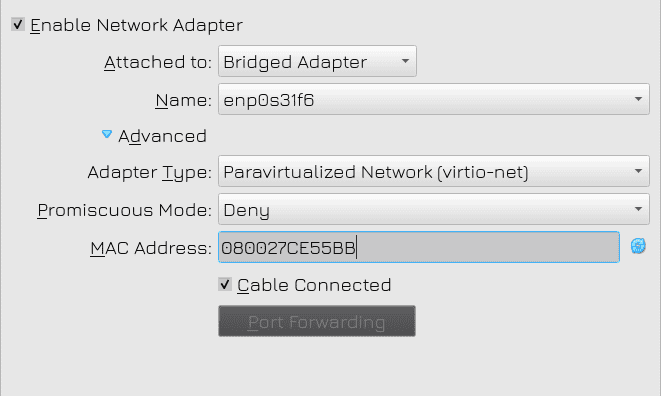

Ну и снизу у нас MAC адрес. Я говорил, что мак адрес состоит из 12 символов, разделённых двоеточиями по два, но в некоторых программах можно увидеть и такое написание, это нормально. При необходимости это значение можно поменять, так как это виртуальный сетевой адаптер, то есть мак адреса здесь генерируются самим гипервизором.

Я сохраняю эти настройки и запускаю виртуалку.

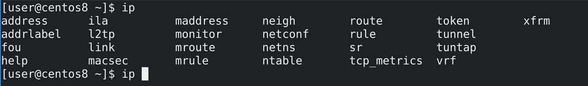

Одна из главных команд по работе с сетью - ip. У неё множество различных ключей и опций, но чаще всего используются ip address и ip route. Эта команда позволяет не дописывать ключи до конца, по примеру того, как сделано на сетевом оборудовании. Например, команду ip address show можно написать как ip addr и даже ip a.

Эта команда позволяет увидеть список IP адресов, мак адресов, интерфейсов и их параметры. А что такое интерфейсы? Физические порты на сетевых адаптерах правильнее называть физическими интерфейсами. А даваемые настройки в операционной системе применяются на программную составляющую этого интерфейса, называемую логическим интерфейсом. И в обычной речи, когда говорят порт, имеют ввиду физический интерфейс, а когда говорят интерфейс - имеют ввиду логический интерфейс. С точки зрения операционной системы мы работаем с интерфейсами, а не с портами. Т.е. вставляешь кабель в порт, а даёшь IP адрес на интерфейс.

Итак, команда ip а вывела нам 4 интерфейса - lo, enp0s3, virbr0 и virbr0-nic. Последние два нас не интересуют, это тот же самый сетевой мост. Обычно сетевой мост создаётся на хосте, но тут видимо при установке какого-то пакета он создался автоматом. И, в общем, просто проигнорируем эти интерфейсы.

Начнём с  lo - loopback. Это специальный интерфейс, который есть в каждой системе. Некоторые программы, особенно работающие с сетью, иногда требуют подключения к этому же компьютеру. Скажем, у вас две программы, работающие через сеть, должны общаться друг с другом, например, вебсервер и система управления базой данных. Вы можете поднять два компьютера, а можете всё держать на одном. И чтобы эти программы общались, в них вы прописываете адрес 127.0.0.1. Это адрес, который есть на всех компьютерах, он указывает компьютеру сам на себя. Многие внутренние компоненты системы могут использовать этот адрес, поэтому он необходим.  

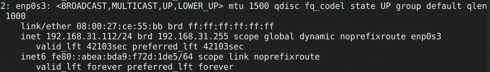

Нас больше интересует enp0s3. Это и есть интерфейс адаптера, который мы настроили на virtualbox. Самый достоверный способ понять - посмотреть на мак адрес, который отображается после link/ether. Достаточно сравнить последние 4 символа - 55bb - тоже самое у нас было в настройках виртуалбокса. Собственно в строке inet видим IP адрес - 192.168.31.112 - это адрес из моей домашней сети. Рядом с ним маска /24 - т.е. в моём случае адрес сети - 192.168.31.0, броадкаст - 192.168.31.255, а диапазон адресов - от 1 до 254. Чуть ниже строка inet6 - это IP адрес по IPv6. Это и многие другие параметры я опущу, чтобы не усложнять.

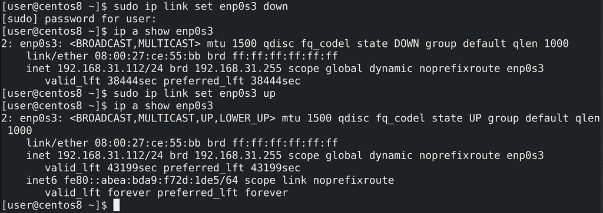

Выше - state up - говорит о том, что интерфейс поднят, т.е. работает. Это означает, что интерфейс поднят как со стороны операционной системы, так и со стороны железа, т.е. вставлен кабель и есть подключение с другой стороны - со свитча, роутера, другого компьютера или гипервизора. Иногда, при проведении каких-то технических работ или по каким-то другим причинам, вам нужно выключить интерфейс, чтобы не было сети. Но при этом физически выдёргивать кабель или менять настройки гипервизора может быть не очень удобно. Поэтому интерфейс можно выключить в самой операционной системе. Для этого есть команда - sudo ip link set enp0s3 down; ip address show enp0s3. Как видите, state теперь показывает Down. Это называется административным выключением интерфейса. Для включения интерфейса - sudo ip link set enp0s3 up;  ip address show enp0s3.

Но то что интерфейс в UP-е ещё не говорит о том, что с сетью всё нормально. В сети может быть огромное количество проблем, которые могут влиять на работоспособность. Одна из самых базовых утилит диагностики - ping. Она посылает пакет другому компьютеру и ждёт от него ответа. Другой компьютер, при виде такого пакета, отправляет ответ. И этот цикл повторяется бесконечно, пока мы не прекратим. Что-то наподобие пинг-понга, компьютеры сообщают друг-другу, что между ними есть связь.

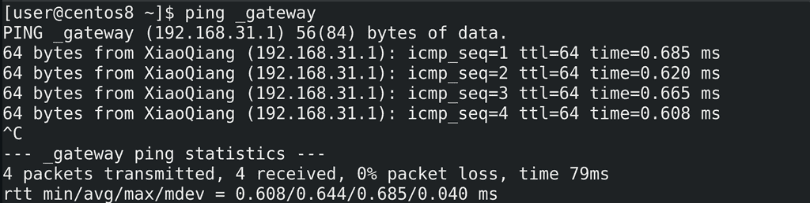

Попробуем кого-нибудь пингануть. Я не буду пинговать хост, так как, если у вас Windows, на нём фаервол блокирует пинги. Т.е. если вы будете пинговать Windows с вашей виртуалки, ответа вы не получите. Поэтому возьмём что-то универсальное, например, ваш роутер. Чтобы пинговать кого-то, нужно знать его IP адрес. Так как виртуалка получила IP адрес по DHCP, оттуда же она получила информацию о gateway - шлюзе, откуда можно выходить в другие сети. В этот момент systemd создаёт специальную запись для шлюза, чтобы, независимо от IP адреса, был универсальный способ обратиться к шлюзу - _gateway. Попробуем пингануть - ping _gateway. Система преобразовала _gateway в IP адрес - 192.168.31.1 и теперь пингует мой роутер.

В ответах есть диагностическая информация - размер отправляемого пакета, номер по очереди, ttl и time - время, за которое пакет был доставлен до другого компьютера и получен ответ. Что такое ttl? Когда мы кого-то пингуем, мы назначаем специальное число - ttl, в данном случае по умолчанию 64. Каждый раз, когда наш пакет будет проходить через роутер, тот будет отнимать единичку от этого числа. Если до какого-то роутера дойдёт число 0, то он выбросит этот пакет, так как что-то явно пошло не так и пакет слишком долго блуждает по сети.

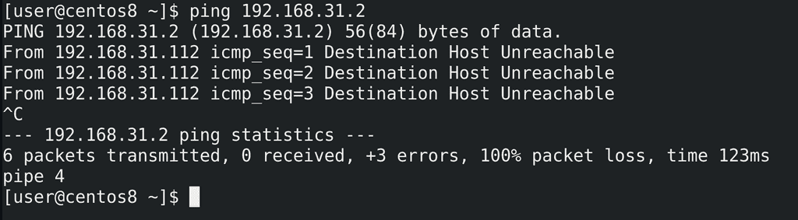

Итак, gateway у нас пинговался, теперь возьмём какой-нибудь несуществующий адрес, например, 192.168.31.2 - ping 192.168.31.2. За этим адресом никакого компьютера нет. В таком случае ping не может достучаться до нужного ip адреса, вследствие чего выдаёт "Destination host unreachable", т.е. целевой хост недоступен.

То, что у меня пингуется gateway говорит о том, что локальная сеть у меня доступна, я могу достучаться до другого компьютера в этой же сети. Но что насчёт других сетей? Например, как проверить, доступен ли интернет? Есть пара адресов, которые знают все администраторы - 1.1.1.1 и 8.8.8.8. Это адреса DNS серверов Cloudflare и Google. Если пинги доходят до этих адресов - значит у вас есть интернет. В каких-то компаниях может стоять сетевой фаервол, который блокирует исходящие пинги, но я такие ситуации не учитываю. Итак, интернет у нас есть.

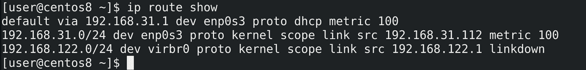

Но как вообще система понимает, до какого компьютера как добраться? Есть такая вещь, как таблица маршрутизации - ip route show. Здесь указано, что для любого компьютера в сети 192.168.31.0 используй интерфейс enp0s3, для сети 192.168.122.0 - интерфейс virbr0. А вот если что-то другое, что-то с непонятной сетью, допустим, 8.8.8.8 - обращайся к 192.168.31.1. Это дефолтный маршрут, который и называют gateway. У этого роутера есть своя таблица маршрутизации, где также написана локальная сеть, а если что-то неизвестное - обращайся к роутеру провайдера. У провайдера, конечно, больше маршрутов, он связан с другими провайдерами и всё такое, но логика та же - если знаешь сеть, иди туда, если нет - отправляй на gateway. Таким образом ваш пакет в итоге доходит до того же гугла.

 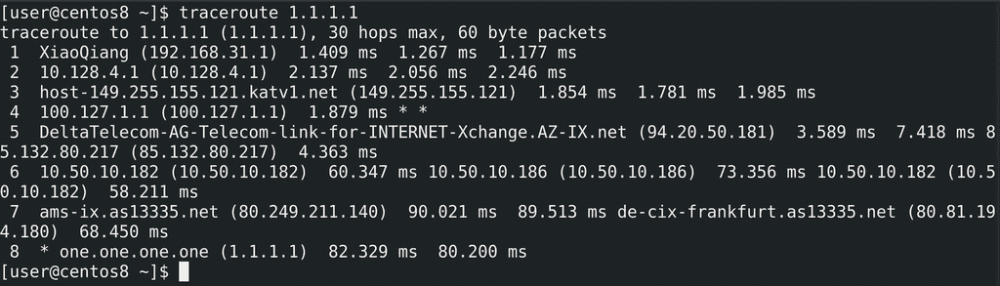

Система также позволяет узнать, через какие роутеры проходит пакет. Хотя провайдеры могут скрывать некоторые свои роутеры, но общую картину можно понять с помощью утилиты traceroute - traceroute 1.1.1.1. Как видите, сначала мой пакет добирается до моего роутера, потом до роутера провайдера и так ещё пару маршрутизаторов, пока не доберётся до самого IP адреса.

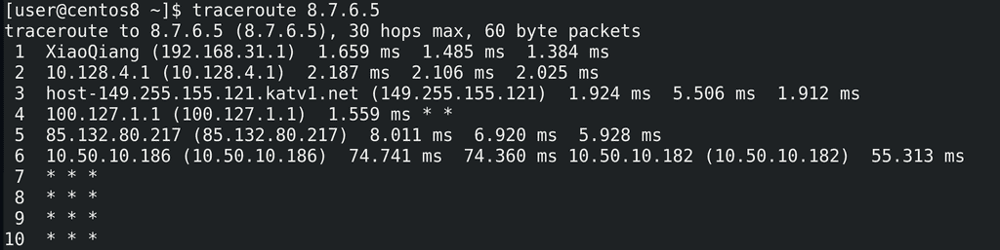

Если у вас не доступен какой-то компьютер или не работает интернет, вы можете запустить traceroute и увидеть, после какого маршрутизатора застревает пакет - traceroute 8.7.6.5. Скажем, если пакет доходит до вашего роутера и застревает - проблема либо с ним, либо с сетью между роутером и провайдером. Если же пакет доходит до следующего роутера - роутера провайдера - то значит у вас всё в порядке, проблема на стороне провайдера. В данном примере пакет застрял на каком-то неизвестном маршрутизаторе - т.е. дело, скорее всего, не в провайдере, просто сам этот адрес недоступен.

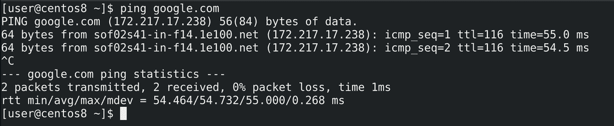

Кроме IP адреса на доступность сайтов и сетевых сервисов может влиять DNS. Так как в большинстве случаев мы к сайтам обращаемся не по IP адресам, а по именам, допустим, google.com, то в случае проблем с DNS у нас слово google.com не будет превращаться в IP адрес, а значит мы не сможем добраться до нужного компьютера. Тот же самый пинг позволяет увидеть, есть ли проблемы с DNS. Как видите, у меня google.com превратился в IP адрес, а значит с DNS проблем нет.

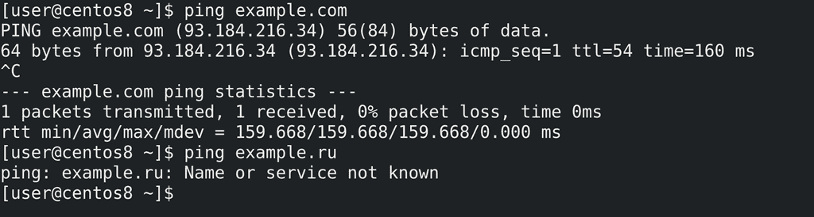

Для примера, если пингануть example.com - мы увидим IP адрес, но при попытке пинга example.ru видим ошибку - имя или сервис недоступны. Это означает, что DNS сервер не смог найти или не ответил, кто такой example.ru. Учитывая, что он отвечал на другие запросы, значит он просто не может найти такое имя.

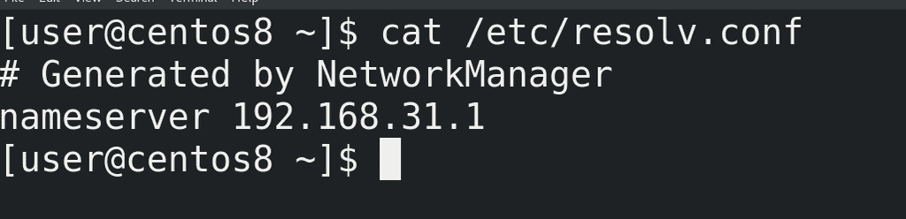

Чтобы узнать, кто прописан DNS сервером на моём компьютере, можно посмотреть файл resolv.conf - cat /etc/resolv.conf. Как видите, в качестве DNS сервера прописан мой роутер. Когда я пытаюсь зайти на какой-то сайт по имени, мой компьютер отправляет DNS запрос на роутер, тот отправляет этот запрос на другие DNS сервера - скорее всего, полученные от провайдера и так по цепочке, пока нужный DNS сервер не ответит. И, обычно, DNS сервера в цепочке запоминают этот ответ. И в следующий раз, если кто-то опять спросит это же имя, они достанут эту информацию из кэша, что позволит компьютеру быстрее получить ответ и быстрее зайти на сайт, а также позволит сократить трафик провайдера, так как он не запрашивает одну и ту же информацию для тысяч своих клиентов.

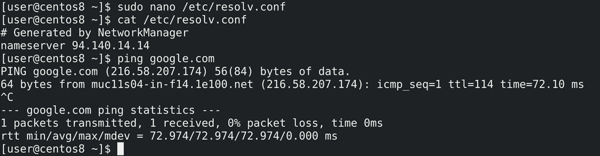

Давайте, для примера, поменяем DNS. Сам файл /etc/resolv.conf генерируется при каждом перезапуске сети или компьютера, но для теста мы изменим здесь - sudo nano /etc/resolv.conf; nameserver 94.140.14.14. Этот IP адрес - адрес DNS сервера AdGuard. Их сервера не выдают нам информацию о доменах, которые используются для рекламы, а поэтому наш браузер не может прогрузить рекламные куски сайтов. Окей, протестируем - ping google.com - всё пингуется.

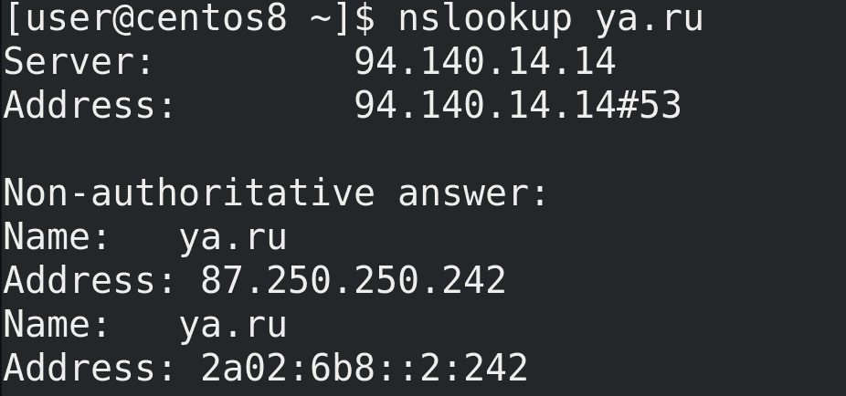

Но как мне убедиться, что я использую именно эти DNS сервера? Для этого можем использовать утилиту nslookup - nslookup ya.ru. Вначале ответа пишется адрес сервера DNS - именно то, что я указывал. А внизу ответ - нужные IP адреса. nslookup - тоже как способ узнать доступность DNS серверов без необходимости пинга, да и в целом, чтобы найти нужные ответы по DNS.

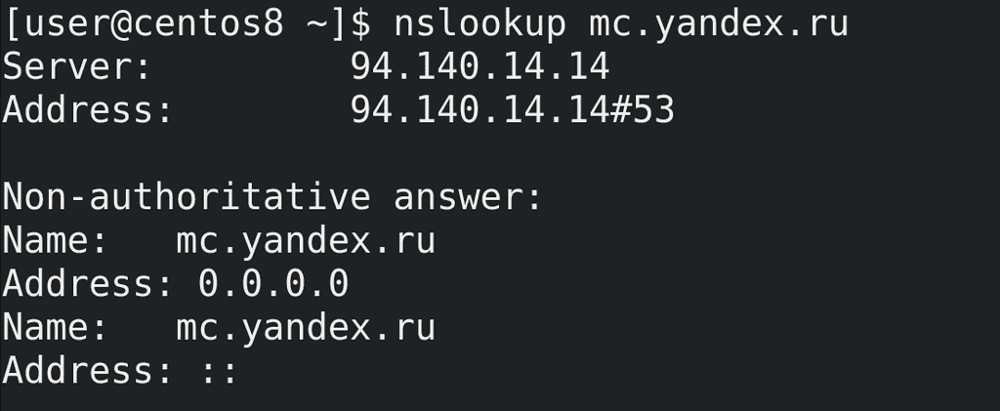

Давайте ещё пропишем несуществующий DNS - sudo nano /etc/resolv.conf; nameserver 8.7.6.5; cat /etc/resolv.conf.  Эта ситуация сравнима с тем, что либо мы неправильно настроили DNS, либо DNS сервер недоступен. Тогда ping будет жаловаться, что это имя неизвестно, а nslookup скажет, что не может достучаться до DNS серверов.

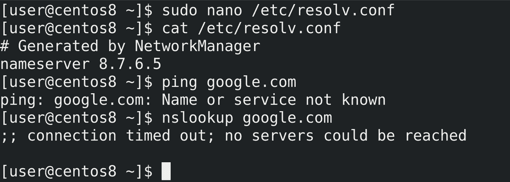

Хорошо, с тем, как проверить работу сети, разобрались. Теперь поговорим о смене настроек. Как я говорил, /etc/resolv.conf генерируется при перезапуске сети или компьютера, т.е. наши изменения там - временные и чисто для тестов. Команда ip также позволяет временно добавить и удалить ip адрес или маршрут, а также поменять кое-какие настройки. Но эти изменения временные, поэтому это рассмотрим в другой раз.

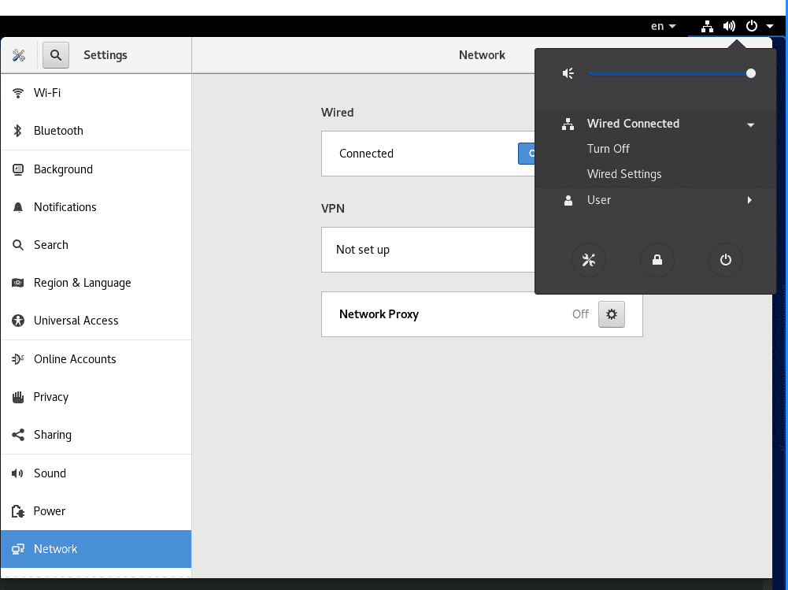

Для постоянных настроек используется сетевой демон NetworkManager. Этот демон есть почти на всех дистрибутивах - где-то он стоит по умолчанию, а где-то его можно установить. Он позволяет гибко управлять настройками и работать с сетью. У него есть 3 интерфейса - графический, псевдографический и текстовой. Если у вас на компе линукс, можете использовать графику - он простой и функционала зачастую хватает.

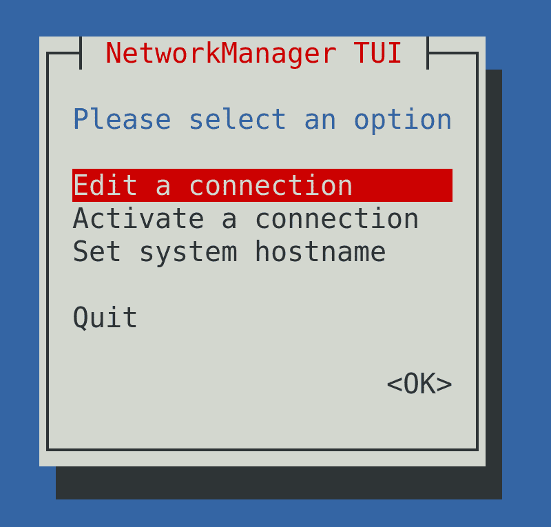

Однако на серверах графики нет, поэтому остаются 2 варианта. Для большинства задач подойдёт псевдографика - sudo nmtui. Давайте, для примера, выставим статичный IP. Это нужно, чтобы у компьютера не поменялся IP адрес, так как DHCP раздаёт IP адреса динамически. Т.е., скажем, если я завтра включу эту виртуалку, у неё может быть другой адрес. А если поставлю статический - то у неё этот адрес останется навсегда, или пока я не поменяю.

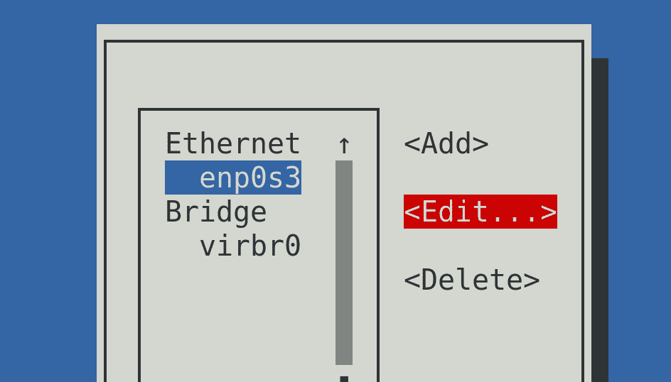

Для этого заходим в "Edit a connection" и выбираем нужный интерфейс, либо нажимаем направо и Edit. После этого открывается окно настроек интерфейса.

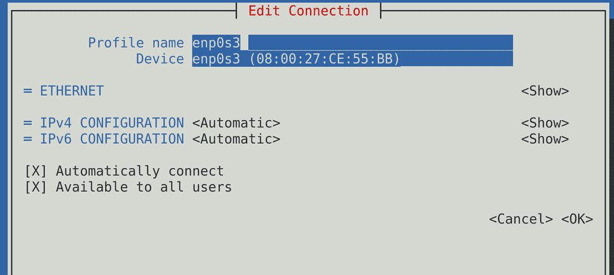

Сверху у нас Profile name - имя профиля. Это имя, которое нужно нам для понимания, поэтому можем поменять его на всё что угодно, допустим, VBox Bridge. Ниже - имя интерфейса, обычно его трогать не стоит.  

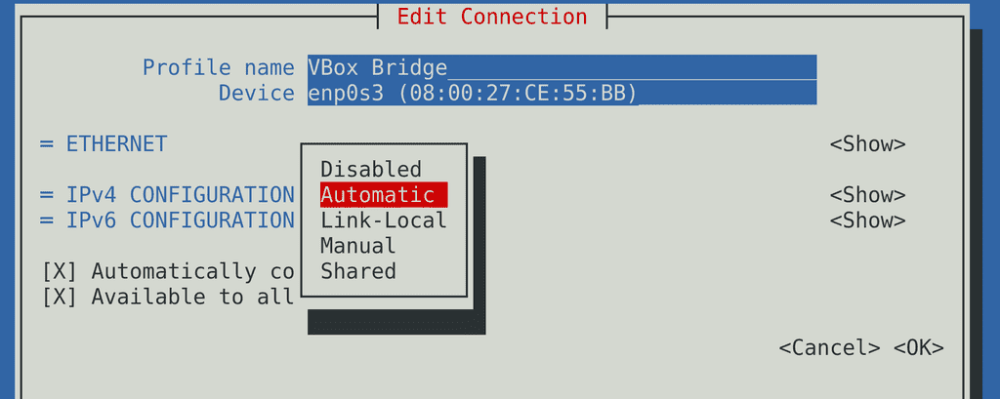

Наводимся на ipv4 configuration и меняем automatic на manual. Automatic используется для получения IP по DHCP, manual - для статичного IP. Нажимаем справа на Show, чтобы показать настройки.

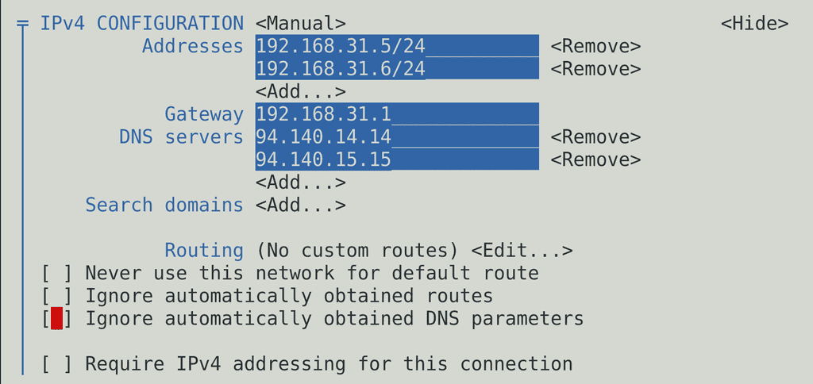

Для начала пропишем не занятый IP адрес из той же сети - 192.168.31.5/24. Технически, на одном интерфейсе можно прописать несколько IP адресов, тогда компьютер будет доступен по этим адресам. Это используется не так часто, но для примера добавим - 192.168.31.6/24. В качестве Gateway пропишем роутер - 192.168.31.1 - иначе у нас не будет работать интернет. Также добавим два DNS сервера - 94.140.14.14, 94.140.15.15. Если один будет недоступен, мы обратимся ко второму. Остальные настройки пока трогать не будем.

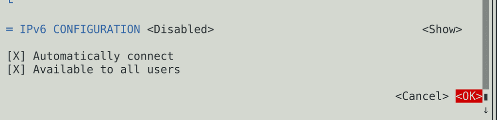

Спустимся ниже, где у нас настройка IPv6. Нам ipv6 не нужен, поэтому меняем значение на Disabled.

*	"Automatically connect" говорит о том, что этот интерфейс будет подниматься при каждом включении компьютера. Если галочка не будет стоять, после перезагрузки сеть работать не будет, придётся заходить в nmtui и активировать сеть.
*	"Available to all users" нужен, чтобы дать всем пользователям право менять настройки сети, отключать и включать интерфейс без root прав.

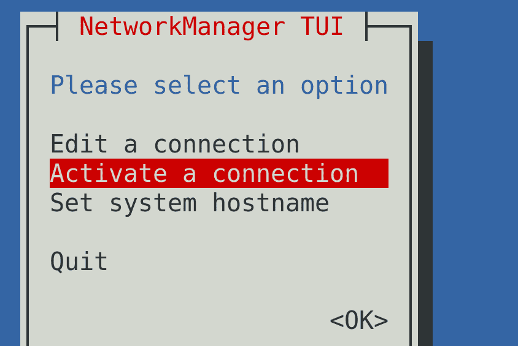

Нажмём <OK>, потом Back или Escape и зайдём в Activate a connection. Наши изменения не вступят в силу, пока мы не перезапустим интерфейс.

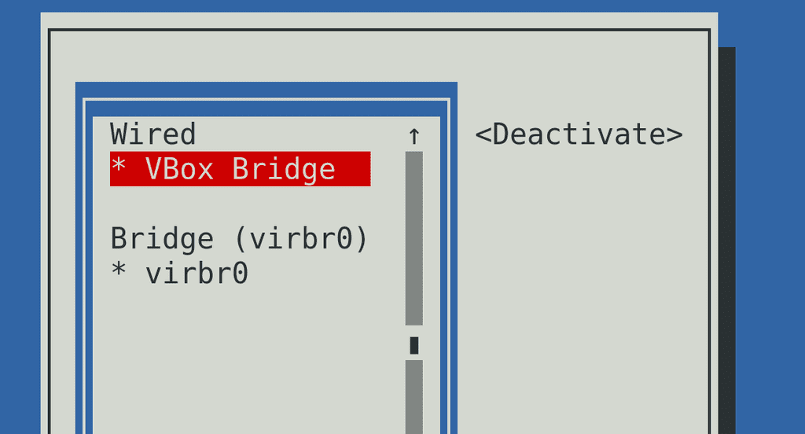

Потом два раза нажимаем на нужный интерфейс, чтобы деактивировать и опять активировать интерфейс. Это тот же способ административно выключить и включить интерфейс, как мы это делали с ip link set down и up. После переактивации можно два раза нажать Esc, чтобы выйти из nmtui.

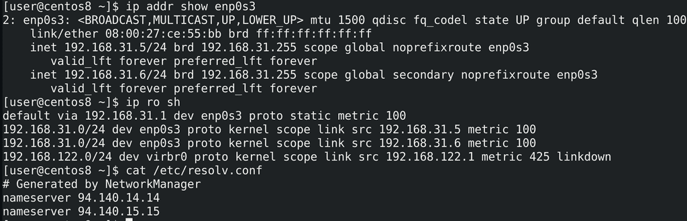

После чего проверим настройки сети - ip address show enp0s3; ip ro sh; cat /etc/resolv.conf. Здесь видно оба IP адреса, которые мы прописали, gateway и dns сервера.

Подведём итоги. Мы с вами разобрали, как базово работать с сетью на линуксах - как посмотреть информацию об интерфейсах, маршрутах и DNS серверах, разобрали базовые утилиты для диагностики проблем, а также настройку сети.
