# 46. Межсетевой экран - firewalld

<iframe width='560' height='315' src="https://www.youtube.com/embed/pIqwmxYQL-E" title='YouTube video player' frameborder='0' allow='accelerometer; autoplay; clipboard-write; encrypted-media; gyroscope; picture-in-picture' allowfullscreen></iframe>

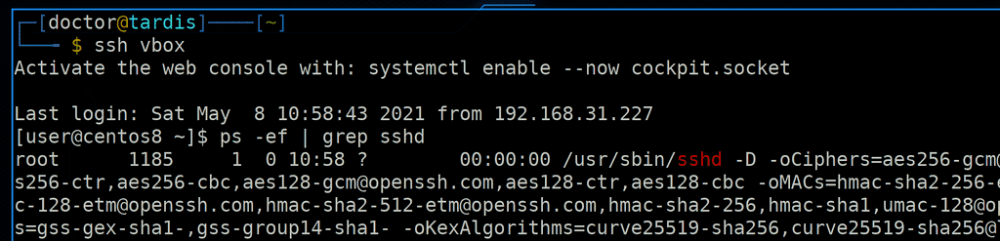

В прошлый раз мы с вами разобрали SElinux - систему безопасности, защищаю от уязвимостей. Допустим, если у SSH демона есть какая-то недоработка, взломщики не логинясь через него попытаются запустить какую-то другую программу, например, passwd, чтобы задать пароль root пользователю и получить доступ на сервер. Это абстрактный пример, в реале атаки несколько другие, но суть похожая. Так вот, если в системе нет SElinux-а, злоумышленники получат полный доступ к системе, так как sshd работает от пользователя root:

```
ps -ef | grep sshd
```

А если SElinux есть, то он не позволит процессу sshd запустить passwd или любую другую программу, так как контексты не позволяют, тем самым предотвратит атаку.

Но надеяться только на него не стоит - хорошая система безопасности состоит из многих уровней. И одну из главных ролей играет файрвол, который позволяет контролировать соединения ещё до того, как они доберутся до демона. Ведь если злоумышленник не сможет подключиться к SSH - то и не сможет эксплуатировать уязвимости.

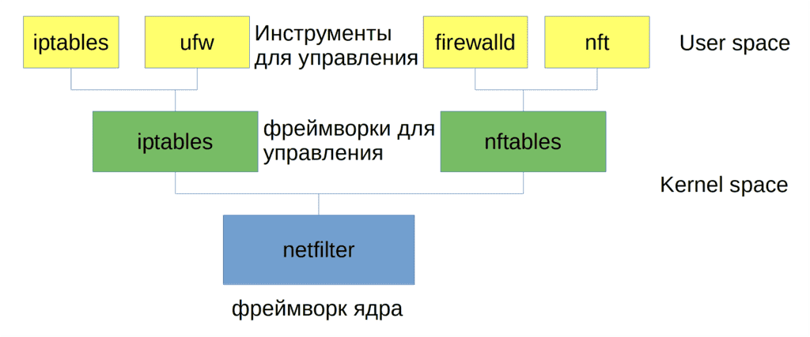

Если помните, я говорил, что в ядре Linux есть фреймворк LSM, который является каркасом для SElinux и других подобных программ. Так вот, тут похожая ситуация - в ядре есть фреймворк netfilter, который является каркасом для различных инструментов по управлению файрволом. Самой блокировкой занимается именно netfilter, но он работает на уровне ядра, а чтобы задавать настройки нужны инструменты в пространстве пользователя. Раньше был популярен iptables, но в 2014 его заменил nftables, хотя до сих пор iptables где-то ещё используется. Но при этом сам nftables также выступает каркасом, есть утилита nft для создания политик для nftables, а он уже преобразует эти политики в понятный вид для netfilter. Но на RHEL-based дистрибутивах для управления nftables по умолчанию используется другой инструмент - firewalld. И о нём сегодня мы и будем говорить. Чтобы обобщить, firewalld - это инструмент для управления файрволом, использующий в качестве бэкенда nftables, который в свою очередь является инструментом для управления фреймворком ядра netfilter. Это так, в целях общего развития.

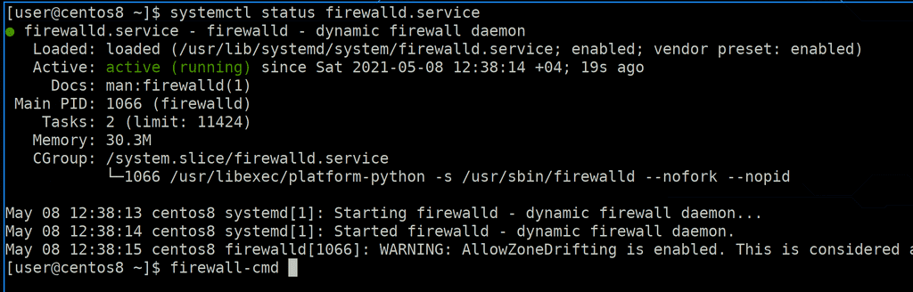

При этом сам firewalld является демоном:

```
sudo systemctl status firewalld
```

а для просмотра информации и управления используется команда ``` firewall-cmd ```. В некоторых случаях может понадобится выключить файрвол, например, у вас что-то не работает и есть подозрения, что подключения блокирует файрвол. В таких случаях достаточно остановить этот сервис. Но просто так это делать не стоит.

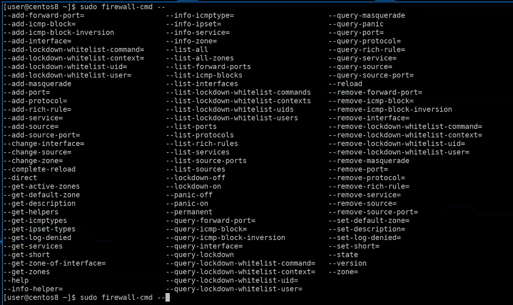

У firewall-cmd большой функционал, поэтому много различных ключей, и почти все начинаются на две дефиса. Но пусть это вас не пугает, потому что всё интуитивно понятно.

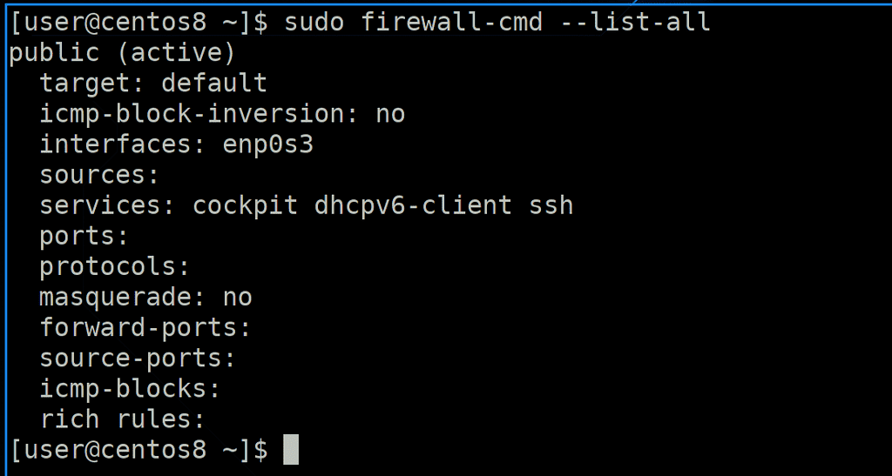

Начнём с простого - list-all:

```
sudo firewall-cmd --list-all
```

Она показывает всю информацию - что разрешено, что запрещено и к кому это относится. Пока остановимся на строке services - здесь перечислены разрешённые сервисы - cockpit, dhcpv6-client и ssh. В firewalld, сервисы - это шаблоны, которые упрощают настройку и понимание. Смотришь и видишь, что ssh разрешён.

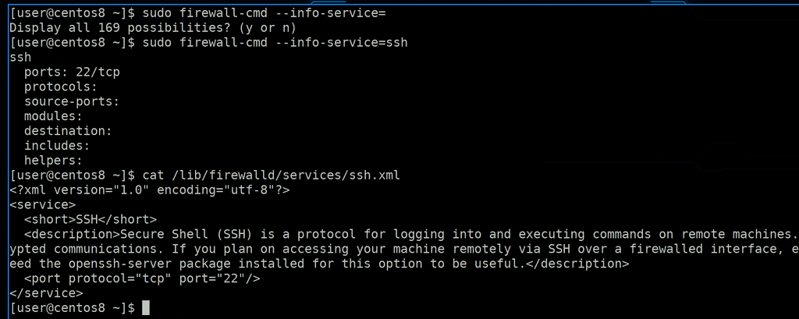

Но настройки файрвола никак не связаны с настройками демонов. Если поменять стандартный порт демона, того же sshd - это не значит, что и на firewalld он изменится. Чтобы посмотреть информацию про сервис, можно использовать опцию ``` --info-service ```:

```
sudo firewall-cmd --info-service=ssh
```

Как тут видно, ssh используется 22 порт tcp. Настройки сервисов файрвола прописаны в файлах в ``` /lib/firewalld/services ```:

```
cat /lib/firewalld/services/ssh
```

В целом сервис отличается от порта - в одном сервисе может быть несколько портов, сервис можно жёстко привязать к определённым адресам, исходящим портам, другим сервисам и т.п.


Давайте, к примеру, на sshd поставим нестандартный порт:

```
sudo nano /etc/ssh/sshd_config
sudo systemctl restart sshd
```

Хоть меня и не выбило из текущей сессии, но при попытке заново подключиться по стандартному порту ничего не получится. Но и указав изменённый порт также ничего не выходит. Потому что в файрволе не настроено, чтобы он кого-то пускал по порту 2233. Правда в логах об этом не будет ни слова - обычно, нет необходимости логировать каждое запрещённое соединение, а их, как правило, так много, что для логов не хватит места.

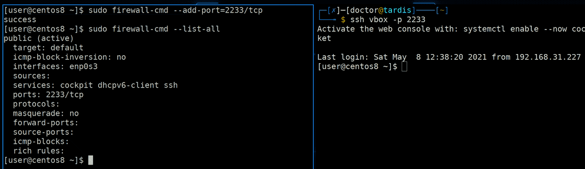

Самый простой вариант - разрешить порт, add port:

```
sudo firewall-cmd --add-port=2233/tcp
```

Т.е. после равно нужно указать номер порта, слэш и нужный протокол - tcp или udp. После этого подключение прошло нормально:

```
ssh vbox -p 2233
```

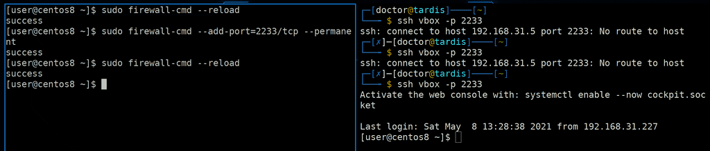

Но эти изменения только на текущую сессию. Если перезагрузить компьютер или сервис файрвола, то опять подключения будут блокироваться:

```
sudo firewall-cmd --reload
ssh vbox -p 2233
```

Если мы хотим, чтобы изменения остались навсегда, нужно использовать ключ ``` --permanent ```:

```
sudo firewall-cmd --add-port=2233/tcp --permanent
```

При этом изменения происходят в настройках, а не в текущей сессии, поэтому после команды следует перезапустить файрвол:

```
sudo firewall-cmd --reload
```

После чего всё заработает:

```
ssh vbox -p 2233
```

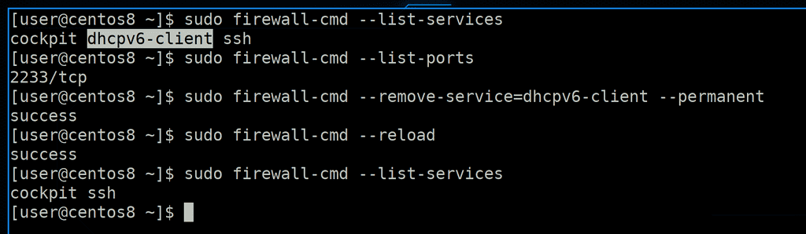

Правда сейчас сложилась ситуация, что у нас на файрволе открыт и 22 порт, как сервис, и 2233:

```
sudo firewall-cmd --list-services
sudo firewall-cmd --list-ports
```

Существует заблуждение, что открытый порт - это опасно, но сам по себе порт не несёт никакой угрозы, она может быть в программе, которая стоит за этим портом, в её уязвимостях и неправильных настройках. И то что сейчас на файрволе остался открытым 22 порт - ничего страшного, всё равно за ним никакого сервиса нет. Однако всё равно стоит убирать лишнее и приводить в порядок - безопасность комплексная штука, а хаос только делает хуже. Поэтому уберём отсюда сервис dhcpv6-client - он нужен для ipv6, а мы им не пользуемся:

```
sudo firewall-cmd --remove-service=dhcpv6-client --permanent
```

Команды довольно простые - list показывает, add добавляет, remove убирает, permanent сохраняет в настройках, reload перезагружает.

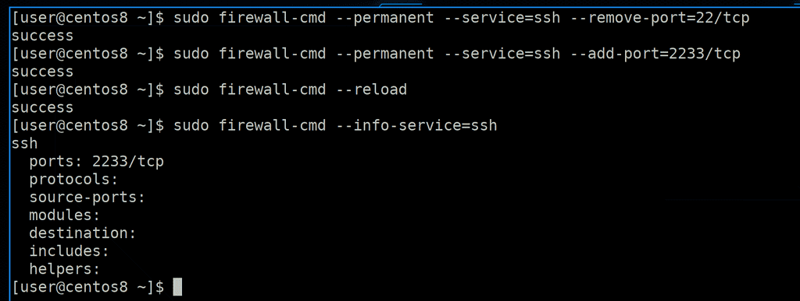

Можно создавать или изменять сервисы. К примеру, сделаем так, чтобы порт 2233 не висел отдельно, а был в самом сервисе. Для этого уберём из сервиса 22 порт - remove-port:

```
sudo firewall-cmd --permanent --service=ssh --remove-port=22/tcp
```

Потом добавим порт 2233 - add-port:

```
sudo firewall-cmd --permanent --service=ssh --add-port=2233/tcp
```

Перезапустим и проверим:

```
sudo firewall-cmd --reload
sudo firewall-cmd --info-service=ssh
```

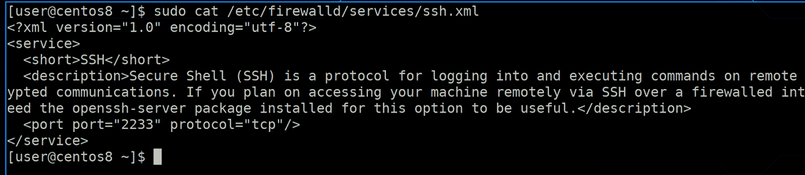

Если стандартные настройки лежат в ``` /lib/firewalld ```, то наши изменения сохраняются в ``` /etc/firewalld ```: 

```
sudo cat /etc/firewalld/services/ssh.xml
```

Можно было просто скопировать файл сервиса из lib в etс, сделать изменения в самом файле и перезапустить сервис. Таким же образом можно скопировать существующий сервис и создать новый.

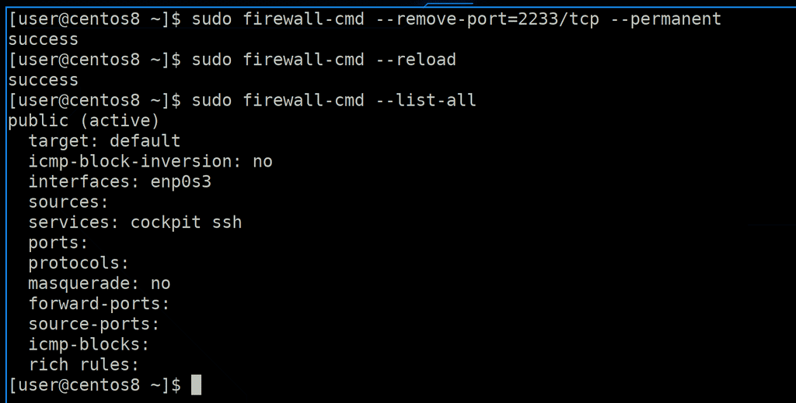

Ну и раз уж мы в самом сервисе заменили порт, то можем убрать отдельно указанный порт:

```
sudo firewall-cmd --remove-port=2233/tcp --permanent
sudo firewall-cmd --reload
sudo firewall-cmd --list-all
```

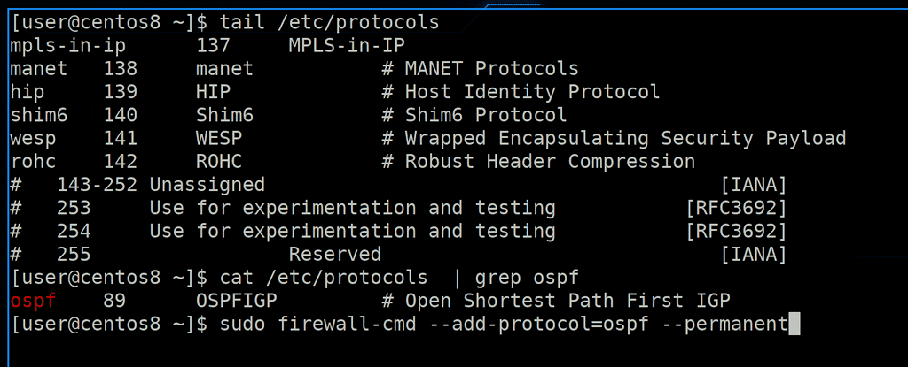

Кроме сервисов и портов, также можно разрешать сетевые протоколы. Они указаны не в firewalld, а в самой системе и их список можно посмотреть в файле ``` /etc/protocols ```:

```
tail /etc/protocols
```

Для примера, есть протокол ospf:

```
grep ospf /etc/protocols
```

которым пользуются роутеры для обмена информацией о сетях. И если бы мы настраивали Linux как роутер, то нужно было бы добавить протокол ospf на файрволе. Но сейчас нам это не нужно.

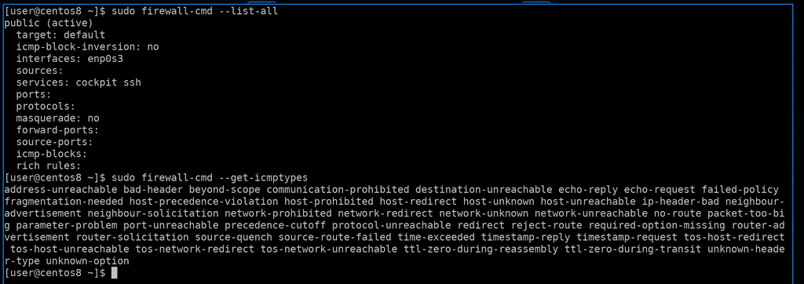

Также в list-all можно увидеть icmp-blocks и icmp-blocks-inversion:

```
sudo firewall-cmd --list-all
sudo firewall-cmd --get-icmptypes
```

ICMP - это специальный протокол, который используют для проверки сети. Помните, в основе сетей мы проверяли доступность сети с помощью ping или traceroute? Эти программы как раз используют ICMP. Так вот, мы использовали ping чтобы понять, доступен ли другой компьютер. Зачастую в интернете боты сканируют сеть с помощью ICMP, чтобы увидеть доступные IP адреса, и потом пытаются их взломать. Нередко администраторы скрывают сервера, блокируя ICMP запросы. Конечно, открытые порты всё ещё будут доступны для подключения, но часть ботов отсеется.

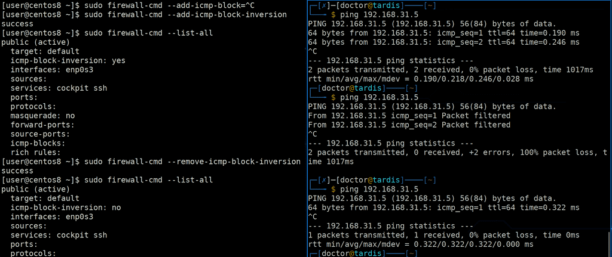

С помощью firewalld мы можем заблокировать все ICMP запросы, либо определённые типы. Второе используется реже, но всё же можно, с помощью опции ``` --add-icmp-block ``` и указанием типа. А если блокировать всё, то можно использовать опцию ``` --add-icmp-block-inversion ```, но перед этим попробуем пингануть виртуалку. Пинг идёт. Потом попробуем включить эту опцию:

```
sudo firewall-cmd --add-icmp-block-inversion
```

Теперь мы видим, что ping выдаёт информацию "Packet filtered". Так мы сразу понимаем, что кто-то фильтрует трафик, а именно файрвол. И чтобы всё вернуть - ``` --remove-icmp-block-inversion ```. Пинг опять пошёл. И не забывайте, что для сохранения настроек нужно использовать ключ ``` --permanent ```.

Вас должно было смутить, что по пингу всё равно можно было понять, компьютер доступен или нет, ведь он ответил нам - packet filtered. Такие блокировки ICMP не столько для скрытия доступности хоста, сколько для скрытия информации о сети, допустим, когда провайдер скрывает адреса своих роутеров. В таких случаях на ICMP запросы посылается ответ REJECT, чтобы было понятно, что эта информация скрыта.

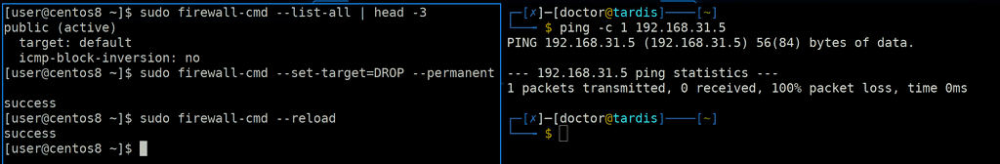

Если же мы хотим именно скрыть компьютер, то нужно поменять другую опцию - target:

```
sudo firewall-cmd --list-all | head -3
```

Для этого нужно использовать ответ DROP:

```
sudo firewall-cmd --set-target=DROP --permanent
sudo firewall-cmd --reload
```

После этого файрвол будет "дропать" пакеты, т.е. выбрасывать. Если при REJECT мы посылали обратный ответ, то при DROP вторая сторона ничего в ответ не получит, поэтому будет считать, что этот IP недоступен.


При этом дропаются не только ICMP пакеты, а любые подключения, не соответствующие разрешённым. К примеру, когда target=default, то при попытке подключиться к запрещённому порту я сразу получаю ответ, что не могу. Так можно понять, что где-то блокирует файрвол. А если стоит режим DROP - то программа, которая пытается подключиться, допустим, ssh, будет долго ждать и просто не дождётся ответа. Поэтому это более предпочтительный способ скрыть компьютер.

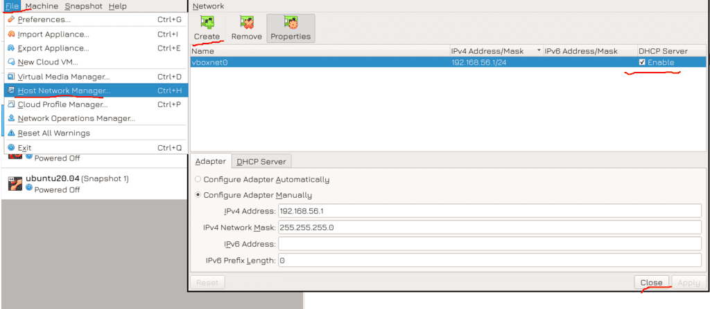

Прежде чем продолжим, давайте добавим ещё один адаптер для виртуалки. Для этого сначала её нужно выключить, затем в меню самого виртуалбокса зайти в File - Host Network Manager и проверить, есть ли там сеть, т.е. в табличке под Name должна быть какая-то запись. Если её нет, то нажмите Create и поставьте галочку у "DHCP Server", затем Close.

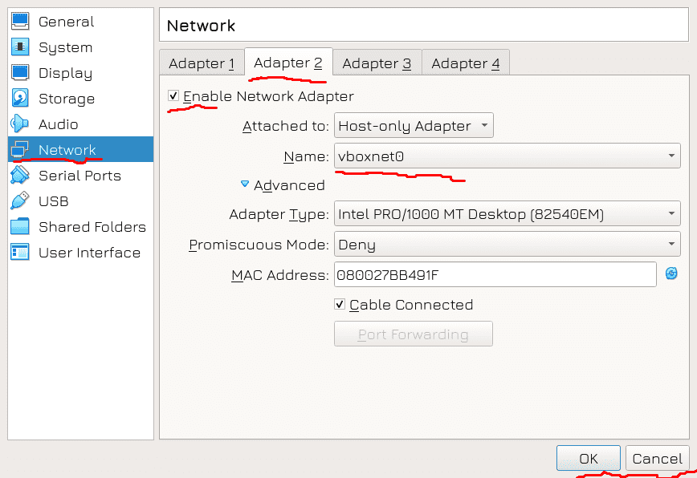

После чего надо зайти в настройки самой виртуалки, выбрать Network - Adapter 2, поставить галочку на включение адаптера, выбрать тип "Host-only Adapter" и выбрать из списка созданный адаптер, затем нажать ОК. После этого можно включать виртуалку.

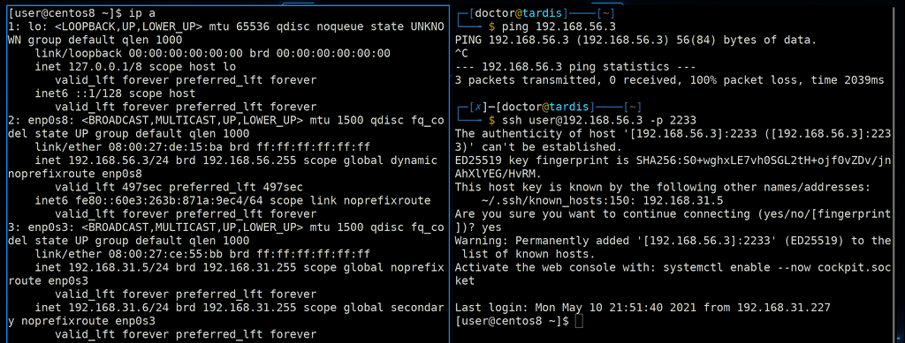

После изменений в виртуалке появится новый интерфейс:

```
ip a
```

У меня он назвался enp0s8 и получил адрес 192.168.56.3, у вас результат может отличаться. Если попытаемся с хоста пропинговать этот адрес, то ничего не получится - но это и не удивительно, мы ведь запретили пинги. А вот подрубиться по этому адресу к SSH можно, естественно, указав нужный порт при подключении:

```
ssh user@192.168.56.3 -p 2233
```

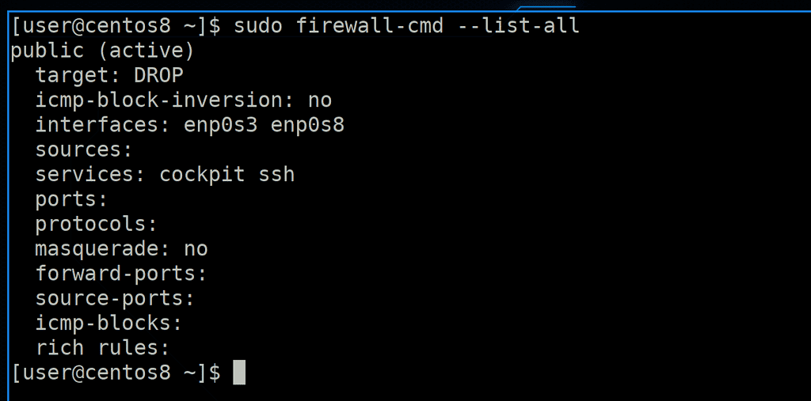

А интерфейс мы добавили не просто так. Если посмотреть файрвол:

```
sudo firewall-cmd --list-all
```

можно заметить, что в строке interfaces появился также enp0s8 - наш новый интерфейс. Зачем на файрволе интерфейсы?

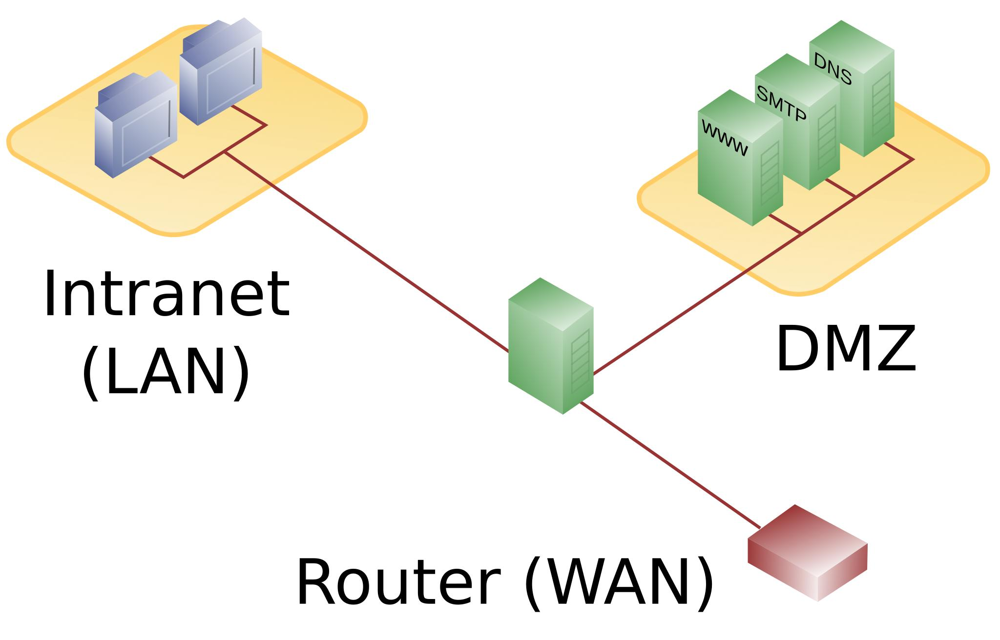

Начнём с того, что нередко сервера могут смотреть сразу в несколько сетей. Например, ваш роутер смотрит одновременно в две сети - в домашнюю и в интернет. Роутер это тоже своего рода сервер, да и из линукса можно сделать маршрутизатор. Так вот, к роутеру можно подключаться, чтобы им управлять. Но позволять кому-то подключаться к роутеру из интернета не очень хорошо, это не безопасно. Поэтому на нём можно настроить, чтобы управлять им можно было только с домашней сети, а не из интернета. Т.е. у вашего роутера есть две так называемые зоны - внешняя сеть и локальная. Внешняя сеть - опасная и недоверенная, все запросы оттуда нужно блокировать. А локальная сеть - относительно безопасная. Если пинги из внешней зоны стоит дропать, то из домашней наоборот, стоит оставить, чтобы было понятно - работает ли роутер. Т.е. всё просто - разные зоны - разное доверие - нужно разное запрещать или разрешать.

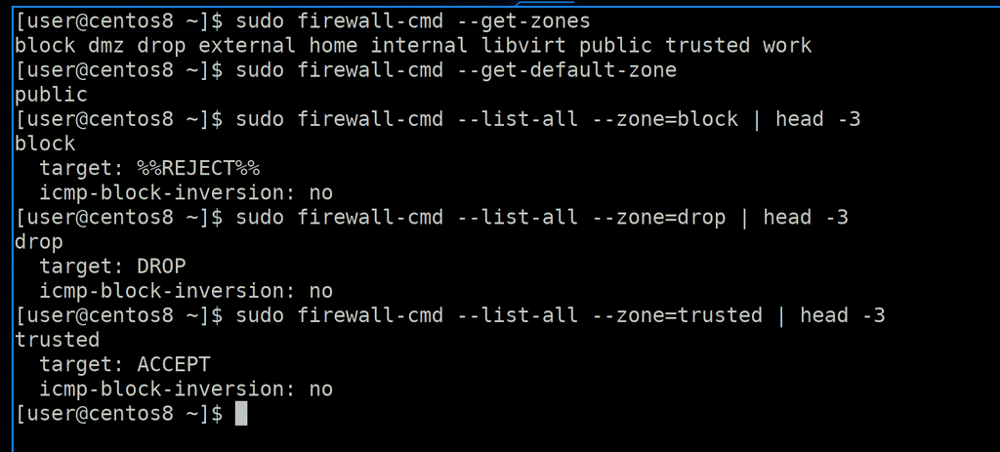

На многих современных файрволах можно настроить различные политики для различных зон. Их также называют zone-based firewall-ами. По умолчанию в firewalld уже прописано несколько зон:

```
sudo firewall-cmd --get-zones
```

И если вы внимательно смотрели, то заметили, что каждый раз, как мы смотрели файрвол, там красовалось слово public - это зона по умолчанию:

```
sudo firewall-cmd --get-default-zone
```

Политики public мы уже видели и настроили. Некоторые зоны уже преднастроены под определённые случаи, например, в зоне block всё по умолчанию блокируется, в зоне drop - дропается, а в зоне trusted - разрешается:

```
sudo firewall-cmd --list-all --zone=block | head -3
sudo firewall-cmd --list-all --zone=drop | head -3
sudo firewall-cmd --list-all --zone=trusted | head -3
```

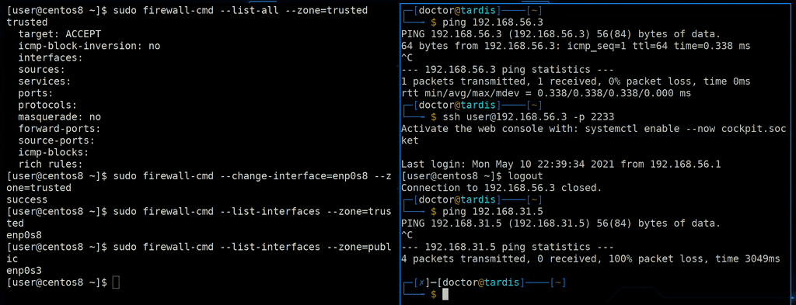

Так вот, мы можем назначать интерфейсы на зоны. Сейчас у нас оба интерфейса смотрят в зону public, но давайте переместим второй интерфейс в зону trusted:

```
sudo firewall-cmd --change-interface=enp0s8 --zone=trusted
```

Это будет временно, а как сделать на постоянно вы уже знаете. После смены интерфейс оказался в trusted зоне:

```
sudo firewall-cmd --list-interfaces --zone=trusted
```

Обратите внимание, что теперь к каждой команде я добавляю ключ ``` --zone ``` и указываю нужную зону. Потому что все прежние изменения мы делали с дефолтной - public. Если же мы хотим работать с другой зоной, нужно обязательно указывать её в опциях. После смены в дефолтной зоне остался только интерфейс enp0s3. И обратите внимание, так как мы сменили зону для интерфейса, то теперь по адресу на этом интерфейсе идёт пинг и можно подключаться. А адрес, оставшийся на enp0s3 всё ещё не пингуется.

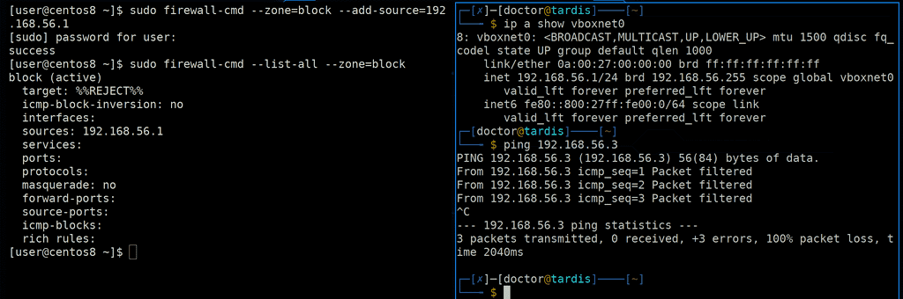

Но иногда бывает, что каким-то определённым IP адресам мы хотим что-то разрешить или запретить, независимо от интерфейса. К примеру, вы хотите блокировать все входящие соединения на внешний адрес роутера, но у вас на работе есть внешний IP адрес, с которого вы хотите разрешить подключения. Интерфейс, который смотрит в интернет, вы переместили с зону drop, но вы можете определённые IP адреса или сети назначать в другие зоны. К примеру, сейчас у меня новый интерфейс находится в зоне trusted и только что всё пинговалось и подключалось. Давайте я добавлю IP адрес хоста в зону block:

```
sudo firewall-cmd --zone=block --add-source=192.168.56.1
sudo firewall-cmd --list-all --zone=block
```

Даже если у меня интерфейс находится в другой зоне, IP адрес конкретнее, а поэтому при виде запроса с этого IP адреса будет применяться политика из зоны block - т.е. пинги будут фильтроваться. Если же запрос приходит с адреса, который не прописан не в одной зоне как source - то срабатывает политика, которая применяется ко всему интерфейсу.


Но иногда бывает, что каким-то определённым IP адресам мы хотим что-то разрешить или запретить, независимо от интерфейса. К примеру, вы хотите блокировать все входящие соединения на внешний адрес роутера, но у вас на работе есть внешний IP адрес, с которого вы хотите разрешить подключения. Интерфейс, который смотрит в интернет, вы переместили с зону drop, но вы можете определённые IP адреса или сети назначать в другие зоны. К примеру, сейчас у меня новый интерфейс находится в зоне trusted и только что всё пинговалось и подключалось. Давайте я добавлю IP адрес хоста в зону block:

```
sudo firewall-cmd --zone=block --add-source=192.168.56.1
sudo firewall-cmd --list-all --zone=block
```

Даже если у меня интерфейс находится в другой зоне, IP адрес конкретнее, а поэтому при виде запроса с этого IP адреса будет применяться политика из зоны block - т.е. пинги будут фильтроваться. Если же запрос приходит с адреса, который не прописан не в одной зоне как source - то срабатывает политика, которая применяется ко всему интерфейсу.

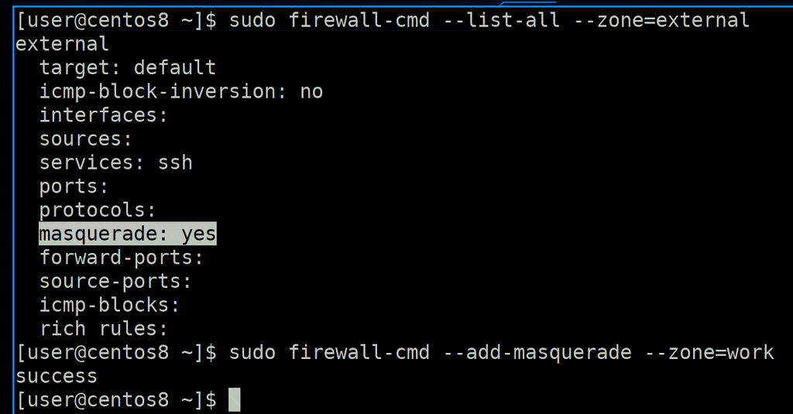

Ещё одна примечательная опция - masquerade:

```
sudo firewall-cmd --list-all --zone=external
```

Мы с вами обсуждали NAT - когда вы выходите в интернет, ваш роутер подменяет ваши домашние IP адреса на свой внешний, чтобы другая сторона знала, куда посылать ответ. Так вот, такой тип NAT-а называется Source NAT, так как заменяется source адрес, т.е. адрес отправителя. Это также позволяет скрыть реальные IP адреса отправителей, поэтому также такой NAT называют ``` masquerade ```. И так как Linux можно настроить как роутер, на нём также можно врубить source nat с помощью файрвола. По умолчанию он врублен в зоне external, но, по желанию, можно и других зонах:

```
sudo firewall-cmd --add-masquerade --zone=work
```


Чуть ниже masquerade-а есть ``` forward-ports ``` - это тоже про NAT, но уже про destination nat - когда заменяется адрес получателя. К примеру, ваш домашний компьютер недоступен из интернета, а ваш роутер - доступен. И вы можете на роутере выделить какой-нибудь порт, к примеру, 5555. И когда на роутер на этот адрес будут приходить запросы, он будет их пересылать на ваш домашний компьютер. Таким образом вы сможете из интернета подключаться к домашнему компьютеру. В простонародье это называется проброс портов. Будет отдельная тема, где я нагляднее объясню Source и Destination NAT.

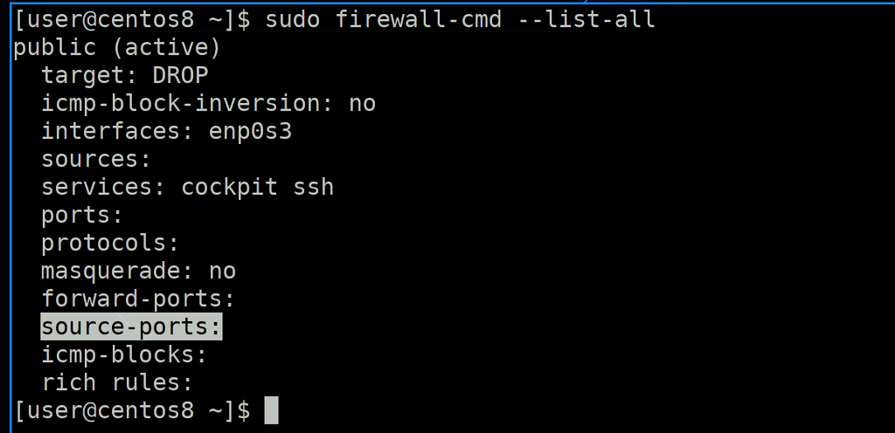

Ну и наконец ``` source-ports ``` - исходящие порты. Тему портов мы уже затрагивали, однако  про исходящие порты не говорили. И так, мы знаем, что ssh сервер по умолчанию работает на 22 порту. И когда мы к нему пытаемся подключиться, для нас этот порт является целевым - destination port. Но для отправки и получения ответа мы и сами, на стороне клиента, должны открыть порт - исходящий порт - source port. Но это не 22 порт, а динамический. Обычно это 5-значные порты, где-то от 30 до 60 тысяч. Когда вы клиентом подключаетесь к ssh, заходите через браузер на какой-то сайт и т.п. - то операционная система временно выделяет для софта рандомный порт. Как только сессия закроется - порт перестанет использоваться. И, как правило, source порты рандомные и мало где указываются. Однако, в определённых программах можно выбрать исходящие порты.  И вот на файрволе есть возможность запретить подключаться с других портов. Но это используется довольно редко.

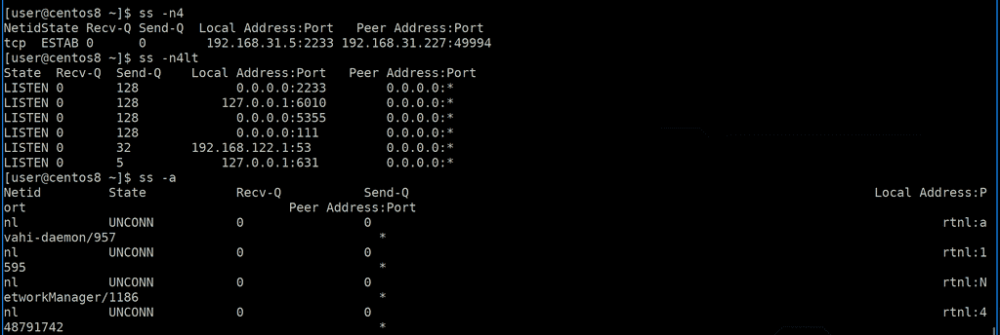

Ну и раз уж мы заговорили о портах, стоит упомянуть команду ss. Вкратце - эта команда показывает сокеты. Помните, мы говорили о сокетах, когда речь шла о логах? Сокеты позволяют процессам общаться между собой. Так вот, сетевые соединения также являются сокетами. Сокеты, которые нужны только между процессами внутри одной системы, называются UNIX сокетами. Ну и соответственно есть TCP и UDP сокеты. К примеру, запустим команду:

```
ss -n4
```

Здесь ключ -n - показывать номера портов, вместо имён. А ключ -4 - показывать только сокеты, относящиеся к ipv4. Как видите, вышла одна строка - это tcp сокет, ESTAB - established - означает, что это установленное соединение. Оно установлено на локальный адрес - 192.168.31.5 на порт 2233. И это соединение идёт от адреса 192.168.31.227 - это мой компьютер, с source порта 49994. Это как раз текущее подключение по SSH.

ss позволяет понять, а какие порты на сервере сейчас активны. Часто бывает нужно понять - а слушает ли демон на таком-то порту? И тут можно использовать команду:

```
ss -n4lt
```

l - это listen, т.е. показывает активные порты, за которыми есть демоны. t - это tcp. В итоге мы видим список tcp сокетов с номерами портов, которые слушает наш сервер по ipv4. А если взять список всех сокетов, то их довольно много:

```
ss -a
```

Мы периодически будем пользоваться этой утилитой.

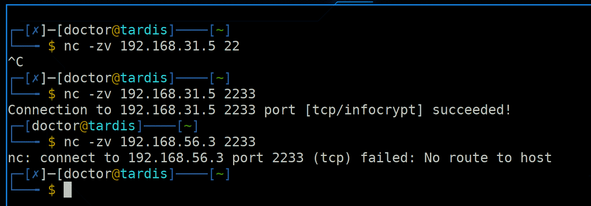

Ещё одна важная утилита:

```
nc
```

По работе вы можете сталкиваться с различными проблемами и не всегда есть возможность точно сказать - проблема с самим приложением или файрвол блокирует? А возможно между пользователем и сервером есть другие файрволы? Если к ssh серверу или сайту можно подключиться утилитами, то не со всеми серверами так просто. Поэтому вам может понадобится понять, а есть ли доступ до сервера и не блокирует ли файрвол? Многие админы используют утилиту telnet, но она не всегда предустановлена, да и не самая удобная. На большинстве Linux-ов зачастую предустановлена утилита nc, и обычно я использую её. Синтаксис для проверки порта простой - ``` nc -zv ip адрес порт ```:

```
nc -zv 192.168.31.5 22
nc -zv 192.168.31.5 2233
nc -zv 192.168.56.3 22
```

Как видите, в первом случае я долго жду ответа, но его нет - это значит, что либо нет демона за этим адресом и портом, либо файрвол дропает запрос. Во втором случае я получил succeeded - т.е. соединение успешно, nc смог подключиться. В третьем случае соединение не прошло - значит, либо хост недоступен, либо файрвол. Но так можно проверять можно только TCP порты, UDP работает несколько иначе, и проверить его бывает затруднительно.

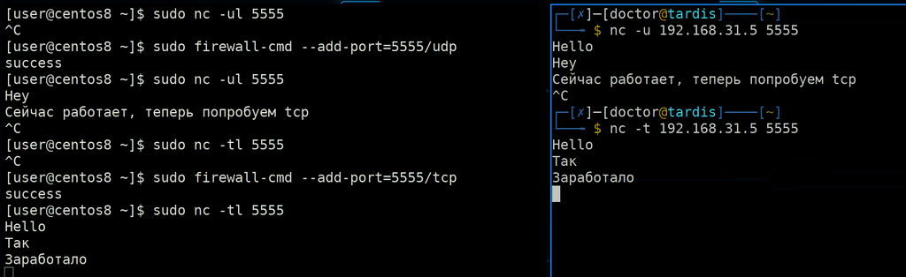

nc также позволяет передавать сообщения, используя tcp или udp. Если у вас есть доступ на сервер, вы можете понять, а работают ли соединения, не блокирует ли кто-то посередине и в целом заранее убедиться, что с сетью проблем не будет, прежде чем настроить какой-то сервис. К примеру, потестируем udp соединение, на стороне сервера слушаем на udp порту 5555:

```
sudo nc -ul 5555
```

С клиента попытаемся подрубиться:

```
nc -u 192.168.31.5 5555
```

Как видите, соединение не проходит. Я на файрволе не открывал порт, в этом и причина. Добавим порт:

```
sudo firewall-cmd --add-port=5555/udp
```

после чего опять потестим:

```
sudo nc -ul 5555
```

Теперь я могу что-то написать и это придёт на сервер. Для проверки tcp просто заменим ключ -u на -t - и на стороне клиента, и на стороне сервера. Всё довольно просто.

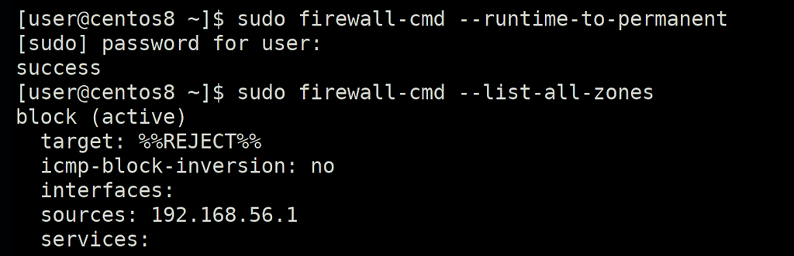

Возвращаясь к файрволу. Мы сделали много изменений, но не прописывали permanent - а это значит, что после рестарта все наши изменения слетят. Если же мы хотим сохранить настройки, допустим, мы тестировали и всё нас устроило - то можем использовать ключ ``` --runtime-to-permanent ```:

```
sudo firewall-cmd --runtime-to-permanent
```

А для просмотра информации по всем зонам - ``` --list-all-zones ```:

```
sudo firewall-cmd --list-all-zones
```

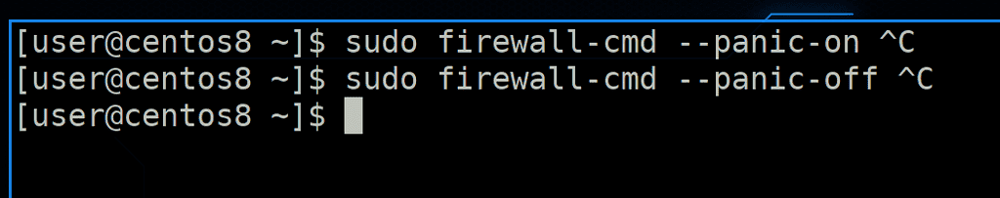

Ещё из примечательного - режим паники ``` --panic-on ```:

```
sudo firewall-cmd --panic-on
sudo firewall-cmd --panif-off
```

При его запуске обрываются все соединения и дропаются все входящие и исходящие пакеты. Может пригодиться, скажем, если вас взломали и вам срочно нужно оборвать всё.

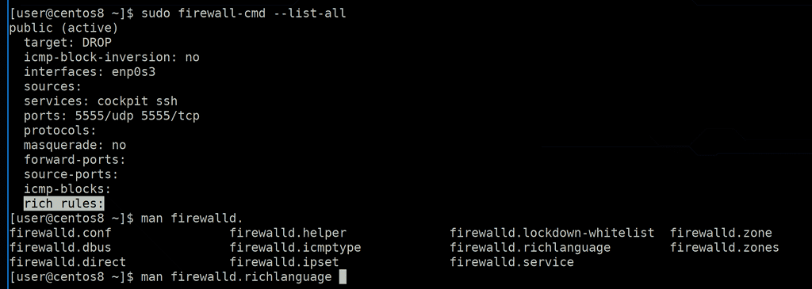

Ну и под конец - ``` --rich-rules ```. До этого мы говорили про зоны, что можно разделить в файрволе сеть по областям, различая по интерфейсам и IP адресам, и к разным применять различные политики. Но иногда бывают нужны точечные правила - только этому адресу разрешить только этот порт и при этом логировать. В некоторых случаях можно создать зону и прописать один source и один сервис, будет чем-то похоже на точечное правило, но это выглядит коряво, всё таки это не зона. Для этого лучше использовать rich-rules. Правда есть нюанс. Скажем, если посмотреть:

```
firewall-cmd --list-all
```

то по выведенному списку очень легко будет понять синтаксис для команд - add-service, add-port, remove-source, change-interface и всё в таком духе. Можно просто два раза tab нажать и увидеть список почти всех доступных команд, а там интуитивно понятно. А с rich rule-ами так не работает, табуляция не поможет, да и не так интуитивно понятно. Но выход простой - в манах есть хорошие примеры:

```
man firewalld.richlanguage
```

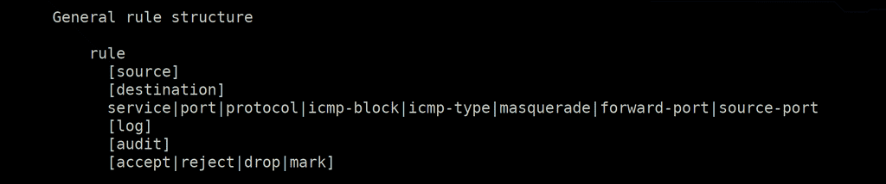

В таких правилах можно указать source и destination адрес, сервис/порт/протокол, а также логирование, аудит и применяемое в итоге действие - пропустить, блокнуть, дропнуть или добавить метку. Метка штука специфичная и пока нам не нужна, а аудит - это тоже своего рода логирование, эту тему мы когда-нибудь разберём.

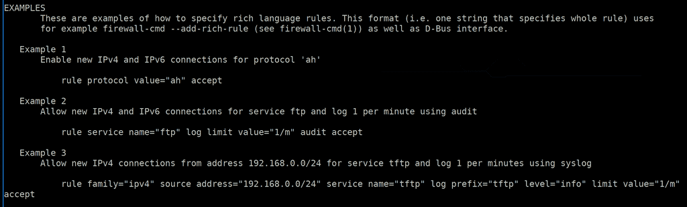

Спустимся чуть ниже, где у нас примеры - EXAMPLES.
Первый пример довольно простой - разрешать протокол ah. Обратите внимание, что в каждом правиле в начале есть слово rule.
Второй пример - разрешить сервис с именем ftp, также его логировать, при этом не чаще раза в минуту, об этом говорит limit value="1/m", ну и включён audit.
Третье правило - разрешать соединения по ipv4 от сети 192.168.0.0/24 к сервису tftp, при этом логировать не чаще раза в минуту, и к логам приписывать префикс tftp, а также важность - info. Если вы помните, при разборе логирования мы упоминали, что в syslog указывается важность лога, это может быть просто информационное сообщение или какая-то ошибка.
Там есть ещё примеры, но их постарайтесь разобрать сами.

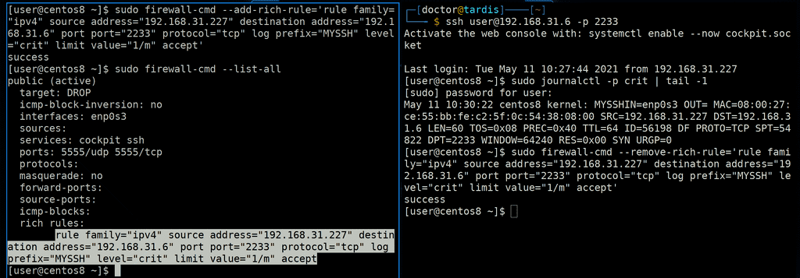

Давайте пропишем правило. Например, разрешать подключение ко второму IP адресу сервера только от адреса моего хоста по порту 2233 и логировать эту информацию не чаще раза в минуту с важностью crit, добавляя prefix MYSSH. Для этого используем опцию ``` --add-rich-rule ```, не забываем указать в начале rule, ну и указываем интересующие нас опции, для начала, что это ipv4, source и destination адреса, порт 2233 и его протокол - tcp, префикс и прочую информацию по логам:

```
sudo firewall-cmd --add-rich-rule='rule family="ipv4" source address="192.168.31.227" destination address="192.168.31.6" port port="2233" protocol="tcp" log prefix="MYSSH" level="crit" limit value="1/m" accept'
```

После этого правило появится в зоне, так как мы не указали зону в команде, то оно добавится в дефолтной зоне:

```
sudo firewall-cmd --list-all
```

Ну и протестируем - подключимся к этому адресу и проверим последние логи с уровнем crit:

```
ssh user@192.168.31.6 -p 2233
sudo journalctl -p crit | tail -1
```

Лог появился и в нём указан входящий интерфейс, ip адреса и прочая информация. Да, rich правила не самые удобные в написании, но с man-ом можно легко вспомнить. А для удаления таких правил опция  ``` --remove-rich-rule ``` со всем содержимым правила.

Давайте подведём итоги. Сегодня мы с вами разобрали firewalld - инструмент, который позволяет гибко и удобно настроить правила в рамках одной или нескольких зон. Синтаксис у команды простой и интуитивно понятный - можно добавлять и убирать порты, сервисы, протоколы, делить сеть на зоны, меняя принадлежность интерфейсов и адресов к какой-либо зоне. Поговорили про ICMP, reject и drop пакетов, а также немного про Source и Destination NAT. Посмотрели утилиту ss, которая выводит информацию о сокетах, а также тестировали соединение с помощью nc. Ну и под конец rich rule-ы - точечные правила, которые позволяют добавлять исключения. И помните, если даже вы забыли синтаксис - всегда есть маны, которые позволят вам вспомнить.  
