# 47. Пакетный менеджер - dnf

<iframe width='560' height='315' src="https://www.youtube.com/embed/NhoIrxM-vpY" title='YouTube video player' frameborder='0' allow='accelerometer; autoplay; clipboard-write; encrypted-media; gyroscope; picture-in-picture' allowfullscreen></iframe>

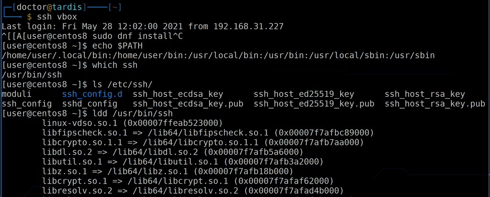

Мы с вами не раз устанавливали программы с помощью команды:

```
dnf install ...
```

но пора детальнее разобрать эту тему. Для начала вспомним, что мы вообще знаем о программах? Чаще всего под программой мы подразумеваем запускаемый файл. И мы знаем, что в переменной $PATH перечислены директории, в которых bash ищет эти запускаемые программы. Для примера возьмём ssh. С помощью команды:

```
which ssh
```

мы можем узнать, где именно находится запускаемый файл - ``` /usr/bin/ssh ```. Однако одним этим файлом программа не ограничивается, у неё есть настройки в директории /etc/ssh:

```
ls /etc/ssh
```

Ещё есть библиотеки, при помощи которых работает эта программа, их мы можем узнать с помощью команды ldd:

```
ldd /usr/bin/ssh
```

Также у программ есть документация, которая лежит в /usr/share/doc, файл сервиса, если это демон, и много других файлов, которые лежат в разных директориях по всей системе.

Исходя из вышесказанного, при установке мы должны расположить все эти файлы по системе. Лучший способ распространять много файлов - в архиве. При этом, если я захочу удалить программу, мне же нужно будет все эти файлы поудалять? А значит надо вести учёт, что и куда было распаковано. Ну и помните, мы говорили, что есть сервисные пользователи - сервисы, по хорошему, должны работать не от рута, а от специальных пользователей. Т.е. если мы ставим веб сервер, то он должен работать от сервисного пользователя. А пользователи - это не файлы, их нужно создавать с помощью команды useradd. А значит не всегда достаточно просто распаковать архив, иногда бывает нужно ещё и запустить команду или скрипт, чтобы, например, добавить сервисного пользователя. Т.е. программы распространяются в виде архивов, но у этих архивов ещё могут быть скрипты и всякая информация о самом архиве. И такие архивы называют пакетами.

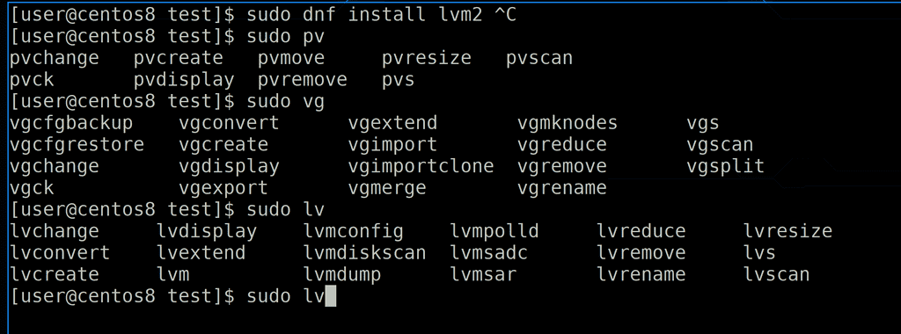

Когда говорят про установку программ на Linux-ах, речь идёт о пакетах - мы устанавливаем пакеты. При этом внутри одного пакета может быть сразу несколько программ, например, ставим один пакет lvm2 - а внутри pvcreate, vgcreate, lvdisplay и куча других запускаемых файлов, но все они относятся к программе LVM. При этом можно сделать пакет, внутри которого не будет исполняемых файлов, только конфиг файлы и скрипты - например, так можно распространять настройки. То есть не каждый пакет является программой.

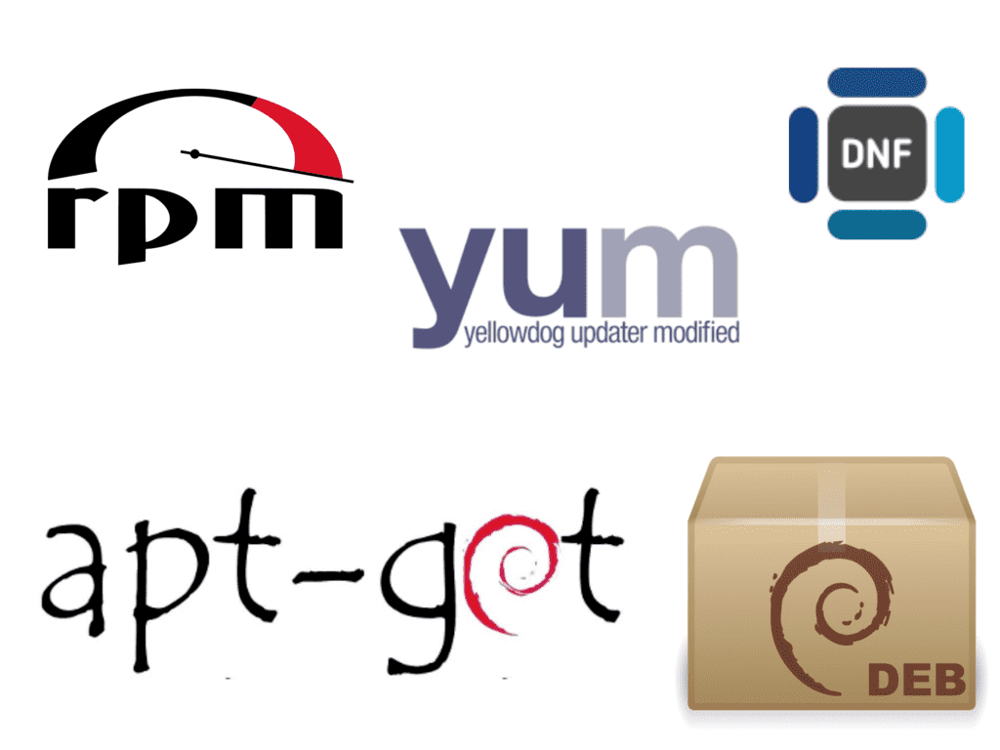

Для работы с пакетами есть программы, называемые пакетными менеджерами. Они устанавливают пакеты, удаляют их, обновляют, ведут учёт, выводят информацию - т.е. управляют пакетами. Пакетных менеджеров много, на разных дистрибутивах могут быть разные. К примеру, на Centos и многих RHEL-based дистрибутивах используются rpm, yum, dnf, а на Debian-based дистрибутивах, например, на Ubuntu, используется dpkg, apt, apt-get, aptitude. К тому же у самих пакетов могут быть различные форматы, они по разному собираются. На Debian-based дистрибутивах формат .deb, а на RHEL-based - .rpm.

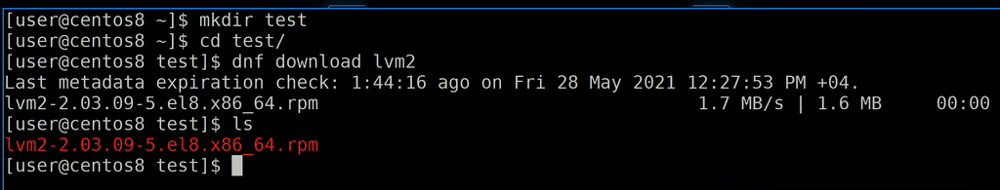

Для примера скачаем какой-нибудь пакет. Это можно сделать с помощью dnf download:

```
mkdir test
cd test
dnf download lvm2
ls
```

У нас скачался файл с расширением .rpm. В названии пакета указано название программы, её версия, дистрибутив, под который сделана - el8 - это centos 8, дальше архитектура, под которую собран пакет - в нашем случае под 64-битные процессоры, ну и расширение rpm.

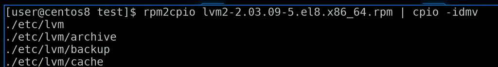

Как мы говорили, пакеты - это архивы, а значит их можно распаковать. Мы с вами изучали архиватор tar, но rpm пакеты архивируется другой утилитой - cpio. Воспользуемся ей, чтобы распаковать этот архив:

```
rpm2cpio lvm2-2.03.09-5.el8.x86_64.rpm | cpio -idmv
```

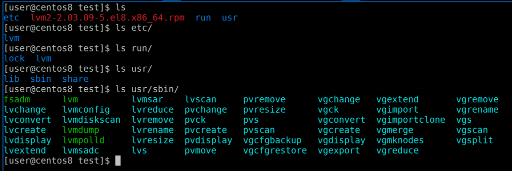

Из архива у нас вышли 3 директории - etc, run и usr. Ничего не напоминает? Правильно, это директории из корня. И когда мы устанавливаем пакет, он разархивируется в корень - в /etc копируется директория /etc/lvm, в /run копируется директория /run/lvm, а в /usr/sbin те самые файлы команд.

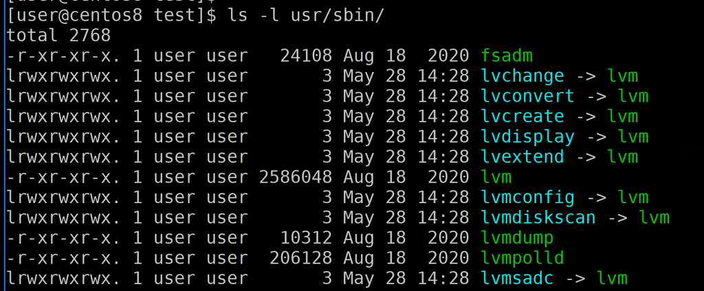

Причём можно заметить, что большинство файлов этого пакета в usr/bin - это просто символические ссылки, ведущие на одну программу.

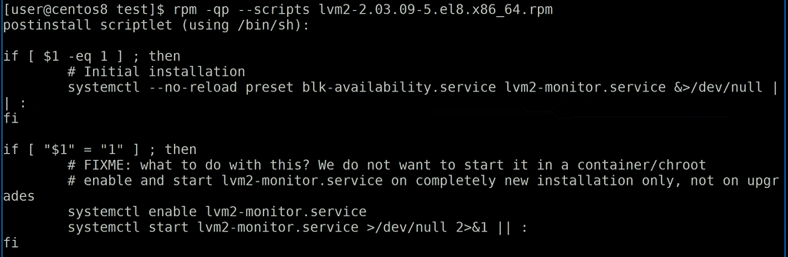

Мы ещё говорили, что кроме архива в пакете также есть скрипты. В .deb пакетах внутри самого пакета находятся 2 архива - в одном скрипты и информация о пакете, а в другом архив с файлами. Что касается .rpm пакетов, то тут информация и скрипты вшиты в сам пакет, и чтобы их увидеть, надо воспользоваться командой rpm. Например, чтобы увидеть скрипты, надо выполнить команду:

```
rpm -qp --scripts lvm2*
```

На первой строчке мы видим postinstall scriptlet - этот скрипт выполняется после установки пакета.

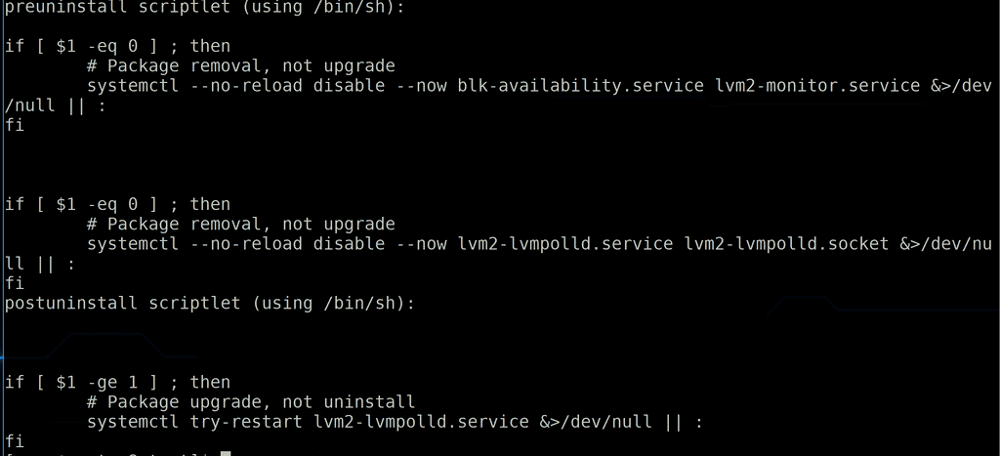

Чуть ниже также можно увидеть preuninstall scriptlet, а потом ещё один postuninstall - т.е. скриптов может быть несколько, какие-то выполняются до установки пакета, какие-то после. Причём, если обратить внимание, нижние скрипты вообще выполняются при удалении пакета, например, чтобы отключить лишние сервисы.

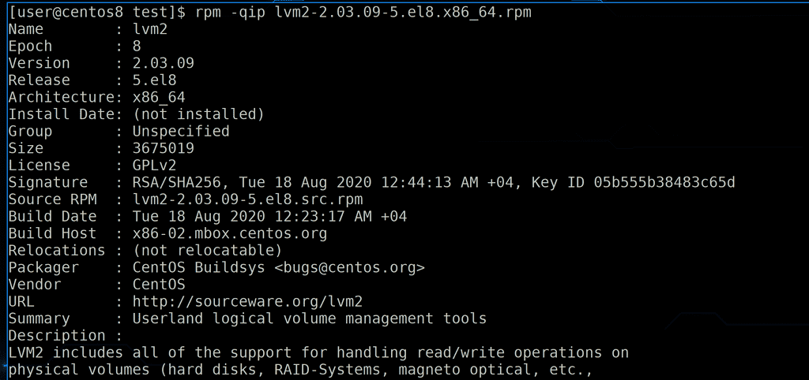

Ну и помимо скриптов пакет содержит информацию о себе, которую также можно увидеть с помощью утилиты rpm:

```
rpm -qip lvm2*
```

Наверху у нас та информация, которую мы видели в названии пакета - имя, версия, релиз и архитектура. Также тут указан Epoch - это тоже касается версии. Просто иногда разработчики софта могут менять нумерацию версии, либо вести её каким-то нестандартным образом. Тогда пакетному менеджеру бывает сложно понять, а какая версия пакета новее, какая старее. И вот epoch номер спасает в таких ситуациях.

Также в информации о пакете указан его размер, лицензия, время сборки, кто собирал пакет, ссылка, небольшое описание и прочая подобная информация.

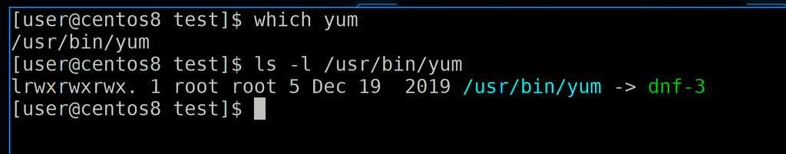

Хорошо, с тем, что из себя представляет пакет, мы разобрались. Поговорим о пакетных менеджерах. На Centos есть 2 основных пакетных менеджера - rpm и dnf. Часто в интернете вы можете натыкаться на команду yum - это также пакетный менеджер, но он использовался в предыдущих версиях Centos. Его переработали и выпустили новую реализацию - dnf. А yum остался как символическая ссылка на dnf, чтобы облегчить переход пользователей и не сломать инструменты и скрипты, работающие с yum:

```
which yum
ls -l /usr/bin/yum
```

Синтаксис во многом совпадает, поэтому на старых системах вы можете вместо dnf писать yum.

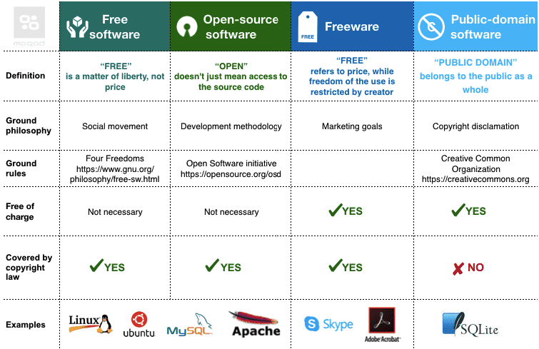

Чтобы увидеть разницу между rpm и dnf следует понять особенность разработки софта на GNU/Linux. Большая часть ПО под Linux системы сделана с открытыми и свободными лицензиями. Эти лицензии предполагают, что любой желающий может использовать, изменять и распространять программы, не спрашивая ни у кого разрешение, минуя всякую бюрократию. И когда разные разработчики пишут программы, им необязательно изобретать велосипед - они могут взять кусочек чужой программы. Обычно это библиотеки, а иногда и целые программы.


В итоге сотни программ могут использовать одни и те же библиотеки, одна программа может использовать другую, а другая третью и всё такое. Если всё встраивать в саму программу, то программа будет весить много и потреблять много ресурсов. А если делать общие библиотеки между программами, всё делить - то не придётся один и тот же код использовать в разных программах, в итоге программы занимают меньше места. Но при этом появляется понятие зависимостей: в самой программе может не хватать чего-то для работы, и ей для этого нужна другая программа или библиотека. Одни программы начинают зависеть от других. Если вы удалите одну библиотеку, могут перестать работать сотни программ. Или, скажем, у вас установлена библиотека версии 3, и вы пытаетесь установить программу, которая требует ту же библиотеку, но версии 2. Если вы замените новую библиотеку на старую, то могут перестать работать другие программы.

Т.е. пакеты зависят друг от друга, и зачастую недостаточно установить один пакет, нужно ставить несколько. И чтобы не ходить по разным сайтам в поисках их зависимостей и не скачивать пакеты по одному, разработчики дистрибутивов делают специальные сервера, где лежат десятки тысяч пакетов для их дистрибутива. Эти сервера называются репозиториями. Тем более лицензия позволяет распространять софт любому желающему. И вот среди разработчиков дистрибутива есть люди, которые постоянно проверяют определённый софт на новые версии, зависимости, проверяют стабильность и безопасность, после чего делают пакет с этим софтом и добавляют его в репозиторий. Такие люди называются мейнтейнерами.

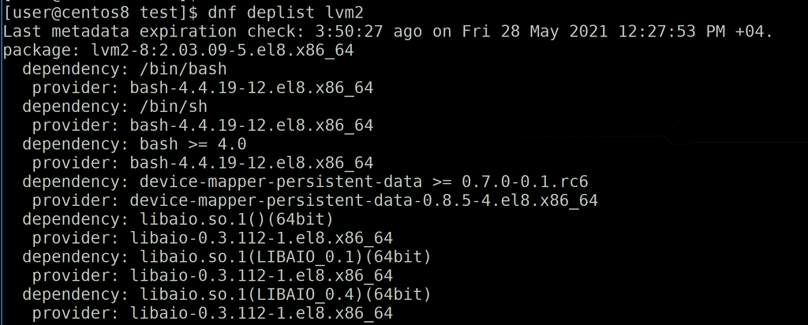

И они следят за тем, чтобы в рамках одной версии дистрибутива не было проблем. Зачастую бывает невозможно установить разные версии одной и той же библиотеки, а значит нужно выбрать определённую версию для дистрибутива, основываясь на стабильности, безопасности и том, что большинство софта требует именно эту версию. Список зависимостей можно посмотреть с помощью команды dnf deplist:

```
dnf deplist lvm2
```

Здесь мы видим, какие программы и библиотеки требуется для lvm2 и в каких пакетах они есть.

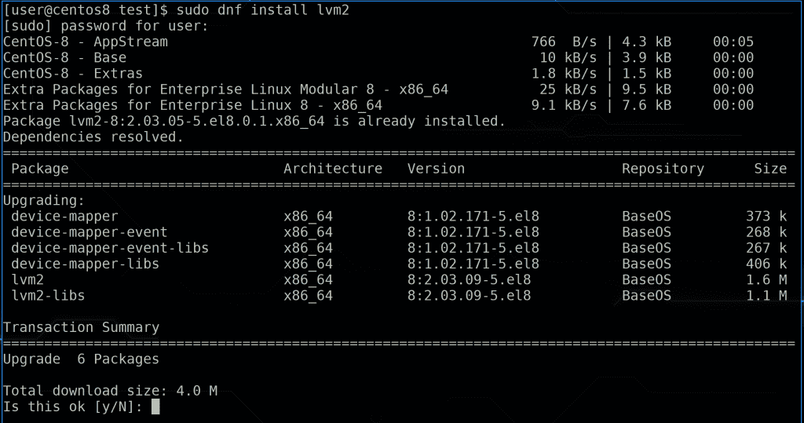

Но когда вы устанавливаете программу:

```
sudo dnf install lvm2
```

то вам не нужно беспокоиться о зависимостях, этим занимается пакетный менеджер. Он видит зависимости каждого пакета, он находит подходящие пакеты в репозитории и предлагает их установить. Кроме того, в данной ситуации dnf сказал, что этот пакет уже установлен, но его может обновить - и предлагает обновить его зависимости в том числе.

Если обобщить, нередко для работы одной программы нужна другая программа или библиотека. Есть сервера, называемые репозиториями, на этих серверах лежат пакеты. Пакетный менеджер может найти в репозитории нужный пакет и его зависимости, т.е. другие пакеты, и установить всё вместе.

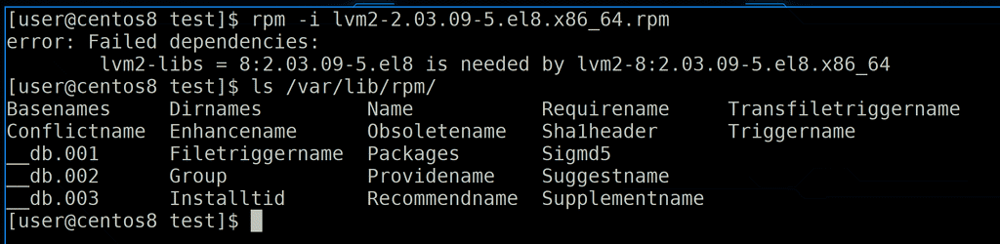

Но не каждый пакетный менеджер работает с репозиториями. dnf это умеет, а rpm нет. При этом rpm это главная утилита для работы с пакетами .rpm - она позволяет создавать пакеты, изменять и всё такое, т.е. это низкоуровневая утилита. И хотя она умеет устанавливать пакеты:

```
rpm -i lvm2-*
```

в большинстве случаев не стоит так делать. rpm может знать о зависимостях, но не может их решить - с rpm вам нужно вручную разбираться с ними. Т.е. зачастую лучше пользоваться dnf, но rpm это не бесполезная утилита - она предоставляет библиотеки для работы dnf, а также базу, где учитываются установленные пакеты и вся информация о них:

```
ls /var/lib/rpm
```

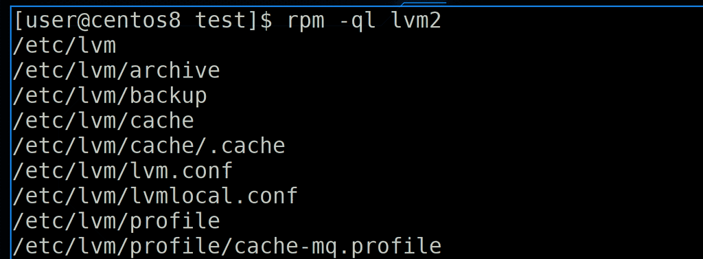

В базе rpm как раз хранится информация, а какие именно файлы и зависимости были установлены вместе с пакетом:

```
rpm -ql lvm2
```

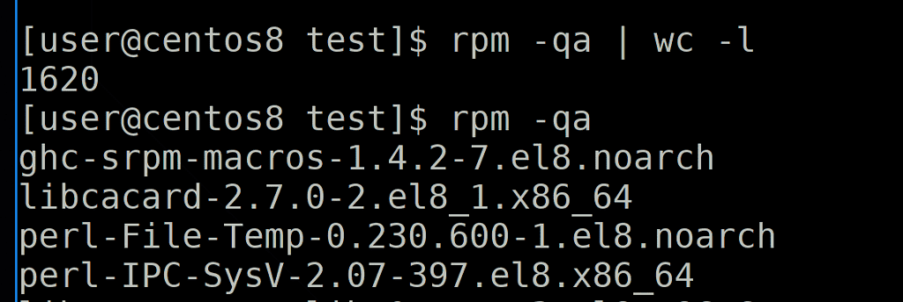

К примеру, rpm может вывести список всех установленных пакетов:

```
rpm -qa
```

Здесь -q - это сделать запрос, а - all - обо всех пакетах. До этого были ключи ``` -ql ``` - вывести список файлов пакета. Я не буду разбирать все ключи, потому что их очень много, но есть man и help, где всё детально расписано. Ну и можете почитать про [топ 20 команд с rpm](https://blog.sedicomm.com/2019/11/06/20-prakticheskih-primerov-komand-rpm-v-linux/), чтобы иметь чуть больше представления об этом пакетном менеджере.


Сейчас же перейдём к dnf. Как мы сказали, dnf работает с репозиториями - с серверами, где лежат пакеты. Репозиториев может быть много:

```
dnf repolist
```

Есть основные репозитории, где лежит большинство пакетов дистрибутива. У одного дистрибутива может быть несколько репозиториев - это зависит от разработчика, кто как свои репозитории поделит. К примеру, здесь мы видим Base и AppStream. В Base лежат базовые пакеты для работы операционной системы, а в AppStream - всякий дополнительный софт. Кроме репозиториев от самого дистрибутива, бывают репозитории и от разработчиков программ. Разработчики дистрибутива больше заинтересованы в стабильности своей системы, и ради этого могут не добавлять свежевыпущенные версии программ. Ну и не всегда бывает время оперативно добавить программу в репозиторий, так как зачастую мейнтейнеры отвечают за сотни различных пакетов. А разработчики софта больше заинтересованы, чтобы пользователи получили более новую версию программы и ради этого они могут поднять свои репозитории, где сами будут следить за актуальностью софта. При этом в их репозиториях не содержатся все пакеты системы, а только сама программа и её зависимости. К примеру, у VirtualBox есть свои репозитории.

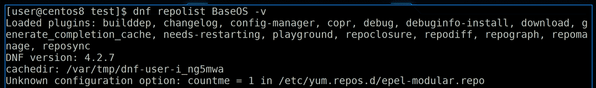

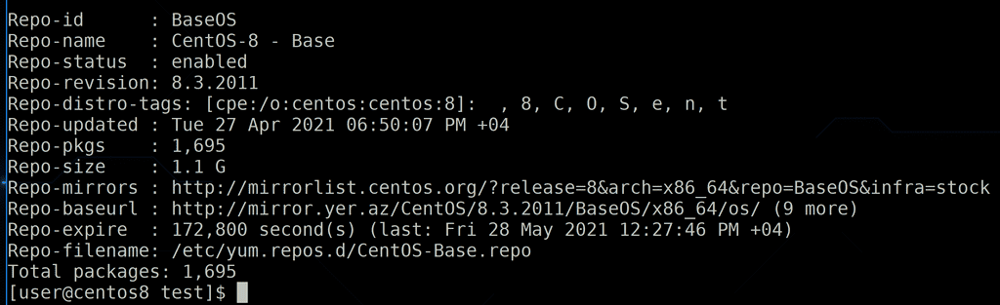

Чуть больше информации о репозитории можно получить с помощью команды dnf repolist -v:

```
dnf repolist BaseOS -v
```

Здесь мы видим, что статус репозитория - enabled, репозиторий включён в настройках dnf. Т.е. мы можем по необходимости временно включать и отключать репозитории, чтобы поставить программу именно из этого репозитория. Также мы видим количество пакетов в репозитории и его размер. Repo-mirrors - это зеркала - серверы, дублирующие содержимое этого репозитория. Они позволяют снизить нагрузку с основных серверов дистрибутива, а также физически они располагаются ближе к вашему региону.


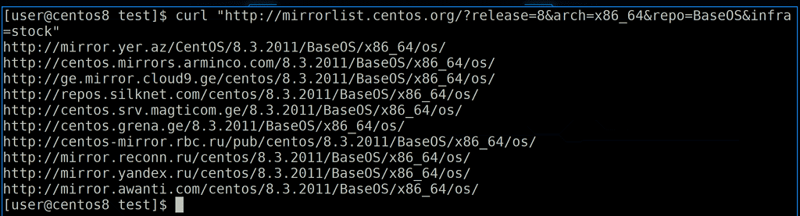

Скопируем ссылку и используем утилиту curl, чтобы посмотреть содержимое этой ссылки, хотя можно было увидеть это и через браузер. http - это протокол, который используют веб сервера, и именно он используется, когда вы заходите на сайты через браузер.

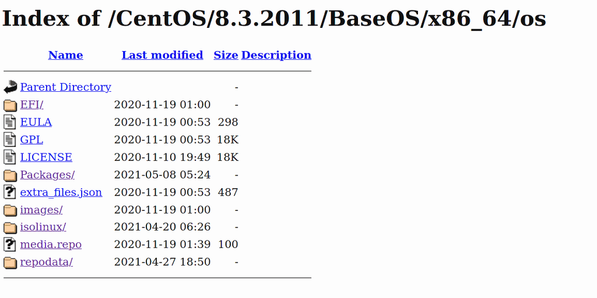

А Repo-baseurl содержит ссылку на репозиторий, который мы используем - как раз одно из зеркал. Здесь у нас сами пакеты в директории Packages и информация о репозитории в repodata. Как раз там хранится информация о всех файлах в репозитории, их зависимостях, версиях и т.п. За счёт этих файлов пакетный менеджер, ещё не установив сам пакет, уже знает, какие у него зависимости и в целом может вывести информацию о каждом пакете.

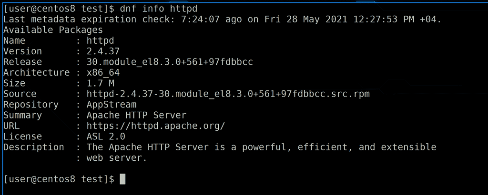

dnf скачивает информацию о каждом прописанном репозитории, благодаря чему он за доли секунд может вывести информацию о любом пакете, даже если он не установлен:

```
dnf info httpd
```

Здесь же можно увидеть, а в каком именно репозитории находится данный пакет - AppStream.

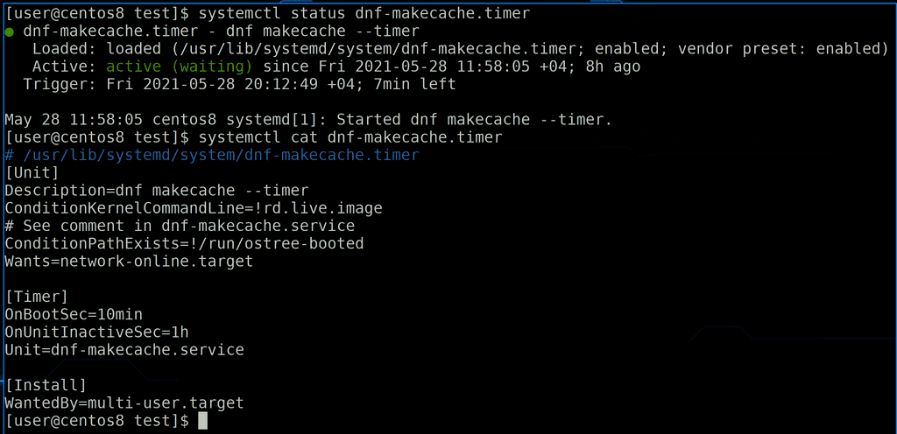

Но информация о репозитории может устаревать - каждый день в репозиторий могут добавлять новые версии пакетов, исправления багов и уязвимостей. Если dnf не будет постоянно обновлять информацию о репозиториях, то у него останется старая версия этой информации и он не будет знать о новых версиях пакетов. Поэтому в системе есть таймер:

```
systemctl status dnf-makecache.timer
systemctl cat dnf-makecache.timer
```

Как видно, примерно раз в час dnf запускает команду ``` dnf makecache ```, что обновляет метаданные.

Кстати, можно создавать свои локальные репозитории, которые будут синхронизироваться с репозиториями дистрибутива. Это бывает полезно в компаниях, где много Linux серверов - вы можете держать один репозиторий и обновлять только его, а все остальные сервера будут брать пакеты из этого репозитория. Это поможет значительно сократить трафик в интернет и ускорить установку пакетов. Также полезно, когда интернета совсем нет. Кроме того, dvd диски и iso образы дистрибутивов также содержат репозитории, которые можно использовать при установке системы и после.


Для примера, добавим репозиторий. Это можно сделать несколькими способами - через саму команду dnf, либо создав файл. Файлы репозиториев лежат в директории /etc/yum.repos.d:

```
ls /etc/yum.repos.d
```

и заканчиваются на .repo.

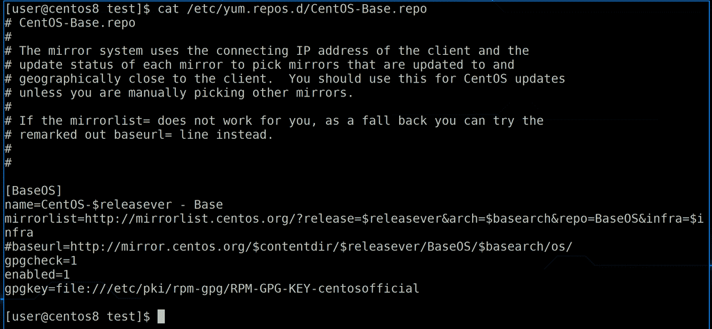

Посмотрим Base.repo:

```
cat /etc/yum.repos.d/CentOS-Base.repo
```

В квадратный скобках указан идентификатор репозитория, его и следующее поле - ``` name ``` - мы можем задать сами, это просто названия. ``` mirrorlist ``` - список зеркал - не у каждого репозитория могут быть зеркала, поэтому мы можем не указывать эту опцию. ``` baseurl ``` - это ссылка на репозиторий. В данном случае ссылка закомментирована, потому что прописаны зеркала, но если б их не было, нужно было бы указать свою ссылку. ``` enabled ``` - говорит о том, что данный репозиторий включён.


``` gpgcheck ``` - проверка ключа и ``` gpgkey ``` - сам ключ. Дело в том, что зачастую репозитории находятся в интернете. И существует MITM атака, которую мы обсуждали при изучении ssh - кто-то может встать посреди трафика и обманывать нас, притворяясь нужным сервером. Если кто-то притвориться репозиторием, то мы будем скачивать и устанавливать пакеты с этого сервера, при этом даже не догадываясь, что устанавливаем изменённые пакеты, в которых могут быть вирусы и прочий нежелательный софт.

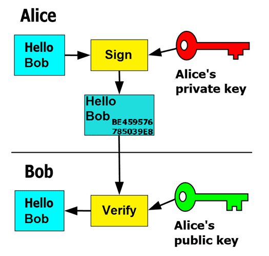

Поэтому репозитории и все пакеты в репозиториях подписываются специальным ключом. Этот ключ есть только у людей, которые добавляют пакеты в репозиторий, и называется приватным. Когда я хочу добавить чей-то репозиторий, владелец репозитория предоставляет мне другой ключ, этот ключ может быть на сайте репозитория, либо придти вместе с системой, т.е. он доступен всем, поэтому называется публичным. Так вот, разработчик подписывает репозиторий и пакеты приватным ключом и я, благодаря публичному ключу, могу убедиться, что это именно тот самый репозиторий или пакет. Если кто-то другой посередине подставит свой сервер, то он подпишет свой репозиторий другим приватным ключом, а значит я, благодаря другому публичному ключу, пойму, что это не тот сервер. Может по началу звучит сложно, но работает это довольно просто.

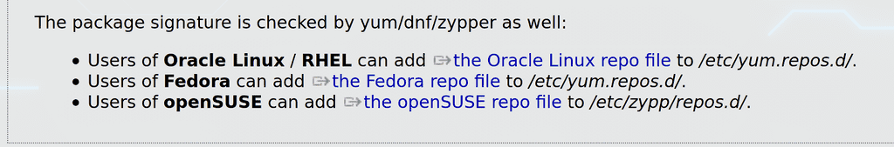

Добавим репозиторий VirtualBox-а. Идём на сайт virtualbox.org - Downloads - [Linux distributions](https://www.virtualbox.org/wiki/Linux_Downloads) - и спускаемся в самый низ. Находим строчку - Users of Oracle Linux/RHEL - и нажимаем по ссылке.

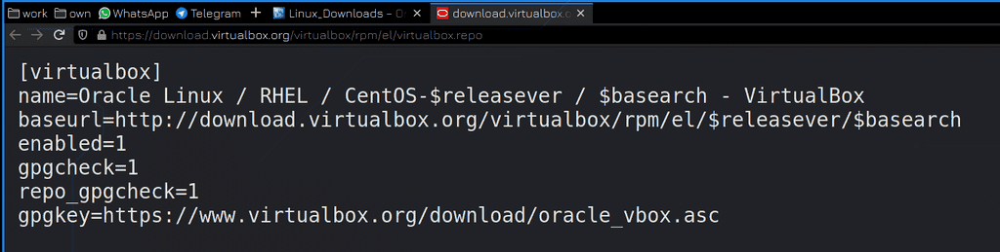

Нам откроется файл repo. По идее достаточно просто его скопировать в нужную директорию, но мы пойдём сложным путём, скопируем только ссылку.

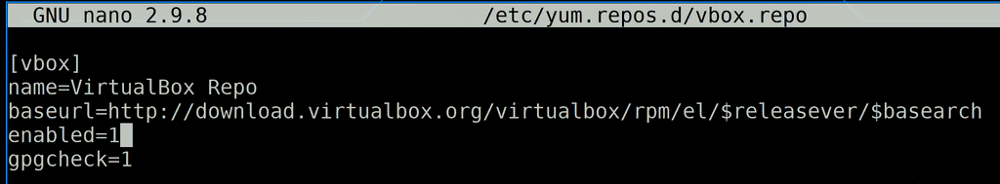

Создадим файл:

```
sudo nano /etc/yum.repos.d/vbox.repo
```

Зададим произвольные имена в квадратных скобках и name, вставим ссылку, добавим:

```
enabled=1
gpgcheck=1
```

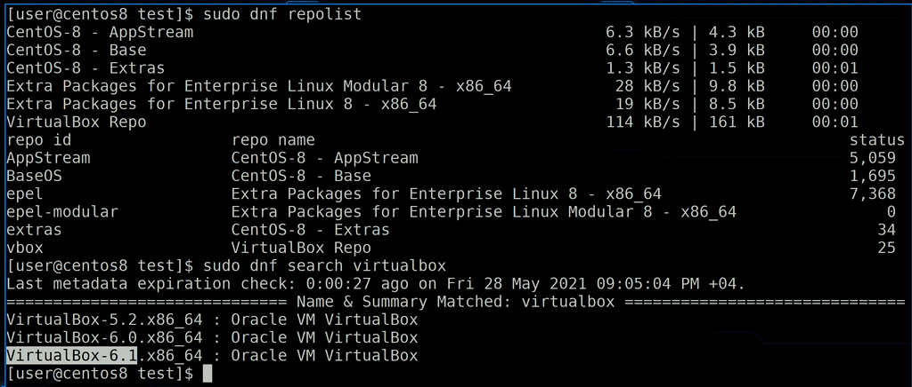

Посмотрим список репозиториев:

```
sudo dnf repolist
```

и в списке появился репозиторий vbox. Попробуем найти пакет virtualbox:

```
sudo dnf search virtualbox
```

И мы видим 3 подходящих пакета.

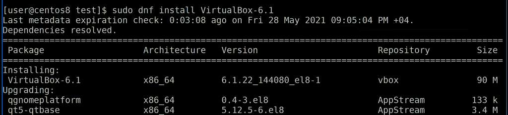

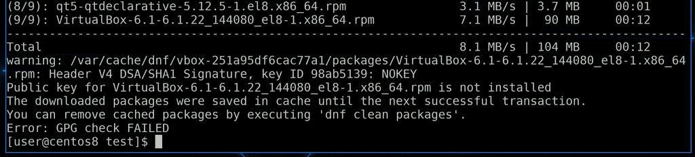

Попробуем установить пакет:

```
sudo dnf install VirtualBox-6.1
```

Установка запустилась, мы видим что этот пакет будет скачиваться с репозитория vbox, и видим все зависимости, которые подтягиваются с AppStream репозитория. Но как только дело дошло до установки пакета, dnf понял, что для virtualbox не установлен публичный ключ и остановил процесс.

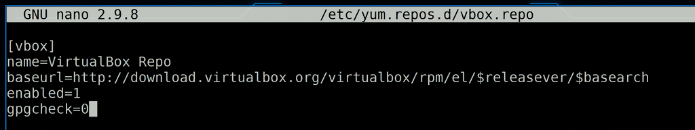

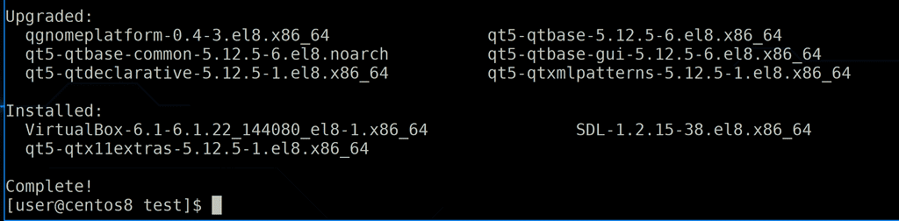

Мы можем отключить проверку пакетов или добавить ключ. Для интернет репозиториев отключать проверку не стоит, но в локальных иногда можно не заморачиваться с ключами. Попробуем отключить проверку - заходим в созданный файл:

```
sudo nano /etc/yum.repos.d/vbox.repo
```

и меняем ``` gpgcheck=0 ```. Затем заново запускаем установку.  И она проходит успешно.

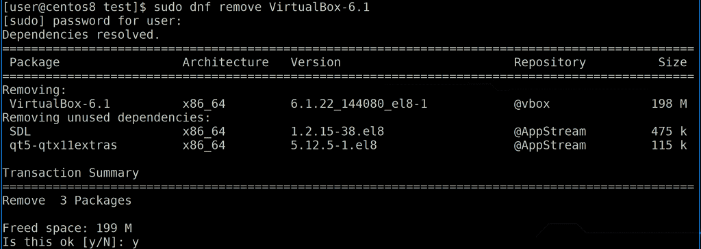

А для удаления пакета воспользуемся командой dnf remove:

```
sudo dnf remove VirtualBox-6.1
```

Теперь попробуем добавить ключ.


В том repo файле, который предложил virtualbox, в качестве ключа была предложена ссылка на файл на сайте виртуалбокса. Мы же, для большего понимания процесса, сделаем несколько иначе - скачаем ключ и добавим его в систему.

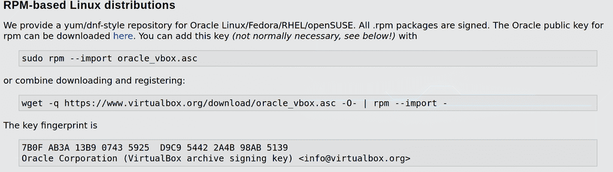

В предыдущей ссылке поднимемся чуть выше, где увидим команду:

```
rpm --import
```

Нам нужно скачать ключ, а потом импортнуть. Вторая команда делает это разом - wget скачивает файл с интернета, передаёт его через pipe команде rpm, которая импортирует. Можно сразу ввести эту команду, но для понимания разделим её на две части.

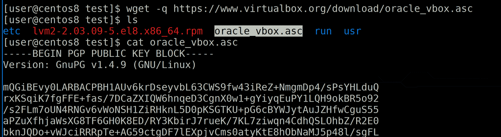

Для начала скачаем ключ:

```
wget -q https://www.virtualbox.org/download/oracle_vbox.asc
ls
```

Можем посмотреть содержимое ключа:

```
cat oracle_vbox.asc
```

Это текстовой файл, в котором большой набор символов.

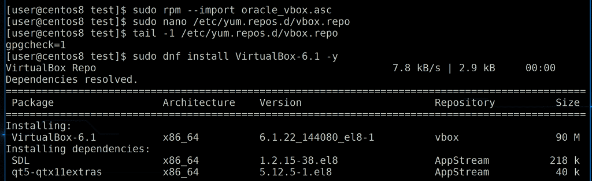

Теперь ключ нужно импортнуть:

```
sudo rpm --import oracle_vbox.asc
```

После этого не забудем заново включить проверку ключа:

```
sudo nano /etc/yum.repos.d/vbox.repo
```

``` gpgcheck=1 ```

И попробуем заново установить виртуалбокс:

```
sudo dnf install sudo dnf install VirtualBox-6.1 -y
```

На этот раз добавим ключ -y, чтобы он не спрашивал, уверены ли мы, что хотим установить. И снова установка прошла успешно.

Хорошо, с репозиториями разобрались. Но не для каждой программы есть репозиторий, и не каждый пакет есть в репозитории. Скажем, нам нужен определённый пакет, который есть в репозитории другого дистрибутива, либо в новой версии нашего дистрибутива. Но подключать их не стоит - пакетный менеджер может увидеть какие-то пакеты новее в другом дистрибутиве и попытаться обновиться. Тогда у нас часть пакетов обновится, часть останется и выйдет куча проблем с зависимостями. Поэтому надо стараться избегать использования сторонних репозиториев.

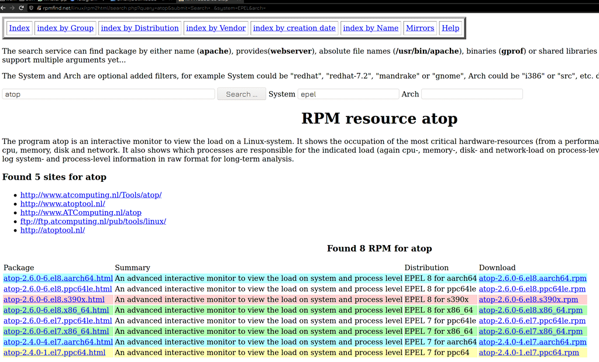

Попробуем найти как-то тестовый пакет и установить. Можно погуглить, либо зайти на сайт rpmfind.net и попытаться что-то найти. Например, atop. Найдём подходящую архитектуру - x86_64.rpm и скопируем ссылку под Download.

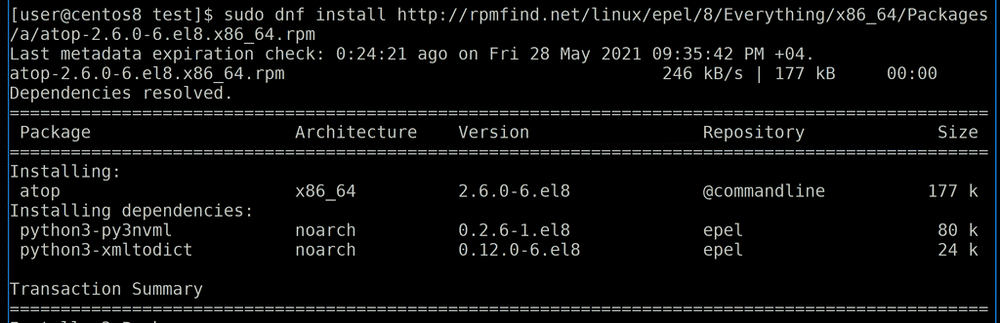

А дальше достаточно в командной строке прописать sudo dnf install и ссылку на rpm файл:

```
sudo dnf install http://rpmfind.net/linux/epel/8/Everything/x86_64/Packages/a/atop-2.6.0-6.el8.x86_64.rpm
```

dnf сам скачает этот файл, найдёт для него зависимости и установит пакет. Обратите внимание, как dnf в качестве репозитория для этого файла указал @commandline.

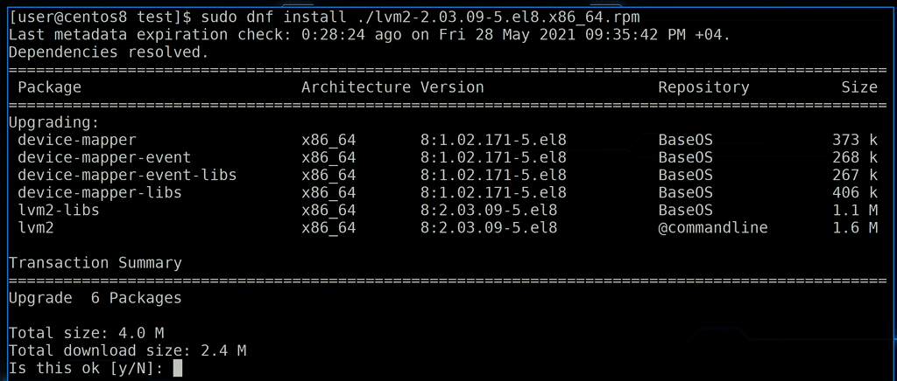

По похожему принципу можно установить скачанный файл - sudo dnf install и указать на файл:

```
sudo dnf install ./lvm2-2.03.09-5.el8.x86_64.rpm
```

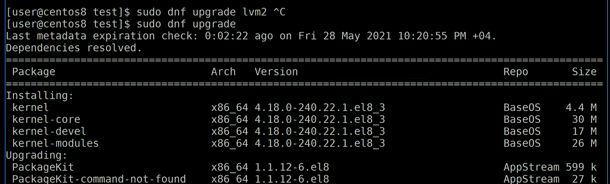

Касательно установки программ разобрались, теперь насчёт обновления.  Проверить наличие обновлений можно с помощью:

```
dnf check-upgrade
```

Обновлять программы можно с помощью:

```
sudo dnf upgrade
```

Если указать после команды определённый пакет, то обновится только он и его зависимости. Если же ничего не указывать, то обновится вся система.

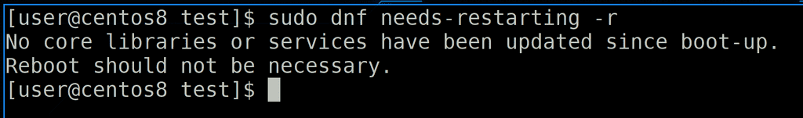

После некоторых обновлений следует делать перезагрузку, но не после всех, поэтому вы можете быть неуверенны, а нужно ли? Можно воспользоваться командой:

```
sudo dnf needs-restarting -r
```

она подскажет.

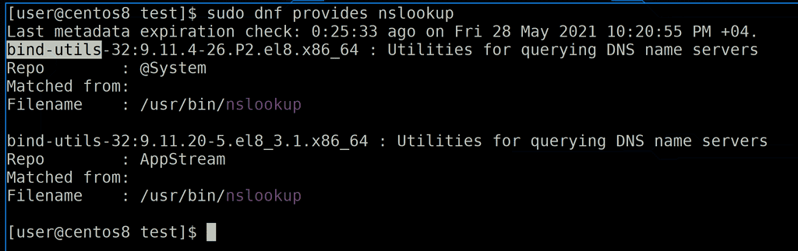

Иногда бывает, что вы помните название программы, но не знаете, в каком именно пакете она находится. К примеру, вы можете помнить команду nslookup, но не знать про название пакета. И пусть даже не команда, а конфиг файл, библиотека или любой файл программы. dnf provides позволяет найти имя пакета, в котором содержится нужный файл: 

```
sudo dnf provides nslookup
```

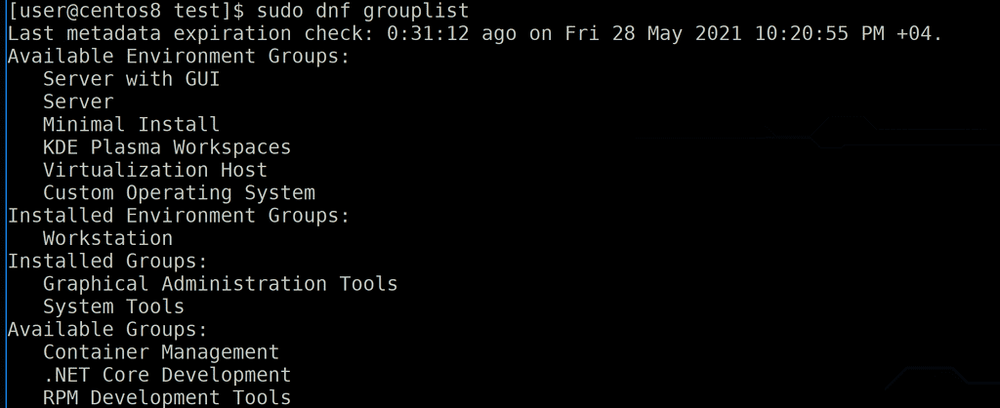

Для удобства некоторые пакеты, которые часто используют вместе, объединены в группы. Посмотреть список доступных групп можно с помощью dnf grouplist:

```
sudo dnf grouplist
```

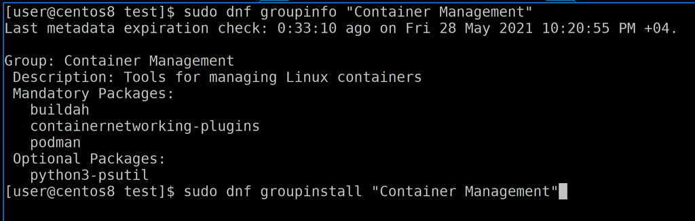

С помощью groupinfo можно понять, какие пакеты входят в группу, а с помощью groupinstall установить все эти пакеты:

```
dnf groupinfo "Containter Management"
sudo dnf groupinstall "Containter Management"
```

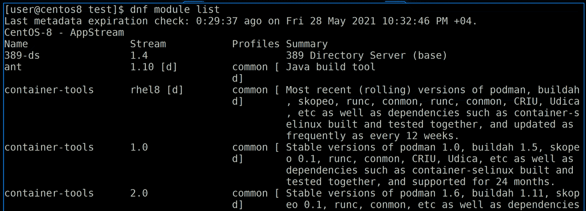

Помимо групп есть модули: 

```
sudo dnf module list
```

Модули, как и группы, содержат сразу несколько пакетов. Но при этом пакеты в модулях связаны версиями. Обратите внимание, есть несколько модулей container-tools, и в одной версии используются самые актуальные версии пакетов, а в других используется более старая версия пакетов, при этом учтены зависимости и они также не самые свежие.

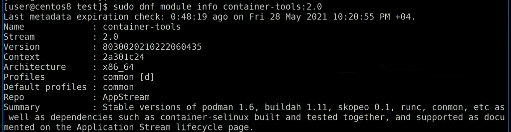

Более детально узнать о каком-то модуле можно с помощью:

```
dnf module info
```

указав при этом нужный модуль и его версию:

```
sudo dnf module info container-tools:2.0
```

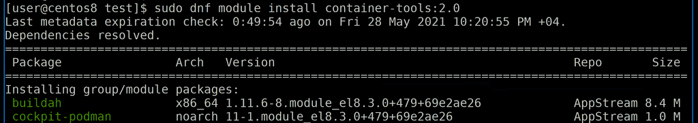

Ну а для установки, соответственно, dnf module install с нужным модулем и версией:

```
sudo dnf module install container-tools:2.0
```

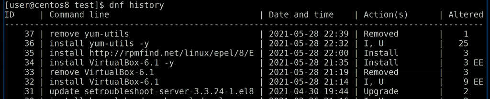

Кроме этого dnf хранит историю всех операций:

```
dnf history
```

В этой истории у каждой операции есть номера, для примера возьмём 32.

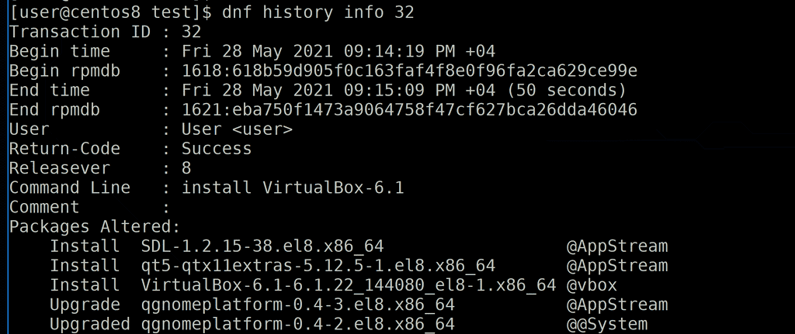

Мы можем детальнее узнать про эту операцию, указав history info 32:

```
dnf history info 32
```

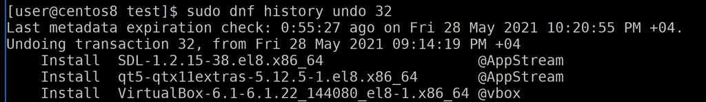

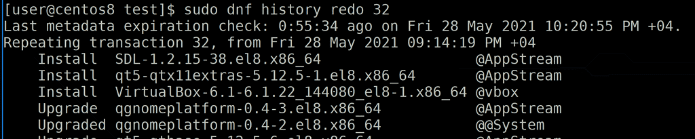

Ну и проделанные операции можно отменить или заново применить, с помощью dnf history undo или dnf history redo:

```
sudo dnf history undo 32
sudo dnf history redo 32
```

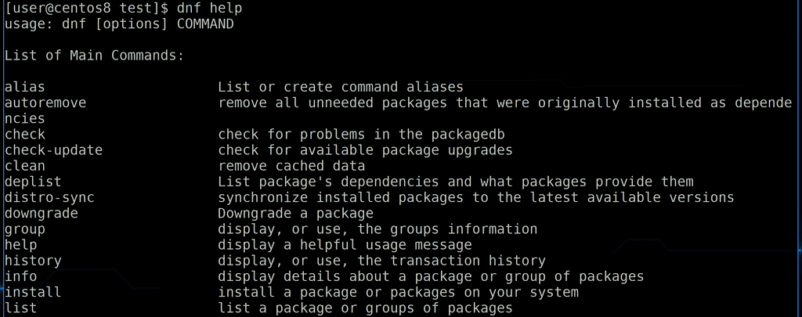

У dnf огромное количество различных возможностей и все я разобрать не смогу:

```
sudo dnf help
```

С каким-то функционалом вы познакомитесь со временем, а какой-то вы ни разу и не используется. Но есть документация и, если вам что-то понадобится уточнить, скорее всего в ней вы сможете найти ответ.

Подведём итоги. Сегодня мы с вами разобрали, что такое пакеты, чем занимаются пакетные менеджеры, поговорили о репозиториях и разобрали базовые команды для работы с dnf. Теперь вы знаете, как устанавливать программы, откуда их брать, как обновлять систему и как это всё работает.