# 51. Оптимизация производительности - tuned

<iframe width='560' height='315' src="https://www.youtube.com/embed/o0XpEBzxr0A" title='YouTube video player' frameborder='0' allow='accelerometer; autoplay; clipboard-write; encrypted-media; gyroscope; picture-in-picture' allowfullscreen></iframe>

Мы с вами разобрали виртуальную память и планировщик процессов, за работу которых отвечает ядро операционной системы. Знаем, что если поменять параметр swappiness, можно задать насколько сильно будет задействован swap, а это влияет на  производительность. Также мы говорили, что ядро отвечает за работу с устройствами посредством драйверов. Возможно вы знаете, что у различного оборудования, например, процессора, бывают различные режимы работы - энергосберегающий или режим высокой производительности. Сетевой адаптер может поддерживать различные скорости работы, скажем, 100Мбит или 1Гбит, и в зависимости от этого потребляет меньше или больше энергии. Это и многое другое можно настроить посредством изменения параметров ядра, а также специальных утилит.

Когда у вас одна система, вы можете это сделать и вручную, но для этого придётся изучить немало документации. На работе же у вас может быть множество систем и совсем мало времени на детальную настройку производительности. В большинстве случаев многие и не заботятся о производительности, так как расчёт на оборудование изначально берётся с запасом.

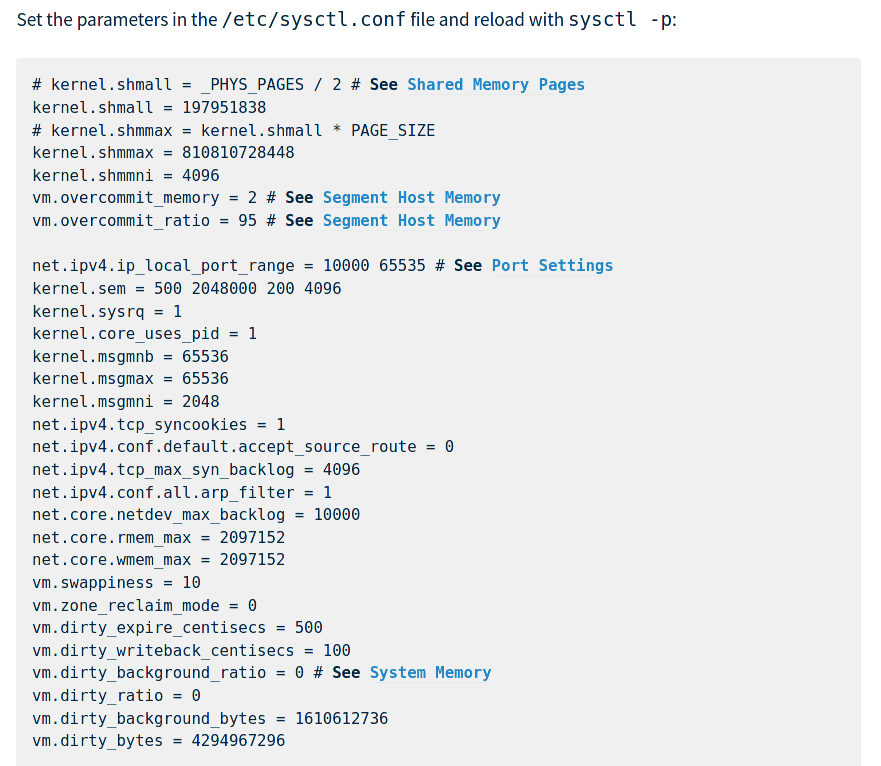

Правда на высокопроизводительных системах всё же нужно менять параметры ядра, иначе можно столкнуться с проблемами с процессами, сетью, памятью и прочим. Но, обычно, в документации требуемого софта упоминаются необходимые параметры. По [ссылке](https://docs.greenplum.org/6-8/install_guide/prep_os.html) вы можете посмотреть пример, как производитель софта рекомендует рассчитать и выставить определённые параметры. Однако это специфичные настройки для определённой программы. Не для всех программ есть такие детальные рекомендации.

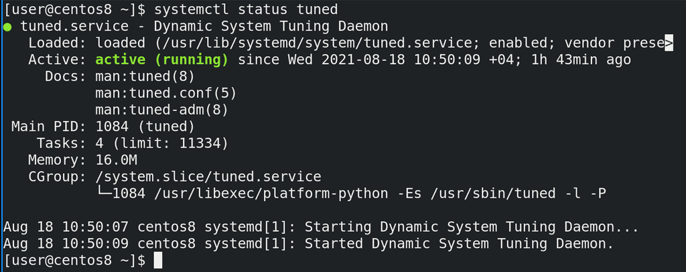

Если вы задумываетесь об оптимизации производительности в ваших системах, вам может помочь демон tuned:

```
systemctl status tuned
```

Он может быть полезен как для тех,
кто совсем не разбирается в этой теме, так и для тех, кто знает что к чему. Если вкратце, tuned предоставляет готовые профили, в которых указаны нужные для производительности параметры, а также даёт возможность создать свои профили. Если вы не разбираетесь в теме, вы можете одной командой повысить производительность в разумных пределах, если же разбираетесь, то можете настроить свои профили, закинуть их на все сервера и в итоге это всё будет управляться демоном и готовым инструментом. Но обо всём по порядку.

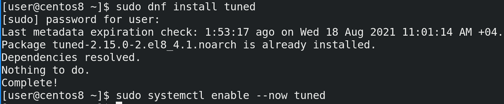

tuned обычно предустановлен, но его может и не быть. Если статус показывает, что этого сервиса нет, то вам нужно его предварительно установить, запустить и добавить в автозапуск:

```
sudo dnf install tuned
sudo systemctl enable --now tuned  
```

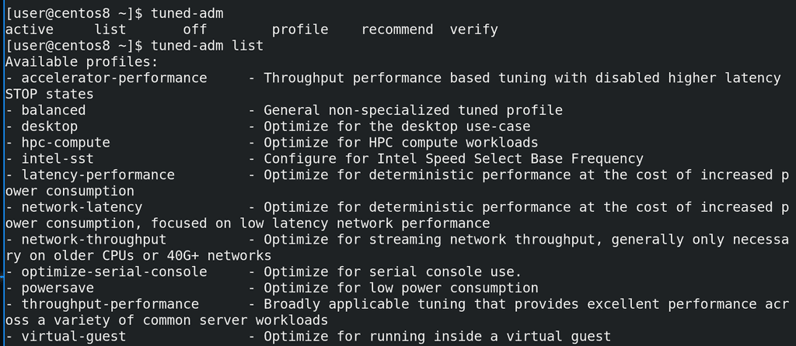

Основная утилита для работы с tuned это tuned-adm. Она очень простая и опций довольно мало. Начнём с опции list:

```
tuned-adm list
```

Она показывает все профили. Так как мы своего профиля не создавали, нам отображаются шаблонные профили и их описания. Например:

- desktop - оптимизированный под пользовательские компьютеры
- powersave - оптимизированный под низкое энергопотребление

Многие профили нацелены на высокую производительность сети и процессора при большем потреблении энергии.

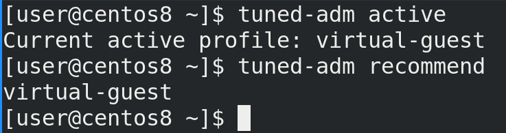

Узнать текущий профиль можно с помощью опции active:

```
tuned-adm active
```

Как видите, сейчас профилем является virtual-guest. tuned при установке пытается выбрать более подходящий профиль. Он определил, что мы устанавливаем систему как виртуалку, поэтому выбрал готовый профиль для виртуальных машин.

Также tuned может порекомендовать один из шаблонных профилей:

```
tuned-adm recommend
```

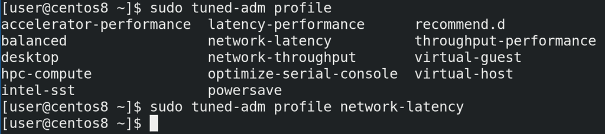

Поменять его можно с помощью опции profile, указав нужный профиль:

```
sudo tuned-adm profile network-latency
```

Для примера выберем профиль с низкой задержкой в сети.

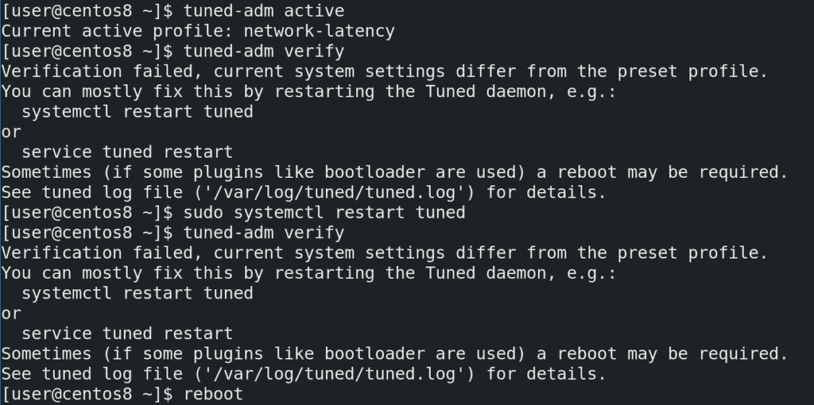

Но зачастую этого недостаточно. Некоторые изменения требует перезапуска сервиса или всей системы. Убедимся, что у нас выбран нужный профиль с помощью active. После чего можно использовать опцию verify - она проверит, насколько применился профиль и подскажет, если что-то не так. В нашем случае мы видим, что verify выдал ошибку - какие-то текущие параметры отличаются от заданных в профиле. Также нам подсказали, что многие проблемы можно решить перезапуском демона. Но и это нам не помогло - verify снова жалуется. Т.е. в нашем случае нужно перезагрузить систему.

```
tuned-adm active
tuned-adm verify
sudo systemctl restart tuned
tuned-adm verify
reboot
```

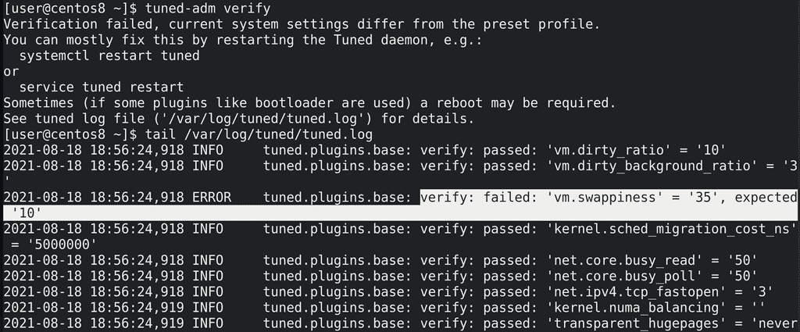

Проверим:

```
tuned-adm verify
```

ошибка осталась. Но снизу есть подсказка, что стоит проверить лог файл. Проверим:

```
tail /var/log/tuned/tuned.log
```

и тут видно, что значение параметра ``` vm.swappiness ``` - 35, а должно быть 10. Помните, мы его вручную прописывали в файле? Видимо сейчас он перебивает значение, задаваемое tuned.

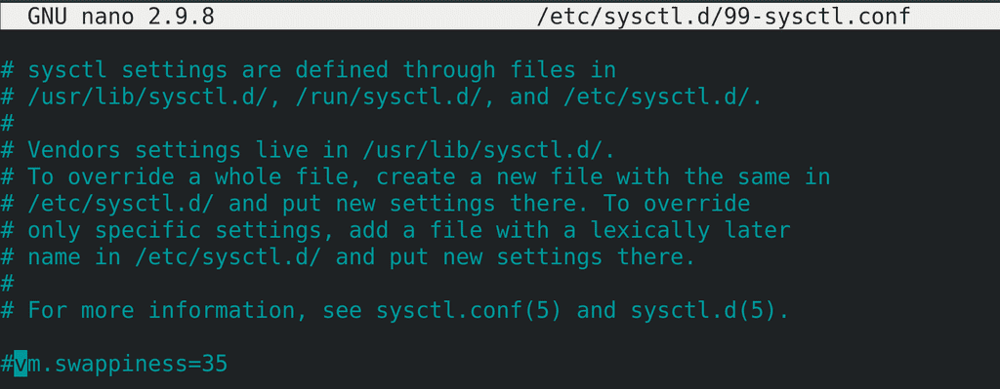

Давайте закомментируем нашу строчку в ``` /etc/sysctl.d/99-sysctl.conf ```.

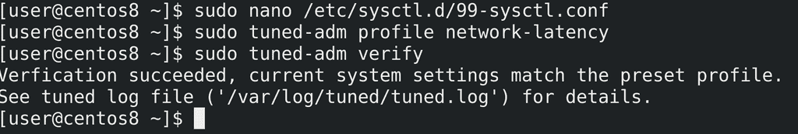

После чего переактивируем профиль, чтобы он перезаписал этот параметр. Ещё раз проверим verify - всё как надо.

```
sudo tuned-adm profile network-latency
tuned-adm verify
```

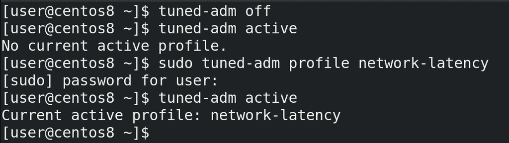

Чтобы в целом выключить tuned надо отключать сам сервис с помощью systemd. Если нужно временно вырубить профиль, то можно использовать опцию off. А чтобы вернуть обратно, достаточно заново активировать профиль:

```
tuned-adm off
tuned-adm active
tuned-adm profile network-latency
tuned-adm active
```  

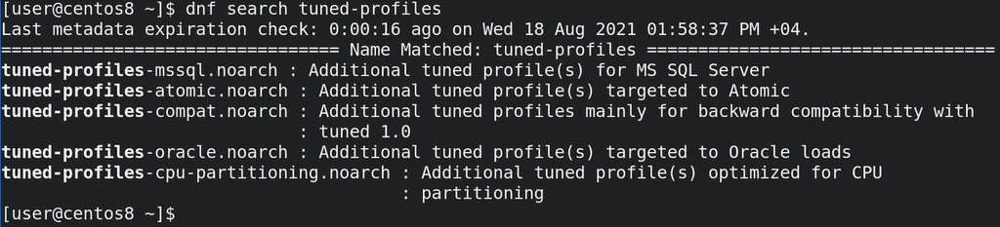

Кроме предустановленных профилей также в репозиториях можно найти и установить другие:

```
dnf search tuned-profiles
```

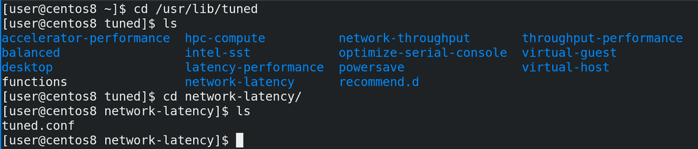

Дефолтные профили лежат в директории ``` /usr/lib/tuned ```. Здесь директории соответствуют названиям профилей, а внутри каждой директории есть свой файл tuned.conf, где и находятся сами параметры.

```
cd /usr/lib/tuned/network-latency
cat tuned.conf
```

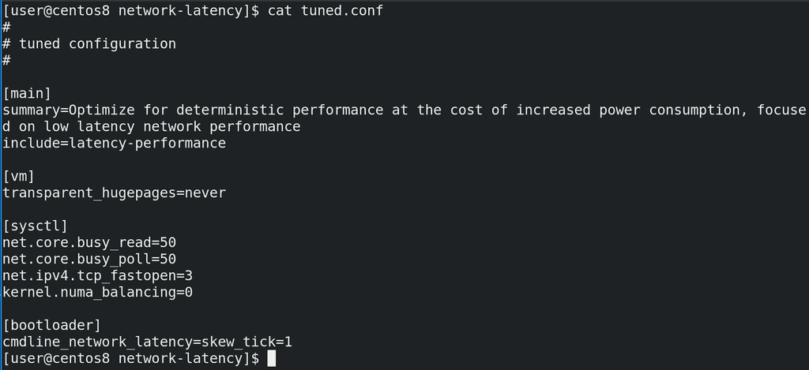

Сам файл состоит из нескольких секций. В секции main мы видим описание профиля в опции summary, а также опцию include - она указывает, что в данном профиле также используются настройки из профиля latency-performance. Т.е. можно не с нуля писать профиль, а взять готовый и приписать ему ещё пару параметров.

Следующие секции это плагины. Дело в том, что различные настройки производительности нужно прописывать в различных местах - где-то нужно в загрузчике добавить, где-то нужно поменять параметр ядра через sysctl, где-то через другие файлы. tuned профиль просто объединяет всё это в одном месте. Кроме перечисленных, есть ещё плагины для задания параметров процессора, диска, сети, сервисов, селинукс, запуск скриптов и т.п.  

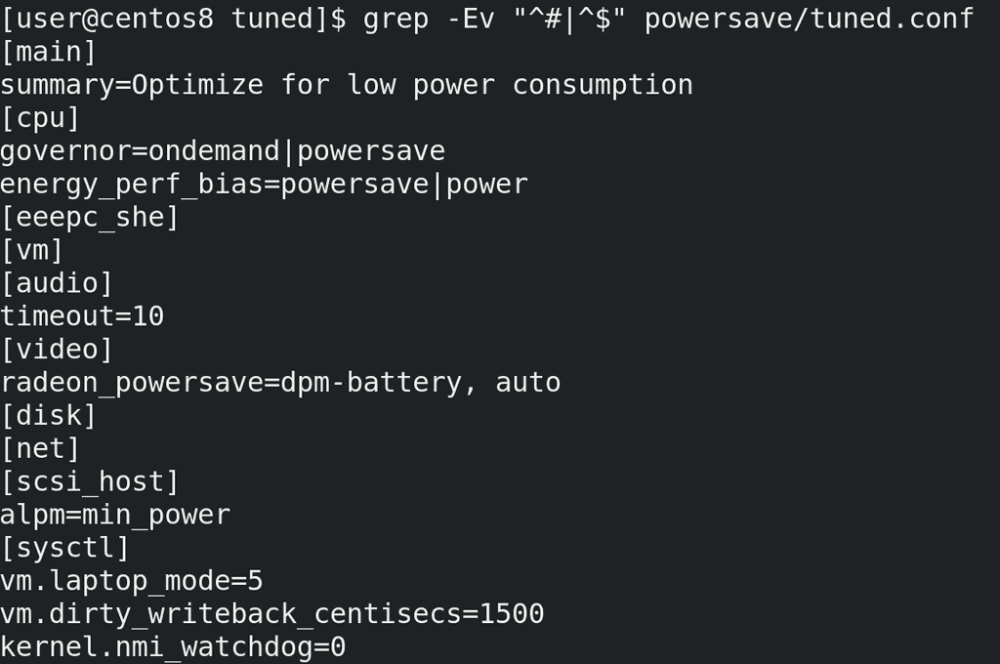

Для примера посмотрим ещё powersave профиль, так как там задействовано много плагинов:

```
cd ..
grep -Ev "^#|^$" powersave/tuned.conf
```

Так как параметры специфичны для плагинов, а они охватывают различные файлы и утилиты, нет какой-то единой документации, где бы показывались всевозможные опции и объяснения для всех параметров.

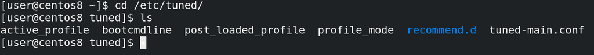

По примеру многих утилит, если дефолтные профили лежат в директории /usr/lib/tuned, то свои кастомные можно создать в директории /etc/tuned. Нужно создать директорию с именем профиля, а внутри файл tuned.conf. Но я этого делать не буду, нам пока нет смысла создавать свои профили.

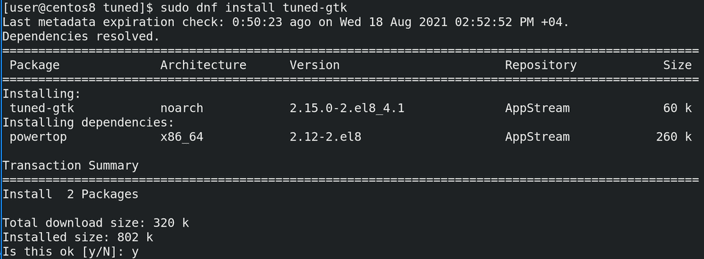

Кстати, tuned можно настраивать и через графическое приложение, но для этого надо доустановить пакет.

```
sudo dnf install tuned-gtk
```

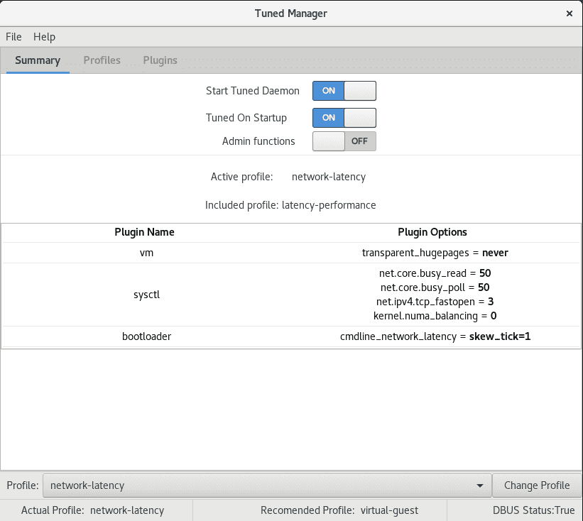

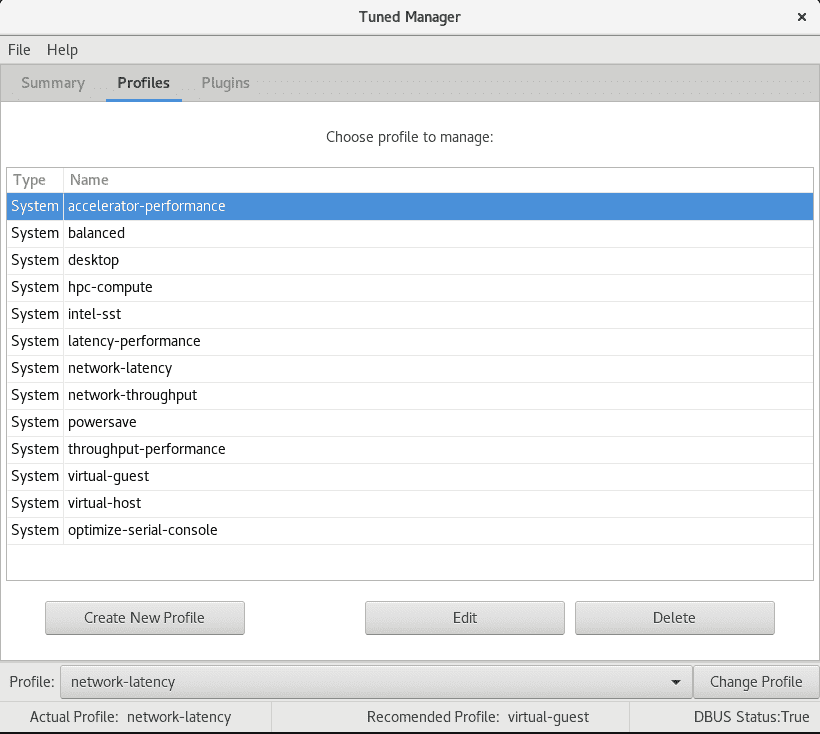

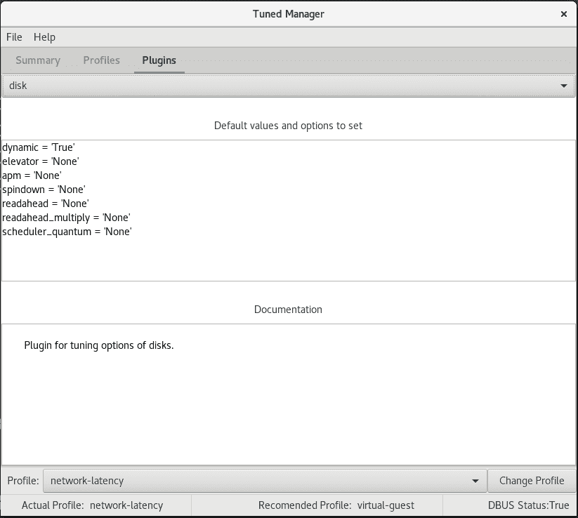

Из этого приложения можно как управлять самим tuned, так и настраивать кастомные профили.

Ну и одна из интересных фишек tuned - динамическая оптимизация. Всё что мы настраивали до этого применяется и работает постоянно. Скажем, мы выбрали, чтобы производительность сети была высокой, а значит она всегда будет такой, независимо от того, есть в этом необходимость или нет. Однако tuned умеет это делать динамически. Т.е., допустим, когда вы запускаете компьютер, скорость диска должна быть высокой, чтобы перенести кучу данных в оперативку. Однако потом диску не нужна такая скорость и при обычной работе данные пишутся и считываются относительно реже. Или, допустим, у вас сетевая карта на домашнем компьютере большую часть времени простаивает или используется очень слабо, скажем, для просмотра веб страниц. И лишь изредка вам нужно скачать что-то большое. Вместо того, чтобы постоянно использовать вашу сетевую карту на максимум, почему бы не делать это только тогда, когда есть необходимость?

Но, как мы уже разбирали, не все опции можно так легко переключать. Что-то можно изменить на лету, а что-то сработает только после перезагрузки. Динамическая оптимизация не касается всего, её можно настроить для определённых плагинов. И в основном она годится для рабочих станций, а не для серверов.

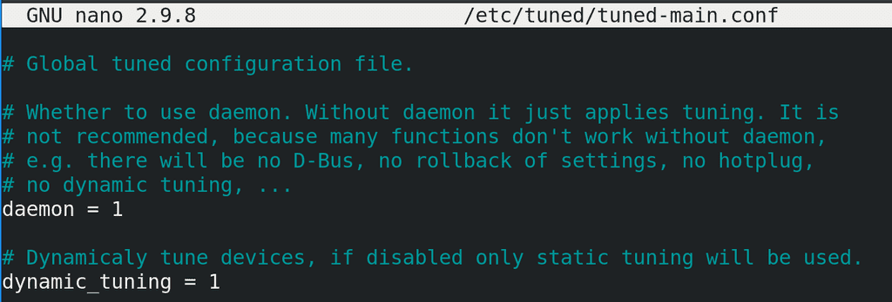

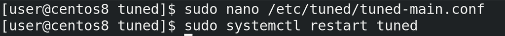

По умолчанию она выключена, и, чтобы её применить, надо в файле ``` /etc/tuned/tuned-main.conf ``` поменять значение параметра ``` dynamic_tuning ``` на 1, после чего рестартнуть демон tuned.

Подведём итоги. Сегодня мы с вами разобрали демон tuned, который облегчает настройку производительности и позволяет централизовано хранить все необходимые параметры в одном файле. Стандартные профили позволяют вам очень просто улучшить производительность, а возможность создавать свои профили позволяет профессионалам упростить работу, создавая шаблоны для разного рода серверов.