# 64. Про сертификацию RHCSA

<iframe width='560' height='315' src="https://www.youtube.com/embed/EPtSZgvxRqA" title='YouTube video player' frameborder='0' allow='accelerometer; autoplay; clipboard-write; encrypted-media; gyroscope; picture-in-picture' allowfullscreen></iframe>

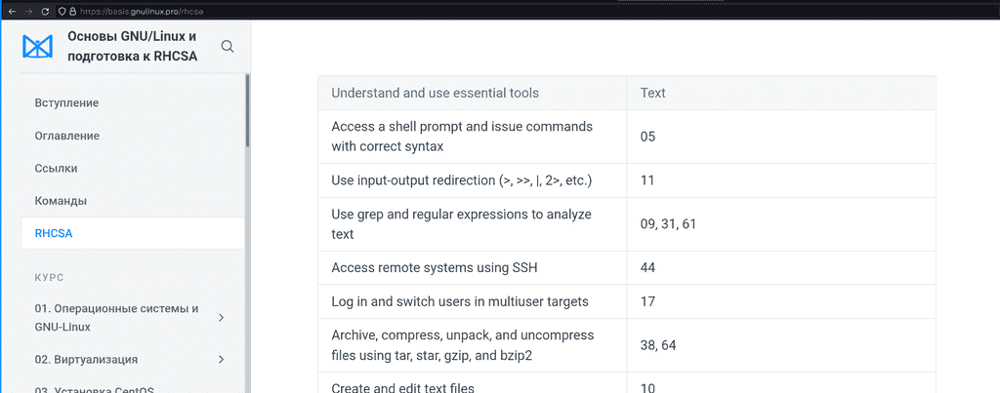

Хотя изначальная идея курса была в подготовке к сертификации по RHCSA, но ещё до первой темы я решил, что если уж и делать курс с простыми темами, то лучше сразу делать его для начинающих и затрагивать все основы работы с GNU/Linux. Ну а подготовка к экзамену осталась как путеводитель, как доказательство того, что этот курс привёл нас к каким-то ощутимым результатам. И что теперь у нас хватает знаний для получения сертификата, признанного во всём мире, показывающего, что мы можем администрировать Red Hat Enterprise Linux. Этих знаний хватит для начала работы младшим специалистом и они дадут фундамент для дальнейшего роста. 

Но на этом данный курс не закончится, я буду продолжать добавлять в него новые темы. Но и не думаю, что в принципе хоть как-то можно завершить курс, потому что тема основ бесконечная. Давайте лучше поговорим про сертификацию.

Один из частозадаваемых вопросов:

>> Нужна ли мне сертификация? Что она мне даст?
>
> Суть не в том, что вы пойдёте и сдадите экзамен. Вы этого можете не делать, это не так важно. Главное - подготовка к нему, получение знаний. Когда вы не знаете какую-то тему, скажем, как администрировать линукс, вам очень сложно понять, а что именно нужно изучать и какой уровень знаний считается достаточным и общепринятым. И вот крупнейшая компания даёт перечень тем, которые считает необходимыми для понимания. На самом деле этот список можно оспорить, каких-то тем не хватает, какие-то темы можно выкинуть, но в целом указаны почти все важные темы для уровня младшего специалиста. Что даёт вам сертификация? Понимание, в каком направлении двигаться. Экзамен лишь доказательство того, что вы этот путь прошли. Но вам не обязательно кому-то это доказывать.
> Экзамен стоит немало денег, несколько сотен долларов. Некоторые компании оплачивают экзамены за сотрудников, поэтому мой совет - если у вас нет работы, не нужно тратиться на сам экзамен. Экзамен даст вам бумажку, возможно, это чуть улучшит ваше резюме, но это далеко не решающий фактор и адекватный работодатель будет оценивать по уровню знаний, а не по бумажкам. А вот если вы работаете, если компания готова оплатить вам экзамен - то да, стоит его сдать. Вам это обойдётся бесплатно, а ваш работодатель может чуть поднять вам зарплату, ну или по крайней мере ваше CV станет чуточку лучше.

Другой вопрос:

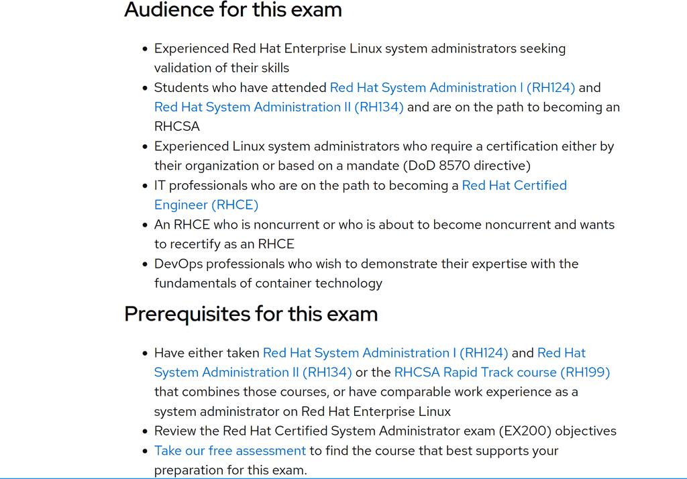

>> Для кого предназначена сертификация, кому стоит идти и сдавать экзамен?
>
> В идеале - для младших линукс администраторов, которые отработали год, набрались знаний, практики и решили их доказать. А также для тех, кто раньше работал Windows администратором, а потом решил изучить администрирование Linux-ов. В общем, для людей, у которых есть небольшой опыт за плечами.
> Но я нередко вижу, что на экзамен идут люди, которые только хотят устроиться на свою первую работу, мол, сертификат поможет с устройством на работу. 


>> Что из себя представляет экзамен?
>
> Экзамен практический, т.е. вам дадут компьютер и задания. Всё будет на английском, поэтому нужно уметь читать и понимать задания. У вас не будет интернета, но будет системная документация, т.е. man будет работать. Какого рода будут задания нельзя разглашать, но все темы есть на сайте. Вы можете выполнять задания любыми способами - хоть через терминал, хоть через графический интерфейс, хоть через веб. По итогу всякие скрипты проверят именно результат. И самое главное - проверка будет после перезагрузки, т.е. ваша система после всего должна запуститься и ваши изменения должны в ней остаться. Экзамен длится 3 часа, но времени хватает впритык. Скажем, если вы уверенно будете делать без всяких затыков все задания, у вас останется максимум минут 30-40. Естественно, не всё будет гладко, поэтому это лишнее время вам пригодится. Максимальный балл - 300, а проходный - 210, т.е. где-то пару заданий вы можете не выполнить, но старайтесь делать всё, мало ли где-то будут ошибки.

>> Какие советы по экзамену?
>
> Во-первых, когда вам дадут задания, прочтите их все и суммируйте для себя. Некоторые задания могут быть связаны с другими и если вы тупо будете делать их по порядку - то в какой-то момент вам придётся всё переделывать, а на это нет времени. Во-вторых, начните с тем, которые могут повлиять на запуск системы. Скажем, работа с дисками и файловыми системами. Если вы всё испортите в начале, будет время всё исправить. Если же вы всё испортите сделав половину заданий, у вас не хватит времени всё восстановить. В-третьих, периодически, раз в пару заданий, перезагружайте систему для проверки и убежайтесь, что есть результат выполненных заданий. Да, это отнимает время, но будет легче понять и сразу исправить ошибку. Ну и самое главное - не нервничайте. После экзамена никто вас не побьёт, никто ничего плохого с вами не сделает. Максимум вы потеряете деньги, а это печально. Лучше замените волнения и переживания на печаль по деньгам, так будет проще сконцентрироваться на заданиях и быть более сосредоточенным. 

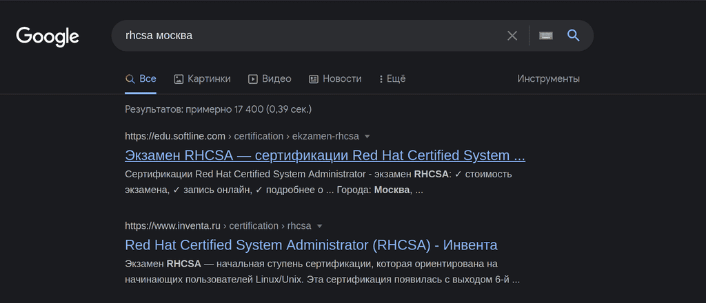

>> Где сдавать экзамен?
>
> Сейчас есть 2 варианта сдать - оффлайн и онлайн. Оффлайн проводится у партнёров компании Red Hat в разных городах и разных компаниях, поэтому просто наберите в гугле "RHCSA" и ваш город. Там же можно найти или спросить цены. Обычно перед датами экзамена эти компании также проводят быстрые тренинги по поготовке к экзамену. Обычно это занимает неделю или две на полный рабочий день, т.е. некоторые компании оплачивают сотрудникам подобные курсы. Эти курсы не гарантия, что вы сдадите экзамен, но если у вас есть опыт и знания, курсы помогут вам закрыть пробелы перед экзаменом. 

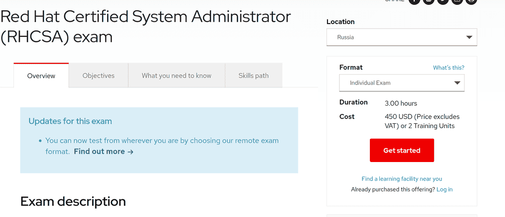

> Онлайн экзамен можно заказать на официальном сайте редхата, он выходит дороже, но вы сдаёте его дома. Там есть процедура, что нужно подготовить комнату, загрузочную флешку и прочее. Весь экзамен за вами будут следить с камеры. На мой взгляд, лучше сдавать оффлайн, потому что всякие обрывы в сети и нестабильное соединение могут сильно подпортить вам нервы, а если будете сдавать очно, то за работу всего отвечает компания-организатор. И даже если что-то пойдёт не так, отвечать будет организатор.


>> А как готовиться к экзамену? Твоего курса хватает для сдачи?
>
> Да, я изначально поставил себе цель сделать полный курс, которого хватит для сдачи экзамена. Сейчас в нём не хватает практических заданий и лабораторных, но я над этим работаю. По [ссылке](https://basis.gnulinux.pro/rhcsa) вы можете увидеть, какие темы экзамена в каких уроках разобраны, но я советую посмотреть весь курс для полного понимания. Если вы посмотрите весь курс, ответите на вопросы, сделаете задания и лабораторные - то этого хватит. Для начинающих я бы посоветовал параллельно смотреть какой-то другой курс, потому что вы где-то можете не так понять, что я имею ввиду, а обрабатывая информацию с нескольких источников вы лучше её усваиваете. В любом случае, вы можете задавать вопросы в телеграмм группе.

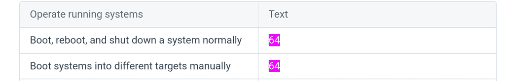

Но есть пара тем, которые остались в сторонке, это пара простых команд, которые я разберу прямо сейчас. Если вы не смотрели курс, то можете пропустить эту часть. 

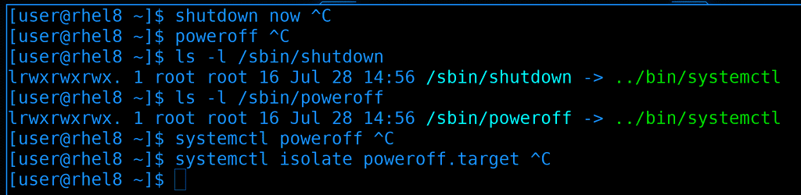

Как правильно выключать компьютер? Есть пара команд:

```
shutdown now
poweroff
```

Может где-то на старых юниксовых системах эти команды делали разные вещи, но в современных системах, по крайней мере там где systemd, они делают одно и тоже и являются просто символическими ссылками на systemctl:

```
ls -l /sbin/shutdown
ls -l /sbin/poweroff
```

Также для выключения можно использовать сам systemctl:

```
systemctl poweroff
```

На самом же деле выполняется команда 

```
systemctl isolate poweroff.target
```

Мы с вами и systemd и таргеты проходили, поэтому не буду на этом акцентировать внимание. Ну, в общем, можно использовать любую из команд.

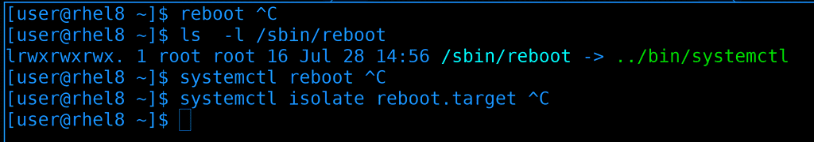

Тоже самое касается перезагрузки, есть команда reboot:

```
reboot
```

которая на самом деле является символической ссылкой на systemctl:

```
ls  -l /sbin/reboot
```

Можно дать перезагрузку через systemctl:

```
systemctl reboot
```

А на самом деле выполняется reboot таргет:

```
systemctl isolate reboot.target
```

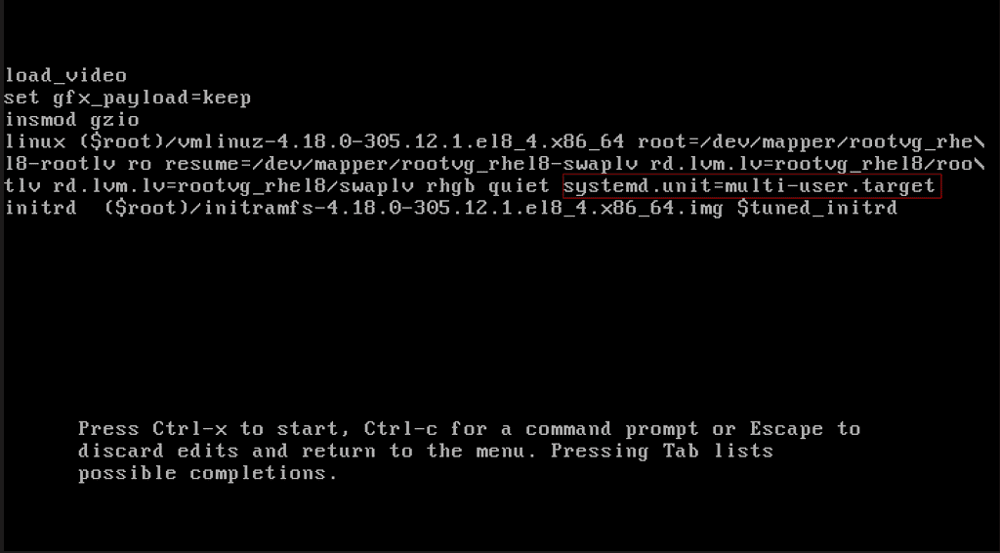

Теперь про загрузку системы в разные таргеты вручную. Тут нужно редактировать grub, мы это умеем. Просто в строке ядра надо прописать опцию systemd.unit с нужным таргетом, например, multi-user:

``` systemd.unit=multi-user.target ```

Или rescue.target:

``` systemd.unit=rescue.target ```

После чего надо нажать Ctrl+X. Система так загрузится только раз, а после перезагрузки будет как раньше. Как менять таргет навсегда мы разбирали в 34 теме.

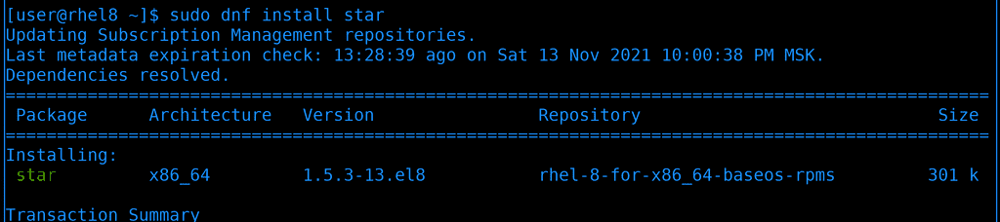

Ну и последнее - утилита star. Это такой же архиватор, как tar, только чуть быстрее и есть дополнительный функционал. Для начала установим её:

```
sudo dnf install star
```

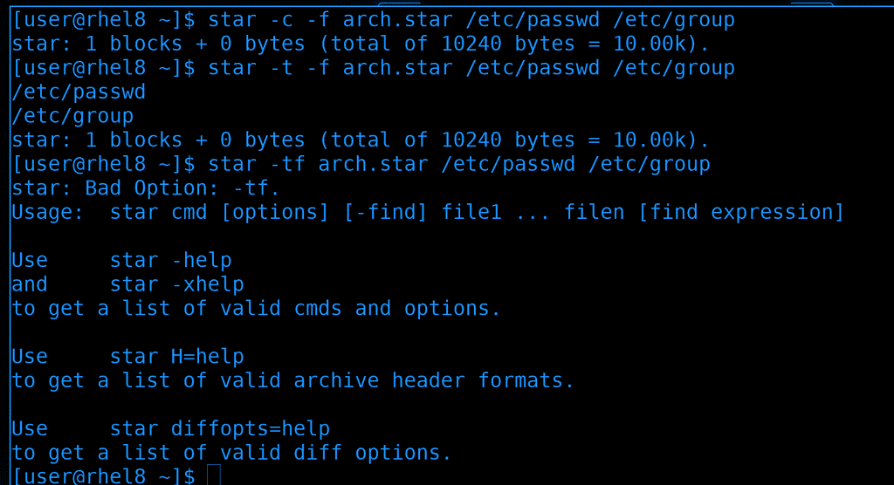

Синтаксис похож на тот же tar:

```
star -c -f arch.star /etc/passwd /etc/group
star -t -f arch.star /etc/passwd /etc/group
```

разве что ключи слитно не работают:

```
star -cf arch.star /etc/passwd /etc/group
```

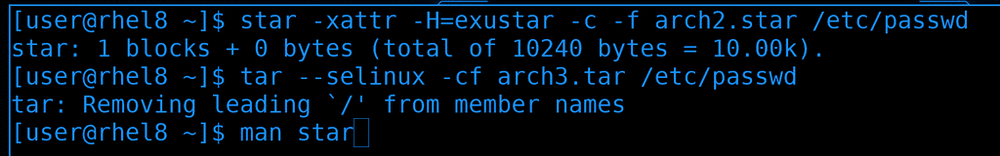

Насколько я понимаю, раньше tar не мог работать с selinux, т.е. при архивации не сохранялся контекст файлов. Этот функционал был в star и поэтому Red Hat требовали знания этой утилиты. Но, честно говоря, синтаксис для сохранения контекста довольно мудрёный:

```
star -xattr -H=exustar -c -f arch2.star /etc/passwd
```

Сейчас же tar также поддерживает сохранение контекста и в нём это сделано попроще, просто добавляем опцию --selinux при архивации и разархивации:

```
tar --selinux -cf arch3.tar /etc/passwd
```

Ну и больше примеров использования star вы можете найти в документации:

```
man star
```

Я не буду вдаваться в подробности этой утилиты, потому что она довольно специфична и я ни разу не встречал практического применения. Просто показал, потому что она прописана в темах экзамена.

Если вы собираетесь сдавать экзамен - удачи вам! Будет интересно послушать комментарии тех, кто уже сдал, да и в целом любые комментарии. Пишите, что думаете о курсе, что вам нравится, что не нравится, вопросы и советы другим. На этом тему подготовки к сертификации можно считать закрытой.