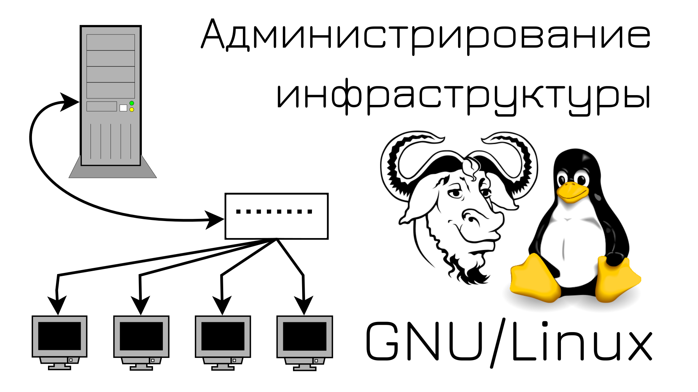
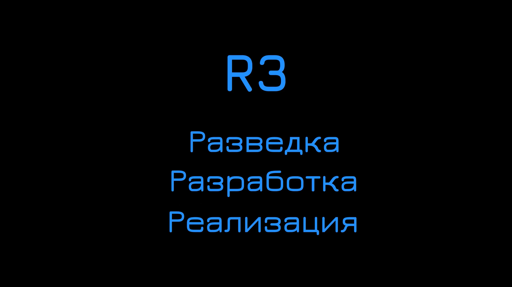

## Курс: Основы GNU/Linux и подготовка к RHCSA

[В видеоформате](https://youtube.com/playlist?list=PLisqB92_b4TlQH3jVGf6lrFMVqalCTjAQ)

[В виде книги](https://basis.gnulinux.pro)

Чтобы сохранить книгу, нажмите "Read the docs" в левом нижнем углу и выберите формат (PDF, HTML или Epub).

Книга собирается из [Github](https://github.com/gnulinuxpro/basis/) репозитория.

Также там доступен [torrent файл](https://github.com/gnulinuxpro/basis/blob/master/basis.torrent), чтобы скачать весь курс, включая видео.

[Телеграмм группа](https://t.me/gnuslashlinux) для вопросов и общения.

Если заметите опечатки/ошибки, а также если у вас будут вопросы и предложения - можете открывать issue или писать в телеграмме.

Та часть курса, которая касалась подготовки к сертификации, окончена. Дальше будут свободные темы и другие курсы. 

#### todo

- Build a container from a Containerfile
- device mapper
- квоты

#### Составить практические задания и лабораторные 

## Курс: Администрирование инфраструктуры на GNU/Linux

[В видеоформате](https://youtube.com/playlist?list=PLisqB92_b4TlPVUnmIpXLOSgDuT6JB0XN)

[В виде книги](https://infra.gnulinux.pro)

Чтобы сохранить книгу, нажмите "Read the docs" в левом нижнем углу и выберите формат (PDF, HTML или Epub).

Книга собирается из [Github](https://github.com/gnulinuxpro/infra/) репозитория.

Также там доступен [torrent файл](https://github.com/gnulinuxpro/infra/blob/master/infra.torrent), чтобы скачать весь курс, включая видео.

[Телеграмм группа](https://t.me/gnuslashlinux) для вопросов и общения.

Если заметите опечатки/ошибки, а также если у вас будут вопросы и предложения - можете открывать issue или писать в телеграмме.

## R3 - Разведка, Разработка, Реализация

[В видеоформате](https://youtube.com/playlist?list=PLisqB92_b4TnxfSGCzacYWVlPPS42f6j4)

[В виде книги](https://r3.gnulinux.pro)

Чтобы сохранить книгу, нажмите "Read the docs" в левом нижнем углу и выберите формат (PDF, HTML или Epub).

Книга собирается из [Github](https://github.com/gnulinuxpro/r3/) репозитория.